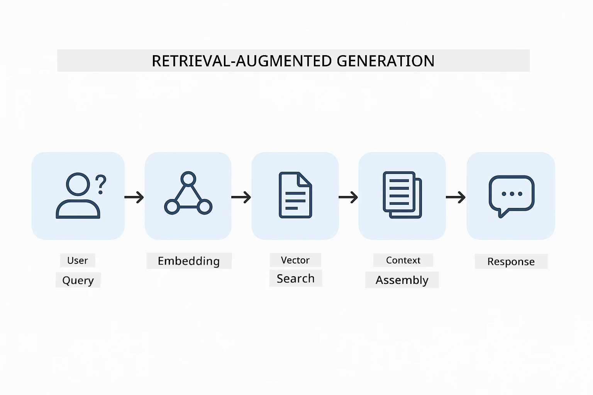
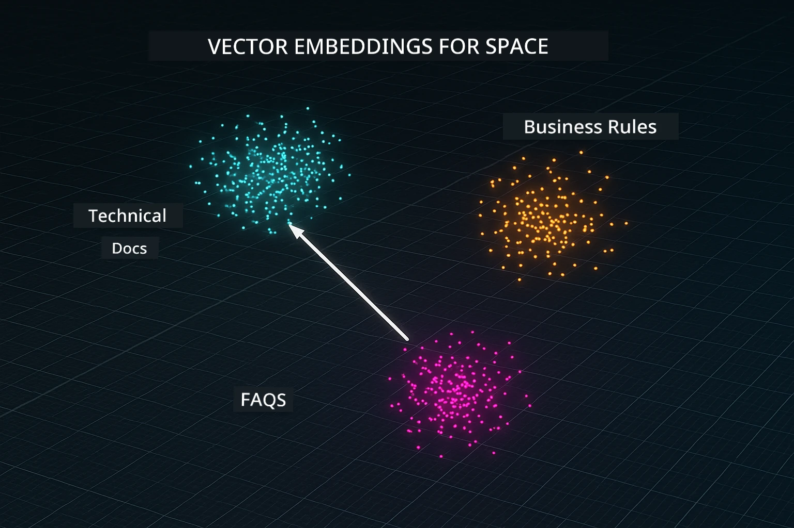
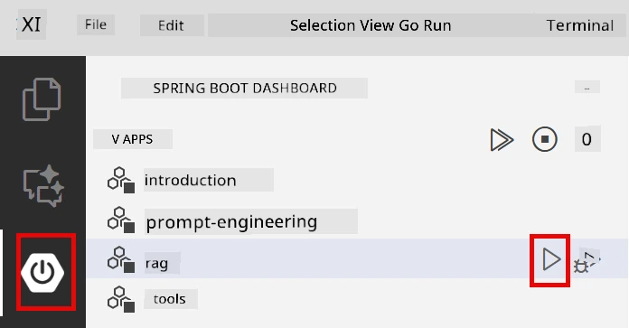
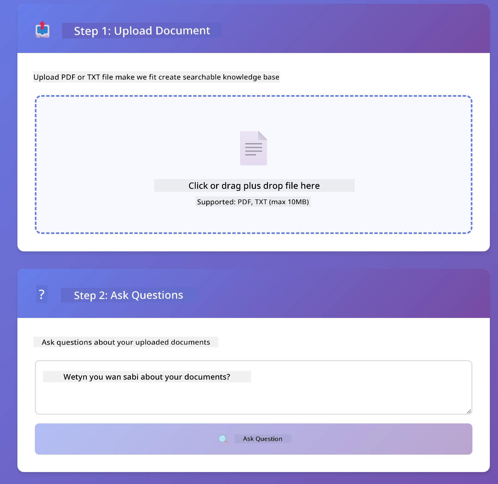
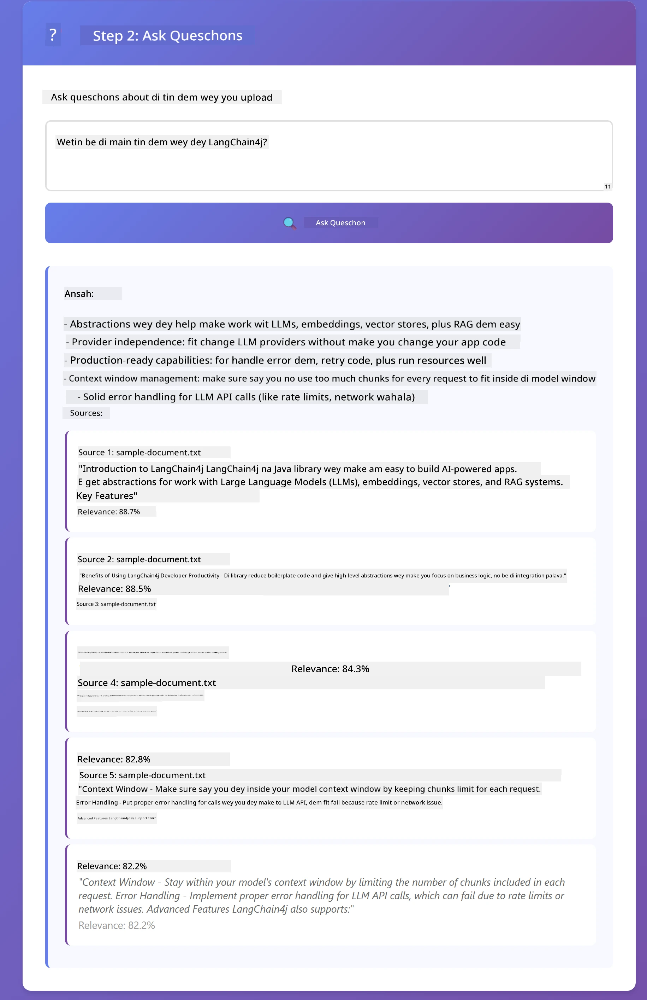

# Module 03: RAG (Retrieval-Augmented Generation)

## Table of Contents

- [Video Walkthrough](#video-walkthrough)
- [Wet In You Go Learn](#wet-in-you-go-learn)
- [Wet You Must Sabi Before](#prerequisites)
- [How You Go Take Understand RAG](#how-you-go-take-understand-rag)
  - [Which Kain RAG Dis Tutorial Dey Use?](#which-kain-rag-dis-tutorial-dey-use)
- [How E Dey Work](#how-e-dey-work)
  - [How You Go Take Process Document](#how-you-go-take-process-document)
  - [How You Go Take Do Embeddings](#how-you-go-take-do-embeddings)
  - [Semantic Search](#semantic-search)
  - [How You Go Take Generate Answer](#answer-generation)
- [How To Run The Application](#run-the-application)
- [How You Go Take Use The Application](#how-to-use-di-application)
  - [How You Go Take Upload Document](#upload-document)
  - [How You Go Take Ask Questions](#ask-questions)
  - [How You Go Take Check Source References](#check-source-references)
  - [How You Go Take Experiment With Questions](#experiment-wit-questions)
- [Important Concepts](#key-concepts)
  - [Chunking Strategy](#chunking-strategy)
  - [Similarity Scores](#similarity-scores)
  - [In-Memory Storage](#in-memory-storage)
  - [How You Go Take Manage Context Window](#context-window-management)
- [When RAG Get Importance](#when-rag-matters)
- [Next Steps](#next-steps)

## Video Walkthrough

Watch dis live session wey explain how to start dis module:

<a href="https://www.youtube.com/watch?v=_olq75ZH_eY"></a>

## Wet In You Go Learn

For the modules we done before, you don learn how to hold talk with AI and arrange your prompts well well. But one thing dey limit am: language models only sabi wetin dem learn during training. Dem no fit answer questions about your company policies, your project document, or any info wey dem no train with.

RAG (Retrieval-Augmented Generation) solve dis palava. Instead make you dey try teach the model your info (wey dey expensive and e no easy), you go give am power to search for your documents. When person ask question, the system go find relevant info come put am for the prompt. Then the model go answer base on that context wey e find.

Think am like say RAG dey give the model one reference library. When you ask question, the system:

1. **User Query** - You ask question  
2. **Embedding** - E con convert your question to vector  
3. **Vector Search** - E find document chunks wey similar  
4. **Context Assembly** - E add relevant chunks join the prompt  
5. **Response** - LLM go generate answer base on the context

This one make the model answer from your real data, no be only their training knowledge or just make answer.

## Prerequisites

- You don finish [Module 01 - Introduction](../01-introduction/README.md) (Azure OpenAI resources deploy finish, including `text-embedding-3-small` embedding model)  
- `.env` file dey for root folder with Azure credentials (you fit create am with `azd up` for Module 01)

> **Note:** If you never finish Module 01, abeg follow the deployment instructions for that one first. The `azd up` command go deploy both GPT chat model and embedding model wey dis module dey use.

## How You Go Take Understand RAG

The diagram we dey show below na the main idea: instead of trust only the model training data, RAG go give am one reference library of your documents to check before e generate answer.


*This diagram dey show difference between normal LLM (wey dey guess from training data) and RAG-enhanced LLM (wey go check your documents first).*

See how everything connect from beginning to end. User question flow pass for four stages — embedding, vector search, context assembly, and answer generation — each one dey build on the previous:



*This diagram show the whole RAG pipeline from start to finish — user question go through embedding, vector search, context assembly, and answer generation.*

The rest of this module go walk you through each stage well well, with code wey you fit run and change.

### Which Kain RAG Dis Tutorial Dey Use?

LangChain4j get three ways to implement RAG, each get different level of abstraction. See the diagram wey compare them side side:


*This diagram compare the three LangChain4j RAG ways — Easy, Native, and Advanced — showing their main parts and when you go use each one.*

| Approach | Wetin E Dey Do | Trade-off |
|---|---|---|
| **Easy RAG** | E wire everything automatically through `AiServices` and `ContentRetriever`. You just annotate interface, attach retriever, LangChain4j go handle embedding, searching, and prompt assembly for you. | Small code, but you no go see wetin dey happen for each step. |
| **Native RAG** | You dey call embedding model, search store, build prompt, and generate answer by yourself — one by one step. | More code, but every stage dey clear and you fit change am. |
| **Advanced RAG** | E use `RetrievalAugmentor` framework with plug-in query transformers, routers, re-rankers, and content injectors for production-level pipelines. | Maximum flexibility, but e get plenty complexity. |

**This tutorial na the Native way e dey use.** Every step for RAG pipeline — embedding the query, searching the vector store, assemble context, and generate answer — dey written clearly for [`RagService.java`](../../../03-rag/src/main/java/com/example/langchain4j/rag/service/RagService.java). Na on purpose e be like that: as learning resource, e better make you see and understand every step than to just minimize code. When you don sabi well how everything join, you fit move go Easy RAG for quick prototype or Advanced RAG for production.

> **💡 You curious about Easy RAG?** LangChain4j also get *Easy RAG* approach wey `AiServices` and `ContentRetriever` dey handle embedding, search, and prompt assemble automatically. But dis module wan show you the full detail path — break the pipeline open so you go fit see and control all the steps yourself.

Diagram below show Easy RAG pipeline. Notice how `AiServices` and `EmbeddingStoreContentRetriever` hide all the complexity — you just load document, attach retriever, and collect answers. The Native way for this module go break all that hidden steps open:


*This diagram dey show Easy RAG pipeline. Compare am with Native approach wey dey dis module: Easy RAG hide embedding, retrieval, and prompt assemble behind `AiServices` and `ContentRetriever` — you just load document, attach retriever, and get answers. Native method for dis module dey open the pipeline so you fit call each stage (embed, search, assemble context, generate) yourself, give you full view and control.*

## How E Dey Work

The RAG pipeline for this module break down into four stages wey dey run one after another every time user ask question. First, document wey you upload. E go **parse and chunk** am into small small pieces wey model fit handle. Then the chunks go convert to **vector embeddings** come store so dem fit compare mathematically. When query land, the system go do **semantic search** to find the chunks wey match pass, then pass am as context to LLM for **answer generation**. The sections below go explain each stage with code and diagrams. Make we start with first step.

### How You Go Take Process Document

[DocumentService.java](../../../03-rag/src/main/java/com/example/langchain4j/rag/service/DocumentService.java)

When you upload document, the system go parse am (PDF or plain text), attach some metadata like filename, then break am into chunks — small pieces wey go fit inside model's context window well. The chunks get small small overlap so you no lose context when e cut for the boundary.

```java
// Parse di uploaded file an wrap am inside LangChain4j Document
Document document = Document.from(content, metadata);

// Split am into 300-token chunks wit 30-token overlap
DocumentSplitter splitter = DocumentSplitters
    .recursive(300, 30);

List<TextSegment> segments = splitter.split(document);
```
  
Diagram below go show how e dey work for eye. See how each chunk share some tokens with the one beside am — the 30-token overlap make sure no important context waka disappear for between:


*This diagram dey show one document wey them split into 300-token chunks with 30-token overlap, so context for chunk boundary still dey.*

> **🤖 Try with [GitHub Copilot](https://github.com/features/copilot) Chat:** Open [`DocumentService.java`](../../../03-rag/src/main/java/com/example/langchain4j/rag/service/DocumentService.java) and ask:  
> - "How LangChain4j dey split document into chunks and why overlap matter?"  
> - "Wetin be best chunk size for different document types and why?"  
> - "How I fit handle document wey get many languages or special formatting?"  

### How You Go Take Do Embeddings

[LangChainRagConfig.java](../../../03-rag/src/main/java/com/example/langchain4j/rag/config/LangChainRagConfig.java)

Every chunk go convert into numerical form wey dem dey call embedding — na like meaning-to-numbers converter. The embedding model no be "intelligent" like chat model; e no fit obey instruction, reason, or answer questions. Wetin e fit do na map text into one mathematical space where similar meanings dey near each other — "car" near "automobile," "refund policy" near "return my money." Think am like say chat model na person wey you fit talk to; embedding model na correct filing system.

Diagram below go show this idea — text dey go in, numbers dey come out, and similar meanings dey produce vectors wey near each other:


*This diagram dey show how embedding model con convert text to numerical vectors, put similar meanings — like "car" and "automobile" — close for vector space.*

```java
@Bean
public EmbeddingModel embeddingModel() {
    return OpenAiOfficialEmbeddingModel.builder()
        .baseUrl(azureOpenAiEndpoint)
        .apiKey(azureOpenAiKey)
        .modelName(azureEmbeddingDeploymentName)
        .build();
}

EmbeddingStore<TextSegment> embeddingStore = 
    new InMemoryEmbeddingStore<>();
```
  
Class diagram below show two different flows inside RAG pipeline and LangChain4j classes wey implement dem. The **ingestion flow** (wey run once during upload) go split document, embed chunks, and store am with `.addAll()`. The **query flow** (wey run every time person ask question) go embed question, search store with `.search()`, then pass context matched to chat model. Both flows meet for shared `EmbeddingStore<TextSegment>` interface:


*This diagram show the two flows for RAG pipeline — ingestion and query — and how dem join through shared EmbeddingStore.*

After embeddings don store, similar content go naturally group together for vector space. Visualization below show how documents wey related topics get nearby points, na wetin make semantic search work:



*This picture dey show how related documents cluster together for 3D vector space, with topics like Technical Docs, Business Rules, and FAQs form their own groups.*

When person search, the system dey follow four steps: embed documents once, embed query every search, compare query vector to all stored vectors using cosine similarity, and return top-K chunks with highest scores. Diagram below go show each step and LangChain4j classes wey dey involved:


*This diagram go show embedding search four-step process: embed documents, embed query, compare vectors by cosine similarity, and return top-K results.*

### Semantic Search

[RagService.java](../../../03-rag/src/main/java/com/example/langchain4j/rag/service/RagService.java)

When you ask question, your question also go become embedding. System go compare your question embedding with all document chunks embeddings. E go find chunks wey get most similar meanings — no be only keyword wey match, but real semantic similarity.

```java
Embedding queryEmbedding = embeddingModel.embed(question).content();

EmbeddingSearchRequest searchRequest = EmbeddingSearchRequest.builder()
    .queryEmbedding(queryEmbedding)
    .maxResults(5)
    .minScore(0.5)
    .build();

EmbeddingSearchResult<TextSegment> searchResult = embeddingStore.search(searchRequest);
List<EmbeddingMatch<TextSegment>> matches = searchResult.matches();

for (EmbeddingMatch<TextSegment> match : matches) {
    String relevantText = match.embedded().text();
    double score = match.score();
}
```
  
Diagram below go show difference between semantic search and normal keyword search. Keyword search for "vehicle" no go find chunk about "cars and trucks," but semantic search sabi say dem mean one thing, so e go return am as high match:


*This diagram dey compare keyword search to semantic search, showing how semantic search fit find related content even if keywords no the same.*

Under the hood, similarity na to measure with cosine similarity — na to ask "make we see if these two arrows dey point the same way?" Two chunks fit use different words, but if their meaning same, their vectors go point same way and score close to 1.0:


*Dis diagram dey show cosine similarity as di angle between embedding vectors — di vectors wey align well go score closer to 1.0, wey mean say dem get high semantic similarity.*

> **🤖 Try wit [GitHub Copilot](https://github.com/features/copilot) Chat:** Open [`RagService.java`](../../../03-rag/src/main/java/com/example/langchain4j/rag/service/RagService.java) come ask:
> - "How similarity search dey work wit embeddings and wetin dey determine di score?"
> - "Wetin be di similarity threshold way I go use and how e dey affect di results?"
> - "How I go take handle cases wey no relevant documents dey found?"

### Answer Generation

[RagService.java](../../../03-rag/src/main/java/com/example/langchain4j/rag/service/RagService.java)

Di most relevant chunks na dem dem put together inside structured prompt wey get explicit instructions, di retrieved context, and di user question. Di model go read those particular chunks come answer based on wetin dey that information — e fit only use wetin dey front of am, wey go prevent am from hallucination.

```java
String context = matches.stream()
    .map(match -> match.embedded().text())
    .collect(Collectors.joining("\n\n"));

String prompt = String.format("""
    Answer the question based on the following context.
    If the answer cannot be found in the context, say so.

    Context:
    %s

    Question: %s

    Answer:""", context, request.question());

String answer = chatModel.chat(prompt);
```

Di diagram wey dey down show how dis assembly dey work — di top-scoring chunks wey come from di search step dem dey put inside di prompt template, and di `OpenAiOfficialChatModel` dey generate grounded answer:


*Dis diagram dey show how dem take gather di top-scoring chunks inside structured prompt, wey allow di model to generate grounded answer from your data.*

## Run the Application

**Make sure say deployment dey valid:**

Confirm say `.env` file dey for root directory wit Azure credentials (wey dem create during Module 01). Run dis for di module directory (`03-rag/`):

**Bash:**
```bash
cat ../.env  # E suppose show AZURE_OPENAI_ENDPOINT, API_KEY, DEPLOYMENT
```

**PowerShell:**
```powershell
Get-Content ..\.env  # E suppose show AZURE_OPENAI_ENDPOINT, API_KEY, DEPLOYMENT
```

**Start di application:**

> **Note:** If you don already start all applications using `./start-all.sh` from root directory (as per Module 01), dis module don dey run for port 8081. You fit skip di start commands below come go http://localhost:8081 direct.

**Option 1: Use Spring Boot Dashboard (Na di one wey VS Code users suppose use)**

Di dev container get Spring Boot Dashboard extension, wey provide visual interface to manage all Spring Boot applications. You fit find am for Activity Bar for di left side inside VS Code (look out for di Spring Boot icon).

From di Spring Boot Dashboard, you fit:
- See all Spring Boot applications wey dey for di workspace
- Start/stop applications with just one click
- View application logs anytime
- Monitor application status

Just click di play button beside "rag" to start dis module, or start all modules at once.



*Dis screenshot dey show Spring Boot Dashboard inside VS Code, wey you fit start, stop, and dey monitor applications visually.*

**Option 2: Use shell scripts**

Start all web applications (modules 01-04):

**Bash:**
```bash
cd ..  # From root directory
./start-all.sh
```

**PowerShell:**
```powershell
cd ..  # From di top folder
.\start-all.ps1
```

Or start just dis module:

**Bash:**
```bash
cd 03-rag
./start.sh
```

**PowerShell:**
```powershell
cd 03-rag
.\start.ps1
```

Both scripts go automatically load environment variables from root `.env` file and go build di JARs if dem no dey.

> **Note:** If you wan build all modules manually before you start:
>
> **Bash:**
> ```bash
> cd ..  # Go to root directory
> mvn clean package -DskipTests
> ```
>
> **PowerShell:**
> ```powershell
> cd ..  # Go to root directory
> mvn clean package -DskipTests
> ```

Open http://localhost:8081 for your browser.

**To stop am:**

**Bash:**
```bash
./stop.sh  # Dis module only
# Or
cd .. && ./stop-all.sh  # All di modules
```

**PowerShell:**
```powershell
.\stop.ps1  # Dis module only
# Or
cd ..; .\stop-all.ps1  # All modules
```

## How to Use di Application

Di application get web interface wey you fit upload document come ask question.

<a href="images/rag-homepage.png"></a>

*Dis screenshot dey show RAG application interface wey you fit upload documents and ask questions.*

### Upload Document

Begin by uploading document - TXT files go best for testing. We don provide `sample-document.txt` inside dis directory wey get info about LangChain4j features, RAG implementation, and best practices - perfect for testing di system.

Di system go process your document, break am into chunks, then create embeddings for each chunk. Dis one dey automatic when you upload.

### Ask Questions

Now, ask specific questions about di document content. Try ask something wey factual and wey clear for di document. Di system go search relevant chunks, include dem inside di prompt, then generate answer.

### Check Source References

You go notice say each answer get source references with similarity scores. Di scores (0 to 1) dey show how relevant each chunk be to your question. Higher scores mean say e better match. Dis one go help you verify answer with source material.

<a href="images/rag-query-results.png"></a>

*Dis screenshot dey show query results wit di generated answer, source references, and relevance scores for every chunk wey dem retrieve.*

### Experiment wit Questions

Try different kind questions:
- Specific facts: "Wetin be di main topic?"
- Comparisons: "Wetin be di difference between X and Y?"
- Summaries: "Summarize di key points about Z"

Watch how di relevance scores dey change based on how your question dey match document content.

## Key Concepts

### Chunking Strategy

Documents dem dey split into 300-token chunks wit 30 tokens overlap. Dis balance dey make sure say each chunk get enough context to make sense but still small to fit plenty chunks inside one prompt.

### Similarity Scores

Every retrieved chunk dey come wit similarity score between 0 and 1 wey mean how close e match user question. Di diagram below dey show di score ranges and how di system dey use dem to filter results:


*Dis diagram dey show score ranges from 0 to 1, wit minimum threshold of 0.5 wey dey filter out irrelevant chunks.*

Scores dey range from 0 to 1:
- 0.7-1.0: Highly relevant, exact match
- 0.5-0.7: Relevant, good context
- Below 0.5: Filtered out, too different

Di system go only retrieve chunks wey above di minimum threshold to guarantee quality.

Embeddings dey work well when meaning cluster clean, but dem get blind spots. Di diagram below show common failure modes — chunks wey too big dey produce muddy vectors, chunks wey too small no get context, ambiguous terms fit point to many clusters, and exact-match lookups (IDs, part numbers) no work with embeddings at all:


*Dis diagram dey show common embedding failure modes: chunks wey too big, chunks wey too small, ambiguous terms wey fit mean many clusters, and exact-match lookups like IDs.*

### In-Memory Storage

Dis module dey use in-memory storage for simplicity. Once you restart di application, uploaded documents go lost. Production systems dey use persistent vector databases like Qdrant or Azure AI Search.

### Context Window Management

Each model get maximum context window. You no fit include every chunk from big document. Di system go retrieve top N most relevant chunks (default na 5) to stay within limit but still provide enough context for correct answers.

## When RAG Matters

RAG no always be di correct way. Di decision guide below go help you sabi when RAG go add value versus when simpler ways — like include content direct inside prompt or depend on di model own built-in knowledge — go sufice:


*Dis diagram dey show decision guide for when RAG add value versus when simpler ways go sufice.*

## Next Steps

**Next Module:** [04-tools - AI Agents with Tools](../04-tools/README.md)

---

**Navigation:** [← Previous: Module 02 - Prompt Engineering](../02-prompt-engineering/README.md) | [Back to Main](../README.md) | [Next: Module 04 - Tools →](../04-tools/README.md)

---

<!-- CO-OP TRANSLATOR DISCLAIMER START -->
**Disclaimer**:
Dis document don translate wit AI translation service [Co-op Translator](https://github.com/Azure/co-op-translator). Even tho we dey try make am correct, abeg make you know say automated translation fit get errors or mistakes. Di original document for dia own language na im be di correct source. For important info, make person wey sabi human translation do am. We no go responsible for any misunderstanding or wrong understanding wey fit happen because of dis translation.
<!-- CO-OP TRANSLATOR DISCLAIMER END -->