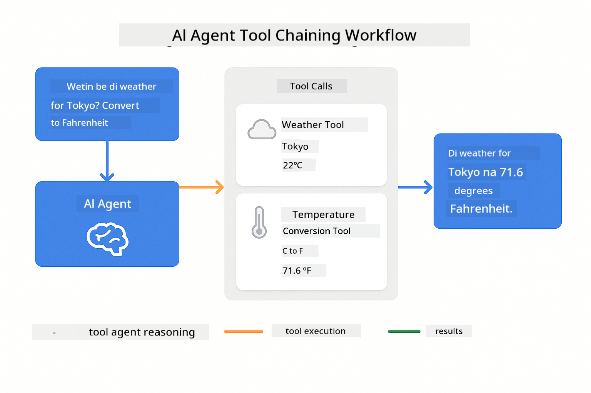

<!--
CO_OP_TRANSLATOR_METADATA:
{
  "original_hash": "844788938b26242f3cc54ce0d0951bea",
  "translation_date": "2026-01-06T02:08:49+00:00",
  "source_file": "04-tools/README.md",
  "language_code": "pcm"
}
-->
# Module 04: AI Agents wit Tools

## Table of Contents

- [Wetin You Go Learn](../../../04-tools)
- [Prerequisites](../../../04-tools)
- [Understanding AI Agents wit Tools](../../../04-tools)
- [How Tool Calling Dey Work](../../../04-tools)
  - [Tool Definitions](../../../04-tools)
  - [Decision Making](../../../04-tools)
  - [Execution](../../../04-tools)
  - [Response Generation](../../../04-tools)
- [Tool Chaining](../../../04-tools)
- [Run di Application](../../../04-tools)
- [Using di Application](../../../04-tools)
  - [Try Simple Tool Usage](../../../04-tools)
  - [Test Tool Chaining](../../../04-tools)
  - [See Conversation Flow](../../../04-tools)
  - [Experiment wit Different Requests](../../../04-tools)
- [Key Concepts](../../../04-tools)
  - [ReAct Pattern (Reasoning and Acting)](../../../04-tools)
  - [Tool Descriptions Matter](../../../04-tools)
  - [Session Management](../../../04-tools)
  - [Error Handling](../../../04-tools)
- [Available Tools](../../../04-tools)
- [When to Use Tool-Based Agents](../../../04-tools)
- [Next Steps](../../../04-tools)

## Wetin You Go Learn

So far, you don learn how to get conversation wit AI, how to structure prompts well well, and ground responses for your documents. But still e get one big wahala: language models fit only generate text. Dem no fit check weather, do calculations, query databases, or interact wit other systems.

Tools dey change dis. When you give di model access to functions wey e fit call, you go transform am from text generator go agent wey fit do actions. Di model go decide wen e need tool, which tool to use, and wetin parameters to pass. Your code go run di function and return di result. Di model go put dat result inside e response.

## Prerequisites

- Finish Module 01 (Azure OpenAI resources dey deployed)
- `.env` file dey root directory wit Azure credentials (dem create am for `azd up` for Module 01)

> **Note:** If you never finish Module 01, follow di deployment instructions for there first.

## Understanding AI Agents wit Tools

> **📝 Note:** Di term "agents" for dis module mean AI assistants wey get tool-calling powers. E different from di **Agentic AI** patterns (autonomous agents wey get planning, memory, and multi-step reasoning) we go cover for [Module 05: MCP](../05-mcp/README.md).

AI agent wey get tools follow reasoning and acting pattern (ReAct):

1. User ask question
2. Agent reason about wetin e need to sabi
3. Agent decide if e need tool to answer
4. If yes, agent go call di correct tool wit di right parameters
5. Tool go run and return data
6. Agent go add di result and give final answer


*Di ReAct pattern - how AI agents dey alternate between reasoning and acting to solve palava*

Dis one dey happen automatic. You go define di tools and their descriptions. Di model dey handle di decision-making about when and how to use dem.

## How Tool Calling Dey Work

### Tool Definitions

[WeatherTool.java](../../../04-tools/src/main/java/com/example/langchain4j/agents/tools/WeatherTool.java) | [TemperatureTool.java](../../../04-tools/src/main/java/com/example/langchain4j/agents/tools/TemperatureTool.java)

You go define functions wit clear descriptions and parameter specs. Di model go see those descriptions for e system prompt and understand wetin each tool dey do.

```java
@Component
public class WeatherTool {
    
    @Tool("Get the current weather for a location")
    public String getCurrentWeather(@P("Location name") String location) {
        // Your weather lookup logic
        return "Weather in " + location + ": 22°C, cloudy";
    }
}

@AiService
public interface Assistant {
    String chat(@MemoryId String sessionId, @UserMessage String message);
}

// Assistant dey automatically connect by Spring Boot wit:
// - ChatModel bean
// - All @Tool methods from @Component classes
// - ChatMemoryProvider for session management
```

> **🤖 Try wit [GitHub Copilot](https://github.com/features/copilot) Chat:** Open [`WeatherTool.java`](../../../04-tools/src/main/java/com/example/langchain4j/agents/tools/WeatherTool.java) and ask:
> - "How I fit integrate real weather API like OpenWeatherMap instead of mock data?"
> - "Wetin be beta tool description wey fit help AI use am correct?"
> - "How I go handle API errors and rate limits for tool implementation?"

### Decision Making

When user ask "Wetin be weather for Seattle?", di model go recognize say e need weather tool. E go generate function call wit location parameter set to "Seattle".

### Execution

[AgentService.java](../../../04-tools/src/main/java/com/example/langchain4j/agents/service/AgentService.java)

Spring Boot auto-wires di declarative `@AiService` interface wit all di registered tools, and LangChain4j go run di tool calls automatic.

> **🤖 Try wit [GitHub Copilot](https://github.com/features/copilot) Chat:** Open [`AgentService.java`](../../../04-tools/src/main/java/com/example/langchain4j/agents/service/AgentService.java) and ask:
> - "How ReAct pattern work and why e dey effective for AI agents?"
> - "How agent dey decide which tool to use and for which order?"
> - "Wetin happen if tool execution fail - how I fit handle errors well?"

### Response Generation

Di model go receive di weather data and format am into natural language response for the user.

### Why You Go Use Declarative AI Services?

Dis module dey use LangChain4j Spring Boot integration wit declarative `@AiService` interfaces:

- **Spring Boot auto-wiring** - ChatModel and tools dey auto inject
- **@MemoryId pattern** - Automatic session-based memory management
- **Single instance** - Assistant create once and dem reuse am for better performance
- **Type-safe execution** - Java methods go call direct wit type conversion
- **Multi-turn orchestration** - Dey handle tool chaining automatic
- **Zero boilerplate** - No need manual AiServices.builder() calls or memory HashMap

Other ways (manual `AiServices.builder()`) go need more code and miss Spring Boot integration beta things.

## Tool Chaining

**Tool Chaining** - AI fit call plenty tools one after another. Ask "Wetin be weather for Seattle and I suppose bring umbrella?" and go see say e link `getCurrentWeather` wit reason for rain cloth.

<a href="images/tool-chaining.png"></a>

*Tools call one after another - tool output dey feed next decision*

**Graceful Failures** - Ask for weather for city wey no dey di mock data. Di tool go return error message, and di AI go talk say e no fit help. Tools dey fail safely.

Dis one dey happen for one conversation turn. Di agent dey control plenty tool calls by itself.

## Run di Application

**Check deployment:**

Make sure `.env` file dey root directory wit Azure credentials (dem create am during Module 01):
```bash
cat ../.env  # E suppose show AZURE_OPENAI_ENDPOINT, API_KEY, DEPLOYMENT
```

**Start di application:**

> **Note:** If you don already start all applications wit `./start-all.sh` from Module 01, this module don dey run for port 8084. You fit skip di start commands below and waka straight go http://localhost:8084.

**Option 1: Using Spring Boot Dashboard (Recommended for VS Code users)**

Di dev container get Spring Boot Dashboard extension, wey dey give visual interface to manage all Spring Boot applications. You fit find am for Activity Bar left side for VS Code (look for Spring Boot icon).

From Spring Boot Dashboard, you fit:
- See all Spring Boot applications for di workspace
- Start/stop applications wit one click
- View application logs in real-time
- Monitor application status

Just click play button near "tools" to start dis module, or start all modules one time.


**Option 2: Using shell scripts**

Start all web applications (modules 01-04):

**Bash:**
```bash
cd ..  # From root folder
./start-all.sh
```

**PowerShell:**
```powershell
cd ..  # From root directory
.\start-all.ps1
```

Or start just dis module:

**Bash:**
```bash
cd 04-tools
./start.sh
```

**PowerShell:**
```powershell
cd 04-tools
.\start.ps1
```

Both scripts go load environment variables from root `.env` file and build JARs if no dey.

> **Note:** If you want build all modules manually before start:
>
> **Bash:**
> ```bash
> cd ..  # Go to root directory
> mvn clean package -DskipTests
> ```
>
> **PowerShell:**
> ```powershell
> cd ..  # Go to root directory
> mvn clean package -DskipTests
> ```

Open http://localhost:8084 for your browser.

**To stop:**

**Bash:**
```bash
./stop.sh  # Dis module only
# Or
cd .. && ./stop-all.sh  # All modules
```

**PowerShell:**
```powershell
.\stop.ps1  # Dis module only
# Or
cd ..; .\stop-all.ps1  # All di modules
```

## Using di Application

Di application get web interface wey you fit interact wit AI agent wey get access to weather and temperature conversion tools.

<a href="images/tools-homepage.png"></a>

*AI Agent Tools interface - quick examples and chat interface to interact wit tools*

### Try Simple Tool Usage

Start wit simple request: "Convert 100 degrees Fahrenheit to Celsius". Di agent go recognize say e need temperature conversion tool, call am wit right parameters, then return di result. Notice how natural e feel - you no need talk which tool to use or how to call am.

### Test Tool Chaining

Now try something wey get more steps: "Wetin be weather for Seattle and convert am to Fahrenheit?" Watch di agent run am step by step. First e go get weather (wey dey return Celsius), then e go know say e need convert to Fahrenheit, e call conversion tool, and join both results into one answer.

### See Conversation Flow

Di chat interface dey keep conversation history, so you fit dey do multi-turn interactions. You fit see all previous questions and answers, e easy to follow di conversation and understand how di agent dey build context wit many exchanges.

<a href="images/tools-conversation-demo.png"></a>

*Multi-turn conversation showing simple conversions, weather lookups, and tool chaining*

### Experiment wit Different Requests

Try different combinations:
- Weather lookups: "Wetin be weather for Tokyo?"
- Temperature conversions: "Wetin be 25°C for Kelvin?"
- Combined queries: "Check weather for Paris and tell me if e pass 20°C"

Notice how di agent dey interpret natural language and map am to correct tool calls.

## Key Concepts

### ReAct Pattern (Reasoning and Acting)

Di agent dey switch between reasoning (decide wetin to do) and acting (use tools). Dis pattern dey help for autonomous problem solving no be just to respond instructions.

### Tool Descriptions Matter

How you describe your tools dey important because e dey affect how well di agent go use dem. Clear and specific descriptions go help di model sabi wen and how to call each tool.

### Session Management

`@MemoryId` annotation dey enable automatic session-based memory management. Each session ID get e own `ChatMemory` wey di `ChatMemoryProvider` bean dey manage, so no need chase memory manually.

### Error Handling

Tools fit fail - APIs fit timeout, parameters fit be wrong, external services go down. Production agents need error handling so di model fit explain wahala or try other options.

## Available Tools

**Weather Tools** (mock data for demo):
- Get current weather for location
- Get multi-day forecast

**Temperature Conversion Tools**:
- Celsius to Fahrenheit
- Fahrenheit to Celsius
- Celsius to Kelvin
- Kelvin to Celsius
- Fahrenheit to Kelvin
- Kelvin to Fahrenheit

Dis na simple examples but di pattern fit extend to any function: database queries, API calls, calculations, file operations, or system commands.

## When to Use Tool-Based Agents

**Use tools when:**
- Answering need real-time data (weather, stock prices, inventory)
- You need do calculations wey pass simple math
- Access databases or APIs
- Take actions (send emails, create tickets, update records)
- Combine multiple data sources

**No use tools when:**
- Questions fit answer from general knowledge
- Response na just conversational
- Tool latency go make experience too slow

## Next Steps

**Next Module:** [05-mcp - Model Context Protocol (MCP)](../05-mcp/README.md)

---

**Navigation:** [← Previous: Module 03 - RAG](../03-rag/README.md) | [Back to Main](../README.md) | [Next: Module 05 - MCP →](../05-mcp/README.md)

---

<!-- CO-OP TRANSLATOR DISCLAIMER START -->
**Disclaimer**:
Dis document don translate with AI translation service wey dem dey call [Co-op Translator](https://github.com/Azure/co-op-translator). Even though we try make am correct, abeg understand say automated translation fit get some mistake or no too clear. Di ogbonge original document wey e dey for e own language na im suppose be di true source. If na serious matter, e better make person wey sabi human translation help you. We no go responsible if person no understand well or make wrong meaning because of dis translation.
<!-- CO-OP TRANSLATOR DISCLAIMER END -->