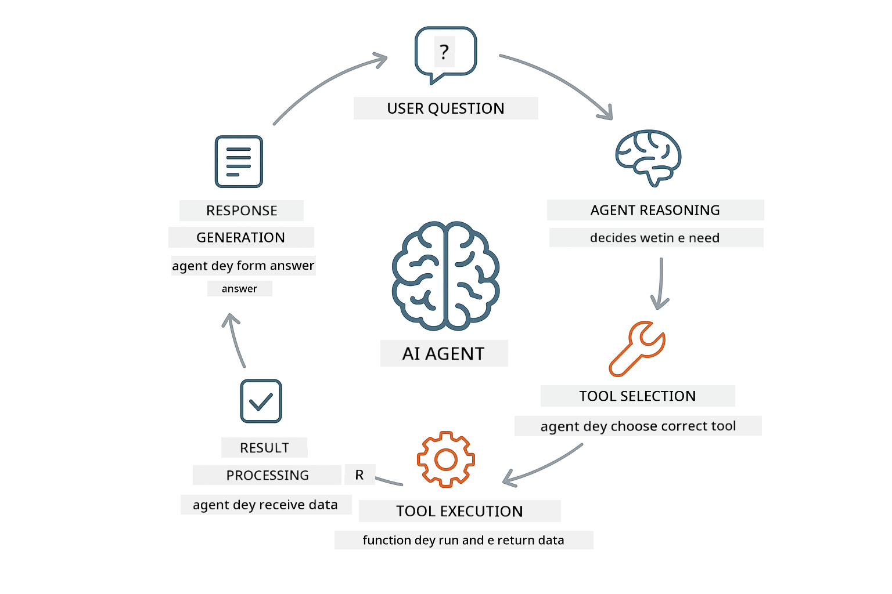
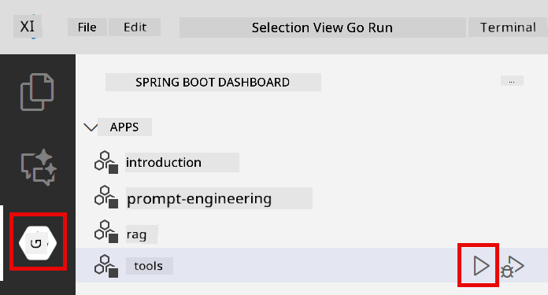
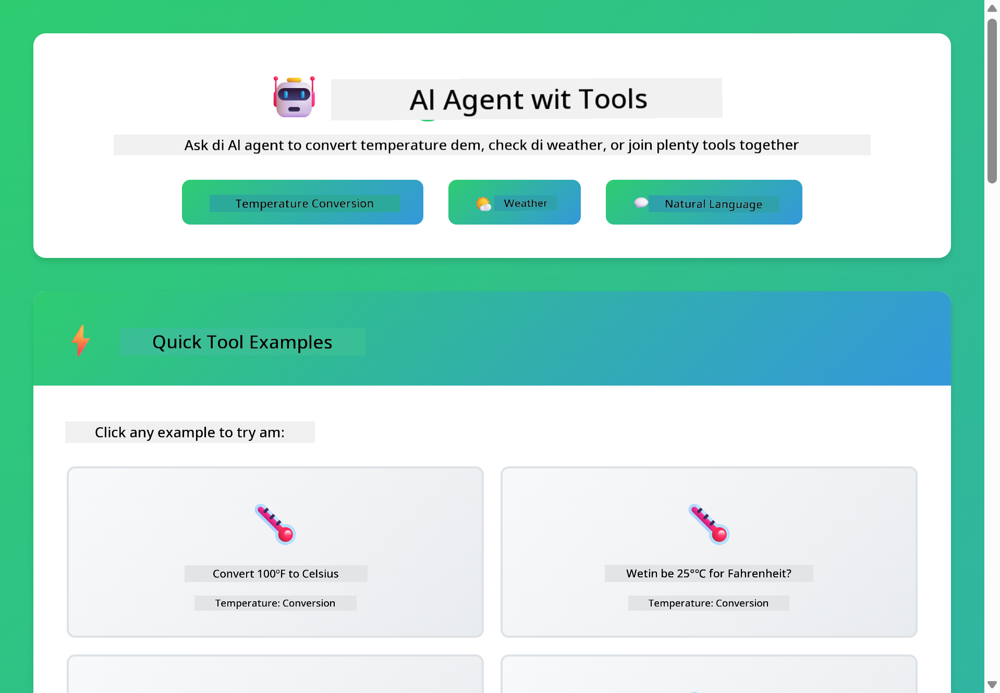
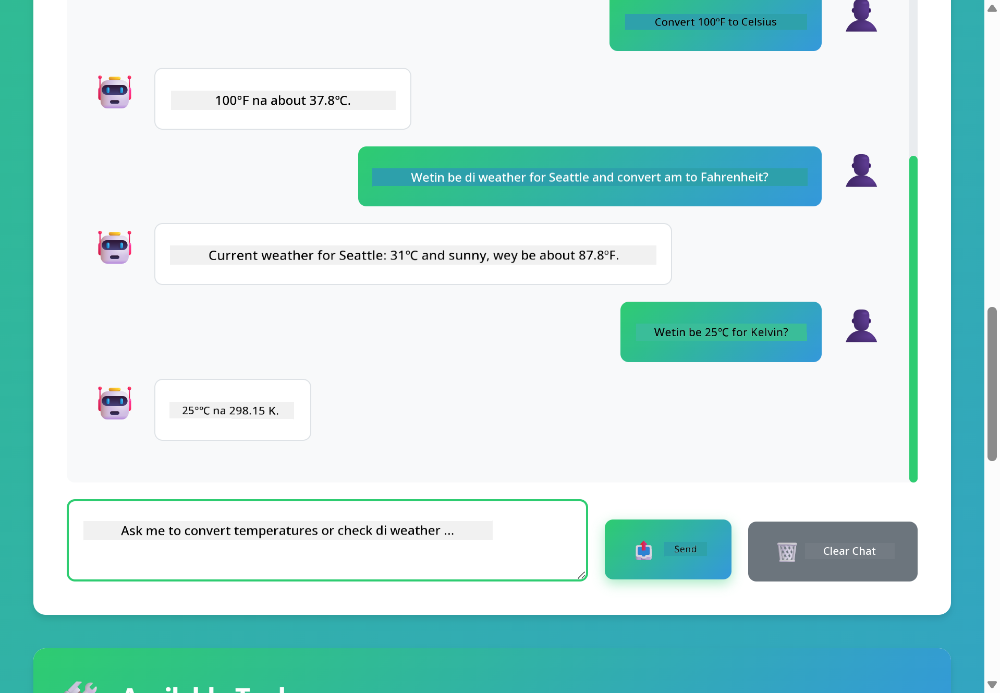

<!--
CO_OP_TRANSLATOR_METADATA:
{
  "original_hash": "aa23f106e7f53270924c9dd39c629004",
  "translation_date": "2025-12-13T19:42:24+00:00",
  "source_file": "04-tools/README.md",
  "language_code": "pcm"
}
-->
# Module 04: AI Agents wit Tools

## Table of Contents

- [Wetyn You Go Learn](../../../04-tools)
- [Prerequisites](../../../04-tools)
- [Understanding AI Agents wit Tools](../../../04-tools)
- [How Tool Calling Dey Work](../../../04-tools)
  - [Tool Definitions](../../../04-tools)
  - [Decision Making](../../../04-tools)
  - [Execution](../../../04-tools)
  - [Response Generation](../../../04-tools)
- [Tool Chaining](../../../04-tools)
- [Run di Application](../../../04-tools)
- [Using di Application](../../../04-tools)
  - [Try Simple Tool Usage](../../../04-tools)
  - [Test Tool Chaining](../../../04-tools)
  - [See Conversation Flow](../../../04-tools)
  - [Observe di Reasoning](../../../04-tools)
  - [Experiment wit Different Requests](../../../04-tools)
- [Key Concepts](../../../04-tools)
  - [ReAct Pattern (Reasoning and Acting)](../../../04-tools)
  - [Tool Descriptions Matter](../../../04-tools)
  - [Session Management](../../../04-tools)
  - [Error Handling](../../../04-tools)
- [Available Tools](../../../04-tools)
- [When to Use Tool-Based Agents](../../../04-tools)
- [Next Steps](../../../04-tools)

## Wetyn You Go Learn

So far, you don learn how to dey talk wit AI, how to arrange prompts well well, and how to base responses for your documents. But one big wahala still dey: language models fit only generate text. Dem no fit check weather, do calculations, query databases, or interact wit other systems.

Tools dey change dis. If you give di model access to functions wey e fit call, you go turn am from text generator to agent wey fit take action. Di model go decide wen e need tool, which tool to use, and wetin parameters to pass. Your code go run di function and return di result. Di model go put dat result inside e response.

## Prerequisites

- You don finish Module 01 (Azure OpenAI resources don deploy)
- `.env` file dey root directory wit Azure credentials (e dey create by `azd up` for Module 01)

> **Note:** If you never finish Module 01, abeg follow di deployment instructions wey dey there first.

## Understanding AI Agents wit Tools

AI agent wey get tools dey follow one reasoning and acting pattern (ReAct):

1. User go ask question
2. Agent go reason about wetin e need know
3. Agent go decide if e need tool to answer
4. If yes, agent go call di correct tool wit correct parameters
5. Tool go run and return data
6. Agent go put di result join and give final answer



*Di ReAct pattern - how AI agents dey waka between reasoning and acting to solve problems*

Dis one dey happen automatically. You go define di tools and their descriptions. Di model go handle di decision-making about wen and how to use dem.

## How Tool Calling Dey Work

**Tool Definitions** - [WeatherTool.java](../../../04-tools/src/main/java/com/example/langchain4j/agents/tools/WeatherTool.java) | [TemperatureTool.java](../../../04-tools/src/main/java/com/example/langchain4j/agents/tools/TemperatureTool.java)

You go define functions wit clear descriptions and parameter specifications. Di model go see these descriptions for e system prompt and understand wetin each tool dey do.

```java
@Component
public class WeatherTool {
    
    @Tool("Get the current weather for a location")
    public String getCurrentWeather(@P("Location name") String location) {
        // Your weather lookup logic
        return "Weather in " + location + ": 22°C, cloudy";
    }
}

@AiService
public interface Assistant {
    String chat(@MemoryId String sessionId, @UserMessage String message);
}

// Assistant dey automatically connect by Spring Boot wit:
// - ChatModel bean
// - All @Tool methods from @Component classes
// - ChatMemoryProvider for session management
```

> **🤖 Try wit [GitHub Copilot](https://github.com/features/copilot) Chat:** Open [`WeatherTool.java`](../../../04-tools/src/main/java/com/example/langchain4j/agents/tools/WeatherTool.java) and ask:
> - "How I go take integrate real weather API like OpenWeatherMap instead of mock data?"
> - "Wetin make good tool description wey go help AI use am correct?"
> - "How I go handle API errors and rate limits for tool implementations?"

**Decision Making**

When user ask "How weather be for Seattle?", di model go sabi say e need weather tool. E go generate function call wit location parameter set to "Seattle".

**Execution** - [AgentService.java](../../../04-tools/src/main/java/com/example/langchain4j/agents/service/AgentService.java)

Spring Boot auto-wires di declarative `@AiService` interface wit all registered tools, and LangChain4j dey run tool calls automatically.

> **🤖 Try wit [GitHub Copilot](https://github.com/features/copilot) Chat:** Open [`AgentService.java`](../../../04-tools/src/main/java/com/example/langchain4j/agents/service/AgentService.java) and ask:
> - "How di ReAct pattern dey work and why e dey effective for AI agents?"
> - "How di agent dey decide which tool to use and for which order?"
> - "Wetin go happen if tool execution fail - how I go handle errors well well?"

**Response Generation**

Di model go receive di weather data and format am into natural language response for user.

### Why Use Declarative AI Services?

Dis module dey use LangChain4j's Spring Boot integration wit declarative `@AiService` interfaces:

- **Spring Boot auto-wiring** - ChatModel and tools dey automatically inject
- **@MemoryId pattern** - Automatic session-based memory management
- **Single instance** - Assistant create once and dem dey reuse am for better performance
- **Type-safe execution** - Java methods dey call directly wit type conversion
- **Multi-turn orchestration** - E dey handle tool chaining automatically
- **Zero boilerplate** - No need manual AiServices.builder() calls or memory HashMap

Other ways (manual `AiServices.builder()`) go need more code and no get Spring Boot integration benefits.

## Tool Chaining

**Tool Chaining** - AI fit call many tools one after another. If you ask "How weather be for Seattle and I suppose carry umbrella?" e go chain `getCurrentWeather` wit reasoning about rain gear.

<a href="images/tool-chaining.png"></a>

*Sequential tool calls - one tool output dey feed di next decision*

**Graceful Failures** - If you ask for weather for city wey no dey mock data, di tool go return error message, and AI go explain say e no fit help. Tools dey fail safely.

Dis one dey happen for one conversation turn. Di agent dey manage many tool calls by itself.

## Run di Application

**Make sure deployment dey:**

Make sure `.env` file dey root directory wit Azure credentials (e create during Module 01):
```bash
cat ../.env  # E suppose show AZURE_OPENAI_ENDPOINT, API_KEY, DEPLOYMENT
```

**Start di application:**

> **Note:** If you don start all applications wit `./start-all.sh` from Module 01, dis module don dey run for port 8084. You fit skip di start commands below and go straight to http://localhost:8084.

**Option 1: Using Spring Boot Dashboard (Recommended for VS Code users)**

Di dev container get Spring Boot Dashboard extension, wey get visual interface to manage all Spring Boot applications. You fit find am for Activity Bar for left side of VS Code (look for Spring Boot icon).

From Spring Boot Dashboard, you fit:
- See all Spring Boot applications wey dey workspace
- Start/stop applications wit one click
- View application logs for real-time
- Monitor application status

Just click di play button beside "tools" to start dis module, or start all modules at once.



**Option 2: Using shell scripts**

Start all web applications (modules 01-04):

**Bash:**
```bash
cd ..  # From root directory
./start-all.sh
```

**PowerShell:**
```powershell
cd ..  # From root directory
.\start-all.ps1
```

Or start just dis module:

**Bash:**
```bash
cd 04-tools
./start.sh
```

**PowerShell:**
```powershell
cd 04-tools
.\start.ps1
```

Both scripts go automatically load environment variables from root `.env` file and go build di JARs if dem no dey.

> **Note:** If you want build all modules manually before start:
>
> **Bash:**
> ```bash
> cd ..  # Go to root directory
> mvn clean package -DskipTests
> ```
>
> **PowerShell:**
> ```powershell
> cd ..  # Go to root directory
> mvn clean package -DskipTests
> ```

Open http://localhost:8084 for your browser.

**To stop:**

**Bash:**
```bash
./stop.sh  # Dis module only
# Or
cd .. && ./stop-all.sh  # All di modules
```

**PowerShell:**
```powershell
.\stop.ps1  # Dis module only
# Or
cd ..; .\stop-all.ps1  # All di modules
```

## Using di Application

Di application get web interface wey you fit interact wit AI agent wey get access to weather and temperature conversion tools.

<a href="images/tools-homepage.png"></a>

*Di AI Agent Tools interface - quick examples and chat interface to interact wit tools*

**Try Simple Tool Usage**

Start wit simple request: "Convert 100 degrees Fahrenheit to Celsius". Di agent go sabi say e need temperature conversion tool, e go call am wit correct parameters, then return di result. You go notice how natural e be - you no talk which tool to use or how to call am.

**Test Tool Chaining**

Try something wey complex: "How weather be for Seattle and convert am to Fahrenheit?" Watch di agent work am step by step. E first get di weather (wey dey Celsius), e sabi say e need convert to Fahrenheit, e call di conversion tool, then combine both results into one response.

**See Conversation Flow**

Di chat interface dey keep conversation history, so you fit get multi-turn interactions. You fit see all previous questions and answers, e make am easy to track di conversation and understand how di agent dey build context over many exchanges.

<a href="images/tools-conversation-demo.png"></a>

*Multi-turn conversation wey show simple conversions, weather lookups, and tool chaining*

**Experiment wit Different Requests**

Try different combinations:
- Weather lookups: "How weather be for Tokyo?"
- Temperature conversions: "How much be 25°C for Kelvin?"
- Combined queries: "Check weather for Paris and tell me if e pass 20°C"

You go notice how di agent dey interpret natural language and map am to correct tool calls.

## Key Concepts

**ReAct Pattern (Reasoning and Acting)**

Di agent dey waka between reasoning (deciding wetin to do) and acting (using tools). Dis pattern dey enable autonomous problem-solving instead of just responding to instructions.

**Tool Descriptions Matter**

How you describe your tools go affect how well di agent fit use dem. Clear and specific descriptions go help di model understand wen and how to call each tool.

**Session Management**

Di `@MemoryId` annotation dey enable automatic session-based memory management. Each session ID get e own `ChatMemory` instance wey `ChatMemoryProvider` bean dey manage, so no need manual memory tracking.

**Error Handling**

Tools fit fail - APIs fit timeout, parameters fit no correct, external services fit down. Production agents need error handling so di model fit explain problems or try other options.

## Available Tools

**Weather Tools** (mock data for demo):
- Get current weather for location
- Get multi-day forecast

**Temperature Conversion Tools**:
- Celsius to Fahrenheit
- Fahrenheit to Celsius
- Celsius to Kelvin
- Kelvin to Celsius
- Fahrenheit to Kelvin
- Kelvin to Fahrenheit

Dem be simple examples, but di pattern fit extend to any function: database queries, API calls, calculations, file operations, or system commands.

## When to Use Tool-Based Agents

**Use tools when:**
- Answering need real-time data (weather, stock prices, inventory)
- You need do calculations wey pass simple math
- Access databases or APIs
- Take actions (send emails, create tickets, update records)
- Combine many data sources

**No use tools when:**
- Questions fit answer from general knowledge
- Response na just conversation
- Tool latency go make experience slow

## Next Steps

**Next Module:** [05-mcp - Model Context Protocol (MCP)](../05-mcp/README.md)

---

**Navigation:** [← Previous: Module 03 - RAG](../03-rag/README.md) | [Back to Main](../README.md) | [Next: Module 05 - MCP →](../05-mcp/README.md)

---

<!-- CO-OP TRANSLATOR DISCLAIMER START -->
**Disclaimer**:
Dis document don translate wit AI translation service wey dem dey call [Co-op Translator](https://github.com/Azure/co-op-translator). Even though we dey try make am correct, abeg sabi say automated translation fit get some mistake or no too correct. Di original document wey dem write for im own language na di correct one wey you suppose trust. If na serious matter, e better make human professional translate am. We no go responsible if person no understand well or if dem use dis translation do wrong.
<!-- CO-OP TRANSLATOR DISCLAIMER END -->