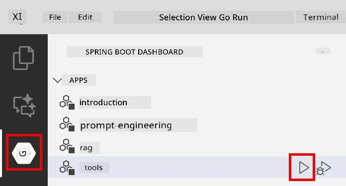
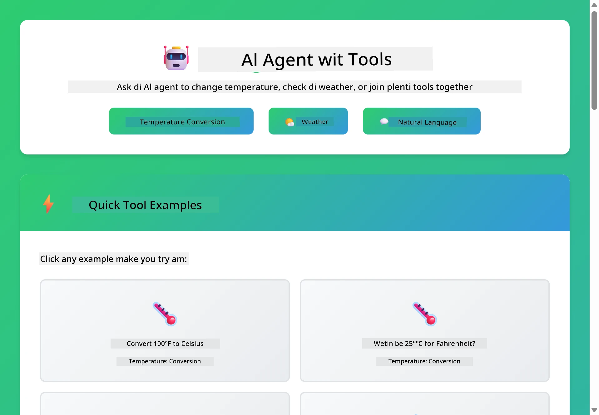
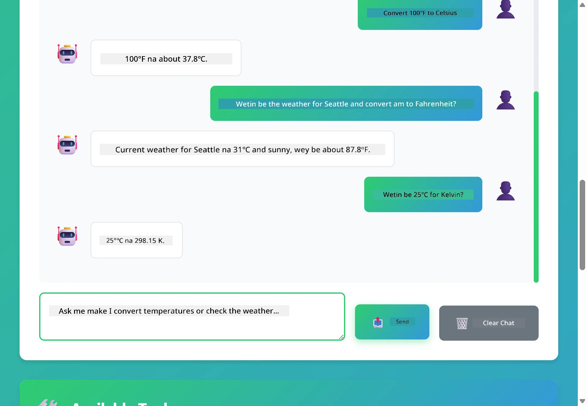

# Module 04: AI Agents wit Tools

## Table of Contents

- [Video Walkthrough](#video-walkthrough)
- [Wetin You Go Learn](#wetin-you-go-learn)
- [Prerequisites](#prerequisites)
- [Understanding AI Agents wit Tools](#understanding-ai-agents-wit-tools)
- [How Tool Calling Dey Work](#how-tool-calling-dey-work)
  - [Tool Definitions](#tool-definitions)
  - [Decision Making](#decision-making)
  - [Execution](#execution)
  - [Response Generation](#response-generation)
  - [Architecture: Spring Boot Auto-Wiring](#architecture-spring-boot-auto-wiring)
- [Tool Chaining](#tool-chaining)
- [Run the Application](#run-the-application)
- [Using the Application](#using-di-application)
  - [Try Simple Tool Usage](#try-simple-tool-usage)
  - [Test Tool Chaining](#test-tool-chaining)
  - [See Conversation Flow](#see-conversation-flow)
  - [Experiment wit Different Requests](#experiment-wit-different-requests)
- [Key Concepts](#key-concepts)
  - [ReAct Pattern (Reasoning and Acting)](#react-pattern-reasoning-and-acting)
  - [Tool Descriptions Matter](#tool-descriptions-matter)
  - [Session Management](#session-management)
  - [Error Handling](#error-handling)
- [Available Tools](#available-tools)
- [When to Use Tool-Based Agents](#when-to-use-tool-based-agents)
- [Tools vs RAG](#tools-vs-rag)
- [Next Steps](#next-steps)

## Video Walkthrough

Watch dis live session wey explain how to start wit dis module:

<a href="https://www.youtube.com/watch?v=O_J30kZc0rw"></a>

## Wetin You Go Learn

So far, you don learn how to dey hold conversation wit AI, how to structure prompts well, and how to ground responses for your documents. But still e get one big problem: language models fit only generate text. Dem no fit check weather, do calculations, query databases, or interact wit external systems.

Tools change dis. By giving di model access to functions wey e fit call, you fit turn am from just text generator to agent wey fit take actions. Di model dey decide wen e need tool, which tool to use, and wetin parameters to pass. Your code go execute di function and return di result. Di model go incorporate dat result inside im response.

## Prerequisites

- Done [Module 01 - Introduction](../01-introduction/README.md) (Azure OpenAI resources deployed)
- Done previous modules wey dem recommend (dis module dey reference [RAG concepts from Module 03](../03-rag/README.md) for Tools vs RAG comparison)
- `.env` file dey for root directory wit Azure credentials (wey na `azd up` for Module 01 create am)

> **Note:** If you never finish Module 01, make you follow di deployment instructions there first.

## Understanding AI Agents wit Tools

> **📝 Note:** Di term "agents" for dis module mean AI assistants wey get tool-calling capabilities. Dis no be di same as **Agentic AI** patterns (wey be autonomous agents wit planning, memory, and multi-step reasoning) wey we go cover for [Module 05: MCP](../05-mcp/README.md).

Without tools, one language model fit only generate text from im training data. If you ask am for di weather now, e go just guess. But if you give am tools, e fit call weather API, do calculations, or query database — then fit weave those real results into im response.


*Without tools model fit only guess — wit tools e fit call API dem, run calculations, and return real-time data.*

One AI agent wit tools dey follow **Reasoning and Acting (ReAct)** pattern. Di model no dey just respond — e go think wetin e need, act by calling tool, check di result, then decide whether to act again or deliver di final answer:

1. **Reason** — Agent go analyze wetin user ask and determine wetin info e need
2. **Act** — Agent go pick correct tool, generate correct parameters, then call am
3. **Observe** — Agent go receive tool output and evaluate di result
4. **Repeat or Respond** — If e still need more data, agent go loop back; if no, e go compose normal language answer


*Di ReAct cycle — agent dey reason wetin e suppose do, act by calling tool, observe di result, then repeat till e fit give final answer.*

Dis one dey happen automatically. You go define di tools and dem descriptions. Di model go handle di decision wen and how to use dem.

## How Tool Calling Dey Work

### Tool Definitions

[WeatherTool.java](../../../04-tools/src/main/java/com/example/langchain4j/agents/tools/WeatherTool.java) | [TemperatureTool.java](../../../04-tools/src/main/java/com/example/langchain4j/agents/tools/TemperatureTool.java)

You dey define functions wit clear descriptions and parameter specs. Di model dey see those descriptions for im system prompt and e go sabi wetin each tool de do.

```java
@Component
public class WeatherTool {
    
    @Tool("Get the current weather for a location")
    public String getCurrentWeather(@P("Location name") String location) {
        // Your weather lookup logic
        return "Weather in " + location + ": 22°C, cloudy";
    }
}

@AiService
public interface Assistant {
    String chat(@MemoryId String sessionId, @UserMessage String message);
}

// Assistant dey automatically connect by Spring Boot wit:
// - ChatModel bean
// - All @Tool methods from @Component classes
// - ChatMemoryProvider for session management
```

Di diagram below break down every annotation and show how each part help AI sabi wen to call tool and wetin arguments to pass:


*How tool definition be — @Tool dey tell AI wen to use am, @P dey describe each parameter, and @AiService dey wire everything together when startup.*

> **🤖 Try wit [GitHub Copilot](https://github.com/features/copilot) Chat:** Open [`WeatherTool.java`](../../../04-tools/src/main/java/com/example/langchain4j/agents/tools/WeatherTool.java) and ask:
> - "How I go fit integrate real weather API like OpenWeatherMap instead of mock data?"
> - "Wetin make good tool description wey go help AI use am well?"
> - "How I go fit handle API errors and rate limits for tool implementations?"

### Decision Making

When user ask "Wetn be di weather for Seattle?", di model no go just pick any tool anyhow. E go compare wetin user want wit every tool description wey e get, score each one based on how e relate, then pick di best one. E go generate structured function call with correct parameters — for here, e go set `location` to `"Seattle"`.

If no tool match wetin user want, di model go fallback to answer wit im own knowledge. If plenty tools match, e go pick di one wey be most specific.


*Model dey evaluate every tool against wetin user want and pick di best one — na why e good to write clear, specific tool descriptions.*

### Execution

[AgentService.java](../../../04-tools/src/main/java/com/example/langchain4j/agents/service/AgentService.java)

Spring Boot dey auto-wire di declarative `@AiService` interface wit all registered tools, and LangChain4j dey execute tool calls automatically. Behind di scenes, full tool call dey flow through six stages — from user natural language question all di way back to natural language answer:


*End-to-end flow — user ask question, model pick tool, LangChain4j execute am, and model weave di result into natural response.*

For backend, `AiServices` dey run the same tool-calling loop for any tool — here e show wit simple `Calculator`. Di sequence diagram below show exactly wetin dey happen inside:


*Tool-calling loop — `AiServices` go send your message and tool schemas to di LLM, LLM go reply wit function call like `add(42, 58)`, LangChain4j go execute di `Calculator` method locally, and send di result back for di final answer.*

> **🤖 Try wit [GitHub Copilot](https://github.com/features/copilot) Chat:** Open [`AgentService.java`](../../../04-tools/src/main/java/com/example/langchain4j/agents/service/AgentService.java) and ask:
> - "How ReAct pattern dey work and why e dey effective for AI agents?"
> - "How agent dey decide which tool to use and wetin order?"
> - "Wetin dey happen if tool execution fail - how person go fit handle errors well?"

### Response Generation

Di model go receive di weather data and format am into natural language response for user.

### Architecture: Spring Boot Auto-Wiring

Dis module dey use LangChain4j Spring Boot integration wit declarative `@AiService` interfaces. For startup, Spring Boot go find every `@Component` wey get `@Tool` methods, your `ChatModel` bean, and di `ChatMemoryProvider` — then e go wire dem join into one `Assistant` interface wit zero boilerplate.


*Di @AiService interface dey connect ChatModel, tool components, and memory provider — Spring Boot go handle all di wiring automatically.*

Here na the full request lifecycle as sequence diagram — from HTTP request through controller, service, and auto-wired proxy all di way to tool execution and back:


*Complete Spring Boot request lifecycle — HTTP request dey flow through controller and service to auto-wired Assistant proxy, wey dey run di LLM and tool calls automatically.*

Key benefits of dis method:

- **Spring Boot auto-wiring** — ChatModel and tools automatically dey injected
- **@MemoryId pattern** — Automatic session-based memory management
- **Single instance** — Assistant create once, reuse am for better performance
- **Type-safe execution** — Java methods dey called directly wit type conversion
- **Multi-turn orchestration** — Handles tool chaining automatically
- **Zero boilerplate** — No manual `AiServices.builder()` calls or memory HashMap

Other methods (manual `AiServices.builder()`) go need more code and no get di Spring Boot integration benefits.

## Tool Chaining

**Tool Chaining** — Real power of tool-based agents dey show wen one single question need multiple tools. If you ask "Wetn be di weather for Seattle in Fahrenheit?" agent go automatically chain two tools: first e go call `getCurrentWeather` to get temperature for Celsius, then e pass dat value to `celsiusToFahrenheit` to convert — all na one conversation turn.


*Tool chaining for action — agent first call getCurrentWeather, then pipe di Celsius result enter celsiusToFahrenheit, den deliver combined answer.*

**Graceful Failures** — If you ask for weather for city wey no dey inside mock data, tool go return error message, and AI go explain say e no fit help instead of crash. Tools dey fail safe. Di diagram below show di two way — wit good error handling, agent go catch exception and respond nicely, but without am whole app go crash:


*When tool fail, agent go catch di error and respond wit helpful explanation, no be to crash.*

Dis one dey happen in one conversation turn. Agent dey manage multiple tool calls by itself.

## Run the Application

**Check deployment:**

Make sure `.env` file dey for root directory wit Azure credentials (wey create during Module 01). Run dis from di module directory (`04-tools/`):

**Bash:**
```bash
cat ../.env  # E suppose show AZURE_OPENAI_ENDPOINT, API_KEY, DEPLOYMENT
```

**PowerShell:**
```powershell
Get-Content ..\.env  # E suppose show AZURE_OPENAI_ENDPOINT, API_KEY, DEPLOYMENT
```

**Start the application:**

> **Note:** If you don already start all applications wit `./start-all.sh` from root directory (like e talk for Module 01), dis module dey already run for port 8084. You fit skip di start commands below and go straight to http://localhost:8084.

**Option 1: Using Spring Boot Dashboard (Recommended for VS Code users)**

Di dev container get di Spring Boot Dashboard extension, wey dey provide visual interface to manage all Spring Boot applications. You fit find am for di Activity Bar for left side of VS Code (look for di Spring Boot icon).

From di Spring Boot Dashboard, you fit:
- See all available Spring Boot applications for workspace
- Start/stop applications wit one click
- View application logs live
- Monitor application status

Just click di play button wey dey beside "tools" to start dis module, or start all modules at once.

See wetin di Spring Boot Dashboard look like for VS Code:


*Di Spring Boot Dashboard for VS Code — start, stop, and monitor all modules from one place*

**Option 2: Wɛ̄ yus shell scripts**

Start all web applications (modules 01-04):

**Bash:**
```bash
cd ..  # From root directory
./start-all.sh
```

**PowerShell:**
```powershell
cd ..  # From root directory
.\start-all.ps1
```

Or start just dis module:

**Bash:**
```bash
cd 04-tools
./start.sh
```

**PowerShell:**
```powershell
cd 04-tools
.\start.ps1
```

Both scripts automatically load environment variables from di root `.env` file and go build di JARs if dem no dey.

> **Note:** If you prefer to build all modules manually before you start:
>
> **Bash:**
> ```bash
> cd ..  # Go to root directory
> mvn clean package -DskipTests
> ```
>
> **PowerShell:**
> ```powershell
> cd ..  # Go to root directory
> mvn clean package -DskipTests
> ```

Open http://localhost:8084 for your browser.

**To stop:**

**Bash:**
```bash
./stop.sh  # Dis module only
# Or
cd .. && ./stop-all.sh  # All di modules
```

**PowerShell:**
```powershell
.\stop.ps1  # Dis module only
# Or
cd ..; .\stop-all.ps1  # All di modules
```

## Using di Application

Di application get web interface wey you fit interact wit AI agent wey get access to weather and temperature conversion tools. Dis na wetin di interface dey look like — e get quick-start examples and chat panel for send requests:

<a href="images/tools-homepage.png"></a>

*Di AI Agent Tools interface - quick examples and chat interface for interact wit tools*

### Try Simple Tool Usage

Start wit straightforward request: "Convert 100 degrees Fahrenheit to Celsius". Di agent sabi say e need temperature conversion tool, e call am wit correct parameters, and e return di result. Notice how natural e dey feel - you no specify which tool to use or how to call am.

### Test Tool Chaining

Now try sometin wey complex pass: "Wetin be di weather for Seattle and convert am to Fahrenheit?" Watch di agent work dis step by step. E first get di weather (wey return Celsius), know say e need do conversion to Fahrenheit, call di conversion tool, then combine both results into one response.

### See Conversation Flow

Di chat interface dey keep conversation history, e allow you get multi-turn interactions. You fit see all previous queries and responses, e make am easy to track di conversation and understand how di agent dey build context over multiple exchanges.

<a href="images/tools-conversation-demo.png"></a>

*Multi-turn conversation wey dey show simple conversions, weather lookups, and tool chaining*

### Experiment wit Different Requests

Try different combinations:
- Weather lookups: "Wetin be di weather for Tokyo?"
- Temperature conversions: "Wetin be 25°C for Kelvin?"
- Combined queries: "Check di weather for Paris and tell me if e pass 20°C"

Notice how di agent interpret natural language and map am to correct tool calls.

## Key Concepts

### ReAct Pattern (Reasoning and Acting)

Di agent dey switch between reasoning (deciding wetin e go do) and acting (using tools). Dis pattern make am fit solve problem by itself instead of just respond to instructions.

### Tool Descriptions Matter

How you describe your tools fit affect how well di agent go use dem. Clear, specific descriptions help di model understand when and how to call each tool.

### Session Management

Di `@MemoryId` annotation dey enable automatic session-based memory management. Each session ID get im own `ChatMemory` instance wey di `ChatMemoryProvider` bean dey manage, so multiple users fit interact wit di agent at same time without their conversations mix together. Di diagram below show how multiple users go direct go isolated memory stores based on their session IDs:


*Each session ID dey map to isolated conversation history — users no fit see each other's messages.*

### Error Handling

Tools fit fail — APIs fit timeout, parameters fit wrong, external services fit down. Production agents need error handling so di model fit explain problem or try other options instead of make di whole application crash. When tool throw exception, LangChain4j go catch am and feed di error message back to di model, wey fit explain di problem for natural language.

## Available Tools

Di diagram below show di wide range of tools wey you fit build. Dis module dey show weather and temperature tools, but di same `@Tool` pattern fit work for any Java method — from database queries to payment processing.


*Any Java method annotated wit @Tool go dey available to di AI — di pattern fit spread to databases, APIs, email, file operations, and more.*

## When to Use Tool-Based Agents

No be every request need tools. Di decision na whether di AI need interact wit external systems or if e fit answer from im own knowledge. Di guide below summarize when tools dey useful and when dem no really need am:


*Quick decision guide — tools dey for real-time data, calculations, and actions; general knowledge and creative tasks no need dem.*

## Tools vs RAG

Modules 03 and 04 both extend wetin di AI fit do, but for fundamentally different ways. RAG dey give di model access to **knowledge** by retrieving documents. Tools dey give di model ability to take **actions** by calling functions. Di diagram below compare these two approaches side by side — from how each workflow dey operate to di trade-offs between dem:


*RAG dey retrieve information from static documents — Tools dey execute actions and fetch dynamic, real-time data. Many production systems dey combine both.*

For practice, many production systems dey combine both approaches: RAG for grounding answers inside your documentation, and Tools for fetching live data or doing operations.

## Next Steps

**Next Module:** [05-mcp - Model Context Protocol (MCP)](../05-mcp/README.md)

---

**Navigation:** [← Previous: Module 03 - RAG](../03-rag/README.md) | [Back to Main](../README.md) | [Next: Module 05 - MCP →](../05-mcp/README.md)

---

<!-- CO-OP TRANSLATOR DISCLAIMER START -->
**Disclaimer**:
Dis document don translate wit AI translation service [Co-op Translator](https://github.com/Azure/co-op-translator). Even tho we dey try make am correct, abeg make you know say automated translation fit get errors or mistakes. Di original document for dia own language na im be di correct source. For important info, make person wey sabi human translation do am. We no go responsible for any misunderstanding or wrong understanding wey fit happen because of dis translation.
<!-- CO-OP TRANSLATOR DISCLAIMER END -->