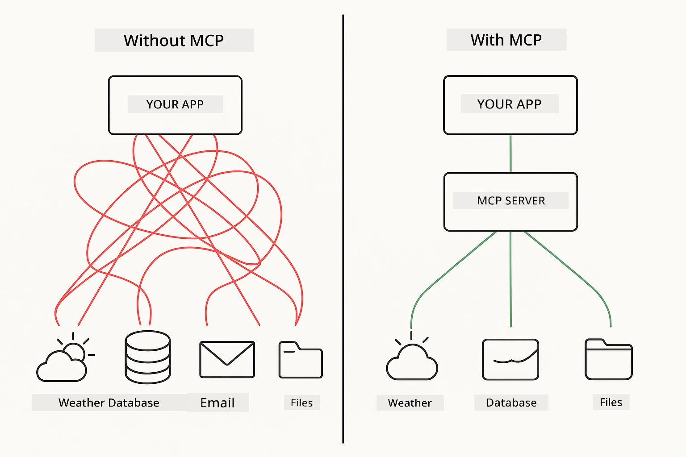
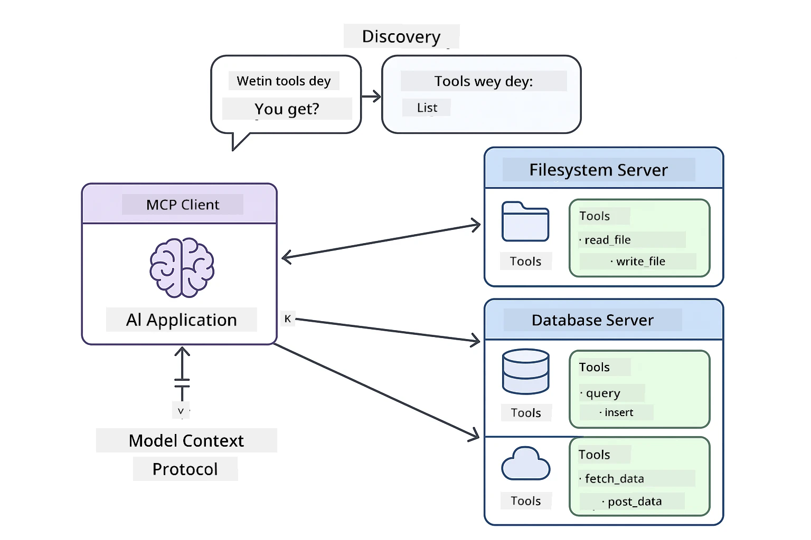
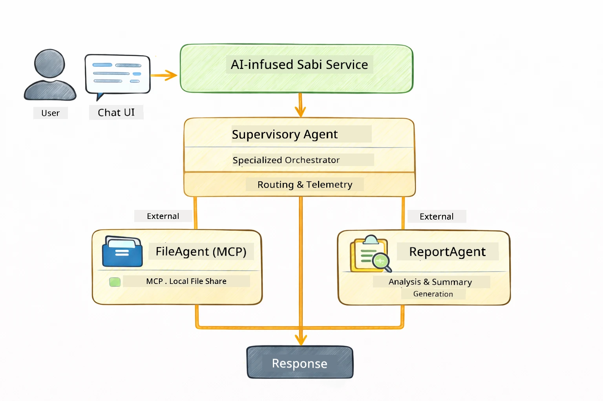

# Module 05: Model Context Protocol (MCP)

## Table of Contents

- [Wetyn You Go Learn](../../../05-mcp)
- [Wetyn Be MCP?](../../../05-mcp)
- [How MCP Dey Work](../../../05-mcp)
- [The Agentic Module](../../../05-mcp)
- [How To Run The Examples Dem](../../../05-mcp)
  - [Wetyn You Gotta Get Before](../../../05-mcp)
- [Quick Start](../../../05-mcp)
  - [File Operations (Stdio)](../../../05-mcp)
  - [Supervisor Agent](../../../05-mcp)
    - [How To Understand The Output](../../../05-mcp)
    - [Response Strategies](../../../05-mcp)
    - [Explanation of Agentic Module Features](../../../05-mcp)
- [Key Concepts](../../../05-mcp)
- [Congrats!](../../../05-mcp)
  - [Wetyn Next?](../../../05-mcp)

## Wetyn You Go Learn

You don already build conversational AI, sabi prompts well, fit ground responses for documents, and create agents wey sabi use tools. But all those tools dem na custom-build for your own application. Wetin if you fit give your AI access to one kind standardized ecosystem of tools wey anybody fit create and share? For this module, you go learn how to fit do am with the Model Context Protocol (MCP) and LangChain4j agentic module. First, we go show simple MCP file reader then show how e dey join advanced agentic workflows sharp sharp with Supervisor Agent pattern.

## Wetyn Be MCP?

The Model Context Protocol (MCP) na exactly dis kain thing - one standard way for AI applications to discover and use external tools. Instead make you go write custom integration for each data source or service, you go connect to MCP servers wey dey show their capabilities for one uniform way. Your AI agent go fit discover and use those tools automatically.



*Before MCP: Complex point-to-point integrations. After MCP: One protocol, endless possibilities.*

MCP solve one big kasala for AI development: every integration na custom work. You want access GitHub? You go write custom code. You want read files? Custom code again. You want query database? Custom code too. And none of these integration dem fit work with other AI applications.

MCP make am standardized. One MCP server go show tools with clear description and schema. Any MCP client fit connect, find tools wey dey, and use am. Build once, use everywhere.



*Model Context Protocol architecture - standardized tool discovery and execution*

## How MCP Dey Work

**Server-Client Architecture**

MCP dey use client-server model. Servers dey provide tools - dey read files, query databases, call APIs. Clients (your AI application) go connect to servers and use their tools.

To use MCP with LangChain4j, add dis Maven dependency:

```xml
<dependency>
    <groupId>dev.langchain4j</groupId>
    <artifactId>langchain4j-mcp</artifactId>
    <version>${langchain4j.version}</version>
</dependency>
```

**Tool Discovery**

When your client connect to MCP server, e go ask "Which tools you get?" Server go respond with list of tools wey dey available, each get description and parameter schema. Your AI agent fit decide which tools e go use based on wetin user ask.

**Transport Mechanisms**

MCP fit use different transport mechanism. This module show Stdio transport for local processes:


*MCP transport mechanisms: HTTP for remote servers, Stdio for local processes*

**Stdio** - [StdioTransportDemo.java](../../../05-mcp/src/main/java/com/example/langchain4j/mcp/StdioTransportDemo.java)

Na for local processes. Your application go spawn server as subprocess and dey communicate through standard input/output. E good for filesystem access or command-line tools.

```java
McpTransport stdioTransport = new StdioMcpTransport.Builder()
    .command(List.of(
        npmCmd, "exec",
        "@modelcontextprotocol/server-filesystem@2025.12.18",
        resourcesDir
    ))
    .logEvents(false)
    .build();
```

> **🤖 Try with [GitHub Copilot](https://github.com/features/copilot) Chat:** Open [`StdioTransportDemo.java`](../../../05-mcp/src/main/java/com/example/langchain4j/mcp/StdioTransportDemo.java) and ask:
> - "How Stdio transport dey work and wen I suppose use am instead of HTTP?"
> - "How LangChain4j dey manage life cycle of spawned MCP server processes?"
> - "Wetin be the security things wey I suppose consider before I give AI access to my file system?"

## The Agentic Module

Even though MCP dey provide standardized tools, LangChain4j **agentic module** dey give declarative way to build agents wey fit orchestrate those tools. The `@Agent` annotation and `AgenticServices` dey allow you to define agent behavior using interfaces, no be imperative code.

For this module, you go check **Supervisor Agent** pattern — na advanced agentic AI approach wey one "supervisor" agent dey decide dynamically which sub-agents to call based on wetin user wan do. We go join both concepts by giving one of our sub-agents MCP-powered file access power.

To use agentic module, add this Maven dependency:

```xml
<dependency>
    <groupId>dev.langchain4j</groupId>
    <artifactId>langchain4j-agentic</artifactId>
    <version>${langchain4j.mcp.version}</version>
</dependency>
```

> **⚠️ Experimental:** `langchain4j-agentic` module still dey experimental and e fit change. The stable way to build AI assistants still be `langchain4j-core` with custom tools (Module 04).

## How To Run The Examples

### Wetyn You Gotta Get Before

- Java 21+, Maven 3.9+
- Node.js 16+ and npm (for MCP servers)
- Environment variables set for `.env` file (from root directory):
  - `AZURE_OPENAI_ENDPOINT`, `AZURE_OPENAI_API_KEY`, `AZURE_OPENAI_DEPLOYMENT` (same like Modules 01-04)

> **Note:** If you never set your environment variables, check [Module 00 - Quick Start](../00-quick-start/README.md) for instructions, or copy `.env.example` to `.env` from root directory and fill am properly.

## Quick Start

**If You dey Use VS Code:** Just right-click any demo file inside Explorer and choose **"Run Java"**, or use the launch configurations inside Run and Debug panel (make sure say you don put your token inside `.env` file first).

**If You dey Use Maven:** You fit still run from command line with examples wey dey below.

### File Operations (Stdio)

This one dey show local subprocess-based tools.

**✅ No prerequisites necessary** - MCP server go spawn by itself.

**Using Start Scripts (Recommended):**

Start scripts go automatically load environment variables from root `.env` file:

**Bash:**
```bash
cd 05-mcp
chmod +x start-stdio.sh
./start-stdio.sh
```

**PowerShell:**
```powershell
cd 05-mcp
.\start-stdio.ps1
```

**Using VS Code:** Right-click on `StdioTransportDemo.java` and choose **"Run Java"** (make sure your `.env` file correct).

The application go spawn MCP filesystem server automatically and read one local file. Look how the subprocess management dey work for you.

**Expected output:**
```
Assistant response: The file provides an overview of LangChain4j, an open-source Java library
for integrating Large Language Models (LLMs) into Java applications...
```

### Supervisor Agent

The **Supervisor Agent pattern** na **flexible** kind agentic AI. Supervisor go use LLM to decide on him own which agents to call based on wetin user request. For next example, we go join MCP-powered file access with LLM agent to do supervised file read → report workflow.

For demo, `FileAgent` go read file using MCP filesystem tools, `ReportAgent` go create structured report with executive summary (1 sentence), 3 key points, and recommendations. Supervisor go dey run dis flow na him self:



```
┌─────────────┐      ┌──────────────┐
│  FileAgent  │ ───▶ │ ReportAgent  │
│ (MCP tools) │      │  (pure LLM)  │
└─────────────┘      └──────────────┘
   outputKey:           outputKey:
  'fileContent'         'report'
```

Each agent dey save their output inside **Agentic Scope** (shared memory), so downstream agents fit access previous results. This one show how MCP tools fit join agentic workflows well well — Supervisor no need know *how* file dem dey read, e just need know say `FileAgent` fit do am.

#### How To Run The Demo

Start scripts go load environment variables from root `.env` file automatically:

**Bash:**
```bash
cd 05-mcp
chmod +x start-supervisor.sh
./start-supervisor.sh
```

**PowerShell:**
```powershell
cd 05-mcp
.\start-supervisor.ps1
```

**Using VS Code:** Right-click `SupervisorAgentDemo.java` and select **"Run Java"** (make sure `.env` file set well).

#### How The Supervisor Dey Work

```java
// Step 1: FileAgent go read files with MCP tools
FileAgent fileAgent = AgenticServices.agentBuilder(FileAgent.class)
        .chatModel(model)
        .toolProvider(mcpToolProvider)  // Get MCP tools for file operations
        .build();

// Step 2: ReportAgent go generate structured reports
ReportAgent reportAgent = AgenticServices.agentBuilder(ReportAgent.class)
        .chatModel(model)
        .build();

// Supervisor dey manage the file → report workflow
SupervisorAgent supervisor = AgenticServices.supervisorBuilder()
        .chatModel(model)
        .subAgents(fileAgent, reportAgent)
        .responseStrategy(SupervisorResponseStrategy.LAST)  // Return the final report
        .build();

// The Supervisor go decide which agents to call based on the request
String response = supervisor.invoke("Read the file at /path/file.txt and generate a report");
```

#### Response Strategies

When you set up `SupervisorAgent`, you go tell am how e suppose form final answer for user after the sub-agents don finish their work. The strategies wey dey are:

| Strategy | Description |
|----------|-------------|
| **LAST** | Supervisor go bring output from the last sub-agent or tool wey e call. This good when the final agent for workflow na the one wey dem design specially to produce the complete, final answer (like "Summary Agent" for research pipeline). |
| **SUMMARY** | Supervisor go use im own internal Language Model (LLM) to synthesize summary of the whole interaction and all sub-agent outputs, then e go return that summary as the final answer. This one dey give clean, combined answer to user. |
| **SCORED** | System go use internal LLM to score both LAST response and SUMMARY of interaction against original user request, then e go return the output wey get higher score. |

See [SupervisorAgentDemo.java](../../../05-mcp/src/main/java/com/example/langchain4j/mcp/SupervisorAgentDemo.java) for full implementation.

> **🤖 Try with [GitHub Copilot](https://github.com/features/copilot) Chat:** Open [`SupervisorAgentDemo.java`](../../../05-mcp/src/main/java/com/example/langchain4j/mcp/SupervisorAgentDemo.java) and ask:
> - "How Supervisor dey decide which agents to invoke?"
> - "Wetin be difference between Supervisor and Sequential workflow patterns?"
> - "How I fit customize Supervisor planning behavior?"

#### How To Understand The Output

When you run the demo, you go see how Supervisor dey organize multiple agents. Here na wetin each section mean:

```
======================================================================
  FILE → REPORT WORKFLOW DEMO
======================================================================

This demo shows a clear 2-step workflow: read a file, then generate a report.
The Supervisor orchestrates the agents automatically based on the request.
```

**The header** dey introduce workflow idea: pipeline wey focus from file reading to report generation.

```
--- WORKFLOW ---------------------------------------------------------
  ┌─────────────┐      ┌──────────────┐
  │  FileAgent  │ ───▶ │ ReportAgent  │
  │ (MCP tools) │      │  (pure LLM)  │
  └─────────────┘      └──────────────┘
   outputKey:           outputKey:
   'fileContent'        'report'

--- AVAILABLE AGENTS -------------------------------------------------
  [FILE]   FileAgent   - Reads files via MCP → stores in 'fileContent'
  [REPORT] ReportAgent - Generates structured report → stores in 'report'
```

**Workflow Diagram** dey show how data dey flow between agents. Each agent get specific role:
- **FileAgent** dey read files using MCP tools and dey keep raw content for `fileContent`
- **ReportAgent** go use that content and produce structured report for `report`

```
--- USER REQUEST -----------------------------------------------------
  "Read the file at .../file.txt and generate a report on its contents"
```

**User Request** dey show the task. Supervisor go parse am and decide to call FileAgent → ReportAgent.

```
--- SUPERVISOR ORCHESTRATION -----------------------------------------
  The Supervisor decides which agents to invoke and passes data between them...

  +-- STEP 1: Supervisor chose -> FileAgent (reading file via MCP)
  |
  |   Input: .../file.txt
  |
  |   Result: LangChain4j is an open-source, provider-agnostic Java framework for building LLM...
  +-- [OK] FileAgent (reading file via MCP) completed

  +-- STEP 2: Supervisor chose -> ReportAgent (generating structured report)
  |
  |   Input: LangChain4j is an open-source, provider-agnostic Java framew...
  |
  |   Result: Executive Summary...
  +-- [OK] ReportAgent (generating structured report) completed
```

**Supervisor Orchestration** dey show the 2-step flow for action:
1. **FileAgent** dey read file via MCP and keep content
2. **ReportAgent** go get content and generate structured report

Supervisor do all these decisions **autonomously** based on user request.

```
--- FINAL RESPONSE ---------------------------------------------------
Executive Summary
...

Key Points
...

Recommendations
...

--- AGENTIC SCOPE (Data Flow) ----------------------------------------
  Each agent stores its output for downstream agents to consume:
  * fileContent: LangChain4j is an open-source, provider-agnostic Java framework...
  * report: Executive Summary...
```

#### Explanation of Agentic Module Features

The example show several advanced features of agentic module. Make we look closer at Agentic Scope and Agent Listeners.

**Agentic Scope** na the shared memory where agents store their results using `@Agent(outputKey="...")`. This one allow:
- Later agents fit access outputs from earlier agents
- Supervisor fit synthesize final response
- You fit inspect wetin each agent produce

```java
ResultWithAgenticScope<String> result = supervisor.invokeWithAgenticScope(request);
AgenticScope scope = result.agenticScope();
String fileContent = scope.readState("fileContent");  // Raw file data from FileAgent
String report = scope.readState("report");            // Structured report from ReportAgent
```

**Agent Listeners** dey allow monitoring and debugging of agent execution. The step-by-step output you dey see for demo na from AgentListener wey attach for each agent invocation:
- **beforeAgentInvocation** - Call when Supervisor pick agent, so you fit see which agent e select and why
- **afterAgentInvocation** - Call as agent finish work, showing result
- **inheritedBySubagents** - If true, listener dey monitor all agents inside hierarchy

```java
AgentListener monitor = new AgentListener() {
    private int step = 0;
    
    @Override
    public void beforeAgentInvocation(AgentRequest request) {
        step++;
        System.out.println("  +-- STEP " + step + ": " + request.agentName());
    }
    
    @Override
    public void afterAgentInvocation(AgentResponse response) {
        System.out.println("  +-- [OK] " + response.agentName() + " completed");
    }
    
    @Override
    public boolean inheritedBySubagents() {
        return true; // Carry am go all sub-agents dem
    }
};
```

Beyond Supervisor pattern, `langchain4j-agentic` module get plenty powerful workflow patterns and features:

| Pattern | Description | Use Case |
|---------|-------------|----------|
| **Sequential** | Run agents one one, output go flow to next | Pipelines: research → analyze → report |
| **Parallel** | Run agents for the same time | Independent tasks: weather + news + stocks |
| **Loop** | Repeat until condition meet | Quality scoring: refine until score ≥ 0.8 |
| **Conditional** | Route based on conditions | Classify → send to specialist agent |
| **Human-in-the-Loop** | Add human checkpoints | Approval workflows, content review |

## Key Concepts

Now we don check MCP and agentic module for action, make we summarize when you suppose use each.

**MCP** good when you wan use existing tool ecosystems, build tools wey multiple applications fit share, integrate third-party services wit standard protocols, or fit change tool implementation without changing code.

**The Agentic Module** best when you want declarative agent definitions with `@Agent` annotations, need to orchestrate workflow (sequential, loop, parallel), prefer interface-based agent design over imperative code, or you dey combine multiple agents wey dey share outputs via `outputKey`.

**The Supervisor Agent pattern** sharp when workflow no too clear beforehand and you want LLM make decision, when you get many specialized agents wey need dynamic orchestration, when you dey build conversational systems wey route to different capabilities, or when you want most flexible and adaptive agent behavior.
## Congratulations!

You don complete LangChain4j for Beginners course. You don learn:

- How to build conversational AI with memory (Module 01)
- Prompt engineering patterns for different tasks (Module 02)
- Grounding responses inside your documents with RAG (Module 03)
- Creating basic AI agents (assistants) with custom tools (Module 04)
- Integrating standardized tools with the LangChain4j MCP and Agentic modules (Module 05)

### Wetin Next?

After you finish the modules, try the [Testing Guide](../docs/TESTING.md) to see LangChain4j testing ideas in action.

**Official Resources:**
- [LangChain4j Documentation](https://docs.langchain4j.dev/) - Complete guides and API reference
- [LangChain4j GitHub](https://github.com/langchain4j/langchain4j) - Source code and examples
- [LangChain4j Tutorials](https://docs.langchain4j.dev/tutorials/) - Step-by-step tutorials for different use cases

Thank you for completing this course!

---

**Navigation:** [← Previous: Module 04 - Tools](../04-tools/README.md) | [Back to Main](../README.md)

---

<!-- CO-OP TRANSLATOR DISCLAIMER START -->
**Disclaimer**:  
Dis dokument don translate wit AI translation service wey dem call [Co-op Translator](https://github.com/Azure/co-op-translator). Even though we dey try make am correct, abeg note say automated translation fit get some mistakes or no too correct. Di original dokument wey dey im own language na im get correct tori. If na serious matter, make person use professional human translator. We no go responsible if person wey use dis translation waka enter wrong understanding or misinterpret am.
<!-- CO-OP TRANSLATOR DISCLAIMER END -->