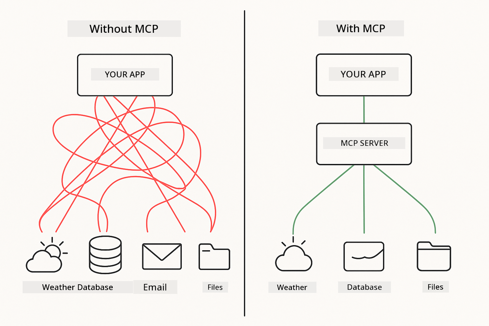
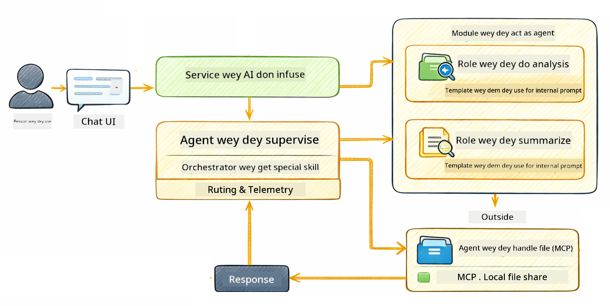

<!--
CO_OP_TRANSLATOR_METADATA:
{
  "original_hash": "f89f4c106d110e4943c055dd1a2f1dff",
  "translation_date": "2025-12-31T07:30:30+00:00",
  "source_file": "05-mcp/README.md",
  "language_code": "pcm"
}
-->
# Modul 05: Model Context Protocol (MCP)

## Table of Contents

- [Wetin You Go Learn](../../../05-mcp)
- [Wetín be MCP?](../../../05-mcp)
- [How MCP Dey Work](../../../05-mcp)
- [The Agentic Module](../../../05-mcp)
- [How to Run di Examples](../../../05-mcp)
  - [Wetin You Need Before](../../../05-mcp)
- [Quick Start](../../../05-mcp)
  - [File Operations (Stdio)](../../../05-mcp)
  - [Supervisor Agent](../../../05-mcp)
    - [Understanding the Output](../../../05-mcp)
    - [Explanation of Agentic Module Features](../../../05-mcp)
- [Key Concepts](../../../05-mcp)
- [Congratulations!](../../../05-mcp)
  - [Wetin Next?](../../../05-mcp)

## What You'll Learn

You don don build conversational AI, sabi prompts, make responses base for documents, and create agents wey get tools. But all those tools na custom fit only your app. Wetin if you fit give your AI access to one standardized ecosystem of tools wey anybody fit make and share? For this module, you go learn how to do dat with the Model Context Protocol (MCP) and LangChain4j's agentic module. First we go show one simple MCP file reader then show how e quick join inside advanced agentic workflows using the Supervisor Agent pattern.

## What is MCP?

The Model Context Protocol (MCP) na exactly dat - one standard way for AI applications to find and use external tools. Instead make custom integrations for every data source or service, you go connect to MCP servers wey show their capabilities for one consistent format. Your AI agent fit then discover and use those tools automatically.



*Before MCP: Complex point-to-point integrations. After MCP: One protocol, endless possibilities.*

MCP dey solve one koko problem for AI development: every integration na custom. You want access GitHub? Custom code. You want read files? Custom code. You want query database? Custom code. And none of those integrations dey work with other AI applications.

MCP standardize am. One MCP server dey expose tools with clear descriptions and schemas. Any MCP client fit connect, discover available tools, and use dem. Build once, use everywhere.


*Model Context Protocol architecture - standardized tool discovery and execution*

## How MCP Works

**Server-Client Architecture**

MCP dey use client-server model. Servers dey provide tools - read files, query databases, call APIs. Clients (your AI application) go connect to servers and use their tools.

To use MCP with LangChain4j, add this Maven dependency:

```xml
<dependency>
    <groupId>dev.langchain4j</groupId>
    <artifactId>langchain4j-mcp</artifactId>
    <version>${langchain4j.version}</version>
</dependency>
```

**Tool Discovery**

When your client connect to MCP server, e go ask "Which tools you get?" The server go answer with list of available tools, each get descriptions and parameter schemas. Your AI agent fit then decide which tools to use based on wetin user request.

**Transport Mechanisms**

MCP support different transport mechanisms. This module dey show the Stdio transport for local processes:


*MCP transport mechanisms: HTTP for remote servers, Stdio for local processes*

**Stdio** - [StdioTransportDemo.java](../../../05-mcp/src/main/java/com/example/langchain4j/mcp/StdioTransportDemo.java)

For local processes. Your application go spawn a server as subprocess and communicate through standard input/output. E useful for filesystem access or command-line tools.

```java
McpTransport stdioTransport = new StdioMcpTransport.Builder()
    .command(List.of(
        npmCmd, "exec",
        "@modelcontextprotocol/server-filesystem@2025.12.18",
        resourcesDir
    ))
    .logEvents(false)
    .build();
```

> **🤖 Try with [GitHub Copilot](https://github.com/features/copilot) Chat:** Open [`StdioTransportDemo.java`](../../../05-mcp/src/main/java/com/example/langchain4j/mcp/StdioTransportDemo.java) and ask:
> - "How does Stdio transport work and when should I use it vs HTTP?"
> - "How does LangChain4j manage the lifecycle of spawned MCP server processes?"
> - "What are the security implications of giving AI access to the file system?"

## The Agentic Module

Even though MCP dey provide standardized tools, LangChain4j's **agentic module** dey give one declarative way to build agents wey go orchestrate those tools. The `@Agent` annotation and `AgenticServices` make you fit define agent behavior through interfaces instead of writing imperative code.

For this module, you go explore the **Supervisor Agent** pattern — one advanced agentic AI approach wey make one "supervisor" agent dey decide dynamically which sub-agents to call based on user request. We go join both concepts by giving one of our sub-agents MCP-powered file access capabilities.

To use the agentic module, add this Maven dependency:

```xml
<dependency>
    <groupId>dev.langchain4j</groupId>
    <artifactId>langchain4j-agentic</artifactId>
    <version>${langchain4j.mcp.version}</version>
</dependency>
```

> **⚠️ Experimental:** The `langchain4j-agentic` module na **experimental** and fit change. The stable way to build AI assistants still remain `langchain4j-core` with custom tools (Module 04).

## Running the Examples

### Prerequisites

- Java 21+, Maven 3.9+
- Node.js 16+ and npm (for MCP servers)
- Environment variables configured in `.env` file (from the root directory):
  - **For StdioTransportDemo:** `GITHUB_TOKEN` (GitHub Personal Access Token)
  - **For SupervisorAgentDemo:** `AZURE_OPENAI_ENDPOINT`, `AZURE_OPENAI_API_KEY`, `AZURE_OPENAI_DEPLOYMENT` (same as Modules 01-04)

> **Note:** If you never set up your environment variables, see [Module 00 - Quick Start](../00-quick-start/README.md) for instructions, or copy `.env.example` to `.env` for the root directory and fill your values.

## Quick Start

**Using VS Code:** Just right-click any demo file for the Explorer and choose **"Run Java"**, or use the launch configurations for the Run and Debug panel (make sure you don add your token to the `.env` file first).

**Using Maven:** Alternatively, you fit run from command line with the examples below.

### File Operations (Stdio)

This one dey show local subprocess-based tools.

**✅ No prerequisites needed** - the MCP server go spawn automatically.

**Using VS Code:** Right-click `StdioTransportDemo.java` and choose **"Run Java"**.

**Using Maven:**

**Bash:**
```bash
export GITHUB_TOKEN=your_token_here
cd 05-mcp
mvn compile exec:java -Dexec.mainClass=com.example.langchain4j.mcp.StdioTransportDemo
```

**PowerShell:**
```powershell
$env:GITHUB_TOKEN=your_token_here
cd 05-mcp
mvn --% compile exec:java -Dexec.mainClass=com.example.langchain4j.mcp.StdioTransportDemo
```

The application go spawn one filesystem MCP server automatically and read local file. Notice how the subprocess management dey handled for you.

**Expected output:**
```
Assistant response: The file provides an overview of LangChain4j, an open-source Java library
for integrating Large Language Models (LLMs) into Java applications...
```

### Supervisor Agent




The **Supervisor Agent pattern** na one **flexible** type of agentic AI. No like deterministic workflows (sequential, loop, parallel), Supervisor dey use LLM to independently decide which agents to call based on wetin user ask.

**Combining Supervisor with MCP:** For this example, we give the `FileAgent` access to MCP file system tools via `toolProvider(mcpToolProvider)`. When user ask make e "read and analyze a file," the Supervisor go analyze the request and make one execution plan. E go then route the request to `FileAgent`, wey go use MCP's `read_file` tool to get the content. The Supervisor go pass that content to `AnalysisAgent` for interpretation, and fit still call `SummaryAgent` to make the results small.

This one show how MCP tools join well inside agentic workflows — the Supervisor no need sabi *how* files dey read, na only know say `FileAgent` fit do am. The Supervisor fit adapt dynamically to different kinds of requests and return either the last agent's response or one summary of all operations.

**Using the Start Scripts (Recommended):**

The start scripts go automatically load environment variables from the root `.env` file:

**Bash:**
```bash
cd 05-mcp
chmod +x start.sh
./start.sh
```

**PowerShell:**
```powershell
cd 05-mcp
.\start.ps1
```

**Using VS Code:** Right-click `SupervisorAgentDemo.java` and choose **"Run Java"** (make sure your `.env` file don set).

**How the Supervisor Works:**

```java
// Create plenty agents wey get specific abilities
FileAgent fileAgent = AgenticServices.agentBuilder(FileAgent.class)
        .chatModel(model)
        .toolProvider(mcpToolProvider)  // E get MCP tools wey dey handle file operations
        .build();

AnalysisAgent analysisAgent = AgenticServices.agentBuilder(AnalysisAgent.class)
        .chatModel(model)
        .build();

SummaryAgent summaryAgent = AgenticServices.agentBuilder(SummaryAgent.class)
        .chatModel(model)
        .build();

// Create a Supervisor wey go orchestrate these agents
SupervisorAgent supervisor = AgenticServices.supervisorBuilder()
        .chatModel(model)  // Di "planner" model
        .subAgents(fileAgent, analysisAgent, summaryAgent)
        .responseStrategy(SupervisorResponseStrategy.SUMMARY)
        .build();

// Di Supervisor dey decide by imself which agents to call
// Just pass one natural language request - the LLM go plan di execution
String response = supervisor.invoke("Read the file at /path/file.txt and analyze it");
```

See [SupervisorAgentDemo.java](../../../05-mcp/src/main/java/com/example/langchain4j/mcp/SupervisorAgentDemo.java) for the full implementation.

> **🤖 Try with [GitHub Copilot](https://github.com/features/copilot) Chat:** Open [`SupervisorAgentDemo.java`](../../../05-mcp/src/main/java/com/example/langchain4j/mcp/SupervisorAgentDemo.java) and ask:
> - "How does the Supervisor decide which agents to invoke?"
> - "What's the difference between Supervisor and Sequential workflow patterns?"
> - "How can I customize the Supervisor's planning behavior?"

#### Understanding the Output

When you run the demo, you go see one structured walkthrough of how the Supervisor dey orchestrate many agents. This na wetin every section mean:

```
======================================================================
  SUPERVISOR AGENT DEMO
======================================================================

This demo shows how a Supervisor Agent orchestrates multiple specialized agents.
The Supervisor uses an LLM to decide which agent to call based on the task.
```

**The header** dey introduce the demo and explain the main idea: the Supervisor dey use an LLM (no hardcoded rules) to decide which agents to call.

```
--- AVAILABLE AGENTS -------------------------------------------------
  [FILE]     FileAgent     - Reads files using MCP filesystem tools
  [ANALYZE]  AnalysisAgent - Analyzes content for structure, tone, and themes
  [SUMMARY]  SummaryAgent  - Creates concise summaries of content
```

**Available Agents** show the three specialized agents wey Supervisor fit choose. Each agent get one specific capability:
- **FileAgent** fit read files using MCP tools (external capability)
- **AnalysisAgent** dey analyze content (pure LLM capability)
- **SummaryAgent** dey create summaries (pure LLM capability)

```
--- USER REQUEST -----------------------------------------------------
  "Read the file at .../file.txt and analyze what it's about"
```

**User Request** show wetin dem ask. Supervisor must parse am and decide which agents to call.

```
--- SUPERVISOR ORCHESTRATION -----------------------------------------
  The Supervisor will now decide which agents to invoke and in what order...

  +-- STEP 1: Supervisor chose -> FileAgent (reading file via MCP)
  |
  |   Input: .../file.txt
  |
  |   Result: LangChain4j is an open-source Java library designed to simplify...
  +-- [OK] FileAgent (reading file via MCP) completed

  +-- STEP 2: Supervisor chose -> AnalysisAgent (analyzing content)
  |
  |   Input: LangChain4j is an open-source Java library...
  |
  |   Result: Structure: The content is organized into clear paragraphs that int...
  +-- [OK] AnalysisAgent (analyzing content) completed
```

**Supervisor Orchestration** na where the magic dey happen. Watch how:
1. Supervisor **chose FileAgent first** because request mention "read the file"
2. FileAgent use MCP's `read_file` tool to get the file contents
3. Supervisor then **chose AnalysisAgent** and pass the file contents to am
4. AnalysisAgent analyze the structure, tone, and themes

Notice Supervisor make these decisions **on top of im own** based on user request — no hardcoded workflow!

**Final Response** na the Supervisor's combined answer, wey join outputs from all agents wey e call. The example dump the agentic scope wey show the summary and analysis results wey each agent store.

```
--- FINAL RESPONSE ---------------------------------------------------
I read the contents of the file and analyzed its structure, tone, and key themes.
The file introduces LangChain4j as an open-source Java library for integrating
large language models...

--- AGENTIC SCOPE (Shared Memory) ------------------------------------
  Agents store their results in a shared scope for other agents to use:
  * summary: LangChain4j is an open-source Java library...
  * analysis: Structure: The content is organized into clear paragraphs that in...
```

### Explanation of Agentic Module Features

The example show some advanced features of the agentic module. Make we look Agentic Scope and Agent Listeners closer.

**Agentic Scope** dey show the shared memory where agents store their results using `@Agent(outputKey="...")`. This one allow:
- Later agents fit access earlier agents' outputs
- Supervisor fit synthesize one final response
- You fit inspect wetin each agent produce

```java
ResultWithAgenticScope<String> result = supervisor.invokeWithAgenticScope(request);
AgenticScope scope = result.agenticScope();
String story = scope.readState("story");
List<AgentInvocation> history = scope.agentInvocations("analysisAgent");
```

**Agent Listeners** enable monitoring and debugging of agent execution. The step-by-step output wey you dey see for the demo na from an AgentListener wey dey hook into every agent invocation:
- **beforeAgentInvocation** - Na im dey call when Supervisor select agent, make you fit see which agent dem choose and why
- **afterAgentInvocation** - Na im dey call when agent finish, show the result
- **inheritedBySubagents** - When true, the listener go monitor all agents for the hierarchy

```java
AgentListener monitor = new AgentListener() {
    private int step = 0;
    
    @Override
    public void beforeAgentInvocation(AgentRequest request) {
        step++;
        System.out.println("  +-- STEP " + step + ": " + request.agentName());
    }
    
    @Override
    public void afterAgentInvocation(AgentResponse response) {
        System.out.println("  +-- [OK] " + response.agentName() + " completed");
    }
    
    @Override
    public boolean inheritedBySubagents() {
        return true; // Make e spread reach all sub-agents dem
    }
};
```

Beyond the Supervisor pattern, the `langchain4j-agentic` module get several powerful workflow patterns and features:

| Pattern | Description | Use Case |
|---------|-------------|----------|
| **Sequential** | Execute agents in order, output flows to next | Pipelines: research → analyze → report |
| **Parallel** | Run agents simultaneously | Independent tasks: weather + news + stocks |
| **Loop** | Iterate until condition met | Quality scoring: refine until score ≥ 0.8 |
| **Conditional** | Route based on conditions | Classify → route to specialist agent |
| **Human-in-the-Loop** | Add human checkpoints | Approval workflows, content review |

## Key Concepts

**MCP** good if you want make use of existing tool ecosystems, build tools wey many applications fit share, integrate third-party services with standard protocols, or swap tool implementations without changing code.

**The Agentic Module** best when you want declarative agent definitions with `@Agent` annotations, need workflow orchestration (sequential, loop, parallel), prefer interface-based agent design instead of imperative code, or you dey combine many agents wey share outputs via `outputKey`.

**The Supervisor Agent pattern** shine when the workflow no predictable ahead-of-time and you want the LLM to decide, when you get many specialized agents wey need dynamic orchestration, when you dey build conversational systems wey route to different capabilities, or when you want the most flexible, adaptive agent behavior.

## Congratulations!

You don finish the LangChain4j for Beginners course. You don learn:

- How to build conversational AI with memory (Module 01)
- Prompt engineering patterns for different tasks (Module 02)
- Grounding responses in your documents with RAG (Module 03)
- Creating basic AI agents (assistants) with custom tools (Module 04)
- Integrating standardized tools wit LangChain4j MCP an Agentic modules (Module 05)

### Wetin Next?

After you don finish the modules, check the [Testing Guide](../docs/TESTING.md) to see how LangChain4j testing concepts dey work.

**Official Resources:**
- [LangChain4j Documentation](https://docs.langchain4j.dev/) - Complete guides an API reference
- [LangChain4j GitHub](https://github.com/langchain4j/langchain4j) - Source code an examples
- [LangChain4j Tutorials](https://docs.langchain4j.dev/tutorials/) - Step-by-step tutorials for different use cases

Tenk yu for finishing dis course!

---

**Navigation:** [← Previous: Module 04 - Tools](../04-tools/README.md) | [Back to Main](../README.md)

---

<!-- CO-OP TRANSLATOR DISCLAIMER START -->
Disklaima:
Dis dokument don translate wit AI translation service [Co-op Translator](https://github.com/Azure/co-op-translator). Even though we dey try make am correct, abeg sabi say automated translations fit get mistakes or no too correct. The original dokument for im own language na im be the oga wey get authority. If na important tins, make you use professional human translator. We no dey responsible for any misunderstanding or wrong interpretation wey fit happen because of this translation.
<!-- CO-OP TRANSLATOR DISCLAIMER END -->