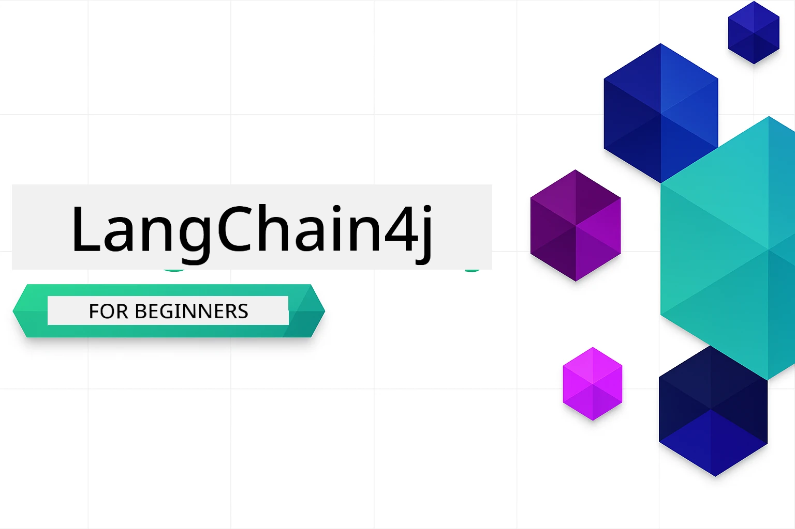

# LangChain4j for Beginners

One course wey dey teach how to build AI applications wit LangChain4j and Azure OpenAI GPT-5.2, from basic chat go reach AI agents.

### 🌐 Multi-Language Support

#### Dem dey support am for GitHub Action (Automated & Always Up-to-Date)

<!-- CO-OP TRANSLATOR LANGUAGES TABLE START -->
[Arabic](../ar/README.md) | [Bengali](../bn/README.md) | [Bulgarian](../bg/README.md) | [Burmese (Myanmar)](../my/README.md) | [Chinese (Simplified)](../zh-CN/README.md) | [Chinese (Traditional, Hong Kong)](../zh-HK/README.md) | [Chinese (Traditional, Macau)](../zh-MO/README.md) | [Chinese (Traditional, Taiwan)](../zh-TW/README.md) | [Croatian](../hr/README.md) | [Czech](../cs/README.md) | [Danish](../da/README.md) | [Dutch](../nl/README.md) | [Estonian](../et/README.md) | [Finnish](../fi/README.md) | [French](../fr/README.md) | [German](../de/README.md) | [Greek](../el/README.md) | [Hebrew](../he/README.md) | [Hindi](../hi/README.md) | [Hungarian](../hu/README.md) | [Indonesian](../id/README.md) | [Italian](../it/README.md) | [Japanese](../ja/README.md) | [Kannada](../kn/README.md) | [Khmer](../km/README.md) | [Korean](../ko/README.md) | [Lithuanian](../lt/README.md) | [Malay](../ms/README.md) | [Malayalam](../ml/README.md) | [Marathi](../mr/README.md) | [Nepali](../ne/README.md) | [Nigerian Pidgin](./README.md) | [Norwegian](../no/README.md) | [Persian (Farsi)](../fa/README.md) | [Polish](../pl/README.md) | [Portuguese (Brazil)](../pt-BR/README.md) | [Portuguese (Portugal)](../pt-PT/README.md) | [Punjabi (Gurmukhi)](../pa/README.md) | [Romanian](../ro/README.md) | [Russian](../ru/README.md) | [Serbian (Cyrillic)](../sr/README.md) | [Slovak](../sk/README.md) | [Slovenian](../sl/README.md) | [Spanish](../es/README.md) | [Swahili](../sw/README.md) | [Swedish](../sv/README.md) | [Tagalog (Filipino)](../tl/README.md) | [Tamil](../ta/README.md) | [Telugu](../te/README.md) | [Thai](../th/README.md) | [Turkish](../tr/README.md) | [Ukrainian](../uk/README.md) | [Urdu](../ur/README.md) | [Vietnamese](../vi/README.md)

> **You Nor Dey Want Small Wahala? Clon am for your system?**
>
> Dis repository get 50+ language translations wey fit make di download big. If you wan clone without translations, use sparse checkout:
>
> **Bash / macOS / Linux:**
> ```bash
> git clone --filter=blob:none --sparse https://github.com/microsoft/LangChain4j-for-Beginners.git
> cd LangChain4j-for-Beginners
> git sparse-checkout set --no-cone '/*' '!translations' '!translated_images'
> ```
>
> **CMD (Windows):**
> ```cmd
> git clone --filter=blob:none --sparse https://github.com/microsoft/LangChain4j-for-Beginners.git
> cd LangChain4j-for-Beginners
> git sparse-checkout set --no-cone "/*" "!translations" "!translated_images"
> ```
>
> Dis one go give you everytin wey you need to complete di course quick quick.
<!-- CO-OP TRANSLATOR LANGUAGES TABLE END -->

## Table of Contents

1. [Introduction](01-introduction/README.md) - Learn di basics of LangChain4j
2. [Prompt Engineering](02-prompt-engineering/README.md) - Master how to design prompt well well
3. [RAG (Retrieval-Augmented Generation)](03-rag/README.md) - Build smart knowledge based systems
4. [Tools](04-tools/README.md) - Connect external tools and simple assistants
5. [MCP (Model Context Protocol)](05-mcp/README.md) - Work wit Model Context Protocol (MCP) and Agentic modules

### Video Walkthroughs

Each module get live session wey we dey go through di ideas and code step by step.

| Module | Video |
|--------|-------|
| 01 - Introduction | [Getting Started with LangChain4j](https://www.youtube.com/live/nl_troDm8rQ) |
| 02 - Prompt Engineering | [Prompt Engineering with LangChain4j](https://www.youtube.com/live/PJ6aBaE6bog) |
| 03 - RAG | [RAG with LangChain4j](https://www.youtube.com/watch?v=_olq75ZH_eY) |
| 04 - Tools & 05 - MCP | [AI Agents with Tools and MCP](https://www.youtube.com/watch?v=O_J30kZc0rw) |

---

##  Learning Path

**You be new for LangChain4j?** Check out di [Glossary](docs/GLOSSARY.md) for wetin key terms and concepts mean.

> **How to Start Quick**

1. Fork dis repository go your GitHub account
2. Click **Code** → **Codespaces** tab → **...** → **New with options...**
3. Use di defaults – dis one go select di Development container wey dem make for dis course
4. Click **Create codespace**
5. Wait 5-10 minutes till environment ready
6. Jump straight go [Introduction](./01-introduction/README.md) to start!

After you finish all di modules, check di [Testing Guide](docs/TESTING.md) to sabi how dem dey test LangChain4j concepts.

> **Note:** Dis training dey use Azure OpenAI. If you never get, start with [FREE Azure account](https://aka.ms/azure-free-account).


## Learning with GitHub Copilot

To start coding quick quick, open dis project inside GitHub Codespace or your local IDE with di devcontainer wey dem provide. Di devcontainer wey dis course use don already set GitHub Copilot for AI paired programming.

Each code example get suggested questions wey you fit ask GitHub Copilot to understand better. Look out for di 💡/🤖 prompts for:

- **Java file headers** - Questions wey dey for each example
- **Module READMEs** - Exploration prompts after di code examples

**How to use am:** Open any code file and ask Copilot di suggested questions. E sabi all about di codebase and fit explain, add more, and suggest other options.

You wan learn more? Check [Copilot for AI Paired Programming](https://aka.ms/GitHubCopilotAI).


## Additional Resources

<!-- CO-OP TRANSLATOR OTHER COURSES START -->
### LangChain
[](https://aka.ms/langchain4j-for-beginners)
[](https://aka.ms/langchainjs-for-beginners?WT.mc_id=m365-94501-dwahlin)
[](https://github.com/microsoft/langchain-for-beginners?WT.mc_id=m365-94501-dwahlin)
---

### Azure / Edge / MCP / Agents
[](https://github.com/microsoft/AZD-for-beginners?WT.mc_id=academic-105485-koreyst)
[](https://github.com/microsoft/edgeai-for-beginners?WT.mc_id=academic-105485-koreyst)
[](https://github.com/microsoft/mcp-for-beginners?WT.mc_id=academic-105485-koreyst)
[](https://github.com/microsoft/ai-agents-for-beginners?WT.mc_id=academic-105485-koreyst)

---
 
### Generative AI Series
[](https://github.com/microsoft/generative-ai-for-beginners?WT.mc_id=academic-105485-koreyst)
[-9333EA?style=for-the-badge&labelColor=E5E7EB&color=9333EA)](https://github.com/microsoft/Generative-AI-for-beginners-dotnet?WT.mc_id=academic-105485-koreyst)
[-C084FC?style=for-the-badge&labelColor=E5E7EB&color=C084FC)](https://github.com/microsoft/generative-ai-for-beginners-java?WT.mc_id=academic-105485-koreyst)
[-E879F9?style=for-the-badge&labelColor=E5E7EB&color=E879F9)](https://github.com/microsoft/generative-ai-with-javascript?WT.mc_id=academic-105485-koreyst)

---
 
### Core Learning
[](https://aka.ms/ml-beginners?WT.mc_id=academic-105485-koreyst)
[](https://aka.ms/datascience-beginners?WT.mc_id=academic-105485-koreyst)
[](https://aka.ms/ai-beginners?WT.mc_id=academic-105485-koreyst)
[](https://github.com/microsoft/Security-101?WT.mc_id=academic-96948-sayoung)
[](https://aka.ms/webdev-beginners?WT.mc_id=academic-105485-koreyst)
[](https://aka.ms/iot-beginners?WT.mc_id=academic-105485-koreyst)
[](https://github.com/microsoft/xr-development-for-beginners?WT.mc_id=academic-105485-koreyst)

---
 
### Copilot Series
[](https://aka.ms/GitHubCopilotAI?WT.mc_id=academic-105485-koreyst)
[](https://github.com/microsoft/mastering-github-copilot-for-dotnet-csharp-developers?WT.mc_id=academic-105485-koreyst)
[](https://github.com/microsoft/CopilotAdventures?WT.mc_id=academic-105485-koreyst)
<!-- CO-OP TRANSLATOR OTHER COURSES END -->

## Getting Help

If you get stuck or get any questions about how to build AI apps, join:

[](https://aka.ms/foundry/discord)

If you get product feedback or errors as you dey build, waka go:

[](https://aka.ms/foundry/forum)

## License

MIT License - See [LICENSE](../../LICENSE) file for details.

---

<!-- CO-OP TRANSLATOR DISCLAIMER START -->
**Disclaimer**:
Dis document don translate wit AI translation service [Co-op Translator](https://github.com/Azure/co-op-translator). Even tho we dey try make am correct, abeg make you know say automated translation fit get errors or mistakes. Di original document for dia own language na im be di correct source. For important info, make person wey sabi human translation do am. We no go responsible for any misunderstanding or wrong understanding wey fit happen because of dis translation.
<!-- CO-OP TRANSLATOR DISCLAIMER END -->