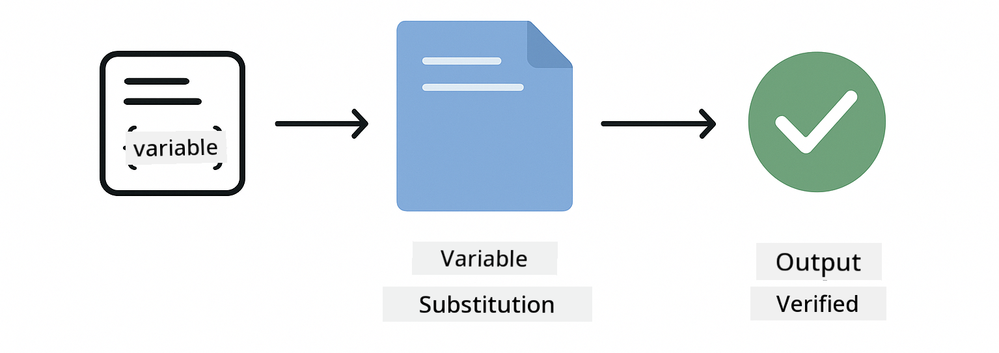
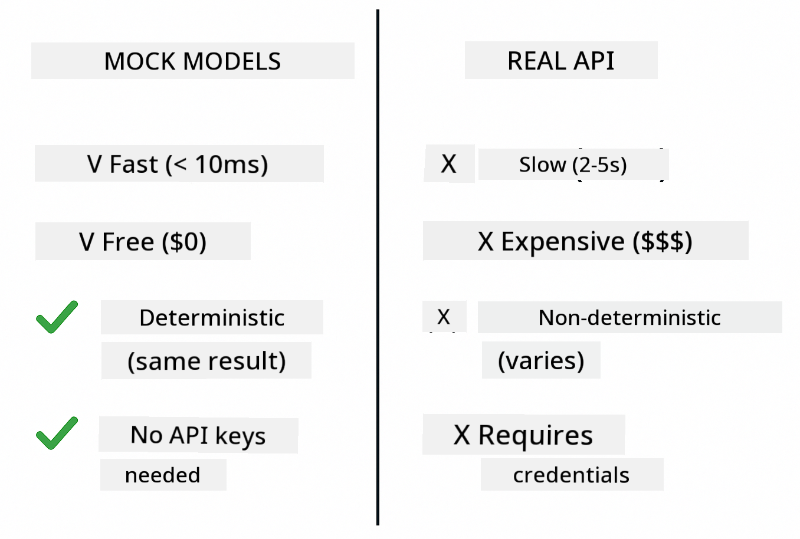

<!--
CO_OP_TRANSLATOR_METADATA:
{
  "original_hash": "ed93b3c14d58734ac10162967da958c1",
  "translation_date": "2025-12-31T07:38:04+00:00",
  "source_file": "docs/TESTING.md",
  "language_code": "pcm"
}
-->
# How to Test LangChain4j Applications

## Table of Contents

- [Quick Start](../../../docs)
- [What the Tests Cover](../../../docs)
- [Running the Tests](../../../docs)
- [Running Tests in VS Code](../../../docs)
- [Testing Patterns](../../../docs)
- [Testing Philosophy](../../../docs)
- [Next Steps](../../../docs)

Dis guide go show you di tests wey dey show how to test AI applications without needing API keys or external services.

## Quick Start

Run all tests with a single command:

**Bash:**
```bash
mvn test
```

**PowerShell:**
```powershell
mvn --% test
```


*Execution wey successful — all tests pass, no failure*

## What the Tests Cover

Dis course dey focus for **unit tests** wey dey run locally. Every test dey show one LangChain4j concept by itself.


*Test pyramid wey show di balance between unit tests (quick, isolated), integration tests (real components), and end-to-end tests. Dis training na unit testing cover.*

| Module | Tests | Focus | Key Files |
|--------|-------|-------|-----------|
| **00 - Quick Start** | 6 | Prompt templates and variable substitution | `SimpleQuickStartTest.java` |
| **01 - Introduction** | 8 | Conversation memory and stateful chat | `SimpleConversationTest.java` |
| **02 - Prompt Engineering** | 12 | GPT-5 patterns, eagerness levels, structured output | `SimpleGpt5PromptTest.java` |
| **03 - RAG** | 10 | Document ingestion, embeddings, similarity search | `DocumentServiceTest.java` |
| **04 - Tools** | 12 | Function calling and tool chaining | `SimpleToolsTest.java` |
| **05 - MCP** | 8 | Model Context Protocol with Stdio transport | `SimpleMcpTest.java` |

## Running the Tests

**Run all tests from root:**

**Bash:**
```bash
mvn test
```

**PowerShell:**
```powershell
mvn --% test
```

**Run tests for a specific module:**

**Bash:**
```bash
cd 01-introduction && mvn test
# Or from di root
mvn test -pl 01-introduction
```

**PowerShell:**
```powershell
cd 01-introduction; mvn --% test
# Abi from root
mvn --% test -pl 01-introduction
```

**Run a single test class:**

**Bash:**
```bash
mvn test -Dtest=SimpleConversationTest
```

**PowerShell:**
```powershell
mvn --% test -Dtest=SimpleConversationTest
```

**Run a specific test method:**

**Bash:**
```bash
mvn test -Dtest=SimpleConversationTest#make e dey keep chat history
```

**PowerShell:**
```powershell
mvn --% test -Dtest=SimpleConversationTest#e suppose dey keep di chat history
```

## Running Tests in VS Code

If you dey use Visual Studio Code, Test Explorer dey give graphical interface to run and debug tests.


*VS Code Test Explorer wey show test tree with all Java test classes and individual test methods*

**To run tests in VS Code:**

1. Open the Test Explorer by clicking the beaker icon in the Activity Bar
2. Expand the test tree to see all modules and test classes
3. Click the play button next to any test to run am one by one
4. Click "Run All Tests" to run the whole suite
5. Right-click any test and select "Debug Test" to set breakpoints and step through code

The Test Explorer dey show green checkmarks for passing tests and e go give detailed failure messages when tests fail.

## Testing Patterns

### Pattern 1: Testing Prompt Templates

The simplest pattern dey test prompt templates without calling any AI model. You go verify say variable substitution dey work correct and prompts dem format as expected.



*Testing prompt templates wey show variable substitution flow: template with placeholders → values applied → formatted output verified*

```java
@Test
@DisplayName("Should format prompt template with variables")
void testPromptTemplateFormatting() {
    PromptTemplate template = PromptTemplate.from(
        "Best time to visit {{destination}} for {{activity}}?"
    );
    
    Prompt prompt = template.apply(Map.of(
        "destination", "Paris",
        "activity", "sightseeing"
    ));
    
    assertThat(prompt.text()).isEqualTo("Best time to visit Paris for sightseeing?");
}
```

This test dey for `00-quick-start/src/test/java/com/example/langchain4j/quickstart/SimpleQuickStartTest.java`.

**Run it:**

**Bash:**
```bash
cd 00-quick-start && mvn test -Dtest=SimpleQuickStartTest#test how prompt template dey format
```

**PowerShell:**
```powershell
cd 00-quick-start; mvn --% test -Dtest=SimpleQuickStartTest#Test wey dey check prompt template format
```

### Pattern 2: Mocking Language Models

When you dey test conversation logic, use Mockito to create fake models wey go return predetermined responses. Dis one make tests fast, free, and deterministic.



*Comparison wey show why mocks dey better for testing: dem quick, dem free, dem deterministic, and dem no need API keys*

```java
@ExtendWith(MockitoExtension.class)
class SimpleConversationTest {
    
    private ConversationService conversationService;
    
    @Mock
    private OpenAiOfficialChatModel mockChatModel;
    
    @BeforeEach
    void setUp() {
        ChatResponse mockResponse = ChatResponse.builder()
            .aiMessage(AiMessage.from("This is a test response"))
            .build();
        when(mockChatModel.chat(anyList())).thenReturn(mockResponse);
        
        conversationService = new ConversationService(mockChatModel);
    }
    
    @Test
    void shouldMaintainConversationHistory() {
        String conversationId = conversationService.startConversation();
        
        ChatResponse mockResponse1 = ChatResponse.builder()
            .aiMessage(AiMessage.from("Response 1"))
            .build();
        ChatResponse mockResponse2 = ChatResponse.builder()
            .aiMessage(AiMessage.from("Response 2"))
            .build();
        ChatResponse mockResponse3 = ChatResponse.builder()
            .aiMessage(AiMessage.from("Response 3"))
            .build();
        
        when(mockChatModel.chat(anyList()))
            .thenReturn(mockResponse1)
            .thenReturn(mockResponse2)
            .thenReturn(mockResponse3);

        conversationService.chat(conversationId, "First message");
        conversationService.chat(conversationId, "Second message");
        conversationService.chat(conversationId, "Third message");

        List<ChatMessage> history = conversationService.getHistory(conversationId);
        assertThat(history).hasSize(6); // 3 user dem + 3 AI message dem
    }
}
```

This pattern dey for `01-introduction/src/test/java/com/example/langchain4j/service/SimpleConversationTest.java`. The mock dey make behaviour steady so you fit verify memory management dey work correct.

### Pattern 3: Testing Conversation Isolation

Conversation memory suppose keep different users separate. Dis test go verify say conversations no dey mix context.


*Testing conversation isolation wey show separate memory stores for different users to prevent context mixing*

```java
@Test
void shouldIsolateConversationsByid() {
    String conv1 = conversationService.startConversation();
    String conv2 = conversationService.startConversation();
    
    ChatResponse mockResponse = ChatResponse.builder()
        .aiMessage(AiMessage.from("Response"))
        .build();
    when(mockChatModel.chat(anyList())).thenReturn(mockResponse);

    conversationService.chat(conv1, "Message for conversation 1");
    conversationService.chat(conv2, "Message for conversation 2");

    List<ChatMessage> history1 = conversationService.getHistory(conv1);
    List<ChatMessage> history2 = conversationService.getHistory(conv2);
    
    assertThat(history1).hasSize(2);
    assertThat(history2).hasSize(2);
}
```

Every conversation get im own independent history. For production systems, dis isolation dey important for multi-user applications.

### Pattern 4: Testing Tools Independently

Tools na functions wey AI fit call. Test dem directly to make sure dem dey work correct no matter wetin AI decide.


*Testing tools independently wey show mock tool execution without AI calls to verify business logic*

```java
@Test
void shouldConvertCelsiusToFahrenheit() {
    TemperatureTool tempTool = new TemperatureTool();
    String result = tempTool.celsiusToFahrenheit(25.0);
    assertThat(result).containsPattern("77[.,]0°F");
}

@Test
void shouldDemonstrateToolChaining() {
    WeatherTool weatherTool = new WeatherTool();
    TemperatureTool tempTool = new TemperatureTool();

    String weatherResult = weatherTool.getCurrentWeather("Seattle");
    assertThat(weatherResult).containsPattern("\\d+°C");

    String conversionResult = tempTool.celsiusToFahrenheit(22.0);
    assertThat(conversionResult).containsPattern("71[.,]6°F");
}
```

These tests for `04-tools/src/test/java/com/example/langchain4j/agents/tools/SimpleToolsTest.java` validate tool logic without AI involvement. The chaining example show how one tool output dey feed another tool input.

### Pattern 5: In-Memory RAG Testing

RAG systems usually need vector databases and embedding services. The in-memory pattern allow you test the whole pipeline without external dependencies.


*In-memory RAG testing workflow wey show document parsing, embedding storage, and similarity search without needing database*

```java
@Test
void testProcessTextDocument() {
    String content = "This is a test document.\nIt has multiple lines.";
    InputStream inputStream = new ByteArrayInputStream(content.getBytes(StandardCharsets.UTF_8));
    
    DocumentService.ProcessedDocument result = 
        documentService.processDocument(inputStream, "test.txt");

    assertNotNull(result);
    assertTrue(result.segments().size() > 0);
    assertEquals("test.txt", result.segments().get(0).metadata().getString("filename"));
}
```

This test for `03-rag/src/test/java/com/example/langchain4j/rag/service/DocumentServiceTest.java` dey create document in memory and verify chunking and metadata handling.

### Pattern 6: MCP Integration Testing

Di MCP module dey test Model Context Protocol integration using stdio transport. These tests dey verify say your application fit spawn and communicate with MCP servers as subprocesses.

The tests for `05-mcp/src/test/java/com/example/langchain4j/mcp/SimpleMcpTest.java` validate MCP client behaviour.

**Run them:**

**Bash:**
```bash
cd 05-mcp && mvn test
```

**PowerShell:**
```powershell
cd 05-mcp; mvn --% test
```

## Testing Philosophy

Test your code, not the AI. Your tests suppose validate di code wey you write by checking how prompts dem dey constructed, how memory dem dey managed, and how tools dem dey execute. AI responses fit change and no suppose be part of test assertions. Ask yourself if your prompt template dey substitute variables correct, not if the AI give correct answer.

Use mocks for language models. Dem na external dependencies wey slow, expensive, and non-deterministic. Mocking go make tests fast — milliseconds instead of seconds — free (no API cost), and deterministic (same result every time).

Keep tests independent. Every test suppose set up im own data, no suppose depend on other tests, and clean up after amself. Tests suppose pass no matter wetin order you run dem.

Test edge cases beyond the happy path. Try empty inputs, very large inputs, special characters, invalid parameters, and boundary conditions. Dem dey often show bugs wey normal usage no go show.

Use descriptive names. Compare `shouldMaintainConversationHistoryAcrossMultipleMessages()` with `test1()`. Di first one tell you exactly wetin dem dey test, e make debugging failures easier.

## Next Steps

Now wey you don understand di testing patterns, dive deeper into each module:

- **[00 - Quick Start](../00-quick-start/README.md)** - Start with prompt template basics
- **[01 - Introduction](../01-introduction/README.md)** - Learn conversation memory management
- **[02 - Prompt Engineering](../02-prompt-engineering/README.md)** - Master GPT-5 prompting patterns
- **[03 - RAG](../03-rag/README.md)** - Build retrieval-augmented generation systems
- **[04 - Tools](../04-tools/README.md)** - Implement function calling and tool chains
- **[05 - MCP](../05-mcp/README.md)** - Integrate Model Context Protocol

Each module README get detailed explanations of di concepts wey dem test here.

---

**Navigation:** [← Back to Main](../README.md)

---

<!-- CO-OP TRANSLATOR DISCLAIMER START -->
Disclaimer:
Dis document don translate use AI translation service [Co-op Translator]. Even though we dey try make am correct, abeg sabi say automated translation fit get mistakes or wrong meaning. Make una treat di original document for im original language as di official source. If na important matter, make you use professional human translator. We no go responsible for any misunderstanding or misinterpretation wey fit happen because of dis translation.
<!-- CO-OP TRANSLATOR DISCLAIMER END -->