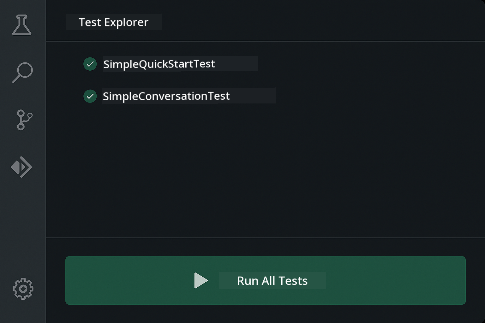

<!--
CO_OP_TRANSLATOR_METADATA:
{
  "original_hash": "b975537560c404d5f254331832811e78",
  "translation_date": "2025-12-13T21:35:54+00:00",
  "source_file": "docs/TESTING.md",
  "language_code": "pcm"
}
-->
# Testing LangChain4j Applications

## Table of Contents

- [Quick Start](../../../docs)
- [Wetin Di Tests Cover](../../../docs)
- [How To Run Di Tests](../../../docs)
- [How To Run Tests for VS Code](../../../docs)
- [Testing Patterns](../../../docs)
- [Testing Philosophy](../../../docs)
- [Next Steps](../../../docs)

Dis guide go show you how tests dem dey work wey go show how to test AI applications without need API keys or outside services.

## Quick Start

Run all di tests with one command:

**Bash:**
```bash
mvn test
```

**PowerShell:**
```powershell
mvn --% test
```


*Successful test execution wey show all tests pass with zero failure*

## Wetin Di Tests Cover

Dis course dey focus on **unit tests** wey dey run locally. Each test dey show one LangChain4j concept by itself.


*Testing pyramid wey show balance between unit tests (fast, isolated), integration tests (real components), and end-to-end tests (full system with Docker). Dis training na for unit testing.*

| Module | Tests | Focus | Key Files |
|--------|-------|-------|-----------|
| **00 - Quick Start** | 6 | Prompt templates and variable substitution | `SimpleQuickStartTest.java` |
| **01 - Introduction** | 8 | Conversation memory and stateful chat | `SimpleConversationTest.java` |
| **02 - Prompt Engineering** | 12 | GPT-5 patterns, eagerness levels, structured output | `SimpleGpt5PromptTest.java` |
| **03 - RAG** | 10 | Document ingestion, embeddings, similarity search | `DocumentServiceTest.java` |
| **04 - Tools** | 12 | Function calling and tool chaining | `SimpleToolsTest.java` |
| **05 - MCP** | 15 | Model Context Protocol with Docker | `SimpleMcpTest.java`, `McpDockerTransportTest.java` |

## How To Run Di Tests

**Run all tests from root:**

**Bash:**
```bash
mvn test
```

**PowerShell:**
```powershell
mvn --% test
```

**Run tests for one specific module:**

**Bash:**
```bash
cd 01-introduction && mvn test
# Or from di root
mvn test -pl 01-introduction
```

**PowerShell:**
```powershell
cd 01-introduction; mvn --% test
# Or from di root
mvn --% test -pl 01-introduction
```

**Run one single test class:**

**Bash:**
```bash
mvn test -Dtest=SimpleConversationTest
```

**PowerShell:**
```powershell
mvn --% test -Dtest=SimpleConversationTest
```

**Run one specific test method:**

**Bash:**
```bash
mvn test -Dtest=SimpleConversationTest#suppose make e keep di konversation history
```

**PowerShell:**
```powershell
mvn --% test -Dtest=SimpleConversationTest#suppose make e keep di konversation history
```

## How To Run Tests for VS Code

If you dey use Visual Studio Code, the Test Explorer dey give graphical interface to run and debug tests.



*VS Code Test Explorer wey show test tree with all Java test classes and individual test methods*

**To run tests for VS Code:**

1. Open Test Explorer by clicking the beaker icon for Activity Bar
2. Expand the test tree to see all modules and test classes
3. Click the play button beside any test to run am one by one
4. Click "Run All Tests" to run the whole suite
5. Right-click any test and select "Debug Test" to set breakpoints and step through code

The Test Explorer dey show green checkmarks for tests wey pass and dey give detailed failure messages when tests fail.

## Testing Patterns


*Six testing patterns for LangChain4j applications: prompt templates, mocking models, conversation isolation, tools testing, in-memory RAG, and Docker integration*

### Pattern 1: Testing Prompt Templates

The simplest pattern na to test prompt templates without calling any AI model. You go check say variable substitution dey work well and prompts dey formatted as e suppose be.


*Testing prompt templates wey show variable substitution flow: template with placeholders → values applied → formatted output verified*

```java
@Test
@DisplayName("Should format prompt template with variables")
void testPromptTemplateFormatting() {
    PromptTemplate template = PromptTemplate.from(
        "Best time to visit {{destination}} for {{activity}}?"
    );
    
    Prompt prompt = template.apply(Map.of(
        "destination", "Paris",
        "activity", "sightseeing"
    ));
    
    assertThat(prompt.text()).isEqualTo("Best time to visit Paris for sightseeing?");
}
```

Dis test dey for `00-quick-start/src/test/java/com/example/langchain4j/quickstart/SimpleQuickStartTest.java`.

**Run am:**

**Bash:**
```bash
cd 00-quick-start && mvn test -Dtest=SimpleQuickStartTest#testPromptTemplateFormatting
```

**PowerShell:**
```powershell
cd 00-quick-start; mvn --% test -Dtest=SimpleQuickStartTest#testPromptTemplateFormatting
```

### Pattern 2: Mocking Language Models

When you dey test conversation logic, use Mockito to create fake models wey go return predetermined responses. Dis one make tests fast, free, and deterministic.


*Comparison wey show why mocks dey better for testing: dem fast, free, deterministic, and no need API keys*

```java
@ExtendWith(MockitoExtension.class)
class SimpleConversationTest {
    
    private ConversationService conversationService;
    
    @Mock
    private OpenAiOfficialChatModel mockChatModel;
    
    @BeforeEach
    void setUp() {
        ChatResponse mockResponse = ChatResponse.builder()
            .aiMessage(AiMessage.from("This is a test response"))
            .build();
        when(mockChatModel.chat(anyList())).thenReturn(mockResponse);
        
        conversationService = new ConversationService(mockChatModel);
    }
    
    @Test
    void shouldMaintainConversationHistory() {
        String conversationId = conversationService.startConversation();
        
        ChatResponse mockResponse1 = ChatResponse.builder()
            .aiMessage(AiMessage.from("Response 1"))
            .build();
        ChatResponse mockResponse2 = ChatResponse.builder()
            .aiMessage(AiMessage.from("Response 2"))
            .build();
        ChatResponse mockResponse3 = ChatResponse.builder()
            .aiMessage(AiMessage.from("Response 3"))
            .build();
        
        when(mockChatModel.chat(anyList()))
            .thenReturn(mockResponse1)
            .thenReturn(mockResponse2)
            .thenReturn(mockResponse3);

        conversationService.chat(conversationId, "First message");
        conversationService.chat(conversationId, "Second message");
        conversationService.chat(conversationId, "Third message");

        List<ChatMessage> history = conversationService.getHistory(conversationId);
        assertThat(history).hasSize(6); // 3 user + 3 AI messages
    }
}
```

Dis pattern dey for `01-introduction/src/test/java/com/example/langchain4j/service/SimpleConversationTest.java`. The mock dey make sure say behavior consistent so you fit verify memory management dey work well.

### Pattern 3: Testing Conversation Isolation

Conversation memory suppose keep many users separate. Dis test go verify say conversations no dey mix contexts.


*Testing conversation isolation wey show separate memory stores for different users to prevent context mixing*

```java
@Test
void shouldIsolateConversationsByid() {
    String conv1 = conversationService.startConversation();
    String conv2 = conversationService.startConversation();
    
    ChatResponse mockResponse = ChatResponse.builder()
        .aiMessage(AiMessage.from("Response"))
        .build();
    when(mockChatModel.chat(anyList())).thenReturn(mockResponse);

    conversationService.chat(conv1, "Message for conversation 1");
    conversationService.chat(conv2, "Message for conversation 2");

    List<ChatMessage> history1 = conversationService.getHistory(conv1);
    List<ChatMessage> history2 = conversationService.getHistory(conv2);
    
    assertThat(history1).hasSize(2);
    assertThat(history2).hasSize(2);
}
```

Each conversation get im own independent history. For production systems, dis isolation na important for multi-user applications.

### Pattern 4: Testing Tools Independently

Tools na functions wey AI fit call. Test dem directly to make sure dem dey work well no matter wetin AI decide.


*Testing tools independently wey show mock tool execution without AI calls to verify business logic*

```java
@Test
void shouldConvertCelsiusToFahrenheit() {
    TemperatureTool tempTool = new TemperatureTool();
    String result = tempTool.celsiusToFahrenheit(25.0);
    assertThat(result).containsPattern("77[.,]0°F");
}

@Test
void shouldDemonstrateToolChaining() {
    WeatherTool weatherTool = new WeatherTool();
    TemperatureTool tempTool = new TemperatureTool();

    String weatherResult = weatherTool.getCurrentWeather("Seattle");
    assertThat(weatherResult).containsPattern("\\d+°C");

    String conversionResult = tempTool.celsiusToFahrenheit(22.0);
    assertThat(conversionResult).containsPattern("71[.,]6°F");
}
```

These tests from `04-tools/src/test/java/com/example/langchain4j/agents/tools/SimpleToolsTest.java` dey validate tool logic without AI involvement. The chaining example dey show how one tool output dey feed another tool input.

### Pattern 5: In-Memory RAG Testing

RAG systems normally need vector databases and embedding services. The in-memory pattern let you test the whole pipeline without outside dependencies.


*In-memory RAG testing workflow wey show document parsing, embedding storage, and similarity search without need database*

```java
@Test
void testProcessTextDocument() {
    String content = "This is a test document.\nIt has multiple lines.";
    InputStream inputStream = new ByteArrayInputStream(content.getBytes(StandardCharsets.UTF_8));
    
    DocumentService.ProcessedDocument result = 
        documentService.processDocument(inputStream, "test.txt");

    assertNotNull(result);
    assertTrue(result.segments().size() > 0);
    assertEquals("test.txt", result.segments().get(0).metadata().getString("filename"));
}
```

Dis test from `03-rag/src/test/java/com/example/langchain4j/rag/service/DocumentServiceTest.java` dey create document for memory and verify chunking and metadata handling.

### Pattern 6: Integration Testing with Docker

Some features need real infrastructure. The MCP module dey use Testcontainers to spin up Docker containers for integration tests. Dem dey validate say your code dey work with real services while still keeping test isolation.


*MCP integration testing with Testcontainers wey show automated container lifecycle: start, test execution, stop, and cleanup*

The tests for `05-mcp/src/test/java/com/example/langchain4j/mcp/McpDockerTransportTest.java` need Docker to dey run.

**Run dem:**

**Bash:**
```bash
cd 05-mcp && mvn test
```

**PowerShell:**
```powershell
cd 05-mcp; mvn --% test
```

## Testing Philosophy

Test your code, no be the AI. Your tests suppose validate the code wey you write by checking how prompts dey constructed, how memory dey managed, and how tools dey execute. AI responses fit change and no suppose be part of test assertions. Ask yourself if your prompt template dey correctly substitute variables, no be if AI dey give correct answer.

Use mocks for language models. Dem na external dependencies wey slow, expensive, and no dey deterministic. Mocking make tests fast with milliseconds instead of seconds, free with no API costs, and deterministic with same result every time.

Keep tests independent. Each test suppose set up im own data, no rely on other tests, and clean up after itself. Tests suppose pass no matter the order wey you run am.

Test edge cases beyond the happy path. Try empty inputs, very big inputs, special characters, invalid parameters, and boundary conditions. These ones dey often show bugs wey normal use no go show.

Use descriptive names. Compare `shouldMaintainConversationHistoryAcrossMultipleMessages()` with `test1()`. The first one go tell you exactly wetin dem dey test, e go make debugging failures easy.

## Next Steps

Now wey you don understand the testing patterns, dive deeper into each module:

- **[00 - Quick Start](../00-quick-start/README.md)** - Start with prompt template basics
- **[01 - Introduction](../01-introduction/README.md)** - Learn conversation memory management
- **[02 - Prompt Engineering](../02-prompt-engineering/README.md)** - Master GPT-5 prompting patterns
- **[03 - RAG](../03-rag/README.md)** - Build retrieval-augmented generation systems
- **[04 - Tools](../04-tools/README.md)** - Implement function calling and tool chains
- **[05 - MCP](../05-mcp/README.md)** - Integrate Model Context Protocol with Docker

Each module README go give detailed explanations of the concepts wey dem test here.

---

**Navigation:** [← Back to Main](../README.md)

---

<!-- CO-OP TRANSLATOR DISCLAIMER START -->
**Disclaimer**:
Dis document don translate wit AI translation service [Co-op Translator](https://github.com/Azure/co-op-translator). Even though we dey try make am correct, abeg sabi say automated translation fit get some errors or wahala. Di original document wey e dey for im own language na di correct one. If na serious matter, e better make human professional translate am. We no go responsible for any misunderstanding or wrong meaning wey fit come from dis translation.
<!-- CO-OP TRANSLATOR DISCLAIMER END -->