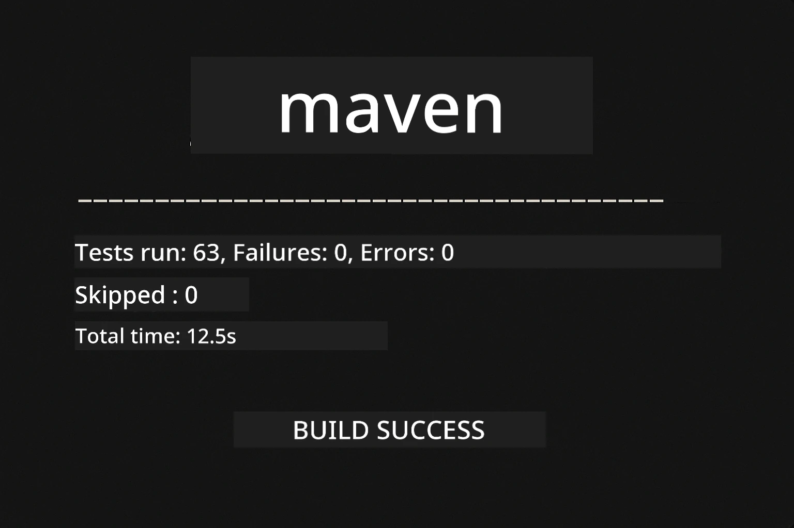
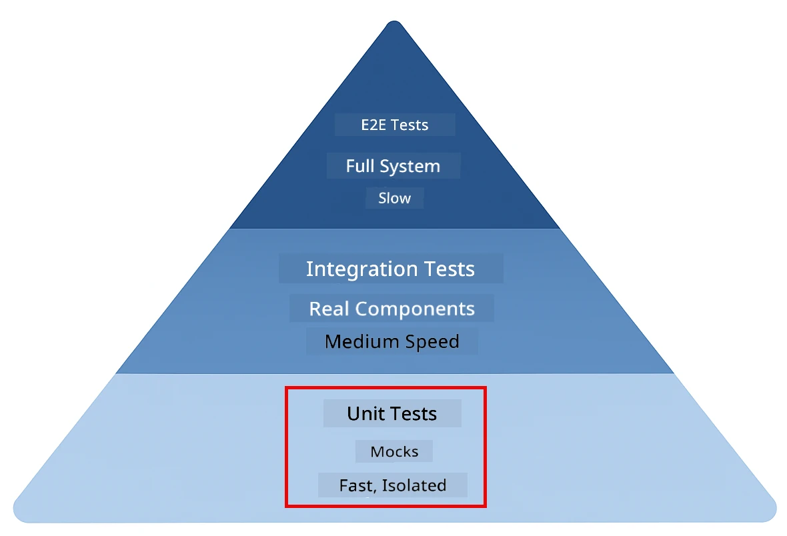
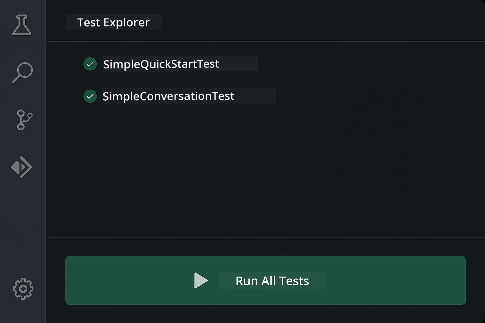
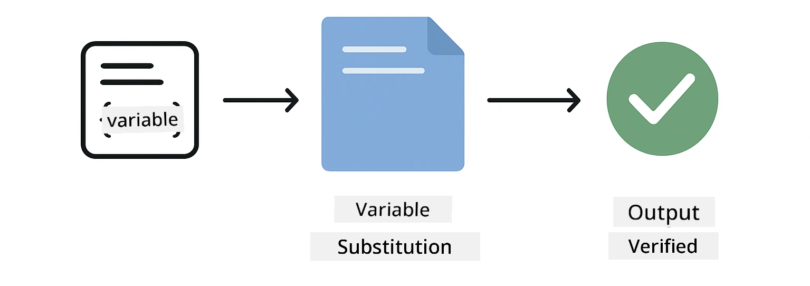
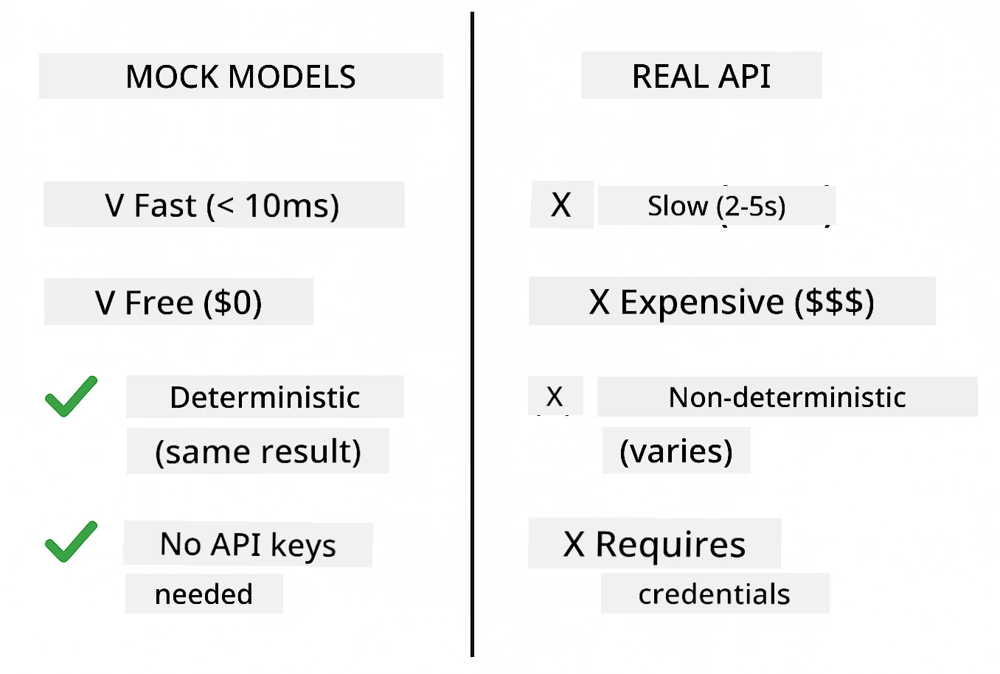
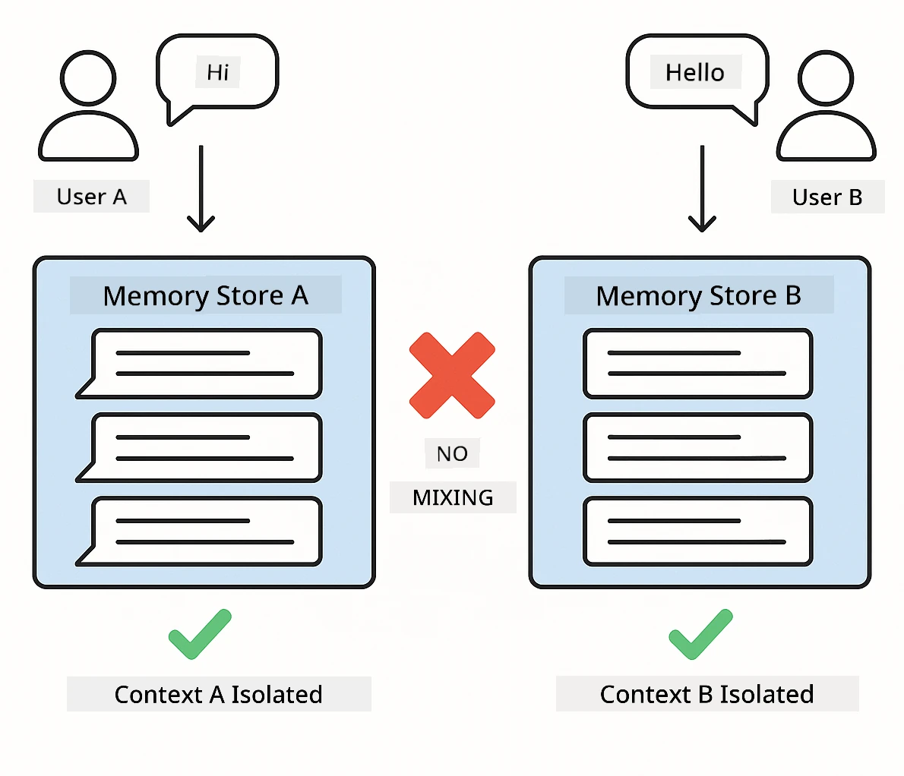
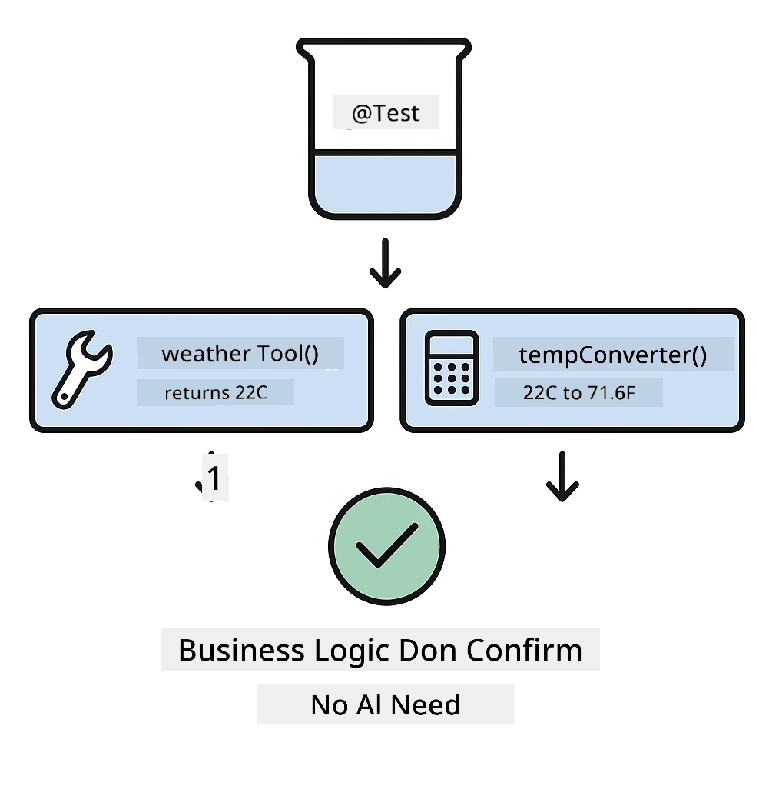
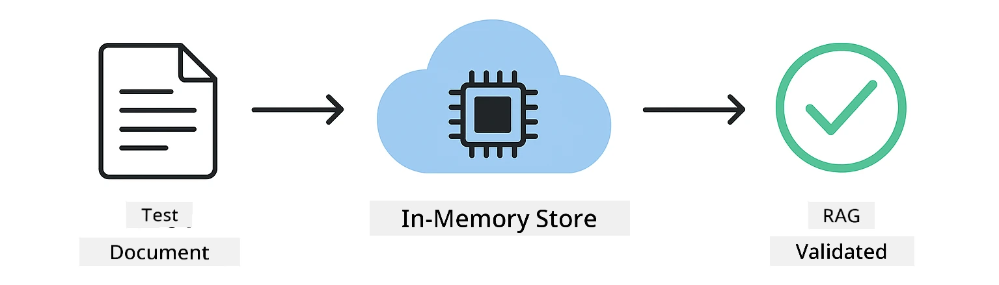

# Testing LangChain4j Applications

## Table of Contents

- [Quick Start](#quick-start)
- [What the Tests Cover](#what-the-tests-cover)
- [Running the Tests](#running-the-tests)
- [Running Tests in VS Code](#running-tests-in-vs-code)
- [Testing Patterns](#testing-patterns)
- [Testing Philosophy](#testing-philosophy)
- [Next Steps](#next-steps)

Dis guide go carry you waka through di tests wey dey show how to test AI applications without need API keys or outside services.

## Quick Start

Run all di tests with one command:

**Bash:**
```bash
mvn test
```

**PowerShell:**
```powershell
mvn --% test
```

When all di tests pass, you go see output wey dey like di screenshot below — tests run without any failure.



*Successful test execution showing all tests passing with zero failures*

## What the Tests Cover

Dis course focus on **unit tests** wey run locally. Every test go show one LangChain4j concept for isolation. Di testing pyramid wey dey below show where unit tests fit — na dem be di fast, reliable base wey all your test strategy build on.



*Testing pyramid showing di balance between unit tests (fast, isolated), integration tests (real components), and end-to-end tests. Dis training cover unit testing.*

| Module | Tests | Focus | Key Files |
|--------|-------|-------|-----------|
| **01 - Introduction** | 8 | Conversation memory and stateful chat | `SimpleConversationTest.java` |
| **02 - Prompt Engineering** | 12 | GPT-5.2 patterns, eagerness levels, structured output | `SimpleGpt5PromptTest.java` |
| **03 - RAG** | 10 | Document ingestion, embeddings, similarity search | `DocumentServiceTest.java` |
| **04 - Tools** | 12 | Function calling and tool chaining | `SimpleToolsTest.java` |
| **05 - MCP** | 8 | Model Context Protocol with Stdio transport | `SimpleMcpTest.java` |

## Running the Tests

**Run all di tests from root:**

**Bash:**
```bash
mvn test
```

**PowerShell:**
```powershell
mvn --% test
```

**Run tests for one specific module:**

**Bash:**
```bash
cd 01-introduction && mvn test
# Or from di root
mvn test -pl 01-introduction
```

**PowerShell:**
```powershell
cd 01-introduction; mvn --% test
# Or from di root
mvn --% test -pl 01-introduction
```

**Run one single test class:**

**Bash:**
```bash
mvn test -Dtest=SimpleConversationTest
```

**PowerShell:**
```powershell
mvn --% test -Dtest=SimpleConversationTest
```

**Run one specific test method:**

**Bash:**
```bash
mvn test -Dtest=SimpleConversationTest#suppose make dey remember wetin we don yarn before
```

**PowerShell:**
```powershell
mvn --% test -Dtest=SimpleConversationTest#suppose make e keep di tori wey dem don yarn before
```

## Running Tests in VS Code

If you dey use Visual Studio Code, di Test Explorer go give graphical interface to run and debug tests.



*VS Code Test Explorer showing di test tree with all Java test classes and individual test methods*

**How to run tests for VS Code:**

1. Open di Test Explorer by clicking di beaker icon for di Activity Bar
2. Expand di test tree to see all di modules and test classes
3. Click di play button beside any test to run am one-one
4. Click "Run All Tests" to run di whole suite
5. Right-click any test and choose "Debug Test" to set breakpoints and step through code

Di Test Explorer go show green checkmarks for di tests wey pass and give detailed failure messages when any test fail.

## Testing Patterns

### Pattern 1: Testing Prompt Templates

Di simplest pattern test prompt templates without calling any AI model. You dey check whether variable substitution dey work well and prompt dem correct.



*Testing prompt templates showing variable substitution flow: template with placeholders → values applied → formatted output verified*

```java
@Test
@DisplayName("Should format prompt template with variables")
void testPromptTemplateFormatting() {
    PromptTemplate template = PromptTemplate.from(
        "Best time to visit {{destination}} for {{activity}}?"
    );
    
    Prompt prompt = template.apply(Map.of(
        "destination", "Paris",
        "activity", "sightseeing"
    ));
    
    assertThat(prompt.text()).isEqualTo("Best time to visit Paris for sightseeing?");
}
```

Dis pattern dey verify say variable substitution dey work well and prompt dem format correct — no API key or model call needed.

### Pattern 2: Mocking Language Models

When you dey test conversation logic, use Mockito to make fake models wey return predetermined replies. Dis one make di tests fast, free, and deterministic.



*Comparison showing why mocks dey preferred for testing: dem dey fast, free, deterministic, and dem no need API keys*

```java
@ExtendWith(MockitoExtension.class)
class SimpleConversationTest {
    
    private ConversationService conversationService;
    
    @Mock
    private OpenAiOfficialChatModel mockChatModel;
    
    @BeforeEach
    void setUp() {
        ChatResponse mockResponse = ChatResponse.builder()
            .aiMessage(AiMessage.from("This is a test response"))
            .build();
        when(mockChatModel.chat(anyList())).thenReturn(mockResponse);
        
        conversationService = new ConversationService(mockChatModel);
    }
    
    @Test
    void shouldMaintainConversationHistory() {
        String conversationId = conversationService.startConversation();
        
        ChatResponse mockResponse1 = ChatResponse.builder()
            .aiMessage(AiMessage.from("Response 1"))
            .build();
        ChatResponse mockResponse2 = ChatResponse.builder()
            .aiMessage(AiMessage.from("Response 2"))
            .build();
        ChatResponse mockResponse3 = ChatResponse.builder()
            .aiMessage(AiMessage.from("Response 3"))
            .build();
        
        when(mockChatModel.chat(anyList()))
            .thenReturn(mockResponse1)
            .thenReturn(mockResponse2)
            .thenReturn(mockResponse3);

        conversationService.chat(conversationId, "First message");
        conversationService.chat(conversationId, "Second message");
        conversationService.chat(conversationId, "Third message");

        List<ChatMessage> history = conversationService.getHistory(conversationId);
        assertThat(history).hasSize(6); // 3 user + 3 AI messages
    }
}
```

Dis pattern dey `01-introduction/src/test/java/com/example/langchain4j/service/SimpleConversationTest.java`. Di mock dey make sure behaviour consistent so you fit verify memory management dey work well.

### Pattern 3: Testing Conversation Isolation

Conversation memory suppose keep different users separate. Dis test dey check say conversations no dey mix contexts.



*Testing conversation isolation showing separate memory stores for different users to prevent context mixing*

```java
@Test
void shouldIsolateConversationsByid() {
    String conv1 = conversationService.startConversation();
    String conv2 = conversationService.startConversation();
    
    ChatResponse mockResponse = ChatResponse.builder()
        .aiMessage(AiMessage.from("Response"))
        .build();
    when(mockChatModel.chat(anyList())).thenReturn(mockResponse);

    conversationService.chat(conv1, "Message for conversation 1");
    conversationService.chat(conv2, "Message for conversation 2");

    List<ChatMessage> history1 = conversationService.getHistory(conv1);
    List<ChatMessage> history2 = conversationService.getHistory(conv2);
    
    assertThat(history1).hasSize(2);
    assertThat(history2).hasSize(2);
}
```

Every conversation get im own independent history. For production systems, dis kind isolation na important for multi-user applications.

### Pattern 4: Testing Tools Independently

Tools na functions wey AI fit call. Test dem directly to make sure dem dey work correct no matter wetin AI decide.



*Testing tools independently showing mock tool execution without AI calls to verify business logic*

```java
@Test
void shouldConvertCelsiusToFahrenheit() {
    TemperatureTool tempTool = new TemperatureTool();
    String result = tempTool.celsiusToFahrenheit(25.0);
    assertThat(result).containsPattern("77[.,]0°F");
}

@Test
void shouldDemonstrateToolChaining() {
    WeatherTool weatherTool = new WeatherTool();
    TemperatureTool tempTool = new TemperatureTool();

    String weatherResult = weatherTool.getCurrentWeather("Seattle");
    assertThat(weatherResult).containsPattern("\\d+°C");

    String conversionResult = tempTool.celsiusToFahrenheit(22.0);
    assertThat(conversionResult).containsPattern("71[.,]6°F");
}
```

Dis tests from `04-tools/src/test/java/com/example/langchain4j/agents/tools/SimpleToolsTest.java` dey validate tool logic without AI input. Di chaining example show how one tool output dey enter another tool input.

### Pattern 5: In-Memory RAG Testing

RAG systems normally need vector databases and embedding services. Di in-memory pattern make you fit test di whole pipeline without outside dependencies.



*In-memory RAG testing workflow showing document parsing, embedding storage, and similarity search without requiring a database*

```java
@Test
void testProcessTextDocument() {
    String content = "This is a test document.\nIt has multiple lines.";
    InputStream inputStream = new ByteArrayInputStream(content.getBytes(StandardCharsets.UTF_8));
    
    DocumentService.ProcessedDocument result = 
        documentService.processDocument(inputStream, "test.txt");

    assertNotNull(result);
    assertTrue(result.segments().size() > 0);
    assertEquals("test.txt", result.segments().get(0).metadata().getString("filename"));
}
```

Dis test from `03-rag/src/test/java/com/example/langchain4j/rag/service/DocumentServiceTest.java` dey create one document inside memory and verify how e dey chunk and handle metadata.

### Pattern 6: MCP Integration Testing

Di MCP module dey test Model Context Protocol integration wey use stdio transport. Dem tests go verify say your app fit spawn and communicate with MCP servers as subprocesses.

Tests for `05-mcp/src/test/java/com/example/langchain4j/mcp/SimpleMcpTest.java` dey validate MCP client behaviour.

**Run them:**

**Bash:**
```bash
cd 05-mcp && mvn test
```

**PowerShell:**
```powershell
cd 05-mcp; mvn --% test
```

## Testing Philosophy

Test your code, no be AI. Your tests suppose validate di code wey you write by checking how prompts dem build, how memory dey handle, and how tools dey execute. AI responses dey different every time and no suppose be part of test assertions. Ask yourself if your prompt template correctly substitute variables, no be if AI dey give correct answer.

Use mocks for language models. Dem be outside dependencies wey slow, expensive, and no dey predictable. Mocking dey make tests fast with milliseconds instead of seconds, free with no API money, and deterministic with di same result every time.

Keep tests independent. Every test suppose set up im own data, no rely on other tests, and clean up after imself. Tests suppose pass no matter di order wey dem run.

Test edge cases wey go beyond di happy path. Try empty inputs, very big inputs, special characters, invalid parameters, and boundary conditions. Dem dey always show bugs wey normal usage no dey expose.

Use descriptive names. Compare `shouldMaintainConversationHistoryAcrossMultipleMessages()` with `test1()`. Di first one tell you exactly wetin dem dey test, e dey make debugging failure easy.

## Next Steps

Now wey you don understand di testing patterns, dive deeper inside each module:

- **[01 - Introduction](../01-introduction/README.md)** - Learn how to manage conversation memory
- **[02 - Prompt Engineering](../02-prompt-engineering/README.md)** - Master GPT-5.2 prompting patterns
- **[03 - RAG](../03-rag/README.md)** - Build retrieval-augmented generation systems
- **[04 - Tools](../04-tools/README.md)** - Implement function calling and tool chains
- **[05 - MCP](../05-mcp/README.md)** - Integrate Model Context Protocol

Every module's README go give detailed tori about the concepts wey dey tested here.

---

**Navigation:** [← Back to Main](../README.md)

---

<!-- CO-OP TRANSLATOR DISCLAIMER START -->
**Disclaimer**:
Dis document don translate wit AI translation service [Co-op Translator](https://github.com/Azure/co-op-translator). Even tho we dey try make am correct, abeg make you know say automated translation fit get errors or mistakes. Di original document for dia own language na im be di correct source. For important info, make person wey sabi human translation do am. We no go responsible for any misunderstanding or wrong understanding wey fit happen because of dis translation.
<!-- CO-OP TRANSLATOR DISCLAIMER END -->