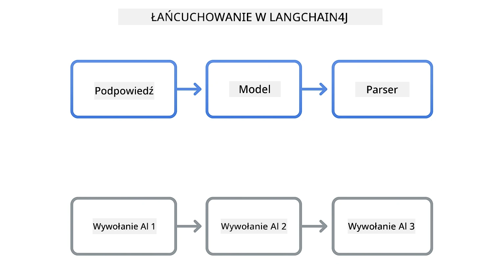
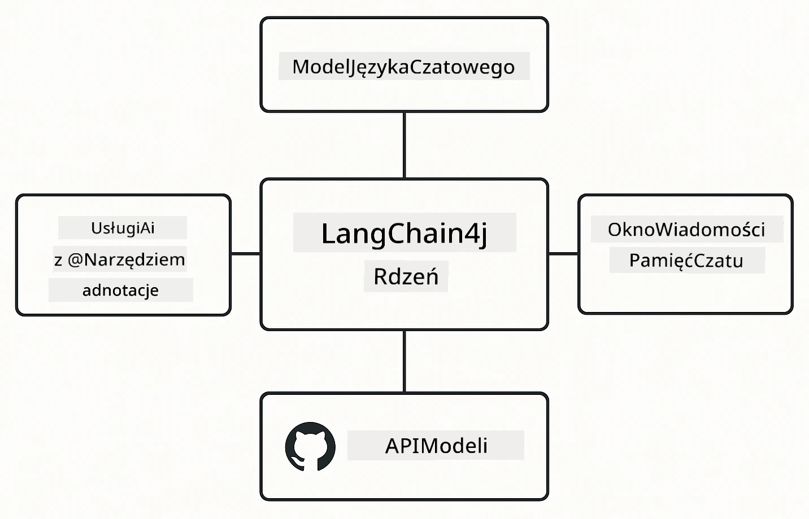

# Moduł 00: Szybki start

## Spis treści

- [Wprowadzenie](../../../00-quick-start)
- [Czym jest LangChain4j?](../../../00-quick-start)
- [Zależności LangChain4j](../../../00-quick-start)
- [Wymagania wstępne](../../../00-quick-start)
- [Konfiguracja](../../../00-quick-start)
  - [1. Pobierz swój token GitHub](../../../00-quick-start)
  - [2. Ustaw swój token](../../../00-quick-start)
- [Uruchom przykłady](../../../00-quick-start)
  - [1. Podstawowy czat](../../../00-quick-start)
  - [2. Wzorce promptów](../../../00-quick-start)
  - [3. Wywoływanie funkcji](../../../00-quick-start)
  - [4. Pytania i odpowiedzi na podstawie dokumentów (RAG)](../../../00-quick-start)
  - [5. Odpowiedzialna sztuczna inteligencja](../../../00-quick-start)
- [Co pokazuje każdy przykład](../../../00-quick-start)
- [Kolejne kroki](../../../00-quick-start)
- [Rozwiązywanie problemów](../../../00-quick-start)

## Wprowadzenie

Ten szybki start ma na celu jak najszybsze uruchomienie LangChain4j. Obejmuje absolutne podstawy budowania aplikacji AI z LangChain4j i modelami GitHub. W kolejnych modułach użyjesz Azure OpenAI z LangChain4j, aby tworzyć bardziej zaawansowane aplikacje.

## Czym jest LangChain4j?

LangChain4j to biblioteka Java, która upraszcza tworzenie aplikacji napędzanych sztuczną inteligencją. Zamiast zajmować się klientami HTTP i analizą JSON, pracujesz z czystymi interfejsami API w języku Java.

„Chain” w LangChain odnosi się do łączenia ze sobą wielu komponentów – możesz powiązać prompt z modelem i parserem lub połączyć wiele wywołań AI, gdzie jedno wyjście jest wejściem do następnego. Ten szybki start koncentruje się na podstawach, zanim przejdziemy do bardziej złożonych łańcuchów.



*Łączenie komponentów w LangChain4j – bloki konstrukcyjne tworzą potężne przepływy AI*

Użyjemy trzech głównych komponentów:

**ChatLanguageModel** – interfejs do interakcji z modelem AI. Wywołaj `model.chat("prompt")` i otrzymaj odpowiedź w postaci łańcucha znaków. Używamy `OpenAiOfficialChatModel`, który współpracuje z punktami końcowymi kompatybilnymi z OpenAI, takimi jak GitHub Models.

**AiServices** – tworzy bezpieczne typowo interfejsy usług AI. Definiujesz metody, oznaczasz je adnotacją `@Tool`, a LangChain4j zajmuje się orkiestracją. AI automatycznie wywołuje Twoje metody w Javie w razie potrzeby.

**MessageWindowChatMemory** – utrzymuje historię rozmowy. Bez tego każde zapytanie jest niezależne. Z tym komponentem AI pamięta poprzednie wiadomości i utrzymuje kontekst przez wiele tur.



*Architektura LangChain4j – główne komponenty współpracują, aby zasilać twoje aplikacje AI*

## Zależności LangChain4j

Ten szybki start używa dwóch zależności Maven w [`pom.xml`](../../../00-quick-start/pom.xml):

```xml
<!-- Core LangChain4j library -->
<dependency>
    <groupId>dev.langchain4j</groupId>
    <artifactId>langchain4j</artifactId> <!-- Inherited from BOM in root pom.xml -->
</dependency>

<!-- OpenAI integration (works with GitHub Models) -->
<dependency>
    <groupId>dev.langchain4j</groupId>
    <artifactId>langchain4j-open-ai-official</artifactId> <!-- Inherited from BOM in root pom.xml -->
</dependency>
```
  
Moduł `langchain4j-open-ai-official` dostarcza klasę `OpenAiOfficialChatModel` łączącą się z API kompatybilnymi z OpenAI. GitHub Models używa tego samego formatu API, więc nie jest potrzebny specjalny adapter – wystarczy wskazać podstawowy adres URL na `https://models.github.ai/inference`.

## Wymagania wstępne

**Używasz kontenera deweloperskiego?** Java i Maven są już zainstalowane. Potrzebujesz tylko osobistego tokena dostępu GitHub.

**Lokalny rozwój:**  
- Java 21+, Maven 3.9+  
- Osobisty token dostępu GitHub (instrukcje poniżej)

> **Uwaga:** Ten moduł używa modelu `gpt-4.1-nano` z GitHub Models. Nie modyfikuj nazwy modelu w kodzie – jest skonfigurowany do pracy z dostępnymi modelami GitHub.

## Konfiguracja

### 1. Pobierz swój token GitHub

1. Przejdź do [Ustawienia GitHub → Personal Access Tokens](https://github.com/settings/personal-access-tokens)  
2. Kliknij „Generate new token”  
3. Ustaw opisową nazwę (np. „LangChain4j Demo”)  
4. Ustaw czas ważności (zalecane 7 dni)  
5. W sekcji „Account permissions” znajdź „Models” i ustaw na „Read-only”  
6. Kliknij „Generate token”  
7. Skopiuj i zapisz token – nie zobaczysz go ponownie

### 2. Ustaw swój token

**Opcja 1: Używając VS Code (zalecane)**

Jeśli używasz VS Code, dodaj token do pliku `.env` w katalogu głównym projektu:

Jeśli plik `.env` nie istnieje, skopiuj `.env.example` do `.env` lub utwórz nowy plik `.env` w katalogu głównym projektu.

**Przykładowy plik `.env`:**  
```bash
# W /workspaces/LangChain4j-for-Beginners/.env
GITHUB_TOKEN=your_token_here
```
  
Następnie możesz kliknąć prawym przyciskiem myszy dowolny plik demo (np. `BasicChatDemo.java`) w Eksploratorze i wybrać **„Run Java”** lub użyć konfiguracji uruchamiania z panelu Run and Debug.

**Opcja 2: Używając terminala**

Ustaw token jako zmienną środowiskową:

**Bash:**  
```bash
export GITHUB_TOKEN=your_token_here
```
  
**PowerShell:**  
```powershell
$env:GITHUB_TOKEN=your_token_here
```
  
## Uruchom przykłady

**Używając VS Code:** Wystarczy kliknąć prawym przyciskiem myszy dowolny plik demo w Eksploratorze i wybrać **„Run Java”** lub użyć konfiguracji uruchamiania z panelu Run and Debug (upewnij się, że najpierw dodałeś token do pliku `.env`).

**Używając Maven:** Alternatywnie możesz uruchomić z linii poleceń:

### 1. Podstawowy czat

**Bash:**  
```bash
mvn compile exec:java -Dexec.mainClass=com.example.langchain4j.quickstart.BasicChatDemo
```
  
**PowerShell:**  
```powershell
mvn --% compile exec:java -Dexec.mainClass=com.example.langchain4j.quickstart.BasicChatDemo
```
  
### 2. Wzorce promptów

**Bash:**  
```bash
mvn compile exec:java -Dexec.mainClass=com.example.langchain4j.quickstart.PromptEngineeringDemo
```
  
**PowerShell:**  
```powershell
mvn --% compile exec:java -Dexec.mainClass=com.example.langchain4j.quickstart.PromptEngineeringDemo
```
  
Pokazuje prompt zero-shot, few-shot, chain-of-thought oraz role-based.

### 3. Wywoływanie funkcji

**Bash:**  
```bash
mvn compile exec:java -Dexec.mainClass=com.example.langchain4j.quickstart.ToolIntegrationDemo
```
  
**PowerShell:**  
```powershell
mvn --% compile exec:java -Dexec.mainClass=com.example.langchain4j.quickstart.ToolIntegrationDemo
```
  
AI automatycznie wywołuje twoje metody w Javie, gdy jest to potrzebne.

### 4. Pytania i odpowiedzi na podstawie dokumentów (RAG)

**Bash:**  
```bash
mvn compile exec:java -Dexec.mainClass=com.example.langchain4j.quickstart.SimpleReaderDemo
```
  
**PowerShell:**  
```powershell
mvn --% compile exec:java -Dexec.mainClass=com.example.langchain4j.quickstart.SimpleReaderDemo
```
  
Zadaj pytania dotyczące zawartości pliku `document.txt`.

### 5. Odpowiedzialna sztuczna inteligencja

**Bash:**  
```bash
mvn compile exec:java -Dexec.mainClass=com.example.langchain4j.quickstart.ResponsibleAIDemo
```
  
**PowerShell:**  
```powershell
mvn --% compile exec:java -Dexec.mainClass=com.example.langchain4j.quickstart.ResponsibleAIDemo
```
  
Zobacz, jak filtry bezpieczeństwa AI blokują szkodliwe treści.

## Co pokazuje każdy przykład

**Podstawowy czat** – [BasicChatDemo.java](../../../00-quick-start/src/main/java/com/example/langchain4j/quickstart/BasicChatDemo.java)

Zacznij tutaj, aby zobaczyć LangChain4j w najprostszej formie. Utworzysz `OpenAiOfficialChatModel`, wyślesz prompt przez `.chat()` i otrzymasz odpowiedź. To pokazuje fundamenty: jak inicjalizować modele z niestandardowymi punktami końcowymi i kluczami API. Gdy zrozumiesz ten wzór, wszystko inne na nim bazuje.

```java
ChatLanguageModel model = OpenAiOfficialChatModel.builder()
    .baseUrl("https://models.github.ai/inference")
    .apiKey(System.getenv("GITHUB_TOKEN"))
    .modelName("gpt-4.1-nano")
    .build();

String response = model.chat("What is LangChain4j?");
System.out.println(response);
```
  
> **🤖 Wypróbuj z [GitHub Copilot](https://github.com/features/copilot) Chat:** Otwórz [`BasicChatDemo.java`](../../../00-quick-start/src/main/java/com/example/langchain4j/quickstart/BasicChatDemo.java) i zapytaj:  
> - „Jak przełączyć się z GitHub Models na Azure OpenAI w tym kodzie?”  
> - „Jakie inne parametry mogę skonfigurować w OpenAiOfficialChatModel.builder()?”  
> - „Jak dodać strumieniowe odpowiedzi zamiast czekać na pełną odpowiedź?”

**Inżynieria promptów** – [PromptEngineeringDemo.java](../../../00-quick-start/src/main/java/com/example/langchain4j/quickstart/PromptEngineeringDemo.java)

Teraz, gdy wiesz jak rozmawiać z modelem, zobaczmy co do niego mówisz. Demo pokazuje cztery różne wzorce promptów, używając tego samego modelu. Wypróbuj prompt zero-shot z bezpośrednimi instrukcjami, few-shot uczące na przykładach, chain-of-thought pokazujące kroki rozumowania oraz role-based ustawiające kontekst. Zobaczysz, jak ten sam model daje zupełnie inne wyniki w zależności od konstrukcji promptu.

```java
PromptTemplate template = PromptTemplate.from(
    "What's the best time to visit {{destination}} for {{activity}}?"
);

Prompt prompt = template.apply(Map.of(
    "destination", "Paris",
    "activity", "sightseeing"
));

String response = model.chat(prompt.text());
```
  
> **🤖 Wypróbuj z [GitHub Copilot](https://github.com/features/copilot) Chat:** Otwórz [`PromptEngineeringDemo.java`](../../../00-quick-start/src/main/java/com/example/langchain4j/quickstart/PromptEngineeringDemo.java) i zapytaj:  
> - „Jaka jest różnica między promptem zero-shot, a few-shot i kiedy ich używać?”  
> - „Jak parametr temperature wpływa na odpowiedzi modelu?”  
> - „Jakie są techniki zapobiegania atakom typu prompt injection w produkcji?”  
> - „Jak stworzyć wielokrotnego użytku obiekty PromptTemplate dla popularnych wzorców?”

**Integracja narzędzi** – [ToolIntegrationDemo.java](../../../00-quick-start/src/main/java/com/example/langchain4j/quickstart/ToolIntegrationDemo.java)

Tu LangChain4j staje się potężny. Użyjesz `AiServices`, aby stworzyć asystenta AI, który może wywoływać twoje metody Java. Wystarczy oznaczyć metody adnotacją `@Tool("opis")` a LangChain4j zajmie się resztą – AI sam decyduje, którego narzędzia użyć na podstawie zapytań użytkownika. To pokazuje wywoływanie funkcji, kluczową technikę do budowania AI, które potrafi działać, a nie tylko odpowiadać na pytania.

```java
@Tool("Performs addition of two numeric values")
public double add(double a, double b) {
    return a + b;
}

MathAssistant assistant = AiServices.create(MathAssistant.class, model);
String response = assistant.chat("What is 25 plus 17?");
```
  
> **🤖 Wypróbuj z [GitHub Copilot](https://github.com/features/copilot) Chat:** Otwórz [`ToolIntegrationDemo.java`](../../../00-quick-start/src/main/java/com/example/langchain4j/quickstart/ToolIntegrationDemo.java) i zapytaj:  
> - „Jak działa adnotacja @Tool i co LangChain4j robi z nią w tle?”  
> - „Czy AI może wywołać kilka narzędzi kolejno, by rozwiązać złożone problemy?”  
> - „Co się stanie, jeśli narzędzie rzuci wyjątek – jak obsługiwać błędy?”  
> - „Jak zintegrować prawdziwe API zamiast tego przykładu kalkulatora?”

**Pytania i odpowiedzi na podstawie dokumentów (RAG)** – [SimpleReaderDemo.java](../../../00-quick-start/src/main/java/com/example/langchain4j/quickstart/SimpleReaderDemo.java)

Tu zobaczysz fundament podejścia RAG (retrieval-augmented generation). Zamiast opierać się na danych treningowych modelu, ładujesz zawartość z [`document.txt`](../../../00-quick-start/document.txt) i włączasz ją do promptu. AI odpowiada na podstawie twojego dokumentu, a nie ogólnej wiedzy. To pierwszy krok do budowy systemów pracujących na własnych danych.

```java
Document document = FileSystemDocumentLoader.loadDocument("document.txt");
String content = document.text();

String prompt = "Based on this document: " + content + 
                "\nQuestion: What is the main topic?";
String response = model.chat(prompt);
```
  
> **Uwaga:** To proste podejście ładuje cały dokument do promptu. Dla dużych plików (>10KB) przekroczysz limity kontekstu. Moduł 03 omawia dzielenie plików i wyszukiwanie wektorowe dla produkcyjnych systemów RAG.

> **🤖 Wypróbuj z [GitHub Copilot](https://github.com/features/copilot) Chat:** Otwórz [`SimpleReaderDemo.java`](../../../00-quick-start/src/main/java/com/example/langchain4j/quickstart/SimpleReaderDemo.java) i zapytaj:  
> - „Jak RAG zapobiega halucynacjom AI w porównaniu do danych treningowych modelu?”  
> - „Jaka jest różnica między tym prostym podejściem a używaniem osadzeń wektorowych do wyszukiwania?”  
> - „Jak skalować to rozwiązanie do wielu dokumentów lub większych baz wiedzy?”  
> - „Jak najlepiej strukturyzować prompt, by AI korzystała wyłącznie z dostarczonego kontekstu?”

**Odpowiedzialna sztuczna inteligencja** – [ResponsibleAIDemo.java](../../../00-quick-start/src/main/java/com/example/langchain4j/quickstart/ResponsibleAIDemo.java)

Buduj bezpieczeństwo AI z wielowarstwowymi zabezpieczeniami. Demo pokazuje dwa poziomy ochrony współdziałające razem:

**Część 1: LangChain4j Input Guardrails** – blokowanie niebezpiecznych promptów zanim trafią do LLM. Twórz własne strażnice sprawdzające zabronione słowa lub wzorce. Działają w twoim kodzie, więc są szybkie i darmowe.

```java
class DangerousContentGuardrail implements InputGuardrail {
    @Override
    public InputGuardrailResult validate(UserMessage userMessage) {
        String text = userMessage.singleText().toLowerCase();
        if (text.contains("explosives")) {
            return fatal("Blocked: contains prohibited keyword");
        }
        return success();
    }
}
```
  
**Część 2: Filtry bezpieczeństwa dostawcy** – GitHub Models ma wbudowane filtry wychwytujące to, co mogą pominąć strażnice. Zobaczysz twarde blokady (błędy HTTP 400) przy poważnych naruszeniach oraz miękkie odmowy, gdzie AI grzecznie odmawia.

> **🤖 Wypróbuj z [GitHub Copilot](https://github.com/features/copilot) Chat:** Otwórz [`ResponsibleAIDemo.java`](../../../00-quick-start/src/main/java/com/example/langchain4j/quickstart/ResponsibleAIDemo.java) i zapytaj:  
> - „Czym jest InputGuardrail i jak stworzyć własną?”  
> - „Czym różni się twarda blokada od miękkiej odmowy?”  
> - „Dlaczego warto używać obu: strażnic i filtrów dostawcy jednocześnie?”

## Kolejne kroki

**Następny moduł:** [01-introduction - Pierwsze kroki z LangChain4j i gpt-5 na Azure](../01-introduction/README.md)

---

**Nawigacja:** [← Powrót do głównej](../README.md) | [Dalej: Moduł 01 - Wprowadzenie →](../01-introduction/README.md)

---

## Rozwiązywanie problemów

### Pierwsze budowanie Maven

**Problem:** Pierwsze `mvn clean compile` lub `mvn package` trwa długo (10-15 minut)

**Przyczyna:** Maven musi pobrać wszystkie zależności projektu (Spring Boot, biblioteki LangChain4j, SDK Azure itp.) przy pierwszym budowaniu.

**Rozwiązanie:** To normalne zachowanie. Kolejne budowania będą znacznie szybsze, gdy zależności zostaną zapisane lokalnie. Czas pobierania zależy od szybkości twojego łącza.

### Składnia poleceń Maven w PowerShell

**Problem:** Polecenia Maven kończą się błędem `Unknown lifecycle phase ".mainClass=..."`

**Przyczyna:** PowerShell interpretuje `=` jako operator przypisania zmiennej, co psuje składnię właściwości Maven.
**Rozwiązanie**: Użyj operatora stop-parsing `--%` przed poleceniem Maven:

**PowerShell:**
```powershell
mvn --% compile exec:java -Dexec.mainClass=com.example.langchain4j.quickstart.BasicChatDemo
```

**Bash:**
```bash
mvn compile exec:java -Dexec.mainClass=com.example.langchain4j.quickstart.BasicChatDemo
```

Operator `--%` mówi PowerShell, aby przekazał wszystkie pozostałe argumenty dosłownie do Maven bez interpretacji.

### Wyświetlanie emoji w Windows PowerShell

**Problem**: Odpowiedzi AI pokazują znaki śmieciowe (np. `????` lub `â??`) zamiast emoji w PowerShell

**Przyczyna**: Domyślne kodowanie PowerShell nie obsługuje emoji UTF-8

**Rozwiązanie**: Uruchom to polecenie przed uruchomieniem aplikacji Java:
```cmd
chcp 65001
```

To wymusza kodowanie UTF-8 w terminalu. Alternatywnie użyj Windows Terminal, który ma lepsze wsparcie Unicode.

### Debugowanie wywołań API

**Problem**: Błędy uwierzytelniania, limity zapytań lub nieoczekiwane odpowiedzi z modelu AI

**Rozwiązanie**: Przykłady zawierają `.logRequests(true)` i `.logResponses(true)`, aby pokazać wywołania API w konsoli. Pomaga to rozwiązywać błędy uwierzytelniania, limity zapytań lub nieoczekiwane odpowiedzi. Usuń te flagi w środowisku produkcyjnym, aby zmniejszyć hałas w logach.

---

<!-- CO-OP TRANSLATOR DISCLAIMER START -->
**Wyłączenie odpowiedzialności**:  
Niniejszy dokument został przetłumaczony za pomocą automatycznej usługi tłumaczeniowej AI [Co-op Translator](https://github.com/Azure/co-op-translator). Mimo że dążymy do dokładności, prosimy mieć na uwadze, że tłumaczenia automatyczne mogą zawierać błędy lub nieścisłości. Oryginalny dokument w jego oryginalnym języku należy uznać za źródło autorytatywne. W przypadku informacji krytycznych zaleca się skorzystanie z profesjonalnego tłumaczenia przez człowieka. Nie ponosimy odpowiedzialności za jakiekolwiek nieporozumienia lub błędne interpretacje wynikające z korzystania z tego tłumaczenia.
<!-- CO-OP TRANSLATOR DISCLAIMER END -->