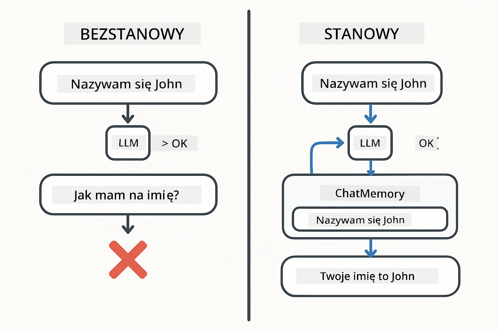
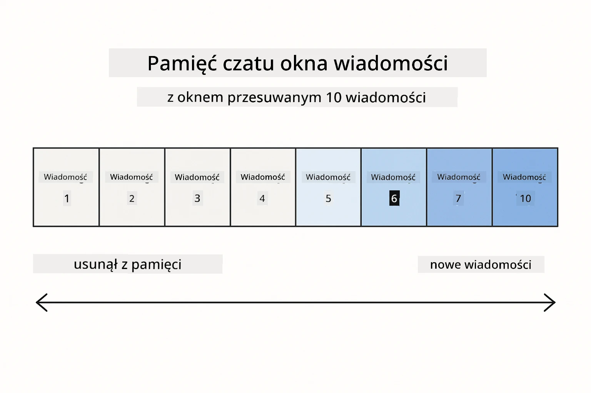
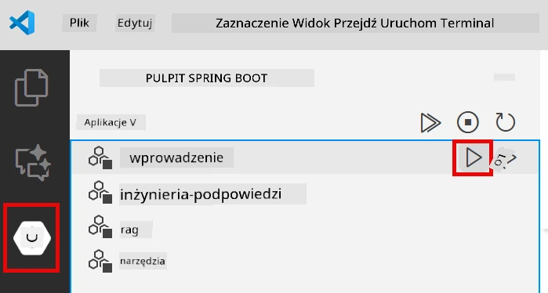
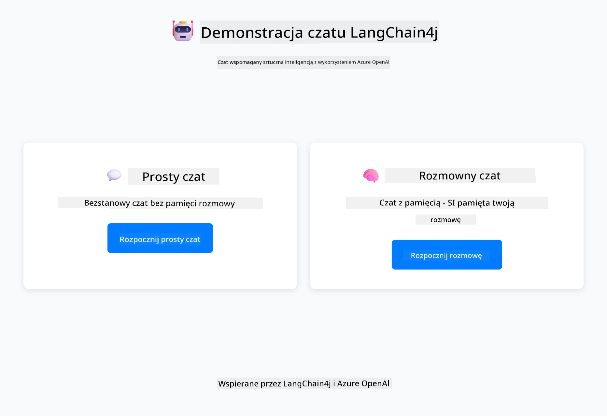
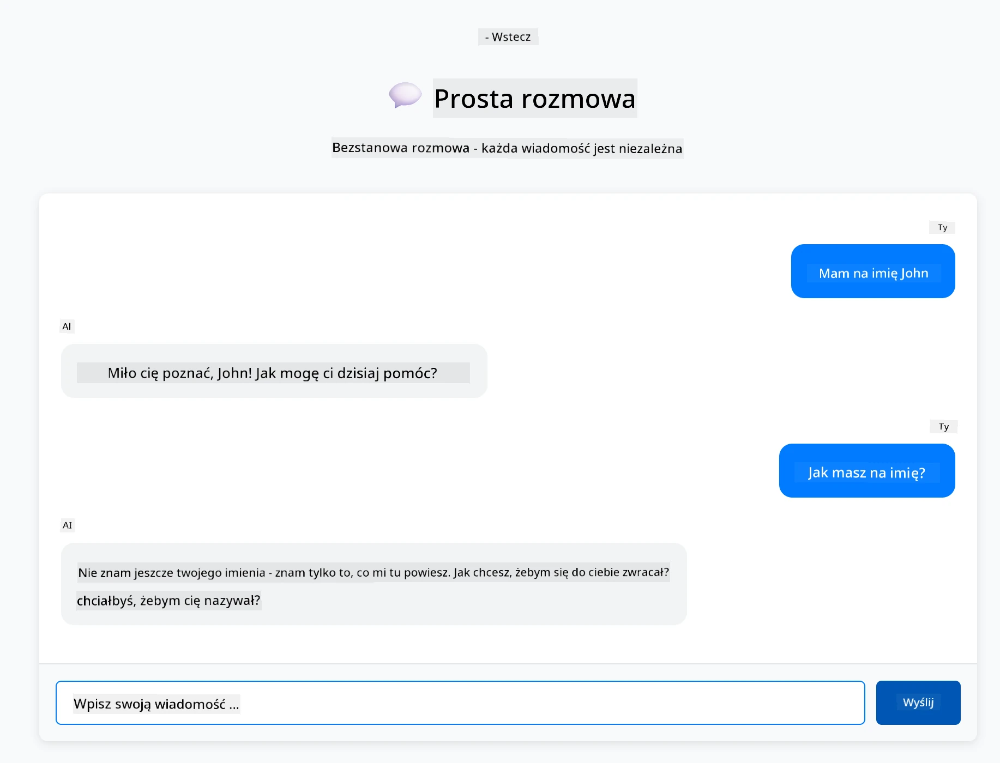
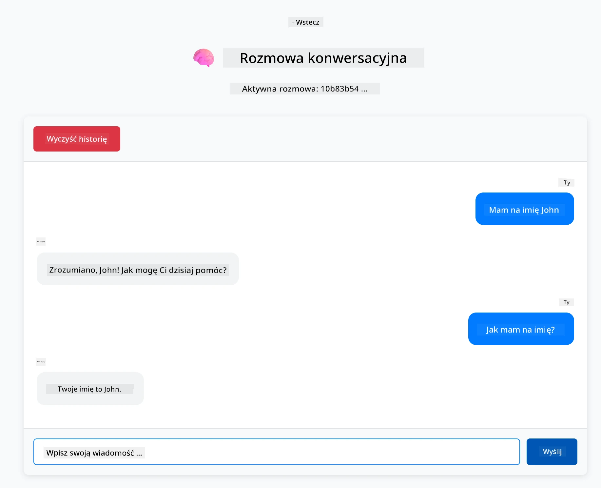

<!--
CO_OP_TRANSLATOR_METADATA:
{
  "original_hash": "c3e07ca58d0b8a3f47d3bf5728541e0a",
  "translation_date": "2025-12-13T13:33:41+00:00",
  "source_file": "01-introduction/README.md",
  "language_code": "pl"
}
-->
# Moduł 01: Rozpoczęcie pracy z LangChain4j

## Spis treści

- [Czego się nauczysz](../../../01-introduction)
- [Wymagania wstępne](../../../01-introduction)
- [Zrozumienie podstawowego problemu](../../../01-introduction)
- [Zrozumienie tokenów](../../../01-introduction)
- [Jak działa pamięć](../../../01-introduction)
- [Jak to wykorzystuje LangChain4j](../../../01-introduction)
- [Wdrożenie infrastruktury Azure OpenAI](../../../01-introduction)
- [Uruchomienie aplikacji lokalnie](../../../01-introduction)
- [Korzystanie z aplikacji](../../../01-introduction)
  - [Czat bezstanowy (lewy panel)](../../../01-introduction)
  - [Czat stanowy (prawy panel)](../../../01-introduction)
- [Kolejne kroki](../../../01-introduction)

## Czego się nauczysz

Jeśli ukończyłeś szybki start, widziałeś, jak wysyłać zapytania i otrzymywać odpowiedzi. To podstawa, ale prawdziwe aplikacje potrzebują więcej. Ten moduł nauczy Cię, jak budować konwersacyjne AI, które pamięta kontekst i utrzymuje stan – różnicę między jednorazową demonstracją a aplikacją gotową do produkcji.

W całym przewodniku będziemy korzystać z GPT-5 Azure OpenAI, ponieważ jego zaawansowane zdolności rozumowania sprawiają, że zachowanie różnych wzorców jest bardziej widoczne. Gdy dodasz pamięć, wyraźnie zobaczysz różnicę. To ułatwia zrozumienie, co każdy komponent wnosi do Twojej aplikacji.

Zbudujesz jedną aplikację, która demonstruje oba wzorce:

**Czat bezstanowy** – Każde zapytanie jest niezależne. Model nie pamięta poprzednich wiadomości. To wzorzec, którego używałeś w szybkim starcie.

**Konwersacja stanowa** – Każde zapytanie zawiera historię rozmowy. Model utrzymuje kontekst przez wiele tur. To jest to, czego wymagają aplikacje produkcyjne.

## Wymagania wstępne

- Subskrypcja Azure z dostępem do Azure OpenAI
- Java 21, Maven 3.9+
- Azure CLI (https://learn.microsoft.com/en-us/cli/azure/install-azure-cli)
- Azure Developer CLI (azd) (https://learn.microsoft.com/en-us/azure/developer/azure-developer-cli/install-azd)

> **Uwaga:** Java, Maven, Azure CLI i Azure Developer CLI (azd) są preinstalowane w dostarczonym devcontainerze.

> **Uwaga:** Ten moduł korzysta z GPT-5 na Azure OpenAI. Wdrożenie jest konfigurowane automatycznie przez `azd up` – nie modyfikuj nazwy modelu w kodzie.

## Zrozumienie podstawowego problemu

Modele językowe są bezstanowe. Każde wywołanie API jest niezależne. Jeśli wyślesz "Mam na imię John", a potem zapytasz "Jak mam na imię?", model nie ma pojęcia, że właśnie się przedstawiłeś. Traktuje każde zapytanie, jakby to była pierwsza rozmowa, jaką kiedykolwiek prowadziłeś.

To jest w porządku dla prostych pytań i odpowiedzi, ale bezużyteczne dla prawdziwych aplikacji. Boty obsługi klienta muszą pamiętać, co im powiedziałeś. Asystenci osobowi potrzebują kontekstu. Każda rozmowa wieloturnowa wymaga pamięci.



*Różnica między rozmowami bezstanowymi (niezależne wywołania) a stanowymi (świadome kontekstu)*

## Zrozumienie tokenów

Zanim zagłębimy się w rozmowy, ważne jest zrozumienie tokenów – podstawowych jednostek tekstu, które przetwarzają modele językowe:


*Przykład, jak tekst jest dzielony na tokeny – "I love AI!" staje się 4 oddzielnymi jednostkami przetwarzania*

Tokeny to sposób, w jaki modele AI mierzą i przetwarzają tekst. Słowa, interpunkcja, a nawet spacje mogą być tokenami. Twój model ma limit, ile tokenów może przetworzyć naraz (400 000 dla GPT-5, z maksymalnie 272 000 tokenów wejściowych i 128 000 wyjściowych). Zrozumienie tokenów pomaga zarządzać długością rozmowy i kosztami.

## Jak działa pamięć

Pamięć czatu rozwiązuje problem bezstanowości, utrzymując historię rozmowy. Przed wysłaniem zapytania do modelu, framework dołącza odpowiednie poprzednie wiadomości. Kiedy pytasz "Jak mam na imię?", system faktycznie wysyła całą historię rozmowy, pozwalając modelowi zobaczyć, że wcześniej powiedziałeś "Mam na imię John."

LangChain4j dostarcza implementacje pamięci, które obsługują to automatycznie. Wybierasz, ile wiadomości zachować, a framework zarządza oknem kontekstowym.



*MessageWindowChatMemory utrzymuje przesuwne okno ostatnich wiadomości, automatycznie usuwając stare*

## Jak to wykorzystuje LangChain4j

Ten moduł rozszerza szybki start, integrując Spring Boot i dodając pamięć rozmowy. Oto jak elementy współgrają:

**Zależności** – Dodaj dwie biblioteki LangChain4j:

```xml
<dependency>
    <groupId>dev.langchain4j</groupId>
    <artifactId>langchain4j</artifactId> <!-- Inherited from BOM in root pom.xml -->
</dependency>
<dependency>
    <groupId>dev.langchain4j</groupId>
    <artifactId>langchain4j-open-ai-official</artifactId> <!-- Inherited from BOM in root pom.xml -->
</dependency>
```

**Model czatu** – Skonfiguruj Azure OpenAI jako bean Springa ([LangChainConfig.java](../../../01-introduction/src/main/java/com/example/langchain4j/config/LangChainConfig.java)):

```java
@Bean
public OpenAiOfficialChatModel openAiOfficialChatModel() {
    return OpenAiOfficialChatModel.builder()
            .baseUrl(azureEndpoint)
            .apiKey(azureApiKey)
            .modelName(deploymentName)
            .timeout(Duration.ofMinutes(5))
            .maxRetries(3)
            .build();
}
```

Builder odczytuje poświadczenia z zmiennych środowiskowych ustawionych przez `azd up`. Ustawienie `baseUrl` na Twój punkt końcowy Azure sprawia, że klient OpenAI działa z Azure OpenAI.

**Pamięć rozmowy** – Śledź historię czatu za pomocą MessageWindowChatMemory ([ConversationService.java](../../../01-introduction/src/main/java/com/example/langchain4j/service/ConversationService.java)):

```java
ChatMemory memory = MessageWindowChatMemory.withMaxMessages(10);

memory.add(UserMessage.from("My name is John"));
memory.add(AiMessage.from("Nice to meet you, John!"));

memory.add(UserMessage.from("What's my name?"));
AiMessage aiMessage = chatModel.chat(memory.messages()).aiMessage();
memory.add(aiMessage);
```

Utwórz pamięć z `withMaxMessages(10)`, aby zachować ostatnie 10 wiadomości. Dodawaj wiadomości użytkownika i AI za pomocą typowanych wrapperów: `UserMessage.from(text)` i `AiMessage.from(text)`. Pobierz historię przez `memory.messages()` i wyślij ją do modelu. Serwis przechowuje oddzielne instancje pamięci dla każdego ID rozmowy, pozwalając wielu użytkownikom rozmawiać jednocześnie.

> **🤖 Wypróbuj z [GitHub Copilot](https://github.com/features/copilot) Chat:** Otwórz [`ConversationService.java`](../../../01-introduction/src/main/java/com/example/langchain4j/service/ConversationService.java) i zapytaj:
> - "Jak MessageWindowChatMemory decyduje, które wiadomości usunąć, gdy okno jest pełne?"
> - "Czy mogę zaimplementować własne przechowywanie pamięci używając bazy danych zamiast pamięci w RAM?"
> - "Jak dodać podsumowanie, aby skompresować starą historię rozmowy?"

Endpoint czatu bezstanowego pomija pamięć całkowicie – po prostu `chatModel.chat(prompt)` jak w szybkim starcie. Endpoint stanowy dodaje wiadomości do pamięci, pobiera historię i dołącza ten kontekst do każdego zapytania. Ta sama konfiguracja modelu, różne wzorce.

## Wdrożenie infrastruktury Azure OpenAI

**Bash:**
```bash
cd 01-introduction
azd up  # Wybierz subskrypcję i lokalizację (zalecane eastus2)
```

**PowerShell:**
```powershell
cd 01-introduction
azd up  # Wybierz subskrypcję i lokalizację (zalecane eastus2)
```

> **Uwaga:** Jeśli napotkasz błąd timeout (`RequestConflict: Cannot modify resource ... provisioning state is not terminal`), po prostu uruchom ponownie `azd up`. Zasoby Azure mogą nadal się wdrażać w tle, a ponowne uruchomienie pozwala na ukończenie wdrożenia, gdy zasoby osiągną stan końcowy.

To spowoduje:
1. Wdrożenie zasobu Azure OpenAI z modelami GPT-5 i text-embedding-3-small
2. Automatyczne wygenerowanie pliku `.env` w katalogu głównym projektu z poświadczeniami
3. Ustawienie wszystkich wymaganych zmiennych środowiskowych

**Masz problemy z wdrożeniem?** Zobacz [Infrastructure README](infra/README.md) dla szczegółowego rozwiązywania problemów, w tym konfliktów nazw subdomen, ręcznych kroków wdrożenia w Azure Portal oraz wskazówek dotyczących konfiguracji modelu.

**Sprawdź, czy wdrożenie się powiodło:**

**Bash:**
```bash
cat ../.env  # Powinno pokazywać AZURE_OPENAI_ENDPOINT, API_KEY itp.
```

**PowerShell:**
```powershell
Get-Content ..\.env  # Powinno pokazywać AZURE_OPENAI_ENDPOINT, API_KEY itp.
```

> **Uwaga:** Komenda `azd up` automatycznie generuje plik `.env`. Jeśli będziesz musiał go później zaktualizować, możesz edytować plik `.env` ręcznie lub wygenerować go ponownie, uruchamiając:
>
> **Bash:**
> ```bash
> cd ..
> bash .azd-env.sh
> ```
>
> **PowerShell:**
> ```powershell
> cd ..
> .\.azd-env.ps1
> ```

## Uruchomienie aplikacji lokalnie

**Sprawdź wdrożenie:**

Upewnij się, że plik `.env` istnieje w katalogu głównym z poświadczeniami Azure:

**Bash:**
```bash
cat ../.env  # Powinno pokazywać AZURE_OPENAI_ENDPOINT, API_KEY, DEPLOYMENT
```

**PowerShell:**
```powershell
Get-Content ..\.env  # Powinno pokazywać AZURE_OPENAI_ENDPOINT, API_KEY, DEPLOYMENT
```

**Uruchom aplikacje:**

**Opcja 1: Korzystanie z Spring Boot Dashboard (zalecane dla użytkowników VS Code)**

Dev container zawiera rozszerzenie Spring Boot Dashboard, które zapewnia wizualny interfejs do zarządzania wszystkimi aplikacjami Spring Boot. Znajdziesz je na pasku aktywności po lewej stronie VS Code (ikona Spring Boot).

Z poziomu Spring Boot Dashboard możesz:
- Zobaczyć wszystkie dostępne aplikacje Spring Boot w workspace
- Uruchamiać/zatrzymywać aplikacje jednym kliknięciem
- Przeglądać logi aplikacji w czasie rzeczywistym
- Monitorować status aplikacji

Po prostu kliknij przycisk play obok "introduction", aby uruchomić ten moduł, lub uruchom wszystkie moduły naraz.



**Opcja 2: Korzystanie ze skryptów shell**

Uruchom wszystkie aplikacje webowe (moduły 01-04):

**Bash:**
```bash
cd ..  # Z katalogu głównego
./start-all.sh
```

**PowerShell:**
```powershell
cd ..  # Z katalogu głównego
.\start-all.ps1
```

Lub uruchom tylko ten moduł:

**Bash:**
```bash
cd 01-introduction
./start.sh
```

**PowerShell:**
```powershell
cd 01-introduction
.\start.ps1
```

Oba skrypty automatycznie ładują zmienne środowiskowe z pliku `.env` w katalogu głównym i zbudują pliki JAR, jeśli jeszcze nie istnieją.

> **Uwaga:** Jeśli wolisz zbudować wszystkie moduły ręcznie przed uruchomieniem:
>
> **Bash:**
> ```bash
> cd ..  # Go to root directory
> mvn clean package -DskipTests
> ```
>
> **PowerShell:**
> ```powershell
> cd ..  # Go to root directory
> mvn clean package -DskipTests
> ```

Otwórz http://localhost:8080 w przeglądarce.

**Aby zatrzymać:**

**Bash:**
```bash
./stop.sh  # Tylko ten moduł
# Lub
cd .. && ./stop-all.sh  # Wszystkie moduły
```

**PowerShell:**
```powershell
.\stop.ps1  # Tylko ten moduł
# Lub
cd ..; .\stop-all.ps1  # Wszystkie moduły
```

## Korzystanie z aplikacji

Aplikacja udostępnia interfejs webowy z dwoma implementacjami czatu obok siebie.



*Panel pokazujący zarówno prosty czat (bezstanowy), jak i konwersacyjny czat (stanowy)*

### Czat bezstanowy (lewy panel)

Wypróbuj najpierw to. Zapytaj "Mam na imię John", a potem od razu "Jak mam na imię?" Model nie zapamięta, ponieważ każda wiadomość jest niezależna. To demonstruje podstawowy problem integracji modelu językowego – brak kontekstu rozmowy.



*AI nie pamięta Twojego imienia z poprzedniej wiadomości*

### Czat stanowy (prawy panel)

Teraz spróbuj tej samej sekwencji tutaj. Zapytaj "Mam na imię John", a potem "Jak mam na imię?" Tym razem pamięta. Różnicą jest MessageWindowChatMemory – utrzymuje historię rozmowy i dołącza ją do każdego zapytania. Tak działa produkcyjne AI konwersacyjne.



*AI pamięta Twoje imię z wcześniejszej części rozmowy*

Oba panele korzystają z tego samego modelu GPT-5. Jedyną różnicą jest pamięć. To jasno pokazuje, co pamięć wnosi do Twojej aplikacji i dlaczego jest niezbędna w rzeczywistych zastosowaniach.

## Kolejne kroki

**Następny moduł:** [02-prompt-engineering - Inżynieria promptów z GPT-5](../02-prompt-engineering/README.md)

---

**Nawigacja:** [← Poprzedni: Moduł 00 - Szybki start](../00-quick-start/README.md) | [Powrót do głównego](../README.md) | [Następny: Moduł 02 - Inżynieria promptów →](../02-prompt-engineering/README.md)

---

<!-- CO-OP TRANSLATOR DISCLAIMER START -->
**Zastrzeżenie**:  
Niniejszy dokument został przetłumaczony za pomocą usługi tłumaczenia AI [Co-op Translator](https://github.com/Azure/co-op-translator). Mimo że dokładamy starań, aby tłumaczenie było jak najbardziej precyzyjne, prosimy mieć na uwadze, że automatyczne tłumaczenia mogą zawierać błędy lub nieścisłości. Oryginalny dokument w języku źródłowym powinien być uznawany za źródło autorytatywne. W przypadku informacji krytycznych zalecane jest skorzystanie z profesjonalnego tłumaczenia wykonanego przez człowieka. Nie ponosimy odpowiedzialności za jakiekolwiek nieporozumienia lub błędne interpretacje wynikające z korzystania z tego tłumaczenia.
<!-- CO-OP TRANSLATOR DISCLAIMER END -->