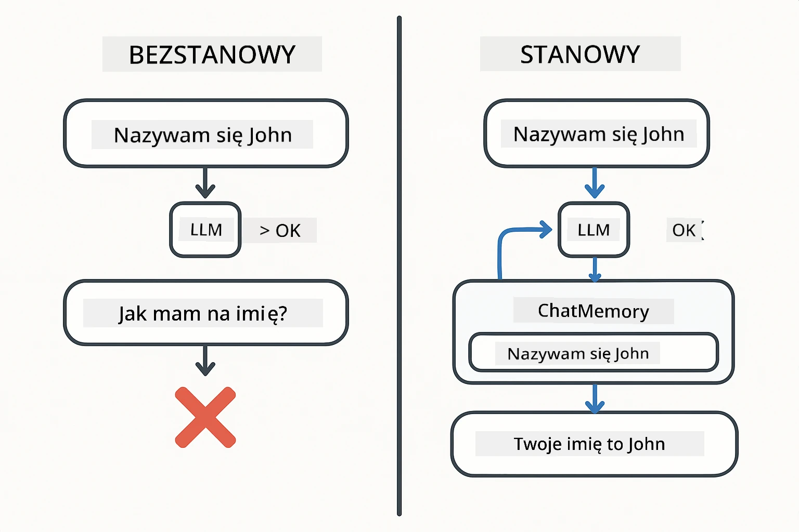
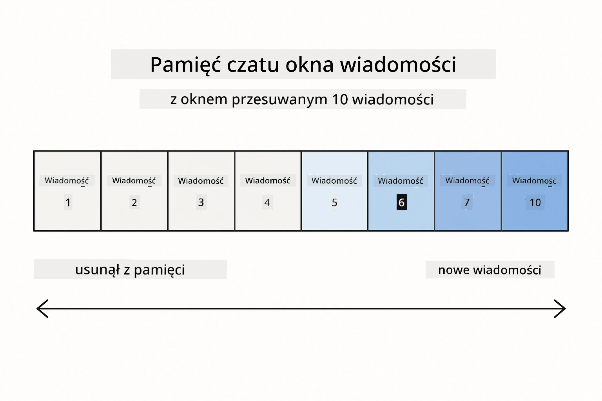
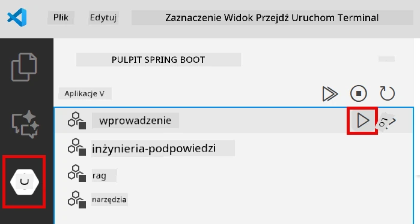
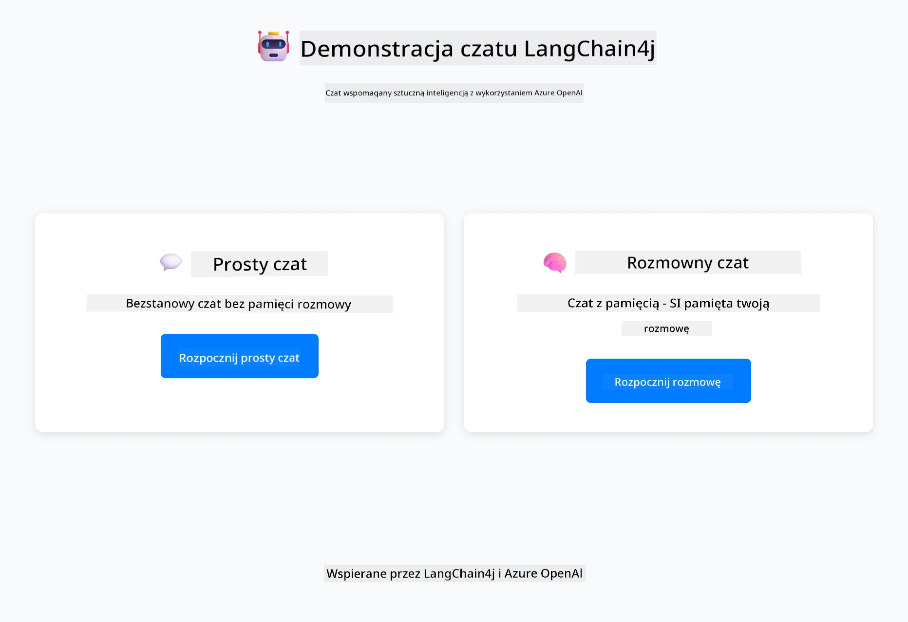
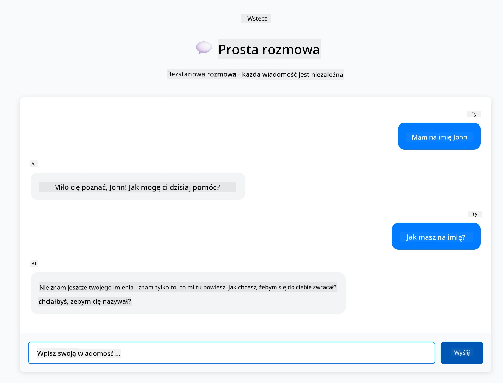
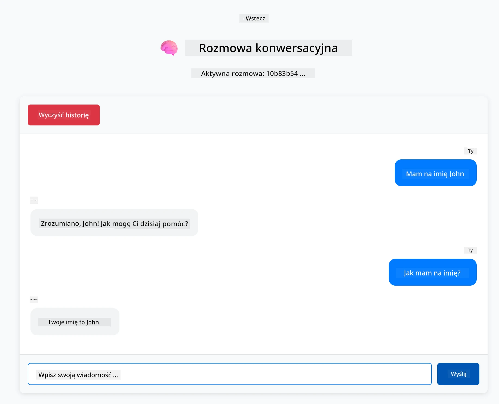

# Moduł 01: Rozpoczęcie pracy z LangChain4j

## Spis treści

- [Wideo przewodnik](#wideo-przewodnik)
- [Czego się nauczysz](#czego-się-nauczysz)
- [Wymagania wstępne](#wymagania-wstępne)
- [Zrozumienie podstawowego problemu](#zrozumienie-podstawowego-problemu)
- [Zrozumienie tokenów](#zrozumienie-tokenów)
- [Jak działa pamięć](#jak-działa-pamięć)
- [Jak to wykorzystuje LangChain4j](#jak-to-wykorzystuje-langchain4j)
- [Wdrożenie infrastruktury Azure OpenAI](#wdrożenie-infrastruktury-azure-openai)
- [Uruchomienie aplikacji lokalnie](#uruchomienie-aplikacji-lokalnie)
- [Korzystanie z aplikacji](#korzystanie-z-aplikacji)
  - [Chat bezstanowy (lewy panel)](#chat-bezstanowy-lewy-panel)
  - [Chat ze stanem (prawy panel)](#chat-ze-stanem-prawy-panel)
- [Kolejne kroki](#kolejne-kroki)

## Wideo przewodnik

Obejrzyj tę sesję na żywo, która wyjaśnia, jak zacząć z tym modułem:

<a href="https://www.youtube.com/live/nl_troDm8rQ?si=6b85S8xGjWnT2fX9"></a>

## Czego się nauczysz

To jest Twój punkt startowy z LangChain4j i Azure OpenAI. Zaczynamy od podstaw i zaczynamy budować aplikacje w stylu produkcyjnym. Ten moduł skupia się na konwersacyjnym AI, które zapamiętuje kontekst i utrzymuje stan — to podstawowe pojęcia, na których opierają się wszystkie kolejne moduły.

Przez cały przewodnik będziemy korzystać z GPT-5.2 Azure OpenAI, ponieważ zaawansowane możliwości rozumowania tego modelu sprawiają, że zachowanie różnych wzorców jest bardziej widoczne. Kiedy dodasz pamięć, wyraźnie zobaczysz różnicę. To ułatwia zrozumienie, co każdy komponent wnosi do Twojej aplikacji.

Zbudujesz jedną aplikację pokazującą oba wzorce:

**Chat bezstanowy** - Każde żądanie jest niezależne. Model nie ma pamięci poprzednich wiadomości. To najprostszy punkt startowy.

**Konwersacja ze stanem** - Każde żądanie zawiera historię konwersacji. Model utrzymuje kontekst przez wiele wymian. To, czego wymagają aplikacje produkcyjne.

## Wymagania wstępne

- Subskrypcja Azure z dostępem do Azure OpenAI
- Java 21, Maven 3.9+
- Azure CLI (https://learn.microsoft.com/en-us/cli/azure/install-azure-cli)
- Azure Developer CLI (azd) (https://learn.microsoft.com/en-us/azure/developer/azure-developer-cli/install-azd)

> **Uwaga:** Java, Maven, Azure CLI oraz Azure Developer CLI (azd) są preinstalowane w dostarczonym devcontainerze.

> **Uwaga:** Ten moduł używa GPT-5.2 na Azure OpenAI. Wdrożenie jest konfigurowane automatycznie przez `azd up` — nie zmieniaj nazwy modelu w kodzie.

## Zrozumienie podstawowego problemu

Modele językowe są bezstanowe. Każde wywołanie API jest niezależne. Jeśli wyślesz „Mam na imię John”, a potem zapytasz „Jak mam na imię?”, model nie ma pojęcia, że się przedstawiłeś. Traktuje każde żądanie, jakby to była pierwsza rozmowa, jaką kiedykolwiek prowadziłeś.

To jest w porządku dla prostych Q&A, ale bezużyteczne dla rzeczywistych aplikacji. Boty obsługi klienta muszą pamiętać, co im powiedziałeś. Osobiste asystenty potrzebują kontekstu. Każda konwersacja wieloetapowa wymaga pamięci.

Poniższy diagram przedstawia kontrast dwóch podejść — po lewej wywołanie bezstanowe, które zapomina Twoje imię; po prawej wywołanie ze stanem wspierane przez ChatMemory, które je pamięta.



*Różnica między konwersacjami bezstanowymi (niezależne wywołania) a ze stanem (świadome kontekstu)*

## Zrozumienie tokenów

Zanim zagłębimy się w rozmowy, ważne jest zrozumienie tokenów — podstawowych jednostek tekstu przetwarzanych przez modele językowe:


*Przykład, jak tekst jest dzielony na tokeny — "I love AI!" staje się 4 oddzielnymi jednostkami przetwarzania*

Tokeny to sposób, w jaki modele AI mierzą i przetwarzają tekst. Słowa, interpunkcja, a nawet spacje mogą być tokenami. Twój model ma limit, ile tokenów może przetwarzać jednocześnie (400 000 dla GPT-5.2, z maksymalnie 272 000 tokenów wejściowych i 128 000 wyjściowych). Zrozumienie tokenów pomaga zarządzać długością rozmowy i kosztami.

## Jak działa pamięć

Pamięć czatu rozwiązuje problem bezstanu poprzez utrzymywanie historii konwersacji. Zanim wyślesz żądanie do modelu, framework dołącza odpowiednie wcześniejsze wiadomości. Kiedy pytasz „Jak mam na imię?”, system faktycznie wysyła całą historię konwersacji, pozwalając modelowi zobaczyć, że wcześniej powiedziałeś „Mam na imię John.”

LangChain4j dostarcza implementacje pamięci, które obsługują to automatycznie. Wybierasz, ile wiadomości zachować, a framework zarządza oknem kontekstowym. Diagram poniżej pokazuje, jak MessageWindowChatMemory utrzymuje przesuwne okno ostatnich wiadomości.



*MessageWindowChatMemory utrzymuje przesuwne okno ostatnich wiadomości, automatycznie usuwając stare*

## Jak to wykorzystuje LangChain4j

Ten moduł integruje Spring Boot i dodaje pamięć konwersacji. Oto jak te elementy współgrają:

**Zależności** - Dodaj dwie biblioteki LangChain4j:

```xml
<dependency>
    <groupId>dev.langchain4j</groupId>
    <artifactId>langchain4j</artifactId> <!-- Inherited from BOM in root pom.xml -->
</dependency>
<dependency>
    <groupId>dev.langchain4j</groupId>
    <artifactId>langchain4j-open-ai-official</artifactId> <!-- Inherited from BOM in root pom.xml -->
</dependency>
```
  
**Model czatu** – Skonfiguruj Azure OpenAI jako komponent Spring ([LangChainConfig.java](../../../01-introduction/src/main/java/com/example/langchain4j/config/LangChainConfig.java)):

```java
@Bean
public OpenAiOfficialChatModel openAiOfficialChatModel() {
    return OpenAiOfficialChatModel.builder()
            .baseUrl(azureEndpoint)
            .apiKey(azureApiKey)
            .modelName(deploymentName)
            .timeout(Duration.ofMinutes(5))
            .maxRetries(3)
            .build();
}
```
  
Builder odczytuje poświadczenia ze zmiennych środowiskowych ustawionych przez `azd up`. Ustawienie `baseUrl` na Twój punkt końcowy Azure sprawia, że klient OpenAI działa z Azure OpenAI.

**Pamięć konwersacji** – Śledź historię czatu z MessageWindowChatMemory ([ConversationService.java](../../../01-introduction/src/main/java/com/example/langchain4j/service/ConversationService.java)):

```java
ChatMemory memory = MessageWindowChatMemory.withMaxMessages(10);

memory.add(UserMessage.from("My name is John"));
memory.add(AiMessage.from("Nice to meet you, John!"));

memory.add(UserMessage.from("What's my name?"));
AiMessage aiMessage = chatModel.chat(memory.messages()).aiMessage();
memory.add(aiMessage);
```
  
Tworzy pamięć z `withMaxMessages(10)`, aby zachować ostatnie 10 wiadomości. Dodaje wiadomości użytkownika i AI za pomocą specjalnych wrapperów: `UserMessage.from(text)` i `AiMessage.from(text)`. Historia jest pobierana przez `memory.messages()` i wysyłana do modelu. Serwis przechowuje osobne instancje pamięci dla każdego ID konwersacji, umożliwiając wielu użytkownikom jednoczesne prowadzenie rozmów.

> **🤖 Spróbuj z [GitHub Copilot](https://github.com/features/copilot) Chat:** Otwórz [`ConversationService.java`](../../../01-introduction/src/main/java/com/example/langchain4j/service/ConversationService.java) i zapytaj:
> - „Jak MessageWindowChatMemory decyduje, które wiadomości usunąć, gdy okno jest pełne?”
> - „Czy mogę zaimplementować własne przechowywanie pamięci przy użyciu bazy danych zamiast pamięci operacyjnej?”
> - „Jak dodać podsumowywanie, aby skompresować starą historię konwersacji?”

Endpoint chatu bezstanowego omija pamięć — po prostu `chatModel.chat(prompt)`, tak jak w szybkim starcie. Stateful endpoint dodaje wiadomości do pamięci, pobiera historię i dołącza ten kontekst do każdego żądania. Ta sama konfiguracja modelu, różne wzorce.

## Wdrożenie infrastruktury Azure OpenAI

**Bash:**  
```bash
cd 01-introduction
azd up  # Wybierz subskrypcję i lokalizację (zalecane eastus2)
```
  
**PowerShell:**  
```powershell
cd 01-introduction
azd up  # Wybierz subskrypcję i lokalizację (zalecane eastus2)
```
  
> **Uwaga:** Jeśli napotkasz błąd timeoutu (`RequestConflict: Cannot modify resource ... provisioning state is not terminal`), po prostu uruchom ponownie `azd up`. Zasoby Azure mogą wciąż się wdrażać w tle, a ponowne próby pozwalają zakończyć wdrożenie, gdy zasoby osiągną stan końcowy.

To spowoduje:  
1. Wdrożenie zasobu Azure OpenAI z modelami GPT-5.2 i text-embedding-3-small  
2. Automatyczne wygenerowanie pliku `.env` w katalogu głównym projektu z poświadczeniami  
3. Ustawienie wszystkich wymaganych zmiennych środowiskowych  

**Masz problemy z wdrożeniem?** Zobacz [Infrastructure README](infra/README.md) z dokładniejszymi instrukcjami rozwiązywania problemów, m.in. konfliktami nazw subdomen, ręcznymi krokami wdrożenia przez Azure Portal i wskazówkami konfiguracyjnymi modelu.

**Sprawdź, czy wdrożenie się powiodło:**  

**Bash:**  
```bash
cat ../.env  # Powinno pokazywać AZURE_OPENAI_ENDPOINT, API_KEY itd.
```
  
**PowerShell:**  
```powershell
Get-Content ..\.env  # Powinno pokazywać AZURE_OPENAI_ENDPOINT, API_KEY, itd.
```
  
> **Uwaga:** Komenda `azd up` automatycznie generuje plik `.env`. Jeśli chcesz go później zaktualizować, możesz edytować `.env` ręcznie lub wygenerować ponownie, uruchamiając:  
>  
> **Bash:**  
> ```bash
> cd ..
> bash .azd-env.sh
> ```
>  
> **PowerShell:**  
> ```powershell
> cd ..
> .\.azd-env.ps1
> ```
  
## Uruchomienie aplikacji lokalnie

**Sprawdź wdrożenie:**  

Upewnij się, że plik `.env` istnieje w katalogu głównym z poświadczeniami Azure. Uruchom to z katalogu modułu (`01-introduction/`):

**Bash:**  
```bash
cat ../.env  # Powinno pokazywać AZURE_OPENAI_ENDPOINT, API_KEY, DEPLOYMENT
```
  
**PowerShell:**  
```powershell
Get-Content ..\.env  # Powinno pokazać AZURE_OPENAI_ENDPOINT, API_KEY, DEPLOYMENT
```
  
**Uruchom aplikacje:**  

**Opcja 1: Korzystanie z Spring Boot Dashboard (zalecane dla użytkowników VS Code)**

Kontener deweloperski zawiera rozszerzenie Spring Boot Dashboard, które zapewnia graficzny interfejs do zarządzania wszystkimi aplikacjami Spring Boot. Znajdziesz je na pasku aktywności po lewej stronie VS Code (poszukaj ikony Spring Boot).

Z poziomu Spring Boot Dashboard możesz:  
- Zobaczyć wszystkie dostępne aplikacje Spring Boot w przestrzeni roboczej  
- Uruchomić/zatrzymać aplikacje jednym kliknięciem  
- Przeglądać logi aplikacji w czasie rzeczywistym  
- Monitorować status aplikacji  

Po prostu kliknij przycisk odtwarzania obok „introduction”, aby uruchomić ten moduł, lub uruchom wszystkie moduły naraz.



*Spring Boot Dashboard w VS Code — uruchamiaj, zatrzymuj i monitoruj wszystkie moduły w jednym miejscu*

**Opcja 2: Korzystanie ze skryptów powłoki**

Uruchom wszystkie aplikacje webowe (moduły 01-04):

**Bash:**  
```bash
cd ..  # Z katalogu głównego
./start-all.sh
```
  
**PowerShell:**  
```powershell
cd ..  # Z katalogu głównego
.\start-all.ps1
```
  
Lub uruchom tylko ten moduł:

**Bash:**  
```bash
cd 01-introduction
./start.sh
```
  
**PowerShell:**  
```powershell
cd 01-introduction
.\start.ps1
```
  
Oba skrypty automatycznie ładują zmienne środowiskowe z pliku `.env` w katalogu głównym i zbudują pliki JAR, jeśli jeszcze nie istnieją.

> **Uwaga:** Jeśli wolisz zbudować wszystkie moduły ręcznie przed uruchomieniem:  
>  
> **Bash:**  
> ```bash
> cd ..  # Go to root directory
> mvn clean package -DskipTests
> ```
>  
> **PowerShell:**  
> ```powershell
> cd ..  # Go to root directory
> mvn clean package -DskipTests
> ```
  
Otwórz w przeglądarce http://localhost:8080.

**Aby zatrzymać:**  

**Bash:**  
```bash
./stop.sh  # Tylko ten moduł
# Lub
cd .. && ./stop-all.sh  # Wszystkie moduły
```
  
**PowerShell:**  
```powershell
.\stop.ps1  # Tylko ten moduł
# Lub
cd ..; .\stop-all.ps1  # Wszystkie moduły
```
  
## Korzystanie z aplikacji

Aplikacja zapewnia interfejs webowy z dwoma implementacjami czatu obok siebie.



*Panel pokazujący opcje Simple Chat (bezstanowy) i Conversational Chat (ze stanem)*

### Chat bezstanowy (lewy panel)

Wypróbuj najpierw ten. Zapytaj „Mam na imię John”, a następnie natychmiast „Jak mam na imię?” Model nie zapamięta, ponieważ każda wiadomość jest niezależna. Demonstruje to podstawowy problem integracji prostego modelu językowego — brak kontekstu rozmowy.



*AI nie pamięta Twojego imienia z poprzedniej wiadomości*

### Chat ze stanem (prawy panel)

Teraz spróbuj tego samego tutaj. Zapytaj „Mam na imię John”, a potem „Jak mam na imię?” Tym razem pamięta. Różnicą jest MessageWindowChatMemory - utrzymuje historię rozmowy i dołącza ją do każdego żądania. Tak działa produkcyjne AI konwersacyjne.



*AI pamięta Twoje imię z wcześniejszej części rozmowy*

Oba panele korzystają z tego samego modelu GPT-5.2. Jedyna różnica to pamięć. To jasno pokazuje, co pamięć wnosi do Twojej aplikacji i dlaczego jest niezbędna w rzeczywistych zastosowaniach.

## Kolejne kroki

**Następny moduł:** [02-prompt-engineering - Inżynieria promptów z GPT-5.2](../02-prompt-engineering/README.md)

---

**Nawigacja:** [← Wróć do głównej](../README.md) | [Następny: Moduł 02 - Inżynieria promptów →](../02-prompt-engineering/README.md)

---

<!-- CO-OP TRANSLATOR DISCLAIMER START -->
**Zastrzeżenie**:
Niniejszy dokument został przetłumaczony za pomocą usługi tłumaczenia AI [Co-op Translator](https://github.com/Azure/co-op-translator). Choć dążymy do dokładności, prosimy pamiętać, że automatyczne tłumaczenia mogą zawierać błędy lub niedokładności. Oryginalny dokument w jego języku źródłowym należy uznawać za autorytatywne źródło. W przypadku informacji krytycznych zalecane jest skorzystanie z profesjonalnego tłumaczenia wykonanego przez człowieka. Nie ponosimy odpowiedzialności za jakiekolwiek nieporozumienia lub błędne interpretacje wynikające z użycia tego tłumaczenia.
<!-- CO-OP TRANSLATOR DISCLAIMER END -->