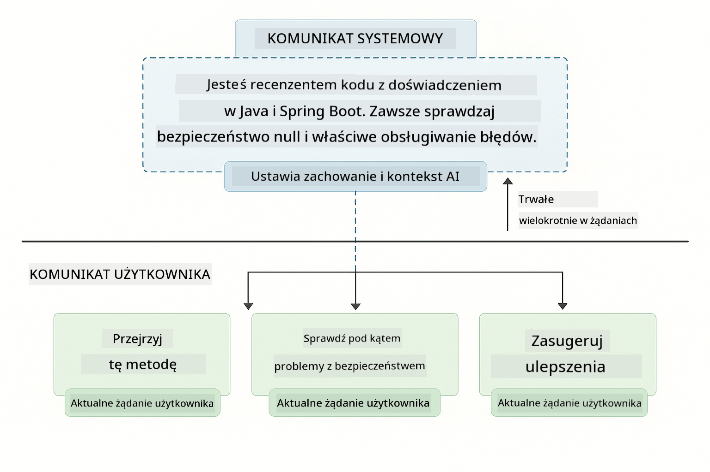
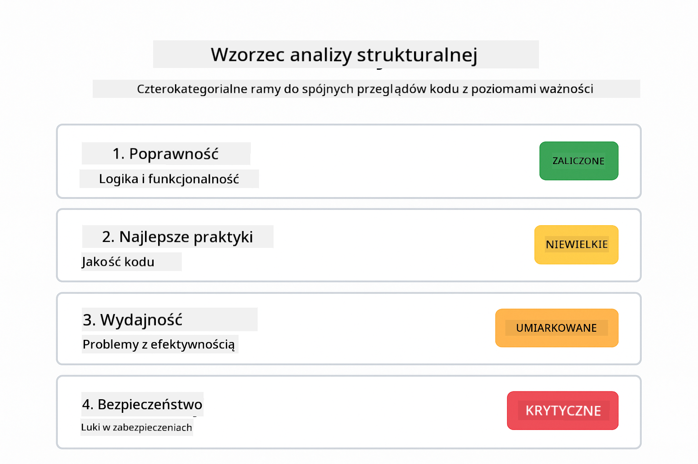
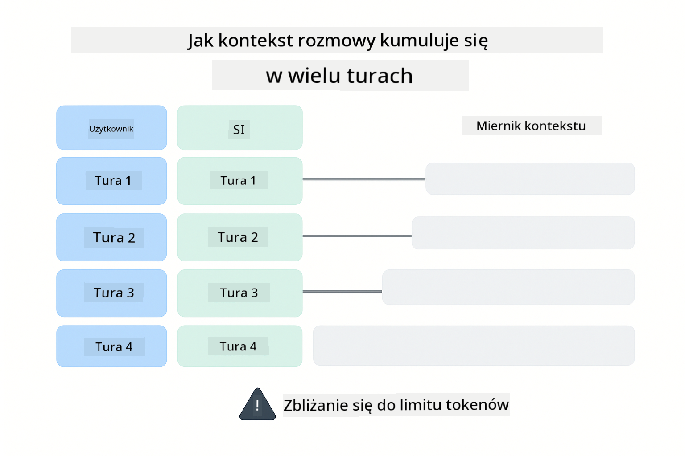
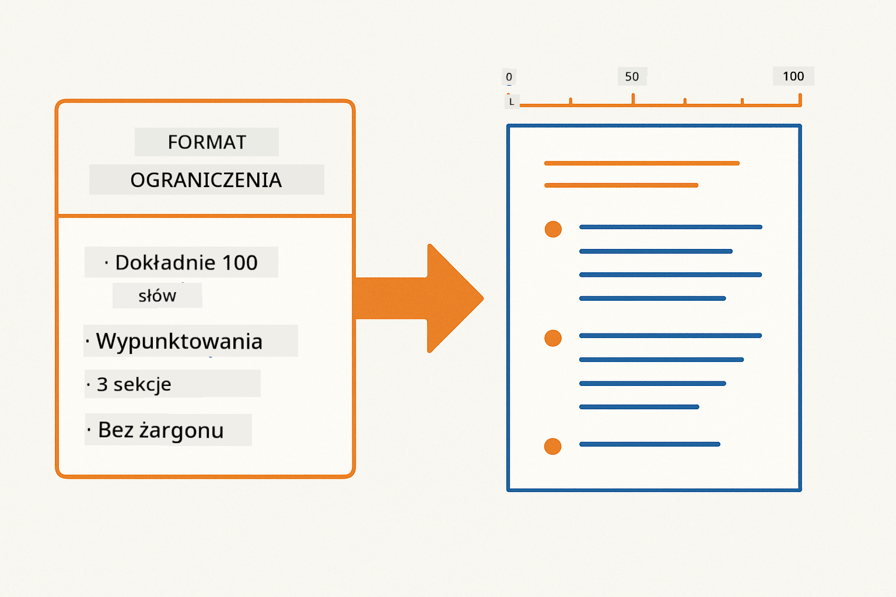
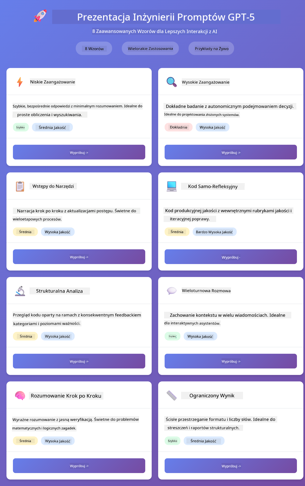
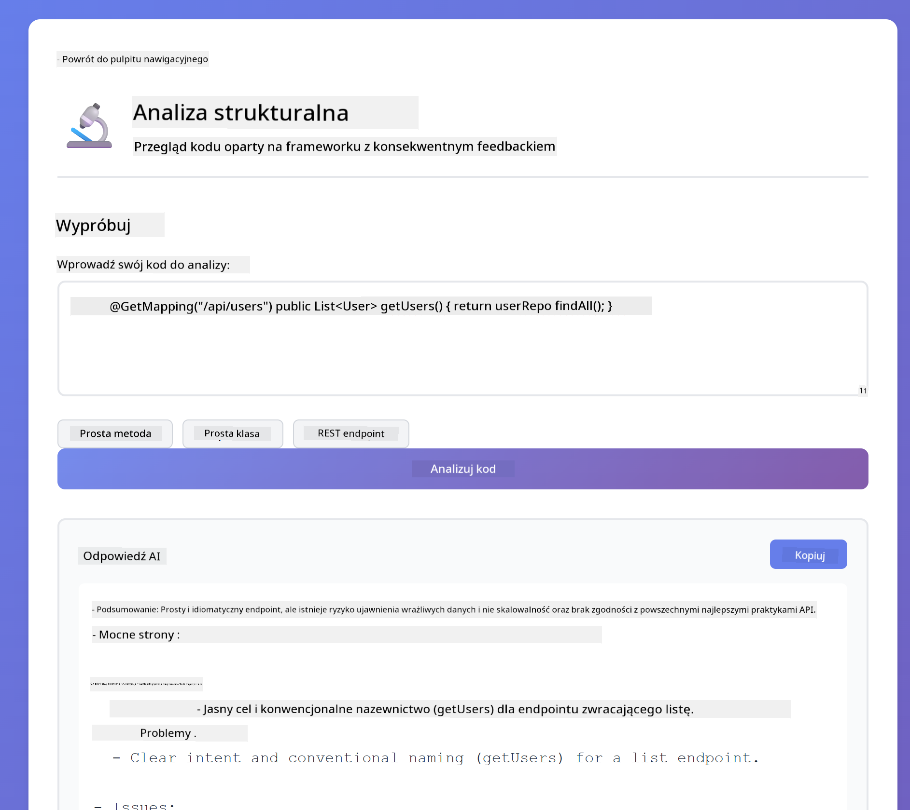
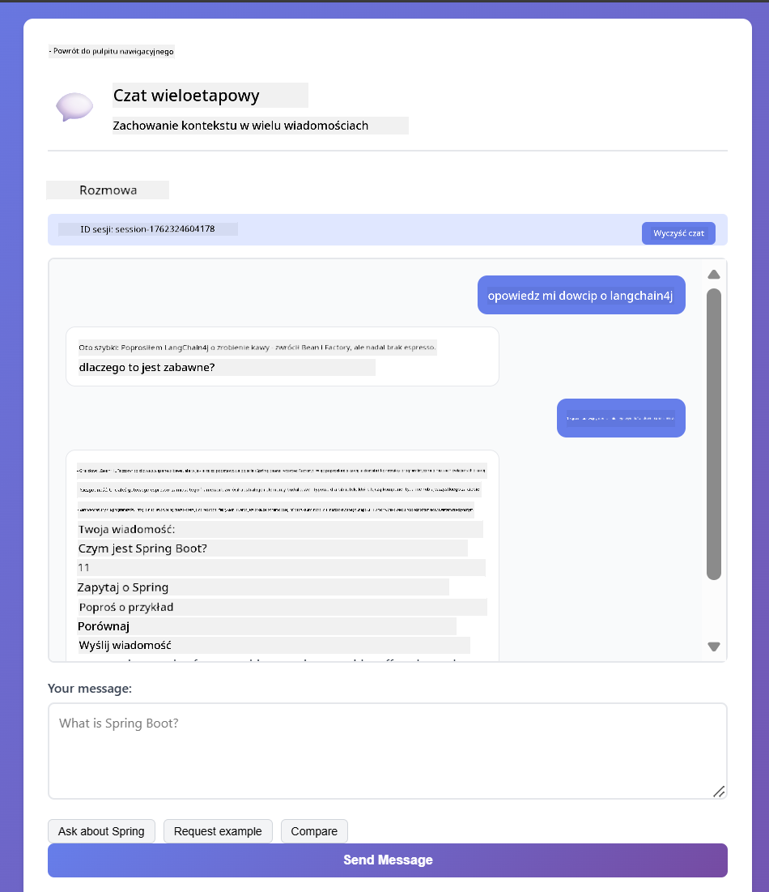
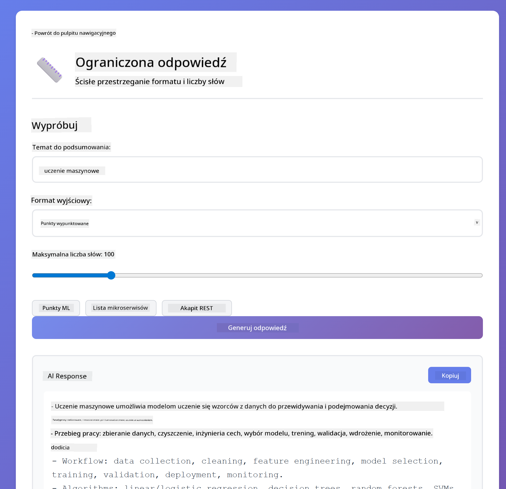

<!--
CO_OP_TRANSLATOR_METADATA:
{
  "original_hash": "8d787826cad7e92bf5cdbd116b1e6116",
  "translation_date": "2025-12-13T16:06:22+00:00",
  "source_file": "02-prompt-engineering/README.md",
  "language_code": "pl"
}
-->
# Moduł 02: Inżynieria promptów z GPT-5

## Spis treści

- [Czego się nauczysz](../../../02-prompt-engineering)
- [Wymagania wstępne](../../../02-prompt-engineering)
- [Zrozumienie inżynierii promptów](../../../02-prompt-engineering)
- [Jak to wykorzystuje LangChain4j](../../../02-prompt-engineering)
- [Główne wzorce](../../../02-prompt-engineering)
- [Korzystanie z istniejących zasobów Azure](../../../02-prompt-engineering)
- [Zrzuty ekranu aplikacji](../../../02-prompt-engineering)
- [Eksploracja wzorców](../../../02-prompt-engineering)
  - [Niskie vs wysokie zaangażowanie](../../../02-prompt-engineering)
  - [Wykonywanie zadań (wprowadzenia do narzędzi)](../../../02-prompt-engineering)
  - [Kod z autorefleksją](../../../02-prompt-engineering)
  - [Analiza strukturalna](../../../02-prompt-engineering)
  - [Wieloturnowa rozmowa](../../../02-prompt-engineering)
  - [Rozumowanie krok po kroku](../../../02-prompt-engineering)
  - [Ograniczona odpowiedź](../../../02-prompt-engineering)
- [Czego naprawdę się uczysz](../../../02-prompt-engineering)
- [Kolejne kroki](../../../02-prompt-engineering)

## Czego się nauczysz

W poprzednim module zobaczyłeś, jak pamięć umożliwia konwersacyjną AI i używałeś modeli GitHub do podstawowych interakcji. Teraz skupimy się na tym, jak zadajesz pytania – czyli na samych promptach – korzystając z GPT-5 w Azure OpenAI. Sposób, w jaki strukturyzujesz swoje prompty, dramatycznie wpływa na jakość otrzymywanych odpowiedzi.

Użyjemy GPT-5, ponieważ wprowadza on kontrolę rozumowania – możesz powiedzieć modelowi, ile ma myśleć przed udzieleniem odpowiedzi. To sprawia, że różne strategie promptowania stają się bardziej widoczne i pomaga zrozumieć, kiedy stosować które podejście. Skorzystamy też z mniejszych limitów szybkości w Azure dla GPT-5 w porównaniu do modeli GitHub.

## Wymagania wstępne

- Ukończony Moduł 01 (wdrożone zasoby Azure OpenAI)
- Plik `.env` w katalogu głównym z poświadczeniami Azure (utworzony przez `azd up` w Module 01)

> **Uwaga:** Jeśli nie ukończyłeś Modułu 01, najpierw wykonaj tamte instrukcje wdrożenia.

## Zrozumienie inżynierii promptów

Inżynieria promptów polega na projektowaniu tekstu wejściowego, który konsekwentnie daje oczekiwane wyniki. To nie tylko zadawanie pytań – to strukturyzowanie próśb tak, aby model dokładnie rozumiał, czego chcesz i jak to dostarczyć.

Pomyśl o tym jak o dawaniu instrukcji koledze z pracy. „Napraw błąd” jest niejasne. „Napraw wyjątek null pointer w UserService.java linia 45, dodając sprawdzenie null” jest konkretne. Modele językowe działają tak samo – ważna jest precyzja i struktura.

## Jak to wykorzystuje LangChain4j

Ten moduł demonstruje zaawansowane wzorce promptowania, korzystając z tej samej podstawy LangChain4j co poprzednie moduły, ze szczególnym naciskiem na strukturę promptów i kontrolę rozumowania.


*Jak LangChain4j łączy twoje prompty z Azure OpenAI GPT-5*

**Zależności** – Moduł 02 używa następujących zależności langchain4j zdefiniowanych w `pom.xml`:
```xml
<dependency>
    <groupId>dev.langchain4j</groupId>
    <artifactId>langchain4j</artifactId> <!-- Inherited from BOM in root pom.xml -->
</dependency>
<dependency>
    <groupId>dev.langchain4j</groupId>
    <artifactId>langchain4j-open-ai-official</artifactId> <!-- Inherited from BOM in root pom.xml -->
</dependency>
```

**Konfiguracja OpenAiOfficialChatModel** – [LangChainConfig.java](../../../02-prompt-engineering/src/main/java/com/example/langchain4j/prompts/config/LangChainConfig.java)

Model czatu jest ręcznie konfigurowany jako bean Springa przy użyciu oficjalnego klienta OpenAI, który obsługuje punkty końcowe Azure OpenAI. Kluczowa różnica w stosunku do Modułu 01 to sposób, w jaki strukturyzujemy prompty wysyłane do `chatModel.chat()`, a nie sama konfiguracja modelu.

**Wiadomości systemowe i użytkownika** – [Gpt5PromptService.java](../../../02-prompt-engineering/src/main/java/com/example/langchain4j/prompts/service/Gpt5PromptService.java)

LangChain4j rozdziela typy wiadomości dla przejrzystości. `SystemMessage` ustawia zachowanie i kontekst AI (np. „Jesteś recenzentem kodu”), podczas gdy `UserMessage` zawiera faktyczną prośbę. To rozdzielenie pozwala utrzymać spójne zachowanie AI przy różnych zapytaniach użytkownika.

```java
SystemMessage systemMsg = SystemMessage.from(
    "You are a helpful Java programming expert."
);

UserMessage userMsg = UserMessage.from(
    "Explain what a List is in Java"
);

String response = chatModel.chat(systemMsg, userMsg);
```



*SystemMessage zapewnia trwały kontekst, a UserMessages zawierają indywidualne zapytania*

**MessageWindowChatMemory dla wieloturnowej rozmowy** – Dla wzorca wieloturnowej konwersacji ponownie używamy `MessageWindowChatMemory` z Modułu 01. Każda sesja ma własną instancję pamięci przechowywaną w `Map<String, ChatMemory>`, co pozwala na wiele równoczesnych rozmów bez mieszania kontekstu.

**Szablony promptów** – Prawdziwym celem jest inżynieria promptów, a nie nowe API LangChain4j. Każdy wzorzec (niskie zaangażowanie, wysokie zaangażowanie, wykonywanie zadań itd.) używa tej samej metody `chatModel.chat(prompt)`, ale z starannie ustrukturyzowanymi ciągami promptów. Tagów XML, instrukcji i formatowania jest częścią tekstu promptu, a nie funkcjami LangChain4j.

**Kontrola rozumowania** – Wysiłek rozumowania GPT-5 jest kontrolowany przez instrukcje w promptach, takie jak „maksymalnie 2 kroki rozumowania” lub „zbadaj dokładnie”. To techniki inżynierii promptów, a nie konfiguracje LangChain4j. Biblioteka po prostu dostarcza twoje prompty do modelu.

Kluczowa lekcja: LangChain4j zapewnia infrastrukturę (połączenie z modelem przez [LangChainConfig.java](../../../02-prompt-engineering/src/main/java/com/example/langchain4j/prompts/config/LangChainConfig.java), pamięć, obsługę wiadomości przez [Gpt5PromptService.java](../../../02-prompt-engineering/src/main/java/com/example/langchain4j/prompts/service/Gpt5PromptService.java)), a ten moduł uczy, jak tworzyć skuteczne prompty w ramach tej infrastruktury.

## Główne wzorce

Nie wszystkie problemy wymagają tego samego podejścia. Niektóre pytania potrzebują szybkich odpowiedzi, inne głębokiego myślenia. Niektóre wymagają widocznego rozumowania, inne tylko wyników. Ten moduł obejmuje osiem wzorców promptowania – każdy zoptymalizowany pod różne scenariusze. Przetestujesz je wszystkie, aby nauczyć się, kiedy które podejście działa najlepiej.


*Przegląd ośmiu wzorców inżynierii promptów i ich zastosowań*


*Niskie zaangażowanie (szybkie, bezpośrednie) vs wysokie zaangażowanie (dokładne, eksploracyjne) podejścia do rozumowania*

**Niskie zaangażowanie (szybkie i skupione)** – Dla prostych pytań, gdzie chcesz szybkich, bezpośrednich odpowiedzi. Model wykonuje minimalne rozumowanie – maksymalnie 2 kroki. Używaj tego do obliczeń, wyszukiwań lub prostych pytań.

```java
String prompt = """
    <reasoning_effort>low</reasoning_effort>
    <instruction>maximum 2 reasoning steps</instruction>
    
    What is 15% of 200?
    """;

String response = chatModel.chat(prompt);
```

> 💡 **Eksploruj z GitHub Copilot:** Otwórz [`Gpt5PromptService.java`](../../../02-prompt-engineering/src/main/java/com/example/langchain4j/prompts/service/Gpt5PromptService.java) i zapytaj:
> - „Jaka jest różnica między wzorcami niskiego a wysokiego zaangażowania?”
> - „Jak tagi XML w promptach pomagają strukturyzować odpowiedź AI?”
> - „Kiedy powinienem używać wzorców autorefleksji, a kiedy bezpośrednich instrukcji?”

**Wysokie zaangażowanie (głębokie i dokładne)** – Dla złożonych problemów, gdzie chcesz kompleksowej analizy. Model eksploruje dokładnie i pokazuje szczegółowe rozumowanie. Używaj tego do projektowania systemów, decyzji architektonicznych lub złożonych badań.

```java
String prompt = """
    <reasoning_effort>high</reasoning_effort>
    <instruction>explore thoroughly, show detailed reasoning</instruction>
    
    Design a caching strategy for a high-traffic REST API.
    """;

String response = chatModel.chat(prompt);
```

**Wykonywanie zadań (postęp krok po kroku)** – Dla wieloetapowych procesów. Model przedstawia plan na początku, opisuje każdy krok podczas pracy, a na końcu podsumowuje. Używaj tego do migracji, implementacji lub dowolnych procesów wieloetapowych.

```java
String prompt = """
    <task>Create a REST endpoint for user registration</task>
    <preamble>Provide an upfront plan</preamble>
    <narration>Narrate each step as you work</narration>
    <summary>Summarize what was accomplished</summary>
    """;

String response = chatModel.chat(prompt);
```

Promptowanie Chain-of-Thought wyraźnie prosi model o pokazanie procesu rozumowania, co poprawia dokładność w złożonych zadaniach. Rozbicie krok po kroku pomaga zarówno ludziom, jak i AI zrozumieć logikę.

> **🤖 Wypróbuj z [GitHub Copilot](https://github.com/features/copilot) Chat:** Zapytaj o ten wzorzec:
> - „Jak dostosować wzorzec wykonywania zadań do operacji długotrwałych?”
> - „Jakie są najlepsze praktyki strukturyzowania wprowadzeń do narzędzi w aplikacjach produkcyjnych?”
> - „Jak mogę przechwytywać i wyświetlać pośrednie aktualizacje postępu w UI?”


*Plan → Wykonaj → Podsumuj – przepływ pracy dla zadań wieloetapowych*

**Kod z autorefleksją** – Do generowania kodu produkcyjnej jakości. Model generuje kod, sprawdza go pod kątem kryteriów jakości i iteracyjnie poprawia. Używaj tego przy tworzeniu nowych funkcji lub usług.

```java
String prompt = """
    <task>Create an email validation service</task>
    <quality_criteria>
    - Correct logic and error handling
    - Best practices (clean code, proper naming)
    - Performance optimization
    - Security considerations
    </quality_criteria>
    <instruction>Generate code, evaluate against criteria, improve iteratively</instruction>
    """;

String response = chatModel.chat(prompt);
```


*Pętla iteracyjnej poprawy – generuj, oceniaj, identyfikuj problemy, poprawiaj, powtarzaj*

**Analiza strukturalna** – Do spójnej oceny. Model przegląda kod według ustalonego schematu (poprawność, praktyki, wydajność, bezpieczeństwo). Używaj tego do przeglądów kodu lub ocen jakości.

```java
String prompt = """
    <code>
    public List getUsers() {
        return database.query("SELECT * FROM users");
    }
    </code>
    
    <framework>
    Evaluate using these categories:
    1. Correctness - Logic and functionality
    2. Best Practices - Code quality
    3. Performance - Efficiency concerns
    4. Security - Vulnerabilities
    </framework>
    """;

String response = chatModel.chat(prompt);
```

> **🤖 Wypróbuj z [GitHub Copilot](https://github.com/features/copilot) Chat:** Zapytaj o analizę strukturalną:
> - „Jak dostosować ramy analizy do różnych typów przeglądów kodu?”
> - „Jaki jest najlepszy sposób na programowe parsowanie i działanie na podstawie ustrukturyzowanego wyniku?”
> - „Jak zapewnić spójne poziomy ważności w różnych sesjach przeglądu?”



*Ramowy schemat czterech kategorii do spójnych przeglądów kodu z poziomami ważności*

**Wieloturnowa rozmowa** – Do rozmów wymagających kontekstu. Model pamięta poprzednie wiadomości i buduje na ich podstawie. Używaj tego do interaktywnych sesji pomocy lub złożonych Q&A.

```java
ChatMemory memory = MessageWindowChatMemory.withMaxMessages(10);

memory.add(UserMessage.from("What is Spring Boot?"));
AiMessage aiMessage1 = chatModel.chat(memory.messages()).aiMessage();
memory.add(aiMessage1);

memory.add(UserMessage.from("Show me an example"));
AiMessage aiMessage2 = chatModel.chat(memory.messages()).aiMessage();
memory.add(aiMessage2);
```



*Jak kontekst rozmowy kumuluje się przez wiele tur aż do osiągnięcia limitu tokenów*

**Rozumowanie krok po kroku** – Do problemów wymagających widocznej logiki. Model pokazuje wyraźne rozumowanie dla każdego kroku. Używaj tego do zadań matematycznych, łamigłówek logicznych lub gdy chcesz zrozumieć proces myślenia.

```java
String prompt = """
    <instruction>Show your reasoning step-by-step</instruction>
    
    If a train travels 120 km in 2 hours, then stops for 30 minutes,
    then travels another 90 km in 1.5 hours, what is the average speed
    for the entire journey including the stop?
    """;

String response = chatModel.chat(prompt);
```


*Rozbijanie problemów na wyraźne kroki logiczne*

**Ograniczona odpowiedź** – Do odpowiedzi z określonymi wymaganiami formatowania. Model ściśle przestrzega reguł formatu i długości. Używaj tego do podsumowań lub gdy potrzebujesz precyzyjnej struktury wyjścia.

```java
String prompt = """
    <constraints>
    - Exactly 100 words
    - Bullet point format
    - Technical terms only
    </constraints>
    
    Summarize the key concepts of machine learning.
    """;

String response = chatModel.chat(prompt);
```



*Wymuszanie określonych wymagań dotyczących formatu, długości i struktury*

## Korzystanie z istniejących zasobów Azure

**Weryfikacja wdrożenia:**

Upewnij się, że plik `.env` istnieje w katalogu głównym z poświadczeniami Azure (utworzony podczas Modułu 01):
```bash
cat ../.env  # Powinno pokazywać AZURE_OPENAI_ENDPOINT, API_KEY, DEPLOYMENT
```

**Uruchom aplikację:**

> **Uwaga:** Jeśli już uruchomiłeś wszystkie aplikacje za pomocą `./start-all.sh` z Modułu 01, ten moduł działa już na porcie 8083. Możesz pominąć poniższe polecenia startowe i przejść bezpośrednio do http://localhost:8083.

**Opcja 1: Korzystanie z Spring Boot Dashboard (zalecane dla użytkowników VS Code)**

Kontener deweloperski zawiera rozszerzenie Spring Boot Dashboard, które zapewnia wizualny interfejs do zarządzania wszystkimi aplikacjami Spring Boot. Znajdziesz je na pasku aktywności po lewej stronie VS Code (ikona Spring Boot).

Z poziomu Spring Boot Dashboard możesz:
- Zobaczyć wszystkie dostępne aplikacje Spring Boot w workspace
- Uruchamiać/zatrzymywać aplikacje jednym kliknięciem
- Przeglądać logi aplikacji w czasie rzeczywistym
- Monitorować status aplikacji

Po prostu kliknij przycisk play obok „prompt-engineering”, aby uruchomić ten moduł, lub uruchom wszystkie moduły naraz.


**Opcja 2: Korzystanie ze skryptów shell**

Uruchom wszystkie aplikacje webowe (moduły 01-04):

**Bash:**
```bash
cd ..  # Z katalogu głównego
./start-all.sh
```

**PowerShell:**
```powershell
cd ..  # Z katalogu głównego
.\start-all.ps1
```

Lub uruchom tylko ten moduł:

**Bash:**
```bash
cd 02-prompt-engineering
./start.sh
```

**PowerShell:**
```powershell
cd 02-prompt-engineering
.\start.ps1
```

Oba skrypty automatycznie ładują zmienne środowiskowe z pliku `.env` w katalogu głównym i zbudują pliki JAR, jeśli nie istnieją.

> **Uwaga:** Jeśli wolisz zbudować wszystkie moduły ręcznie przed uruchomieniem:
>
> **Bash:**
> ```bash
> cd ..  # Go to root directory
> mvn clean package -DskipTests
> ```
>
> **PowerShell:**
> ```powershell
> cd ..  # Go to root directory
> mvn clean package -DskipTests
> ```

Otwórz http://localhost:8083 w przeglądarce.

**Aby zatrzymać:**

**Bash:**
```bash
./stop.sh  # Tylko ten moduł
# Lub
cd .. && ./stop-all.sh  # Wszystkie moduły
```

**PowerShell:**
```powershell
.\stop.ps1  # Tylko ten moduł
# Lub
cd ..; .\stop-all.ps1  # Wszystkie moduły
```

## Zrzuty ekranu aplikacji



*Główny pulpit pokazujący wszystkie 8 wzorców inżynierii promptów z ich cechami i zastosowaniami*

## Eksploracja wzorców

Interfejs webowy pozwala eksperymentować z różnymi strategiami promptowania. Każdy wzorzec rozwiązuje inne problemy – wypróbuj je, aby zobaczyć, kiedy które podejście się sprawdza.

### Niskie vs wysokie zaangażowanie

Zadaj proste pytanie, np. „Ile to jest 15% z 200?” używając niskiego zaangażowania. Otrzymasz natychmiastową, bezpośrednią odpowiedź. Teraz zapytaj o coś złożonego, np. „Zaprojektuj strategię cache’owania dla API o dużym ruchu” używając wysokiego zaangażowania. Zobacz, jak model zwalnia i dostarcza szczegółowe rozumowanie. Ten sam model, ta sama struktura pytania – ale prompt mówi mu, ile ma myśleć.


*Szybkie obliczenia z minimalnym rozumowaniem*


*Kompleksowa strategia buforowania (2,8MB)*

### Wykonywanie zadań (Wprowadzenia do narzędzi)

Wieloetapowe przepływy pracy korzystają z wcześniejszego planowania i narracji postępów. Model opisuje, co zrobi, opowiada o każdym kroku, a następnie podsumowuje wyniki.


*Tworzenie punktu końcowego REST z narracją krok po kroku (3,9MB)*

### Samooceniający się kod

Spróbuj "Utwórz usługę walidacji e-mail". Zamiast tylko generować kod i przerywać, model generuje, ocenia według kryteriów jakości, identyfikuje słabości i poprawia. Zobaczysz, jak iteruje, aż kod spełni standardy produkcyjne.


*Kompletna usługa walidacji e-mail (5,2MB)*

### Strukturalna analiza

Przeglądy kodu wymagają spójnych ram oceny. Model analizuje kod, używając stałych kategorii (poprawność, praktyki, wydajność, bezpieczeństwo) z poziomami nasilenia.



*Przegląd kodu oparty na ramach*

### Wieloetapowy czat

Zapytaj "Co to jest Spring Boot?", a następnie od razu "Pokaż mi przykład". Model pamięta twoje pierwsze pytanie i podaje konkretny przykład Spring Boot. Bez pamięci drugie pytanie byłoby zbyt ogólne.



*Zachowanie kontekstu między pytaniami*

### Rozumowanie krok po kroku

Wybierz zadanie matematyczne i spróbuj je rozwiązać zarówno z Rozumowaniem krok po kroku, jak i z Niskim Zapałem. Niski zapał podaje tylko odpowiedź – szybko, ale nieprzejrzyście. Krok po kroku pokazuje każdy obliczenie i decyzję.


*Zadanie matematyczne z wyraźnymi krokami*

### Ograniczona odpowiedź

Gdy potrzebujesz konkretnych formatów lub liczby słów, ten wzorzec wymusza ścisłe przestrzeganie. Spróbuj wygenerować podsumowanie dokładnie 100 słów w formacie punktów.



*Podsumowanie uczenia maszynowego z kontrolą formatu*

## Czego naprawdę się uczysz

**Wysiłek rozumowania zmienia wszystko**

GPT-5 pozwala kontrolować nakład obliczeniowy przez twoje podpowiedzi. Niski wysiłek oznacza szybkie odpowiedzi z minimalnym badaniem. Wysoki wysiłek oznacza, że model poświęca czas na głębokie myślenie. Uczysz się dopasowywać wysiłek do złożoności zadania – nie marnuj czasu na proste pytania, ale też nie śpiesz się złożonym decyzjom.

**Struktura kieruje zachowaniem**

Zauważyłeś tagi XML w podpowiedziach? Nie są dekoracją. Modele bardziej niezawodnie wykonują instrukcje strukturalne niż tekst swobodny. Gdy potrzebujesz wieloetapowych procesów lub złożonej logiki, struktura pomaga modelowi śledzić, gdzie jest i co dalej.


*Anatomia dobrze zorganizowanej podpowiedzi z wyraźnymi sekcjami i organizacją w stylu XML*

**Jakość przez samoocenę**

Wzorce samooceniające działają, czyniąc kryteria jakości jawne. Zamiast mieć nadzieję, że model "zrobi to dobrze", mówisz mu dokładnie, co znaczy "dobrze": poprawna logika, obsługa błędów, wydajność, bezpieczeństwo. Model może wtedy ocenić własny wynik i poprawić go. To zmienia generowanie kodu z loterii w proces.

**Kontekst jest ograniczony**

Wieloetapowe rozmowy działają przez dołączanie historii wiadomości do każdego zapytania. Ale jest limit – każdy model ma maksymalną liczbę tokenów. W miarę rozwoju rozmów potrzebujesz strategii, by utrzymać istotny kontekst bez przekraczania limitu. Ten moduł pokazuje, jak działa pamięć; później nauczysz się, kiedy podsumowywać, kiedy zapominać, a kiedy przywoływać.

## Kolejne kroki

**Następny moduł:** [03-rag - RAG (Retrieval-Augmented Generation)](../03-rag/README.md)

---

**Nawigacja:** [← Poprzedni: Moduł 01 - Wprowadzenie](../01-introduction/README.md) | [Powrót do głównego](../README.md) | [Następny: Moduł 03 - RAG →](../03-rag/README.md)

---

<!-- CO-OP TRANSLATOR DISCLAIMER START -->
**Zastrzeżenie**:  
Niniejszy dokument został przetłumaczony za pomocą usługi tłumaczenia AI [Co-op Translator](https://github.com/Azure/co-op-translator). Mimo że dokładamy starań, aby tłumaczenie było jak najbardziej precyzyjne, prosimy mieć na uwadze, że automatyczne tłumaczenia mogą zawierać błędy lub nieścisłości. Oryginalny dokument w języku źródłowym należy traktować jako źródło autorytatywne. W przypadku informacji krytycznych zalecane jest skorzystanie z profesjonalnego tłumaczenia wykonanego przez człowieka. Nie ponosimy odpowiedzialności za jakiekolwiek nieporozumienia lub błędne interpretacje wynikające z korzystania z tego tłumaczenia.
<!-- CO-OP TRANSLATOR DISCLAIMER END -->