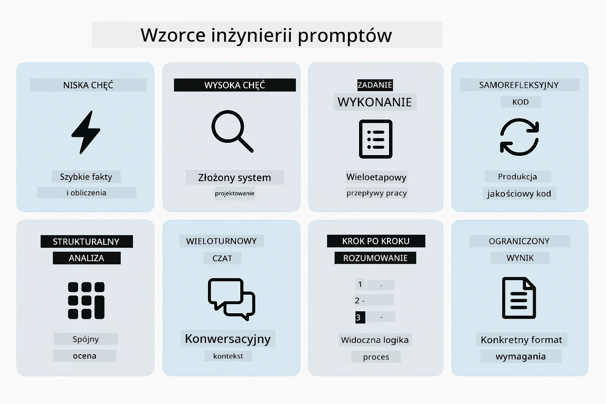
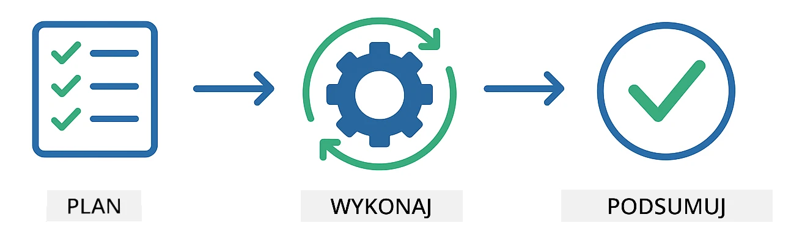
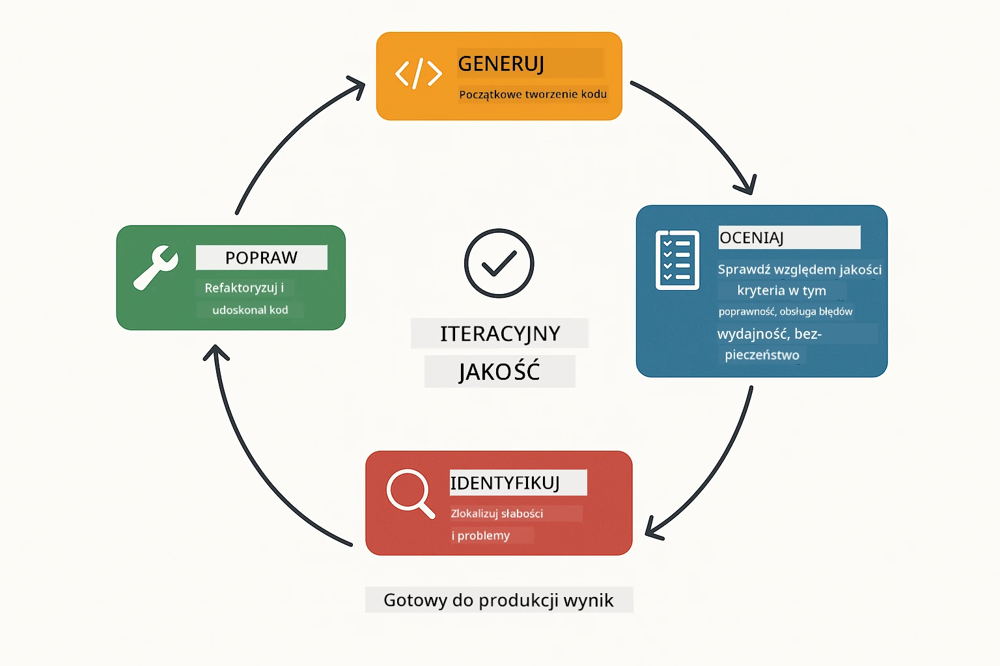
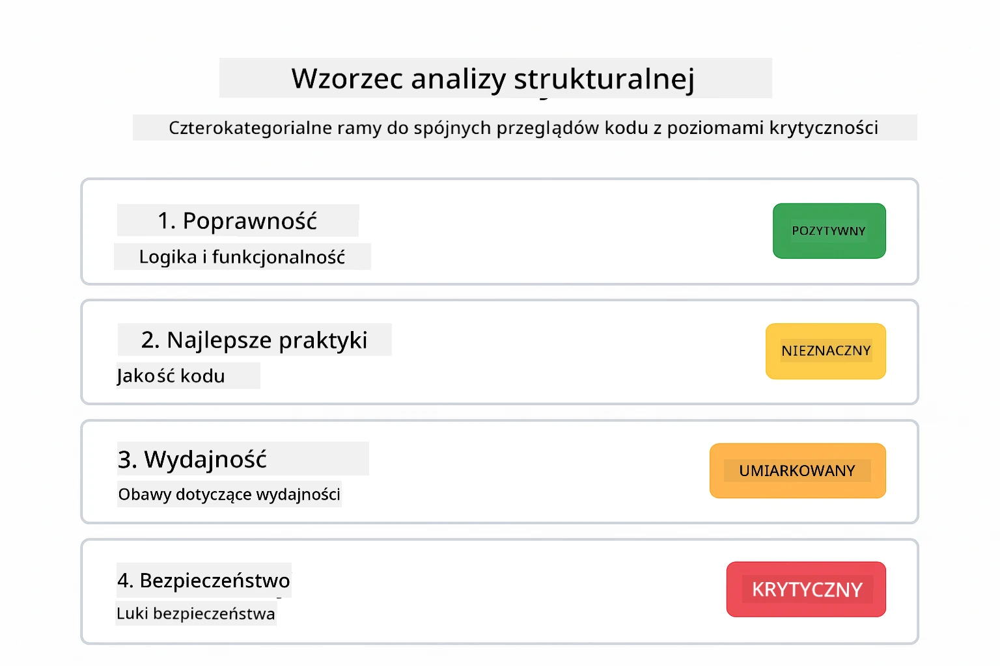
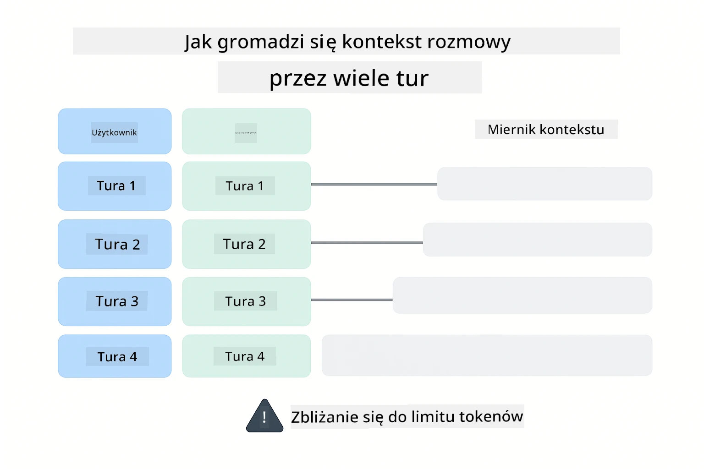
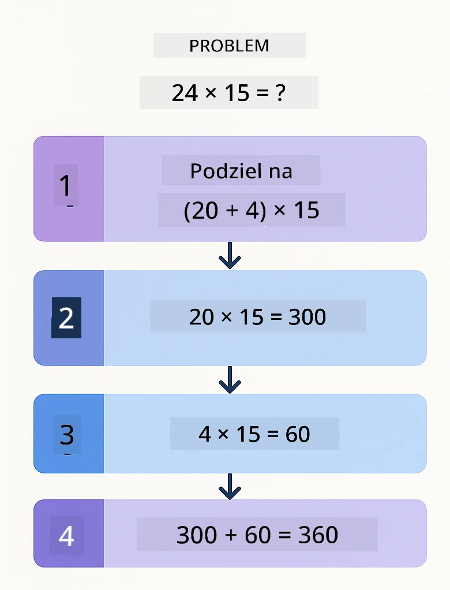
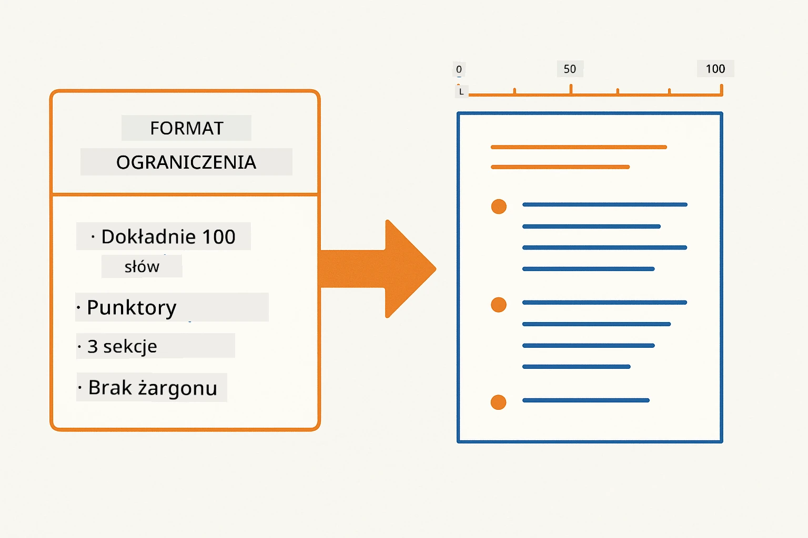
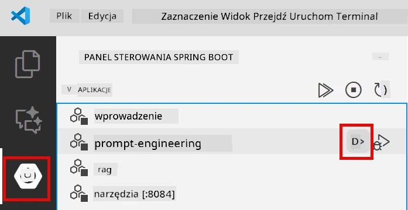
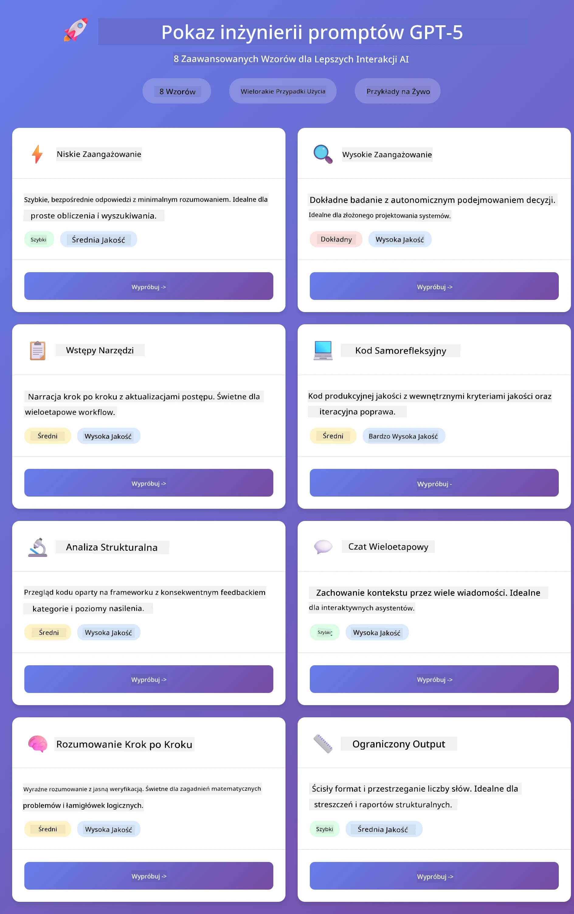
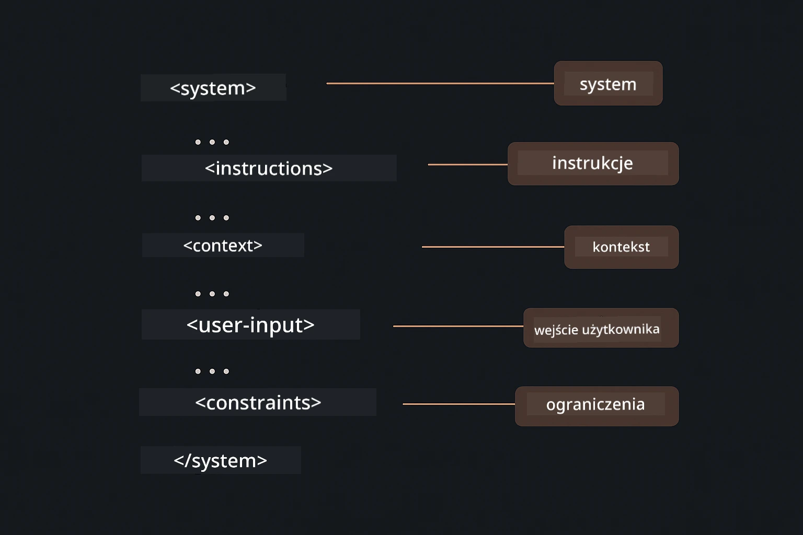

# Moduł 02: Inżynieria promptów z GPT-5.2

## Spis treści

- [Przegląd video](#przegląd-video)
- [Czego się nauczysz](#czego-się-nauczysz)
- [Wymagania wstępne](#wymagania-wstępne)
- [Zrozumienie inżynierii promptów](#zrozumienie-inżynierii-promptów)
- [Podstawy inżynierii promptów](#podstawy-inżynierii-promptów)
  - [Prompting zero-shot](#prompting-zero-shot)
  - [Prompting few-shot](#prompting-few-shot)
  - [Chain of Thought](#chain-of-thought)
  - [Prompting oparty na roli](#prompting-oparty-na-roli)
  - [Szablony promptów](#szablony-promptów)
- [Zaawansowane wzorce](#zaawansowane-wzorce)
- [Uruchom aplikację](#uruchom-aplikację)
- [Zrzuty ekranu aplikacji](#zrzuty-ekranu-aplikacji)
- [Badanie wzorców](#eksploracja-wzorców)
  - [Niska vs wysoka chęć](#niskie-vs-wysokie-zaangażowanie-eagerness)
  - [Wykonanie zadania (wstępy do narzędzi)](#wykonywanie-zadań-wstępy-narzędziowe)
  - [Kod autorefleksyjny](#samorefleksyjny-kod)
  - [Analiza strukturalna](#analiza-strukturalna)
  - [Czat wieloetapowy](#wielokrotna-rozmowa)
  - [Rozumowanie krok po kroku](#rozumowanie-krok-po-kroku)
  - [Ograniczona odpowiedź](#wymuszony-wynik)
- [Co naprawdę się uczysz](#czego-naprawdę-się-uczysz)
- [Kolejne kroki](#następne-kroki)

## Przegląd video

Obejrzyj tę sesję na żywo, która wyjaśnia, jak rozpocząć pracę z tym modułem:

<a href="https://www.youtube.com/live/PJ6aBaE6bog?si=LDshyBrTRodP-wke"></a>

## Czego się nauczysz

Poniższy diagram przedstawia przegląd kluczowych tematów i umiejętności, które rozwiniesz w tym module — od technik udoskonalania promptów po krok po kroku przepływ pracy, który będziesz stosować.


W poprzednim module zobaczyłeś, jak pamięć umożliwia konwersacyjną sztuczną inteligencję z Azure OpenAI. Teraz skupimy się na tym, jak zadajesz pytania — czyli na samych promptach — korzystając z GPT-5.2 w Azure OpenAI. Sposób, w jaki strukturyzujesz swoje promptsy, znacząco wpływa na jakość otrzymywanych odpowiedzi. Zaczniemy od przeglądu podstawowych technik promptingu, a następnie przejdziemy do ośmiu zaawansowanych wzorców, które w pełni wykorzystują możliwości GPT-5.2.

Użyjemy GPT-5.2, ponieważ wprowadza on kontrolę rozumowania - możesz określić, ile myślenia model ma wykonać przed odpowiedzią. To uwidacznia różne strategie promptingu i pomaga zrozumieć, kiedy stosować każdą z nich.

## Wymagania wstępne

- Ukończony Moduł 01 (wdrożone zasoby Azure OpenAI)
- Plik `.env` w katalogu głównym z poświadczeniami Azure (utworzony przez `azd up` w Module 01)

> **Uwaga:** Jeśli nie ukończyłeś Modułu 01, najpierw wykonaj tamte instrukcje wdrożenia.

## Zrozumienie inżynierii promptów

W swojej istocie inżynieria promptów to różnica między niejasnymi a precyzyjnymi instrukcjami, jak ilustruje poniższe porównanie.


Inżynieria promptów polega na projektowaniu tekstu wejściowego, który konsekwentnie dostarcza potrzebne wyniki. To nie tylko zadawanie pytań — to strukturyzowanie próśb tak, aby model dokładnie rozumiał, czego chcesz i jak to dostarczyć.

Pomyśl o tym, jakbyś dawał instrukcje koledze. "Napraw błąd" jest niejasne. "Napraw wyjątek null pointer w UserService.java linia 45, dodając sprawdzenie na null" jest precyzyjne. Modele językowe działają podobnie — chodzi o konkrety i strukturę.

Diagram poniżej pokazuje, jak LangChain4j wpisuje się w ten obraz — łącząc wzorce promptów z modelem poprzez elementy konstrukcyjne SystemMessage i UserMessage.


LangChain4j dostarcza infrastrukturę — połączenia z modelem, pamięć i typy wiadomości — podczas gdy wzorce promptów to po prostu starannie ustrukturyzowany tekst, który wysyłasz przez tę infrastrukturę. Kluczowymi elementami są `SystemMessage` (który ustawia zachowanie i rolę AI) oraz `UserMessage` (który niesie Twoją rzeczywistą prośbę).

## Podstawy inżynierii promptów

Pięć podstawowych technik pokazanych poniżej stanowi fundament skutecznej inżynierii promptów. Każda dotyczy innego aspektu komunikacji z modelami językowymi.


Zanim zagłębimy się w zaawansowane wzorce w tym module, przypomnijmy pięć podstawowych technik promptingu. To podstawowe narzędzia, które powinien znać każdy inżynier promptów.

### Prompting zero-shot

Najprostsze podejście: daj modelowi bezpośrednią instrukcję bez przykładów. Model polega całkowicie na swoim treningu, aby zrozumieć i wykonać zadanie. Działa to dobrze przy prostych żądaniach, gdzie oczekiwane zachowanie jest oczywiste.


*Bezpośrednia instrukcja bez przykładów — model wywnioskuje zadanie na podstawie samej instrukcji*

```java
String prompt = "Classify this sentiment: 'I absolutely loved the movie!'";
String response = model.chat(prompt);
// Odpowiedź: "Pozytywna"
```

**Kiedy używać:** Proste klasyfikacje, bezpośrednie pytania, tłumaczenia lub każde zadanie, które model może wykonać bez dodatkowego prowadzenia.

### Prompting few-shot

Podaj przykłady, które pokazują wzorzec, jaki chcesz, aby model naśladował. Model uczy się oczekiwanego formatu wejścia i wyjścia z Twoich przykładów i stosuje go do nowych danych. To znacznie poprawia spójność w zadaniach, gdzie pożądany format lub zachowanie nie jest oczywiste.


*Nauka na przykładach — model identyfikuje wzorzec i stosuje go do nowych wejść*

```java
String prompt = """
    Classify the sentiment as positive, negative, or neutral.
    
    Examples:
    Text: "This product exceeded my expectations!" → Positive
    Text: "It's okay, nothing special." → Neutral
    Text: "Waste of money, very disappointed." → Negative
    
    Now classify this:
    Text: "Best purchase I've made all year!"
    """;
String response = model.chat(prompt);
```

**Kiedy używać:** Niestandardowe klasyfikacje, spójne formatowanie, zadania specyficzne dla domeny lub gdy wyniki zero-shot są niespójne.

### Chain of Thought

Poproś model o pokazanie rozumowania krok po kroku. Zamiast od razu przejść do odpowiedzi, model rozbija problem i explicite przeprowadza przez każdy etap. To poprawia dokładność w zadaniach matematycznych, logicznych i wieloetapowych rozumowaniach.


*Rozumowanie krok po kroku — rozbijanie złożonych problemów na jawne logiczne etapy*

```java
String prompt = """
    Problem: A store has 15 apples. They sell 8 apples and then 
    receive a shipment of 12 more apples. How many apples do they have now?
    
    Let's solve this step-by-step:
    """;
String response = model.chat(prompt);
// Model pokazuje: 15 - 8 = 7, a następnie 7 + 12 = 19 jabłek
```

**Kiedy używać:** Zadania matematyczne, łamigłówki logiczne, debugowanie lub każde zadanie, gdzie pokazanie procesu rozumowania poprawia dokładność i zaufanie.

### Prompting oparty na roli

Ustaw personę lub rolę AI przed zadaniem pytania. To zapewnia kontekst, który kształtuje ton, głębokość i fokus odpowiedzi. "Architekt oprogramowania" doradzi inaczej niż "młodszy programista" czy "audytor bezpieczeństwa".


*Ustawianie kontekstu i osoby — to samo pytanie dostaje inną odpowiedź w zależności od przypisanej roli*

```java
String prompt = """
    You are an experienced software architect reviewing code.
    Provide a brief code review for this function:
    
    def calculate_total(items):
        total = 0
        for item in items:
            total = total + item['price']
        return total
    """;
String response = model.chat(prompt);
```

**Kiedy używać:** Przeglądy kodu, nauczanie, analiza specyficzna dla domeny lub gdy potrzebujesz odpowiedzi dopasowanych do określonego poziomu ekspertyzy lub perspektywy.

### Szablony promptów

Twórz wielokrotnego użytku promptsy z zmiennymi placeholderami. Zamiast pisać nowy prompt za każdym razem, zdefiniuj szablon raz i wstawiaj różne wartości. Klasa `PromptTemplate` w LangChain4j ułatwia to z użyciem składni `{{variable}}`.


*Wielokrotnego użytku promptsy ze zmiennymi placeholderami — jeden szablon, wiele zastosowań*

```java
PromptTemplate template = PromptTemplate.from(
    "What's the best time to visit {{destination}} for {{activity}}?"
);

Prompt prompt = template.apply(Map.of(
    "destination", "Paris",
    "activity", "sightseeing"
));

String response = model.chat(prompt.text());
```

**Kiedy używać:** Powtarzające się zapytania z różnymi danymi wejściowymi, przetwarzanie wsadowe, budowanie wielokrotnego użytku przepływów AI lub każdy scenariusz, w którym struktura promptu jest stała, ale dane się zmieniają.

---

Te pięć fundamentów daje solidny zestaw narzędzi do większości zadań promptingu. Reszta tego modułu opiera się na nich, dodając **osiem zaawansowanych wzorców**, które wykorzystują kontrolę rozumowania, samoocenę i możliwość strukturalnej odpowiedzi GPT-5.2.

## Zaawansowane wzorce

Po omówieniu podstaw, przejdźmy do ośmiu zaawansowanych wzorców, które czynią ten moduł wyjątkowym. Nie każde problem wymaga tego samego podejścia. Niektóre pytania potrzebują szybkich odpowiedzi, inne głębokiego rozważania. Niektóre potrzebują widocznego rozumowania, inne tylko wyników. Każdy poniższy wzorzec jest zoptymalizowany pod inny scenariusz — a kontrola rozumowania w GPT-5.2 uwydatnia te różnice jeszcze bardziej.



*Przegląd ośmiu wzorców inżynierii promptów i ich zastosowań*

GPT-5.2 dodaje do tych wzorców jeszcze jeden wymiar: *kontrolę rozumowania*. Suwak poniżej pokazuje, jak możesz dostosować wysiłek myślowy modelu — od szybkich, bezpośrednich odpowiedzi po głęboką i dokładną analizę.


*Kontrola rozumowania w GPT-5.2 pozwala określić, ile myślenia model ma wykonać — od szybkich odpowiedzi po głębokie eksploracje*

**Niska chęć (Szybko i skupienie)** - Dla prostych pytań, gdy chcesz szybkich, bezpośrednich odpowiedzi. Model wykonuje minimalne rozumowanie - maksymalnie 2 kroki. Używaj tego do obliczeń, wyszukiwań lub prostych pytań.

```java
String prompt = """
    <context_gathering>
    - Search depth: very low
    - Bias strongly towards providing a correct answer as quickly as possible
    - Usually, this means an absolute maximum of 2 reasoning steps
    - If you think you need more time, state what you know and what's uncertain
    </context_gathering>
    
    Problem: What is 15% of 200?
    
    Provide your answer:
    """;

String response = chatModel.chat(prompt);
```

> 💡 **Odkrywaj z GitHub Copilot:** Otwórz [`Gpt5PromptService.java`](../../../02-prompt-engineering/src/main/java/com/example/langchain4j/prompts/service/Gpt5PromptService.java) i zapytaj:
> - "Jaka jest różnica między wzorcami niskiej chęci a wysokiej chęci promptingu?"
> - "Jak znacznik XML w promptach pomaga ustrukturyzować odpowiedź AI?"
> - "Kiedy stosować wzorce autorefleksji a kiedy bezpośrednie instrukcje?"

**Wysoka chęć (Głęboko i dokładnie)** - Dla złożonych problemów, gdzie chcesz kompleksowej analizy. Model eksploruje gruntownie i pokazuje szczegółowe rozumowanie. Używaj tego do projektowania systemów, decyzji architektonicznych lub skomplikowanych badań.

```java
String prompt = """
    Analyze this problem thoroughly and provide a comprehensive solution.
    Consider multiple approaches, trade-offs, and important details.
    Show your analysis and reasoning in your response.
    
    Problem: Design a caching strategy for a high-traffic REST API.
    """;

String response = chatModel.chat(prompt);
```

**Wykonanie zadania (Postęp krok po kroku)** - Dla wieloetapowych przepływów pracy. Model dostarcza plan z góry, narrację każdego kroku podczas działania, a następnie podsumowanie. Używaj tego do migracji, implementacji lub każdego procesu wieloetapowego.

```java
String prompt = """
    <task_execution>
    1. First, briefly restate the user's goal in a friendly way
    
    2. Create a step-by-step plan:
       - List all steps needed
       - Identify potential challenges
       - Outline success criteria
    
    3. Execute each step:
       - Narrate what you're doing
       - Show progress clearly
       - Handle any issues that arise
    
    4. Summarize:
       - What was completed
       - Any important notes
       - Next steps if applicable
    </task_execution>
    
    <tool_preambles>
    - Always begin by rephrasing the user's goal clearly
    - Outline your plan before executing
    - Narrate each step as you go
    - Finish with a distinct summary
    </tool_preambles>
    
    Task: Create a REST endpoint for user registration
    
    Begin execution:
    """;

String response = chatModel.chat(prompt);
```

Prompting Chain-of-Thought wyraźnie prosi model o pokazanie procesu rozumowania, co poprawia dokładność przy skomplikowanych zadaniach. Podział krok po kroku pomaga zrozumieć logikę zarówno ludziom, jak i AI.

> **🤖 Spróbuj z czatem [GitHub Copilot](https://github.com/features/copilot):** Zapytaj o ten wzorzec:
> - "Jak dostosować wzorzec wykonania zadania do długotrwałych operacji?"
> - "Jakie są najlepsze praktyki strukturyzowania wstępów do narzędzi w aplikacjach produkcyjnych?"
> - "Jak uchwycić i wyświetlać pośrednie aktualizacje postępu w interfejsie użytkownika?"

Diagram poniżej ilustruje ten model Plan → Wykonanie → Podsumowanie.



*Plan → Wykonanie → Podsumowanie w przepływach wieloetapowych*

**Kod autorefleksyjny** - Do generowania kodu o jakości produkcyjnej. Model generuje kod zgodny ze standardami produkcyjnymi z właściwą obsługą błędów. Używaj tego przy budowie nowych funkcji lub usług.

```java
String prompt = """
    Generate Java code with production-quality standards: Create an email validation service
    Keep it simple and include basic error handling.
    """;

String response = chatModel.chat(prompt);
```

Diagram poniżej przedstawia tę iteracyjną pętlę usprawnień — generuj, oceniaj, identyfikuj słabości i dopracowuj, aż kod spełni standardy produkcyjne.



*Iteracyjna pętla usprawnień - generuj, oceniaj, identyfikuj problemy, poprawiaj, powtarzaj*

**Analiza strukturalna** - Do spójnej oceny. Model przegląda kod według ustalonego schematu (poprawność, praktyki, wydajność, bezpieczeństwo, łatwość utrzymania). Używaj tego przy przeglądach kodu lub ocenach jakości.

```java
String prompt = """
    <analysis_framework>
    You are an expert code reviewer. Analyze the code for:
    
    1. Correctness
       - Does it work as intended?
       - Are there logical errors?
    
    2. Best Practices
       - Follows language conventions?
       - Appropriate design patterns?
    
    3. Performance
       - Any inefficiencies?
       - Scalability concerns?
    
    4. Security
       - Potential vulnerabilities?
       - Input validation?
    
    5. Maintainability
       - Code clarity?
       - Documentation?
    
    <output_format>
    Provide your analysis in this structure:
    - Summary: One-sentence overall assessment
    - Strengths: 2-3 positive points
    - Issues: List any problems found with severity (High/Medium/Low)
    - Recommendations: Specific improvements
    </output_format>
    </analysis_framework>
    
    Code to analyze:
    ```
    public List getUsers() {
        return database.query("SELECT * FROM users");
    }
    ```
    Provide your structured analysis:
    """;

String response = chatModel.chat(prompt);
```

> **🤖 Spróbuj z czatem [GitHub Copilot](https://github.com/features/copilot):** Zapytaj o analizę strukturalną:
> - "Jak dostosować ramy analizy dla różnych typów przeglądów kodu?"
> - "Jak najlepiej parsować i reagować na strukturalną odpowiedź programowo?"
> - "Jak zapewnić spójne poziomy ważności w różnych sesjach przeglądu?"

Poniższy diagram pokazuje, jak ten strukturalny framework organizuje przegląd kodu w spójne kategorie z poziomami ważności.



*Framework do spójnych przeglądów kodu z poziomami ważności*

**Czat wieloetapowy** - Do rozmów wymagających kontekstu. Model pamięta poprzednie wiadomości i buduje na ich podstawie. Używaj do interaktywnych sesji pomocy lub złożonych Q&A.

```java
ChatMemory memory = MessageWindowChatMemory.withMaxMessages(10);

memory.add(UserMessage.from("What is Spring Boot?"));
AiMessage aiMessage1 = chatModel.chat(memory.messages()).aiMessage();
memory.add(aiMessage1);

memory.add(UserMessage.from("Show me an example"));
AiMessage aiMessage2 = chatModel.chat(memory.messages()).aiMessage();
memory.add(aiMessage2);
```

Diagram poniżej wizualizuje, jak kontekst rozmowy kumuluje się z każdą turą i jak odnosi się do limitu tokenów modelu.



*Jak kontekst rozmowy rośnie przez wiele tur aż do osiągnięcia limitu tokenów*

**Rozumowanie krok po kroku** - Dla problemów wymagających jawnej logiki. Model pokazuje explicite rozumowanie dla każdego kroku. Używaj tego do zadań matematycznych, łamigłówek logicznych lub gdy chcesz zrozumieć proces myślenia.

```java
String prompt = """
    <instruction>Show your reasoning step-by-step</instruction>
    
    If a train travels 120 km in 2 hours, then stops for 30 minutes,
    then travels another 90 km in 1.5 hours, what is the average speed
    for the entire journey including the stop?
    """;

String response = chatModel.chat(prompt);
```

Diagram poniżej ilustruje, jak model dzieli problemy na jawne, ponumerowane logiczne kroki.


*Rozbijanie problemów na jawne, logiczne kroki*

**Wymuszony wynik** – dla odpowiedzi o konkretnych wymaganiach dotyczących formatu. Model ściśle przestrzega zasad formatu i długości. Używaj tego do streszczeń lub gdy potrzebujesz precyzyjnej struktury wyjścia.

```java
String prompt = """
    <constraints>
    - Exactly 100 words
    - Bullet point format
    - Technical terms only
    </constraints>
    
    Summarize the key concepts of machine learning.
    """;

String response = chatModel.chat(prompt);
```
  
Poniższy diagram pokazuje, jak ograniczenia kierują modelem, aby wygenerował wynik ściśle zgodny z Twoimi wymaganiami dotyczącymi formatu i długości.



*Narzucanie konkretnych wymagań dotyczących formatu, długości i struktury*

## Uruchom aplikację

**Sprawdź wdrożenie:**

Upewnij się, że plik `.env` znajduje się w katalogu głównym z danymi uwierzytelniającymi Azure (utworzony podczas Modułu 01). Uruchom to z katalogu modułu (`02-prompt-engineering/`):

**Bash:**  
```bash
cat ../.env  # Powinno pokazywać AZURE_OPENAI_ENDPOINT, API_KEY, DEPLOYMENT
```
  
**PowerShell:**  
```powershell
Get-Content ..\.env  # Powinno pokazywać AZURE_OPENAI_ENDPOINT, API_KEY, DEPLOYMENT
```
  
**Uruchom aplikację:**

> **Uwaga:** Jeśli już uruchomiłeś wszystkie aplikacje za pomocą `./start-all.sh` z katalogu głównego (jak opisano w Module 01), ten moduł już działa na porcie 8083. Możesz pominąć poniższe polecenia uruchomienia i przejść od razu do http://localhost:8083.

**Opcja 1: Korzystanie z Spring Boot Dashboard (zalecane dla użytkowników VS Code)**

Kontener deweloperski zawiera rozszerzenie Spring Boot Dashboard, które zapewnia wizualny interfejs do zarządzania wszystkimi aplikacjami Spring Boot. Znajdziesz je na pasku aktywności po lewej stronie VS Code (szukaj ikony Spring Boot).

Z poziomu Spring Boot Dashboard możesz:  
- Zobaczyć wszystkie dostępne aplikacje Spring Boot w środowisku pracy  
- Uruchamiać/zatrzymywać aplikacje jednym kliknięciem  
- Podglądać logi aplikacji w czasie rzeczywistym  
- Monitorować status aplikacji

Po prostu kliknij przycisk odtwarzania obok „prompt-engineering”, aby uruchomić ten moduł, lub uruchom wszystkie moduły naraz.



*Spring Boot Dashboard w VS Code — uruchamiaj, zatrzymuj i monitoruj wszystkie moduły z jednego miejsca*

**Opcja 2: Korzystanie ze skryptów powłoki**

Uruchom wszystkie aplikacje webowe (moduły 01-04):

**Bash:**  
```bash
cd ..  # Z katalogu głównego
./start-all.sh
```
  
**PowerShell:**  
```powershell
cd ..  # Z katalogu głównego
.\start-all.ps1
```
  
Lub uruchom tylko ten moduł:

**Bash:**  
```bash
cd 02-prompt-engineering
./start.sh
```
  
**PowerShell:**  
```powershell
cd 02-prompt-engineering
.\start.ps1
```
  
Oba skrypty automatycznie ładują zmienne środowiskowe z pliku `.env` w katalogu głównym i zbudują pliki JAR, jeśli nie istnieją.

> **Uwaga:** Jeśli wolisz najpierw ręcznie zbudować wszystkie moduły przed uruchomieniem:  
>  
> **Bash:**  
> ```bash
> cd ..  # Go to root directory
> mvn clean package -DskipTests
> ```
>  
> **PowerShell:**  
> ```powershell
> cd ..  # Go to root directory
> mvn clean package -DskipTests
> ```
  
Otwórz http://localhost:8083 w przeglądarce.

**Aby zatrzymać:**

**Bash:**  
```bash
./stop.sh  # Tylko ten moduł
# Lub
cd .. && ./stop-all.sh  # Wszystkie moduły
```
  
**PowerShell:**  
```powershell
.\stop.ps1  # Tylko ten moduł
# Lub
cd ..; .\stop-all.ps1  # Wszystkie moduły
```
  
## Zrzuty ekranu aplikacji

Oto główny interfejs modułu do inżynierii promptów, gdzie możesz eksperymentować z wszystkimi ośmioma wzorcami obok siebie.



*Główny pulpit pokazujący wszystkie 8 wzorców inżynierii promptów wraz z ich cechami i zastosowaniami*

## Eksploracja wzorców

Interfejs webowy pozwala na eksperymentowanie z różnymi strategiami tworzenia promptów. Każdy wzorzec rozwiązuje inne problemy – wypróbuj je, aby zobaczyć, kiedy każdy sposób się sprawdza.

> **Uwaga: Streaming vs Brak streamingu** — Każda strona wzorca oferuje dwa przyciski: **🔴 Stream Response (Na żywo)** i opcję **Bez streamingu**. Streaming używa Server-Sent Events (SSE), aby wyświetlać tokeny na bieżąco podczas generowania przez model, więc widzisz postęp natychmiast. Opcja bez streamingu czeka na pełną odpowiedź przed wyświetleniem. Dla promptów wywołujących głębokie rozumowanie (np. High Eagerness, Self-Reflecting Code) wywołanie bez streamingu może trwać bardzo długo – czasem minuty – bez żadnej widocznej informacji zwrotnej. **Używaj streamingu podczas eksperymentów z złożonymi promptami**, aby widzieć działanie modelu i uniknąć wrażenia, że żądanie wygasło.  
>  
> **Uwaga: Wymagania przeglądarki** — Funkcja streamingu korzysta z Fetch Streams API (`response.body.getReader()`), które wymaga pełnej przeglądarki (Chrome, Edge, Firefox, Safari). Nie działa to w wbudowanej w VS Code prostej przeglądarce Simple Browser, ponieważ jej widok internetowy nie wspiera API ReadableStream. Jeśli korzystasz z Simple Browser, przyciski bez streamingu będą działały normalnie – tylko streaming jest ograniczony. Otwórz `http://localhost:8083` w zewnętrznej przeglądarce dla pełnego doświadczenia.

### Niskie vs wysokie zaangażowanie (Eagerness)

Zadaj proste pytanie, np. „Jaka jest 15% z 200?” używając Niskiego Zaangażowania. Otrzymasz natychmiastową, bezpośrednią odpowiedź. Teraz zadaj coś złożonego, np. „Zaprojektuj strategię cache’owania dla API o dużym ruchu” używając Wysokiego Zaangażowania. Kliknij **🔴 Stream Response (Na żywo)** i obserwuj, jak szczegółowe rozumowanie modelu pojawia się token po tokenie. Ten sam model, ta sama struktura pytania – ale prompt mówi mu, ile ma się zastanawiać.

### Wykonywanie zadań (wstępy narzędziowe)

Wielostopniowe workflowy korzystają z wcześniejszego planowania i narracji postępu. Model przedstawia, co zrobi, opisuje każdy krok, a na końcu podsumowuje wyniki.

### Samorefleksyjny kod

Wypróbuj „Stwórz serwis walidacji maili”. Zamiast po prostu wygenerować kod i przestać, model generuje, ocenia względem kryteriów jakości, identyfikuje słabości i poprawia. Zobaczysz iteracje aż do spełnienia standardów produkcyjnych.

### Analiza strukturalna

Przeglądy kodu potrzebują spójnych ram oceny. Model analizuje kod używając ustalonych kategorii (poprawność, praktyki, wydajność, bezpieczeństwo) z poziomami ważności.

### Wielokrotna rozmowa

Zapytaj „Co to jest Spring Boot?”, a następnie od razu „Pokaż mi przykład”. Model pamięta pierwsze pytanie i poda Ci konkretny przykład Spring Boot. Bez pamięci drugie pytanie byłoby zbyt niejasne.

### Rozumowanie krok po kroku

Wybierz zadanie matematyczne i spróbuj je rozwiązać zarówno z Rozumowaniem krok po kroku, jak i Niskim Zaangażowaniem. Niskie zaangażowanie daje tylko odpowiedź – szybko, ale niejasno. Krok po kroku pokazuje każdy obliczony krok i podjętą decyzję.

### Wymuszony wynik

Gdy potrzebujesz specyficznych formatów lub liczby słów, ten wzorzec narzuca ścisłą zgodność. Spróbuj wygenerować streszczenie dokładnie 100 słów w formacie punktowanym.

## Czego naprawdę się uczysz

**Wysiłek rozumowania zmienia wszystko**

GPT-5.2 pozwala kontrolować wysiłek obliczeniowy poprzez twoje prompty. Niski wysiłek oznacza szybkie odpowiedzi z minimalną eksploracją. Wysoki wysiłek oznacza, że model poświęca czas na głębokie rozmyślanie. Uczysz się dostosowywać wysiłek do złożoności zadania – nie marnuj czasu na proste pytania, ale nie śpiesz się też złożonym decyzjom.

**Struktura kieruje zachowaniem**

Zauważyłeś tagi XML w promptach? Nie są dekoracją. Modele bardziej niezawodnie wykonują instrukcje, gdy są one ustrukturyzowane niż gdy są w formie swobodnego tekstu. Gdy potrzebujesz procesów wieloetapowych lub złożonej logiki, struktura pomaga modelowi śledzić, gdzie jest i co jest dalej. Poniższy diagram rozkłada dobrze ustrukturyzowany prompt, pokazując, jak tagi takie jak `<system>`, `<instructions>`, `<context>`, `<user-input>`, oraz `<constraints>` organizują twoje instrukcje w czytelne sekcje.



*Anatomia dobrze ustrukturyzowanego promptu z jasnymi sekcjami i organizacją w stylu XML*

**Jakość przez samoocenę**

Wzorce samorefleksyjne działają dzięki ujawnieniu kryteriów jakości. Zamiast mieć nadzieję, że model „zrobi to dobrze”, mówisz mu dokładnie, co znaczy „dobrze”: poprawna logika, obsługa błędów, wydajność, bezpieczeństwo. Model może na tej podstawie ocenić swój własny output i go poprawić. To zamienia generowanie kodu z loterii w proces.

**Kontekst jest ograniczony**

Wielokrotne rozmowy działają dzięki dołączaniu historii wiadomości do każdego żądania. Ale istnieje limit – każdy model ma maksymalną liczbę tokenów. W miarę rozrostu rozmów, potrzebujesz strategii, aby utrzymać istotny kontekst, nie przekraczając limitu. Ten moduł pokazuje, jak działa pamięć; później nauczysz się, kiedy podsumowywać, kiedy zapominać, a kiedy przywoływać.

## Następne kroki

**Następny moduł:** [03-rag - RAG (Retrieval-Augmented Generation)](../03-rag/README.md)

---

**Nawigacja:** [← Poprzedni: Moduł 01 - Wprowadzenie](../01-introduction/README.md) | [Powrót do głównej](../README.md) | [Następny: Moduł 03 - RAG →](../03-rag/README.md)

---

<!-- CO-OP TRANSLATOR DISCLAIMER START -->
**Zastrzeżenie**:
Niniejszy dokument został przetłumaczony za pomocą usługi tłumaczenia AI [Co-op Translator](https://github.com/Azure/co-op-translator). Choć dążymy do dokładności, prosimy pamiętać, że automatyczne tłumaczenia mogą zawierać błędy lub niedokładności. Oryginalny dokument w jego języku źródłowym należy uznawać za autorytatywne źródło. W przypadku informacji krytycznych zalecane jest skorzystanie z profesjonalnego tłumaczenia wykonanego przez człowieka. Nie ponosimy odpowiedzialności za jakiekolwiek nieporozumienia lub błędne interpretacje wynikające z użycia tego tłumaczenia.
<!-- CO-OP TRANSLATOR DISCLAIMER END -->