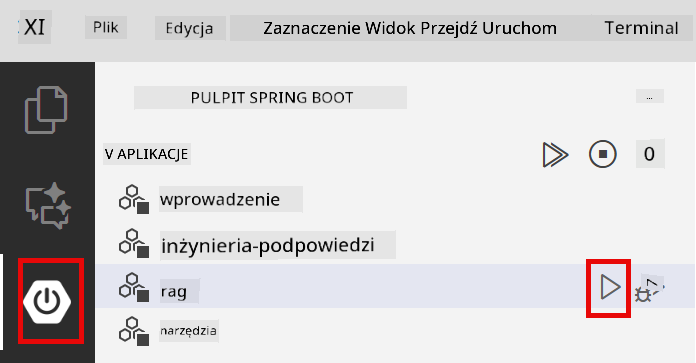

<!--
CO_OP_TRANSLATOR_METADATA:
{
  "original_hash": "f538a51cfd13147d40d84e936a0f485c",
  "translation_date": "2025-12-13T17:00:51+00:00",
  "source_file": "03-rag/README.md",
  "language_code": "pl"
}
-->
# Moduł 03: RAG (Retrieval-Augmented Generation)

## Spis treści

- [Czego się nauczysz](../../../03-rag)
- [Wymagania wstępne](../../../03-rag)
- [Zrozumienie RAG](../../../03-rag)
- [Jak to działa](../../../03-rag)
  - [Przetwarzanie dokumentów](../../../03-rag)
  - [Tworzenie osadzeń](../../../03-rag)
  - [Wyszukiwanie semantyczne](../../../03-rag)
  - [Generowanie odpowiedzi](../../../03-rag)
- [Uruchom aplikację](../../../03-rag)
- [Korzystanie z aplikacji](../../../03-rag)
  - [Prześlij dokument](../../../03-rag)
  - [Zadaj pytania](../../../03-rag)
  - [Sprawdź odniesienia do źródeł](../../../03-rag)
  - [Eksperymentuj z pytaniami](../../../03-rag)
- [Kluczowe pojęcia](../../../03-rag)
  - [Strategia dzielenia na fragmenty](../../../03-rag)
  - [Wyniki podobieństwa](../../../03-rag)
  - [Przechowywanie w pamięci](../../../03-rag)
  - [Zarządzanie oknem kontekstu](../../../03-rag)
- [Kiedy RAG ma znaczenie](../../../03-rag)
- [Kolejne kroki](../../../03-rag)

## Czego się nauczysz

W poprzednich modułach nauczyłeś się, jak prowadzić rozmowy z AI i skutecznie strukturyzować swoje zapytania. Jednak istnieje podstawowe ograniczenie: modele językowe znają tylko to, czego nauczyły się podczas treningu. Nie potrafią odpowiadać na pytania dotyczące polityk Twojej firmy, dokumentacji projektowej ani żadnych informacji, na których nie były trenowane.

RAG (Retrieval-Augmented Generation) rozwiązuje ten problem. Zamiast próbować nauczyć model Twoich informacji (co jest kosztowne i niepraktyczne), dajesz mu możliwość przeszukiwania Twoich dokumentów. Gdy ktoś zada pytanie, system znajduje odpowiednie informacje i dołącza je do zapytania. Model odpowiada wtedy na podstawie tego pobranego kontekstu.

Pomyśl o RAG jak o bibliotece referencyjnej dla modelu. Gdy zadasz pytanie, system:

1. **Zapytanie użytkownika** - Zadajesz pytanie  
2. **Osadzenie** - Przekształca pytanie w wektor  
3. **Wyszukiwanie wektorowe** - Znajduje podobne fragmenty dokumentów  
4. **Składanie kontekstu** - Dodaje odpowiednie fragmenty do zapytania  
5. **Odpowiedź** - LLM generuje odpowiedź na podstawie kontekstu  

Dzięki temu odpowiedzi modelu opierają się na Twoich rzeczywistych danych, a nie tylko na wiedzy z treningu czy wymyślaniu odpowiedzi.


*Przepływ pracy RAG – od zapytania użytkownika, przez wyszukiwanie semantyczne, do generowania odpowiedzi kontekstowej*

## Wymagania wstępne

- Ukończony Moduł 01 (wdrożone zasoby Azure OpenAI)  
- Plik `.env` w katalogu głównym z poświadczeniami Azure (utworzony przez `azd up` w Module 01)  

> **Uwaga:** Jeśli nie ukończyłeś Modułu 01, najpierw wykonaj tamte instrukcje wdrożenia.

## Jak to działa

**Przetwarzanie dokumentów** - [DocumentService.java](../../../03-rag/src/main/java/com/example/langchain4j/rag/service/DocumentService.java)

Gdy przesyłasz dokument, system dzieli go na fragmenty – mniejsze części, które mieszczą się wygodnie w oknie kontekstu modelu. Fragmenty te lekko się nakładają, aby nie utracić kontekstu na granicach.

```java
Document document = FileSystemDocumentLoader.loadDocument("sample-document.txt");

DocumentSplitter splitter = DocumentSplitters
    .recursive(300, 30, new OpenAiTokenizer());

List<TextSegment> segments = splitter.split(document);
```
  
> **🤖 Wypróbuj z [GitHub Copilot](https://github.com/features/copilot) Chat:** Otwórz [`DocumentService.java`](../../../03-rag/src/main/java/com/example/langchain4j/rag/service/DocumentService.java) i zapytaj:  
> - "Jak LangChain4j dzieli dokumenty na fragmenty i dlaczego nakładanie jest ważne?"  
> - "Jaki jest optymalny rozmiar fragmentu dla różnych typów dokumentów i dlaczego?"  
> - "Jak obsługiwać dokumenty w wielu językach lub ze specjalnym formatowaniem?"

**Tworzenie osadzeń** - [LangChainRagConfig.java](../../../03-rag/src/main/java/com/example/langchain4j/rag/config/LangChainRagConfig.java)

Każdy fragment jest przekształcany w reprezentację numeryczną zwaną osadzeniem – w zasadzie matematyczny odcisk palca, który uchwyca znaczenie tekstu. Podobne teksty dają podobne osadzenia.

```java
@Bean
public EmbeddingModel embeddingModel() {
    return OpenAiOfficialEmbeddingModel.builder()
        .baseUrl(azureOpenAiEndpoint)
        .apiKey(azureOpenAiKey)
        .modelName(azureEmbeddingDeploymentName)
        .build();
}

EmbeddingStore<TextSegment> embeddingStore = 
    new InMemoryEmbeddingStore<>();
```
  


*Dokumenty reprezentowane jako wektory w przestrzeni osadzeń – podobne treści grupują się razem*

**Wyszukiwanie semantyczne** - [RagService.java](../../../03-rag/src/main/java/com/example/langchain4j/rag/service/RagService.java)

Gdy zadasz pytanie, ono również zostaje przekształcone w osadzenie. System porównuje osadzenie Twojego pytania z osadzeniami wszystkich fragmentów dokumentów. Znajduje fragmenty o najbardziej podobnym znaczeniu – nie tylko dopasowanie słów kluczowych, ale faktyczne podobieństwo semantyczne.

```java
Embedding queryEmbedding = embeddingModel.embed(question).content();

List<EmbeddingMatch<TextSegment>> matches = 
    embeddingStore.findRelevant(queryEmbedding, 5, 0.7);

for (EmbeddingMatch<TextSegment> match : matches) {
    String relevantText = match.embedded().text();
    double score = match.score();
}
```
  
> **🤖 Wypróbuj z [GitHub Copilot](https://github.com/features/copilot) Chat:** Otwórz [`RagService.java`](../../../03-rag/src/main/java/com/example/langchain4j/rag/service/RagService.java) i zapytaj:  
> - "Jak działa wyszukiwanie podobieństwa z osadzeniami i co decyduje o wyniku?"  
> - "Jaki próg podobieństwa powinienem stosować i jak wpływa na wyniki?"  
> - "Jak radzić sobie z sytuacjami, gdy nie znaleziono odpowiednich dokumentów?"

**Generowanie odpowiedzi** - [RagService.java](../../../03-rag/src/main/java/com/example/langchain4j/rag/service/RagService.java)

Najbardziej odpowiednie fragmenty są dołączane do zapytania dla modelu. Model czyta te konkretne fragmenty i odpowiada na pytanie na ich podstawie. Zapobiega to halucynacjom – model może odpowiadać tylko na podstawie tego, co ma przed sobą.

## Uruchom aplikację

**Sprawdź wdrożenie:**

Upewnij się, że plik `.env` istnieje w katalogu głównym z poświadczeniami Azure (utworzony podczas Modułu 01):  
```bash
cat ../.env  # Powinno pokazywać AZURE_OPENAI_ENDPOINT, API_KEY, DEPLOYMENT
```
  
**Uruchom aplikację:**

> **Uwaga:** Jeśli już uruchomiłeś wszystkie aplikacje za pomocą `./start-all.sh` z Modułu 01, ten moduł działa już na porcie 8081. Możesz pominąć poniższe polecenia startowe i przejść bezpośrednio do http://localhost:8081.

**Opcja 1: Korzystanie z Spring Boot Dashboard (zalecane dla użytkowników VS Code)**

Kontener deweloperski zawiera rozszerzenie Spring Boot Dashboard, które zapewnia wizualny interfejs do zarządzania wszystkimi aplikacjami Spring Boot. Znajdziesz je na pasku aktywności po lewej stronie VS Code (ikona Spring Boot).

Z poziomu Spring Boot Dashboard możesz:  
- Zobaczyć wszystkie dostępne aplikacje Spring Boot w przestrzeni roboczej  
- Uruchamiać/zatrzymywać aplikacje jednym kliknięciem  
- Przeglądać logi aplikacji w czasie rzeczywistym  
- Monitorować status aplikacji  

Wystarczy kliknąć przycisk odtwarzania obok "rag", aby uruchomić ten moduł, lub uruchomić wszystkie moduły naraz.



**Opcja 2: Korzystanie ze skryptów powłoki**

Uruchom wszystkie aplikacje webowe (moduły 01-04):

**Bash:**  
```bash
cd ..  # Z katalogu głównego
./start-all.sh
```
  
**PowerShell:**  
```powershell
cd ..  # Z katalogu głównego
.\start-all.ps1
```
  
Lub uruchom tylko ten moduł:

**Bash:**  
```bash
cd 03-rag
./start.sh
```
  
**PowerShell:**  
```powershell
cd 03-rag
.\start.ps1
```
  
Oba skrypty automatycznie ładują zmienne środowiskowe z pliku `.env` w katalogu głównym i zbudują pliki JAR, jeśli nie istnieją.

> **Uwaga:** Jeśli wolisz zbudować wszystkie moduły ręcznie przed uruchomieniem:  
>  
> **Bash:**  
> ```bash
> cd ..  # Go to root directory
> mvn clean package -DskipTests
> ```
  
> **PowerShell:**  
> ```powershell
> cd ..  # Go to root directory
> mvn clean package -DskipTests
> ```
  
Otwórz http://localhost:8081 w przeglądarce.

**Aby zatrzymać:**

**Bash:**  
```bash
./stop.sh  # Tylko ten moduł
# Lub
cd .. && ./stop-all.sh  # Wszystkie moduły
```
  
**PowerShell:**  
```powershell
.\stop.ps1  # Tylko ten moduł
# Lub
cd ..; .\stop-all.ps1  # Wszystkie moduły
```
  
## Korzystanie z aplikacji

Aplikacja udostępnia interfejs webowy do przesyłania dokumentów i zadawania pytań.

<a href="images/rag-homepage.png"></a>

*Interfejs aplikacji RAG – przesyłaj dokumenty i zadawaj pytania*

**Prześlij dokument**

Zacznij od przesłania dokumentu – najlepiej sprawdzają się pliki TXT do testów. W tym katalogu znajduje się plik `sample-document.txt`, który zawiera informacje o funkcjach LangChain4j, implementacji RAG i najlepszych praktykach – idealny do testowania systemu.

System przetwarza Twój dokument, dzieli go na fragmenty i tworzy osadzenia dla każdego fragmentu. Dzieje się to automatycznie po przesłaniu.

**Zadaj pytania**

Teraz zadaj konkretne pytania dotyczące zawartości dokumentu. Spróbuj czegoś faktograficznego, co jest wyraźnie napisane w dokumencie. System wyszukuje odpowiednie fragmenty, dołącza je do zapytania i generuje odpowiedź.

**Sprawdź odniesienia do źródeł**

Zauważ, że każda odpowiedź zawiera odniesienia do źródeł wraz z wynikami podobieństwa. Wyniki te (od 0 do 1) pokazują, jak bardzo dany fragment był istotny dla Twojego pytania. Wyższe wyniki oznaczają lepsze dopasowanie. Pozwala to zweryfikować odpowiedź względem materiału źródłowego.

<a href="images/rag-query-results.png"></a>

*Wyniki zapytania pokazujące odpowiedź z odniesieniami do źródeł i wynikami relewancji*

**Eksperymentuj z pytaniami**

Wypróbuj różne typy pytań:  
- Konkretne fakty: "Jaki jest główny temat?"  
- Porównania: "Jaka jest różnica między X a Y?"  
- Podsumowania: "Podsumuj kluczowe punkty dotyczące Z"  

Obserwuj, jak zmieniają się wyniki relewancji w zależności od tego, jak dobrze Twoje pytanie pasuje do treści dokumentu.

## Kluczowe pojęcia

**Strategia dzielenia na fragmenty**

Dokumenty są dzielone na fragmenty po 300 tokenów z 30-tokenowym nakładaniem. To zapewnia, że każdy fragment ma wystarczająco kontekstu, by być znaczący, a jednocześnie jest na tyle mały, by można było dołączyć wiele fragmentów do zapytania.

**Wyniki podobieństwa**

Wyniki mieszczą się w zakresie od 0 do 1:  
- 0.7-1.0: Bardzo istotne, dokładne dopasowanie  
- 0.5-0.7: Istotne, dobry kontekst  
- Poniżej 0.5: Odrzucone, zbyt różne  

System pobiera tylko fragmenty powyżej minimalnego progu, aby zapewnić jakość.

**Przechowywanie w pamięci**

Ten moduł używa przechowywania w pamięci dla uproszczenia. Po restarcie aplikacji przesłane dokumenty są tracone. Systemy produkcyjne korzystają z trwałych baz danych wektorowych, takich jak Qdrant lub Azure AI Search.

**Zarządzanie oknem kontekstu**

Każdy model ma maksymalne okno kontekstu. Nie można dołączyć wszystkich fragmentów z dużego dokumentu. System pobiera N najbardziej relewantnych fragmentów (domyślnie 5), aby zmieścić się w limitach, zapewniając jednocześnie wystarczający kontekst do dokładnych odpowiedzi.

## Kiedy RAG ma znaczenie

**Używaj RAG, gdy:**  
- Odpowiadasz na pytania dotyczące dokumentów własnościowych  
- Informacje często się zmieniają (polityki, ceny, specyfikacje)  
- Dokładność wymaga podania źródła  
- Treść jest zbyt obszerna, by zmieścić się w jednym zapytaniu  
- Potrzebujesz weryfikowalnych, ugruntowanych odpowiedzi  

**Nie używaj RAG, gdy:**  
- Pytania wymagają ogólnej wiedzy, którą model już posiada  
- Potrzebne są dane w czasie rzeczywistym (RAG działa na przesłanych dokumentach)  
- Treść jest na tyle mała, że można ją bezpośrednio dołączyć do zapytań  

## Kolejne kroki

**Następny moduł:** [04-tools - AI Agents with Tools](../04-tools/README.md)

---

**Nawigacja:** [← Poprzedni: Moduł 02 - Inżynieria promptów](../02-prompt-engineering/README.md) | [Powrót do głównego](../README.md) | [Następny: Moduł 04 - Narzędzia →](../04-tools/README.md)

---

<!-- CO-OP TRANSLATOR DISCLAIMER START -->
**Zastrzeżenie**:  
Niniejszy dokument został przetłumaczony za pomocą usługi tłumaczenia AI [Co-op Translator](https://github.com/Azure/co-op-translator). Mimo że dokładamy starań, aby tłumaczenie było jak najbardziej precyzyjne, prosimy mieć na uwadze, że automatyczne tłumaczenia mogą zawierać błędy lub nieścisłości. Oryginalny dokument w języku źródłowym powinien być uznawany za źródło autorytatywne. W przypadku informacji krytycznych zalecane jest skorzystanie z profesjonalnego tłumaczenia wykonanego przez człowieka. Nie ponosimy odpowiedzialności za jakiekolwiek nieporozumienia lub błędne interpretacje wynikające z korzystania z tego tłumaczenia.
<!-- CO-OP TRANSLATOR DISCLAIMER END -->