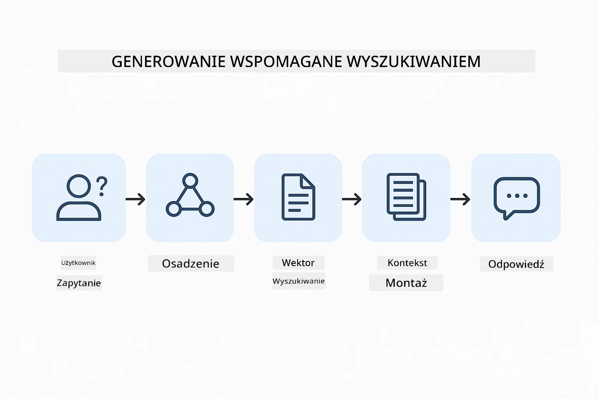
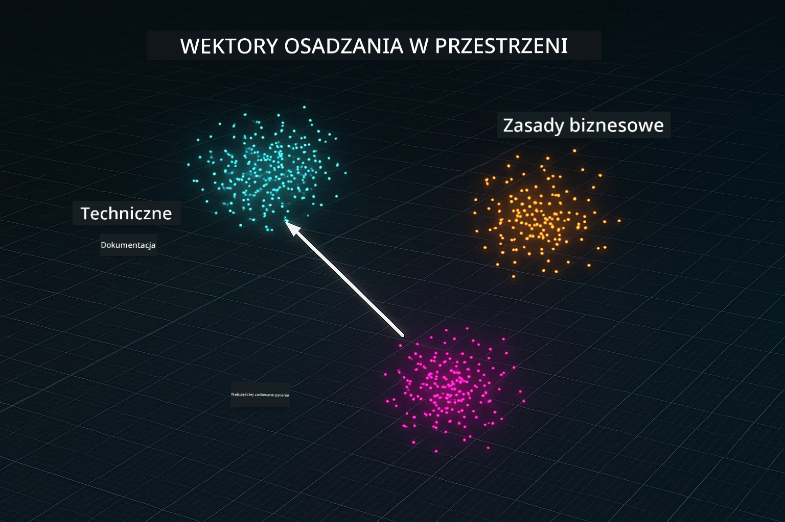
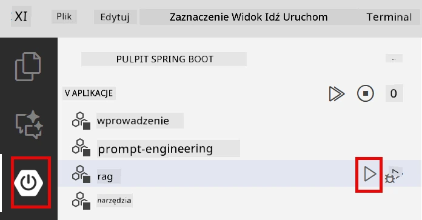
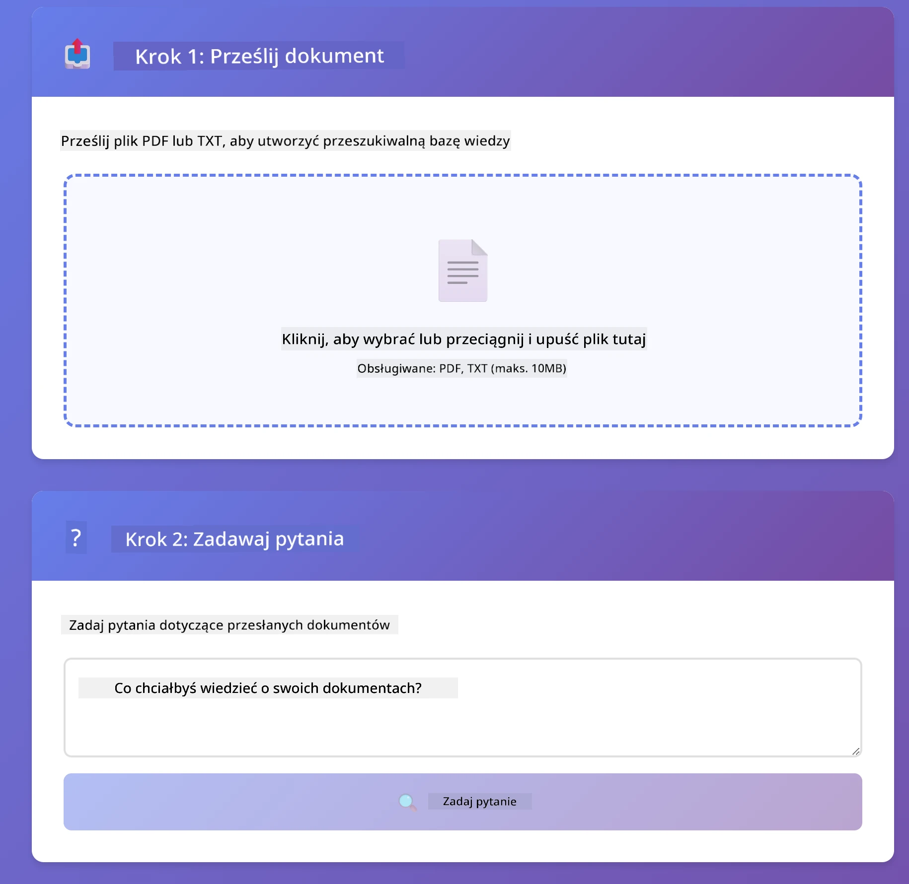
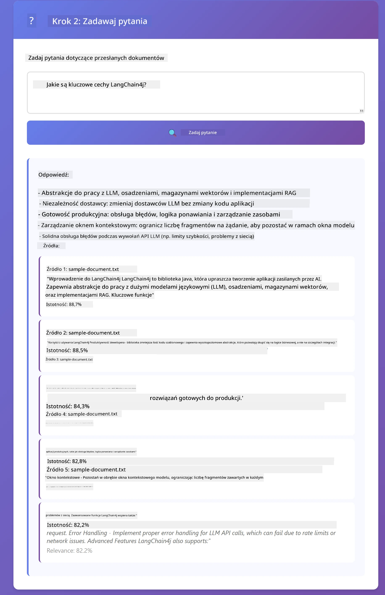

# Moduł 03: RAG (Retrieval-Augmented Generation)

## Spis treści

- [Przegląd wideo](#przegląd-wideo)
- [Czego się nauczysz](#czego-się-nauczysz)
- [Wymagania wstępne](#wymagania-wstępne)
- [Zrozumienie RAG](#zrozumienie-rag)
  - [Które podejście RAG jest używane w tym samouczku?](#które-podejście-rag-jest-używane-w-tym-samouczku)
- [Jak to działa](#jak-to-działa)
  - [Przetwarzanie dokumentów](#przetwarzanie-dokumentów)
  - [Tworzenie osadzeń](#tworzenie-osadzeń)
  - [Wyszukiwanie semantyczne](#wyszukiwanie-semantyczne)
  - [Generowanie odpowiedzi](#generowanie-odpowiedzi)
- [Uruchom aplikację](#uruchom-aplikację)
- [Korzystanie z aplikacji](#korzystanie-z-aplikacji)
  - [Prześlij dokument](#prześlij-dokument)
  - [Zadaj pytania](#zadawaj-pytania)
  - [Sprawdź odniesienia źródeł](#sprawdź-źródła)
  - [Eksperymentuj z pytaniami](#eksperymentuj-z-pytaniami)
- [Kluczowe pojęcia](#kluczowe-pojęcia)
  - [Strategia dzielenia na fragmenty](#strategia-dzielenia-na-fragmenty)
  - [Wskaźniki podobieństwa](#wyniki-podobieństwa)
  - [Przechowywanie w pamięci](#przechowywanie-w-pamięci)
  - [Zarządzanie oknem kontekstu](#zarządzanie-oknem-kontekstu)
- [Kiedy RAG ma znaczenie](#kiedy-rag-ma-znaczenie)
- [Następne kroki](#następne-kroki)

## Przegląd wideo

Obejrzyj tę sesję na żywo, która wyjaśnia, jak rozpocząć pracę z tym modułem:

<a href="https://www.youtube.com/watch?v=_olq75ZH_eY"></a>

## Czego się nauczysz

W poprzednich modułach nauczyłeś się, jak prowadzić rozmowy ze sztuczną inteligencją i jak skutecznie strukturyzować swoje zapytania. Jednak istnieje fundamentalne ograniczenie: modele językowe znają tylko to, czego nauczyły się podczas treningu. Nie potrafią odpowiadać na pytania dotyczące polityk Twojej firmy, dokumentacji projektowej ani żadnych informacji, których nie uczono ich podczas treningu.

RAG (Retrieval-Augmented Generation) rozwiązuje ten problem. Zamiast próbować nauczyć model informacji o Tobie (co jest kosztowne i niepraktyczne), dajesz mu możliwość przeszukiwania swoich dokumentów. Kiedy ktoś zadaje pytanie, system odnajduje odpowiednie informacje i włącza je do zapytania. Model wtedy odpowiada na podstawie tego uzyskanego kontekstu.

Pomyśl o RAG jak o udostępnieniu modelowi biblioteki referencyjnej. Gdy zadasz pytanie, system:

1. **Zapytanie użytkownika** – zadajesz pytanie  
2. **Osadzenie (Embedding)** – zamienia twoje pytanie na wektor  
3. **Wyszukiwanie wektorowe** – odnajduje podobne fragmenty dokumentów  
4. **Składanie kontekstu** – dodaje odpowiednie fragmenty do zapytania  
5. **Odpowiedź** – LLM generuje odpowiedź na podstawie kontekstu  

Dzięki temu odpowiedzi modelu opierają się na twoich faktycznych danych, a nie tylko na wiedzy z treningu czy wymyślonych odpowiedziach.

## Wymagania wstępne

- Ukończony [Moduł 01 - Wprowadzenie](../01-introduction/README.md) (zasoby Azure OpenAI wdrożone, w tym model embeddingu `text-embedding-3-small`)  
- Plik `.env` w katalogu głównym z poświadczeniami Azure (utworzony przez `azd up` w Module 01)  

> **Uwaga:** Jeśli nie ukończyłeś Modułu 01, najpierw postępuj zgodnie z instrukcjami wdrożenia tam zawartymi. Komenda `azd up` wdraża zarówno model czatu GPT, jak i model embeddingu używany w tym module.

## Zrozumienie RAG

Poniższy diagram ilustruje podstawową koncepcję: zamiast opierać się tylko na danych treningowych modelu, RAG daje mu do konsultacji bibliotekę twoich dokumentów przed generowaniem każdej odpowiedzi.


*Ten diagram pokazuje różnicę między standardowym LLM (który zgaduje na podstawie danych treningowych) a LLM ulepszonym o RAG (który najpierw sięga do twoich dokumentów).*

Tak łączą się poszczególne elementy end-to-end. Pytanie użytkownika przechodzi przez cztery etapy — osadzanie, wyszukiwanie wektorowe, składanie kontekstu i generowanie odpowiedzi — każdy opierając się na poprzednim:



*Ten diagram pokazuje pełną pipeline RAG — zapytanie użytkownika przechodzi kolejno przez osadzanie, wyszukiwanie wektorowe, składanie kontekstu i generowanie odpowiedzi.*

Reszta tego modułu przeprowadza przez każdy etap szczegółowo, z kodem, który możesz uruchomić i zmodyfikować.

### Które podejście RAG jest używane w tym samouczku?

LangChain4j oferuje trzy metody implementacji RAG, każda na różnym poziomie abstrakcji. Poniższy diagram porównuje je obok siebie:


*Ten diagram porównuje trzy podejścia RAG w LangChain4j — Easy, Native i Advanced — pokazując ich kluczowe komponenty i kiedy stosować każde z nich.*

| Podejście | Co robi | Kompromis |
|---|---|---|
| **Easy RAG** | Automatycznie łączy wszystko przez `AiServices` i `ContentRetriever`. Oznaczasz interfejs, przypisujesz retriever, a LangChain4j zajmuje się embeddingiem, wyszukiwaniem i składaniem promptu za kulisami. | Minimalna ilość kodu, ale nie widzisz, co dzieje się na każdym etapie. |
| **Native RAG** | Sam wywołujesz model embeddingu, przeszukujesz magazyn, tworzysz prompt i generujesz odpowiedź — krok po kroku. | Więcej kodu, ale każdy etap jest widoczny i można go modyfikować. |
| **Advanced RAG** | Używa frameworka `RetrievalAugmentor` z wtyczkami do transformacji zapytań, routerów, ponownego sortowania i wstrzykiwania treści dla systemów produkcyjnych. | Maksymalna elastyczność, ale znacznie bardziej złożone. |

**Ten samouczek używa podejścia Native.** Każdy etap pipeline RAG — osadzanie zapytania, wyszukiwanie w sklepie wektorowym, składanie kontekstu i generowanie odpowiedzi — jest jawnie zapisany w [`RagService.java`](../../../03-rag/src/main/java/com/example/langchain4j/rag/service/RagService.java). To celowe: jako zasób do nauki ważniejsze jest, abyś widział i rozumiał każdy etap niż minimalizował kod. Gdy już zrozumiesz, jak działają poszczególne elementy, możesz przejść do Easy RAG dla szybkich prototypów lub Advanced RAG dla systemów produkcyjnych.

> **💡 Zainteresowany Easy RAG?** LangChain4j oferuje także podejście *Easy RAG*, gdzie `AiServices` i `ContentRetriever` automatycznie zajmują się embeddingiem, wyszukiwaniem i składaniem prompta. Ten moduł wybiera bardziej jawny sposób — otwiera ten pipeline, byś mógł zobaczyć i kontrolować każdy etap samodzielnie.

Poniższy diagram pokazuje pipeline Easy RAG. Zauważ, jak `AiServices` i `EmbeddingStoreContentRetriever` ukrywają całą złożoność — ładujesz dokument, przypisujesz retriever i dostajesz odpowiedzi. Podejście Native w tym module otwiera każdy z tych ukrytych etapów:


*Ten diagram pokazuje pipeline Easy RAG. Porównaj go z podejściem Native używanym w tym module: Easy RAG ukrywa embedding, wyszukiwanie i składanie promptu w `AiServices` i `ContentRetriever` — ładujesz dokument, przypisujesz retriever i otrzymujesz odpowiedzi. Podejście Native otwiera ten pipeline, abyś mógł samemu wywoływać każdy etap (embed, search, assemble context, generate), zapewniając pełną widoczność i kontrolę.*

## Jak to działa

Pipeline RAG w tym module składa się z czterech etapów wykonywanych kolejno za każdym razem, gdy użytkownik zadaje pytanie. Najpierw przesłany dokument jest **parsowany i dzielony na fragmenty**. Te fragmenty są następnie konwertowane na **wektorowe osadzenia** i przechowywane, aby można było je matematycznie porównać. Gdy przychodzi zapytanie, system przeprowadza **wyszukiwanie semantyczne**, aby znaleźć najbardziej odpowiednie fragmenty, a na koniec przekazuje je do LLM jako kontekst do **generowania odpowiedzi**. Poniższe sekcje przeprowadzają przez każdy etap z rzeczywistym kodem i diagramami. Zacznijmy od pierwszego kroku.

### Przetwarzanie dokumentów

[DocumentService.java](../../../03-rag/src/main/java/com/example/langchain4j/rag/service/DocumentService.java)

Kiedy przesyłasz dokument, system go analizuje (PDF lub zwykły tekst), dodaje metadane takie jak nazwa pliku, a następnie dzieli na fragmenty — mniejsze kawałki, które wygodnie mieszczą się w oknie kontekstu modelu. Te fragmenty lekko się nakładają, aby nie zgubić kontekstu na granicach.

```java
// Przetwórz przesłany plik i opakuj go w dokument LangChain4j
Document document = Document.from(content, metadata);

// Podziel na fragmenty o długości 300 tokenów z 30-tokenowym nakładaniem się
DocumentSplitter splitter = DocumentSplitters
    .recursive(300, 30);

List<TextSegment> segments = splitter.split(document);
```
  
Poniższy diagram pokazuje to wizualnie. Zauważ, jak każdy fragment dzieli część tokenów z sąsiednimi — nakładka 30-tokenowa zapewnia, że żaden ważny kontekst nie wypadnie między szczelinami:


*Ten diagram pokazuje dzielenie dokumentu na fragmenty po 300 tokenów z 30-tokenową nakładką, zachowując kontekst na granicach fragmentów.*

> **🤖 Wypróbuj z [GitHub Copilot](https://github.com/features/copilot) Chat:** Otwórz [`DocumentService.java`](../../../03-rag/src/main/java/com/example/langchain4j/rag/service/DocumentService.java) i zapytaj:  
> - "Jak LangChain4j dzieli dokumenty na fragmenty i dlaczego nakładka jest ważna?"  
> - "Jaki jest optymalny rozmiar fragmentu dla różnych typów dokumentów i dlaczego?"  
> - "Jak obsługiwać dokumenty w kilku językach lub ze specjalnym formatowaniem?"

### Tworzenie osadzeń

[LangChainRagConfig.java](../../../03-rag/src/main/java/com/example/langchain4j/rag/config/LangChainRagConfig.java)

Każdy fragment jest zamieniany na reprezentację numeryczną zwaną osadzeniem (embeddingiem) — w praktyce to konwerter znaczenia na liczby. Model embeddingowy nie jest „inteligentny” jak model czatu; nie potrafi wykonywać poleceń, wnioskować ani odpowiadać na pytania. Potrafi natomiast przekształcić tekst w przestrzeń matematyczną, w której podobne znaczenia znajdują się blisko siebie — „samochód” blisko „auto”, „polityka zwrotów” blisko „zwróć mi pieniądze”. Pomyśl o modelu czatu jak o osobie, z którą rozmawiasz; model embeddingowy to ultradobry system katalogowy.

Poniższy diagram wizualizuje tę koncepcję — tekst wchodzi, wychodzą wektorowe liczby, a podobne znaczenia dają bliskie sobie wektory:


*Ten diagram pokazuje, jak model embeddingowy zamienia tekst na wektory numeryczne, umieszczając podobne znaczenia — jak "samochód" i "auto" — blisko siebie w przestrzeni wektorowej.*

```java
@Bean
public EmbeddingModel embeddingModel() {
    return OpenAiOfficialEmbeddingModel.builder()
        .baseUrl(azureOpenAiEndpoint)
        .apiKey(azureOpenAiKey)
        .modelName(azureEmbeddingDeploymentName)
        .build();
}

EmbeddingStore<TextSegment> embeddingStore = 
    new InMemoryEmbeddingStore<>();
```
  
Poniższy diagram klas pokazuje dwa oddzielne przepływy w pipeline RAG i klasy LangChain4j, które je realizują. **Przepływ ingestii** (wykonywany raz przy przesłaniu) dzieli dokument, osadza fragmenty i zapisuje je przez `.addAll()`. **Przepływ zapytania** (wykonywany za każdym razem, gdy użytkownik pyta) osadza pytanie, przeszukuje sklep przez `.search()` i przekazuje dopasowany kontekst do modelu czatu. Oba przepływy łączą się w wspólnym interfejsie `EmbeddingStore<TextSegment>`:


*Ten diagram pokazuje dwa przepływy w pipeline RAG — ingestii i zapytania — i ich połączenie przez wspólny EmbeddingStore.*

Po zapisaniu osadzeń podobne treści naturalnie grupują się w przestrzeni wektorowej. Poniższa wizualizacja pokazuje, jak dokumenty o powiązanych tematach kończą blisko siebie, co umożliwia wyszukiwanie semantyczne:



*Ta wizualizacja pokazuje, jak powiązane dokumenty grupują się w trójwymiarowej przestrzeni wektorowej, z tematami takimi jak dokumentacja techniczna, zasady biznesowe i FAQ tworzącymi odrębne grupy.*

Gdy użytkownik przeszukuje, system wykonuje cztery kroki: osadza dokumenty raz, osadza zapytanie przy każdym wyszukiwaniu, porównuje wektor zapytania ze wszystkimi zapisanymi wektorami za pomocą kosinusowej miary podobieństwa oraz zwraca top-K najwyżej ocenionych fragmentów. Poniższy diagram pokazuje każdy krok i klasy LangChain4j, które są zaangażowane:


*Ten diagram pokazuje czterostopniowy proces wyszukiwania na podstawie osadzeń: osadzanie dokumentów, osadzanie zapytania, porównywanie wektorów za pomocą podobieństwa kosinusowego oraz zwracanie top-K wyników.*

### Wyszukiwanie semantyczne

[RagService.java](../../../03-rag/src/main/java/com/example/langchain4j/rag/service/RagService.java)

Kiedy zadasz pytanie, twoje pytanie także jest osadzane. System porównuje osadzenie twojego pytania z osadzeniami wszystkich fragmentów dokumentów. Znajduje fragmenty o najbardziej podobnych znaczeniach — nie tylko dopasowując słowa kluczowe, ale faktyczne podobieństwo semantyczne.

```java
Embedding queryEmbedding = embeddingModel.embed(question).content();

EmbeddingSearchRequest searchRequest = EmbeddingSearchRequest.builder()
    .queryEmbedding(queryEmbedding)
    .maxResults(5)
    .minScore(0.5)
    .build();

EmbeddingSearchResult<TextSegment> searchResult = embeddingStore.search(searchRequest);
List<EmbeddingMatch<TextSegment>> matches = searchResult.matches();

for (EmbeddingMatch<TextSegment> match : matches) {
    String relevantText = match.embedded().text();
    double score = match.score();
}
```
  
Poniższy diagram kontrastuje wyszukiwanie semantyczne z tradycyjnym wyszukiwaniem słów kluczowych. Wyszukiwanie słowa „pojazd” pomija fragment o „samochodach i ciężarówkach”, ale wyszukiwanie semantyczne rozumie, że to to samo i zwraca go jako dopasowanie o wysokiej ocenie:


*Ten diagram porównuje wyszukiwanie na bazie słów kluczowych z wyszukiwaniem semantycznym, pokazując jak semantyczne wyszukiwanie odnajduje treści powiązane koncepcyjnie nawet gdy słowa kluczowe się różnią.*

W praktyce podobieństwo mierzone jest za pomocą podobieństwa kosinusowego — zasadniczo pytając „czy te dwie strzałki wskazują w tym samym kierunku?” Dwa fragmenty mogą używać zupełnie innych słów, ale jeśli znaczą to samo, ich wektory będą skierowane podobnie i uzyskają wynik bliski 1.0:


*Ten diagram ilustruje podobieństwo cosinusowe jako kąt między wektorami osadzeń — wektory bardziej zgrane uzyskują wynik bliższy 1.0, co wskazuje na wyższe podobieństwo semantyczne.*

> **🤖 Wypróbuj z [GitHub Copilot](https://github.com/features/copilot) Chat:** Otwórz [`RagService.java`](../../../03-rag/src/main/java/com/example/langchain4j/rag/service/RagService.java) i zapytaj:
> - "Jak działa wyszukiwanie podobieństwa z osadzeniami i co determinuje wynik?"
> - "Jaki próg podobieństwa powinienem stosować i jak wpływa na wyniki?"
> - "Jak radzić sobie z przypadkami, gdy nie znaleziono istotnych dokumentów?"

### Generowanie odpowiedzi

[RagService.java](../../../03-rag/src/main/java/com/example/langchain4j/rag/service/RagService.java)

Najistotniejsze fragmenty są składane w ustrukturyzowany prompt, który zawiera wyraźne instrukcje, pobrany kontekst oraz pytanie użytkownika. Model czyta te konkretne fragmenty i odpowiada na ich podstawie — może użyć tylko tego, co ma przed sobą, co zapobiega wymyślaniu odpowiedzi.

```java
String context = matches.stream()
    .map(match -> match.embedded().text())
    .collect(Collectors.joining("\n\n"));

String prompt = String.format("""
    Answer the question based on the following context.
    If the answer cannot be found in the context, say so.

    Context:
    %s

    Question: %s

    Answer:""", context, request.question());

String answer = chatModel.chat(prompt);
```

Poniższy diagram pokazuje to składanie w akcji — fragmenty z najwyższymi wynikami z kroku wyszukiwania są wstrzykiwane do szablonu promptu, a `OpenAiOfficialChatModel` generuje ugruntowaną odpowiedź:


*Ten diagram pokazuje, jak fragmenty z najwyższymi wynikami są składane w ustrukturyzowany prompt, umożliwiający modelowi wygenerowanie osadzonej odpowiedzi z twoich danych.*

## Uruchom aplikację

**Zweryfikuj wdrożenie:**

Upewnij się, że plik `.env` znajduje się w katalogu głównym i zawiera poświadczenia Azure (utworzone podczas Modułu 01). Uruchom to z katalogu modułu (`03-rag/`):

**Bash:**
```bash
cat ../.env  # Powinno pokazać AZURE_OPENAI_ENDPOINT, API_KEY, DEPLOYMENT
```

**PowerShell:**
```powershell
Get-Content ..\.env  # Powinno wyświetlić AZURE_OPENAI_ENDPOINT, API_KEY, DEPLOYMENT
```

**Uruchom aplikację:**

> **Uwaga:** Jeśli już uruchomiłeś wszystkie aplikacje za pomocą `./start-all.sh` z katalogu głównego (zgodnie z opisem w Module 01), ten moduł jest już uruchomiony na porcie 8081. Możesz pominąć poniższe polecenia uruchomienia i przejść bezpośrednio do http://localhost:8081.

**Opcja 1: Użycie Spring Boot Dashboard (zalecane dla użytkowników VS Code)**

Kontener deweloperski zawiera rozszerzenie Spring Boot Dashboard, które oferuje wizualny interfejs do zarządzania wszystkimi aplikacjami Spring Boot. Znajdziesz go na pasku aktywności po lewej stronie VS Code (ikona Spring Boot).

Z poziomu Spring Boot Dashboard możesz:
- Zobaczyć wszystkie dostępne aplikacje Spring Boot w przestrzeni roboczej
- Uruchamiać/zatrzymywać aplikacje jednym kliknięciem
- Przeglądać logi aplikacji na żywo
- Monitorować status aplikacji

Po prostu kliknij przycisk odtwarzania obok "rag", aby uruchomić ten moduł lub uruchom wszystkie moduły jednocześnie.



*Ten zrzut ekranu pokazuje Spring Boot Dashboard w VS Code, gdzie możesz wizualnie uruchamiać, zatrzymywać i monitorować aplikacje.*

**Opcja 2: Użycie skryptów powłoki**

Uruchom wszystkie aplikacje webowe (moduły 01-04):

**Bash:**
```bash
cd ..  # Z katalogu głównego
./start-all.sh
```

**PowerShell:**
```powershell
cd ..  # Z katalogu głównego
.\start-all.ps1
```

Lub uruchom tylko ten moduł:

**Bash:**
```bash
cd 03-rag
./start.sh
```

**PowerShell:**
```powershell
cd 03-rag
.\start.ps1
```

Oba skrypty automatycznie ładują zmienne środowiskowe z pliku `.env` w katalogu głównym i zbudują pliki JAR, jeśli jeszcze ich nie ma.

> **Uwaga:** Jeśli wolisz ręcznie zbudować wszystkie moduły przed uruchomieniem:
>
> **Bash:**
> ```bash
> cd ..  # Go to root directory
> mvn clean package -DskipTests
> ```
>
> **PowerShell:**
> ```powershell
> cd ..  # Go to root directory
> mvn clean package -DskipTests
> ```

Otwórz w przeglądarce http://localhost:8081.

**Aby zatrzymać:**

**Bash:**
```bash
./stop.sh  # Tylko ten moduł
# Lub
cd .. && ./stop-all.sh  # Wszystkie moduły
```

**PowerShell:**
```powershell
.\stop.ps1  # Tylko ten moduł
# Lub
cd ..; .\stop-all.ps1  # Wszystkie moduły
```

## Korzystanie z aplikacji

Aplikacja oferuje interfejs webowy do przesyłania dokumentów i zadawania pytań.

<a href="images/rag-homepage.png"></a>

*Ten zrzut ekranu pokazuje interfejs aplikacji RAG, gdzie możesz przesyłać dokumenty i zadawać pytania.*

### Prześlij dokument

Zacznij od przesłania dokumentu — najlepiej sprawdzają się pliki TXT do testów. W tym katalogu znajduje się przykładowy plik `sample-document.txt` zawierający informacje o funkcjach LangChain4j, implementacji RAG i najlepszych praktykach — idealny do testów systemu.

System przetwarza twój dokument, dzieli go na fragmenty i tworzy osadzenia dla każdego fragmentu. Odbywa się to automatycznie podczas przesyłania.

### Zadawaj pytania

Teraz zadaj konkretne pytania dotyczące treści dokumentu. Spróbuj czegoś faktograficznego, co jest jasno przedstawione w dokumencie. System wyszukuje odpowiednie fragmenty, uwzględnia je w promptcie i generuje odpowiedź.

### Sprawdź źródła

Zauważ, że każda odpowiedź zawiera odniesienia do źródeł z wynikami podobieństwa. Wyniki te (od 0 do 1) pokazują, jak bardzo dany fragment jest istotny względem Twojego pytania. Wyższe wyniki oznaczają lepsze dopasowanie. To pozwala Ci zweryfikować odpowiedź względem materiałów źródłowych.

<a href="images/rag-query-results.png"></a>

*Ten zrzut ekranu pokazuje wyniki zapytania z wygenerowaną odpowiedzią, odnośnikami do źródeł oraz wynikami istotności dla każdego pobranego fragmentu.*

### Eksperymentuj z pytaniami

Wypróbuj różne typy pytań:
- Fakty szczegółowe: "Jaki jest główny temat?"
- Porównania: "Jaka jest różnica między X a Y?"
- Podsumowania: "Podsumuj kluczowe punkty dotyczące Z"

Obserwuj, jak zmieniają się wyniki istotności w zależności od tego, jak dobrze pytanie pasuje do treści dokumentu.

## Kluczowe pojęcia

### Strategia dzielenia na fragmenty

Dokumenty są dzielone na fragmenty po 300 tokenów z 30-tokenowym nakładaniem. Ten balans zapewnia, że każdy fragment ma wystarczająco dużo kontekstu, aby być znaczący, a jednocześnie pozostaje na tyle mały, aby można było uwzględnić wiele fragmentów w promptcie.

### Wyniki podobieństwa

Każdy pobrany fragment ma przypisany wynik podobieństwa od 0 do 1, który wskazuje, jak bardzo jest dopasowany do pytania użytkownika. Poniższy diagram wizualizuje zakresy wyników i sposób, w jaki system wykorzystuje je do filtrowania wyników:


*Ten diagram pokazuje zakres wyników od 0 do 1, z minimalnym progiem 0.5, który odfiltrowuje fragmenty nieistotne.*

Wyniki mieszczą się w przedziale 0 do 1:
- 0.7-1.0: Wysoce istotne, dokładne dopasowanie
- 0.5-0.7: Istotne, dobry kontekst
- Poniżej 0.5: Odfiltrowane, zbyt niepodobne

System pobiera tylko fragmenty powyżej minimalnego progu, aby zapewnić jakość.

Osadzenia dobrze działają, gdy sens grupuje się wyraźnie, ale mają swoje ograniczenia. Poniższy diagram pokazuje typowe tryby błędów — zbyt duże fragmenty dają zamazane wektory, zbyt małe tracą kontekst, niejednoznaczne terminy wskazują na wiele klastrów, a wyszukiwanie dokładnych dopasowań (ID, numery części) w ogóle nie działa z osadzeniami:


*Ten diagram pokazuje typowe tryby błędów w osadzeniach: fragmenty za duże, fragmenty za małe, niejednoznaczne terminy wskazujące na wiele klastrów oraz wyszukiwania dokładne jak ID.*

### Przechowywanie w pamięci

Ten moduł używa przechowywania w pamięci dla uproszczenia. Po ponownym uruchomieniu aplikacji przesłane dokumenty są tracone. Systemy produkcyjne używają trwałych baz wektorowych, takich jak Qdrant lub Azure AI Search.

### Zarządzanie oknem kontekstu

Każdy model ma maksymalne okno kontekstu. Nie możesz uwzględnić wszystkich fragmentów z dużego dokumentu. System pobiera top N najbardziej istotnych fragmentów (domyślnie 5), aby zmieścić się w limitach i jednocześnie zapewnić wystarczający kontekst do dokładnych odpowiedzi.

## Kiedy RAG ma znaczenie

RAG nie zawsze jest właściwym podejściem. Poniższy przewodnik decyzyjny pomaga określić, kiedy RAG dodaje wartość, a kiedy proste podejścia — jak zawieranie treści bezpośrednio w promptcie lub poleganie na wbudowanej wiedzy modelu — są wystarczające:


*Ten diagram pokazuje przewodnik decyzyjny, kiedy RAG dodaje wartość w porównaniu do sytuacji, gdy wystarczą prostsze podejścia.*

## Następne kroki

**Następny moduł:** [04-tools - AI Agenci z narzędziami](../04-tools/README.md)

---

**Nawigacja:** [← Poprzedni: Moduł 02 - Inżynieria promptów](../02-prompt-engineering/README.md) | [Powrót do głównej](../README.md) | [Następny: Moduł 04 - Narzędzia →](../04-tools/README.md)

---

<!-- CO-OP TRANSLATOR DISCLAIMER START -->
**Zastrzeżenie**:
Niniejszy dokument został przetłumaczony za pomocą usługi tłumaczenia AI [Co-op Translator](https://github.com/Azure/co-op-translator). Choć dążymy do dokładności, prosimy pamiętać, że automatyczne tłumaczenia mogą zawierać błędy lub niedokładności. Oryginalny dokument w jego języku źródłowym należy uznawać za autorytatywne źródło. W przypadku informacji krytycznych zalecane jest skorzystanie z profesjonalnego tłumaczenia wykonanego przez człowieka. Nie ponosimy odpowiedzialności za jakiekolwiek nieporozumienia lub błędne interpretacje wynikające z użycia tego tłumaczenia.
<!-- CO-OP TRANSLATOR DISCLAIMER END -->