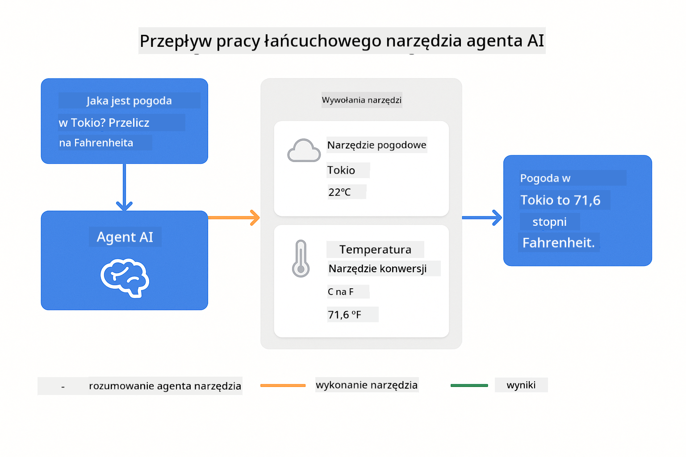
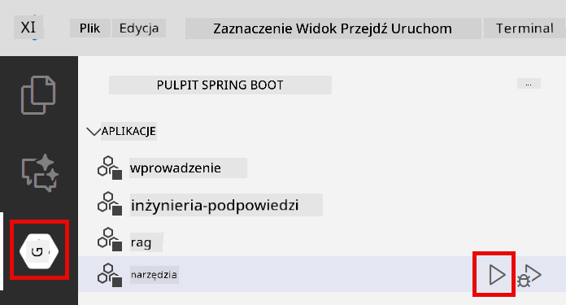
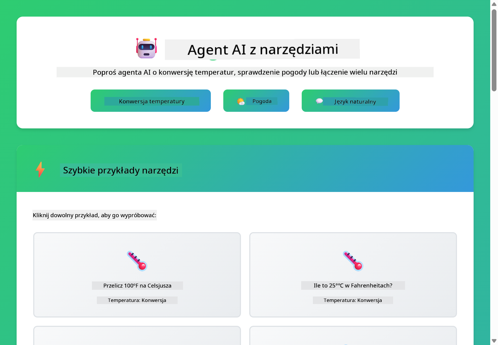

<!--
CO_OP_TRANSLATOR_METADATA:
{
  "original_hash": "aa23f106e7f53270924c9dd39c629004",
  "translation_date": "2025-12-13T18:52:07+00:00",
  "source_file": "04-tools/README.md",
  "language_code": "pl"
}
-->
# Moduł 04: Agenci AI z Narzędziami

## Spis treści

- [Czego się nauczysz](../../../04-tools)
- [Wymagania wstępne](../../../04-tools)
- [Zrozumienie agentów AI z narzędziami](../../../04-tools)
- [Jak działa wywoływanie narzędzi](../../../04-tools)
  - [Definicje narzędzi](../../../04-tools)
  - [Podejmowanie decyzji](../../../04-tools)
  - [Wykonanie](../../../04-tools)
  - [Generowanie odpowiedzi](../../../04-tools)
- [Łańcuchowanie narzędzi](../../../04-tools)
- [Uruchom aplikację](../../../04-tools)
- [Korzystanie z aplikacji](../../../04-tools)
  - [Wypróbuj proste użycie narzędzi](../../../04-tools)
  - [Przetestuj łańcuchowanie narzędzi](../../../04-tools)
  - [Zobacz przebieg rozmowy](../../../04-tools)
  - [Obserwuj rozumowanie](../../../04-tools)
  - [Eksperymentuj z różnymi zapytaniami](../../../04-tools)
- [Kluczowe koncepcje](../../../04-tools)
  - [Wzorzec ReAct (Rozumowanie i Działanie)](../../../04-tools)
  - [Znaczenie opisów narzędzi](../../../04-tools)
  - [Zarządzanie sesją](../../../04-tools)
  - [Obsługa błędów](../../../04-tools)
- [Dostępne narzędzia](../../../04-tools)
- [Kiedy używać agentów opartych na narzędziach](../../../04-tools)
- [Kolejne kroki](../../../04-tools)

## Czego się nauczysz

Do tej pory nauczyłeś się, jak prowadzić rozmowy z AI, skutecznie strukturyzować prompt i opierać odpowiedzi na Twoich dokumentach. Jednak nadal istnieje podstawowe ograniczenie: modele językowe mogą generować tylko tekst. Nie mogą sprawdzać pogody, wykonywać obliczeń, zapytywać baz danych ani wchodzić w interakcje z systemami zewnętrznymi.

Narzędzia to zmieniają. Dając modelowi dostęp do funkcji, które może wywołać, przekształcasz go z generatora tekstu w agenta, który może podejmować działania. Model decyduje, kiedy potrzebuje narzędzia, którego narzędzia użyć i jakie parametry przekazać. Twój kod wykonuje funkcję i zwraca wynik. Model włącza ten wynik do swojej odpowiedzi.

## Wymagania wstępne

- Ukończony Moduł 01 (wdrożone zasoby Azure OpenAI)
- Plik `.env` w katalogu głównym z poświadczeniami Azure (utworzony przez `azd up` w Module 01)

> **Uwaga:** Jeśli nie ukończyłeś Modułu 01, najpierw wykonaj tamte instrukcje wdrożenia.

## Zrozumienie agentów AI z narzędziami

Agent AI z narzędziami stosuje wzorzec rozumowania i działania (ReAct):

1. Użytkownik zadaje pytanie
2. Agent rozważa, co musi wiedzieć
3. Agent decyduje, czy potrzebuje narzędzia, aby odpowiedzieć
4. Jeśli tak, agent wywołuje odpowiednie narzędzie z właściwymi parametrami
5. Narzędzie wykonuje się i zwraca dane
6. Agent włącza wynik i udziela ostatecznej odpowiedzi


*Wzorzec ReAct – jak agenci AI na przemian rozumują i działają, aby rozwiązywać problemy*

Dzieje się to automatycznie. Definiujesz narzędzia i ich opisy. Model zajmuje się podejmowaniem decyzji, kiedy i jak ich używać.

## Jak działa wywoływanie narzędzi

**Definicje narzędzi** - [WeatherTool.java](../../../04-tools/src/main/java/com/example/langchain4j/agents/tools/WeatherTool.java) | [TemperatureTool.java](../../../04-tools/src/main/java/com/example/langchain4j/agents/tools/TemperatureTool.java)

Definiujesz funkcje z jasnymi opisami i specyfikacjami parametrów. Model widzi te opisy w swoim prompt systemowym i rozumie, co robi każde narzędzie.

```java
@Component
public class WeatherTool {
    
    @Tool("Get the current weather for a location")
    public String getCurrentWeather(@P("Location name") String location) {
        // Twoja logika wyszukiwania pogody
        return "Weather in " + location + ": 22°C, cloudy";
    }
}

@AiService
public interface Assistant {
    String chat(@MemoryId String sessionId, @UserMessage String message);
}

// Asystent jest automatycznie połączony przez Spring Boot z:
// - Bean ChatModel
// - Wszystkie metody @Tool z klas @Component
// - ChatMemoryProvider do zarządzania sesją
```

> **🤖 Wypróbuj z [GitHub Copilot](https://github.com/features/copilot) Chat:** Otwórz [`WeatherTool.java`](../../../04-tools/src/main/java/com/example/langchain4j/agents/tools/WeatherTool.java) i zapytaj:
> - "Jak zintegrowałbym prawdziwe API pogodowe, np. OpenWeatherMap, zamiast danych testowych?"
> - "Co sprawia, że opis narzędzia jest dobry i pomaga AI używać go poprawnie?"
> - "Jak obsługiwać błędy API i limity zapytań w implementacjach narzędzi?"

**Podejmowanie decyzji**

Gdy użytkownik pyta "Jaka jest pogoda w Seattle?", model rozpoznaje, że potrzebuje narzędzia pogodowego. Generuje wywołanie funkcji z parametrem lokalizacji ustawionym na "Seattle".

**Wykonanie** - [AgentService.java](../../../04-tools/src/main/java/com/example/langchain4j/agents/service/AgentService.java)

Spring Boot automatycznie wstrzykuje deklaratywny interfejs `@AiService` ze wszystkimi zarejestrowanymi narzędziami, a LangChain4j wykonuje wywołania narzędzi automatycznie.

> **🤖 Wypróbuj z [GitHub Copilot](https://github.com/features/copilot) Chat:** Otwórz [`AgentService.java`](../../../04-tools/src/main/java/com/example/langchain4j/agents/service/AgentService.java) i zapytaj:
> - "Jak działa wzorzec ReAct i dlaczego jest skuteczny dla agentów AI?"
> - "Jak agent decyduje, którego narzędzia użyć i w jakiej kolejności?"
> - "Co się dzieje, jeśli wykonanie narzędzia się nie powiedzie – jak solidnie obsługiwać błędy?"

**Generowanie odpowiedzi**

Model otrzymuje dane pogodowe i formatuje je na naturalną odpowiedź dla użytkownika.

### Dlaczego używać deklaratywnych usług AI?

Ten moduł korzysta z integracji LangChain4j ze Spring Boot i deklaratywnych interfejsów `@AiService`:

- **Automatyczne wstrzykiwanie Spring Boot** – ChatModel i narzędzia automatycznie wstrzykiwane
- **Wzorzec @MemoryId** – Automatyczne zarządzanie pamięcią sesji
- **Pojedyncza instancja** – Asystent tworzony raz i używany ponownie dla lepszej wydajności
- **Wykonanie typowane** – Metody Java wywoływane bezpośrednio z konwersją typów
- **Orkiestracja wieloetapowa** – Automatyczne obsługiwanie łańcuchowania narzędzi
- **Zero boilerplate** – Brak ręcznych wywołań AiServices.builder() lub pamięci HashMap

Alternatywne podejścia (ręczne `AiServices.builder()`) wymagają więcej kodu i nie korzystają z zalet integracji Spring Boot.

## Łańcuchowanie narzędzi

**Łańcuchowanie narzędzi** – AI może wywoływać wiele narzędzi po kolei. Zapytaj "Jaka jest pogoda w Seattle i czy powinienem zabrać parasol?" i obserwuj, jak łączy `getCurrentWeather` z rozumowaniem o potrzebie sprzętu przeciwdeszczowego.

<a href="images/tool-chaining.png"></a>

*Sekwencyjne wywołania narzędzi – wynik jednego narzędzia zasila kolejną decyzję*

**Łagodne błędy** – Zapytaj o pogodę w mieście, którego nie ma w danych testowych. Narzędzie zwraca komunikat o błędzie, a AI wyjaśnia, że nie może pomóc. Narzędzia bezpiecznie obsługują błędy.

Dzieje się to w jednej turze rozmowy. Agent samodzielnie orkiestruje wiele wywołań narzędzi.

## Uruchom aplikację

**Sprawdź wdrożenie:**

Upewnij się, że plik `.env` istnieje w katalogu głównym z poświadczeniami Azure (utworzony podczas Modułu 01):
```bash
cat ../.env  # Powinno pokazywać AZURE_OPENAI_ENDPOINT, API_KEY, DEPLOYMENT
```

**Uruchom aplikację:**

> **Uwaga:** Jeśli już uruchomiłeś wszystkie aplikacje za pomocą `./start-all.sh` z Modułu 01, ten moduł działa już na porcie 8084. Możesz pominąć poniższe polecenia startowe i przejść bezpośrednio do http://localhost:8084.

**Opcja 1: Korzystanie z Spring Boot Dashboard (zalecane dla użytkowników VS Code)**

Kontener deweloperski zawiera rozszerzenie Spring Boot Dashboard, które zapewnia wizualny interfejs do zarządzania wszystkimi aplikacjami Spring Boot. Znajdziesz je na pasku aktywności po lewej stronie VS Code (ikona Spring Boot).

Z poziomu Spring Boot Dashboard możesz:
- Zobaczyć wszystkie dostępne aplikacje Spring Boot w workspace
- Uruchamiać/zatrzymywać aplikacje jednym kliknięciem
- Przeglądać logi aplikacji w czasie rzeczywistym
- Monitorować status aplikacji

Wystarczy kliknąć przycisk play obok "tools", aby uruchomić ten moduł, lub uruchomić wszystkie moduły naraz.



**Opcja 2: Korzystanie ze skryptów powłoki**

Uruchom wszystkie aplikacje webowe (moduły 01-04):

**Bash:**
```bash
cd ..  # Z katalogu głównego
./start-all.sh
```

**PowerShell:**
```powershell
cd ..  # Z katalogu głównego
.\start-all.ps1
```

Lub uruchom tylko ten moduł:

**Bash:**
```bash
cd 04-tools
./start.sh
```

**PowerShell:**
```powershell
cd 04-tools
.\start.ps1
```

Oba skrypty automatycznie ładują zmienne środowiskowe z pliku `.env` w katalogu głównym i zbudują pliki JAR, jeśli nie istnieją.

> **Uwaga:** Jeśli wolisz zbudować wszystkie moduły ręcznie przed uruchomieniem:
>
> **Bash:**
> ```bash
> cd ..  # Go to root directory
> mvn clean package -DskipTests
> ```
>
> **PowerShell:**
> ```powershell
> cd ..  # Go to root directory
> mvn clean package -DskipTests
> ```

Otwórz http://localhost:8084 w przeglądarce.

**Aby zatrzymać:**

**Bash:**
```bash
./stop.sh  # Tylko ten moduł
# Lub
cd .. && ./stop-all.sh  # Wszystkie moduły
```

**PowerShell:**
```powershell
.\stop.ps1  # Tylko ten moduł
# Lub
cd ..; .\stop-all.ps1  # Wszystkie moduły
```

## Korzystanie z aplikacji

Aplikacja udostępnia interfejs webowy, w którym możesz wchodzić w interakcje z agentem AI mającym dostęp do narzędzi pogodowych i konwersji temperatur.

<a href="images/tools-homepage.png"></a>

*Interfejs narzędzi agenta AI – szybkie przykłady i czat do interakcji z narzędziami*

**Wypróbuj proste użycie narzędzi**

Zacznij od prostego zapytania: "Przelicz 100 stopni Fahrenheita na Celsjusza". Agent rozpoznaje, że potrzebuje narzędzia do konwersji temperatury, wywołuje je z odpowiednimi parametrami i zwraca wynik. Zauważ, jak naturalne to jest – nie określałeś, którego narzędzia użyć ani jak je wywołać.

**Przetestuj łańcuchowanie narzędzi**

Teraz spróbuj czegoś bardziej złożonego: "Jaka jest pogoda w Seattle i przelicz ją na Fahrenheita?" Obserwuj, jak agent działa krok po kroku. Najpierw pobiera pogodę (w stopniach Celsjusza), rozpoznaje potrzebę konwersji na Fahrenheita, wywołuje narzędzie konwersji i łączy oba wyniki w jedną odpowiedź.

**Zobacz przebieg rozmowy**

Interfejs czatu utrzymuje historię rozmowy, pozwalając na wieloetapowe interakcje. Możesz zobaczyć wszystkie poprzednie zapytania i odpowiedzi, co ułatwia śledzenie rozmowy i zrozumienie, jak agent buduje kontekst przez kolejne wymiany.

<a href="images/tools-conversation-demo.png"></a>

*Wieloetapowa rozmowa pokazująca proste konwersje, wyszukiwania pogody i łańcuchowanie narzędzi*

**Eksperymentuj z różnymi zapytaniami**

Wypróbuj różne kombinacje:
- Wyszukiwania pogody: "Jaka jest pogoda w Tokio?"
- Konwersje temperatur: "Ile to 25°C w kelwinach?"
- Zapytania łączone: "Sprawdź pogodę w Paryżu i powiedz, czy jest powyżej 20°C"

Zauważ, jak agent interpretuje język naturalny i mapuje go na odpowiednie wywołania narzędzi.

## Kluczowe koncepcje

**Wzorzec ReAct (Rozumowanie i Działanie)**

Agent na przemian rozważa (decyduje, co zrobić) i działa (używa narzędzi). Ten wzorzec umożliwia autonomiczne rozwiązywanie problemów, a nie tylko reagowanie na instrukcje.

**Znaczenie opisów narzędzi**

Jakość opisów narzędzi bezpośrednio wpływa na to, jak dobrze agent ich używa. Jasne, konkretne opisy pomagają modelowi zrozumieć, kiedy i jak wywołać każde narzędzie.

**Zarządzanie sesją**

Adnotacja `@MemoryId` umożliwia automatyczne zarządzanie pamięcią opartą na sesji. Każde ID sesji otrzymuje własną instancję `ChatMemory` zarządzaną przez bean `ChatMemoryProvider`, eliminując potrzebę ręcznego śledzenia pamięci.

**Obsługa błędów**

Narzędzia mogą zawodzić – API mogą mieć timeouty, parametry mogą być nieprawidłowe, usługi zewnętrzne mogą być niedostępne. Agenci produkcyjni potrzebują obsługi błędów, aby model mógł wyjaśniać problemy lub próbować alternatyw.

## Dostępne narzędzia

**Narzędzia pogodowe** (dane testowe do demonstracji):
- Pobierz aktualną pogodę dla lokalizacji
- Pobierz prognozę na kilka dni

**Narzędzia konwersji temperatury**:
- Celsjusz na Fahrenheita
- Fahrenheit na Celsjusza
- Celsjusz na Kelwina
- Kelvin na Celsjusza
- Fahrenheit na Kelwina
- Kelvin na Fahrenheita

To proste przykłady, ale wzorzec rozszerza się na dowolne funkcje: zapytania do baz danych, wywołania API, obliczenia, operacje na plikach czy polecenia systemowe.

## Kiedy używać agentów opartych na narzędziach

**Używaj narzędzi, gdy:**
- Odpowiedź wymaga danych w czasie rzeczywistym (pogoda, ceny akcji, stan magazynu)
- Musisz wykonać obliczenia wykraczające poza prostą matematykę
- Dostęp do baz danych lub API
- Podejmowanie działań (wysyłanie maili, tworzenie zgłoszeń, aktualizacja rekordów)
- Łączenie wielu źródeł danych

**Nie używaj narzędzi, gdy:**
- Pytania można odpowiedzieć na podstawie wiedzy ogólnej
- Odpowiedź jest czysto konwersacyjna
- Opóźnienia narzędzi spowodowałyby zbyt wolne działanie

## Kolejne kroki

**Następny moduł:** [05-mcp - Model Context Protocol (MCP)](../05-mcp/README.md)

---

**Nawigacja:** [← Poprzedni: Moduł 03 - RAG](../03-rag/README.md) | [Powrót do głównego](../README.md) | [Następny: Moduł 05 - MCP →](../05-mcp/README.md)

---

<!-- CO-OP TRANSLATOR DISCLAIMER START -->
**Zastrzeżenie**:  
Niniejszy dokument został przetłumaczony za pomocą usługi tłumaczenia AI [Co-op Translator](https://github.com/Azure/co-op-translator). Mimo że dokładamy starań, aby tłumaczenie było jak najbardziej precyzyjne, prosimy mieć na uwadze, że automatyczne tłumaczenia mogą zawierać błędy lub nieścisłości. Oryginalny dokument w języku źródłowym powinien być uznawany za źródło autorytatywne. W przypadku informacji krytycznych zalecane jest skorzystanie z profesjonalnego tłumaczenia wykonanego przez człowieka. Nie ponosimy odpowiedzialności za jakiekolwiek nieporozumienia lub błędne interpretacje wynikające z korzystania z tego tłumaczenia.
<!-- CO-OP TRANSLATOR DISCLAIMER END -->