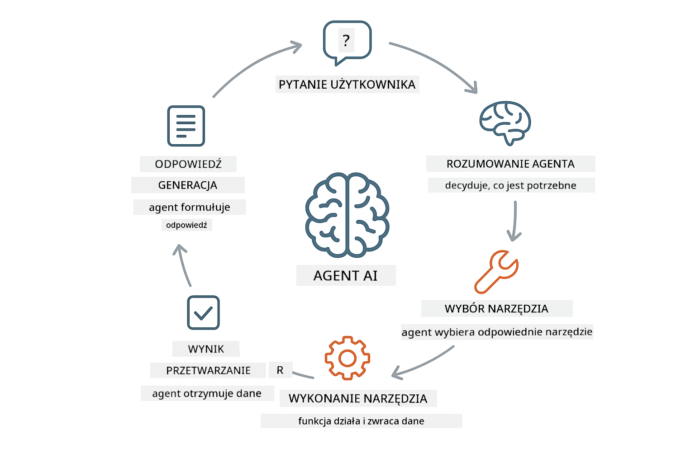
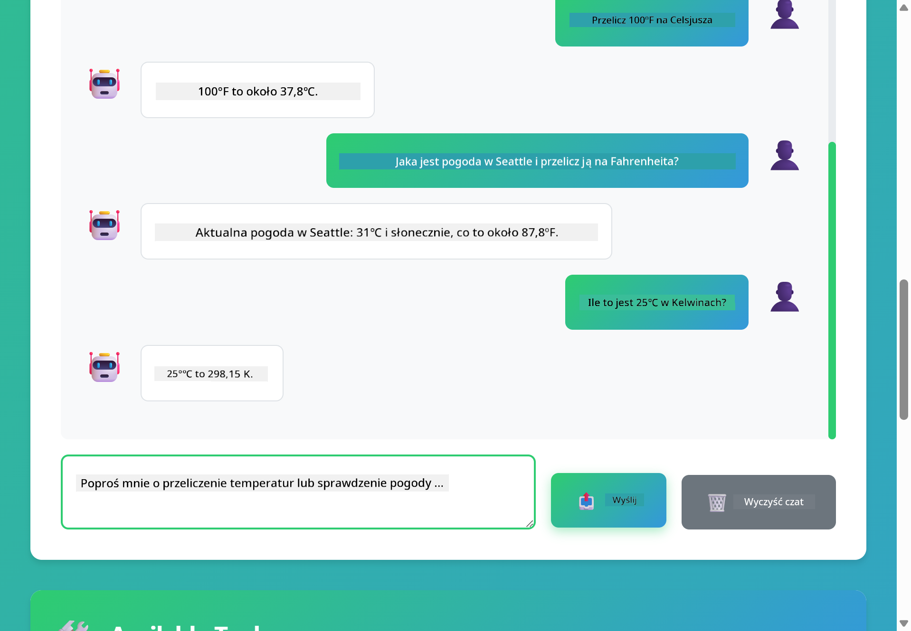

<!--
CO_OP_TRANSLATOR_METADATA:
{
  "original_hash": "13ec450c12cdd1a863baa2b778f27cd7",
  "translation_date": "2025-12-31T00:21:25+00:00",
  "source_file": "04-tools/README.md",
  "language_code": "pl"
}
-->
# Module 04: Agenci AI z narzędziami

## Table of Contents

- [Czego się nauczysz](../../../04-tools)
- [Wymagania wstępne](../../../04-tools)
- [Rozumienie agentów AI z narzędziami](../../../04-tools)
- [Jak działa wywoływanie narzędzi](../../../04-tools)
  - [Definicje narzędzi](../../../04-tools)
  - [Podejmowanie decyzji](../../../04-tools)
  - [Wykonanie](../../../04-tools)
  - [Generowanie odpowiedzi](../../../04-tools)
- [Łączenie narzędzi](../../../04-tools)
- [Uruchom aplikację](../../../04-tools)
- [Korzystanie z aplikacji](../../../04-tools)
  - [Wypróbuj proste użycie narzędzia](../../../04-tools)
  - [Przetestuj łączenie narzędzi](../../../04-tools)
  - [Zobacz przepływ rozmowy](../../../04-tools)
  - [Zaobserwuj rozumowanie](../../../04-tools)
  - [Eksperymentuj z różnymi żądaniami](../../../04-tools)
- [Kluczowe koncepcje](../../../04-tools)
  - [Wzorzec ReAct (Reasoning and Acting)](../../../04-tools)
  - [Opis narzędzi ma znaczenie](../../../04-tools)
  - [Zarządzanie sesją](../../../04-tools)
  - [Obsługa błędów](../../../04-tools)
- [Dostępne narzędzia](../../../04-tools)
- [Kiedy używać agentów opartych na narzędziach](../../../04-tools)
- [Następne kroki](../../../04-tools)

## Czego się nauczysz

Do tej pory nauczyłeś się prowadzić rozmowy z AI, skutecznie strukturyzować prompt i opierać odpowiedzi na swoich dokumentach. Wciąż jednak istnieje fundamentalne ograniczenie: modele językowe mogą jedynie generować tekst. Nie potrafią sprawdzić pogody, wykonać obliczeń, zapytać bazę danych ani wchodzić w interakcję z systemami zewnętrznymi.

Narzędzia to zmieniają. Dając modelowi dostęp do funkcji, które może wywoływać, przekształcasz go z generatora tekstu w agenta, który może podejmować działania. Model decyduje, kiedy potrzebuje narzędzia, którego narzędzia użyć i jakie parametry przekazać. Twój kod wykonuje funkcję i zwraca wynik. Model włącza ten wynik do swojej odpowiedzi.

## Wymagania wstępne

- Ukończony Moduł 01 (zasoby Azure OpenAI wdrożone)
- Plik `.env` w katalogu głównym z poświadczeniami Azure (utworzony przez `azd up` w Module 01)

> **Uwaga:** Jeśli nie ukończyłeś Modułu 01, wykonaj najpierw tamte instrukcje wdrożeniowe.

## Rozumienie agentów AI z narzędziami

> **📝 Uwaga:** Termin "agenci" w tym module odnosi się do asystentów AI rozszerzonych o możliwość wywoływania narzędzi. Różni się to od wzorców **Agentic AI** (autonomicznych agentów z planowaniem, pamięcią i wieloetapowym rozumowaniem), które omówimy w [Module 05: MCP](../05-mcp/README.md).

Agent AI z narzędziami stosuje wzorzec rozumowania i działania (ReAct):

1. Użytkownik zadaje pytanie
2. Agent rozważa, czego musi się dowiedzieć
3. Agent decyduje, czy potrzebuje narzędzia, aby odpowiedzieć
4. Jeśli tak, agent wywołuje odpowiednie narzędzie z właściwymi parametrami
5. Narzędzie wykonuje się i zwraca dane
6. Agent włącza wynik i udziela ostatecznej odpowiedzi



*Wzorzec ReAct - jak agenci AI na przemian rozumują i działają, aby rozwiązać problemy*

Dzieje się to automatycznie. Definiujesz narzędzia i ich opisy. Model zajmuje się podejmowaniem decyzji o tym, kiedy i jak ich użyć.

## Jak działa wywoływanie narzędzi

**Definicje narzędzi** - [WeatherTool.java](../../../04-tools/src/main/java/com/example/langchain4j/agents/tools/WeatherTool.java) | [TemperatureTool.java](../../../04-tools/src/main/java/com/example/langchain4j/agents/tools/TemperatureTool.java)

Definiujesz funkcje z jasnymi opisami i specyfikacją parametrów. Model widzi te opisy w swoim system prompt i rozumie, co każde narzędzie robi.

```java
@Component
public class WeatherTool {
    
    @Tool("Get the current weather for a location")
    public String getCurrentWeather(@P("Location name") String location) {
        // Twoja logika wyszukiwania pogody
        return "Weather in " + location + ": 22°C, cloudy";
    }
}

@AiService
public interface Assistant {
    String chat(@MemoryId String sessionId, @UserMessage String message);
}

// Asystent jest automatycznie konfigurowany przez Spring Boot z:
// - bean ChatModel
// - wszystkie metody @Tool z klas @Component
// - ChatMemoryProvider do zarządzania sesją
```

> **🤖 Wypróbuj z [GitHub Copilot](https://github.com/features/copilot) Chat:** Otwórz [`WeatherTool.java`](../../../04-tools/src/main/java/com/example/langchain4j/agents/tools/WeatherTool.java) i zapytaj:
> - "Jak zintegrowałbym prawdziwe API pogodowe, takie jak OpenWeatherMap zamiast danych mock?"
> - "Co sprawia, że opis narzędzia jest dobry i pomaga AI używać go poprawnie?"
> - "Jak obsługiwać błędy API i limity zapytań w implementacjach narzędzi?"

**Podejmowanie decyzji**

Kiedy użytkownik pyta "Jaka jest pogoda w Seattle?", model rozpoznaje, że potrzebuje narzędzia pogodowego. Generuje wywołanie funkcji z parametrem location ustawionym na "Seattle".

**Wykonanie** - [AgentService.java](../../../04-tools/src/main/java/com/example/langchain4j/agents/service/AgentService.java)

Spring Boot automatycznie wstrzykuje deklaratywny interfejs `@AiService` ze wszystkimi zarejestrowanymi narzędziami, a LangChain4j wykonuje wywołania narzędzi automatycznie.

> **🤖 Wypróbuj z [GitHub Copilot](https://github.com/features/copilot) Chat:** Otwórz [`AgentService.java`](../../../04-tools/src/main/java/com/example/langchain4j/agents/service/AgentService.java) i zapytaj:
> - "Jak działa wzorzec ReAct i dlaczego jest skuteczny dla agentów AI?"
> - "Jak agent decyduje, którego narzędzia użyć i w jakiej kolejności?"
> - "Co się stanie, jeśli wykonanie narzędzia się nie powiedzie - jak solidnie obsługiwać błędy?"

**Generowanie odpowiedzi**

Model otrzymuje dane pogodowe i formatuje je do naturalnej odpowiedzi dla użytkownika.

### Dlaczego warto używać deklaratywnych AiServices?

Ten moduł używa integracji LangChain4j ze Spring Boot z deklaratywnymi interfejsami `@AiService`:

- **Spring Boot auto-wiring** - ChatModel i narzędzia są automatycznie wstrzykiwane
- **@MemoryId pattern** - Automatyczne zarządzanie pamięcią na podstawie sesji
- **Pojedyncza instancja** - Asystent tworzony raz i wielokrotnie używany dla lepszej wydajności
- **Wykonanie z bezpieczeństwem typów** - Metody Java wywoływane bezpośrednio z konwersją typów
- **Orkiestracja wieloetapowa** - Automatycznie obsługuje łączenie narzędzi
- **Zero boilerplate** - Brak ręcznych wywołań AiServices.builder() ani HashMap do pamięci

Alternatywne podejścia (ręczne `AiServices.builder()`) wymagają więcej kodu i nie korzystają z integracji Spring Boot.

## Łączenie narzędzi

**Łączenie narzędzi** - AI może wywoływać wiele narzędzi w sekwencji. Zapytaj "Jaka jest pogoda w Seattle i czy powinienem zabrać parasol?" i obserwuj, jak łączy `getCurrentWeather` z rozumowaniem na temat wyposażenia przeciwdeszczowego.

<a href="images/tool-chaining.png"></a>

*Sekwencyjne wywołania narzędzi - wynik jednego narzędzia wpływa na kolejne decyzje*

**Łagodne awarie** - Zapytaj o pogodę w mieście, którego nie ma w danych mock. Narzędzie zwraca komunikat o błędzie, a AI wyjaśnia, że nie może pomóc. Narzędzia zawodzą bezpiecznie.

Dzieje się to w jednej turze rozmowy. Agent samodzielnie orkiestruje wiele wywołań narzędzi.

## Uruchom aplikację

**Zweryfikuj wdrożenie:**

Upewnij się, że plik `.env` istnieje w katalogu głównym z poświadczeniami Azure (utworzony podczas Modułu 01):
```bash
cat ../.env  # Powinno wyświetlić AZURE_OPENAI_ENDPOINT, API_KEY, DEPLOYMENT
```

**Uruchom aplikację:**

> **Uwaga:** Jeśli już uruchomiłeś wszystkie aplikacje używając `./start-all.sh` z Modułu 01, ten moduł jest już uruchomiony na porcie 8084. Możesz pominąć poniższe polecenia startowe i przejść bezpośrednio do http://localhost:8084.

**Opcja 1: Korzystanie z Spring Boot Dashboard (zalecane dla użytkowników VS Code)**

Kontener deweloperski zawiera rozszerzenie Spring Boot Dashboard, które zapewnia interfejs graficzny do zarządzania wszystkimi aplikacjami Spring Boot. Znajdziesz je w pasku aktywności po lewej stronie VS Code (szukaj ikony Spring Boot).

Z poziomu Spring Boot Dashboard możesz:
- Zobaczyć wszystkie dostępne aplikacje Spring Boot w workspace
- Uruchamiać/zatrzymywać aplikacje jednym kliknięciem
- Przeglądać logi aplikacji w czasie rzeczywistym
- Monitorować status aplikacji

Po prostu kliknij przycisk play obok "tools", aby uruchomić ten moduł, lub uruchom wszystkie moduły naraz.


**Opcja 2: Korzystanie ze skryptów shell**

Uruchom wszystkie aplikacje webowe (moduły 01-04):

**Bash:**
```bash
cd ..  # Z katalogu głównego
./start-all.sh
```

**PowerShell:**
```powershell
cd ..  # Z katalogu głównego
.\start-all.ps1
```

Lub uruchom tylko ten moduł:

**Bash:**
```bash
cd 04-tools
./start.sh
```

**PowerShell:**
```powershell
cd 04-tools
.\start.ps1
```

Oba skrypty automatycznie ładują zmienne środowiskowe z pliku `.env` w katalogu głównym i zbudują JAR-y, jeśli nie istnieją.

> **Uwaga:** Jeśli wolisz zbudować wszystkie moduły ręcznie przed uruchomieniem:
>
> **Bash:**
> ```bash
> cd ..  # Go to root directory
> mvn clean package -DskipTests
> ```
>
> **PowerShell:**
> ```powershell
> cd ..  # Go to root directory
> mvn clean package -DskipTests
> ```

Otwórz http://localhost:8084 w przeglądarce.

**Aby zatrzymać:**

**Bash:**
```bash
./stop.sh  # Tylko ten moduł
# Lub
cd .. && ./stop-all.sh  # Wszystkie moduły
```

**PowerShell:**
```powershell
.\stop.ps1  # Tylko ten moduł
# Lub
cd ..; .\stop-all.ps1  # Wszystkie moduły
```

## Korzystanie z aplikacji

Aplikacja udostępnia interfejs webowy, w którym możesz wchodzić w interakcje z agentem AI mającym dostęp do narzędzi pogodowych i konwersji temperatur.

<a href="images/tools-homepage.png"></a>

*Interfejs narzędzi agenta AI - szybkie przykłady i interfejs czatu do interakcji z narzędziami*

**Wypróbuj proste użycie narzędzia**

Zacznij od prostego żądania: "Przelicz 100 stopni Fahrenheita na Celsjusza". Agent rozpozna, że potrzebuje narzędzia do konwersji temperatury, wywoła je z odpowiednimi parametrami i zwróci wynik. Zwróć uwagę, jak naturalne to się wydaje — nie określałeś, którego narzędzia użyć ani jak je wywołać.

**Przetestuj łączenie narzędzi**

Teraz spróbuj czegoś bardziej złożonego: "Jaka jest pogoda w Seattle i przelicz ją na Fahrenheita?" Obserwuj, jak agent wykonuje kroki. Najpierw pobiera pogodę (która zwraca stopnie Celsjusza), rozpoznaje potrzebę konwersji na Fahrenheita, wywołuje narzędzie konwersji i łączy oba wyniki w jedną odpowiedź.

**Zobacz przepływ rozmowy**

Interfejs czatu utrzymuje historię rozmowy, pozwalając na interakcje wieloturnowe. Możesz zobaczyć wszystkie poprzednie zapytania i odpowiedzi, co ułatwia śledzenie rozmowy i zrozumienie, jak agent buduje kontekst przez kolejne wymiany.

<a href="images/tools-conversation-demo.png"></a>

*Konwersacja wieloetapowa pokazująca proste konwersje, wyszukiwania pogody i łączenie narzędzi*

**Eksperymentuj z różnymi żądaniami**

Wypróbuj różne kombinacje:
- Wyszukiwania pogody: "Jaka jest pogoda w Tokio?"
- Konwersje temperatur: "Ile to jest 25°C w Kelwinach?"
- Zapytania łączone: "Sprawdź pogodę w Paryżu i powiedz mi, czy jest powyżej 20°C"

Zauważ, jak agent interpretuje język naturalny i mapuje go na odpowiednie wywołania narzędzi.

## Kluczowe koncepcje

**Wzorzec ReAct (Reasoning and Acting)**

Agent na przemian rozważa (decyduje, co zrobić) i działa (używa narzędzi). Ten wzorzec umożliwia autonomiczne rozwiązywanie problemów zamiast jedynie wykonywania poleceń.

**Opis narzędzi ma znaczenie**

Jakość opisów narzędzi bezpośrednio wpływa na to, jak dobrze agent ich używa. Jasne, konkretne opisy pomagają modelowi zrozumieć, kiedy i jak wywołać każde narzędzie.

**Zarządzanie sesją**

Adnotacja `@MemoryId` umożliwia automatyczne zarządzanie pamięcią na podstawie sesji. Każde ID sesji otrzymuje własną instancję `ChatMemory` zarządzaną przez bean `ChatMemoryProvider`, eliminując potrzebę ręcznego śledzenia pamięci.

**Obsługa błędów**

Narzędzia mogą zawieść — API mogą przekroczyć limit czasu, parametry mogą być nieprawidłowe, usługi zewnętrzne mogą przestać działać. Agenci produkcyjni potrzebują obsługi błędów, aby model mógł wyjaśnić problemy lub spróbować alternatyw.

## Dostępne narzędzia

**Narzędzia pogodowe** (dane mock do demonstracji):
- Pobierz aktualną pogodę dla lokalizacji
- Pobierz prognozę na kilka dni

**Narzędzia konwersji temperatur**:
- Celsius na Fahrenheit
- Fahrenheit na Celsius
- Celsius na Kelvin
- Kelvin na Celsius
- Fahrenheit na Kelvin
- Kelvin na Fahrenheit

To są proste przykłady, ale wzorzec rozciąga się na dowolną funkcję: zapytania do baz danych, wywołania API, obliczenia, operacje na plikach czy polecenia systemowe.

## Kiedy używać agentów opartych na narzędziach

**Używaj narzędzi, gdy:**
- Odpowiedź wymaga danych w czasie rzeczywistym (pogoda, ceny akcji, stan magazynu)
- Musisz wykonać obliczenia wykraczające poza proste działania matematyczne
- Dostęp do baz danych lub API jest potrzebny
- Wykonywane są działania (wysyłanie e-maili, tworzenie ticketów, aktualizowanie rekordów)
- Konieczne jest łączenie wielu źródeł danych

**Nie używaj narzędzi, gdy:**
- Pytania można odpowiedzieć z ogólnej wiedzy
- Odpowiedź jest czysto konwersacyjna
- Opóźnienia narzędzi sprawiłyby, że doświadczenie byłoby zbyt wolne

## Następne kroki

**Następny moduł:** [05-mcp - Model Context Protocol (MCP)](../05-mcp/README.md)

---

**Nawigacja:** [← Poprzedni: Module 03 - RAG](../03-rag/README.md) | [Powrót do głównego](../README.md) | [Następny: Module 05 - MCP →](../05-mcp/README.md)

---

<!-- CO-OP TRANSLATOR DISCLAIMER START -->
Zastrzeżenie:
Niniejszy dokument został przetłumaczony przy użyciu usługi tłumaczeń wspomaganej sztuczną inteligencją Co-op Translator (https://github.com/Azure/co-op-translator). Chociaż dokładamy starań, aby tłumaczenie było jak najbardziej precyzyjne, prosimy pamiętać, że automatyczne przekłady mogą zawierać błędy lub nieścisłości. Oryginalny dokument w języku źródłowym należy uważać za wersję wiążącą. W przypadku informacji o istotnym znaczeniu zalecane jest skorzystanie z profesjonalnego, ludzkiego tłumaczenia. Nie ponosimy odpowiedzialności za jakiekolwiek nieporozumienia lub błędne interpretacje wynikające z korzystania z tego tłumaczenia.
<!-- CO-OP TRANSLATOR DISCLAIMER END -->