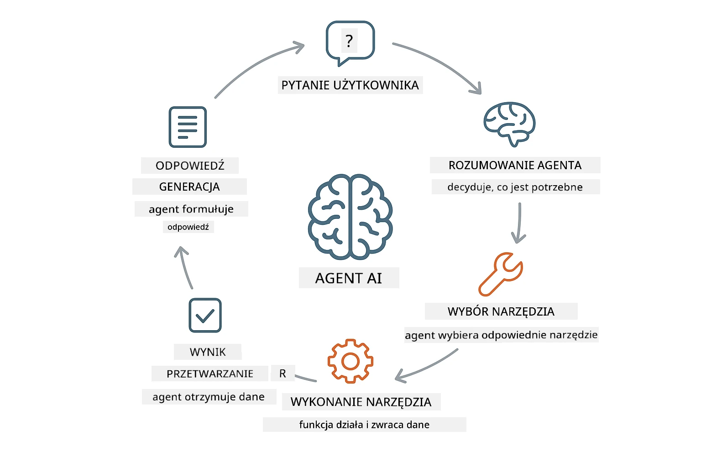
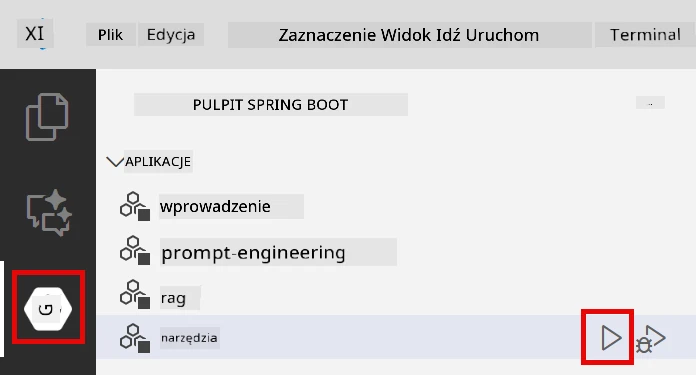

# Moduł 04: Agenci AI z narzędziami

## Spis treści

- [Czego się nauczysz](../../../04-tools)
- [Wymagania wstępne](../../../04-tools)
- [Zrozumienie agentów AI z narzędziami](../../../04-tools)
- [Jak działa wywoływanie narzędzi](../../../04-tools)
  - [Definicje narzędzi](../../../04-tools)
  - [Podejmowanie decyzji](../../../04-tools)
  - [Wykonanie](../../../04-tools)
  - [Generowanie odpowiedzi](../../../04-tools)
- [Łańcuchowanie narzędzi](../../../04-tools)
- [Uruchomienie aplikacji](../../../04-tools)
- [Korzystanie z aplikacji](../../../04-tools)
  - [Wypróbuj proste użycie narzędzia](../../../04-tools)
  - [Testuj łańcuchowanie narzędzi](../../../04-tools)
  - [Zobacz przebieg rozmowy](../../../04-tools)
  - [Eksperymentuj z różnymi zapytaniami](../../../04-tools)
- [Kluczowe koncepcje](../../../04-tools)
  - [Wzorzec ReAct (rozumowanie i działanie)](../../../04-tools)
  - [Opis narzędzi ma znaczenie](../../../04-tools)
  - [Zarządzanie sesją](../../../04-tools)
  - [Obsługa błędów](../../../04-tools)
- [Dostępne narzędzia](../../../04-tools)
- [Kiedy używać agentów opartych na narzędziach](../../../04-tools)
- [Kolejne kroki](../../../04-tools)

## Czego się nauczysz

Do tej pory nauczyłeś się, jak prowadzić rozmowy z AI, skutecznie tworzyć struktury promptów i opierać odpowiedzi na dokumentach. Jednak nadal istnieje fundamentalne ograniczenie: modele językowe mogą jedynie generować tekst. Nie mogą sprawdzać pogody, wykonywać obliczeń, zapytywać baz danych ani wchodzić w interakcję z zewnętrznymi systemami.

Narzędzia to zmieniają. Dając modelowi dostęp do funkcji, które może wywołać, przekształcasz go z generatora tekstu w agenta, który może podejmować działania. Model decyduje, kiedy potrzebuje narzędzia, którego narzędzia użyć i jakie parametry przekazać. Twój kod wykonuje funkcję i zwraca wynik. Model włącza ten wynik do swojej odpowiedzi.

## Wymagania wstępne

- Ukończony Moduł 01 (wdrożone zasoby Azure OpenAI)
- Plik `.env` w katalogu głównym z poświadczeniami Azure (utworzony przez `azd up` w Moduł 01)

> **Uwaga:** Jeśli nie ukończyłeś Modułu 01, najpierw wykonaj instrukcje wdrożenia tam opisane.

## Zrozumienie agentów AI z narzędziami

> **📝 Uwaga:** Termin „agenci” w tym module odnosi się do asystentów AI rozszerzonych o możliwości wywoływania narzędzi. Jest to inne podejście niż wzorce **Agentic AI** (autonomiczni agenci z planowaniem, pamięcią i wieloetapowym rozumowaniem), które omówimy w [Moduł 05: MCP](../05-mcp/README.md).

Agent AI z narzędziami realizuje wzorzec rozumowania i działania (ReAct):

1. Użytkownik zadaje pytanie
2. Agent rozważa, co musi wiedzieć
3. Agent decyduje, czy potrzebuje narzędzia, aby odpowiedzieć
4. Jeśli tak, agent wywołuje odpowiednie narzędzie z właściwymi parametrami
5. Narzędzie wykonuje się i zwraca dane
6. Agent włącza wynik i podaje ostateczną odpowiedź



*Wzorzec ReAct – jak agenci AI na przemian rozumują i działają, aby rozwiązywać problemy*

Dzieje się to automatycznie. Definiujesz narzędzia i ich opisy. Model zarządza podejmowaniem decyzji, kiedy i jak ich używać.

## Jak działa wywoływanie narzędzi

### Definicje narzędzi

[WeatherTool.java](../../../04-tools/src/main/java/com/example/langchain4j/agents/tools/WeatherTool.java) | [TemperatureTool.java](../../../04-tools/src/main/java/com/example/langchain4j/agents/tools/TemperatureTool.java)

Definiujesz funkcje z jasnymi opisami i specyfikacjami parametrów. Model widzi te opisy w swoim systemowym prompt i rozumie, co robi każde narzędzie.

```java
@Component
public class WeatherTool {
    
    @Tool("Get the current weather for a location")
    public String getCurrentWeather(@P("Location name") String location) {
        // Twoja logika wyszukiwania pogody
        return "Weather in " + location + ": 22°C, cloudy";
    }
}

@AiService
public interface Assistant {
    String chat(@MemoryId String sessionId, @UserMessage String message);
}

// Asystent jest automatycznie podłączany przez Spring Boot z:
// - Beanem ChatModel
// - Wszystkimi metodami @Tool z klas @Component
// - ChatMemoryProvider do zarządzania sesją
```

> **🤖 Wypróbuj z [GitHub Copilot](https://github.com/features/copilot) Chat:** Otwórz [`WeatherTool.java`](../../../04-tools/src/main/java/com/example/langchain4j/agents/tools/WeatherTool.java) i zapytaj:
> - „Jak zintegrowałbym prawdziwe API pogodowe, np. OpenWeatherMap, zamiast danych testowych?”
> - „Co sprawia, że opis narzędzia jest dobry i pomaga AI używać go poprawnie?”
> - „Jak obsługiwać błędy API i limity zapytań przy implementacji narzędzi?”

### Podejmowanie decyzji

Kiedy użytkownik pyta „Jaka jest pogoda w Seattle?”, model rozpoznaje potrzebę użycia narzędzia pogodowego. Generuje wywołanie funkcji z parametrem lokalizacji „Seattle”.

### Wykonanie

[AgentService.java](../../../04-tools/src/main/java/com/example/langchain4j/agents/service/AgentService.java)

Spring Boot automatycznie podłącza deklaratywny interfejs `@AiService` ze wszystkimi zarejestrowanymi narzędziami, a LangChain4j automatycznie wykonuje wywołania narzędzi.

> **🤖 Wypróbuj z [GitHub Copilot](https://github.com/features/copilot) Chat:** Otwórz [`AgentService.java`](../../../04-tools/src/main/java/com/example/langchain4j/agents/service/AgentService.java) i zapytaj:
> - „Jak działa wzorzec ReAct i dlaczego jest skuteczny dla agentów AI?”
> - „Jak agent decyduje, którego narzędzia użyć i w jakiej kolejności?”
> - „Co się stanie, jeśli wykonanie narzędzia się nie powiedzie – jak solidnie obsługiwać błędy?”

### Generowanie odpowiedzi

Model otrzymuje dane pogodowe i formatuje je na naturalną odpowiedź dla użytkownika.

### Dlaczego używać deklaratywnych usług AI?

W tym module używamy integracji LangChain4j ze Spring Boot i deklaratywnych interfejsów `@AiService`:

- **Automatyczne podłączanie w Spring Boot** – ChatModel i narzędzia są wstrzykiwane automatycznie
- **Wzorzec @MemoryId** – automatyczne zarządzanie pamięcią sesji
- **Pojedyncza instancja** – asystent tworzony raz i używany ponownie dla lepszej wydajności
- **Typowane wywołania** – metody Javy wywoływane bezpośrednio z konwersją typów
- **Orkiestracja wielokrotnych wywołań** – automatyczne zarządzanie łańcuchowaniem narzędzi
- **Brak powtarzalnego kodu** – bez ręcznych wywołań AiServices.builder() lub HashMap pamięci

Alternatywne podejścia (ręczne `AiServices.builder()`) wymagają więcej kodu i nie korzystają z integracji Spring Boot.

## Łańcuchowanie narzędzi

**Łańcuchowanie narzędzi** – AI może wywołać wiele narzędzi sekwencyjnie. Zapytaj „Jaka jest pogoda w Seattle i czy powinienem zabrać parasol?” i zobacz, jak łączy `getCurrentWeather` z rozumowaniem o konieczności noszenia płaszcza przeciwdeszczowego.

<a href="images/tool-chaining.png"></a>

*Sekwencyjne wywołania narzędzi – wynik jednego narzędzia wpływa na kolejną decyzję*

**Łagodne błędy** – zapytaj o pogodę w mieście, którego nie ma w danych testowych. Narzędzie zwraca komunikat o błędzie, a AI wyjaśnia, że nie może pomóc. Narzędzia kończą działanie bezpiecznie.

Dzieje się to podczas jednej tury rozmowy. Agent samodzielnie orkiestruje wiele wywołań narzędzi.

## Uruchomienie aplikacji

**Weryfikacja wdrożenia:**

Upewnij się, że plik `.env` istnieje w katalogu głównym z poświadczeniami Azure (utworzony podczas Modułu 01):
```bash
cat ../.env  # Powinno pokazywać AZURE_OPENAI_ENDPOINT, API_KEY, DEPLOYMENT
```

**Uruchom aplikację:**

> **Uwaga:** Jeśli uruchomiłeś już wszystkie aplikacje używając `./start-all.sh` z Modułu 01, ten moduł już działa na porcie 8084. Możesz pominąć poniższe polecenia uruchomienia i przejść od razu do http://localhost:8084.

**Opcja 1: Korzystanie z panelu Spring Boot (zalecane dla użytkowników VS Code)**

Kontener deweloperski zawiera rozszerzenie Spring Boot Dashboard, które umożliwia wizualne zarządzanie wszystkimi aplikacjami Spring Boot. Znajdziesz je w pasku aktywności po lewej stronie w VS Code (ikona Spring Boot).

Z poziomu panelu Spring Boot możesz:
- Zobaczyć wszystkie dostępne aplikacje Spring Boot w obszarze roboczym
- Uruchamiać/zatrzymywać aplikacje jednym kliknięciem
- Przeglądać logi aplikacji w czasie rzeczywistym
- Monitorować status aplikacji

Wystarczy kliknąć przycisk uruchomienia obok „tools”, aby rozpocząć ten moduł lub uruchomić wszystkie moduły na raz.



**Opcja 2: Użycie skryptów powłoki**

Uruchom wszystkie aplikacje webowe (moduły 01-04):

**Bash:**
```bash
cd ..  # Z katalogu głównego
./start-all.sh
```

**PowerShell:**
```powershell
cd ..  # Z katalogu głównego
.\start-all.ps1
```

Lub uruchom tylko ten moduł:

**Bash:**
```bash
cd 04-tools
./start.sh
```

**PowerShell:**
```powershell
cd 04-tools
.\start.ps1
```

Oba skrypty automatycznie ładują zmienne środowiskowe z pliku `.env` w katalogu głównym i zbudują pliki JAR, jeśli jeszcze nie istnieją.

> **Uwaga:** Jeśli wolisz najpierw ręcznie zbudować wszystkie moduły przed uruchomieniem:
>
> **Bash:**
> ```bash
> cd ..  # Go to root directory
> mvn clean package -DskipTests
> ```

> **PowerShell:**
> ```powershell
> cd ..  # Go to root directory
> mvn clean package -DskipTests
> ```

Otwórz http://localhost:8084 w przeglądarce.

**Aby zatrzymać:**

**Bash:**
```bash
./stop.sh  # Tylko ten moduł
# Lub
cd .. && ./stop-all.sh  # Wszystkie moduły
```

**PowerShell:**
```powershell
.\stop.ps1  # Tylko ten moduł
# Lub
cd ..; .\stop-all.ps1  # Wszystkie moduły
```

## Korzystanie z aplikacji

Aplikacja oferuje interfejs webowy, gdzie możesz rozmawiać z agentem AI, który ma dostęp do narzędzi pogodowych i do konwersji temperatur.

<a href="images/tools-homepage.png"></a>

*Interfejs narzędzi agenta AI – szybkie przykłady i czat do interakcji z narzędziami*

### Wypróbuj proste użycie narzędzia

Zacznij od prostego zapytania: „Konwertuj 100 stopni Fahrenheita na Celsjusza”. Agent rozpoznaje potrzebę użycia narzędzia konwersji temperatur, wywołuje je z odpowiednimi parametrami i zwraca wynik. Zauważ, jak naturalnie to działa – nie określałeś, którego narzędzia użyć ani jak je wywołać.

### Testuj łańcuchowanie narzędzi

Teraz spróbuj czegoś bardziej złożonego: „Jaka jest pogoda w Seattle i przelicz to na Fahrenheita?” Obserwuj, jak agent wykona to krok po kroku. Najpierw pobiera pogodę (zwraca w Celsjuszach), rozpoznaje konieczność konwersji na Fahrenheita, wywołuje narzędzie konwersji i łączy oba wyniki w jednej odpowiedzi.

### Zobacz przebieg rozmowy

Interfejs czatu utrzymuje historię rozmowy, pozwalając na wielokrotne interakcje. Możesz zobaczyć wszystkie poprzednie zapytania i odpowiedzi, co ułatwia śledzenie kontekstu i zrozumienie, jak agent buduje kontekst przez kolejne wymiany.

<a href="images/tools-conversation-demo.png"></a>

*Wieloetapowa rozmowa pokazująca proste konwersje, zapytania pogodowe i łańcuchowanie narzędzi*

### Eksperymentuj z różnymi zapytaniami

Wypróbuj różne kombinacje:
- Zapytania o pogodę: „Jaka jest pogoda w Tokio?”
- Konwersje temperatur: „Ile to jest 25°C w Kelvinach?”
- Zapytania łączone: „Sprawdź pogodę w Paryżu i powiedz, czy jest powyżej 20°C”

Zwróć uwagę, jak agent interpretuje język naturalny i dopasowuje go do odpowiednich wywołań narzędzi.

## Kluczowe koncepcje

### Wzorzec ReAct (rozumowanie i działanie)

Agent przełącza się pomiędzy rozumowaniem (decyduje, co zrobić) a działaniem (używa narzędzi). Ten wzorzec umożliwia autonomiczne rozwiązywanie problemów zamiast tylko odpowiadania na polecenia.

### Opis narzędzi ma znaczenie

Jakość opisów narzędzi bezpośrednio wpływa na to, jak dobrze agent ich używa. Jasne, precyzyjne opisy pomagają modelowi zrozumieć, kiedy i jak wywoływać każde narzędzie.

### Zarządzanie sesją

Adnotacja `@MemoryId` umożliwia automatyczne zarządzanie pamięcią sesji. Każde ID sesji ma swoją własną instancję `ChatMemory` zarządzaną przez bean `ChatMemoryProvider`, co eliminuje potrzebę ręcznego śledzenia pamięci.

### Obsługa błędów

Narzędzia mogą zawodzić – API mogą mieć limit czasu, parametry mogą być nieprawidłowe, usługi zewnętrzne mogą być niedostępne. Agent produkcyjny musi obsługiwać błędy, aby model mógł wyjaśnić problemy lub spróbować alternatyw.

## Dostępne narzędzia

**Narzędzia pogodowe** (dane testowe do demonstracji):
- Pobierz aktualną pogodę dla lokalizacji
- Pobierz prognozę wielodniową

**Narzędzia do konwersji temperatur:**
- Celsjusz na Fahrenheita
- Fahrenheit na Celsjusza
- Celsjusz na Kelvina
- Kelvin na Celsjusza
- Fahrenheit na Kelvina
- Kelvin na Fahrenheita

To są proste przykłady, ale wzorzec rozciąga się na każdą funkcję: zapytania do baz danych, wywołania API, obliczenia, operacje na plikach czy polecenia systemowe.

## Kiedy używać agentów opartych na narzędziach

**Używaj narzędzi, gdy:**
- Odpowiedź wymaga danych w czasie rzeczywistym (pogoda, ceny akcji, stan magazynu)
- Musisz wykonać obliczenia wykraczające poza prostą matematykę
- Dostęp do baz danych lub API
- Wykonywanie działań (wysyłanie maili, tworzenie zgłoszeń, aktualizacja rekordów)
- Łączenie wielu źródeł danych

**Nie używaj narzędzi, gdy:**
- Pytania można odpowiedzieć na podstawie ogólnej wiedzy
- Odpowiedź jest czysto rozmowna
- Opóźnienie związane z narzędziem byłoby zbyt duże

## Kolejne kroki

**Następny moduł:** [05-mcp - Model Context Protocol (MCP)](../05-mcp/README.md)

---

**Nawigacja:** [← Poprzedni: Moduł 03 - RAG](../03-rag/README.md) | [Powrót do głównego](../README.md) | [Następny: Moduł 05 - MCP →](../05-mcp/README.md)

---

<!-- CO-OP TRANSLATOR DISCLAIMER START -->
**Zastrzeżenie**:
Niniejszy dokument został przetłumaczony za pomocą automatycznej usługi tłumaczeniowej AI [Co-op Translator](https://github.com/Azure/co-op-translator). Mimo że staramy się zapewnić dokładność, prosimy mieć na uwadze, że tłumaczenia automatyczne mogą zawierać błędy lub nieścisłości. Oryginalny dokument w jego języku źródłowym powinien być uważany za źródło obowiązujące. W przypadku informacji krytycznych zaleca się skorzystanie z profesjonalnego tłumaczenia wykonanego przez człowieka. Nie ponosimy odpowiedzialności za jakiekolwiek nieporozumienia lub błędne interpretacje wynikające z korzystania z tego tłumaczenia.
<!-- CO-OP TRANSLATOR DISCLAIMER END -->