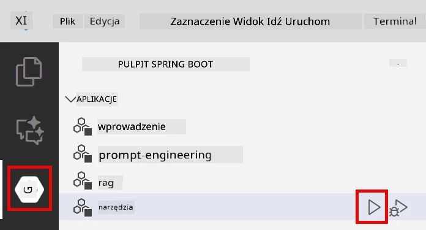
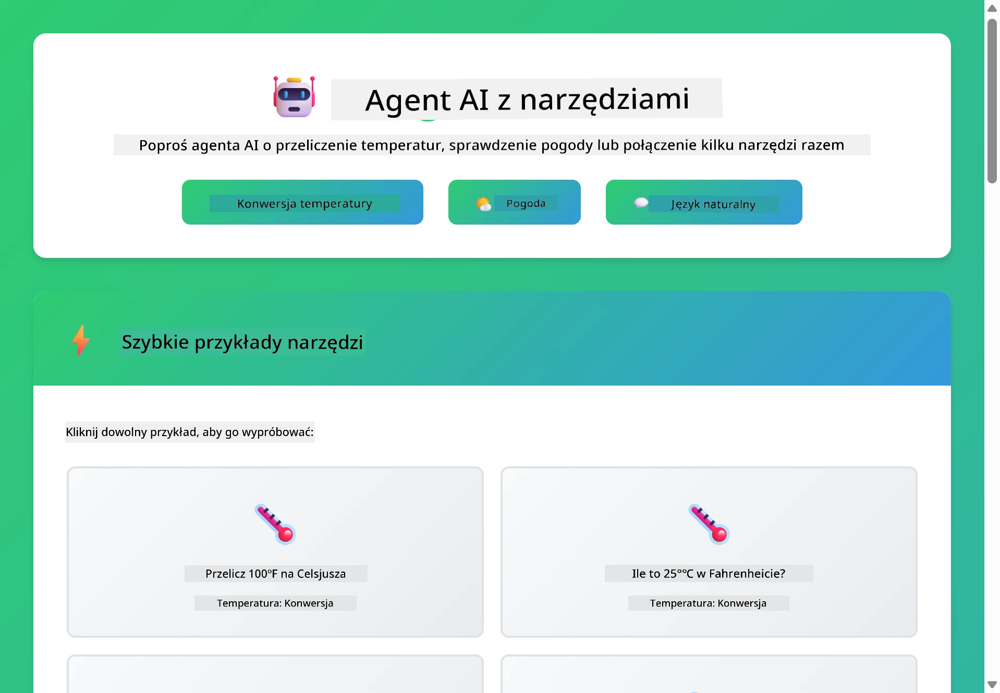
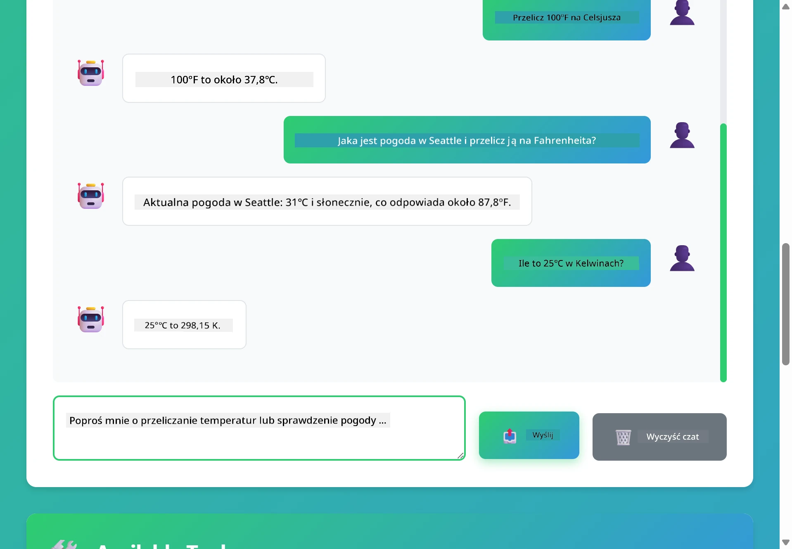

# Moduł 04: Agenci AI z Narzędziami

## Spis treści

- [Przewodnik wideo](#przewodnik-wideo)
- [Czego się nauczysz](#czego-się-nauczysz)
- [Wymagania wstępne](#wymagania-wstępne)
- [Zrozumienie agentów AI z narzędziami](#zrozumienie-agentów-ai-z-narzędziami)
- [Jak działa wywoływanie narzędzi](#jak-działa-wywoływanie-narzędzi)
  - [Definicje narzędzi](#definicje-narzędzi)
  - [Proces decyzyjny](#proces-decyzyjny)
  - [Wykonanie](#wykonanie)
  - [Generowanie odpowiedzi](#generowanie-odpowiedzi)
  - [Architektura: automatyczne wiązanie Spring Boot](#architektura-automatyczne-wiązanie-spring-boot)
- [Łączenie narzędzi](#łączenie-narzędzi)
- [Uruchomienie aplikacji](#uruchomienie-aplikacji)
- [Korzystanie z aplikacji](#korzystanie-z-aplikacji)
  - [Wypróbuj proste użycie narzędzia](#wypróbuj-proste-użycie-narzędzi)
  - [Przetestuj łączenie narzędzi](#przetestuj-łączenie-narzędzi)
  - [Zobacz przebieg rozmowy](#zobacz-przebieg-rozmowy)
  - [Eksperymentuj z różnymi zapytaniami](#eksperymentuj-z-różnymi-zapytaniami)
- [Kluczowe koncepcje](#kluczowe-pojęcia)
  - [Wzorzec ReAct (Rozumowanie i działanie)](#wzorzec-react-rozumowanie-i-działanie)
  - [Znaczenie opisów narzędzi](#opisy-narzędzi-mają-znaczenie)
  - [Zarządzanie sesją](#zarządzanie-sesją)
  - [Obsługa błędów](#obsługa-błędów)
- [Dostępne narzędzia](#dostępne-narzędzia)
- [Kiedy używać agentów bazujących na narzędziach](#kiedy-używać-agentów-opartych-na-narzędziach)
- [Narzędzia a RAG](#narzędzia-a-rag)
- [Kolejne kroki](#kolejne-kroki)

## Przewodnik wideo

Obejrzyj tę sesję na żywo, która wyjaśnia, jak rozpocząć pracę z tym modułem:

<a href="https://www.youtube.com/watch?v=O_J30kZc0rw"></a>

## Czego się nauczysz

Do tej pory nauczyłeś się prowadzić rozmowy z AI, skutecznie strukturyzować prompt-y i opierać odpowiedzi na Twoich dokumentach. Ale nadal istnieje podstawowe ograniczenie: modele językowe mogą generować tylko tekst. Nie mogą sprawdzić pogody, wykonać obliczeń, zapytać baz danych ani komunikować się z zewnętrznymi systemami.

Narzędzia to zmieniają. Dając modelowi dostęp do funkcji, które może wywołać, przekształcasz go z generatora tekstu w agenta zdolnego do podejmowania działań. Model decyduje, kiedy potrzebuje narzędzia, którego narzędzia użyć i jakie parametry przekazać. Twój kod wykonuje funkcję i zwraca wynik. Model włącza ten wynik do swojej odpowiedzi.

## Wymagania wstępne

- Ukończenie [Modułu 01 - Wprowadzenie](../01-introduction/README.md) (dostępne zasoby Azure OpenAI)
- Zalecane ukończenie poprzednich modułów (moduł ten odwołuje się do [koncepcji RAG z Modułu 03](../03-rag/README.md) w porównaniu Narzędzia vs RAG)
- Plik `.env` w katalogu głównym z danymi uwierzytelniającymi Azure (utworzony przez `azd up` w Moduł 01)

> **Uwaga:** Jeśli nie ukończyłeś Modułu 01, najpierw wykonaj tam instrukcje dotyczące wdrożenia.

## Zrozumienie agentów AI z narzędziami

> **📝 Uwaga:** Termin „agenci” w tym module odnosi się do asystentów AI rozszerzonych o możliwość wywoływania narzędzi. Różni się to od wzorców **Agentic AI** (autonomicznych agentów z planowaniem, pamięcią i wieloetapowym rozumowaniem), które omówimy w [Moduł 05: MCP](../05-mcp/README.md).

Bez narzędzi model językowy może tylko generować tekst na podstawie danych treningowych. Zapytaj go o aktualną pogodę, a będzie musiał zgadywać. Daj mu narzędzia, a może wywołać API pogodowe, wykonać obliczenia lub zapytać bazę danych — a następnie wpleść te rzeczywiste wyniki w odpowiedź.


*Bez narzędzi model tylko zgaduje — z narzędziami może wywoływać API, wykonywać obliczenia i zwracać dane w czasie rzeczywistym.*

Agent AI z narzędziami stosuje wzorzec **Rozumowanie i działanie (ReAct)**. Model nie tylko odpowiada — myśli o tym, czego potrzebuje, działa, wywołując narzędzie, obserwuje wynik, a następnie decyduje, czy działać dalej, czy dostarczyć ostateczną odpowiedź:

1. **Rozumowanie** — Agent analizuje pytanie użytkownika i ustala, jakich informacji potrzebuje
2. **Działanie** — Agent wybiera odpowiednie narzędzie, generuje właściwe parametry i je wywołuje
3. **Obserwacja** — Agent otrzymuje wynik narzędzia i ocenia rezultat
4. **Powtarzaj lub odpowiadaj** — Jeśli potrzebne są dalsze dane, agent powtarza pętlę; w przeciwnym razie komponuje odpowiedź w naturalnym języku


*Cykl ReAct — agent myśli, co zrobić, działa, wywołując narzędzie, obserwuje wynik i powtarza, aż może dostarczyć ostateczną odpowiedź.*

Działa to automatycznie. Definiujesz narzędzia i ich opisy. Model sam podejmuje decyzje, kiedy i jak ich użyć.

## Jak działa wywoływanie narzędzi

### Definicje narzędzi

[WeatherTool.java](../../../04-tools/src/main/java/com/example/langchain4j/agents/tools/WeatherTool.java) | [TemperatureTool.java](../../../04-tools/src/main/java/com/example/langchain4j/agents/tools/TemperatureTool.java)

Definiujesz funkcje z jasnymi opisami i specyfikacją parametrów. Model widzi te opisy w promptach systemowych i rozumie, do czego służy każde narzędzie.

```java
@Component
public class WeatherTool {
    
    @Tool("Get the current weather for a location")
    public String getCurrentWeather(@P("Location name") String location) {
        // Twoja logika wyszukiwania pogody
        return "Weather in " + location + ": 22°C, cloudy";
    }
}

@AiService
public interface Assistant {
    String chat(@MemoryId String sessionId, @UserMessage String message);
}

// Asystent jest automatycznie powiązany przez Spring Boot z:
// - beana ChatModel
// - wszystkimi metodami @Tool z klas oznaczonych @Component
// - ChatMemoryProvider do zarządzania sesją
```

Diagram poniżej rozkłada każdą adnotację i pokazuje, jak każda część pomaga AI zrozumieć, kiedy wywołać narzędzie i jakie argumenty przekazać:


*Anatomia definicji narzędzia — @Tool mówi AI, kiedy go użyć, @P opisuje każdy parametr, a @AiService wiąże wszystko razem podczas uruchamiania.*

> **🤖 Wypróbuj z [GitHub Copilot](https://github.com/features/copilot) Chat:** Otwórz [`WeatherTool.java`](../../../04-tools/src/main/java/com/example/langchain4j/agents/tools/WeatherTool.java) i zapytaj:
> - „Jak zintegrować prawdziwe API pogodowe, np. OpenWeatherMap, zamiast danych testowych?”
> - „Co sprawia, że opis narzędzia pomaga AI używać go poprawnie?”
> - „Jak obsługiwać błędy API i limity zapytań w implementacjach narzędzi?”

### Proces decyzyjny

Gdy użytkownik zapyta „Jaka jest pogoda w Seattle?”, model nie wybiera narzędzia losowo. Porównuje intencję użytkownika z opisami wszystkich dostępnych narzędzi, ocenia ich trafność i wybiera najlepsze dopasowanie. Następnie generuje ustrukturyzowane wywołanie funkcji z odpowiednimi parametrami — w tym przypadku ustawia `location` na `"Seattle"`.

Jeśli żadne narzędzie nie pasuje do zapytania użytkownika, model odpowiada z własnej wiedzy. Jeśli pasuje więcej narzędzi, wybiera najdokładniejsze.


*Model ocenia każde dostępne narzędzie względem intencji użytkownika i wybiera najlepsze dopasowanie — dlatego ważne jest pisanie jasnych, konkretnych opisów narzędzi.*

### Wykonanie

[AgentService.java](../../../04-tools/src/main/java/com/example/langchain4j/agents/service/AgentService.java)

Spring Boot automatycznie wstrzykuje interfejs deklaratywny `@AiService` ze wszystkimi zarejestrowanymi narzędziami, a LangChain4j wykonuje wywołania narzędzi automatycznie. W tle wywołanie narzędzia przebiega przez sześć etapów — od pytania naturalnego języka użytkownika do odpowiedzi w naturalnym języku:


*Przepływ end-to-end — użytkownik zadaje pytanie, model wybiera narzędzie, LangChain4j je wykonuje, a model wplata wynik w naturalną odpowiedź.*

W tle `AiServices` uruchamia tę samą pętlę wywołań narzędzi dla dowolnego narzędzia — tutaj pokazane na przykładzie prostego `Calculator`. Diagram sekwencji poniżej pokazuje dokładnie, co dzieje się pod maską:


*Pętla wywoływania narzędzi — `AiServices` wysyła Twoją wiadomość i schematy narzędzi do LLM, LLM odpowiada wywołaniem funkcji jak `add(42, 58)`, LangChain4j wykonuje lokalnie metodę `Calculator`, a wynik przekazuje z powrotem dla finalnej odpowiedzi.*

> **🤖 Wypróbuj z [GitHub Copilot](https://github.com/features/copilot) Chat:** Otwórz [`AgentService.java`](../../../04-tools/src/main/java/com/example/langchain4j/agents/service/AgentService.java) i zapytaj:
> - „Jak działa wzorzec ReAct i dlaczego jest skuteczny dla agentów AI?”
> - „Jak agent decyduje, którego narzędzia użyć i w jakiej kolejności?”
> - „Co się stanie, jeśli wykonanie narzędzia się nie powiedzie — jak solidnie obsługiwać błędy?”

### Generowanie odpowiedzi

Model otrzymuje dane pogodowe i formatuje je na odpowiedź w naturalnym języku dla użytkownika.

### Architektura: automatyczne wiązanie Spring Boot

Ten moduł wykorzystuje integrację LangChain4j ze Spring Boot z deklaratywnymi interfejsami `@AiService`. Przy uruchamianiu Spring Boot wykrywa każdy `@Component` zawierający metody `@Tool`, Twój bean `ChatModel` oraz `ChatMemoryProvider` — po czym łączy je wszystkie w pojedynczy interfejs `Assistant` bez zbędnego kodu.


*Interfejs @AiService spina razem ChatModel, komponenty narzędzi i dostawcę pamięci — Spring Boot sam obsługuje wiązanie.*

Oto pełny cykl życia zapytania jako diagram sekwencji — od zapytania HTTP, przez kontroler, serwis i auto-wiązany proxy, aż do wykonania narzędzia i powrotu:


*Pełny cykl życia zapytania Spring Boot — żądanie HTTP przechodzi przez kontroler i serwis do auto-wiązanego proxy Assistant, które automatycznie orkiestruje LLM i wywołania narzędzi.*

Kluczowe zalety tego podejścia:

- **Automatyczne wiązanie Spring Boot** — ChatModel i narzędzia wstrzykiwane automatycznie
- **Wzorzec @MemoryId** — Automatyczne zarządzanie pamięcią oparte na sesji
- **Jedna instancja** — Assistant tworzony raz i używany ponownie dla lepszej wydajności
- **Bezpieczne typowanie** — Metody Javy wywoływane bezpośrednio z konwersją typów
- **Wieloetapowa orkiestracja** — Automatyczna obsługa łączenia narzędzi
- **Zero boilerplate** — Brak ręcznych wywołań `AiServices.builder()` lub pamięci HashMap

Alternatywne podejścia (ręczne `AiServices.builder()`) wymagają więcej kodu i nie oferują korzyści integracji ze Spring Boot.

## Łączenie narzędzi

**Łączenie narzędzi** — Prawdziwa moc agentów bazujących na narzędziach ujawnia się, gdy jedno pytanie wymaga użycia wielu narzędzi. Zapytaj „Jaka jest pogoda w Seattle w Fahrenheit?” a agent automatycznie łączy dwa narzędzia: najpierw wywołuje `getCurrentWeather` by pozyskać temperaturę w Celsiuszach, potem przekazuje tę wartość do `celsiusToFahrenheit` w celu przeliczenia — wszystko w jednym obrocie konwersacji.


*Łączenie narzędzi w działaniu — agent najpierw wywołuje getCurrentWeather, następnie przesyła wynik w Celsiuszach do celsiusToFahrenheit i dostarcza skonsolidowaną odpowiedź.*

**Łagodne awarie** — Zapytaj o pogodę w mieście, którego nie ma w danych testowych. Narzędzie zwraca komunikat o błędzie, a AI tłumaczy, że nie może pomóc, zamiast się zawiesić. Narzędzia zawodzą bezpiecznie. Diagram poniżej kontrastuje oba podejścia — przy poprawnej obsłudze błędów agent łapie wyjątek i odpowiada pomocnie, a bez niej cała aplikacja ulega awarii:


*Gdy narzędzie zawodzi, agent łapie błąd i odpowiada wyjaśnieniem zamiast awarii.*

Dzieje się to w jednym obrocie rozmowy. Agent samodzielnie orkiestruje wiele wywołań narzędzi.

## Uruchomienie aplikacji

**Sprawdź wdrożenie:**

Upewnij się, że plik `.env` istnieje w katalogu głównym z danymi uwierzytelniającymi Azure (utworzony podczas Modułu 01). Uruchom to z katalogu modułu (`04-tools/`):

**Bash:**
```bash
cat ../.env  # Powinno pokazywać AZURE_OPENAI_ENDPOINT, API_KEY, DEPLOYMENT
```

**PowerShell:**
```powershell
Get-Content ..\.env  # Powinno pokazywać AZURE_OPENAI_ENDPOINT, API_KEY, DEPLOYMENT
```

**Uruchom aplikację:**

> **Uwaga:** Jeśli już uruchomiłeś wszystkie aplikacje przy pomocy `./start-all.sh` z katalogu głównego (zgodnie z Modułem 01), ten moduł działa już na porcie 8084. Możesz pominąć poniższe komendy i przejść bezpośrednio do http://localhost:8084.

**Opcja 1: Użycie Spring Boot Dashboard (zalecane dla użytkowników VS Code)**

Kontener developerski zawiera rozszerzenie Spring Boot Dashboard, które daje interfejs wizualny do zarządzania wszystkimi aplikacjami Spring Boot. Znajdziesz je na pasku aktywności po lewej stronie VS Code (ikonka Spring Boot).

Z poziomu Spring Boot Dashboard możesz:
- Zobaczyć wszystkie dostępne aplikacje Spring Boot w workspace
- Uruchamiać/zatrzymywać aplikacje jednym kliknięciem
- Przeglądać logi aplikacji w czasie rzeczywistym
- Monitorować status aplikacji

Kliknij przycisk uruchomienia obok „tools”, aby wystartować ten moduł, lub rozpocznij wszystkie moduły na raz.

Tak wygląda Spring Boot Dashboard w VS Code:


*Panel Spring Boot w VS Code — uruchamiaj, zatrzymuj i monitoruj wszystkie moduły w jednym miejscu*

**Opcja 2: Użycie skryptów powłoki**

Uruchom wszystkie aplikacje internetowe (moduły 01-04):

**Bash:**
```bash
cd ..  # Z katalogu głównego
./start-all.sh
```

**PowerShell:**
```powershell
cd ..  # Z katalogu głównego
.\start-all.ps1
```

Lub uruchom tylko ten moduł:

**Bash:**
```bash
cd 04-tools
./start.sh
```

**PowerShell:**
```powershell
cd 04-tools
.\start.ps1
```

Oba skrypty automatycznie ładują zmienne środowiskowe z głównego pliku `.env` i zbudują pliki JAR, jeśli jeszcze nie istnieją.

> **Uwaga:** Jeśli wolisz ręcznie zbudować wszystkie moduły przed uruchomieniem:
>
> **Bash:**
> ```bash
> cd ..  # Go to root directory
> mvn clean package -DskipTests
> ```
>
> **PowerShell:**
> ```powershell
> cd ..  # Go to root directory
> mvn clean package -DskipTests
> ```

Otwórz http://localhost:8084 w swojej przeglądarce.

**Aby zatrzymać:**

**Bash:**
```bash
./stop.sh  # Tylko ten moduł
# Lub
cd .. && ./stop-all.sh  # Wszystkie moduły
```

**PowerShell:**
```powershell
.\stop.ps1  # Tylko ten moduł
# Lub
cd ..; .\stop-all.ps1  # Wszystkie moduły
```

## Korzystanie z aplikacji

Aplikacja udostępnia interfejs webowy, w którym możesz wchodzić w interakcje z agentem AI mającym dostęp do narzędzi pogodowych i do konwersji temperatur. Tak wygląda interfejs — zawiera przykłady szybkiego startu i panel czatu do wysyłania zapytań:

<a href="images/tools-homepage.png"></a>

*Interfejs narzędzi Agenta AI - szybkie przykłady i interfejs czatu do interakcji z narzędziami*

### Wypróbuj proste użycie narzędzi

Zacznij od prostego zapytania: „Przelicz 100 stopni Fahrenheita na Celsjusza”. Agent rozpoznaje, że potrzebne jest narzędzie do konwersji temperatur, wywołuje je z odpowiednimi parametrami i zwraca wynik. Zauważ, jak naturalnie to działa — nie określałeś, którego narzędzia użyć ani jak je wywołać.

### Przetestuj łączenie narzędzi

Teraz spróbuj czegoś bardziej złożonego: „Jaka jest pogoda w Seattle i przelicz ją na Fahrenheita?” Obserwuj, jak agent wykonuje to krok po kroku. Najpierw pobiera pogodę (wynik w stopniach Celsjusza), rozpoznaje potrzebę konwersji na Fahrenheita, wywołuje narzędzie do konwersji i łączy oba wyniki w jedną odpowiedź.

### Zobacz przebieg rozmowy

Interfejs czatu zachowuje historię rozmowy, co pozwala na wielokrotne interakcje. Możesz zobaczyć wszystkie poprzednie zapytania i odpowiedzi, co ułatwia śledzenie konwersacji i zrozumienie, jak agent buduje kontekst przez kolejne wymiany.

<a href="images/tools-conversation-demo.png"></a>

*Wielokrotna rozmowa pokazująca proste konwersje, wyszukiwania pogodowe i łączenie narzędzi*

### Eksperymentuj z różnymi zapytaniami

Spróbuj różnych kombinacji:
- Wyszukiwanie pogody: „Jaka jest pogoda w Tokio?”
- Konwersje temperatur: „Ile to jest 25°C w kelwinach?”
- Zapytania łączone: „Sprawdź pogodę w Paryżu i powiedz, czy jest powyżej 20°C”

Zwróć uwagę, jak agent interpretuje język naturalny i mapuje go na odpowiednie wywołania narzędzi.

## Kluczowe pojęcia

### Wzorzec ReAct (Rozumowanie i Działanie)

Agent przełącza się pomiędzy rozumowaniem (decyzja, co zrobić) a działaniem (używanie narzędzi). Ten wzorzec pozwala na autonomiczne rozwiązywanie problemów, a nie tylko reagowanie na polecenia.

### Opisy narzędzi mają znaczenie

Jakość opisów narzędzi bezpośrednio wpływa na to, jak dobrze agent je wykorzystuje. Jasne i konkretne opisy pomagają modelowi zrozumieć, kiedy i jak wywołać każde narzędzie.

### Zarządzanie sesją

Adnotacja `@MemoryId` umożliwia automatyczne zarządzanie pamięcią na podstawie sesji. Każdemu ID sesji przypisywana jest własna instancja `ChatMemory`, zarządzana przez bean `ChatMemoryProvider`, dzięki czemu wielu użytkowników może równocześnie korzystać z agenta bez mieszania rozmów. Poniższy diagram pokazuje, jak wielu użytkowników jest kierowanych do odizolowanych magazynów pamięci na bazie ich ID sesji:


*Każde ID sesji mapuje się na oddzielną historię rozmowy — użytkownicy nigdy nie widzą wiadomości innych.*

### Obsługa błędów

Narzędzia mogą zawodzić — API mogą mieć timeouty, parametry mogą być nieprawidłowe, zewnętrzne usługi mogą przestać działać. Agent produkcyjny potrzebuje obsługi błędów, żeby model mógł wyjaśnić problemy lub spróbować alternatyw, zamiast wywoływać awarię całej aplikacji. Kiedy narzędzie zgłasza wyjątek, LangChain4j go przechwytuje i przekazuje wiadomość o błędzie do modelu, który może następnie wyjaśnić problem w naturalnym języku.

## Dostępne narzędzia

Poniższy diagram przedstawia szeroki ekosystem narzędzi, które możesz tworzyć. Ten moduł demonstruje narzędzia pogodowe i do konwersji temperatur, ale ten sam wzorzec `@Tool` działa dla każdej metody Java — od zapytań do baz danych po przetwarzanie płatności.


*Każda metoda Java opatrzona adnotacją @Tool staje się dostępna dla AI — wzorzec rozciąga się na bazy danych, API, e-maile, operacje na plikach i więcej.*

## Kiedy używać agentów opartych na narzędziach

Nie każde zapytanie wymaga narzędzi. Decyzja zależy od tego, czy AI musi wchodzić w interakcję z zewnętrznymi systemami, czy może odpowiedzieć na podstawie własnej wiedzy. Poniższy przewodnik podsumowuje, kiedy narzędzia są wartościowe, a kiedy zbędne:


*Szybki przewodnik decyzyjny — narzędzia są do danych w czasie rzeczywistym, obliczeń i akcji; ogólna wiedza i zadania kreatywne ich nie potrzebują.*

## Narzędzia a RAG

Moduły 03 i 04 rozszerzają możliwości AI, ale w fundamentalnie różny sposób. RAG daje modelowi dostęp do **wiedzy** przez pobieranie dokumentów. Narzędzia dają modelowi możliwość wykonywania **akcji** przez wywoływanie funkcji. Poniższy diagram porównuje oba podejścia obok siebie — od sposobu działania każdego do kompromisów między nimi:


*RAG pobiera informacje z dokumentów statycznych — Narzędzia wykonują akcje i pobierają dane dynamiczne, w czasie rzeczywistym. Wiele systemów produkcyjnych łączy oba podejścia.*

W praktyce wiele systemów produkcyjnych łączy oba podejścia: RAG do zakorzeniania odpowiedzi w dokumentacji oraz Narzędzia do pobierania danych na żywo lub wykonywania operacji.

## Kolejne kroki

**Następny moduł:** [05-mcp - Model Context Protocol (MCP)](../05-mcp/README.md)

---

**Nawigacja:** [← Poprzedni: Moduł 03 - RAG](../03-rag/README.md) | [Powrót do głównego](../README.md) | [Następny: Moduł 05 - MCP →](../05-mcp/README.md)

---

<!-- CO-OP TRANSLATOR DISCLAIMER START -->
**Zastrzeżenie**:
Niniejszy dokument został przetłumaczony za pomocą usługi tłumaczenia AI [Co-op Translator](https://github.com/Azure/co-op-translator). Choć dążymy do dokładności, prosimy pamiętać, że automatyczne tłumaczenia mogą zawierać błędy lub niedokładności. Oryginalny dokument w jego języku źródłowym należy uznawać za autorytatywne źródło. W przypadku informacji krytycznych zalecane jest skorzystanie z profesjonalnego tłumaczenia wykonanego przez człowieka. Nie ponosimy odpowiedzialności za jakiekolwiek nieporozumienia lub błędne interpretacje wynikające z użycia tego tłumaczenia.
<!-- CO-OP TRANSLATOR DISCLAIMER END -->