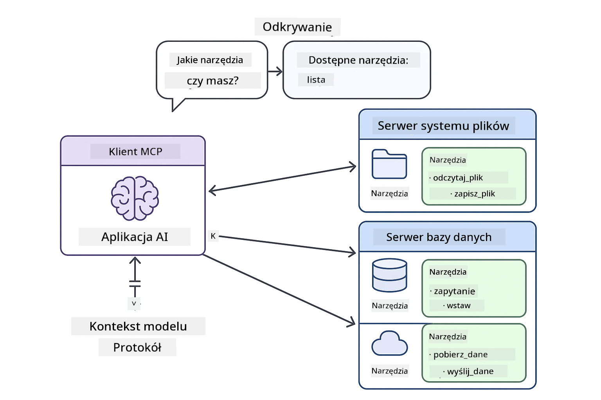
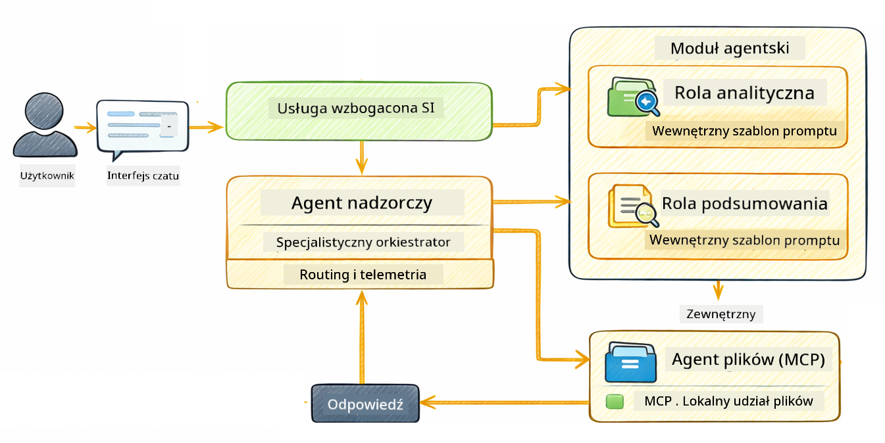

<!--
CO_OP_TRANSLATOR_METADATA:
{
  "original_hash": "f89f4c106d110e4943c055dd1a2f1dff",
  "translation_date": "2025-12-31T00:18:28+00:00",
  "source_file": "05-mcp/README.md",
  "language_code": "pl"
}
-->
# Moduł 05: Model Context Protocol (MCP)

## Spis treści

- [Czego się nauczysz](../../../05-mcp)
- [Czym jest MCP?](../../../05-mcp)
- [Jak działa MCP](../../../05-mcp)
- [Moduł agentowy](../../../05-mcp)
- [Uruchamianie przykładów](../../../05-mcp)
  - [Wymagania wstępne](../../../05-mcp)
- [Szybkie rozpoczęcie](../../../05-mcp)
  - [Operacje na plikach (Stdio)](../../../05-mcp)
  - [Agent supervisor](../../../05-mcp)
    - [Zrozumienie wyników](../../../05-mcp)
    - [Wyjaśnienie funkcji modułu agentowego](../../../05-mcp)
- [Kluczowe pojęcia](../../../05-mcp)
- [Gratulacje!](../../../05-mcp)
  - [Co dalej?](../../../05-mcp)

## Czego się nauczysz

Zbudowałeś konwersacyjne AI, opanowałeś tworzenie promptów, osadziłeś odpowiedzi w dokumentach i stworzyłeś agentów z narzędziami. Ale wszystkie te narzędzia były niestandardowo zbudowane dla twojej konkretnej aplikacji. A co gdybyś mógł dać swojemu AI dostęp do ustandaryzowanego ekosystemu narzędzi, które każdy może tworzyć i udostępniać? W tym module nauczysz się, jak to zrobić za pomocą Model Context Protocol (MCP) i modułu agentowego LangChain4j. Najpierw pokażemy prosty czytnik plików MCP, a potem jak łatwo integruje się on z zaawansowanymi przepływami agentowymi przy użyciu wzorca Supervisor Agent.

## Czym jest MCP?

Model Context Protocol (MCP) zapewnia dokładnie to — standardowy sposób, aby aplikacje AI odkrywały i używały zewnętrzne narzędzia. Zamiast pisać niestandardowe integracje dla każdego źródła danych czy usługi, łączysz się z serwerami MCP, które wystawiają swoje możliwości w spójnym formacie. Twój agent AI może wtedy automatycznie odkrywać i używać tych narzędzi.


*Przed MCP: złożone integracje punkt‑do‑punktu. Po MCP: jeden protokół, nieograniczone możliwości.*

MCP rozwiązuje podstawowy problem w rozwoju AI: każda integracja jest niestandardowa. Chcesz uzyskać dostęp do GitHub? Niestandardowy kod. Chcesz czytać pliki? Niestandardowy kod. Chcesz zapytać bazę danych? Niestandardowy kod. I żadna z tych integracji nie działa automatycznie z innymi aplikacjami AI.

MCP to ustandaryzowuje. Serwer MCP udostępnia narzędzia z jasnymi opisami i schematami parametrów. Każdy klient MCP może się połączyć, odkryć dostępne narzędzia i z nich korzystać. Zbuduj raz, używaj wszędzie.



*Architektura Model Context Protocol — ustandaryzowane odkrywanie i wykonywanie narzędzi*

## Jak działa MCP

**Architektura klient‑serwer**

MCP używa modelu klient‑serwer. Serwery udostępniają narzędzia — czytanie plików, zapytania do baz danych, wywołania API. Klienci (twoja aplikacja AI) łączą się z serwerami i korzystają z ich narzędzi.

Aby użyć MCP z LangChain4j, dodaj tę zależność Maven:

```xml
<dependency>
    <groupId>dev.langchain4j</groupId>
    <artifactId>langchain4j-mcp</artifactId>
    <version>${langchain4j.version}</version>
</dependency>
```

**Odkrywanie narzędzi**

Gdy twój klient łączy się z serwerem MCP, pyta „Jakie macie narzędzia?”. Serwer odpowiada listą dostępnych narzędzi, każde z opisem i schematem parametrów. Twój agent AI może następnie zdecydować, których narzędzi użyć na podstawie żądań użytkownika.

**Mechanizmy transportu**

MCP obsługuje różne mechanizmy transportu. Ten moduł demonstruje transport Stdio dla procesów lokalnych:


*Mechanizmy transportu MCP: HTTP dla zdalnych serwerów, Stdio dla procesów lokalnych*

**Stdio** - [StdioTransportDemo.java](../../../05-mcp/src/main/java/com/example/langchain4j/mcp/StdioTransportDemo.java)

Dla procesów lokalnych. Twoja aplikacja uruchamia serwer jako proces podrzędny i komunikuje się przez standardowe wejście/wyjście. Przydatne do dostępu do systemu plików lub narzędzi wiersza poleceń.

```java
McpTransport stdioTransport = new StdioMcpTransport.Builder()
    .command(List.of(
        npmCmd, "exec",
        "@modelcontextprotocol/server-filesystem@2025.12.18",
        resourcesDir
    ))
    .logEvents(false)
    .build();
```

> **🤖 Wypróbuj z [GitHub Copilot](https://github.com/features/copilot) Chat:** Otwórz [`StdioTransportDemo.java`](../../../05-mcp/src/main/java/com/example/langchain4j/mcp/StdioTransportDemo.java) i zapytaj:
> - "Jak działa transport Stdio i kiedy powinienem go użyć zamiast HTTP?"
> - "Jak LangChain4j zarządza cyklem życia uruchamianych procesów serwera MCP?"
> - "Jakie są implikacje bezpieczeństwa przy dawaniu AI dostępu do systemu plików?"

## Moduł agentowy

Podczas gdy MCP udostępnia ustandaryzowane narzędzia, moduł **agentic** LangChain4j zapewnia deklaratywny sposób budowy agentów, którzy orkiestrują te narzędzia. Adnotacja `@Agent` i `AgenticServices` pozwalają definiować zachowanie agenta przez interfejsy zamiast kodu imperatywnego.

W tym module poznasz wzorzec **Supervisor Agent** — zaawansowane podejście agentowe, w którym „supervisor” dynamicznie decyduje, których podagentów wywołać w oparciu o żądanie użytkownika. Połączymy oba pojęcia, dając jednemu z naszych podagentów możliwości dostępu do plików za pomocą MCP.

Aby użyć modułu agentowego, dodaj tę zależność Maven:

```xml
<dependency>
    <groupId>dev.langchain4j</groupId>
    <artifactId>langchain4j-agentic</artifactId>
    <version>${langchain4j.mcp.version}</version>
</dependency>
```

> **⚠️ Eksperymentalne:** moduł `langchain4j-agentic` jest **eksperymentalny** i może ulec zmianie. Stabilnym sposobem budowy asystentów AI pozostaje `langchain4j-core` z niestandardowymi narzędziami (Moduł 04).

## Uruchamianie przykładów

### Wymagania wstępne

- Java 21+, Maven 3.9+
- Node.js 16+ i npm (dla serwerów MCP)
- Zmienne środowiskowe skonfigurowane w pliku `.env` (z katalogu głównego):
  - **For StdioTransportDemo:** `GITHUB_TOKEN` (GitHub Personal Access Token)
  - **For SupervisorAgentDemo:** `AZURE_OPENAI_ENDPOINT`, `AZURE_OPENAI_API_KEY`, `AZURE_OPENAI_DEPLOYMENT` (jak w Modułach 01-04)

> **Uwaga:** Jeśli nie skonfigurowałeś jeszcze swoich zmiennych środowiskowych, zobacz [Module 00 - Quick Start](../00-quick-start/README.md) po instrukcje, lub skopiuj `.env.example` do `.env` w katalogu głównym i uzupełnij wartości.

## Szybkie rozpoczęcie

**Używając VS Code:** Po prostu kliknij prawym przyciskiem myszy dowolny plik demo w Eksploratorze i wybierz **"Run Java"**, lub użyj konfiguracji uruchamiania z panelu Run and Debug (upewnij się, że dodałeś token do pliku `.env` najpierw).

**Używając Mavena:** Alternatywnie możesz uruchomić z linii poleceń przy użyciu przykładów poniżej.

### Operacje na plikach (Stdio)

To pokazuje narzędzia oparte na subprocessach lokalnych.

**✅ Brak wymagań wstępnych** - serwer MCP jest uruchamiany automatycznie.

**Używając VS Code:** Kliknij prawym przyciskiem na `StdioTransportDemo.java` i wybierz **"Run Java"**.

**Używając Mavena:**

**Bash:**
```bash
export GITHUB_TOKEN=your_token_here
cd 05-mcp
mvn compile exec:java -Dexec.mainClass=com.example.langchain4j.mcp.StdioTransportDemo
```

**PowerShell:**
```powershell
$env:GITHUB_TOKEN=your_token_here
cd 05-mcp
mvn --% compile exec:java -Dexec.mainClass=com.example.langchain4j.mcp.StdioTransportDemo
```

Aplikacja uruchamia automatycznie serwer MCP systemu plików i odczytuje lokalny plik. Zauważ, jak zarządzanie procesami podrzędnymi jest obsługiwane za ciebie.

**Oczekiwany wynik:**
```
Assistant response: The file provides an overview of LangChain4j, an open-source Java library
for integrating Large Language Models (LLMs) into Java applications...
```

### Agent supervisor




Wzorzec **Supervisor Agent** to **elastyczna** forma agentowego AI. W przeciwieństwie do deterministycznych przepływów (sekwencyjnych, pętli, równoległych), Supervisor używa modelu LLM, aby autonomicznie zdecydować, których agentów wywołać w oparciu o żądanie użytkownika.

**Łączenie Supervisora z MCP:** W tym przykładzie dajemy `FileAgent` dostęp do narzędzi systemu plików MCP za pomocą `toolProvider(mcpToolProvider)`. Gdy użytkownik poprosi o „odczyt i analizę pliku”, Supervisor analizuje żądanie i generuje plan wykonania. Następnie kieruje żądanie do `FileAgent`, który używa narzędzia MCP `read_file` do pobrania zawartości. Supervisor przekazuje tę zawartość do `AnalysisAgent` w celu interpretacji, a opcjonalnie wywołuje `SummaryAgent`, aby skrócić wyniki.

To demonstruje, jak narzędzia MCP integrują się bezproblemowo z przepływami agentowymi — Supervisor nie musi wiedzieć, *jak* pliki są czytane, tylko że `FileAgent` potrafi to wykonać. Supervisor dynamicznie dostosowuje się do różnych rodzajów żądań i zwraca albo odpowiedź ostatniego agenta, albo podsumowanie wszystkich operacji.

**Używanie skryptów startowych (zalecane):**

Skrypty startowe automatycznie ładują zmienne środowiskowe z pliku `.env` w katalogu głównym:

**Bash:**
```bash
cd 05-mcp
chmod +x start.sh
./start.sh
```

**PowerShell:**
```powershell
cd 05-mcp
.\start.ps1
```

**Używając VS Code:** Kliknij prawym przyciskiem na `SupervisorAgentDemo.java` i wybierz **"Run Java"** (upewnij się, że plik `.env` jest skonfigurowany).

**Jak działa Supervisor:**

```java
// Zdefiniuj wiele agentów o określonych możliwościach
FileAgent fileAgent = AgenticServices.agentBuilder(FileAgent.class)
        .chatModel(model)
        .toolProvider(mcpToolProvider)  // Ma narzędzia MCP do operacji na plikach
        .build();

AnalysisAgent analysisAgent = AgenticServices.agentBuilder(AnalysisAgent.class)
        .chatModel(model)
        .build();

SummaryAgent summaryAgent = AgenticServices.agentBuilder(SummaryAgent.class)
        .chatModel(model)
        .build();

// Utwórz nadzorcę, który koordynuje tych agentów
SupervisorAgent supervisor = AgenticServices.supervisorBuilder()
        .chatModel(model)  // Model "planner"
        .subAgents(fileAgent, analysisAgent, summaryAgent)
        .responseStrategy(SupervisorResponseStrategy.SUMMARY)
        .build();

// Nadzorca autonomicznie decyduje, których agentów wywołać
// Po prostu przekaż żądanie w języku naturalnym - LLM zaplanuje wykonanie
String response = supervisor.invoke("Read the file at /path/file.txt and analyze it");
```

Zobacz [SupervisorAgentDemo.java](../../../05-mcp/src/main/java/com/example/langchain4j/mcp/SupervisorAgentDemo.java) po pełną implementację.

> **🤖 Wypróbuj z [GitHub Copilot](https://github.com/features/copilot) Chat:** Otwórz [`SupervisorAgentDemo.java`](../../../05-mcp/src/main/java/com/example/langchain4j/mcp/SupervisorAgentDemo.java) i zapytaj:
> - "Jak Supervisor decyduje, których agentów wywołać?"
> - "Jaka jest różnica między wzorcem Supervisor a wzorcem Sequential?"
> - "Jak mogę dostosować zachowanie planowania Supervisora?"

#### Zrozumienie wyników

Gdy uruchomisz demo, zobaczysz uporządkowany przewodnik pokazujący, jak Supervisor orkiestruje wielu agentów. Oto co oznacza każda sekcja:

```
======================================================================
  SUPERVISOR AGENT DEMO
======================================================================

This demo shows how a Supervisor Agent orchestrates multiple specialized agents.
The Supervisor uses an LLM to decide which agent to call based on the task.
```

**Nagłówek** wprowadza demo i wyjaśnia główną koncepcję: Supervisor używa LLM (a nie sztywnych reguł), aby zdecydować, których agentów wywołać.

```
--- AVAILABLE AGENTS -------------------------------------------------
  [FILE]     FileAgent     - Reads files using MCP filesystem tools
  [ANALYZE]  AnalysisAgent - Analyzes content for structure, tone, and themes
  [SUMMARY]  SummaryAgent  - Creates concise summaries of content
```

**Dostępni agenci** pokazuje trzech wyspecjalizowanych agentów, które Supervisor może wybrać. Każdy agent ma określoną zdolność:
- **FileAgent** potrafi czytać pliki używając narzędzi MCP (zewnętrzna zdolność)
- **AnalysisAgent** analizuje treść (czysto LLM)
- **SummaryAgent** tworzy streszczenia (czysto LLM)

```
--- USER REQUEST -----------------------------------------------------
  "Read the file at .../file.txt and analyze what it's about"
```

**Żądanie użytkownika** pokazuje, o co poproszono. Supervisor musi to przeanalizować i zdecydować, których agentów wywołać.

```
--- SUPERVISOR ORCHESTRATION -----------------------------------------
  The Supervisor will now decide which agents to invoke and in what order...

  +-- STEP 1: Supervisor chose -> FileAgent (reading file via MCP)
  |
  |   Input: .../file.txt
  |
  |   Result: LangChain4j is an open-source Java library designed to simplify...
  +-- [OK] FileAgent (reading file via MCP) completed

  +-- STEP 2: Supervisor chose -> AnalysisAgent (analyzing content)
  |
  |   Input: LangChain4j is an open-source Java library...
  |
  |   Result: Structure: The content is organized into clear paragraphs that int...
  +-- [OK] AnalysisAgent (analyzing content) completed
```

**Orkiestracja Supervisora** to miejsce, gdzie dzieje się magia. Zobacz jak:
1. Supervisor **wybrał najpierw FileAgent**, ponieważ żądanie wspominało „odczytaj plik”
2. FileAgent użył narzędzia MCP `read_file`, aby pobrać zawartość pliku
3. Następnie Supervisor **wybrał AnalysisAgent** i przekazał mu zawartość pliku
4. AnalysisAgent przeanalizował strukturę, ton i wątki

Zauważ, że Supervisor podjął te decyzje **autonomicznie** na podstawie żądania użytkownika — brak reguł na stałe w kodzie!

**Ostateczna odpowiedź** to zsyntetyzowana odpowiedź Supervisora, łącząca wyniki wszystkich wywołanych agentów. Przykład wypisuje zakres agentowy pokazujący podsumowania i wyniki analizy zapisane przez każdego agenta.

```
--- FINAL RESPONSE ---------------------------------------------------
I read the contents of the file and analyzed its structure, tone, and key themes.
The file introduces LangChain4j as an open-source Java library for integrating
large language models...

--- AGENTIC SCOPE (Shared Memory) ------------------------------------
  Agents store their results in a shared scope for other agents to use:
  * summary: LangChain4j is an open-source Java library...
  * analysis: Structure: The content is organized into clear paragraphs that in...
```

### Wyjaśnienie funkcji modułu agentowego

Przykład demonstruje kilka zaawansowanych funkcji modułu agentowego. Przyjrzyjmy się bliżej Agentic Scope i Agent Listeners.

**Agentic Scope** pokazuje wspólną pamięć, gdzie agenci zapisali swoje wyniki używając `@Agent(outputKey="...")`. To pozwala:
- Późniejszym agentom na dostęp do wyników wcześniejszych agentów
- Supervisorowi na syntezę końcowej odpowiedzi
- Tobie na sprawdzenie, co wygenerował każdy agent

```java
ResultWithAgenticScope<String> result = supervisor.invokeWithAgenticScope(request);
AgenticScope scope = result.agenticScope();
String story = scope.readState("story");
List<AgentInvocation> history = scope.agentInvocations("analysisAgent");
```

**Agent Listeners** umożliwiają monitorowanie i debugowanie wykonania agenta. Krok po kroku wyświetlany w demo pochodzi z AgentListener, który podłącza się do każdego wywołania agenta:
- **beforeAgentInvocation** - Wywoływane, gdy Supervisor wybiera agenta, pozwalając zobaczyć, który agent został wybrany i dlaczego
- **afterAgentInvocation** - Wywoływane, gdy agent kończy działanie, pokazując jego wynik
- **inheritedBySubagents** - Gdy true, listener monitoruje wszystkich agentów w hierarchii

```java
AgentListener monitor = new AgentListener() {
    private int step = 0;
    
    @Override
    public void beforeAgentInvocation(AgentRequest request) {
        step++;
        System.out.println("  +-- STEP " + step + ": " + request.agentName());
    }
    
    @Override
    public void afterAgentInvocation(AgentResponse response) {
        System.out.println("  +-- [OK] " + response.agentName() + " completed");
    }
    
    @Override
    public boolean inheritedBySubagents() {
        return true; // Propaguj do wszystkich podagentów
    }
};
```

Poza wzorcem Supervisora, moduł `langchain4j-agentic` oferuje kilka potężnych wzorców przepływu pracy i funkcji:

| Pattern | Description | Use Case |
|---------|-------------|----------|
| **Sequential** | Execute agents in order, output flows to next | Pipelines: research → analyze → report |
| **Parallel** | Run agents simultaneously | Independent tasks: weather + news + stocks |
| **Loop** | Iterate until condition met | Quality scoring: refine until score ≥ 0.8 |
| **Conditional** | Route based on conditions | Classify → route to specialist agent |
| **Human-in-the-Loop** | Add human checkpoints | Approval workflows, content review |

## Kluczowe pojęcia

**MCP** jest idealny, gdy chcesz wykorzystać istniejące ekosystemy narzędzi, budować narzędzia, którymi mogą się dzielić różne aplikacje, integrować usługi firm trzecich ze standardowymi protokołami, lub wymieniać implementacje narzędzi bez zmiany kodu.

**Moduł agentowy** sprawdza się najlepiej, gdy chcesz deklaratywne definicje agentów z adnotacjami `@Agent`, potrzebujesz orkiestracji przepływów pracy (sekwencyjnie, pętle, równoległe), preferujesz projektowanie agentów oparte na interfejsach zamiast kodzie imperatywnym, lub łączysz wielu agentów, którzy dzielą wyniki przez `outputKey`.

**Wzorzec Supervisor Agent** błyszczy, gdy przepływ pracy nie jest przewidywalny z góry i chcesz, aby LLM decydował, gdy masz wielu wyspecjalizowanych agentów wymagających dynamicznej orkiestracji, gdy budujesz systemy konwersacyjne kierujące do różnych możliwości, lub gdy potrzebujesz najbardziej elastycznego, adaptacyjnego zachowania agenta.

## Gratulacje!

Ukończyłeś kurs LangChain4j dla początkujących. Nauczyłeś się:

- Jak budować konwersacyjne AI z pamięcią (Moduł 01)
- Wzorów inżynierii promptów dla różnych zadań (Moduł 02)
- Osadzania odpowiedzi w dokumentach z RAG (Moduł 03)
- Tworzenia podstawowych agentów AI (asystentów) z niestandardowymi narzędziami (Moduł 04)
- Integracja standaryzowanych narzędzi z modułami LangChain4j MCP i Agentic (Moduł 05)

### Co dalej?

Po ukończeniu modułów zapoznaj się z [Przewodnikiem testowania](../docs/TESTING.md), aby zobaczyć koncepcje testowania LangChain4j w praktyce.

**Oficjalne zasoby:**
- [Dokumentacja LangChain4j](https://docs.langchain4j.dev/) - Obszerne przewodniki i dokumentacja API
- [Repozytorium LangChain4j na GitHubie](https://github.com/langchain4j/langchain4j) - Kod źródłowy i przykłady
- [Samouczki LangChain4j](https://docs.langchain4j.dev/tutorials/) - Poradniki krok po kroku dla różnych przypadków użycia

Dziękujemy za ukończenie tego kursu!

---

**Nawigacja:** [← Poprzedni: Moduł 04 - Narzędzia](../04-tools/README.md) | [Powrót do strony głównej](../README.md)

---

<!-- CO-OP TRANSLATOR DISCLAIMER START -->
Zastrzeżenie:
Ten dokument został przetłumaczony przy użyciu usługi tłumaczenia z wykorzystaniem sztucznej inteligencji [Co-op Translator](https://github.com/Azure/co-op-translator). Chociaż dokładamy starań, aby tłumaczenie było jak najdokładniejsze, prosimy pamiętać, że automatyczne tłumaczenia mogą zawierać błędy lub nieścisłości. Oryginalny dokument w języku źródłowym należy uznać za wersję wiążącą. W przypadku informacji o znaczeniu krytycznym zalecane jest skorzystanie z profesjonalnego, ludzkiego tłumaczenia. Nie ponosimy odpowiedzialności za żadne nieporozumienia ani błędne interpretacje wynikające z korzystania z tego tłumaczenia.
<!-- CO-OP TRANSLATOR DISCLAIMER END -->