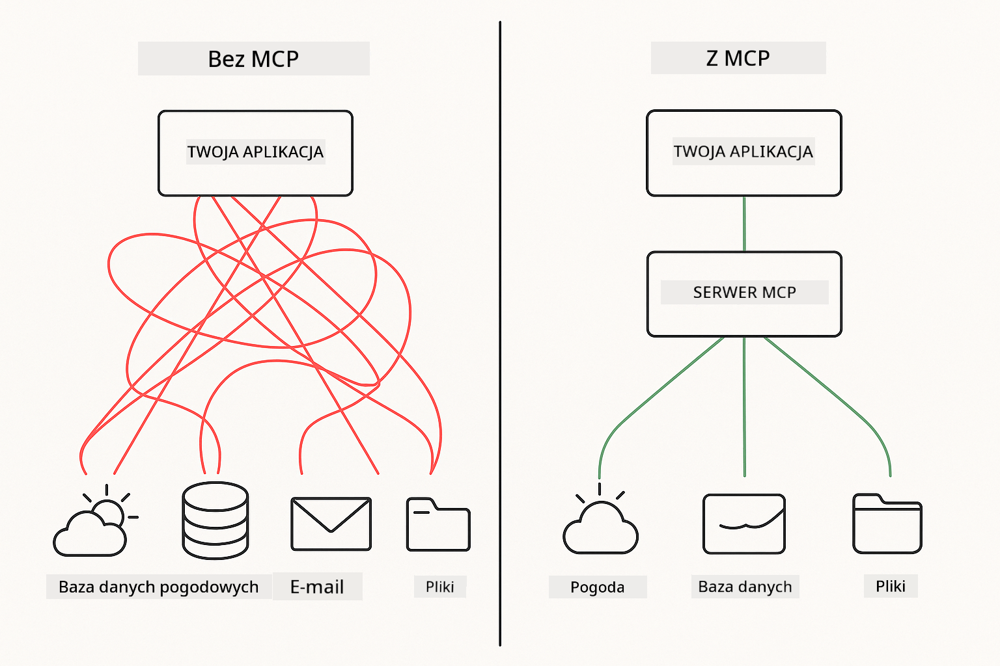

<!--
CO_OP_TRANSLATOR_METADATA:
{
  "original_hash": "c25ec1f10ef156c53e190cdf8b0711ab",
  "translation_date": "2025-12-13T17:51:19+00:00",
  "source_file": "05-mcp/README.md",
  "language_code": "pl"
}
-->
# Moduł 05: Protokół Kontekstu Modelu (MCP)

## Spis treści

- [Czego się nauczysz](../../../05-mcp)
- [Zrozumienie MCP](../../../05-mcp)
- [Jak działa MCP](../../../05-mcp)
  - [Architektura klient-serwer](../../../05-mcp)
  - [Odkrywanie narzędzi](../../../05-mcp)
  - [Mechanizmy transportu](../../../05-mcp)
- [Wymagania wstępne](../../../05-mcp)
- [Co obejmuje ten moduł](../../../05-mcp)
- [Szybki start](../../../05-mcp)
  - [Przykład 1: Zdalny kalkulator (Streamable HTTP)](../../../05-mcp)
  - [Przykład 2: Operacje na plikach (Stdio)](../../../05-mcp)
  - [Przykład 3: Analiza Git (Docker)](../../../05-mcp)
- [Kluczowe pojęcia](../../../05-mcp)
  - [Wybór transportu](../../../05-mcp)
  - [Odkrywanie narzędzi](../../../05-mcp)
  - [Zarządzanie sesją](../../../05-mcp)
  - [Uwagi dotyczące wieloplatformowości](../../../05-mcp)
- [Kiedy używać MCP](../../../05-mcp)
- [Ekosystem MCP](../../../05-mcp)
- [Gratulacje!](../../../05-mcp)
  - [Co dalej?](../../../05-mcp)
- [Rozwiązywanie problemów](../../../05-mcp)

## Czego się nauczysz

Zbudowałeś konwersacyjne AI, opanowałeś promptowanie, osadziłeś odpowiedzi w dokumentach i stworzyłeś agentów z narzędziami. Ale wszystkie te narzędzia były tworzone na zamówienie dla Twojej konkretnej aplikacji. A co jeśli mógłbyś dać swojemu AI dostęp do ustandaryzowanego ekosystemu narzędzi, które każdy może tworzyć i udostępniać?

Protokół Kontekstu Modelu (MCP) zapewnia dokładnie to – standardowy sposób, aby aplikacje AI mogły odkrywać i używać zewnętrznych narzędzi. Zamiast pisać niestandardowe integracje dla każdego źródła danych lub usługi, łączysz się z serwerami MCP, które udostępniają swoje możliwości w spójnym formacie. Twój agent AI może wtedy automatycznie odkrywać i używać tych narzędzi.



*Przed MCP: złożone integracje punkt-punkt. Po MCP: jeden protokół, nieskończone możliwości.*

## Zrozumienie MCP

MCP rozwiązuje podstawowy problem w rozwoju AI: każda integracja jest niestandardowa. Chcesz uzyskać dostęp do GitHub? Niestandardowy kod. Chcesz czytać pliki? Niestandardowy kod. Chcesz zapytać bazę danych? Niestandardowy kod. I żadna z tych integracji nie działa z innymi aplikacjami AI.

MCP to standaryzuje. Serwer MCP udostępnia narzędzia z jasnymi opisami i schematami. Każdy klient MCP może się połączyć, odkryć dostępne narzędzia i ich używać. Zbuduj raz, używaj wszędzie.


*Architektura Protokółu Kontekstu Modelu – ustandaryzowane odkrywanie i wykonywanie narzędzi*

## Jak działa MCP

**Architektura klient-serwer**

MCP używa modelu klient-serwer. Serwery dostarczają narzędzia – czytanie plików, zapytania do baz danych, wywołania API. Klienci (Twoja aplikacja AI) łączą się z serwerami i korzystają z ich narzędzi.

**Odkrywanie narzędzi**

Gdy klient łączy się z serwerem MCP, pyta „Jakie masz narzędzia?” Serwer odpowiada listą dostępnych narzędzi, każde z opisami i schematami parametrów. Twój agent AI może wtedy zdecydować, których narzędzi użyć na podstawie żądań użytkownika.

**Mechanizmy transportu**

MCP definiuje dwa mechanizmy transportu: HTTP dla serwerów zdalnych, Stdio dla procesów lokalnych (w tym kontenerów Docker):


*Mechanizmy transportu MCP: HTTP dla serwerów zdalnych, Stdio dla procesów lokalnych (w tym kontenerów Docker)*

**Streamable HTTP** - [StreamableHttpDemo.java](../../../05-mcp/src/main/java/com/example/langchain4j/mcp/StreamableHttpDemo.java)

Dla serwerów zdalnych. Twoja aplikacja wykonuje żądania HTTP do serwera działającego gdzieś w sieci. Używa Server-Sent Events do komunikacji w czasie rzeczywistym.

```java
McpTransport httpTransport = new StreamableHttpMcpTransport.Builder()
    .url("http://localhost:3001/mcp")
    .timeout(Duration.ofSeconds(60))
    .logRequests(true)
    .logResponses(true)
    .build();
```

> **🤖 Wypróbuj z [GitHub Copilot](https://github.com/features/copilot) Chat:** Otwórz [`StreamableHttpDemo.java`](../../../05-mcp/src/main/java/com/example/langchain4j/mcp/StreamableHttpDemo.java) i zapytaj:
> - "Czym MCP różni się od bezpośredniej integracji narzędzi jak w Module 04?"
> - "Jakie są korzyści z używania MCP do udostępniania narzędzi między aplikacjami?"
> - "Jak radzić sobie z awariami połączenia lub timeoutami do serwerów MCP?"

**Stdio** - [StdioTransportDemo.java](../../../05-mcp/src/main/java/com/example/langchain4j/mcp/StdioTransportDemo.java)

Dla procesów lokalnych. Twoja aplikacja uruchamia serwer jako podproces i komunikuje się przez standardowe wejście/wyjście. Przydatne do dostępu do systemu plików lub narzędzi wiersza poleceń.

```java
McpTransport stdioTransport = new StdioMcpTransport.Builder()
    .command(List.of(
        npmCmd, "exec",
        "@modelcontextprotocol/server-filesystem@0.6.2",
        resourcesDir
    ))
    .logEvents(false)
    .build();
```

> **🤖 Wypróbuj z [GitHub Copilot](https://github.com/features/copilot) Chat:** Otwórz [`StdioTransportDemo.java`](../../../05-mcp/src/main/java/com/example/langchain4j/mcp/StdioTransportDemo.java) i zapytaj:
> - "Jak działa transport Stdio i kiedy powinienem go używać zamiast HTTP?"
> - "Jak LangChain4j zarządza cyklem życia uruchamianych procesów serwerów MCP?"
> - "Jakie są implikacje bezpieczeństwa udostępniania AI dostępu do systemu plików?"

**Docker (używa Stdio)** - [GitRepositoryAnalyzer.java](../../../05-mcp/src/main/java/com/example/langchain4j/mcp/GitRepositoryAnalyzer.java)

Dla usług konteneryzowanych. Używa transportu stdio do komunikacji z kontenerem Docker przez `docker run`. Dobre dla złożonych zależności lub izolowanych środowisk.

```java
McpTransport dockerTransport = new StdioMcpTransport.Builder()
    .command(List.of(
        "docker", "run",
        "-e", "GITHUB_PERSONAL_ACCESS_TOKEN=" + System.getenv("GITHUB_TOKEN"),
        "-v", volumeMapping,
        "-i", "mcp/git"
    ))
    .logEvents(true)
    .build();
```

> **🤖 Wypróbuj z [GitHub Copilot](https://github.com/features/copilot) Chat:** Otwórz [`GitRepositoryAnalyzer.java`](../../../05-mcp/src/main/java/com/example/langchain4j/mcp/GitRepositoryAnalyzer.java) i zapytaj:
> - "Jak transport Docker izoluje serwery MCP i jakie są korzyści?"
> - "Jak skonfigurować montowanie woluminów, aby udostępniać dane między hostem a kontenerami MCP?"
> - "Jakie są najlepsze praktyki zarządzania cyklem życia serwerów MCP opartych na Dockerze w produkcji?"

## Uruchamianie przykładów

### Wymagania wstępne

- Java 21+, Maven 3.9+
- Node.js 16+ i npm (dla serwerów MCP)
- **Docker Desktop** - musi być **URUCHOMIONY** dla Przykładu 3 (nie tylko zainstalowany)
- Token dostępu osobistego GitHub skonfigurowany w pliku `.env` (z Modułu 00)

> **Uwaga:** Jeśli nie skonfigurowałeś jeszcze tokena GitHub, zobacz [Moduł 00 - Szybki start](../00-quick-start/README.md) po instrukcje.

> **⚠️ Użytkownicy Dockera:** Przed uruchomieniem Przykładu 3 sprawdź, czy Docker Desktop jest uruchomiony poleceniem `docker ps`. Jeśli pojawią się błędy połączenia, uruchom Docker Desktop i poczekaj około 30 sekund na inicjalizację.

## Szybki start

**Używając VS Code:** Po prostu kliknij prawym przyciskiem myszy dowolny plik demo w Eksploratorze i wybierz **"Run Java"**, lub użyj konfiguracji uruchamiania z panelu Run and Debug (upewnij się, że najpierw dodałeś token do pliku `.env`).

**Używając Maven:** Alternatywnie możesz uruchomić z linii poleceń za pomocą poniższych przykładów.

**⚠️ Ważne:** Niektóre przykłady mają wymagania wstępne (np. uruchomienie serwera MCP lub budowanie obrazów Docker). Sprawdź wymagania każdego przykładu przed uruchomieniem.

### Przykład 1: Zdalny kalkulator (Streamable HTTP)

Pokazuje integrację narzędzi przez sieć.

**⚠️ Wymaganie:** Najpierw musisz uruchomić serwer MCP (patrz Terminal 1 poniżej).

**Terminal 1 - Uruchom serwer MCP:**

**Bash:**
```bash
git clone https://github.com/modelcontextprotocol/servers.git
cd servers/src/everything
npm install
node dist/streamableHttp.js
```

**PowerShell:**
```powershell
git clone https://github.com/modelcontextprotocol/servers.git
cd servers/src/everything
npm install
node dist/streamableHttp.js
```

**Terminal 2 - Uruchom przykład:**

**Używając VS Code:** Kliknij prawym przyciskiem na `StreamableHttpDemo.java` i wybierz **"Run Java"**.

**Używając Maven:**

**Bash:**
```bash
export GITHUB_TOKEN=your_token_here
cd 05-mcp
mvn compile exec:java -Dexec.mainClass=com.example.langchain4j.mcp.StreamableHttpDemo
```

**PowerShell:**
```powershell
$env:GITHUB_TOKEN=your_token_here
cd 05-mcp
mvn --% compile exec:java -Dexec.mainClass=com.example.langchain4j.mcp.StreamableHttpDemo
```

Obserwuj, jak agent odkrywa dostępne narzędzia, a następnie używa kalkulatora do wykonania dodawania.

### Przykład 2: Operacje na plikach (Stdio)

Pokazuje narzędzia oparte na lokalnych podprocesach.

**✅ Brak wymagań wstępnych** – serwer MCP jest uruchamiany automatycznie.

**Używając VS Code:** Kliknij prawym przyciskiem na `StdioTransportDemo.java` i wybierz **"Run Java"**.

**Używając Maven:**

**Bash:**
```bash
export GITHUB_TOKEN=your_token_here
cd 05-mcp
mvn compile exec:java -Dexec.mainClass=com.example.langchain4j.mcp.StdioTransportDemo
```

**PowerShell:**
```powershell
$env:GITHUB_TOKEN=your_token_here
cd 05-mcp
mvn --% compile exec:java -Dexec.mainClass=com.example.langchain4j.mcp.StdioTransportDemo
```

Aplikacja automatycznie uruchamia serwer MCP do systemu plików i odczytuje lokalny plik. Zwróć uwagę, jak zarządzanie podprocesem jest obsługiwane za Ciebie.

**Oczekiwany wynik:**
```
Assistant response: The content of the file is "Kaboom!".
```

### Przykład 3: Analiza Git (Docker)

Pokazuje serwery narzędzi konteneryzowanych.

**⚠️ Wymagania:** 
1. **Docker Desktop musi być URUCHOMIONY** (nie tylko zainstalowany)
2. **Użytkownicy Windows:** zalecany tryb WSL 2 (Ustawienia Docker Desktop → Ogólne → "Use the WSL 2 based engine"). Tryb Hyper-V wymaga ręcznej konfiguracji udostępniania plików.
3. Musisz najpierw zbudować obraz Dockera (patrz Terminal 1 poniżej)

**Sprawdź, czy Docker działa:**

**Bash:**
```bash
docker ps  # Powinien wyświetlać listę kontenerów, a nie błąd
```

**PowerShell:**
```powershell
docker ps  # Powinien wyświetlać listę kontenerów, a nie błąd
```

Jeśli pojawi się błąd typu "Cannot connect to Docker daemon" lub "The system cannot find the file specified", uruchom Docker Desktop i poczekaj na inicjalizację (~30 sekund).

**Rozwiązywanie problemów:**
- Jeśli AI zgłasza pusty repozytorium lub brak plików, montowanie woluminu (`-v`) nie działa.
- **Użytkownicy Windows Hyper-V:** Dodaj katalog projektu do Ustawień Docker Desktop → Zasoby → Udostępnianie plików, a następnie zrestartuj Docker Desktop.
- **Zalecane rozwiązanie:** Przełącz się na tryb WSL 2 dla automatycznego udostępniania plików (Ustawienia → Ogólne → włącz "Use the WSL 2 based engine").

**Terminal 1 - Zbuduj obraz Dockera:**

**Bash:**
```bash
cd servers/src/git
docker build -t mcp/git .
```

**PowerShell:**
```powershell
cd servers/src/git
docker build -t mcp/git .
```

**Terminal 2 - Uruchom analizator:**

**Używając VS Code:** Kliknij prawym przyciskiem na `GitRepositoryAnalyzer.java` i wybierz **"Run Java"**.

**Używając Maven:**

**Bash:**
```bash
export GITHUB_TOKEN=your_token_here
cd 05-mcp
mvn compile exec:java -Dexec.mainClass=com.example.langchain4j.mcp.GitRepositoryAnalyzer
```

**PowerShell:**
```powershell
$env:GITHUB_TOKEN=your_token_here
cd 05-mcp
mvn --% compile exec:java -Dexec.mainClass=com.example.langchain4j.mcp.GitRepositoryAnalyzer
```

Aplikacja uruchamia kontener Docker, montuje Twoje repozytorium i analizuje strukturę oraz zawartość repozytorium przez agenta AI.

## Kluczowe pojęcia

**Wybór transportu**

Wybierz w zależności od miejsca, gdzie znajdują się Twoje narzędzia:
- Usługi zdalne → Streamable HTTP
- Lokalny system plików → Stdio
- Złożone zależności → Docker

**Odkrywanie narzędzi**

Klienci MCP automatycznie odkrywają dostępne narzędzia podczas łączenia. Twój agent AI widzi opisy narzędzi i decyduje, których użyć na podstawie żądania użytkownika.

**Zarządzanie sesją**

Transport Streamable HTTP utrzymuje sesje, umożliwiając interakcje stanowe z serwerami zdalnymi. Transporty Stdio i Docker są zazwyczaj bezstanowe.

**Uwagi dotyczące wieloplatformowości**

Przykłady automatycznie obsługują różnice platformowe (różnice w poleceniach Windows vs Unix, konwersje ścieżek dla Dockera). To ważne dla wdrożeń produkcyjnych w różnych środowiskach.

## Kiedy używać MCP

**Używaj MCP, gdy:**
- Chcesz korzystać z istniejących ekosystemów narzędzi
- Tworzysz narzędzia, które będą używane przez wiele aplikacji
- Integrujesz usługi zewnętrzne ze standardowymi protokołami
- Potrzebujesz wymieniać implementacje narzędzi bez zmiany kodu

**Używaj narzędzi niestandardowych (Moduł 04), gdy:**
- Tworzysz funkcjonalność specyficzną dla aplikacji
- Wydajność jest krytyczna (MCP dodaje narzut)
- Twoje narzędzia są proste i nie będą ponownie używane
- Potrzebujesz pełnej kontroli nad wykonaniem

## Ekosystem MCP

Protokół Kontekstu Modelu to otwarty standard z rosnącym ekosystemem:

- Oficjalne serwery MCP do typowych zadań (system plików, Git, bazy danych)
- Serwery tworzone przez społeczność dla różnych usług
- Ustandaryzowane opisy narzędzi i schematy
- Kompatybilność między frameworkami (działa z każdym klientem MCP)

Ta standaryzacja oznacza, że narzędzia stworzone dla jednej aplikacji AI działają z innymi, tworząc wspólny ekosystem możliwości.

## Gratulacje!

Ukończyłeś kurs LangChain4j dla początkujących. Nauczyłeś się:

- Jak budować konwersacyjne AI z pamięcią (Moduł 01)
- Wzorce inżynierii promptów dla różnych zadań (Moduł 02)
- Osadzanie odpowiedzi w dokumentach za pomocą RAG (Moduł 03)
- Tworzenie agentów AI z niestandardowymi narzędziami (Moduł 04)
- Integracja ustandaryzowanych narzędzi przez MCP (Moduł 05)

Masz teraz podstawy do budowy produkcyjnych aplikacji AI. Poznane koncepcje są uniwersalne, niezależnie od konkretnych frameworków czy modeli – to fundamentalne wzorce w inżynierii AI.

### Co dalej?

Po ukończeniu modułów zapoznaj się z [Przewodnikiem testowania](../docs/TESTING.md), aby zobaczyć koncepcje testowania LangChain4j w praktyce.

**Oficjalne zasoby:**
- [Dokumentacja LangChain4j](https://docs.langchain4j.dev/) – Kompleksowe przewodniki i referencje API
- [LangChain4j GitHub](https://github.com/langchain4j/langchain4j) – Kod źródłowy i przykłady
- [Samouczki LangChain4j](https://docs.langchain4j.dev/tutorials/) – Krok po kroku tutoriale dla różnych zastosowań

Dziękujemy za ukończenie kursu!

---

**Nawigacja:** [← Poprzedni: Moduł 04 - Narzędzia](../04-tools/README.md) | [Powrót do głównego](../README.md)

---

## Rozwiązywanie problemów

### Składnia poleceń Maven w PowerShellu
**Problem**: Polecenia Maven kończą się błędem `Unknown lifecycle phase ".mainClass=..."`

**Przyczyna**: PowerShell interpretuje `=` jako operator przypisania zmiennej, co powoduje błędną składnię właściwości Maven

**Rozwiązanie**: Użyj operatora zatrzymującego parsowanie `--%` przed poleceniem Maven:

**PowerShell:**
```powershell
mvn --% compile exec:java -Dexec.mainClass=com.example.langchain4j.mcp.StreamableHttpDemo
```

**Bash:**
```bash
mvn compile exec:java -Dexec.mainClass=com.example.langchain4j.mcp.StreamableHttpDemo
```

Operator `--%` mówi PowerShell, aby przekazał wszystkie pozostałe argumenty dosłownie do Maven bez interpretacji.

### Problemy z połączeniem Docker

**Problem**: Polecenia Docker kończą się błędem "Cannot connect to Docker daemon" lub "The system cannot find the file specified"

**Przyczyna**: Docker Desktop nie jest uruchomiony lub nie jest w pełni zainicjalizowany

**Rozwiązanie**: 
1. Uruchom Docker Desktop
2. Odczekaj około 30 sekund na pełną inicjalizację
3. Sprawdź poleceniem `docker ps` (powinno wyświetlić listę kontenerów, a nie błąd)
4. Następnie uruchom swój przykład

### Montowanie woluminów Docker w Windows

**Problem**: Analizator repozytorium Git zgłasza puste repozytorium lub brak plików

**Przyczyna**: Montowanie woluminu (`-v`) nie działa z powodu konfiguracji udostępniania plików

**Rozwiązanie**:
- **Zalecane:** Przełącz się na tryb WSL 2 (Ustawienia Docker Desktop → Ogólne → "Use the WSL 2 based engine")
- **Alternatywa (Hyper-V):** Dodaj katalog projektu do Ustawień Docker Desktop → Zasoby → Udostępnianie plików, a następnie zrestartuj Docker Desktop

---

<!-- CO-OP TRANSLATOR DISCLAIMER START -->
**Zastrzeżenie**:  
Niniejszy dokument został przetłumaczony za pomocą usługi tłumaczenia AI [Co-op Translator](https://github.com/Azure/co-op-translator). Mimo że dokładamy starań, aby tłumaczenie było jak najbardziej precyzyjne, prosimy mieć na uwadze, że automatyczne tłumaczenia mogą zawierać błędy lub nieścisłości. Oryginalny dokument w języku źródłowym powinien być uznawany za źródło autorytatywne. W przypadku informacji krytycznych zalecane jest skorzystanie z profesjonalnego tłumaczenia wykonanego przez człowieka. Nie ponosimy odpowiedzialności za jakiekolwiek nieporozumienia lub błędne interpretacje wynikające z korzystania z tego tłumaczenia.
<!-- CO-OP TRANSLATOR DISCLAIMER END -->