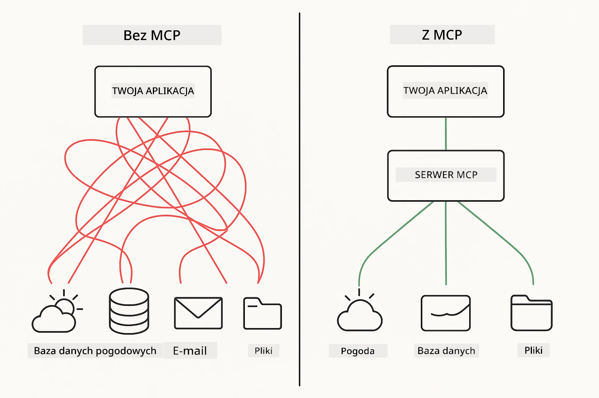
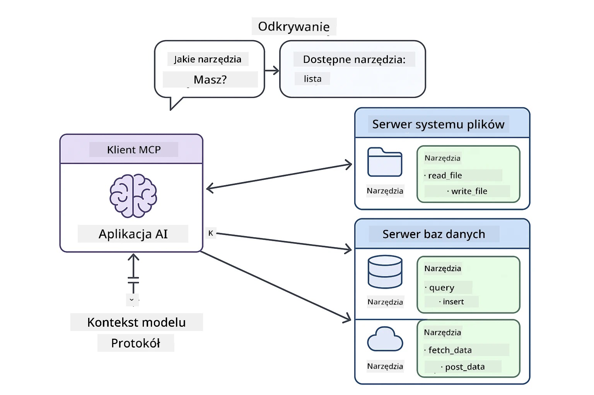
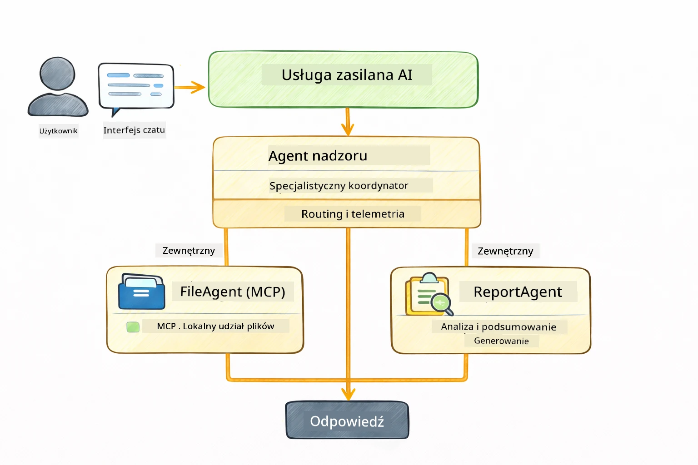

<!--
CO_OP_TRANSLATOR_METADATA:
{
  "original_hash": "6c816d130a1fa47570c11907e72d84ae",
  "translation_date": "2026-01-05T23:13:18+00:00",
  "source_file": "05-mcp/README.md",
  "language_code": "pl"
}
-->
# Moduł 05: Protokół Kontekstu Modelu (MCP)

## Spis treści

- [Czego się nauczysz](../../../05-mcp)
- [Co to jest MCP?](../../../05-mcp)
- [Jak działa MCP](../../../05-mcp)
- [Moduł agentowy](../../../05-mcp)
- [Uruchamianie przykładów](../../../05-mcp)
  - [Wymagania wstępne](../../../05-mcp)
- [Szybki start](../../../05-mcp)
  - [Operacje na plikach (Stdio)](../../../05-mcp)
  - [Agent Nadzorujący](../../../05-mcp)
    - [Zrozumienie wyników](../../../05-mcp)
    - [Strategie odpowiedzi](../../../05-mcp)
    - [Wyjaśnienie funkcji modułu agentowego](../../../05-mcp)
- [Kluczowe pojęcia](../../../05-mcp)
- [Gratulacje!](../../../05-mcp)
  - [Co dalej?](../../../05-mcp)

## Czego się nauczysz

Zbudowałeś konwersacyjne AI, opanowałeś promptowanie, osadziłeś odpowiedzi w dokumentach i stworzyłeś agentów z narzędziami. Ale wszystkie te narzędzia były dostosowane do Twojej konkretnej aplikacji. A co, gdybyś mógł dać swojemu AI dostęp do ustandaryzowanego ekosystemu narzędzi, które każdy może tworzyć i udostępniać? W tym module nauczysz się właśnie tego, korzystając z Protokołu Kontekstu Modelu (MCP) i modułu agentowego LangChain4j. Najpierw pokażemy prosty czytnik plików MCP, a następnie jak łatwo zintegrować go z zaawansowanymi przepływami agentowymi używając wzorca Agenta Nadzorującego.

## Co to jest MCP?

Protokół Kontekstu Modelu (MCP) zapewnia właśnie to — standardowy sposób, aby aplikacje AI mogły odkrywać i korzystać z narzędzi zewnętrznych. Zamiast pisać niestandardowe integracje dla każdego źródła danych lub usługi, łączysz się z serwerami MCP, które udostępniają swoje możliwości w spójnym formacie. Twój agent AI może wtedy automatycznie odkrywać i używać te narzędzia.



*Przed MCP: Skomplikowane integracje punkt-punkt. Po MCP: Jeden protokół, nieskończone możliwości.*

MCP rozwiązuje podstawowy problem rozwoju AI: każda integracja jest niestandardowa. Chcesz uzyskać dostęp do GitHub? Niestandardowy kod. Chcesz czytać pliki? Niestandardowy kod. Chcesz zapytać bazę danych? Niestandardowy kod. I żadna z tych integracji nie działa z innymi aplikacjami AI.

MCP standaryzuje to. Serwer MCP udostępnia narzędzia z jasnymi opisami i schematami. Każdy klient MCP może się połączyć, odkryć dostępne narzędzia i z nich korzystać. Zbuduj raz, używaj wszędzie.



*Architektura Protokołu Kontekstu Modelu - ustandaryzowane odkrywanie i uruchamianie narzędzi*

## Jak działa MCP

**Architektura Serwer-Klient**

MCP używa modelu klient-serwer. Serwery udostępniają narzędzia – czytanie plików, zapytania do baz danych, wywołania API. Klienci (Twoja aplikacja AI) łączą się z serwerami i korzystają z ich narzędzi.

Aby używać MCP z LangChain4j, dodaj następujący zależność Maven:

```xml
<dependency>
    <groupId>dev.langchain4j</groupId>
    <artifactId>langchain4j-mcp</artifactId>
    <version>${langchain4j.version}</version>
</dependency>
```
  
**Odkrywanie narzędzi**

Gdy klient łączy się z serwerem MCP, pyta „Jakie macie narzędzia?” Serwer odpowiada listą dostępnych narzędzi, każde z opisami i schematami parametrów. Twój agent AI może wtedy zdecydować, których narzędzi użyć na podstawie żądań użytkownika.

**Mechanizmy transportu**

MCP obsługuje różne mechanizmy transportu. Ten moduł demonstruje transport Stdio dla procesów lokalnych:


*Mechanizmy transportu MCP: HTTP dla serwerów zdalnych, Stdio dla procesów lokalnych*

**Stdio** - [StdioTransportDemo.java](../../../05-mcp/src/main/java/com/example/langchain4j/mcp/StdioTransportDemo.java)

Dla procesów lokalnych. Twoja aplikacja uruchamia serwer jako podproces i komunikuje się przez standardowe wejście/wyjście. Przydatne do dostępu do systemu plików lub narzędzi wiersza poleceń.

```java
McpTransport stdioTransport = new StdioMcpTransport.Builder()
    .command(List.of(
        npmCmd, "exec",
        "@modelcontextprotocol/server-filesystem@2025.12.18",
        resourcesDir
    ))
    .logEvents(false)
    .build();
```
  
> **🤖 Wypróbuj z [GitHub Copilot](https://github.com/features/copilot) Chat:** Otwórz [`StdioTransportDemo.java`](../../../05-mcp/src/main/java/com/example/langchain4j/mcp/StdioTransportDemo.java) i zapytaj:  
> - „Jak działa transport Stdio i kiedy powinienem go używać zamiast HTTP?”  
> - „Jak LangChain4j zarządza cyklem życia uruchamianych procesów serwera MCP?”  
> - „Jakie są zagrożenia bezpieczeństwa udostępnienia AI dostępu do systemu plików?”  

## Moduł agentowy

Podczas gdy MCP zapewnia ustandaryzowane narzędzia, moduł agentowy LangChain4j udostępnia deklaratywny sposób budowania agentów, którzy orkiestrują te narzędzia. Adnotacja `@Agent` i `AgenticServices` pozwalają definiować zachowanie agenta przez interfejsy zamiast kodu imperatywnego.

W tym module poznasz wzorzec **Agenta Nadzorującego** — zaawansowane podejście agentowe AI, gdzie „nadzorca” dynamicznie decyduje, których pod-agentów wywołać na podstawie żądań użytkownika. Połączymy oba podejścia, dając jednemu z naszych pod-agentów możliwości dostępu do plików oparte na MCP.

Aby używać modułu agentowego, dodaj następującą zależność Maven:

```xml
<dependency>
    <groupId>dev.langchain4j</groupId>
    <artifactId>langchain4j-agentic</artifactId>
    <version>${langchain4j.mcp.version}</version>
</dependency>
```
  
> **⚠️ Eksperymentalne:** Moduł `langchain4j-agentic` jest **eksperymentalny** i może ulec zmianie. Stabilnym sposobem budowy asystentów AI pozostaje `langchain4j-core` z niestandardowymi narzędziami (Moduł 04).

## Uruchamianie przykładów

### Wymagania wstępne

- Java 21+, Maven 3.9+  
- Node.js 16+ i npm (dla serwerów MCP)  
- Zmienne środowiskowe skonfigurowane w pliku `.env` (z katalogu głównego):  
  - `AZURE_OPENAI_ENDPOINT`, `AZURE_OPENAI_API_KEY`, `AZURE_OPENAI_DEPLOYMENT` (tak samo jak w Modułach 01-04)  

> **Uwaga:** Jeśli nie masz jeszcze ustawionych zmiennych środowiskowych, zobacz [Moduł 00 - Szybki start](../00-quick-start/README.md) po instrukcje albo skopiuj `.env.example` do `.env` w katalogu głównym i wypełnij swoje wartości.

## Szybki start

**Używając VS Code:** Kliknij prawym przyciskiem myszy na dowolny plik demo w Eksploratorze i wybierz **„Run Java”**, lub użyj konfiguracji uruchamiania z panelu Uruchom i Debuguj (upewnij się, że najpierw dodałeś swój token do pliku `.env`).

**Używając Mavena:** Alternatywnie możesz uruchomić z linii poleceń poniższymi przykładami.

### Operacje na plikach (Stdio)

Demonstruje lokalne narzędzia oparte na podprocesach.

**✅ Brak wymagań wstępnych** — serwer MCP jest uruchamiany automatycznie.

**Używanie skryptów startowych (zalecane):**

Skrypty startowe automatycznie ładują zmienne środowiskowe z pliku `.env` w katalogu głównym:

**Bash:**  
```bash
cd 05-mcp
chmod +x start-stdio.sh
./start-stdio.sh
```
  
**PowerShell:**  
```powershell
cd 05-mcp
.\start-stdio.ps1
```
  
**Używając VS Code:** Kliknij prawym przyciskiem myszy na `StdioTransportDemo.java` i wybierz **„Run Java”** (upewnij się, że plik `.env` jest skonfigurowany).

Aplikacja automatycznie uruchamia serwer MCP do systemu plików i odczytuje lokalny plik. Zwróć uwagę, jak zarządzanie podprocesem jest obsługiwane za Ciebie.

**Oczekiwany wynik:**  
```
Assistant response: The file provides an overview of LangChain4j, an open-source Java library
for integrating Large Language Models (LLMs) into Java applications...
```
  
### Agent Nadzorujący

Wzorzec **Agenta Nadzorującego** to **elastyczna** forma agentowego AI. Nadzorca używa LLM, aby samodzielnie zdecydować, których agentów wywołać na podstawie żądania użytkownika. W następnym przykładzie połączymy dostęp do plików oparty na MCP z agentem LLM, tworząc nadzorowany przepływ odczytu pliku → raportu.

W demo `FileAgent` odczytuje plik używając narzędzi MCP do systemu plików, a `ReportAgent` generuje strukturalny raport z podsumowaniem wykonawczym (1 zdanie), 3 kluczowymi punktami i rekomendacjami. Nadzorca orkiestruje ten proces automatycznie:



```
┌─────────────┐      ┌──────────────┐
│  FileAgent  │ ───▶ │ ReportAgent  │
│ (MCP tools) │      │  (pure LLM)  │
└─────────────┘      └──────────────┘
   outputKey:           outputKey:
  'fileContent'         'report'
```
  
Każdy agent zapisuje swoje wyniki w **Zakresie Agentowym** (wspólnej pamięci), umożliwiając agentom dalszym dostęp do wcześniejszych rezultatów. Pokazuje to, jak narzędzia MCP integrują się bezproblemowo z przepływami agentowymi — Nadzorca nie musi wiedzieć, *jak* pliki są czytane, tylko że `FileAgent` potrafi to zrobić.

#### Uruchamianie demo

Skrypty startowe automatycznie ładują zmienne środowiskowe z pliku `.env` w katalogu głównym:

**Bash:**  
```bash
cd 05-mcp
chmod +x start-supervisor.sh
./start-supervisor.sh
```
  
**PowerShell:**  
```powershell
cd 05-mcp
.\start-supervisor.ps1
```
  
**Używając VS Code:** Kliknij prawym przyciskiem myszy na `SupervisorAgentDemo.java` i wybierz **„Run Java”** (upewnij się, że `.env` jest skonfigurowany).

#### Jak działa Nadzorca

```java
// Krok 1: FileAgent odczytuje pliki za pomocą narzędzi MCP
FileAgent fileAgent = AgenticServices.agentBuilder(FileAgent.class)
        .chatModel(model)
        .toolProvider(mcpToolProvider)  // Posiada narzędzia MCP do operacji na plikach
        .build();

// Krok 2: ReportAgent generuje uporządkowane raporty
ReportAgent reportAgent = AgenticServices.agentBuilder(ReportAgent.class)
        .chatModel(model)
        .build();

// Supervisor koordynuje przepływ pracy plik → raport
SupervisorAgent supervisor = AgenticServices.supervisorBuilder()
        .chatModel(model)
        .subAgents(fileAgent, reportAgent)
        .responseStrategy(SupervisorResponseStrategy.LAST)  // Zwróć ostateczny raport
        .build();

// Supervisor decyduje, których agentów wywołać na podstawie żądania
String response = supervisor.invoke("Read the file at /path/file.txt and generate a report");
```
  
#### Strategie odpowiedzi

Gdy konfigurujesz `SupervisorAgent`, określasz, jak powinien sformułować swoją ostateczną odpowiedź dla użytkownika po wykonaniu zadań przez pod-agentów. Dostępne strategie to:

| Strategia | Opis |
|----------|-------------|
| **LAST** | Nadzorca zwraca wynik ostatniego wywołanego pod-agenta lub narzędzia. Przydatne, gdy ostatni agent w przepływie jest specjalnie zaprojektowany do wygenerowania kompletnej, ostatecznej odpowiedzi (np. „Agent Podsumowujący” w pipeline badawczym). |
| **SUMMARY** | Nadzorca używa własnego wewnętrznego modelu językowego (LLM), aby zsyntetyzować podsumowanie całej interakcji i wyników pod-agentów, a następnie zwraca to podsumowanie jako ostateczną odpowiedź. Zapewnia to czystą, zbiorczą odpowiedź dla użytkownika. |
| **SCORED** | System używa wewnętrznego LLM do ocenienia zarówno ostatniej odpowiedzi, jak i podsumowania interakcji względem oryginalnego żądania użytkownika, zwracając tę odpowiedź, która otrzyma wyższą ocenę. |

Zobacz [SupervisorAgentDemo.java](../../../05-mcp/src/main/java/com/example/langchain4j/mcp/SupervisorAgentDemo.java) dla pełnej implementacji.

> **🤖 Wypróbuj z [GitHub Copilot](https://github.com/features/copilot) Chat:** Otwórz [`SupervisorAgentDemo.java`](../../../05-mcp/src/main/java/com/example/langchain4j/mcp/SupervisorAgentDemo.java) i zapytaj:  
> - „Jak Nadzorca decyduje, których agentów wywołać?”  
> - „Jaka jest różnica między wzorcami Nadzorcy a przepływu sekwencyjnego?”  
> - „Jak mogę dostosować zachowanie planowania Nadzorcy?”  

#### Zrozumienie wyników

Po uruchomieniu demo zobaczysz szczegółowy opis, jak Nadzorca orkiestruje wielu agentów. Oto, co oznacza każda sekcja:

```
======================================================================
  FILE → REPORT WORKFLOW DEMO
======================================================================

This demo shows a clear 2-step workflow: read a file, then generate a report.
The Supervisor orchestrates the agents automatically based on the request.
```
  
**Nagłówek** wprowadza koncepcję przepływu: skoncentrowany pipeline od odczytu pliku do generowania raportu.

```
--- WORKFLOW ---------------------------------------------------------
  ┌─────────────┐      ┌──────────────┐
  │  FileAgent  │ ───▶ │ ReportAgent  │
  │ (MCP tools) │      │  (pure LLM)  │
  └─────────────┘      └──────────────┘
   outputKey:           outputKey:
   'fileContent'        'report'

--- AVAILABLE AGENTS -------------------------------------------------
  [FILE]   FileAgent   - Reads files via MCP → stores in 'fileContent'
  [REPORT] ReportAgent - Generates structured report → stores in 'report'
```
  
**Diagram przepływu pracy** pokazuje przepływ danych między agentami. Każdy agent ma określoną rolę:  
- **FileAgent** czyta pliki przy użyciu narzędzi MCP i przechowuje surową zawartość w `fileContent`  
- **ReportAgent** konsumuje tę zawartość i generuje ustrukturyzowany raport w `report`

```
--- USER REQUEST -----------------------------------------------------
  "Read the file at .../file.txt and generate a report on its contents"
```
  
**Żądanie użytkownika** pokazuje zadanie. Nadzorca analizuje je i decyduje się wywołać FileAgent → ReportAgent.

```
--- SUPERVISOR ORCHESTRATION -----------------------------------------
  The Supervisor decides which agents to invoke and passes data between them...

  +-- STEP 1: Supervisor chose -> FileAgent (reading file via MCP)
  |
  |   Input: .../file.txt
  |
  |   Result: LangChain4j is an open-source, provider-agnostic Java framework for building LLM...
  +-- [OK] FileAgent (reading file via MCP) completed

  +-- STEP 2: Supervisor chose -> ReportAgent (generating structured report)
  |
  |   Input: LangChain4j is an open-source, provider-agnostic Java framew...
  |
  |   Result: Executive Summary...
  +-- [OK] ReportAgent (generating structured report) completed
```
  
**Orkiestracja Nadzorcy** pokazuje 2-etapowy przepływ w akcji:  
1. **FileAgent** odczytuje plik przez MCP i zapisuje zawartość  
2. **ReportAgent** otrzymuje zawartość i generuje ustrukturyzowany raport

Nadzorca podjął te decyzje **autonomicznie** na podstawie żądania użytkownika.

```
--- FINAL RESPONSE ---------------------------------------------------
Executive Summary
...

Key Points
...

Recommendations
...

--- AGENTIC SCOPE (Data Flow) ----------------------------------------
  Each agent stores its output for downstream agents to consume:
  * fileContent: LangChain4j is an open-source, provider-agnostic Java framework...
  * report: Executive Summary...
```
  
#### Wyjaśnienie funkcji modułu agentowego

Przykład pokazuje kilka zaawansowanych funkcji modułu agentowego. Przyjrzyjmy się bliżej Zakresowi Agentowemu i Słuchaczom Agentów.

**Zakres Agentowy** pokazuje wspólną pamięć, w której agenci zapisali swoje wyniki używając `@Agent(outputKey="...")`. Pozwala to:  
- Późniejszym agentom na dostęp do wyników wcześniejszych  
- Nadzorcy na syntezę końcowej odpowiedzi  
- Tobie na inspekcję, co każdy agent wyprodukował  

```java
ResultWithAgenticScope<String> result = supervisor.invokeWithAgenticScope(request);
AgenticScope scope = result.agenticScope();
String fileContent = scope.readState("fileContent");  // Surowe dane pliku z FileAgent
String report = scope.readState("report");            // Strukturalny raport z ReportAgent
```
  
**Słuchacze Agentów** umożliwiają monitorowanie i debugowanie wykonywania agentów. Krok-po-kroku wyświetlany wynik w demo pochodzi ze Słuchacza Agenta, który jest wpięty w każde wywołanie agenta:  
- **beforeAgentInvocation** — wywoływany, gdy Nadzorca wybiera agenta, pozwalając zobaczyć, który agent został wybrany i dlaczego  
- **afterAgentInvocation** — wywoływany, gdy agent kończy, pokazując jego wynik  
- **inheritedBySubagents** — gdy wartość jest true, słuchacz monitoruje wszystkich agentów w hierarchii  

```java
AgentListener monitor = new AgentListener() {
    private int step = 0;
    
    @Override
    public void beforeAgentInvocation(AgentRequest request) {
        step++;
        System.out.println("  +-- STEP " + step + ": " + request.agentName());
    }
    
    @Override
    public void afterAgentInvocation(AgentResponse response) {
        System.out.println("  +-- [OK] " + response.agentName() + " completed");
    }
    
    @Override
    public boolean inheritedBySubagents() {
        return true; // Rozprzestrzeniać do wszystkich podagentów
    }
};
```
  
Poza wzorcem Nadzorcy, moduł `langchain4j-agentic` udostępnia kilka potężnych wzorców i funkcji przepływu pracy:

| Wzorzec | Opis | Przykład użycia |
|---------|-------------|----------|
| **Sekwencyjny** | Wykonaj agentów w kolejności, wynik przechodzi do następnego | Pipeline: badania → analiza → raport |
| **Równoległy** | Uruchom agentów jednocześnie | Zadania niezależne: pogoda + wiadomości + akcje |
| **Pętla** | Iteruj do spełnienia warunku | Ocena jakości: ulepszaj aż wynik ≥ 0.8 |
| **Warunkowy** | Kieruj na podstawie warunków | Klasyfikuj → skieruj do specjalisty |
| **Człowiek w Pętli** | Dodaj punkty kontrolne dla człowieka | Procesy zatwierdzania, przegląd treści |

## Kluczowe pojęcia

Teraz, gdy zapoznałeś się z MCP i modułem agentowym w praktyce, podsumujmy, kiedy używać którego podejścia.

**MCP** jest idealny, gdy chcesz wykorzystać istniejące ekosystemy narzędzi, budować narzędzia, którymi mogą się dzielić różne aplikacje, integrować usługi zewnętrzne za pomocą standardowych protokołów lub wymieniać implementacje narzędzi bez zmiany kodu.

**Moduł agentowy** sprawdza się najlepiej, gdy chcesz definicji agentów deklaratywnych z adnotacjami `@Agent`, potrzebujesz orkiestracji przepływu pracy (sekwencyjna, pętla, równoległa), preferujesz projektowanie agentów przez interfejsy zamiast kod imperatywny lub łączysz wielu agentów, którzy współdzielą wyniki przez `outputKey`.

**Wzorzec Agenta Nadzorującego** sprawdza się, gdy przepływ pracy nie jest przewidywalny z góry i chcesz, aby LLM decydowało, gdy masz wiele specjalistycznych agentów wymagających dynamicznej orkiestracji, przy budowie systemów konwersacyjnych kierujących do różnych możliwości lub gdy potrzebujesz najbardziej elastycznego, adaptacyjnego zachowania agentów.
## Gratulacje!

Ukończyłeś kurs LangChain4j dla początkujących. Nauczyłeś się:

- Jak budować konwersacyjne AI z pamięcią (Moduł 01)
- Wzorce inżynierii promptów dla różnych zadań (Moduł 02)
- Osadzania odpowiedzi w oparciu o Twoje dokumenty za pomocą RAG (Moduł 03)
- Tworzenia podstawowych agentów AI (asystentów) z niestandardowymi narzędziami (Moduł 04)
- Integracji standardowych narzędzi z modułami LangChain4j MCP i Agentic (Moduł 05)

### Co dalej?

Po ukończeniu modułów zapoznaj się z [Przewodnikiem testowania](../docs/TESTING.md), aby zobaczyć koncepcje testowania LangChain4j w praktyce.

**Oficjalne zasoby:**
- [Dokumentacja LangChain4j](https://docs.langchain4j.dev/) - Kompleksowe przewodniki i referencje API
- [LangChain4j na GitHub](https://github.com/langchain4j/langchain4j) - Kod źródłowy i przykłady
- [Samouczki LangChain4j](https://docs.langchain4j.dev/tutorials/) - Instrukcje krok po kroku dla różnych zastosowań

Dziękujemy za ukończenie tego kursu!

---

**Nawigacja:** [← Poprzedni: Moduł 04 - Narzędzia](../04-tools/README.md) | [Powrót do głównej](../README.md)

---

<!-- CO-OP TRANSLATOR DISCLAIMER START -->
**Zastrzeżenie**:
Dokument ten został przetłumaczony za pomocą usługi tłumaczenia AI [Co-op Translator](https://github.com/Azure/co-op-translator). Mimo że dokładamy starań, aby tłumaczenie było precyzyjne, prosimy pamiętać, że tłumaczenia automatyczne mogą zawierać błędy lub niedokładności. Oryginalny dokument w jego języku źródłowym należy uważać za źródło autorytatywne. W przypadku istotnych informacji zaleca się skorzystanie z profesjonalnego tłumaczenia przez człowieka. Nie ponosimy odpowiedzialności za wszelkie nieporozumienia lub błędne interpretacje wynikające z użycia tego tłumaczenia.
<!-- CO-OP TRANSLATOR DISCLAIMER END -->