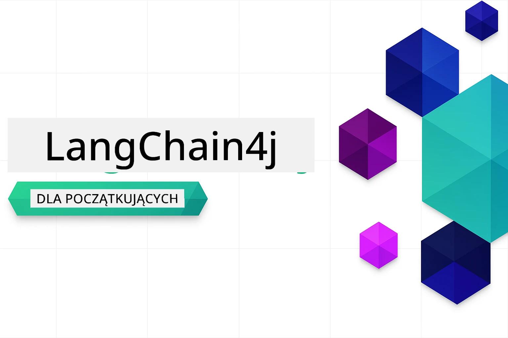

### 🌐 Wsparcie wielojęzyczne

#### Obsługiwane za pomocą GitHub Action (automatyczne i zawsze aktualne)

<!-- CO-OP TRANSLATOR LANGUAGES TABLE START -->
[Arabic](../ar/README.md) | [Bengali](../bn/README.md) | [Bulgarian](../bg/README.md) | [Burmese (Myanmar)](../my/README.md) | [Chinese (Simplified)](../zh-CN/README.md) | [Chinese (Traditional, Hong Kong)](../zh-HK/README.md) | [Chinese (Traditional, Macau)](../zh-MO/README.md) | [Chinese (Traditional, Taiwan)](../zh-TW/README.md) | [Croatian](../hr/README.md) | [Czech](../cs/README.md) | [Danish](../da/README.md) | [Dutch](../nl/README.md) | [Estonian](../et/README.md) | [Finnish](../fi/README.md) | [French](../fr/README.md) | [German](../de/README.md) | [Greek](../el/README.md) | [Hebrew](../he/README.md) | [Hindi](../hi/README.md) | [Hungarian](../hu/README.md) | [Indonesian](../id/README.md) | [Italian](../it/README.md) | [Japanese](../ja/README.md) | [Kannada](../kn/README.md) | [Korean](../ko/README.md) | [Lithuanian](../lt/README.md) | [Malay](../ms/README.md) | [Malayalam](../ml/README.md) | [Marathi](../mr/README.md) | [Nepali](../ne/README.md) | [Nigerian Pidgin](../pcm/README.md) | [Norwegian](../no/README.md) | [Persian (Farsi)](../fa/README.md) | [Polish](./README.md) | [Portuguese (Brazil)](../pt-BR/README.md) | [Portuguese (Portugal)](../pt-PT/README.md) | [Punjabi (Gurmukhi)](../pa/README.md) | [Romanian](../ro/README.md) | [Russian](../ru/README.md) | [Serbian (Cyrillic)](../sr/README.md) | [Slovak](../sk/README.md) | [Slovenian](../sl/README.md) | [Spanish](../es/README.md) | [Swahili](../sw/README.md) | [Swedish](../sv/README.md) | [Tagalog (Filipino)](../tl/README.md) | [Tamil](../ta/README.md) | [Telugu](../te/README.md) | [Thai](../th/README.md) | [Turkish](../tr/README.md) | [Ukrainian](../uk/README.md) | [Urdu](../ur/README.md) | [Vietnamese](../vi/README.md)

> **Wolisz sklonować lokalnie?**

> To repozytorium zawiera tłumaczenia na ponad 50 języków, co znacznie zwiększa rozmiar pobierania. Aby sklonować bez tłumaczeń, użyj sparse checkout:
> ```bash
> git clone --filter=blob:none --sparse https://github.com/microsoft/LangChain4j-for-Beginners.git
> cd LangChain4j-for-Beginners
> git sparse-checkout set --no-cone '/*' '!translations' '!translated_images'
> ```
> To daje wszystko, czego potrzebujesz, aby ukończyć kurs, z dużo szybszym pobieraniem.
<!-- CO-OP TRANSLATOR LANGUAGES TABLE END -->

# LangChain4j dla początkujących

Kurs budowania aplikacji AI z LangChain4j i Azure OpenAI GPT-5, od podstawowego czatu po agentów AI.

**Nowy w LangChain4j?** Sprawdź [Słowniczek](docs/GLOSSARY.md), aby poznać definicje kluczowych terminów i pojęć.

## Spis treści

1. [Szybki start](00-quick-start/README.md) - Zacznij pracę z LangChain4j
2. [Wprowadzenie](01-introduction/README.md) - Poznaj podstawy LangChain4j
3. [Inżynieria promptów](02-prompt-engineering/README.md) - Opanuj efektywne projektowanie promptów
4. [RAG (Generacja wspomagana wyszukiwaniem)](03-rag/README.md) - Twórz inteligentne systemy oparte na wiedzy
5. [Narzędzia](04-tools/README.md) - Integruj zewnętrzne narzędzia i proste asystenty
6. [MCP (Model Context Protocol)](05-mcp/README.md) - Pracuj z Modelem Context Protocol (MCP) i modułami agentowymi
---

## Ścieżka nauki

> **Szybki start**

1. Rozgałęź to repozytorium na swoje konto GitHub
2. Kliknij **Code** → zakładka **Codespaces** → **...** → **Nowy z opcjami...**
3. Użyj domyślnych ustawień – wybierze to kontener programistyczny utworzony dla tego kursu
4. Kliknij **Utwórz codespace**
5. Poczekaj 5-10 minut, aż środowisko będzie gotowe
6. Przejdź bezpośrednio do [Szybkiego startu](./00-quick-start/README.md), aby zacząć!

Po ukończeniu modułów, zapoznaj się z [Przewodnikiem testowania](docs/TESTING.md), aby zobaczyć koncepcje testowania LangChain4j w praktyce.

> **Uwaga:** Szkolenie korzysta zarówno z modeli GitHub, jak i Azure OpenAI. Moduł [Szybki start](00-quick-start/README.md) używa modeli GitHub (bez wymaganego subskrypcji Azure), natomiast moduły 1-5 korzystają z Azure OpenAI.


## Nauka z GitHub Copilot

Aby szybko zacząć kodować, otwórz ten projekt w GitHub Codespace lub w swoim lokalnym IDE z dostarczonym devcontainerem. Devcontainer używany w tym kursie jest wstępnie skonfigurowany z GitHub Copilot do programowania AI w parze.

Każdy przykład kodu zawiera sugerowane pytania, które możesz zadać GitHub Copilot, aby pogłębić swoją wiedzę. Szukaj znaków 💡/🤖 w:

- **Nagłówkach plików Java** - pytania specyficzne dla każdego przykładu
- **Plikach README modułów** - propozycje eksploracji po przykładach kodu

**Jak używać:** Otwórz dowolny plik z kodem i zadawaj Copilotowi sugerowane pytania. Ma pełen kontekst bazy kodu i może wyjaśniać, rozszerzać i sugerować alternatywy.

Chcesz dowiedzieć się więcej? Sprawdź [Copilot do programowania AI w parze](https://aka.ms/GitHubCopilotAI).


## Dodatkowe zasoby

<!-- CO-OP TRANSLATOR OTHER COURSES START -->
### LangChain
[](https://aka.ms/langchain4j-for-beginners)
[](https://aka.ms/langchainjs-for-beginners?WT.mc_id=m365-94501-dwahlin)

---

### Azure / Edge / MCP / Agenci
[](https://github.com/microsoft/AZD-for-beginners?WT.mc_id=academic-105485-koreyst)
[](https://github.com/microsoft/edgeai-for-beginners?WT.mc_id=academic-105485-koreyst)
[](https://github.com/microsoft/mcp-for-beginners?WT.mc_id=academic-105485-koreyst)
[](https://github.com/microsoft/ai-agents-for-beginners?WT.mc_id=academic-105485-koreyst)

---
 
### Seria Generative AI
[](https://github.com/microsoft/generative-ai-for-beginners?WT.mc_id=academic-105485-koreyst)
[-9333EA?style=for-the-badge&labelColor=E5E7EB&color=9333EA)](https://github.com/microsoft/Generative-AI-for-beginners-dotnet?WT.mc_id=academic-105485-koreyst)
[-C084FC?style=for-the-badge&labelColor=E5E7EB&color=C084FC)](https://github.com/microsoft/generative-ai-for-beginners-java?WT.mc_id=academic-105485-koreyst)
[-E879F9?style=for-the-badge&labelColor=E5E7EB&color=E879F9)](https://github.com/microsoft/generative-ai-with-javascript?WT.mc_id=academic-105485-koreyst)

---
 
### Podstawowa nauka
[](https://aka.ms/ml-beginners?WT.mc_id=academic-105485-koreyst)
[](https://aka.ms/datascience-beginners?WT.mc_id=academic-105485-koreyst)
[](https://aka.ms/ai-beginners?WT.mc_id=academic-105485-koreyst)
[](https://github.com/microsoft/Security-101?WT.mc_id=academic-96948-sayoung)
[](https://aka.ms/webdev-beginners?WT.mc_id=academic-105485-koreyst)
[](https://aka.ms/iot-beginners?WT.mc_id=academic-105485-koreyst)
[](https://github.com/microsoft/xr-development-for-beginners?WT.mc_id=academic-105485-koreyst)

---
 
### Seria Copilot
[](https://aka.ms/GitHubCopilotAI?WT.mc_id=academic-105485-koreyst)
[](https://github.com/microsoft/mastering-github-copilot-for-dotnet-csharp-developers?WT.mc_id=academic-105485-koreyst)
[](https://github.com/microsoft/CopilotAdventures?WT.mc_id=academic-105485-koreyst)
<!-- CO-OP TRANSLATOR OTHER COURSES END -->

## Uzyskiwanie pomocy

Jeśli utkniesz lub masz pytania dotyczące tworzenia aplikacji AI, dołącz do:

[](https://aka.ms/foundry/discord)

Jeśli masz opinię na temat produktu lub napotykasz błędy podczas tworzenia, odwiedź:

[](https://aka.ms/foundry/forum)

## Licencja

Licencja MIT - Szczegóły w pliku [LICENSE](../../LICENSE).

---

<!-- CO-OP TRANSLATOR DISCLAIMER START -->
**Zastrzeżenie**:  
Niniejszy dokument został przetłumaczony za pomocą usługi tłumaczenia AI [Co-op Translator](https://github.com/Azure/co-op-translator). Mimo że dążymy do jak największej dokładności, prosimy pamiętać, że tłumaczenia automatyczne mogą zawierać błędy lub nieścisłości. Oryginalny dokument w języku źródłowym należy traktować jako źródło wiążące. W przypadku informacji o krytycznym znaczeniu zalecane jest skorzystanie z profesjonalnego tłumaczenia wykonanego przez człowieka. Nie ponosimy odpowiedzialności za jakiekolwiek nieporozumienia lub błędne interpretacje wynikające z korzystania z tego tłumaczenia.
<!-- CO-OP TRANSLATOR DISCLAIMER END -->