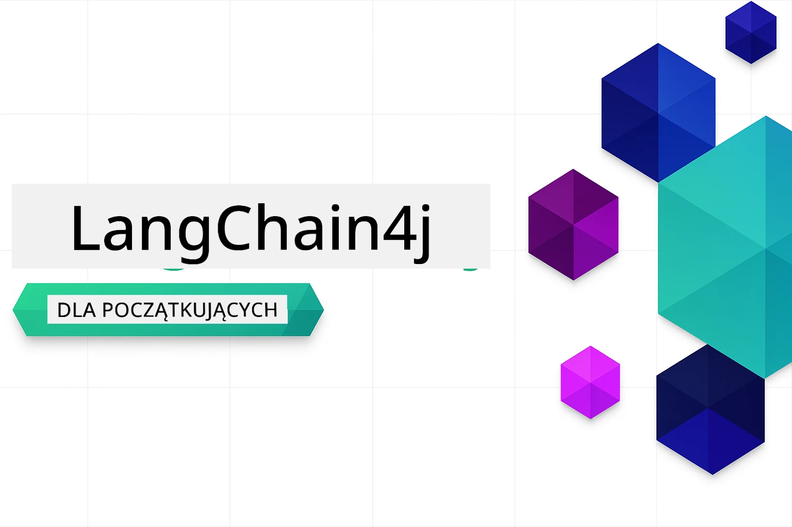

# LangChain4j dla początkujących

Kurs tworzenia aplikacji AI z LangChain4j i Azure OpenAI GPT-5.2, od podstawowego czatu po agentów AI.

### 🌐 Wsparcie wielojęzyczne

#### Obsługiwane przez GitHub Action (Automatyczne i zawsze aktualne)

<!-- CO-OP TRANSLATOR LANGUAGES TABLE START -->
[Arabski](../ar/README.md) | [Bengalski](../bn/README.md) | [Bułgarski](../bg/README.md) | [Birmański (Myanmar)](../my/README.md) | [Chiński (uproszczony)](../zh-CN/README.md) | [Chiński (tradycyjny, Hongkong)](../zh-HK/README.md) | [Chiński (tradycyjny, Makau)](../zh-MO/README.md) | [Chiński (tradycyjny, Tajwan)](../zh-TW/README.md) | [Chorwacki](../hr/README.md) | [Czeski](../cs/README.md) | [Duński](../da/README.md) | [Niderlandzki](../nl/README.md) | [Estoński](../et/README.md) | [Fiński](../fi/README.md) | [Francuski](../fr/README.md) | [Niemiecki](../de/README.md) | [Grecki](../el/README.md) | [Hebrajski](../he/README.md) | [Hindi](../hi/README.md) | [Węgierski](../hu/README.md) | [Indonezyjski](../id/README.md) | [Włoski](../it/README.md) | [Japoński](../ja/README.md) | [Kannada](../kn/README.md) | [Khmerski](../km/README.md) | [Koreański](../ko/README.md) | [Litewski](../lt/README.md) | [Malajski](../ms/README.md) | [Malajalam](../ml/README.md) | [Marathi](../mr/README.md) | [Nepalski](../ne/README.md) | [Pidgin nigeryjski](../pcm/README.md) | [Norweski](../no/README.md) | [Perski (farsi)](../fa/README.md) | [Polski](./README.md) | [Portugalski (Brazylia)](../pt-BR/README.md) | [Portugalski (Portugalia)](../pt-PT/README.md) | [Pendżabski (Gurmukhi)](../pa/README.md) | [Rumuński](../ro/README.md) | [Rosyjski](../ru/README.md) | [Serbski (cyrylica)](../sr/README.md) | [Słowacki](../sk/README.md) | [Słoweński](../sl/README.md) | [Hiszpański](../es/README.md) | [Suahili](../sw/README.md) | [Szwedzki](../sv/README.md) | [Tagalog (filipiński)](../tl/README.md) | [Tamilski](../ta/README.md) | [Telugu](../te/README.md) | [Tajski](../th/README.md) | [Turecki](../tr/README.md) | [Ukraiński](../uk/README.md) | [Urdu](../ur/README.md) | [Wietnamski](../vi/README.md)

> **Wolisz sklonować lokalnie?**
>
> To repozytorium zawiera 50+ tłumaczeń językowych, co znacznie zwiększa rozmiar pobierania. Aby sklonować bez tłumaczeń, użyj sparse checkout:
>
> **Bash / macOS / Linux:**
> ```bash
> git clone --filter=blob:none --sparse https://github.com/microsoft/LangChain4j-for-Beginners.git
> cd LangChain4j-for-Beginners
> git sparse-checkout set --no-cone '/*' '!translations' '!translated_images'
> ```
>
> **CMD (Windows):**
> ```cmd
> git clone --filter=blob:none --sparse https://github.com/microsoft/LangChain4j-for-Beginners.git
> cd LangChain4j-for-Beginners
> git sparse-checkout set --no-cone "/*" "!translations" "!translated_images"
> ```
>
> Dzięki temu otrzymujesz wszystko, co potrzebne do ukończenia kursu, przy znacznie szybszym pobieraniu.
<!-- CO-OP TRANSLATOR LANGUAGES TABLE END -->

## Spis treści

1. [Wprowadzenie](01-introduction/README.md) - Poznaj podstawy LangChain4j
2. [Inżynieria promptów](02-prompt-engineering/README.md) - Opanuj skuteczne projektowanie promptów
3. [RAG (Generowanie z wsparciem wyszukiwania)](03-rag/README.md) - Buduj inteligentne systemy oparte na wiedzy
4. [Narzędzia](04-tools/README.md) - Integruj zewnętrzne narzędzia i proste asystenty
5. [MCP (Model Context Protocol)](05-mcp/README.md) - Pracuj z Modelem Protokołu Kontekstu (MCP) i modułami agentskimi

### Przewodniki wideo

Każdy moduł ma towarzyszącą sesję na żywo, w której krok po kroku omawiamy koncepcje i kod.

| Moduł | Wideo |
|--------|-------|
| 01 - Wprowadzenie | [Rozpoczęcie z LangChain4j](https://www.youtube.com/live/nl_troDm8rQ) |
| 02 - Inżynieria promptów | [Inżynieria promptów z LangChain4j](https://www.youtube.com/live/PJ6aBaE6bog) |
| 03 - RAG | [RAG z LangChain4j](https://www.youtube.com/watch?v=_olq75ZH_eY) |
| 04 - Narzędzia & 05 - MCP | [Agenci AI z narzędziami i MCP](https://www.youtube.com/watch?v=O_J30kZc0rw) |

---

## Ścieżka nauki

**Nowy w LangChain4j?** Zapoznaj się z [Słownikiem](docs/GLOSSARY.md) definicji kluczowych terminów i pojęć.

> **Szybki start**

1. Sklonuj to repozytorium do swojego konta GitHub
2. Kliknij **Code** → zakładkę **Codespaces** → **...** → **Nowy z opcjami...**
3. Użyj domyślnych ustawień – to wybierze kontener developerski stworzony na potrzeby tego kursu
4. Kliknij **Create codespace**
5. Poczekaj 5-10 minut, aż środowisko będzie gotowe
6. Przejdź od razu do [Wprowadzenia](./01-introduction/README.md), aby zacząć!

Po ukończeniu modułów, przejrzyj [Przewodnik testowania](docs/TESTING.md), aby zobaczyć koncepcje testowania LangChain4j w praktyce.

> **Uwaga:** Szkolenie korzysta z Azure OpenAI. Zacznij od [BEZPŁATNEGO konta Azure](https://aka.ms/azure-free-account), jeśli jeszcze go nie masz.


## Nauka z GitHub Copilot

Aby szybko zacząć kodować, otwórz ten projekt w GitHub Codespace lub swoim lokalnym IDE z dostarczonym devcontainer. Devcontainer użyty w tym kursie jest wstępnie skonfigurowany z GitHub Copilot do programowania w parach z AI.

Każdy przykład kodu zawiera sugerowane pytania, które możesz zadać GitHub Copilot, aby pogłębić swoją wiedzę. Szukaj podpowiedzi 💡/🤖 w:

- **Nagłówkach plików Java** – pytania specyficzne dla każdego przykładu
- **Plikach README modułów** – pytania do eksploracji po przykładach kodu

**Jak używać:** Otwórz dowolny plik z kodem i zadaj Copilotowi proponowane pytania. Ma pełny kontekst kodu i potrafi wyjaśniać, rozszerzać i sugerować alternatywy.

Chcesz się dowiedzieć więcej? Sprawdź [Copilot do programowania w parach z AI](https://aka.ms/GitHubCopilotAI).


## Dodatkowe zasoby

<!-- CO-OP TRANSLATOR OTHER COURSES START -->
### LangChain
[](https://aka.ms/langchain4j-for-beginners)
[](https://aka.ms/langchainjs-for-beginners?WT.mc_id=m365-94501-dwahlin)
[](https://github.com/microsoft/langchain-for-beginners?WT.mc_id=m365-94501-dwahlin)
---

### Azure / Edge / MCP / Agenci
[](https://github.com/microsoft/AZD-for-beginners?WT.mc_id=academic-105485-koreyst)
[](https://github.com/microsoft/edgeai-for-beginners?WT.mc_id=academic-105485-koreyst)
[](https://github.com/microsoft/mcp-for-beginners?WT.mc_id=academic-105485-koreyst)
[](https://github.com/microsoft/ai-agents-for-beginners?WT.mc_id=academic-105485-koreyst)

---
 
### Seria Generatywnej AI
[](https://github.com/microsoft/generative-ai-for-beginners?WT.mc_id=academic-105485-koreyst)
[-9333EA?style=for-the-badge&labelColor=E5E7EB&color=9333EA)](https://github.com/microsoft/Generative-AI-for-beginners-dotnet?WT.mc_id=academic-105485-koreyst)
[-C084FC?style=for-the-badge&labelColor=E5E7EB&color=C084FC)](https://github.com/microsoft/generative-ai-for-beginners-java?WT.mc_id=academic-105485-koreyst)
[-E879F9?style=for-the-badge&labelColor=E5E7EB&color=E879F9)](https://github.com/microsoft/generative-ai-with-javascript?WT.mc_id=academic-105485-koreyst)

---
 
### Podstawowa nauka
[](https://aka.ms/ml-beginners?WT.mc_id=academic-105485-koreyst)
[](https://aka.ms/datascience-beginners?WT.mc_id=academic-105485-koreyst)
[](https://aka.ms/ai-beginners?WT.mc_id=academic-105485-koreyst)
[](https://github.com/microsoft/Security-101?WT.mc_id=academic-96948-sayoung)

[](https://aka.ms/webdev-beginners?WT.mc_id=academic-105485-koreyst)
[](https://aka.ms/iot-beginners?WT.mc_id=academic-105485-koreyst)
[](https://github.com/microsoft/xr-development-for-beginners?WT.mc_id=academic-105485-koreyst)

---
 
### Seria Copilot
[](https://aka.ms/GitHubCopilotAI?WT.mc_id=academic-105485-koreyst)
[](https://github.com/microsoft/mastering-github-copilot-for-dotnet-csharp-developers?WT.mc_id=academic-105485-koreyst)
[](https://github.com/microsoft/CopilotAdventures?WT.mc_id=academic-105485-koreyst)
<!-- CO-OP TRANSLATOR OTHER COURSES END -->

## Uzyskiwanie pomocy

Jeśli utkniesz lub masz pytania dotyczące tworzenia aplikacji AI, dołącz do:

[](https://aka.ms/foundry/discord)

Jeśli masz opinie o produkcie lub napotykasz błędy podczas tworzenia, odwiedź:

[](https://aka.ms/foundry/forum)

## Licencja

Licencja MIT - zobacz plik [LICENSE](../../LICENSE) po szczegóły.

---

<!-- CO-OP TRANSLATOR DISCLAIMER START -->
**Zastrzeżenie**:
Niniejszy dokument został przetłumaczony za pomocą usługi tłumaczenia AI [Co-op Translator](https://github.com/Azure/co-op-translator). Choć dążymy do dokładności, prosimy pamiętać, że automatyczne tłumaczenia mogą zawierać błędy lub niedokładności. Oryginalny dokument w jego języku źródłowym należy uznawać za autorytatywne źródło. W przypadku informacji krytycznych zalecane jest skorzystanie z profesjonalnego tłumaczenia wykonanego przez człowieka. Nie ponosimy odpowiedzialności za jakiekolwiek nieporozumienia lub błędne interpretacje wynikające z użycia tego tłumaczenia.
<!-- CO-OP TRANSLATOR DISCLAIMER END -->