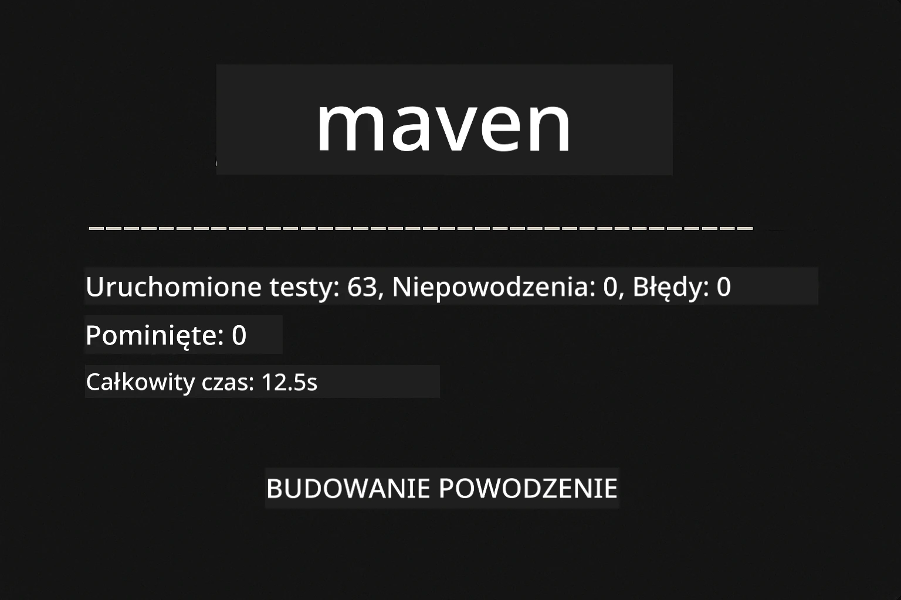
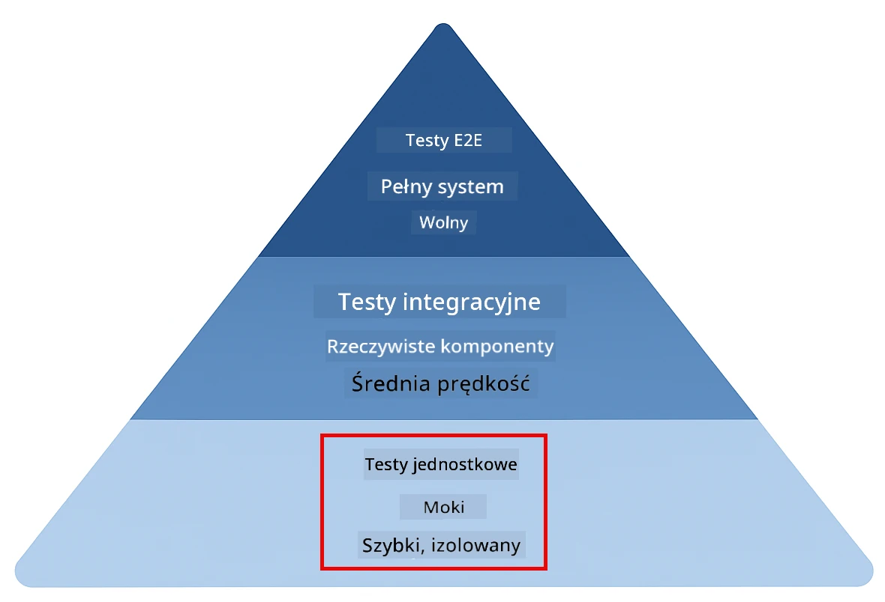
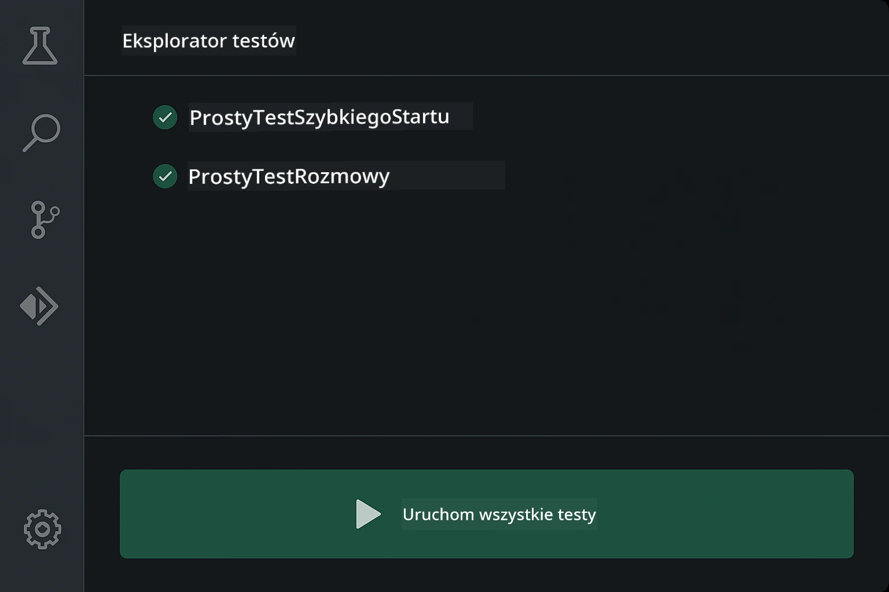
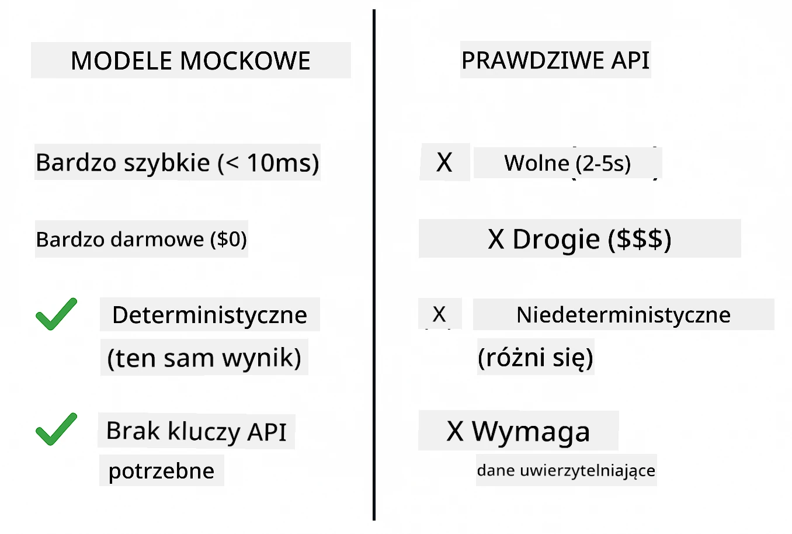
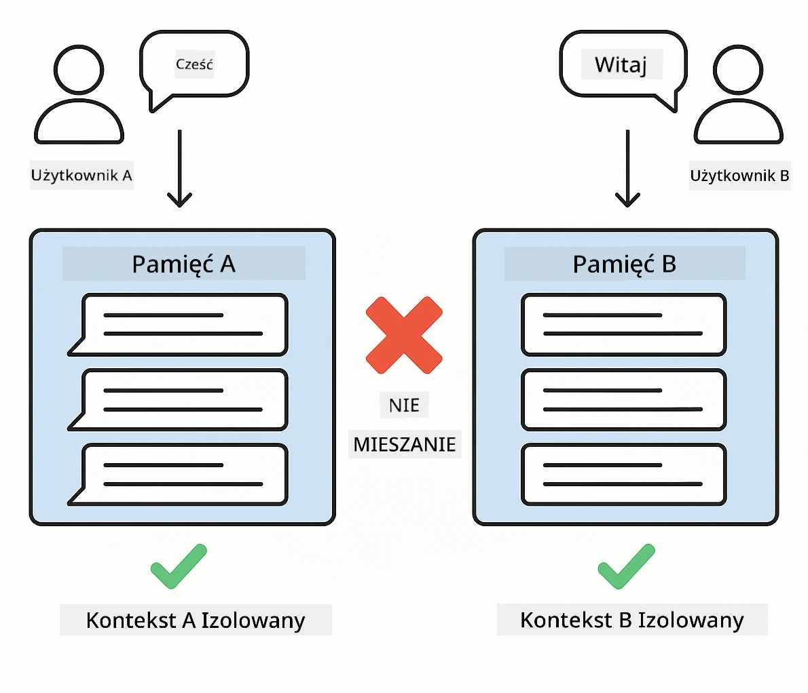
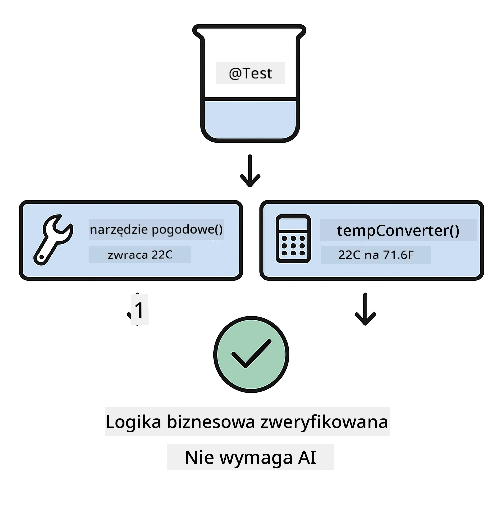
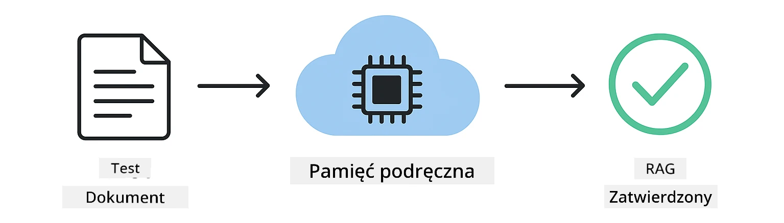

<!--
CO_OP_TRANSLATOR_METADATA:
{
  "original_hash": "ed93b3c14d58734ac10162967da958c1",
  "translation_date": "2025-12-31T00:27:29+00:00",
  "source_file": "docs/TESTING.md",
  "language_code": "pl"
}
-->
# Testowanie aplikacji LangChain4j

## Spis treści

- [Szybki start](../../../docs)
- [Co obejmują testy](../../../docs)
- [Uruchamianie testów](../../../docs)
- [Uruchamianie testów w VS Code](../../../docs)
- [Wzorce testowania](../../../docs)
- [Filozofia testowania](../../../docs)
- [Następne kroki](../../../docs)

Ten przewodnik przeprowadza Cię przez testy, które pokazują, jak testować aplikacje AI bez konieczności posiadania kluczy API lub zewnętrznych usług.

## Quick Start

Uruchom wszystkie testy jednym poleceniem:

**Bash:**
```bash
mvn test
```

**PowerShell:**
```powershell
mvn --% test
```



*Pomyślne uruchomienie testów pokazujące, że wszystkie testy przeszły bez błędów*

## Co obejmują testy

Ten kurs koncentruje się na **testach jednostkowych**, które uruchamiają się lokalnie. Każdy test demonstruje konkretną koncepcję LangChain4j w izolacji.



*Piramida testów pokazująca równowagę między testami jednostkowymi (szybkie, izolowane), testami integracyjnymi (rzeczywiste komponenty) i testami end-to-end. To szkolenie obejmuje testy jednostkowe.*

| Moduł | Testy | Zakres | Kluczowe pliki |
|--------|-------|-------|-----------|
| **00 - Szybki start** | 6 | Szablony promptów i podstawianie zmiennych | `SimpleQuickStartTest.java` |
| **01 - Wprowadzenie** | 8 | Pamięć konwersacji i stanowy czat | `SimpleConversationTest.java` |
| **02 - Inżynieria promptów** | 12 | Wzorce GPT-5, poziomy chęci, ustrukturyzowany wynik | `SimpleGpt5PromptTest.java` |
| **03 - RAG** | 10 | Wczytywanie dokumentów, osadzenia, wyszukiwanie podobieństwa | `DocumentServiceTest.java` |
| **04 - Narzędzia** | 12 | Wywoływanie funkcji i łączenie narzędzi | `SimpleToolsTest.java` |
| **05 - MCP** | 8 | Model Context Protocol z transportem stdio | `SimpleMcpTest.java` |

## Uruchamianie testów

**Uruchom wszystkie testy z katalogu głównego:**

**Bash:**
```bash
mvn test
```

**PowerShell:**
```powershell
mvn --% test
```

**Uruchom testy dla konkretnego modułu:**

**Bash:**
```bash
cd 01-introduction && mvn test
# Albo jako root
mvn test -pl 01-introduction
```

**PowerShell:**
```powershell
cd 01-introduction; mvn --% test
# Albo z konta root
mvn --% test -pl 01-introduction
```

**Uruchom pojedynczą klasę testową:**

**Bash:**
```bash
mvn test -Dtest=SimpleConversationTest
```

**PowerShell:**
```powershell
mvn --% test -Dtest=SimpleConversationTest
```

**Uruchom konkretną metodę testową:**

**Bash:**
```bash
mvn test -Dtest=SimpleConversationTest#powinien zachowywać historię konwersacji
```

**PowerShell:**
```powershell
mvn --% test -Dtest=SimpleConversationTest#powinienZachowywaćHistorięKonwersacji
```

## Uruchamianie testów w VS Code

Jeśli używasz Visual Studio Code, Test Explorer zapewnia graficzny interfejs do uruchamiania i debugowania testów.



*Eksplorator testów VS Code pokazujący drzewo testów z wszystkimi klasami testowymi Java i poszczególnymi metodami testowymi*

**Aby uruchomić testy w VS Code:**

1. Otwórz Test Explorer klikając ikonę probówki w pasku aktywności
2. Rozwiń drzewo testów, aby zobaczyć wszystkie moduły i klasy testowe
3. Kliknij przycisk odtwarzania obok dowolnego testu, aby uruchomić go indywidualnie
4. Kliknij "Run All Tests", aby wykonać cały zestaw
5. Kliknij prawym przyciskiem myszy dowolny test i wybierz "Debug Test", aby ustawić punkty przerwania i przechodzić krok po kroku przez kod

Test Explorer pokazuje zielone znaczniki dla przechodzących testów i dostarcza szczegółowe komunikaty o błędach, gdy testy nie przechodzą.

## Wzorce testowania

### Wzorzec 1: Testowanie szablonów promptów

Najprostszy wzorzec testuje szablony promptów bez wywoływania jakiegokolwiek modelu AI. Weryfikujesz, że podstawianie zmiennych działa poprawnie i że prompty są sformatowane zgodnie z oczekiwaniami.


*Testowanie szablonów promptów pokazujące przepływ podstawiania zmiennych: szablon z miejscami na dane → zastosowane wartości → zweryfikowany sformatowany wynik*

```java
@Test
@DisplayName("Should format prompt template with variables")
void testPromptTemplateFormatting() {
    PromptTemplate template = PromptTemplate.from(
        "Best time to visit {{destination}} for {{activity}}?"
    );
    
    Prompt prompt = template.apply(Map.of(
        "destination", "Paris",
        "activity", "sightseeing"
    ));
    
    assertThat(prompt.text()).isEqualTo("Best time to visit Paris for sightseeing?");
}
```

Ten test znajduje się w `00-quick-start/src/test/java/com/example/langchain4j/quickstart/SimpleQuickStartTest.java`.

**Uruchom go:**

**Bash:**
```bash
cd 00-quick-start && mvn test -Dtest=SimpleQuickStartTest#test formatowania szablonu promptu
```

**PowerShell:**
```powershell
cd 00-quick-start; mvn --% test -Dtest=SimpleQuickStartTest#testFormatowaniaSzablonuPodpowiedzi
```

### Wzorzec 2: Mockowanie modeli językowych

Podczas testowania logiki konwersacji użyj Mockito, aby stworzyć fałszywe modele zwracające wcześniej ustalone odpowiedzi. Dzięki temu testy są szybkie, bezpłatne i deterministyczne.



*Porównanie pokazujące, dlaczego mocki są preferowane do testowania: są szybkie, bezpłatne, deterministyczne i nie wymagają kluczy API*

```java
@ExtendWith(MockitoExtension.class)
class SimpleConversationTest {
    
    private ConversationService conversationService;
    
    @Mock
    private OpenAiOfficialChatModel mockChatModel;
    
    @BeforeEach
    void setUp() {
        ChatResponse mockResponse = ChatResponse.builder()
            .aiMessage(AiMessage.from("This is a test response"))
            .build();
        when(mockChatModel.chat(anyList())).thenReturn(mockResponse);
        
        conversationService = new ConversationService(mockChatModel);
    }
    
    @Test
    void shouldMaintainConversationHistory() {
        String conversationId = conversationService.startConversation();
        
        ChatResponse mockResponse1 = ChatResponse.builder()
            .aiMessage(AiMessage.from("Response 1"))
            .build();
        ChatResponse mockResponse2 = ChatResponse.builder()
            .aiMessage(AiMessage.from("Response 2"))
            .build();
        ChatResponse mockResponse3 = ChatResponse.builder()
            .aiMessage(AiMessage.from("Response 3"))
            .build();
        
        when(mockChatModel.chat(anyList()))
            .thenReturn(mockResponse1)
            .thenReturn(mockResponse2)
            .thenReturn(mockResponse3);

        conversationService.chat(conversationId, "First message");
        conversationService.chat(conversationId, "Second message");
        conversationService.chat(conversationId, "Third message");

        List<ChatMessage> history = conversationService.getHistory(conversationId);
        assertThat(history).hasSize(6); // 3 wiadomości od użytkownika + 3 wiadomości od AI
    }
}
```

Ten wzorzec pojawia się w `01-introduction/src/test/java/com/example/langchain4j/service/SimpleConversationTest.java`. Mock zapewnia spójne zachowanie, dzięki czemu możesz zweryfikować poprawność zarządzania pamięcią.

### Wzorzec 3: Testowanie izolacji konwersacji

Pamięć konwersacji musi utrzymywać różnych użytkowników oddzielnie. Ten test weryfikuje, że konwersacje nie mieszają kontekstów.



*Testowanie izolacji konwersacji pokazujące oddzielne magazyny pamięci dla różnych użytkowników, aby zapobiec mieszaniu kontekstów*

```java
@Test
void shouldIsolateConversationsByid() {
    String conv1 = conversationService.startConversation();
    String conv2 = conversationService.startConversation();
    
    ChatResponse mockResponse = ChatResponse.builder()
        .aiMessage(AiMessage.from("Response"))
        .build();
    when(mockChatModel.chat(anyList())).thenReturn(mockResponse);

    conversationService.chat(conv1, "Message for conversation 1");
    conversationService.chat(conv2, "Message for conversation 2");

    List<ChatMessage> history1 = conversationService.getHistory(conv1);
    List<ChatMessage> history2 = conversationService.getHistory(conv2);
    
    assertThat(history1).hasSize(2);
    assertThat(history2).hasSize(2);
}
```

Każda konwersacja utrzymuje własną niezależną historię. W systemach produkcyjnych ta izolacja jest krytyczna dla aplikacji wieloużytkownikowych.

### Wzorzec 4: Testowanie narzędzi niezależnie

Narzędzia to funkcje, które AI może wywołać. Testuj je bezpośrednio, aby upewnić się, że działają poprawnie niezależnie od decyzji AI.



*Testowanie narzędzi niezależnie pokazujące wykonanie mockowanych narzędzi bez wywołań AI, aby zweryfikować logikę biznesową*

```java
@Test
void shouldConvertCelsiusToFahrenheit() {
    TemperatureTool tempTool = new TemperatureTool();
    String result = tempTool.celsiusToFahrenheit(25.0);
    assertThat(result).containsPattern("77[.,]0°F");
}

@Test
void shouldDemonstrateToolChaining() {
    WeatherTool weatherTool = new WeatherTool();
    TemperatureTool tempTool = new TemperatureTool();

    String weatherResult = weatherTool.getCurrentWeather("Seattle");
    assertThat(weatherResult).containsPattern("\\d+°C");

    String conversionResult = tempTool.celsiusToFahrenheit(22.0);
    assertThat(conversionResult).containsPattern("71[.,]6°F");
}
```

Te testy z `04-tools/src/test/java/com/example/langchain4j/agents/tools/SimpleToolsTest.java` walidują logikę narzędzi bez zaangażowania AI. Przykład łańcuchowania pokazuje, jak wynik jednego narzędzia przekazywany jest jako wejście do drugiego.

### Wzorzec 5: Testowanie RAG w pamięci

Systemy RAG tradycyjnie wymagają baz wektorowych i serwisów osadzeń. Wzorzec "in-memory" pozwala przetestować cały pipeline bez zależności zewnętrznych.



*Przepływ testowania RAG w pamięci pokazujący parsowanie dokumentów, przechowywanie osadzeń i wyszukiwanie podobieństwa bez konieczności używania bazy danych*

```java
@Test
void testProcessTextDocument() {
    String content = "This is a test document.\nIt has multiple lines.";
    InputStream inputStream = new ByteArrayInputStream(content.getBytes(StandardCharsets.UTF_8));
    
    DocumentService.ProcessedDocument result = 
        documentService.processDocument(inputStream, "test.txt");

    assertNotNull(result);
    assertTrue(result.segments().size() > 0);
    assertEquals("test.txt", result.segments().get(0).metadata().getString("filename"));
}
```

Ten test z `03-rag/src/test/java/com/example/langchain4j/rag/service/DocumentServiceTest.java` tworzy dokument w pamięci i weryfikuje dzielenie na kawałki oraz obsługę metadanych.

### Wzorzec 6: Testowanie integracji MCP

Moduł MCP testuje integrację Model Context Protocol przy użyciu transportu stdio. Testy te weryfikują, że Twoja aplikacja potrafi uruchamiać i komunikować się z serwerami MCP jako procesami podrzędnymi.

Testy w `05-mcp/src/test/java/com/example/langchain4j/mcp/SimpleMcpTest.java` walidują zachowanie klienta MCP.

**Uruchom je:**

**Bash:**
```bash
cd 05-mcp && mvn test
```

**PowerShell:**
```powershell
cd 05-mcp; mvn --% test
```

## Filozofia testowania

Testuj swój kod, nie AI. Twoje testy powinny weryfikować kod, który piszesz, sprawdzając, jak budowane są prompt’y, jak zarządzana jest pamięć i jak wykonywane są narzędzia. Odpowiedzi AI są zmienne i nie powinny być częścią asercji testowych. Zadaj sobie pytanie, czy Twój szablon promptu poprawnie podstawia zmienne, a nie czy AI daje poprawną odpowiedź.

Używaj mocków dla modeli językowych. To zależności zewnętrzne, które są wolne, kosztowne i niedeterministyczne. Mockowanie sprawia, że testy są szybkie (milisekundy zamiast sekund), bezpłatne (bez kosztów API) i deterministyczne (ten sam wynik za każdym razem).

Utrzymuj testy niezależne. Każdy test powinien przygotować własne dane, nie polegać na innych testach i posprzątać po sobie. Testy powinny przechodzić niezależnie od kolejności uruchamiania.

Testuj przypadki brzegowe poza ścieżką "happy path". Wypróbuj puste wejścia, bardzo duże wejścia, znaki specjalne, nieprawidłowe parametry i warunki brzegowe. To często ujawnia błędy, których normalne użycie nie wykryje.

Używaj opisowych nazw. Porównaj `shouldMaintainConversationHistoryAcrossMultipleMessages()` z `test1()`. Pierwsza nazwa dokładnie mówi, co jest testowane, co znacznie ułatwia debugowanie niepowodzeń.

## Następne kroki

Teraz, gdy rozumiesz wzorce testowania, zagłęb się w każdy moduł:

- **[00 - Quick Start](../00-quick-start/README.md)** - Zacznij od podstaw szablonów promptów
- **[01 - Introduction](../01-introduction/README.md)** - Naucz się zarządzania pamięcią konwersacji
- **[02 - Prompt Engineering](../02-prompt-engineering/README.md)** - Opanuj wzorce promptowania GPT-5
- **[03 - RAG](../03-rag/README.md)** - Buduj systemy retrieval-augmented generation
- **[04 - Tools](../04-tools/README.md)** - Implementuj wywoływanie funkcji i łańcuchy narzędzi
- **[05 - MCP](../05-mcp/README.md)** - Integruj Model Context Protocol

README każdego modułu zawiera szczegółowe wyjaśnienia koncepcji testowanych tutaj.

---

**Nawigacja:** [← Powrót do głównego](../README.md)

---

<!-- CO-OP TRANSLATOR DISCLAIMER START -->
**Zastrzeżenie**:
Niniejszy dokument został przetłumaczony przy użyciu usługi tłumaczeń opartej na sztucznej inteligencji [Co-op Translator](https://github.com/Azure/co-op-translator). Dokładamy starań, aby tłumaczenie było jak najdokładniejsze, jednak prosimy pamiętać, że tłumaczenia automatyczne mogą zawierać błędy lub nieścisłości. Oryginalny dokument w języku źródłowym należy uznać za wersję wiążącą. W przypadku informacji o krytycznym znaczeniu zalecane jest skorzystanie z profesjonalnego tłumaczenia wykonanego przez człowieka. Nie ponosimy odpowiedzialności za jakiekolwiek nieporozumienia lub błędne interpretacje wynikające z korzystania z tego tłumaczenia.
<!-- CO-OP TRANSLATOR DISCLAIMER END -->