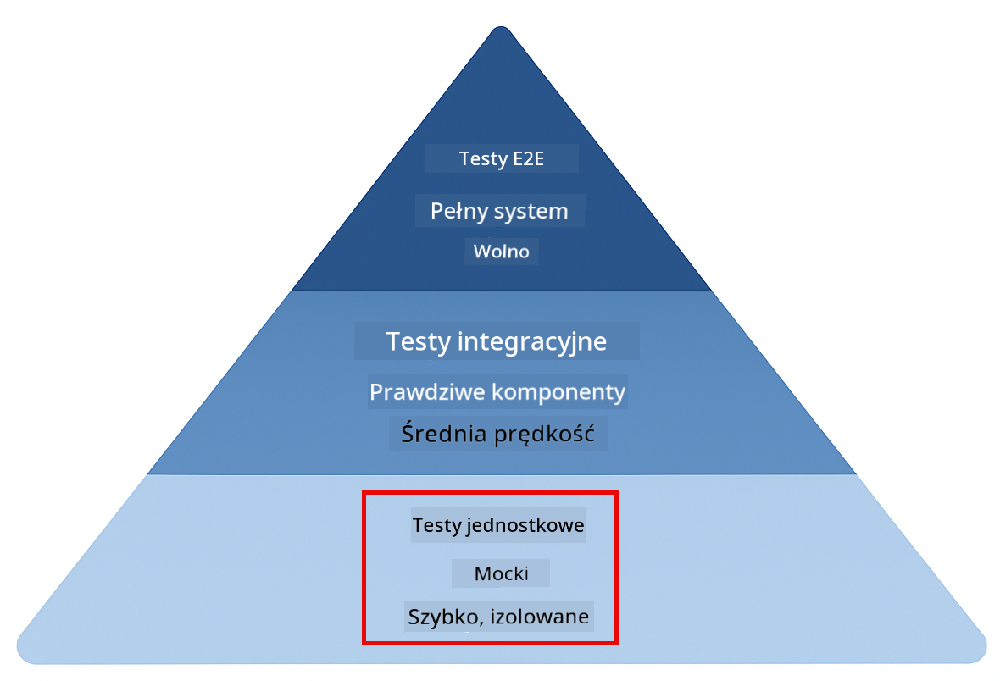
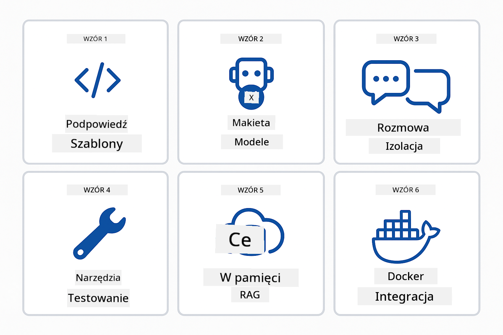
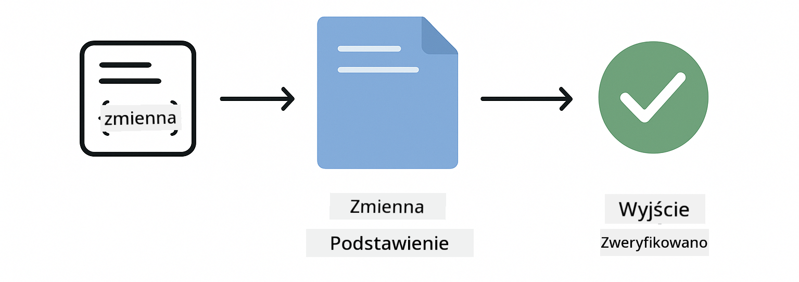
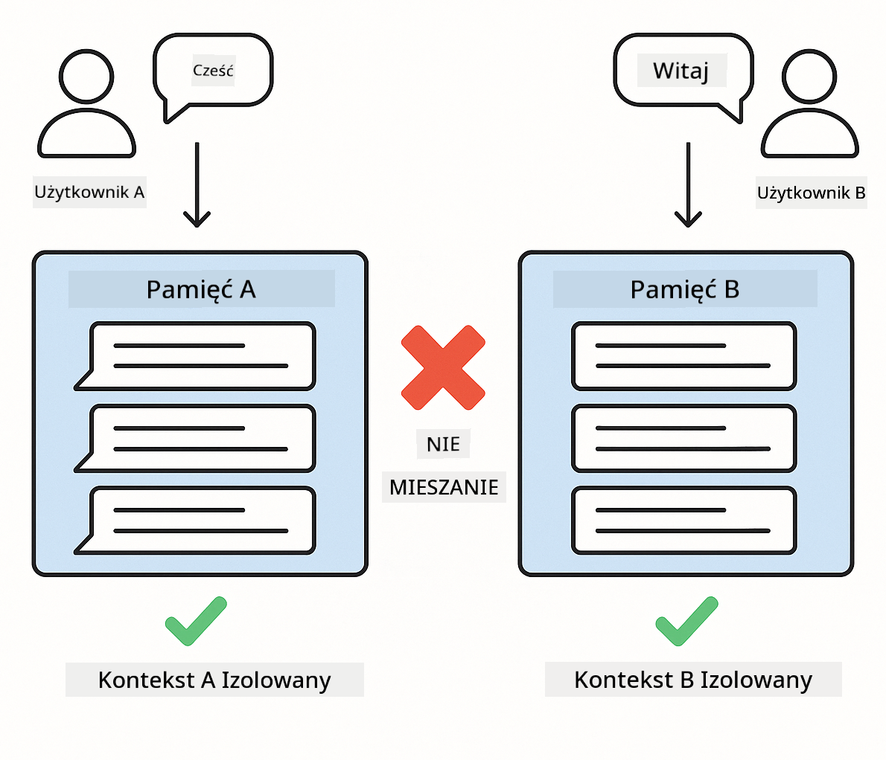
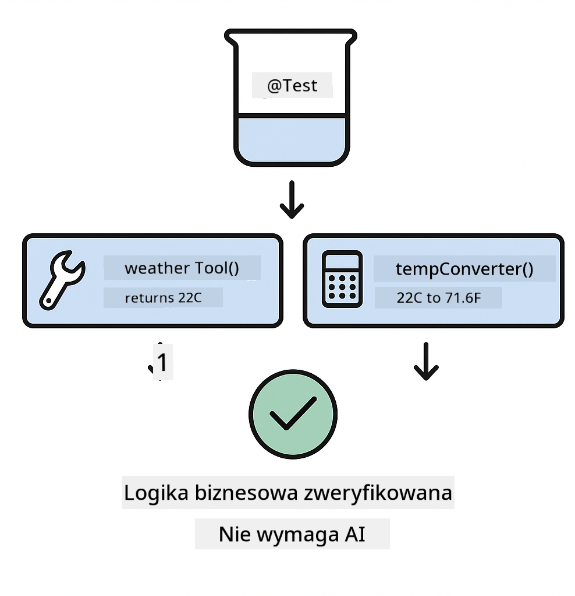
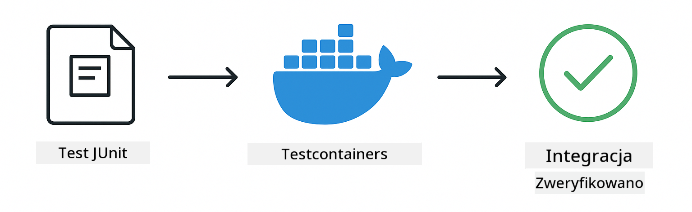

<!--
CO_OP_TRANSLATOR_METADATA:
{
  "original_hash": "b975537560c404d5f254331832811e78",
  "translation_date": "2025-12-13T21:00:11+00:00",
  "source_file": "docs/TESTING.md",
  "language_code": "pl"
}
-->
# Testowanie aplikacji LangChain4j

## Spis treści

- [Szybki start](../../../docs)
- [Co obejmują testy](../../../docs)
- [Uruchamianie testów](../../../docs)
- [Uruchamianie testów w VS Code](../../../docs)
- [Wzorce testowania](../../../docs)
- [Filozofia testowania](../../../docs)
- [Kolejne kroki](../../../docs)

Ten przewodnik przeprowadzi Cię przez testy, które pokazują, jak testować aplikacje AI bez konieczności posiadania kluczy API lub korzystania z usług zewnętrznych.

## Szybki start

Uruchom wszystkie testy jednym poleceniem:

**Bash:**
```bash
mvn test
```

**PowerShell:**
```powershell
mvn --% test
```


*Pomyślne wykonanie testów pokazujące, że wszystkie testy przeszły bez błędów*

## Co obejmują testy

Ten kurs koncentruje się na **testach jednostkowych**, które uruchamiane są lokalnie. Każdy test demonstruje konkretną koncepcję LangChain4j w izolacji.



*Piramida testowania pokazująca równowagę między testami jednostkowymi (szybkie, izolowane), testami integracyjnymi (prawdziwe komponenty) oraz testami end-to-end (pełny system z Dockerem). To szkolenie obejmuje testowanie jednostkowe.*

| Moduł | Testy | Skupienie | Kluczowe pliki |
|--------|-------|-------|-----------|
| **00 - Szybki start** | 6 | Szablony promptów i podstawienie zmiennych | `SimpleQuickStartTest.java` |
| **01 - Wprowadzenie** | 8 | Pamięć konwersacji i stanowa rozmowa | `SimpleConversationTest.java` |
| **02 - Inżynieria promptów** | 12 | Wzorce GPT-5, poziomy chęci, strukturalny output | `SimpleGpt5PromptTest.java` |
| **03 - RAG** | 10 | Przetwarzanie dokumentów, embeddingi, wyszukiwanie podobieństw | `DocumentServiceTest.java` |
| **04 - Narzędzia** | 12 | Wywoływanie funkcji i łączenie narzędzi | `SimpleToolsTest.java` |
| **05 - MCP** | 15 | Model Context Protocol z Dockerem | `SimpleMcpTest.java`, `McpDockerTransportTest.java` |

## Uruchamianie testów

**Uruchom wszystkie testy z katalogu głównego:**

**Bash:**
```bash
mvn test
```

**PowerShell:**
```powershell
mvn --% test
```

**Uruchom testy dla konkretnego modułu:**

**Bash:**
```bash
cd 01-introduction && mvn test
# Lub z katalogu głównego
mvn test -pl 01-introduction
```

**PowerShell:**
```powershell
cd 01-introduction; mvn --% test
# Lub z katalogu głównego
mvn --% test -pl 01-introduction
```

**Uruchom pojedynczą klasę testową:**

**Bash:**
```bash
mvn test -Dtest=SimpleConversationTest
```

**PowerShell:**
```powershell
mvn --% test -Dtest=SimpleConversationTest
```

**Uruchom konkretną metodę testową:**

**Bash:**
```bash
mvn test -Dtest=SimpleConversationTest#powinnoUtrzymywaćHistorięRozmowy
```

**PowerShell:**
```powershell
mvn --% test -Dtest=SimpleConversationTest#powinnoZachowaćHistorięRozmowy
```

## Uruchamianie testów w VS Code

Jeśli używasz Visual Studio Code, Test Explorer zapewnia graficzny interfejs do uruchamiania i debugowania testów.


*Test Explorer w VS Code pokazujący drzewo testów ze wszystkimi klasami testowymi Java i pojedynczymi metodami testowymi*

**Aby uruchomić testy w VS Code:**

1. Otwórz Test Explorer klikając ikonę kolby w pasku aktywności
2. Rozwiń drzewo testów, aby zobaczyć wszystkie moduły i klasy testowe
3. Kliknij przycisk odtwarzania obok dowolnego testu, aby uruchomić go pojedynczo
4. Kliknij "Run All Tests", aby wykonać cały zestaw
5. Kliknij prawym przyciskiem myszy dowolny test i wybierz "Debug Test", aby ustawić punkty przerwania i krokować po kodzie

Test Explorer pokazuje zielone znaczniki dla testów, które przeszły, oraz szczegółowe komunikaty o błędach, gdy testy nie przejdą.

## Wzorce testowania



*Sześć wzorców testowania aplikacji LangChain4j: szablony promptów, mockowanie modeli, izolacja konwersacji, testowanie narzędzi, RAG w pamięci oraz integracja z Dockerem*

### Wzorzec 1: Testowanie szablonów promptów

Najprostszy wzorzec testuje szablony promptów bez wywoływania żadnego modelu AI. Weryfikujesz, czy podstawianie zmiennych działa poprawnie i czy prompt jest sformatowany zgodnie z oczekiwaniami.



*Testowanie szablonów promptów pokazujące przepływ podstawiania zmiennych: szablon z miejscami na zmienne → zastosowanie wartości → weryfikacja sformatowanego outputu*

```java
@Test
@DisplayName("Should format prompt template with variables")
void testPromptTemplateFormatting() {
    PromptTemplate template = PromptTemplate.from(
        "Best time to visit {{destination}} for {{activity}}?"
    );
    
    Prompt prompt = template.apply(Map.of(
        "destination", "Paris",
        "activity", "sightseeing"
    ));
    
    assertThat(prompt.text()).isEqualTo("Best time to visit Paris for sightseeing?");
}
```

Ten test znajduje się w `00-quick-start/src/test/java/com/example/langchain4j/quickstart/SimpleQuickStartTest.java`.

**Uruchom go:**

**Bash:**
```bash
cd 00-quick-start && mvn test -Dtest=SimpleQuickStartTest#testowanieFormatowaniaSzablonuPromptu
```

**PowerShell:**
```powershell
cd 00-quick-start; mvn --% test -Dtest=SimpleQuickStartTest#testowanieFormatowaniaSzablonuPromptu
```

### Wzorzec 2: Mockowanie modeli językowych

Podczas testowania logiki konwersacji użyj Mockito do tworzenia fałszywych modeli, które zwracają z góry ustalone odpowiedzi. Dzięki temu testy są szybkie, darmowe i deterministyczne.


*Porównanie pokazujące, dlaczego mocki są preferowane do testowania: są szybkie, darmowe, deterministyczne i nie wymagają kluczy API*

```java
@ExtendWith(MockitoExtension.class)
class SimpleConversationTest {
    
    private ConversationService conversationService;
    
    @Mock
    private OpenAiOfficialChatModel mockChatModel;
    
    @BeforeEach
    void setUp() {
        ChatResponse mockResponse = ChatResponse.builder()
            .aiMessage(AiMessage.from("This is a test response"))
            .build();
        when(mockChatModel.chat(anyList())).thenReturn(mockResponse);
        
        conversationService = new ConversationService(mockChatModel);
    }
    
    @Test
    void shouldMaintainConversationHistory() {
        String conversationId = conversationService.startConversation();
        
        ChatResponse mockResponse1 = ChatResponse.builder()
            .aiMessage(AiMessage.from("Response 1"))
            .build();
        ChatResponse mockResponse2 = ChatResponse.builder()
            .aiMessage(AiMessage.from("Response 2"))
            .build();
        ChatResponse mockResponse3 = ChatResponse.builder()
            .aiMessage(AiMessage.from("Response 3"))
            .build();
        
        when(mockChatModel.chat(anyList()))
            .thenReturn(mockResponse1)
            .thenReturn(mockResponse2)
            .thenReturn(mockResponse3);

        conversationService.chat(conversationId, "First message");
        conversationService.chat(conversationId, "Second message");
        conversationService.chat(conversationId, "Third message");

        List<ChatMessage> history = conversationService.getHistory(conversationId);
        assertThat(history).hasSize(6); // 3 wiadomości od użytkownika + 3 wiadomości od AI
    }
}
```

Ten wzorzec pojawia się w `01-introduction/src/test/java/com/example/langchain4j/service/SimpleConversationTest.java`. Mock zapewnia spójne zachowanie, dzięki czemu możesz zweryfikować poprawność zarządzania pamięcią.

### Wzorzec 3: Testowanie izolacji konwersacji

Pamięć konwersacji musi utrzymywać oddzielne dane dla wielu użytkowników. Ten test weryfikuje, że konwersacje nie mieszają kontekstów.



*Testowanie izolacji konwersacji pokazujące oddzielne magazyny pamięci dla różnych użytkowników, aby zapobiec mieszaniu kontekstów*

```java
@Test
void shouldIsolateConversationsByid() {
    String conv1 = conversationService.startConversation();
    String conv2 = conversationService.startConversation();
    
    ChatResponse mockResponse = ChatResponse.builder()
        .aiMessage(AiMessage.from("Response"))
        .build();
    when(mockChatModel.chat(anyList())).thenReturn(mockResponse);

    conversationService.chat(conv1, "Message for conversation 1");
    conversationService.chat(conv2, "Message for conversation 2");

    List<ChatMessage> history1 = conversationService.getHistory(conv1);
    List<ChatMessage> history2 = conversationService.getHistory(conv2);
    
    assertThat(history1).hasSize(2);
    assertThat(history2).hasSize(2);
}
```

Każda konwersacja utrzymuje własną niezależną historię. W systemach produkcyjnych ta izolacja jest kluczowa dla aplikacji wieloużytkownikowych.

### Wzorzec 4: Testowanie narzędzi niezależnie

Narzędzia to funkcje, które AI może wywoływać. Testuj je bezpośrednio, aby upewnić się, że działają poprawnie niezależnie od decyzji AI.



*Testowanie narzędzi niezależnie pokazujące wykonanie mockowanego narzędzia bez wywołań AI, aby zweryfikować logikę biznesową*

```java
@Test
void shouldConvertCelsiusToFahrenheit() {
    TemperatureTool tempTool = new TemperatureTool();
    String result = tempTool.celsiusToFahrenheit(25.0);
    assertThat(result).containsPattern("77[.,]0°F");
}

@Test
void shouldDemonstrateToolChaining() {
    WeatherTool weatherTool = new WeatherTool();
    TemperatureTool tempTool = new TemperatureTool();

    String weatherResult = weatherTool.getCurrentWeather("Seattle");
    assertThat(weatherResult).containsPattern("\\d+°C");

    String conversionResult = tempTool.celsiusToFahrenheit(22.0);
    assertThat(conversionResult).containsPattern("71[.,]6°F");
}
```

Te testy z `04-tools/src/test/java/com/example/langchain4j/agents/tools/SimpleToolsTest.java` weryfikują logikę narzędzi bez udziału AI. Przykład łańcuchowania pokazuje, jak output jednego narzędzia jest wejściem dla innego.

### Wzorzec 5: Testowanie RAG w pamięci

Systemy RAG tradycyjnie wymagają baz wektorowych i usług embeddingów. Wzorzec w pamięci pozwala testować cały pipeline bez zewnętrznych zależności.


*Testowanie RAG w pamięci pokazujące przetwarzanie dokumentów, przechowywanie embeddingów i wyszukiwanie podobieństw bez potrzeby bazy danych*

```java
@Test
void testProcessTextDocument() {
    String content = "This is a test document.\nIt has multiple lines.";
    InputStream inputStream = new ByteArrayInputStream(content.getBytes(StandardCharsets.UTF_8));
    
    DocumentService.ProcessedDocument result = 
        documentService.processDocument(inputStream, "test.txt");

    assertNotNull(result);
    assertTrue(result.segments().size() > 0);
    assertEquals("test.txt", result.segments().get(0).metadata().getString("filename"));
}
```

Ten test z `03-rag/src/test/java/com/example/langchain4j/rag/service/DocumentServiceTest.java` tworzy dokument w pamięci i weryfikuje dzielenie na fragmenty oraz obsługę metadanych.

### Wzorzec 6: Testowanie integracyjne z Dockerem

Niektóre funkcje wymagają prawdziwej infrastruktury. Moduł MCP używa Testcontainers do uruchamiania kontenerów Docker podczas testów integracyjnych. Testy te weryfikują, że Twój kod działa z rzeczywistymi usługami, zachowując izolację testów.



*Testowanie integracyjne MCP z Testcontainers pokazujące automatyczny cykl życia kontenera: start, wykonanie testów, zatrzymanie i sprzątanie*

Testy w `05-mcp/src/test/java/com/example/langchain4j/mcp/McpDockerTransportTest.java` wymagają uruchomionego Dockera.

**Uruchom je:**

**Bash:**
```bash
cd 05-mcp && mvn test
```

**PowerShell:**
```powershell
cd 05-mcp; mvn --% test
```

## Filozofia testowania

Testuj swój kod, nie AI. Twoje testy powinny weryfikować kod, który piszesz, sprawdzając, jak konstruowane są prompt, jak zarządzana jest pamięć i jak działają narzędzia. Odpowiedzi AI są zmienne i nie powinny być częścią asercji testowych. Zadaj sobie pytanie, czy Twój szablon promptu poprawnie podstawia zmienne, a nie czy AI daje poprawną odpowiedź.

Używaj mocków dla modeli językowych. To zewnętrzne zależności, które są wolne, kosztowne i niedeterministyczne. Mockowanie sprawia, że testy są szybkie (milisekundy zamiast sekund), darmowe (bez kosztów API) i deterministyczne (ten sam wynik za każdym razem).

Utrzymuj testy niezależne. Każdy test powinien samodzielnie przygotować dane, nie polegać na innych testach i sprzątać po sobie. Testy powinny przechodzić niezależnie od kolejności wykonywania.

Testuj przypadki brzegowe poza ścieżką szczęśliwą. Sprawdzaj puste dane wejściowe, bardzo duże dane, znaki specjalne, nieprawidłowe parametry i warunki graniczne. Często ujawniają one błędy, których normalne użycie nie wykrywa.

Używaj opisowych nazw. Porównaj `shouldMaintainConversationHistoryAcrossMultipleMessages()` z `test1()`. Pierwsza nazwa dokładnie mówi, co jest testowane, co ułatwia debugowanie błędów.

## Kolejne kroki

Teraz, gdy znasz wzorce testowania, zagłęb się w każdy moduł:

- **[00 - Szybki start](../00-quick-start/README.md)** - Zacznij od podstaw szablonów promptów
- **[01 - Wprowadzenie](../01-introduction/README.md)** - Naucz się zarządzania pamięcią konwersacji
- **[02 - Inżynieria promptów](../02-prompt-engineering/README.md)** - Opanuj wzorce promptów GPT-5
- **[03 - RAG](../03-rag/README.md)** - Buduj systemy generacji wspomaganej wyszukiwaniem
- **[04 - Narzędzia](../04-tools/README.md)** - Implementuj wywoływanie funkcji i łańcuchy narzędzi
- **[05 - MCP](../05-mcp/README.md)** - Integruj Model Context Protocol z Dockerem

README każdego modułu zawiera szczegółowe wyjaśnienia koncepcji testowanych tutaj.

---

**Nawigacja:** [← Powrót do głównej](../README.md)

---

<!-- CO-OP TRANSLATOR DISCLAIMER START -->
**Zastrzeżenie**:  
Niniejszy dokument został przetłumaczony za pomocą usługi tłumaczenia AI [Co-op Translator](https://github.com/Azure/co-op-translator). Mimo że dokładamy starań, aby tłumaczenie było jak najbardziej precyzyjne, prosimy mieć na uwadze, że automatyczne tłumaczenia mogą zawierać błędy lub nieścisłości. Oryginalny dokument w języku źródłowym powinien być uznawany za źródło autorytatywne. W przypadku informacji krytycznych zalecane jest skorzystanie z profesjonalnego tłumaczenia wykonanego przez człowieka. Nie ponosimy odpowiedzialności za jakiekolwiek nieporozumienia lub błędne interpretacje wynikające z korzystania z tego tłumaczenia.
<!-- CO-OP TRANSLATOR DISCLAIMER END -->