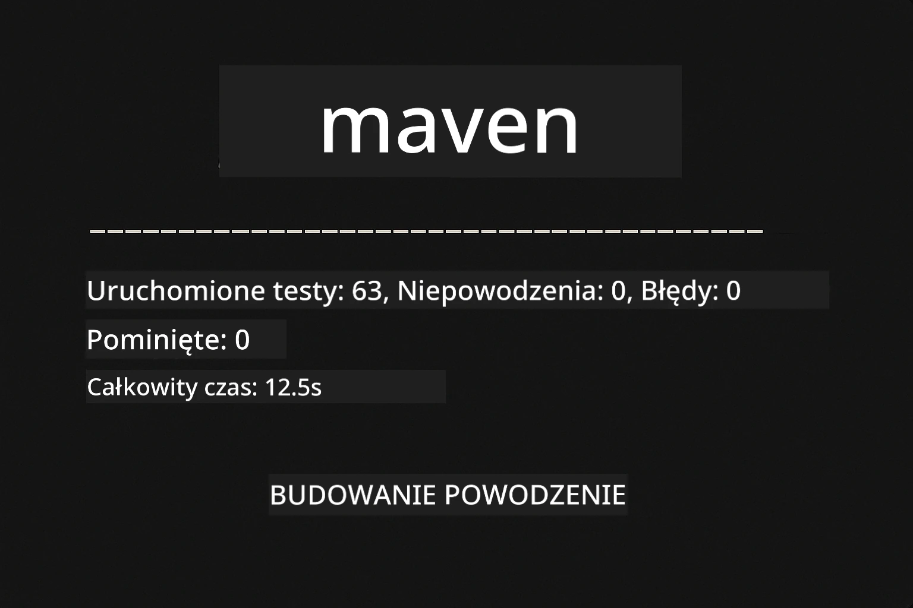
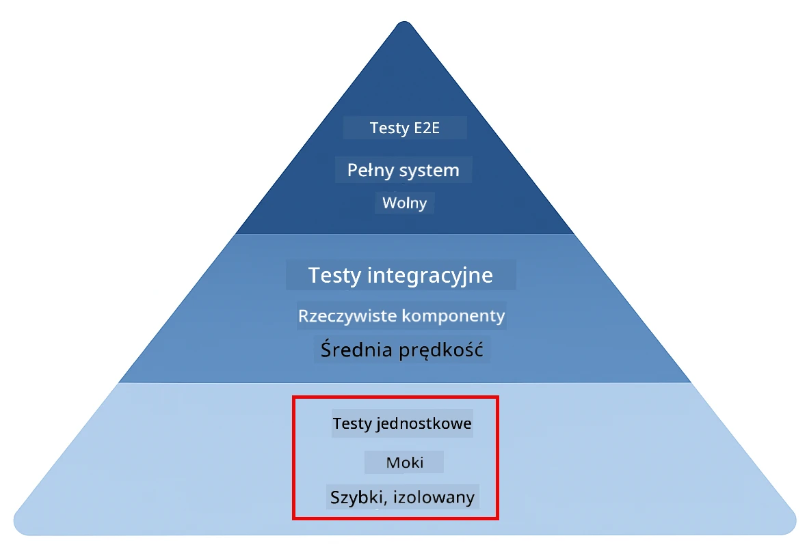
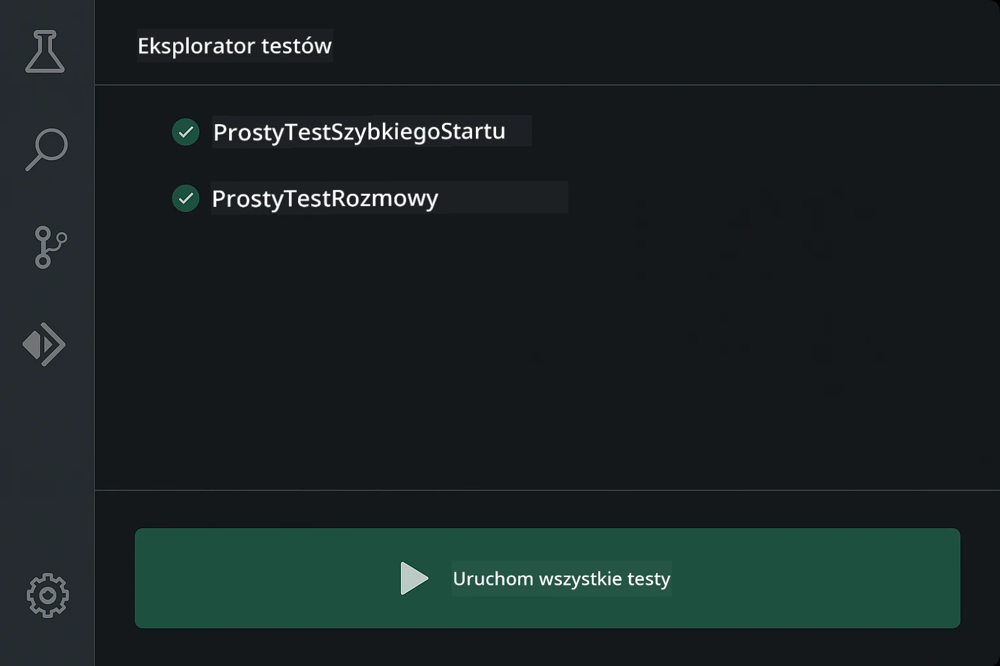
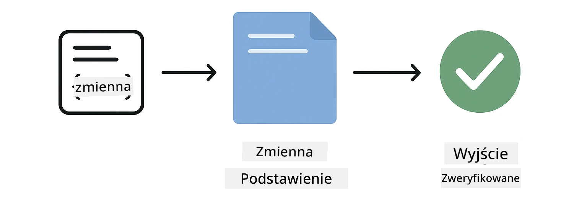
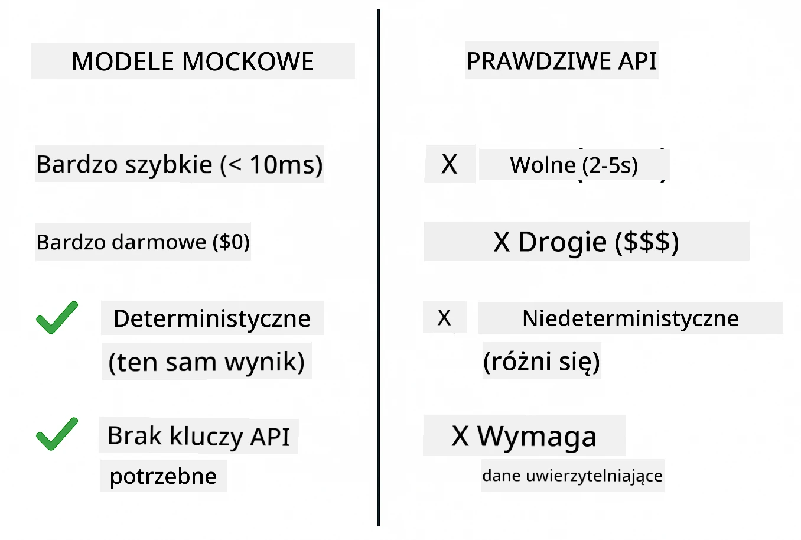
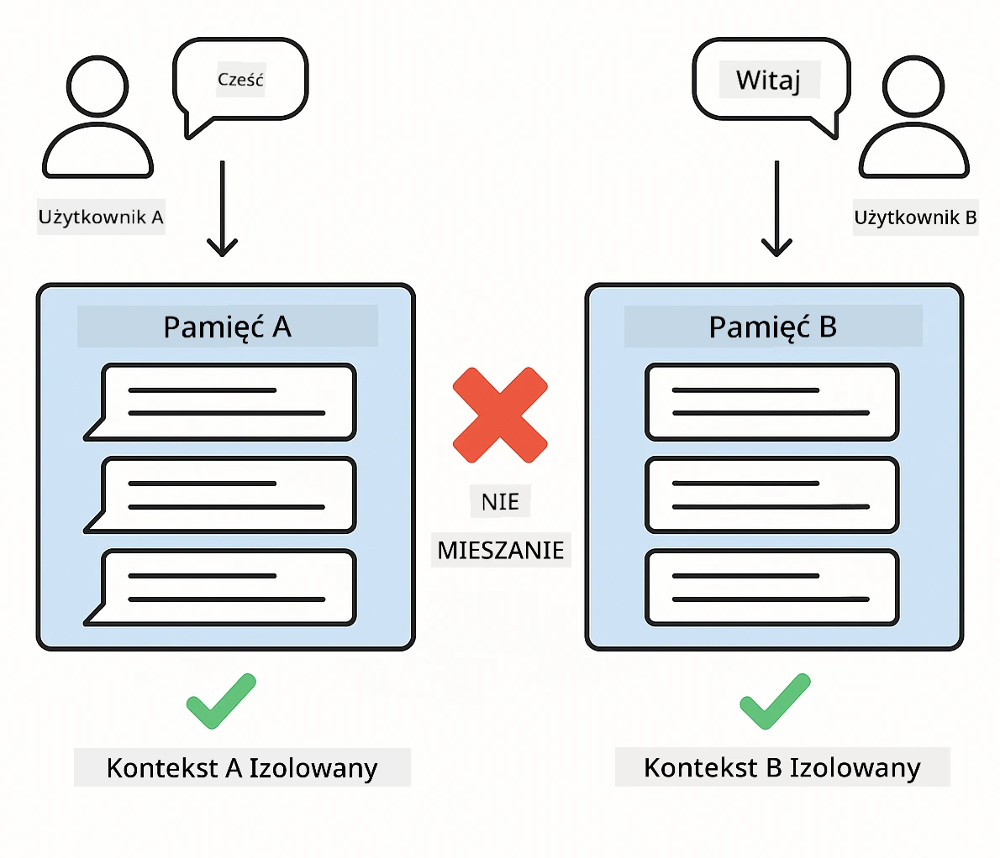
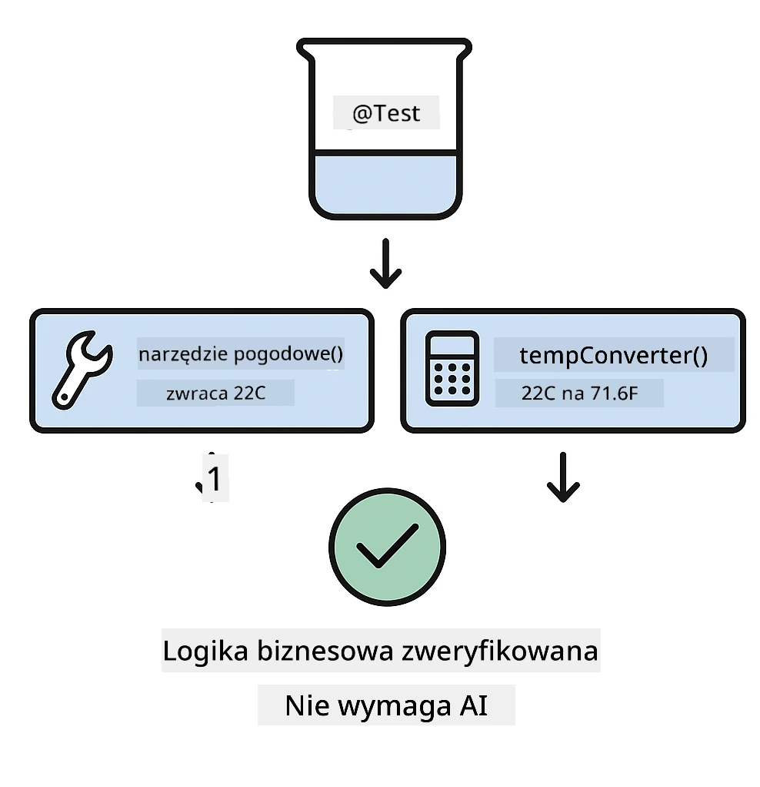
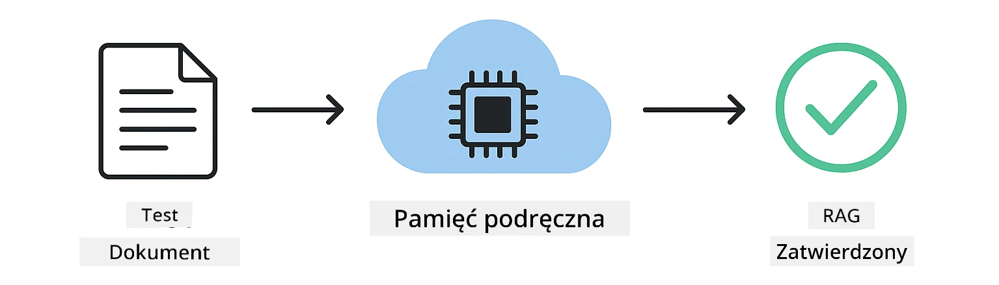

# Testowanie aplikacji LangChain4j

## Spis treści

- [Szybki start](#szybki-start)
- [Co obejmują testy](#co-obejmują-testy)
- [Uruchamianie testów](#uruchamianie-testów)
- [Uruchamianie testów w VS Code](#uruchamianie-testów-w-vs-code)
- [Wzorce testowe](#wzorce-testowe)
- [Filozofia testowania](#filozofia-testowania)
- [Kolejne kroki](#kolejne-kroki)

Ten przewodnik przeprowadzi Cię przez testy, które pokazują, jak testować aplikacje AI bez potrzeby kluczy API lub usług zewnętrznych.

## Szybki start

Uruchom wszystkie testy za pomocą jednego polecenia:

**Bash:**
```bash
mvn test
```

**PowerShell:**
```powershell
mvn --% test
```

Gdy wszystkie testy zakończą się sukcesem, zobaczysz wyjście podobne do zrzutu ekranu poniżej — testy uruchomione bez żadnych błędów.



*Udane wykonanie testów pokazujące, że wszystkie testy przeszły bez błędów*

## Co obejmują testy

Ten kurs skupia się na **testach jednostkowych** uruchamianych lokalnie. Każdy test demonstruje konkretną koncepcję LangChain4j w izolacji. Poniższa piramida testowa pokazuje, gdzie mieszczą się testy jednostkowe — stanowią one szybkie, niezawodne podstawy, na których opiera się reszta strategii testowej.



*Piramida testowa pokazująca równowagę między testami jednostkowymi (szybkie, izolowane), testami integracyjnymi (rzeczywiste komponenty) oraz testami end-to-end. To szkolenie obejmuje testy jednostkowe.*

| Moduł | Testy | Skupienie | Kluczowe pliki |
|--------|-------|-------|-----------|
| **01 - Wprowadzenie** | 8 | Pamięć rozmowy i stan czatu | `SimpleConversationTest.java` |
| **02 - Inżynieria podpowiedzi** | 12 | Wzorce GPT-5.2, poziomy gotowości, ustrukturyzowany output | `SimpleGpt5PromptTest.java` |
| **03 - RAG** | 10 | Wczytywanie dokumentów, osadzanie, wyszukiwanie podobieństw | `DocumentServiceTest.java` |
| **04 - Narzędzia** | 12 | Wywoływanie funkcji i łączenie narzędzi | `SimpleToolsTest.java` |
| **05 - MCP** | 8 | Protokoły kontekstu modelu z transportem stdio | `SimpleMcpTest.java` |

## Uruchamianie testów

**Uruchom wszystkie testy z katalogu głównego:**

**Bash:**
```bash
mvn test
```

**PowerShell:**
```powershell
mvn --% test
```

**Uruchom testy dla określonego modułu:**

**Bash:**
```bash
cd 01-introduction && mvn test
# Lub od katalogu głównego
mvn test -pl 01-introduction
```

**PowerShell:**
```powershell
cd 01-introduction; mvn --% test
# Lub z root
mvn --% test -pl 01-introduction
```

**Uruchom pojedynczą klasę testową:**

**Bash:**
```bash
mvn test -Dtest=SimpleConversationTest
```

**PowerShell:**
```powershell
mvn --% test -Dtest=SimpleConversationTest
```

**Uruchom konkretną metodę testową:**

**Bash:**
```bash
mvn test -Dtest=SimpleConversationTest#powinnoUtrzymywaćHistorięKonwersacji
```

**PowerShell:**
```powershell
mvn --% test -Dtest=SimpleConversationTest#powinnoZachowaćHistorięKonwersacji
```

## Uruchamianie testów w VS Code

Jeśli używasz Visual Studio Code, Eksplorator testów zapewnia graficzny interfejs do uruchamiania i debugowania testów.



*Eksplorator testów VS Code pokazujący drzewo testów ze wszystkimi klasami testów Java i poszczególnymi metodami testowymi*

**Aby uruchomić testy w VS Code:**

1. Otwórz Eksplorator testów, klikając ikonę zlewki na pasku aktywności
2. Rozwiń drzewo testów, aby zobaczyć wszystkie moduły i klasy testowe
3. Kliknij przycisk odtwarzania obok dowolnego testu, aby uruchomić go pojedynczo
4. Kliknij „Run All Tests”, aby wykonać cały zestaw testów
5. Kliknij prawym przyciskiem dowolny test i wybierz „Debug Test”, aby ustawić punkty przerwania i krokować po kodzie

Eksplorator testów pokazuje zielone znaczniki dla zaliczonych testów i dostarcza szczegółowych komunikatów o niepowodzeniach, gdy testy zawiodą.

## Wzorce testowe

### Wzorzec 1: Testowanie szablonów podpowiedzi

Najprostszy wzorzec testuje szablony podpowiedzi bez wywoływania modelu AI. Weryfikujesz, czy substytucja zmiennych działa poprawnie oraz czy podpowiedzi są sformatowane zgodnie z oczekiwaniami.



*Testowanie szablonów podpowiedzi pokazujące przepływ substytucji zmiennych: szablon z placeholderami → wprowadzone wartości → zweryfikowany sformatowany wynik*

```java
@Test
@DisplayName("Should format prompt template with variables")
void testPromptTemplateFormatting() {
    PromptTemplate template = PromptTemplate.from(
        "Best time to visit {{destination}} for {{activity}}?"
    );
    
    Prompt prompt = template.apply(Map.of(
        "destination", "Paris",
        "activity", "sightseeing"
    ));
    
    assertThat(prompt.text()).isEqualTo("Best time to visit Paris for sightseeing?");
}
```

Ten wzorzec weryfikuje, że substytucja zmiennych działa poprawnie, a podpowiedzi są sformatowane zgodnie z oczekiwaniami — nie wymaga klucza API ani wywołania modelu.

### Wzorzec 2: Mockowanie modeli językowych

Podczas testowania logiki rozmowy użyj Mockito do tworzenia fałszywych modeli, które zwracają z góry ustalone odpowiedzi. Sprawia to, że testy są szybkie, darmowe i deterministyczne.



*Porównanie pokazujące, dlaczego mocki są preferowane do testów: są szybkie, darmowe, deterministyczne i nie wymagają kluczy API*

```java
@ExtendWith(MockitoExtension.class)
class SimpleConversationTest {
    
    private ConversationService conversationService;
    
    @Mock
    private OpenAiOfficialChatModel mockChatModel;
    
    @BeforeEach
    void setUp() {
        ChatResponse mockResponse = ChatResponse.builder()
            .aiMessage(AiMessage.from("This is a test response"))
            .build();
        when(mockChatModel.chat(anyList())).thenReturn(mockResponse);
        
        conversationService = new ConversationService(mockChatModel);
    }
    
    @Test
    void shouldMaintainConversationHistory() {
        String conversationId = conversationService.startConversation();
        
        ChatResponse mockResponse1 = ChatResponse.builder()
            .aiMessage(AiMessage.from("Response 1"))
            .build();
        ChatResponse mockResponse2 = ChatResponse.builder()
            .aiMessage(AiMessage.from("Response 2"))
            .build();
        ChatResponse mockResponse3 = ChatResponse.builder()
            .aiMessage(AiMessage.from("Response 3"))
            .build();
        
        when(mockChatModel.chat(anyList()))
            .thenReturn(mockResponse1)
            .thenReturn(mockResponse2)
            .thenReturn(mockResponse3);

        conversationService.chat(conversationId, "First message");
        conversationService.chat(conversationId, "Second message");
        conversationService.chat(conversationId, "Third message");

        List<ChatMessage> history = conversationService.getHistory(conversationId);
        assertThat(history).hasSize(6); // 3 wiadomości od użytkownika + 3 wiadomości od AI
    }
}
```

Ten wzorzec pojawia się w `01-introduction/src/test/java/com/example/langchain4j/service/SimpleConversationTest.java`. Mock zapewnia spójne zachowanie, dzięki czemu można zweryfikować poprawność zarządzania pamięcią.

### Wzorzec 3: Testowanie izolacji konwersacji

Pamięć konwersacji musi oddzielać wielu użytkowników. Ten test weryfikuje, że rozmowy nie mieszają ze sobą kontekstów.



*Testowanie izolacji konwersacji pokazujące oddzielne magazyny pamięci dla różnych użytkowników, aby zapobiec mieszaniu kontekstów*

```java
@Test
void shouldIsolateConversationsByid() {
    String conv1 = conversationService.startConversation();
    String conv2 = conversationService.startConversation();
    
    ChatResponse mockResponse = ChatResponse.builder()
        .aiMessage(AiMessage.from("Response"))
        .build();
    when(mockChatModel.chat(anyList())).thenReturn(mockResponse);

    conversationService.chat(conv1, "Message for conversation 1");
    conversationService.chat(conv2, "Message for conversation 2");

    List<ChatMessage> history1 = conversationService.getHistory(conv1);
    List<ChatMessage> history2 = conversationService.getHistory(conv2);
    
    assertThat(history1).hasSize(2);
    assertThat(history2).hasSize(2);
}
```

Każda rozmowa utrzymuje własną, niezależną historię. W systemach produkcyjnych izolacja ta jest krytyczna dla aplikacji wieloużytkownikowych.

### Wzorzec 4: Testowanie narzędzi niezależnie

Narzędzia to funkcje, które AI może wywoływać. Testuj je bezpośrednio, aby upewnić się, że działają prawidłowo niezależnie od decyzji AI.



*Testowanie narzędzi niezależnie pokazujące wykonywanie mockowego narzędzia bez wywołań AI, w celu weryfikacji logiki biznesowej*

```java
@Test
void shouldConvertCelsiusToFahrenheit() {
    TemperatureTool tempTool = new TemperatureTool();
    String result = tempTool.celsiusToFahrenheit(25.0);
    assertThat(result).containsPattern("77[.,]0°F");
}

@Test
void shouldDemonstrateToolChaining() {
    WeatherTool weatherTool = new WeatherTool();
    TemperatureTool tempTool = new TemperatureTool();

    String weatherResult = weatherTool.getCurrentWeather("Seattle");
    assertThat(weatherResult).containsPattern("\\d+°C");

    String conversionResult = tempTool.celsiusToFahrenheit(22.0);
    assertThat(conversionResult).containsPattern("71[.,]6°F");
}
```

Te testy z `04-tools/src/test/java/com/example/langchain4j/agents/tools/SimpleToolsTest.java` walidują logikę narzędzi bez udziału AI. Przykład łańcuchowania pokazuje, jak output jednego narzędzia jest przekazywany jako input do drugiego.

### Wzorzec 5: Testowanie RAG w pamięci

Systemy RAG tradycyjnie wymagają baz danych wektorowych i usług osadzania. Wzorzec w pamięci pozwala testować cały pipeline bez zależności zewnętrznych.



*Przepływ testowania RAG w pamięci pokazujący analizę dokumentów, przechowywanie osadzeń i wyszukiwanie podobieństw bez konieczności używania bazy danych*

```java
@Test
void testProcessTextDocument() {
    String content = "This is a test document.\nIt has multiple lines.";
    InputStream inputStream = new ByteArrayInputStream(content.getBytes(StandardCharsets.UTF_8));
    
    DocumentService.ProcessedDocument result = 
        documentService.processDocument(inputStream, "test.txt");

    assertNotNull(result);
    assertTrue(result.segments().size() > 0);
    assertEquals("test.txt", result.segments().get(0).metadata().getString("filename"));
}
```

Ten test z `03-rag/src/test/java/com/example/langchain4j/rag/service/DocumentServiceTest.java` tworzy dokument w pamięci i weryfikuje dzielenie na fragmenty oraz obsługę metadanych.

### Wzorzec 6: Testowanie integracji MCP

Moduł MCP testuje integrację Model Context Protocol za pomocą transportu stdio. Testy te weryfikują, że Twoja aplikacja może uruchamiać i komunikować się z serwerami MCP jako procesami podrzędnymi.

Testy w `05-mcp/src/test/java/com/example/langchain4j/mcp/SimpleMcpTest.java` walidują zachowanie klienta MCP.

**Uruchom je:**

**Bash:**
```bash
cd 05-mcp && mvn test
```

**PowerShell:**
```powershell
cd 05-mcp; mvn --% test
```

## Filozofia testowania

Testuj swój kod, a nie AI. Twoje testy powinny weryfikować kod, który piszesz, poprzez sprawdzenie, jak budowane są podpowiedzi, jak zarządzana jest pamięć i jak działają narzędzia. Odpowiedzi AI są zmienne i nie powinny stanowić części asercji testów. Pytaj siebie, czy szablon podpowiedzi poprawnie zastępuje zmienne, a nie czy AI podaje właściwą odpowiedź.

Używaj mocków dla modeli językowych. Są to zależności zewnętrzne, które są wolne, kosztowne i nie deterministyczne. Mockowanie sprawia, że testy są szybkie (milisekundy zamiast sekund), darmowe (bez kosztów API) oraz deterministyczne (ten sam wynik za każdym razem).

Utrzymuj testy niezależne. Każdy test powinien sam przygotować swoje dane, nie polegać na innych testach i sprzątać po sobie. Testy powinny przechodzić bez względu na kolejność wykonywania.

Testuj również przypadki brzegowe, nie tylko ścieżkę szczęścia. Sprawdzaj puste dane, bardzo duże dane, znaki specjalne, nieprawidłowe parametry i warunki graniczne. Często to właśnie one ujawniają błędy, których normalne użycie nie wykrywa.

Używaj opisowych nazw. Porównaj `shouldMaintainConversationHistoryAcrossMultipleMessages()` z `test1()`. Pierwsza dokładnie mówi, co jest testowane, co znacznie ułatwia debugowanie błędów.

## Kolejne kroki

Teraz, gdy znasz wzorce testowe, zagłęb się w każdy moduł:

- **[01 - Wprowadzenie](../01-introduction/README.md)** - Naucz się zarządzania pamięcią rozmowy
- **[02 - Inżynieria podpowiedzi](../02/prompt-engineering/README.md)** - Opanuj wzorce podpowiedzi GPT-5.2
- **[03 - RAG](../03-rag/README.md)** - Buduj systemy wzbogacania generowania o odzyskiwanie danych
- **[04 - Narzędzia](../04-tools/README.md)** - Implementuj wywoływanie funkcji i łańcuchy narzędzi
- **[05 - MCP](../05-mcp/README.md)** - Integruj Model Context Protocol

Pliki README każdego modułu zawierają szczegółowe wyjaśnienia koncepcji testowanych tutaj.

---

**Nawigacja:** [← Powrót do głównej](../README.md)

---

<!-- CO-OP TRANSLATOR DISCLAIMER START -->
**Zastrzeżenie**:
Niniejszy dokument został przetłumaczony za pomocą usługi tłumaczenia AI [Co-op Translator](https://github.com/Azure/co-op-translator). Choć dążymy do dokładności, prosimy pamiętać, że automatyczne tłumaczenia mogą zawierać błędy lub niedokładności. Oryginalny dokument w jego języku źródłowym należy uznawać za autorytatywne źródło. W przypadku informacji krytycznych zalecane jest skorzystanie z profesjonalnego tłumaczenia wykonanego przez człowieka. Nie ponosimy odpowiedzialności za jakiekolwiek nieporozumienia lub błędne interpretacje wynikające z użycia tego tłumaczenia.
<!-- CO-OP TRANSLATOR DISCLAIMER END -->