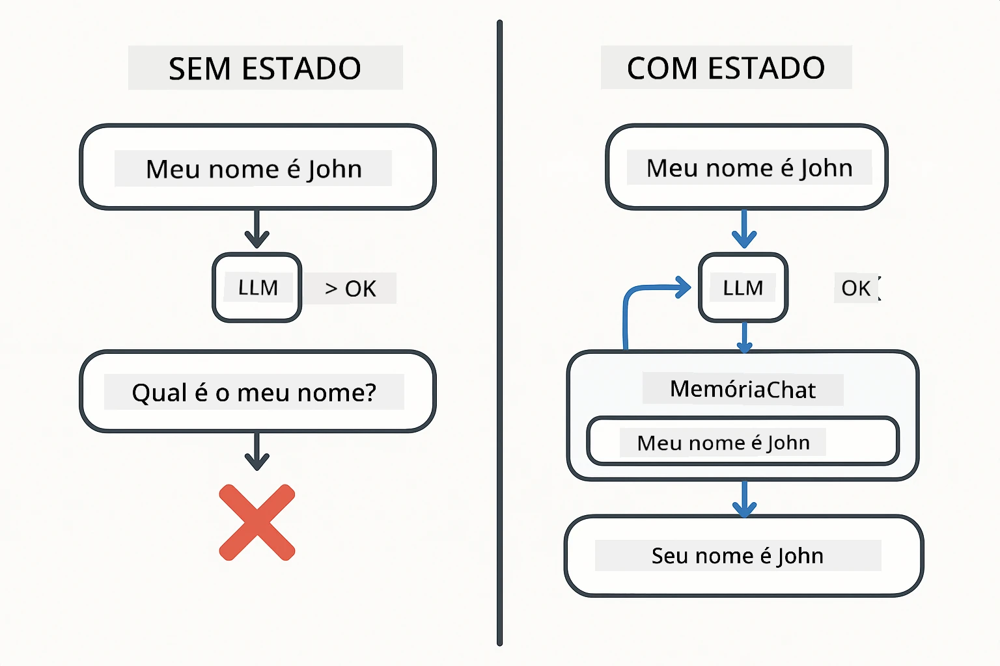
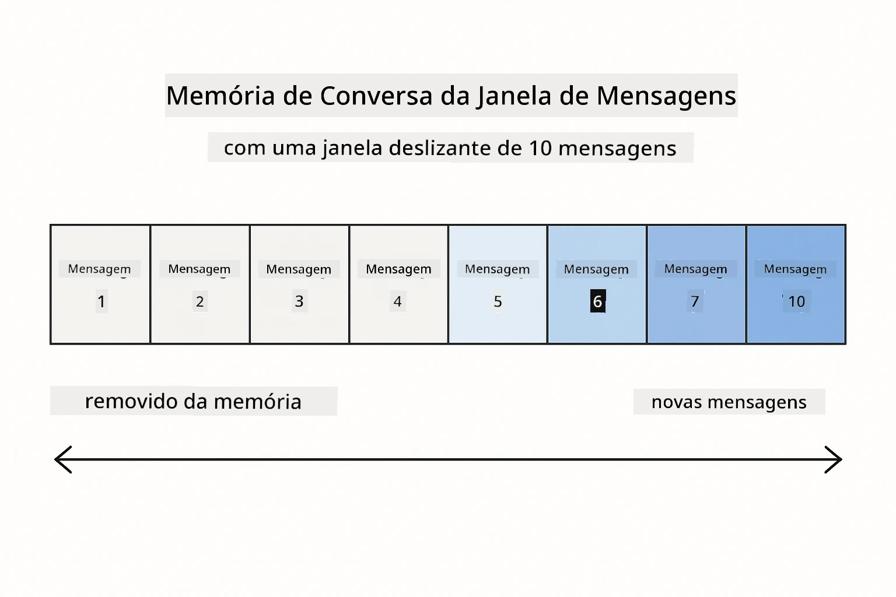
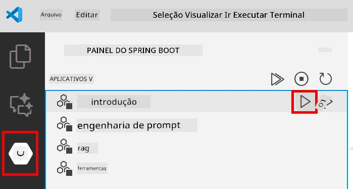
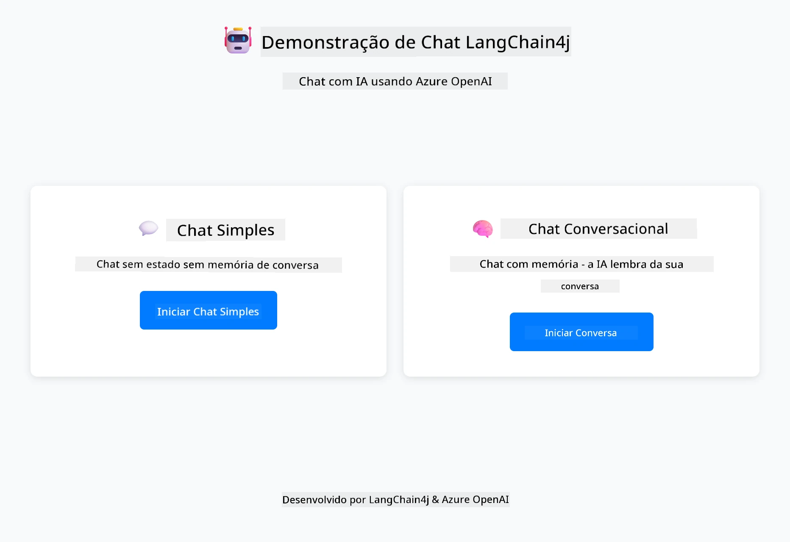
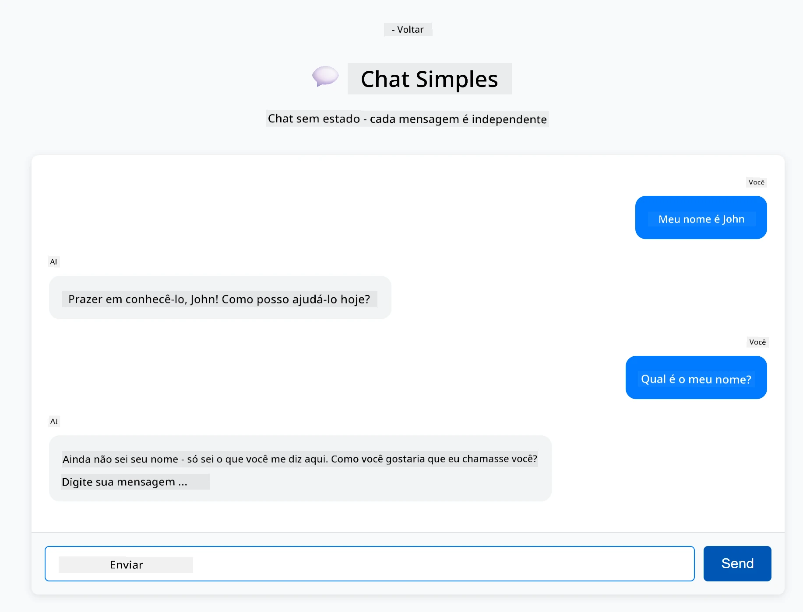
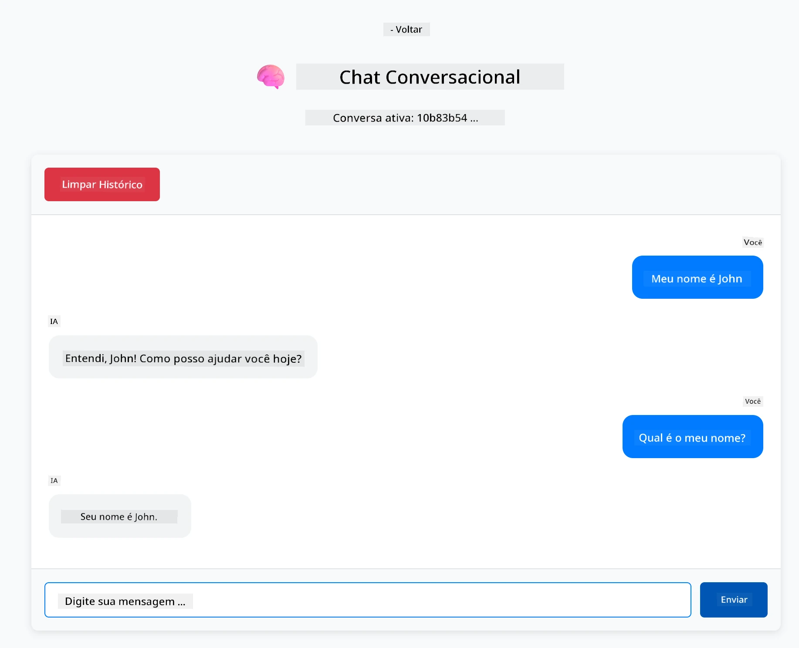

# Module 01: Começando com LangChain4j

## Table of Contents

- [Video Walkthrough](#video-walkthrough)
- [What You'll Learn](#what-youll-learn)
- [Prerequisites](#prerequisites)
- [Understanding the Core Problem](#understanding-the-core-problem)
- [Understanding Tokens](#understanding-tokens)
- [How Memory Works](#how-memory-works)
- [How This Uses LangChain4j](#how-this-uses-langchain4j)
- [Deploy Azure OpenAI Infrastructure](#deploy-azure-openai-infrastructure)
- [Run the Application Locally](#run-the-application-locally)
- [Using the Application](#using-the-application)
  - [Stateless Chat (Left Panel)](#stateless-chat-left-panel)
  - [Stateful Chat (Right Panel)](#stateful-chat-right-panel)
- [Next Steps](#next-steps)

## Video Walkthrough

Assista a esta sessão ao vivo que explica como começar com este módulo:

<a href="https://www.youtube.com/live/nl_troDm8rQ?si=6b85S8xGjWnT2fX9"></a>

## What You'll Learn

Este é seu ponto de partida com LangChain4j e Azure OpenAI. Começamos com os fundamentos e começamos a construir aplicações no estilo de produção. Este módulo foca em IA conversacional que lembra o contexto e mantém estado — os conceitos fundamentais que todos os módulos posteriores constroem.

Usaremos o GPT-5.2 do Azure OpenAI em todo este guia porque suas capacidades avançadas de raciocínio tornam o comportamento dos diferentes padrões mais evidentes. Quando você adiciona memória, verá claramente a diferença. Isso facilita entender o que cada componente traz para sua aplicação.

Você construirá uma aplicação que demonstra ambos os padrões:

**Stateless Chat** - Cada requisição é independente. O modelo não tem memória das mensagens anteriores. Este é o ponto de partida mais simples.

**Stateful Conversation** - Cada requisição inclui o histórico da conversa. O modelo mantém o contexto em múltiplas interações. Isso é o que aplicações em produção exigem.

## Prerequisites

- Assinatura Azure com acesso ao Azure OpenAI
- Java 21, Maven 3.9+
- Azure CLI (https://learn.microsoft.com/en-us/cli/azure/install-azure-cli)
- Azure Developer CLI (azd) (https://learn.microsoft.com/en-us/azure/developer/azure-developer-cli/install-azd)

> **Note:** Java, Maven, Azure CLI e Azure Developer CLI (azd) já estão pré-instalados no devcontainer fornecido.

> **Note:** Este módulo usa GPT-5.2 no Azure OpenAI. O deployment é configurado automaticamente via `azd up` - não modifique o nome do modelo no código.

## Understanding the Core Problem

Modelos de linguagem são stateless. Cada chamada de API é independente. Se você enviar "Meu nome é John" e depois perguntar "Qual é o meu nome?", o modelo não sabe que você acabou de se apresentar. Ele trata todas as requisições como se fosse a primeira conversa que você já teve.

Isso é aceitável para perguntas e respostas simples, mas inútil para aplicações reais. Bots de atendimento ao cliente precisam lembrar o que você disse. Assistentes pessoais precisam de contexto. Qualquer conversa com múltiplas interações necessita de memória.

O diagrama a seguir contrasta as duas abordagens — à esquerda, uma chamada stateless que esquece seu nome; à direita, uma chamada stateful apoiada por ChatMemory que lembra o nome.



*A diferença entre conversas stateless (chamadas independentes) e stateful (com consciência de contexto)*

## Understanding Tokens

Antes de mergulhar nas conversas, é importante entender tokens — as unidades básicas de texto que modelos de linguagem processam:


*Exemplo de como o texto é fragmentado em tokens - "I love AI!" vira 4 unidades de processamento separadas*

Tokens são como os modelos de IA medem e processam texto. Palavras, pontuação e até espaços podem ser tokens. Seu modelo tem um limite de quantos tokens pode processar de uma vez (400.000 para GPT-5.2, com até 272.000 tokens de entrada e 128.000 de saída). Entender tokens ajuda a gerenciar o comprimento da conversa e os custos.

## How Memory Works

A memória do chat resolve o problema do stateless mantendo o histórico da conversa. Antes de enviar sua requisição ao modelo, a estrutura acrescenta mensagens anteriores relevantes. Quando você pergunta "Qual é o meu nome?", o sistema realmente envia todo o histórico da conversa, permitindo que o modelo veja que você disse antes "Meu nome é John."

LangChain4j fornece implementações de memória que cuidam disso automaticamente. Você escolhe quantas mensagens manter e o framework gerencia a janela de contexto. O diagrama abaixo mostra como MessageWindowChatMemory mantém uma janela deslizante das mensagens recentes.



*MessageWindowChatMemory mantém uma janela deslizante das últimas mensagens, automaticamente descartando as mais antigas*

## How This Uses LangChain4j

Este módulo integra Spring Boot e adiciona memória de conversa. Veja como as peças se encaixam:

**Dependencies** - Adicione duas bibliotecas LangChain4j:

```xml
<dependency>
    <groupId>dev.langchain4j</groupId>
    <artifactId>langchain4j</artifactId> <!-- Inherited from BOM in root pom.xml -->
</dependency>
<dependency>
    <groupId>dev.langchain4j</groupId>
    <artifactId>langchain4j-open-ai-official</artifactId> <!-- Inherited from BOM in root pom.xml -->
</dependency>
```

**Chat Model** - Configure Azure OpenAI como um bean Spring ([LangChainConfig.java](../../../01-introduction/src/main/java/com/example/langchain4j/config/LangChainConfig.java)):

```java
@Bean
public OpenAiOfficialChatModel openAiOfficialChatModel() {
    return OpenAiOfficialChatModel.builder()
            .baseUrl(azureEndpoint)
            .apiKey(azureApiKey)
            .modelName(deploymentName)
            .timeout(Duration.ofMinutes(5))
            .maxRetries(3)
            .build();
}
```

O builder lê credenciais de variáveis de ambiente definidas pelo `azd up`. Configurar `baseUrl` para seu endpoint Azure faz o cliente OpenAI funcionar com Azure OpenAI.

**Conversation Memory** - Rastreie o histórico do chat com MessageWindowChatMemory ([ConversationService.java](../../../01-introduction/src/main/java/com/example/langchain4j/service/ConversationService.java)):

```java
ChatMemory memory = MessageWindowChatMemory.withMaxMessages(10);

memory.add(UserMessage.from("My name is John"));
memory.add(AiMessage.from("Nice to meet you, John!"));

memory.add(UserMessage.from("What's my name?"));
AiMessage aiMessage = chatModel.chat(memory.messages()).aiMessage();
memory.add(aiMessage);
```

Crie memória com `withMaxMessages(10)` para manter as últimas 10 mensagens. Adicione mensagens do usuário e da IA com wrappers tipados: `UserMessage.from(text)` e `AiMessage.from(text)`. Recupere o histórico com `memory.messages()` e envie ao modelo. O serviço armazena instâncias separadas de memória por ID de conversa, permitindo múltiplos usuários conversarem simultaneamente.

> **🤖 Experimente com [GitHub Copilot](https://github.com/features/copilot) Chat:** Abra [`ConversationService.java`](../../../01-introduction/src/main/java/com/example/langchain4j/service/ConversationService.java) e pergunte:
> - "Como MessageWindowChatMemory decide quais mensagens descartar quando a janela está cheia?"
> - "Posso implementar armazenamento de memória customizado usando um banco de dados em vez de memória interna?"
> - "Como eu adicionaria sumarização para comprimir o histórico antigo da conversa?"

O endpoint de chat stateless ignora memória completamente - apenas `chatModel.chat(prompt)` como no início rápido. O endpoint stateful adiciona mensagens à memória, recupera o histórico e inclui esse contexto em cada requisição. Mesma configuração de modelo, padrões diferentes.

## Deploy Azure OpenAI Infrastructure

**Bash:**
```bash
cd 01-introduction
azd up  # Selecione a assinatura e a localização (eastus2 recomendado)
```

**PowerShell:**
```powershell
cd 01-introduction
azd up  # Selecione a assinatura e a localização (eastus2 recomendado)
```

> **Note:** Se encontrar erro de timeout (`RequestConflict: Cannot modify resource ... provisioning state is not terminal`), execute `azd up` novamente. Recursos Azure podem ainda estar sendo provisionados em segundo plano, e tentar novamente permite a conclusão do deployment assim que os recursos atingirem estado terminal.

Isso fará:
1. Deploy do recurso Azure OpenAI com modelos GPT-5.2 e text-embedding-3-small
2. Geração automática do arquivo `.env` na raiz do projeto com credenciais
3. Configuração de todas as variáveis de ambiente necessárias

**Problemas no deployment?** Veja o [Infrastructure README](infra/README.md) para solução detalhada, incluindo conflitos de nome de subdomínio, passos manuais no Portal Azure, e orientação para configuração de modelos.

**Verifique se o deployment foi bem-sucedido:**

**Bash:**
```bash
cat ../.env  # Deve mostrar AZURE_OPENAI_ENDPOINT, API_KEY, etc.
```

**PowerShell:**
```powershell
Get-Content ..\.env  # Deve mostrar AZURE_OPENAI_ENDPOINT, API_KEY, etc.
```

> **Note:** O comando `azd up` gera automaticamente o arquivo `.env`. Se precisar atualizá-lo depois, você pode editar o `.env` manualmente ou regenerá-lo executando:
>
> **Bash:**
> ```bash
> cd ..
> bash .azd-env.sh
> ```
>
> **PowerShell:**
> ```powershell
> cd ..
> .\.azd-env.ps1
> ```

## Run the Application Locally

**Verifique o deployment:**

Verifique se o arquivo `.env` existe no diretório raiz com as credenciais do Azure. Execute isso no diretório do módulo (`01-introduction/`):

**Bash:**
```bash
cat ../.env  # Deve exibir AZURE_OPENAI_ENDPOINT, API_KEY, DEPLOYMENT
```

**PowerShell:**
```powershell
Get-Content ..\.env  # Deve mostrar AZURE_OPENAI_ENDPOINT, API_KEY, DEPLOYMENT
```

**Inicie as aplicações:**

**Opção 1: Usando o Spring Boot Dashboard (Recomendado para usuários VS Code)**

O devcontainer inclui a extensão Spring Boot Dashboard, que oferece uma interface visual para gerenciar todas as aplicações Spring Boot. Você pode encontrá-la na Barra de Atividades à esquerda do VS Code (procure o ícone Spring Boot).

No Spring Boot Dashboard, você pode:
- Ver todas as aplicações Spring Boot disponíveis no workspace
- Iniciar/parar aplicações com um clique
- Visualizar logs em tempo real
- Monitorar o status das aplicações

Basta clicar no botão play ao lado de "introduction" para iniciar este módulo, ou iniciar todos os módulos de uma vez.



*O Spring Boot Dashboard no VS Code — iniciar, parar e monitorar todos os módulos em um só lugar*

**Opção 2: Usando scripts shell**

Inicie todas as aplicações web (módulos 01-04):

**Bash:**
```bash
cd ..  # A partir do diretório raiz
./start-all.sh
```

**PowerShell:**
```powershell
cd ..  # A partir do diretório raiz
.\start-all.ps1
```

Ou inicie apenas este módulo:

**Bash:**
```bash
cd 01-introduction
./start.sh
```

**PowerShell:**
```powershell
cd 01-introduction
.\start.ps1
```

Ambos os scripts carregam automaticamente variáveis de ambiente do arquivo `.env` raiz e irão construir os JARs caso não existam.

> **Note:** Se preferir construir todos os módulos manualmente antes de iniciar:
>
> **Bash:**
> ```bash
> cd ..  # Go to root directory
> mvn clean package -DskipTests
> ```
>
> **PowerShell:**
> ```powershell
> cd ..  # Go to root directory
> mvn clean package -DskipTests
> ```

Abra http://localhost:8080 no seu navegador.

**Para parar:**

**Bash:**
```bash
./stop.sh  # Somente este módulo
# Ou
cd .. && ./stop-all.sh  # Todos os módulos
```

**PowerShell:**
```powershell
.\stop.ps1  # Somente este módulo
# Ou
cd ..; .\stop-all.ps1  # Todos os módulos
```

## Using the Application

A aplicação fornece uma interface web com duas implementações de chat lado a lado.



*Dashboard mostrando opções de Simple Chat (stateless) e Conversational Chat (stateful)*

### Stateless Chat (Left Panel)

Experimente primeiro. Diga "Meu nome é John" e imediatamente depois pergunte "Qual é o meu nome?" O modelo não lembrará porque cada mensagem é independente. Isso demonstra o problema central da integração básica com modelos de linguagem — sem contexto de conversa.



*IA não lembra seu nome da mensagem anterior*

### Stateful Chat (Right Panel)

Agora, tente a mesma sequência aqui. Diga "Meu nome é John" e depois "Qual é o meu nome?" Desta vez, ele lembra. A diferença é MessageWindowChatMemory — ele mantém o histórico da conversa e o inclui em cada requisição. É assim que funciona a IA conversacional em produção.



*IA lembra seu nome dado anteriormente na conversa*

Ambos os painéis usam o mesmo modelo GPT-5.2. A única diferença é a memória. Isso deixa claro o que a memória traz para sua aplicação e por que é essencial para casos de uso reais.

## Next Steps

**Next Module:** [02-prompt-engineering - Engenharia de Prompt com GPT-5.2](../02-prompt-engineering/README.md)

---

**Navigation:** [← Voltar para Principal](../README.md) | [Próximo: Módulo 02 - Engenharia de Prompt →](../02-prompt-engineering/README.md)

---

<!-- CO-OP TRANSLATOR DISCLAIMER START -->
**Aviso Legal**:
Este documento foi traduzido usando o serviço de tradução por IA [Co-op Translator](https://github.com/Azure/co-op-translator). Embora nos esforcemos pela precisão, por favor, esteja ciente de que traduções automatizadas podem conter erros ou imprecisões. O documento original em seu idioma nativo deve ser considerado a fonte autorizada. Para informações críticas, recomenda-se tradução profissional humana. Não nos responsabilizamos por quaisquer mal-entendidos ou interpretações incorretas decorrentes do uso desta tradução.
<!-- CO-OP TRANSLATOR DISCLAIMER END -->