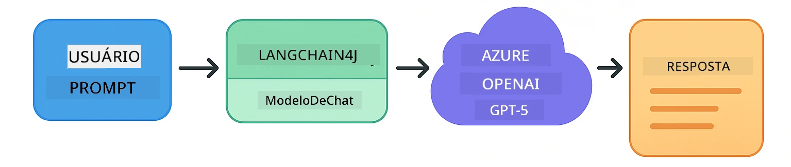
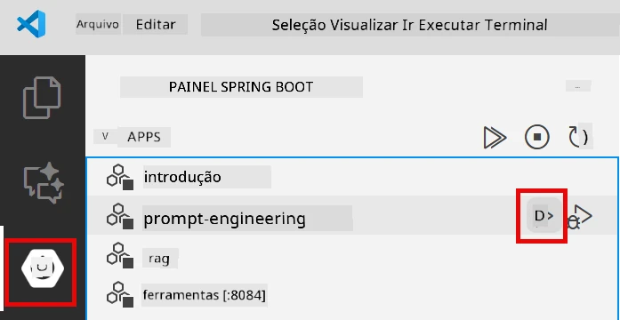
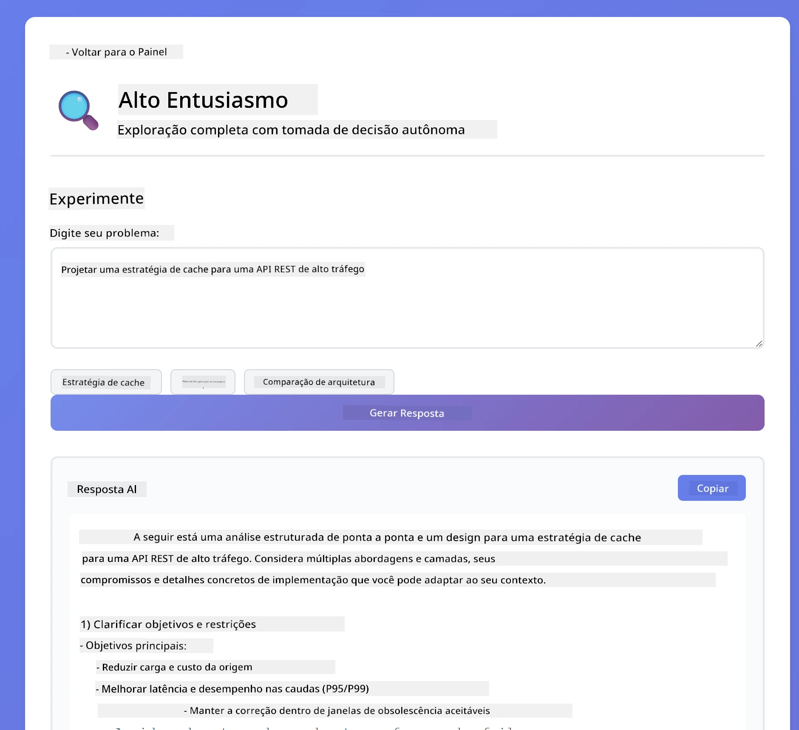
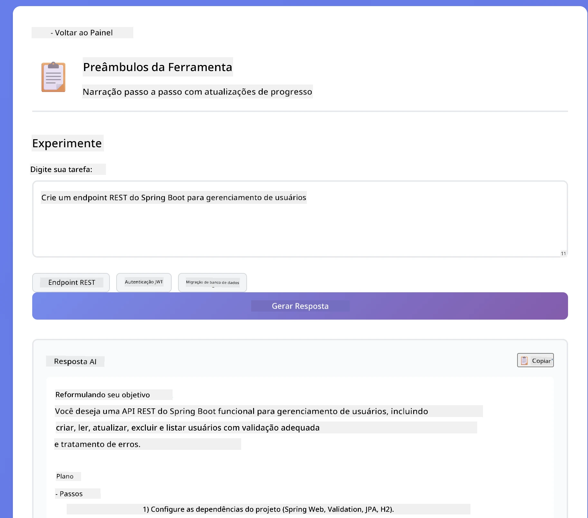
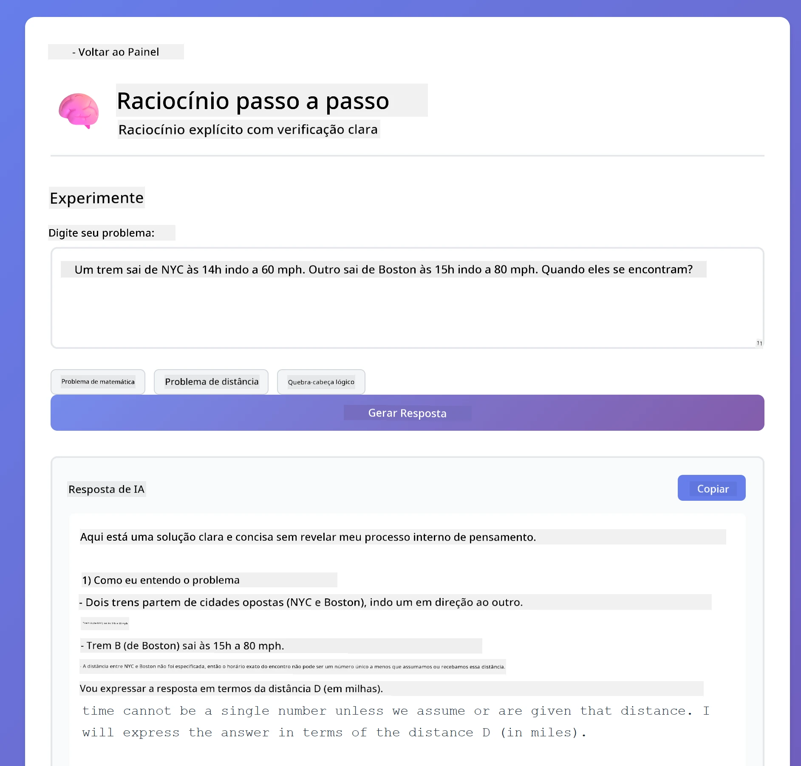
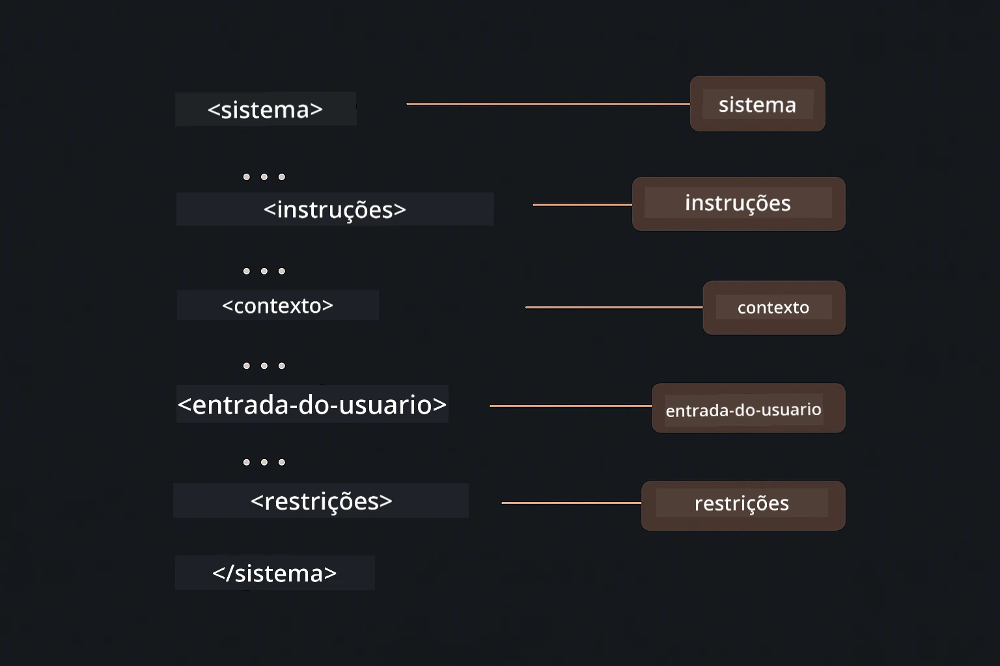

# Módulo 02: Engenharia de Prompt com GPT-5

## Índice

- [O Que Você Vai Aprender](../../../02-prompt-engineering)
- [Pré-requisitos](../../../02-prompt-engineering)
- [Entendendo Engenharia de Prompt](../../../02-prompt-engineering)
- [Como Isso Usa LangChain4j](../../../02-prompt-engineering)
- [Os Padrões Principais](../../../02-prompt-engineering)
- [Usando Recursos Existentes do Azure](../../../02-prompt-engineering)
- [Capturas de Tela da Aplicação](../../../02-prompt-engineering)
- [Explorando os Padrões](../../../02-prompt-engineering)
  - [Baixa vs Alta Disposição](../../../02-prompt-engineering)
  - [Execução de Tarefas (Preâmbulos de Ferramentas)](../../../02-prompt-engineering)
  - [Código Auto-Reflexivo](../../../02-prompt-engineering)
  - [Análise Estruturada](../../../02-prompt-engineering)
  - [Chat Multi-Turno](../../../02-prompt-engineering)
  - [Raciocínio Passo a Passo](../../../02-prompt-engineering)
  - [Saída Constrangida](../../../02-prompt-engineering)
- [O Que Você Está Realmente Aprendendo](../../../02-prompt-engineering)
- [Próximos Passos](../../../02-prompt-engineering)

## O Que Você Vai Aprender

No módulo anterior, você viu como a memória habilita IA conversacional e usou Modelos do GitHub para interações básicas. Agora vamos focar em como você faz perguntas - os próprios prompts - usando o GPT-5 do Azure OpenAI. A forma como você estrutura seus prompts afeta dramaticamente a qualidade das respostas que recebe.

Usaremos o GPT-5 porque ele introduz controle de raciocínio - você pode dizer ao modelo quanto pensar antes de responder. Isso torna diferentes estratégias de prompting mais evidentes e ajuda você a entender quando usar cada abordagem. Também nos beneficiaremos dos limites de taxa menores do Azure para GPT-5 em comparação com os Modelos do GitHub.

## Pré-requisitos

- Módulo 01 concluído (recursos Azure OpenAI implantados)
- Arquivo `.env` no diretório raiz com credenciais do Azure (criado pelo `azd up` no Módulo 01)

> **Nota:** Se você não concluiu o Módulo 01, siga primeiro as instruções de implantação lá.

## Entendendo Engenharia de Prompt

Engenharia de prompt é sobre projetar texto de entrada que consistentemente lhe dá os resultados que você precisa. Não é apenas fazer perguntas - é estruturar solicitações para que o modelo entenda exatamente o que você quer e como entregar.

Pense nisso como dar instruções a um colega. "Conserte o bug" é vago. "Conserte a exceção de ponteiro nulo em UserService.java linha 45 adicionando uma verificação de nulo" é específico. Modelos de linguagem funcionam da mesma forma - especificidade e estrutura importam.

## Como Isso Usa LangChain4j

Este módulo demonstra padrões avançados de prompting usando a mesma base LangChain4j dos módulos anteriores, com foco na estrutura do prompt e controle de raciocínio.



*Como LangChain4j conecta seus prompts ao Azure OpenAI GPT-5*

**Dependências** - O Módulo 02 usa as seguintes dependências langchain4j definidas em `pom.xml`:
```xml
<dependency>
    <groupId>dev.langchain4j</groupId>
    <artifactId>langchain4j</artifactId> <!-- Inherited from BOM in root pom.xml -->
</dependency>
<dependency>
    <groupId>dev.langchain4j</groupId>
    <artifactId>langchain4j-open-ai-official</artifactId> <!-- Inherited from BOM in root pom.xml -->
</dependency>
```

**Configuração OpenAiOfficialChatModel** - [LangChainConfig.java](../../../02-prompt-engineering/src/main/java/com/example/langchain4j/prompts/config/LangChainConfig.java)

O modelo de chat é configurado manualmente como um bean Spring usando o cliente oficial OpenAI, que suporta endpoints Azure OpenAI. A principal diferença do Módulo 01 é como estruturamos os prompts enviados para `chatModel.chat()`, não a configuração do modelo em si.

**Mensagens do Sistema e do Usuário** - [Gpt5PromptService.java](../../../02-prompt-engineering/src/main/java/com/example/langchain4j/prompts/service/Gpt5PromptService.java)

LangChain4j separa tipos de mensagem para clareza. `SystemMessage` define o comportamento e contexto da IA (como "Você é um revisor de código"), enquanto `UserMessage` contém a solicitação real. Essa separação permite manter comportamento consistente da IA em diferentes consultas de usuário.

```java
SystemMessage systemMsg = SystemMessage.from(
    "You are a helpful Java programming expert."
);

UserMessage userMsg = UserMessage.from(
    "Explain what a List is in Java"
);

String response = chatModel.chat(systemMsg, userMsg);
```


*SystemMessage fornece contexto persistente enquanto UserMessages contêm solicitações individuais*

**MessageWindowChatMemory para Multi-Turno** - Para o padrão de conversa multi-turno, reutilizamos `MessageWindowChatMemory` do Módulo 01. Cada sessão recebe sua própria instância de memória armazenada em um `Map<String, ChatMemory>`, permitindo múltiplas conversas simultâneas sem mistura de contexto.

**Templates de Prompt** - O foco real aqui é engenharia de prompt, não novas APIs LangChain4j. Cada padrão (baixa disposição, alta disposição, execução de tarefa, etc.) usa o mesmo método `chatModel.chat(prompt)` mas com strings de prompt cuidadosamente estruturadas. As tags XML, instruções e formatação são todas parte do texto do prompt, não recursos do LangChain4j.

**Controle de Raciocínio** - O esforço de raciocínio do GPT-5 é controlado por instruções no prompt como "máximo 2 passos de raciocínio" ou "explore minuciosamente". Essas são técnicas de engenharia de prompt, não configurações do LangChain4j. A biblioteca simplesmente entrega seus prompts ao modelo.

A principal lição: LangChain4j fornece a infraestrutura (conexão do modelo via [LangChainConfig.java](../../../02-prompt-engineering/src/main/java/com/example/langchain4j/prompts/config/LangChainConfig.java), memória, manipulação de mensagens via [Gpt5PromptService.java](../../../02-prompt-engineering/src/main/java/com/example/langchain4j/prompts/service/Gpt5PromptService.java)), enquanto este módulo ensina como criar prompts eficazes dentro dessa infraestrutura.

## Os Padrões Principais

Nem todos os problemas precisam da mesma abordagem. Algumas perguntas precisam de respostas rápidas, outras de pensamento profundo. Algumas precisam de raciocínio visível, outras só dos resultados. Este módulo cobre oito padrões de prompting - cada um otimizado para diferentes cenários. Você experimentará todos para aprender quando cada abordagem funciona melhor.


*Visão geral dos oito padrões de engenharia de prompt e seus casos de uso*


*Baixa disposição (rápido, direto) vs Alta disposição (minucioso, exploratório) abordagens de raciocínio*

**Baixa Disposição (Rápido & Focado)** - Para perguntas simples onde você quer respostas rápidas e diretas. O modelo faz raciocínio mínimo - máximo 2 passos. Use para cálculos, consultas ou perguntas diretas.

```java
String prompt = """
    <reasoning_effort>low</reasoning_effort>
    <instruction>maximum 2 reasoning steps</instruction>
    
    What is 15% of 200?
    """;

String response = chatModel.chat(prompt);
```

> 💡 **Explore com GitHub Copilot:** Abra [`Gpt5PromptService.java`](../../../02-prompt-engineering/src/main/java/com/example/langchain4j/prompts/service/Gpt5PromptService.java) e pergunte:
> - "Qual a diferença entre os padrões de prompting de baixa disposição e alta disposição?"
> - "Como as tags XML nos prompts ajudam a estruturar a resposta da IA?"
> - "Quando devo usar padrões de autorreflexão vs instrução direta?"

**Alta Disposição (Profundo & Minucioso)** - Para problemas complexos onde você quer análise abrangente. O modelo explora minuciosamente e mostra raciocínio detalhado. Use para design de sistemas, decisões de arquitetura ou pesquisas complexas.

```java
String prompt = """
    <reasoning_effort>high</reasoning_effort>
    <instruction>explore thoroughly, show detailed reasoning</instruction>
    
    Design a caching strategy for a high-traffic REST API.
    """;

String response = chatModel.chat(prompt);
```

**Execução de Tarefas (Progresso Passo a Passo)** - Para fluxos de trabalho multi-etapas. O modelo fornece um plano inicial, narra cada passo enquanto trabalha, depois dá um resumo. Use para migrações, implementações ou qualquer processo multi-etapas.

```java
String prompt = """
    <task>Create a REST endpoint for user registration</task>
    <preamble>Provide an upfront plan</preamble>
    <narration>Narrate each step as you work</narration>
    <summary>Summarize what was accomplished</summary>
    """;

String response = chatModel.chat(prompt);
```

Prompting Chain-of-Thought pede explicitamente ao modelo para mostrar seu processo de raciocínio, melhorando a precisão para tarefas complexas. A divisão passo a passo ajuda humanos e IA a entenderem a lógica.

> **🤖 Experimente com o Chat do [GitHub Copilot](https://github.com/features/copilot):** Pergunte sobre este padrão:
> - "Como eu adaptaria o padrão de execução de tarefas para operações de longa duração?"
> - "Quais são as melhores práticas para estruturar preâmbulos de ferramentas em aplicações de produção?"
> - "Como posso capturar e exibir atualizações intermediárias de progresso em uma interface?"


*Planejar → Executar → Resumir fluxo de trabalho para tarefas multi-etapas*

**Código Auto-Reflexivo** - Para gerar código com qualidade de produção. O modelo gera código, verifica contra critérios de qualidade e melhora iterativamente. Use ao construir novas funcionalidades ou serviços.

```java
String prompt = """
    <task>Create an email validation service</task>
    <quality_criteria>
    - Correct logic and error handling
    - Best practices (clean code, proper naming)
    - Performance optimization
    - Security considerations
    </quality_criteria>
    <instruction>Generate code, evaluate against criteria, improve iteratively</instruction>
    """;

String response = chatModel.chat(prompt);
```


*Loop de melhoria iterativa - gerar, avaliar, identificar problemas, melhorar, repetir*

**Análise Estruturada** - Para avaliação consistente. O modelo revisa código usando um framework fixo (correção, práticas, desempenho, segurança). Use para revisões de código ou avaliações de qualidade.

```java
String prompt = """
    <code>
    public List getUsers() {
        return database.query("SELECT * FROM users");
    }
    </code>
    
    <framework>
    Evaluate using these categories:
    1. Correctness - Logic and functionality
    2. Best Practices - Code quality
    3. Performance - Efficiency concerns
    4. Security - Vulnerabilities
    </framework>
    """;

String response = chatModel.chat(prompt);
```

> **🤖 Experimente com o Chat do [GitHub Copilot](https://github.com/features/copilot):** Pergunte sobre análise estruturada:
> - "Como posso personalizar o framework de análise para diferentes tipos de revisão de código?"
> - "Qual a melhor forma de analisar e agir sobre saída estruturada programaticamente?"
> - "Como garantir níveis consistentes de severidade em diferentes sessões de revisão?"


*Framework de quatro categorias para revisões de código consistentes com níveis de severidade*

**Chat Multi-Turno** - Para conversas que precisam de contexto. O modelo lembra mensagens anteriores e constrói sobre elas. Use para sessões de ajuda interativas ou Q&A complexos.

```java
ChatMemory memory = MessageWindowChatMemory.withMaxMessages(10);

memory.add(UserMessage.from("What is Spring Boot?"));
AiMessage aiMessage1 = chatModel.chat(memory.messages()).aiMessage();
memory.add(aiMessage1);

memory.add(UserMessage.from("Show me an example"));
AiMessage aiMessage2 = chatModel.chat(memory.messages()).aiMessage();
memory.add(aiMessage2);
```


*Como o contexto da conversa se acumula em múltiplos turnos até atingir o limite de tokens*

**Raciocínio Passo a Passo** - Para problemas que requerem lógica visível. O modelo mostra raciocínio explícito para cada passo. Use para problemas matemáticos, quebra-cabeças lógicos ou quando precisar entender o processo de pensamento.

```java
String prompt = """
    <instruction>Show your reasoning step-by-step</instruction>
    
    If a train travels 120 km in 2 hours, then stops for 30 minutes,
    then travels another 90 km in 1.5 hours, what is the average speed
    for the entire journey including the stop?
    """;

String response = chatModel.chat(prompt);
```


*Dividindo problemas em passos lógicos explícitos*

**Saída Constrangida** - Para respostas com requisitos específicos de formato. O modelo segue estritamente regras de formato e comprimento. Use para resumos ou quando precisar de estrutura precisa na saída.

```java
String prompt = """
    <constraints>
    - Exactly 100 words
    - Bullet point format
    - Technical terms only
    </constraints>
    
    Summarize the key concepts of machine learning.
    """;

String response = chatModel.chat(prompt);
```


*Impondo requisitos específicos de formato, comprimento e estrutura*

## Usando Recursos Existentes do Azure

**Verifique a implantação:**

Certifique-se de que o arquivo `.env` existe no diretório raiz com credenciais do Azure (criado durante o Módulo 01):
```bash
cat ../.env  # Deve mostrar AZURE_OPENAI_ENDPOINT, API_KEY, DEPLOYMENT
```

**Inicie a aplicação:**

> **Nota:** Se você já iniciou todas as aplicações usando `./start-all.sh` do Módulo 01, este módulo já está rodando na porta 8083. Você pode pular os comandos de início abaixo e ir direto para http://localhost:8083.

**Opção 1: Usando Spring Boot Dashboard (Recomendado para usuários VS Code)**

O container de desenvolvimento inclui a extensão Spring Boot Dashboard, que fornece uma interface visual para gerenciar todas as aplicações Spring Boot. Você pode encontrá-la na Barra de Atividades à esquerda do VS Code (procure o ícone do Spring Boot).

No Spring Boot Dashboard, você pode:
- Ver todas as aplicações Spring Boot disponíveis no workspace
- Iniciar/parar aplicações com um clique
- Visualizar logs da aplicação em tempo real
- Monitorar o status da aplicação

Basta clicar no botão de play ao lado de "prompt-engineering" para iniciar este módulo, ou iniciar todos os módulos de uma vez.



**Opção 2: Usando scripts shell**

Inicie todas as aplicações web (módulos 01-04):

**Bash:**
```bash
cd ..  # A partir do diretório raiz
./start-all.sh
```

**PowerShell:**
```powershell
cd ..  # A partir do diretório raiz
.\start-all.ps1
```

Ou inicie apenas este módulo:

**Bash:**
```bash
cd 02-prompt-engineering
./start.sh
```

**PowerShell:**
```powershell
cd 02-prompt-engineering
.\start.ps1
```

Ambos os scripts carregam automaticamente variáveis de ambiente do arquivo `.env` raiz e irão construir os JARs se eles não existirem.

> **Nota:** Se preferir construir todos os módulos manualmente antes de iniciar:
>
> **Bash:**
> ```bash
> cd ..  # Go to root directory
> mvn clean package -DskipTests
> ```
>
> **PowerShell:**
> ```powershell
> cd ..  # Go to root directory
> mvn clean package -DskipTests
> ```

Abra http://localhost:8083 no seu navegador.

**Para parar:**

**Bash:**
```bash
./stop.sh  # Apenas este módulo
# Ou
cd .. && ./stop-all.sh  # Todos os módulos
```

**PowerShell:**
```powershell
.\stop.ps1  # Apenas este módulo
# Ou
cd ..; .\stop-all.ps1  # Todos os módulos
```

## Capturas de Tela da Aplicação


*O dashboard principal mostrando todos os 8 padrões de engenharia de prompt com suas características e casos de uso*

## Explorando os Padrões

A interface web permite que você experimente diferentes estratégias de prompting. Cada padrão resolve problemas diferentes - experimente para ver quando cada abordagem se destaca.

### Baixa vs Alta Disposição

Faça uma pergunta simples como "Qual é 15% de 200?" usando Baixa Disposição. Você receberá uma resposta instantânea e direta. Agora pergunte algo complexo como "Projete uma estratégia de cache para uma API de alto tráfego" usando Alta Disposição. Observe como o modelo desacelera e fornece raciocínio detalhado. Mesmo modelo, mesma estrutura de pergunta - mas o prompt diz quanto pensar.


*Cálculo rápido com raciocínio mínimo*



*Estratégia abrangente de cache (2.8MB)*

### Execução de Tarefas (Preâmbulos de Ferramentas)

Fluxos de trabalho em múltiplas etapas se beneficiam de planejamento antecipado e narração do progresso. O modelo descreve o que fará, narra cada passo e depois resume os resultados.



*Criando um endpoint REST com narração passo a passo (3.9MB)*

### Código Auto-Reflexivo

Tente "Criar um serviço de validação de email". Em vez de apenas gerar código e parar, o modelo gera, avalia segundo critérios de qualidade, identifica fraquezas e melhora. Você verá ele iterar até que o código atenda aos padrões de produção.


*Serviço completo de validação de email (5.2MB)*

### Análise Estruturada

Revisões de código precisam de frameworks de avaliação consistentes. O modelo analisa o código usando categorias fixas (correção, práticas, desempenho, segurança) com níveis de severidade.


*Revisão de código baseada em framework*

### Chat Multi-Turno

Pergunte "O que é Spring Boot?" e logo em seguida "Mostre um exemplo". O modelo lembra sua primeira pergunta e fornece um exemplo específico de Spring Boot. Sem memória, essa segunda pergunta seria vaga demais.


*Preservação de contexto entre perguntas*

### Raciocínio Passo a Passo

Escolha um problema de matemática e tente com Raciocínio Passo a Passo e Baixa Disposição. Baixa disposição só dá a resposta - rápido, mas opaco. Passo a passo mostra cada cálculo e decisão.



*Problema matemático com passos explícitos*

### Saída Constrangida

Quando você precisa de formatos específicos ou contagem de palavras, esse padrão impõe aderência estrita. Tente gerar um resumo com exatamente 100 palavras em formato de tópicos.


*Resumo de aprendizado de máquina com controle de formato*

## O Que Você Está Realmente Aprendendo

**Esforço de Raciocínio Muda Tudo**

GPT-5 permite controlar o esforço computacional através dos seus prompts. Baixo esforço significa respostas rápidas com exploração mínima. Alto esforço significa que o modelo leva tempo para pensar profundamente. Você está aprendendo a ajustar o esforço à complexidade da tarefa - não perca tempo com perguntas simples, mas também não apresse decisões complexas.

**Estrutura Guia o Comportamento**

Notou as tags XML nos prompts? Elas não são decorativas. Modelos seguem instruções estruturadas de forma mais confiável que texto livre. Quando você precisa de processos em múltiplas etapas ou lógica complexa, a estrutura ajuda o modelo a acompanhar onde está e o que vem a seguir.



*Anatomia de um prompt bem estruturado com seções claras e organização estilo XML*

**Qualidade Através da Autoavaliação**

Os padrões auto-reflexivos funcionam tornando explícitos os critérios de qualidade. Em vez de esperar que o modelo "faça certo", você diz exatamente o que "certo" significa: lógica correta, tratamento de erros, desempenho, segurança. O modelo pode então avaliar sua própria saída e melhorar. Isso transforma a geração de código de uma loteria em um processo.

**Contexto é Finito**

Conversas multi-turno funcionam incluindo o histórico de mensagens em cada requisição. Mas há um limite - todo modelo tem um máximo de tokens. Conforme as conversas crescem, você precisará de estratégias para manter o contexto relevante sem atingir esse limite. Este módulo mostra como a memória funciona; depois você aprenderá quando resumir, quando esquecer e quando recuperar.

## Próximos Passos

**Próximo Módulo:** [03-rag - RAG (Geração com Recuperação)](../03-rag/README.md)

---

**Navegação:** [← Anterior: Módulo 01 - Introdução](../01-introduction/README.md) | [Voltar ao Início](../README.md) | [Próximo: Módulo 03 - RAG →](../03-rag/README.md)

---

<!-- CO-OP TRANSLATOR DISCLAIMER START -->
**Aviso Legal**:  
Este documento foi traduzido utilizando o serviço de tradução por IA [Co-op Translator](https://github.com/Azure/co-op-translator). Embora nos esforcemos para garantir a precisão, esteja ciente de que traduções automáticas podem conter erros ou imprecisões. O documento original em seu idioma nativo deve ser considerado a fonte autorizada. Para informações críticas, recomenda-se a tradução profissional realizada por humanos. Não nos responsabilizamos por quaisquer mal-entendidos ou interpretações incorretas decorrentes do uso desta tradução.
<!-- CO-OP TRANSLATOR DISCLAIMER END -->