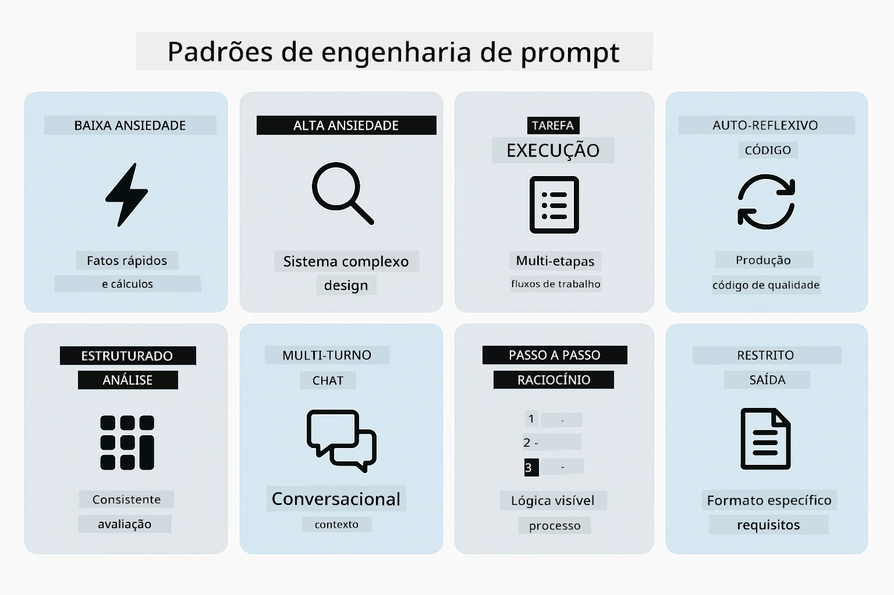
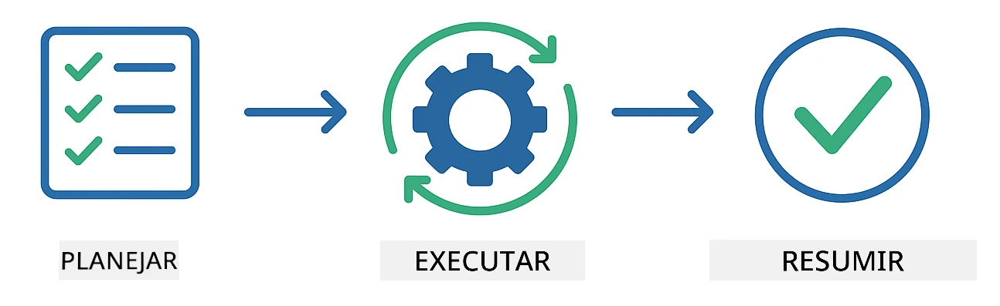
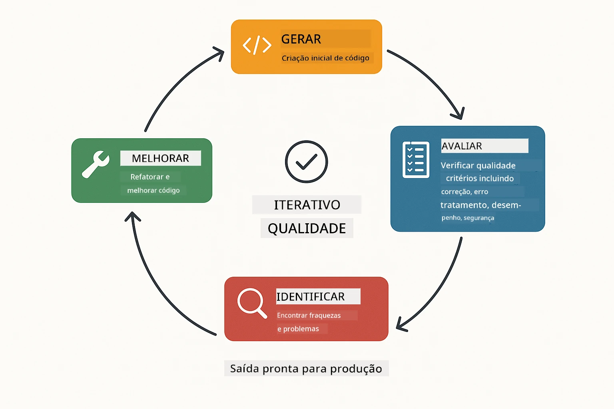
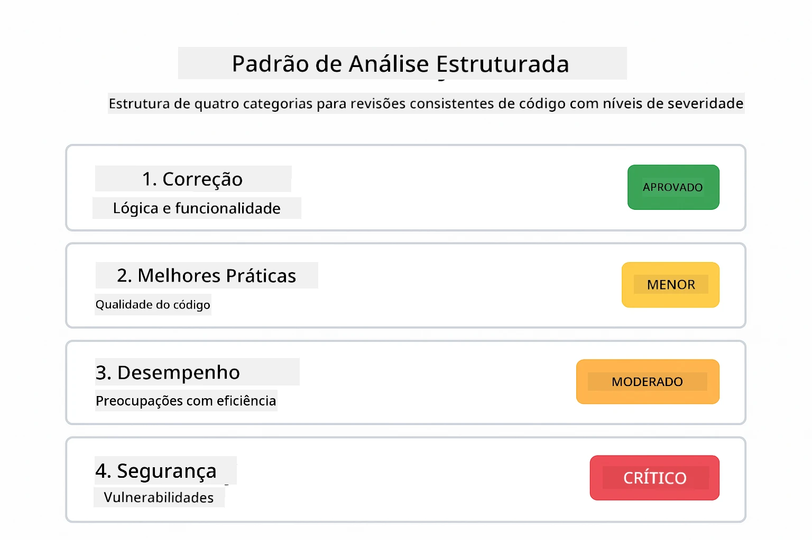
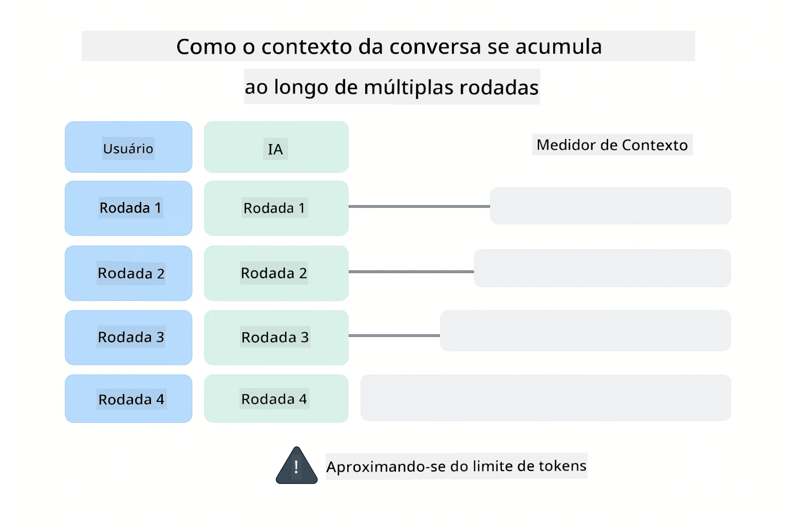
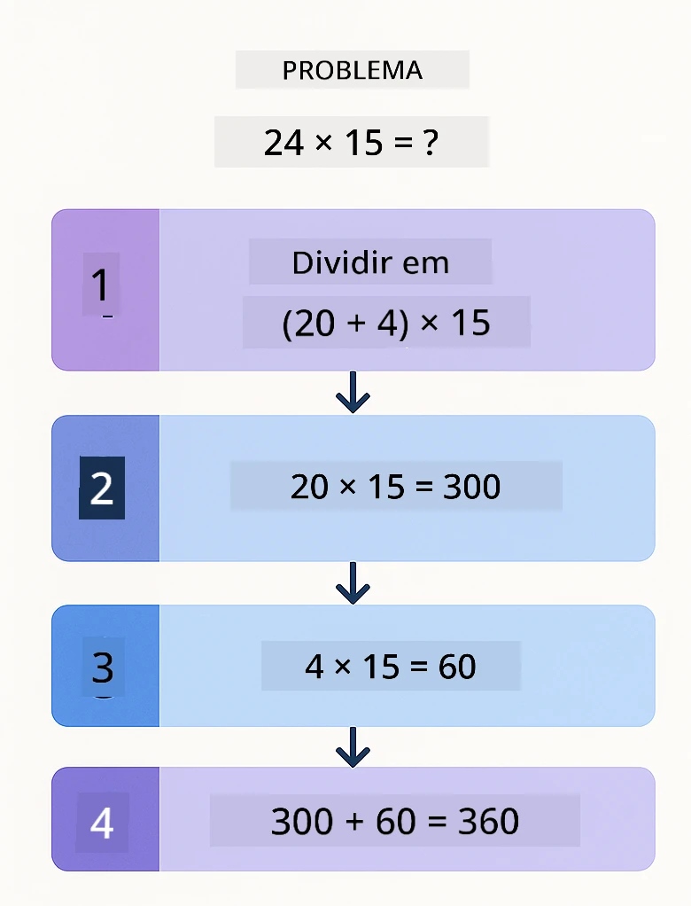
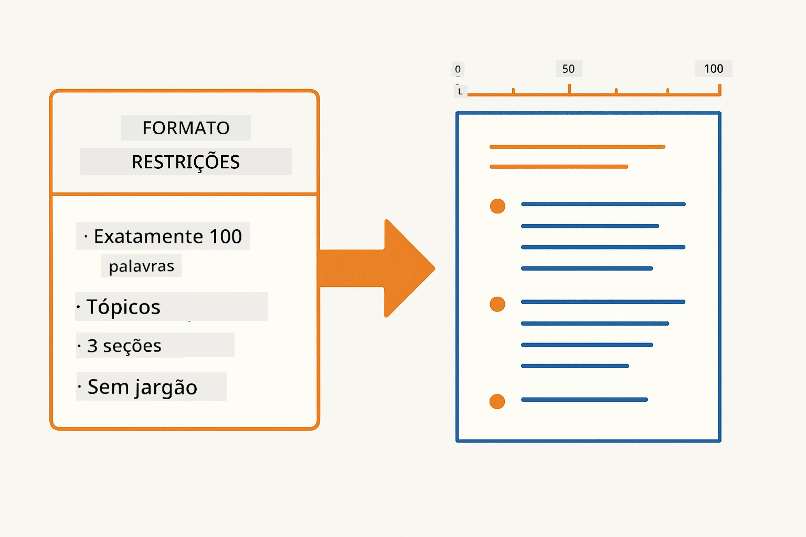
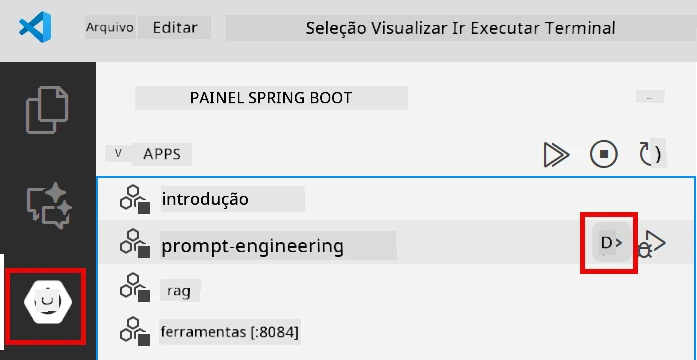
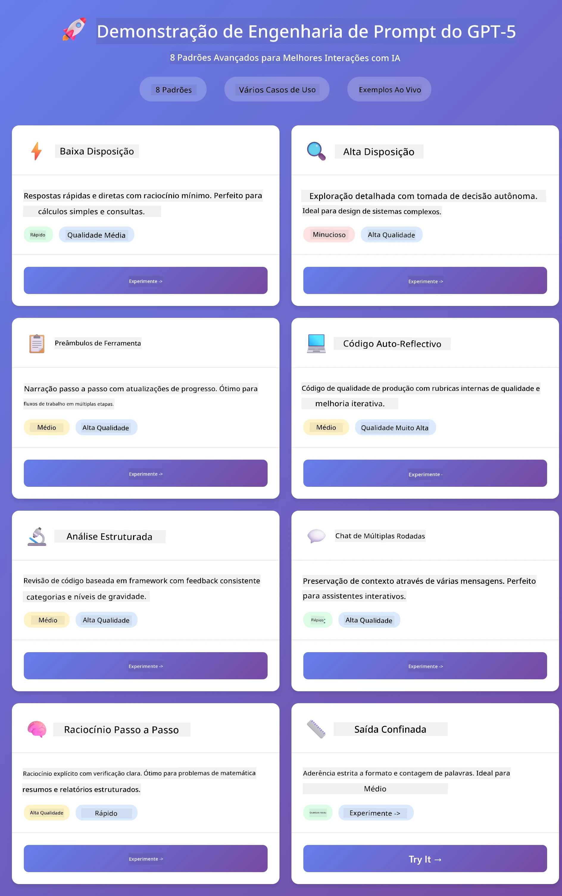
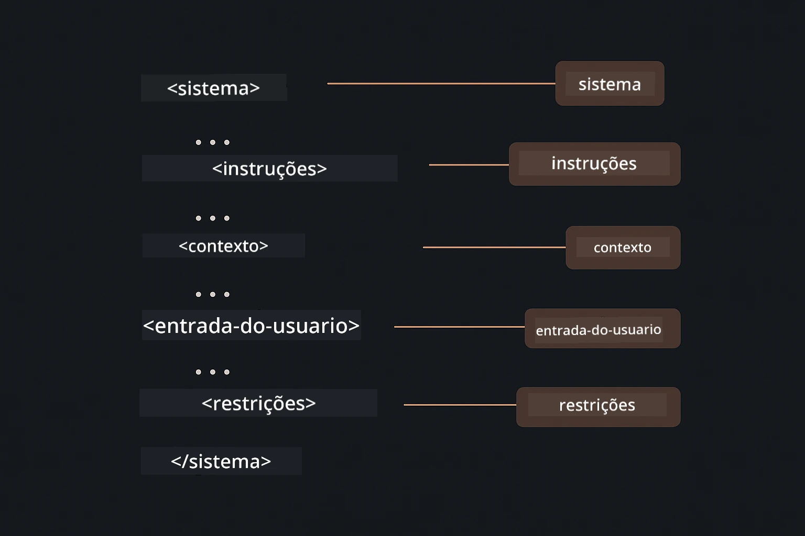

# Módulo 02: Engenharia de Prompt com GPT-5.2

## Índice

- [Video Walkthrough](#video-walkthrough)
- [What You'll Learn](#what-youll-learn)
- [Prerequisites](#prerequisites)
- [Understanding Prompt Engineering](#understanding-prompt-engineering)
- [Prompt Engineering Fundamentals](#prompt-engineering-fundamentals)
  - [Zero-Shot Prompting](#zero-shot-prompting)
  - [Few-Shot Prompting](#few-shot-prompting)
  - [Chain of Thought](#chain-of-thought)
  - [Role-Based Prompting](#role-based-prompting)
  - [Prompt Templates](#prompt-templates)
- [Advanced Patterns](#advanced-patterns)
- [Run the Application](#executar-a-aplicação)
- [Application Screenshots](#capturas-de-tela-da-aplicação)
- [Exploring the Patterns](#explorando-os-padrões)
  - [Low vs High Eagerness](#baixa-vs-alta-vontade)
  - [Task Execution (Tool Preambles)](#execução-de-tarefa-preambos-de-ferramentas)
  - [Self-Reflecting Code](#código-auto-reflexivo)
  - [Structured Analysis](#análise-estruturada)
  - [Multi-Turn Chat](#chat-multi-turno)
  - [Step-by-Step Reasoning](#raciocínio-passo-a-passo)
  - [Constrained Output](#saída-constrained)
- [What You're Really Learning](#o-que-você-está-realmente-aprendendo)
- [Next Steps](#próximos-passos)

## Video Walkthrough

Assista a esta sessão ao vivo que explica como começar com este módulo:

<a href="https://www.youtube.com/live/PJ6aBaE6bog?si=LDshyBrTRodP-wke"></a>

## What You'll Learn

O diagrama a seguir fornece uma visão geral dos principais tópicos e habilidades que você desenvolverá neste módulo — desde técnicas de refinamento de prompt até o fluxo de trabalho passo a passo que você seguirá.


No módulo anterior, você viu como a memória possibilita a IA conversacional com Azure OpenAI. Agora vamos focar em como você faz perguntas — os próprios prompts — usando o GPT-5.2 do Azure OpenAI. A forma como você estrutura seus prompts afeta drasticamente a qualidade das respostas que obtém. Começamos com uma revisão das técnicas fundamentais de prompting, depois avançamos para oito padrões avançados que aproveitam ao máximo as capacidades do GPT-5.2.

Usaremos o GPT-5.2 porque ele introduz controle de raciocínio — você pode dizer ao modelo quanto pensar antes de responder. Isso torna as diferentes estratégias de prompting mais evidentes e ajuda a entender quando usar cada abordagem.

## Prerequisites

- Módulo 01 concluído (recursos do Azure OpenAI implantados)
- Arquivo `.env` no diretório raiz com credenciais Azure (criado pelo `azd up` no Módulo 01)

> **Nota:** Se você ainda não concluiu o Módulo 01, siga as instruções de implantação lá primeiro.

## Understanding Prompt Engineering

Essencialmente, engenharia de prompt é a diferença entre instruções vagas e instruções precisas, como ilustra a comparação abaixo.


Engenharia de prompt consiste em projetar um texto de entrada que consistentemente lhe dá os resultados que você precisa. Não é apenas sobre fazer perguntas — é sobre estruturar solicitações para que o modelo entenda exatamente o que você quer e como entregar isso.

Pense nisso como dar instruções a um colega. "Conserte o bug" é vago. "Conserte a exceção de ponteiro nulo em UserService.java linha 45 adicionando uma verificação nula" é específico. Modelos de linguagem funcionam da mesma forma — especificidade e estrutura importam.

O diagrama abaixo mostra como o LangChain4j se encaixa nessa imagem — conectando seus padrões de prompt ao modelo por meio dos blocos de construção SystemMessage e UserMessage.


O LangChain4j fornece a infraestrutura — conexões com modelo, memória e tipos de mensagem — enquanto os padrões de prompt são apenas textos cuidadosamente estruturados que você envia por essa infraestrutura. Os blocos de construção principais são `SystemMessage` (que define o comportamento e o papel da IA) e `UserMessage` (que carrega seu pedido real).

## Prompt Engineering Fundamentals

As cinco técnicas principais mostradas abaixo formam a base da engenharia de prompt eficaz. Cada uma aborda um aspecto diferente de como você se comunica com modelos de linguagem.


Antes de mergulhar nos padrões avançados deste módulo, vamos revisar cinco técnicas fundamentais de prompting. Essas são as bases que todo engenheiro de prompt deve conhecer.

### Zero-Shot Prompting

A abordagem mais simples: dê ao modelo uma instrução direta sem exemplos. O modelo depende inteiramente de seu treinamento para entender e executar a tarefa. Isso funciona bem para solicitações diretas onde o comportamento esperado é óbvio.


*Instrução direta sem exemplos — o modelo infere a tarefa apenas a partir da instrução*

```java
String prompt = "Classify this sentiment: 'I absolutely loved the movie!'";
String response = model.chat(prompt);
// Resposta: "Positivo"
```

**Quando usar:** Classificações simples, perguntas diretas, traduções ou qualquer tarefa que o modelo possa executar sem orientação adicional.

### Few-Shot Prompting

Forneça exemplos que demonstrem o padrão que você quer que o modelo siga. O modelo aprende o formato esperado de entrada-saída a partir dos seus exemplos e aplica a novas entradas. Isso melhora drasticamente a consistência para tarefas onde o formato ou comportamento desejado não é óbvio.


*Aprender com exemplos — o modelo identifica o padrão e o aplica a novas entradas*

```java
String prompt = """
    Classify the sentiment as positive, negative, or neutral.
    
    Examples:
    Text: "This product exceeded my expectations!" → Positive
    Text: "It's okay, nothing special." → Neutral
    Text: "Waste of money, very disappointed." → Negative
    
    Now classify this:
    Text: "Best purchase I've made all year!"
    """;
String response = model.chat(prompt);
```

**Quando usar:** Classificações personalizadas, formatação consistente, tarefas específicas de domínio ou quando resultados zero-shot são inconsistentes.

### Chain of Thought

Peça ao modelo para mostrar seu raciocínio passo a passo. Em vez de pular direto para uma resposta, o modelo divide o problema e trabalha em cada parte explicitamente. Isso melhora a precisão em tarefas de matemática, lógica e raciocínio em múltiplas etapas.


*Raciocínio passo a passo — dividindo problemas complexos em etapas lógicas explícitas*

```java
String prompt = """
    Problem: A store has 15 apples. They sell 8 apples and then 
    receive a shipment of 12 more apples. How many apples do they have now?
    
    Let's solve this step-by-step:
    """;
String response = model.chat(prompt);
// O modelo mostra: 15 - 8 = 7, então 7 + 12 = 19 maçãs
```

**Quando usar:** Problemas matemáticos, quebra-cabeças lógicos, depuração ou qualquer tarefa onde mostrar o processo de raciocínio melhora a precisão e a confiança.

### Role-Based Prompting

Defina uma persona ou papel para a IA antes de fazer sua pergunta. Isso fornece contexto que molda o tom, profundidade e foco da resposta. Um "arquitet@ de software" fornece conselhos diferentes de um "desenvolvedor júnior" ou um "auditor de segurança".


*Estabelecendo contexto e persona — a mesma pergunta recebe respostas diferentes dependendo do papel atribuído*

```java
String prompt = """
    You are an experienced software architect reviewing code.
    Provide a brief code review for this function:
    
    def calculate_total(items):
        total = 0
        for item in items:
            total = total + item['price']
        return total
    """;
String response = model.chat(prompt);
```

**Quando usar:** Revisões de código, tutoria, análise específica de domínio ou quando você precisa de respostas adaptadas a um nível específico de expertise ou perspectiva.

### Prompt Templates

Crie prompts reutilizáveis com espaços reservados para variáveis. Em vez de escrever um novo prompt toda vez, defina um template uma vez e preencha com diferentes valores. A classe `PromptTemplate` do LangChain4j facilita isso com a sintaxe `{{variable}}`.


*Prompts reutilizáveis com espaços para variáveis — um template, muitos usos*

```java
PromptTemplate template = PromptTemplate.from(
    "What's the best time to visit {{destination}} for {{activity}}?"
);

Prompt prompt = template.apply(Map.of(
    "destination", "Paris",
    "activity", "sightseeing"
));

String response = model.chat(prompt.text());
```

**Quando usar:** Consultas repetidas com entradas diferentes, processamento em lote, construção de fluxos reutilizáveis de IA ou qualquer cenário onde a estrutura do prompt permanece a mesma mas os dados mudam.

---

Esses cinco fundamentos lhe dão uma caixa de ferramentas sólida para a maioria das tarefas de prompting. O restante deste módulo constrói sobre eles com **oito padrões avançados** que aproveitam o controle de raciocínio, autoavaliação e capacidades de saída estruturada do GPT-5.2.

## Advanced Patterns

Com os fundamentos cobertos, vamos aos oito padrões avançados que tornam este módulo único. Nem todos os problemas precisam do mesmo método. Algumas perguntas precisam de respostas rápidas, outras de pensamento profundo. Algumas precisam de raciocínio visível, outras só precisam dos resultados. Cada padrão abaixo é otimizado para um cenário diferente — e o controle de raciocínio do GPT-5.2 torna as diferenças ainda mais evidentes.



*Visão geral dos oito padrões de engenharia de prompt e seus casos de uso*

O GPT-5.2 adiciona outra dimensão a esses padrões: *controle de raciocínio*. O controle deslizante abaixo mostra como você pode ajustar o esforço de pensamento do modelo — de respostas rápidas e diretas até análises profundas e detalhadas.


*O controle de raciocínio do GPT-5.2 permite que você especifique quanto o modelo deve pensar — de respostas rápidas diretas a exploração profunda*

**Baixa Disposição (Rápido & Focado)** - Para perguntas simples onde você quer respostas rápidas e diretas. O modelo faz raciocínio mínimo — no máximo 2 passos. Use isso para cálculos, consultas ou perguntas diretas.

```java
String prompt = """
    <context_gathering>
    - Search depth: very low
    - Bias strongly towards providing a correct answer as quickly as possible
    - Usually, this means an absolute maximum of 2 reasoning steps
    - If you think you need more time, state what you know and what's uncertain
    </context_gathering>
    
    Problem: What is 15% of 200?
    
    Provide your answer:
    """;

String response = chatModel.chat(prompt);
```

> 💡 **Explore com o GitHub Copilot:** Abra [`Gpt5PromptService.java`](../../../02-prompt-engineering/src/main/java/com/example/langchain4j/prompts/service/Gpt5PromptService.java) e pergunte:
> - "Qual a diferença entre os padrões de prompting de baixa e alta disposição?"
> - "Como as tags XML nos prompts ajudam a estruturar a resposta da IA?"
> - "Quando devo usar padrões de autorreflexão versus instrução direta?"

**Alta Disposição (Profundo & Completo)** - Para problemas complexos onde você quer análise abrangente. O modelo explora em profundidade e mostra raciocínio detalhado. Use isso para design de sistemas, decisões de arquitetura ou pesquisas complexas.

```java
String prompt = """
    Analyze this problem thoroughly and provide a comprehensive solution.
    Consider multiple approaches, trade-offs, and important details.
    Show your analysis and reasoning in your response.
    
    Problem: Design a caching strategy for a high-traffic REST API.
    """;

String response = chatModel.chat(prompt);
```

**Execução de Tarefa (Progresso Passo a Passo)** - Para fluxos de trabalho em múltiplas etapas. O modelo fornece um plano inicial, narra cada passo enquanto trabalha, depois dá um resumo. Use isso para migrações, implementações ou qualquer processo com múltiplas etapas.

```java
String prompt = """
    <task_execution>
    1. First, briefly restate the user's goal in a friendly way
    
    2. Create a step-by-step plan:
       - List all steps needed
       - Identify potential challenges
       - Outline success criteria
    
    3. Execute each step:
       - Narrate what you're doing
       - Show progress clearly
       - Handle any issues that arise
    
    4. Summarize:
       - What was completed
       - Any important notes
       - Next steps if applicable
    </task_execution>
    
    <tool_preambles>
    - Always begin by rephrasing the user's goal clearly
    - Outline your plan before executing
    - Narrate each step as you go
    - Finish with a distinct summary
    </tool_preambles>
    
    Task: Create a REST endpoint for user registration
    
    Begin execution:
    """;

String response = chatModel.chat(prompt);
```

O prompting Chain-of-Thought (cadeia de pensamento) pede explicitamente que o modelo mostre seu processo de raciocínio, melhorando a precisão em tarefas complexas. A decomposição passo a passo ajuda tanto humanos quanto IA a entenderem a lógica.

> **🤖 Experimente com o Chat do [GitHub Copilot](https://github.com/features/copilot):** Pergunte sobre esse padrão:
> - "Como eu adaptaria o padrão de execução de tarefa para operações de longa duração?"
> - "Quais são as melhores práticas para estruturar preâmbulos de ferramentas em aplicações de produção?"
> - "Como posso capturar e exibir atualizações intermediárias de progresso em uma interface de usuário?"

O diagrama abaixo ilustra esse fluxo Plan → Execute → Summarize.



*Fluxo Plan → Execute → Summarize para tarefas em múltiplas etapas*

**Código Auto-Reflexivo** - Para gerar código de qualidade para produção. O modelo gera código seguindo padrões de produção com tratamento adequado de erros. Use isso para construir novas funcionalidades ou serviços.

```java
String prompt = """
    Generate Java code with production-quality standards: Create an email validation service
    Keep it simple and include basic error handling.
    """;

String response = chatModel.chat(prompt);
```

O diagrama abaixo mostra este ciclo iterativo de melhoria — gerar, avaliar, identificar pontos fracos e refinar até que o código atenda aos padrões de produção.



*Ciclo iterativo de melhoria — gerar, avaliar, identificar problemas, melhorar, repetir*

**Análise Estruturada** - Para avaliação consistente. O modelo revisa código usando um framework fixo (correção, práticas, desempenho, segurança, manutenibilidade). Use isso para revisões de código ou avaliações de qualidade.

```java
String prompt = """
    <analysis_framework>
    You are an expert code reviewer. Analyze the code for:
    
    1. Correctness
       - Does it work as intended?
       - Are there logical errors?
    
    2. Best Practices
       - Follows language conventions?
       - Appropriate design patterns?
    
    3. Performance
       - Any inefficiencies?
       - Scalability concerns?
    
    4. Security
       - Potential vulnerabilities?
       - Input validation?
    
    5. Maintainability
       - Code clarity?
       - Documentation?
    
    <output_format>
    Provide your analysis in this structure:
    - Summary: One-sentence overall assessment
    - Strengths: 2-3 positive points
    - Issues: List any problems found with severity (High/Medium/Low)
    - Recommendations: Specific improvements
    </output_format>
    </analysis_framework>
    
    Code to analyze:
    ```
    public List getUsers() {
        return database.query("SELECT * FROM users");
    }
    ```
    Provide your structured analysis:
    """;

String response = chatModel.chat(prompt);
```

> **🤖 Experimente com o Chat do [GitHub Copilot](https://github.com/features/copilot):** Pergunte sobre análise estruturada:
> - "Como posso personalizar o framework de análise para diferentes tipos de revisões de código?"
> - "Qual a melhor forma de interpretar e agir conforme a saída estruturada programaticamente?"
> - "Como garantir níveis de severidade consistentes em diferentes sessões de revisão?"

O diagrama a seguir mostra como esse framework estruturado organiza uma revisão de código em categorias consistentes com níveis de severidade.



*Framework para revisões de código consistentes com níveis de severidade*

**Chat Multi-Turno** - Para conversas que precisam de contexto. O modelo lembra das mensagens anteriores e constrói sobre elas. Use isso para sessões interativas de ajuda ou perguntas e respostas complexas.

```java
ChatMemory memory = MessageWindowChatMemory.withMaxMessages(10);

memory.add(UserMessage.from("What is Spring Boot?"));
AiMessage aiMessage1 = chatModel.chat(memory.messages()).aiMessage();
memory.add(aiMessage1);

memory.add(UserMessage.from("Show me an example"));
AiMessage aiMessage2 = chatModel.chat(memory.messages()).aiMessage();
memory.add(aiMessage2);
```

O diagrama abaixo visualiza como o contexto da conversa se acumula a cada turno e como isso se relaciona com o limite de tokens do modelo.



*Como o contexto da conversa se acumula ao longo de múltiplos turnos até atingir o limite de tokens*

**Raciocínio Passo a Passo** - Para problemas que exigem lógica visível. O modelo apresenta raciocínio explícito para cada etapa. Use isso para problemas matemáticos, quebra-cabeças lógicos ou quando precisar entender o processo de pensamento.

```java
String prompt = """
    <instruction>Show your reasoning step-by-step</instruction>
    
    If a train travels 120 km in 2 hours, then stops for 30 minutes,
    then travels another 90 km in 1.5 hours, what is the average speed
    for the entire journey including the stop?
    """;

String response = chatModel.chat(prompt);
```

O diagrama abaixo ilustra como o modelo divide problemas em passos lógicos explícitos e numerados.


*Quebrando problemas em passos lógicos explícitos*

**Saída Constrained** - Para respostas com requisitos de formato específicos. O modelo segue rigorosamente as regras de formato e comprimento. Use isso para resumos ou quando precisar de estrutura de saída precisa.

```java
String prompt = """
    <constraints>
    - Exactly 100 words
    - Bullet point format
    - Technical terms only
    </constraints>
    
    Summarize the key concepts of machine learning.
    """;

String response = chatModel.chat(prompt);
```

O diagrama a seguir mostra como as restrições guiam o modelo para produzir uma saída que adere estritamente aos seus requisitos de formato e comprimento.



*Impondo requisitos específicos de formato, comprimento e estrutura*

## Executar a Aplicação

**Verifique a implantação:**

Certifique-se de que o arquivo `.env` exista no diretório raiz com as credenciais do Azure (criado durante o Módulo 01). Execute isso a partir do diretório do módulo (`02-prompt-engineering/`):

**Bash:**
```bash
cat ../.env  # Deve mostrar AZURE_OPENAI_ENDPOINT, API_KEY, DEPLOYMENT
```

**PowerShell:**
```powershell
Get-Content ..\.env  # Deve mostrar AZURE_OPENAI_ENDPOINT, API_KEY, DEPLOYMENT
```

**Inicie a aplicação:**

> **Nota:** Se você já iniciou todas as aplicações usando `./start-all.sh` a partir do diretório raiz (como descrito no Módulo 01), este módulo já está rodando na porta 8083. Você pode pular os comandos de inicialização abaixo e ir direto para http://localhost:8083.

**Opção 1: Usando o Spring Boot Dashboard (Recomendado para usuários do VS Code)**

O contêiner dev inclui a extensão Spring Boot Dashboard, que fornece uma interface visual para gerenciar todas as aplicações Spring Boot. Você pode encontrá-lo na Barra de Atividades do lado esquerdo do VS Code (procure pelo ícone do Spring Boot).

A partir do Spring Boot Dashboard, você pode:
- Ver todas as aplicações Spring Boot disponíveis no workspace
- Iniciar/parar aplicações com um clique
- Visualizar logs das aplicações em tempo real
- Monitorar o status das aplicações

Basta clicar no botão de play ao lado de "prompt-engineering" para iniciar este módulo, ou iniciar todos os módulos de uma vez.



*O Spring Boot Dashboard no VS Code — inicie, pare e monitore todos os módulos a partir de um só lugar*

**Opção 2: Usando scripts shell**

Inicie todas as aplicações web (módulos 01-04):

**Bash:**
```bash
cd ..  # A partir do diretório raiz
./start-all.sh
```

**PowerShell:**
```powershell
cd ..  # A partir do diretório raiz
.\start-all.ps1
```

Ou inicie apenas este módulo:

**Bash:**
```bash
cd 02-prompt-engineering
./start.sh
```

**PowerShell:**
```powershell
cd 02-prompt-engineering
.\start.ps1
```

Ambos os scripts carregam automaticamente as variáveis de ambiente do arquivo `.env` raiz e irão construir os JARs se eles não existirem.

> **Nota:** Se preferir construir todos os módulos manualmente antes de iniciar:
>
> **Bash:**
> ```bash
> cd ..  # Go to root directory
> mvn clean package -DskipTests
> ```
>
> **PowerShell:**
> ```powershell
> cd ..  # Go to root directory
> mvn clean package -DskipTests
> ```

Abra http://localhost:8083 no seu navegador.

**Para parar:**

**Bash:**
```bash
./stop.sh  # Apenas este módulo
# Ou
cd .. && ./stop-all.sh  # Todos os módulos
```

**PowerShell:**
```powershell
.\stop.ps1  # Somente este módulo
# Ou
cd ..; .\stop-all.ps1  # Todos os módulos
```

## Capturas de Tela da Aplicação

Aqui está a interface principal do módulo de engenharia de prompts, onde você pode experimentar todos os oito padrões lado a lado.



*O dashboard principal mostrando todos os 8 padrões de engenharia de prompt com suas características e casos de uso*

## Explorando os Padrões

A interface web permite que você experimente diferentes estratégias de prompting. Cada padrão resolve problemas diferentes – experimente para ver quando cada abordagem se destaca.

> **Nota: Streaming vs Não-Streaming** — Cada página de padrão oferece dois botões: **🔴 Stream Response (Ao Vivo)** e uma opção **Não-streaming**. O streaming usa Server-Sent Events (SSE) para exibir tokens em tempo real conforme o modelo os gera, para que você veja o progresso imediatamente. A opção não-streaming espera a resposta completa antes de exibi-la. Para prompts que acionam raciocínio profundo (ex: Alta Vontade, Código Auto-Reflexivo), a chamada não-streaming pode levar muito tempo – às vezes minutos – sem feedback visível. **Use o streaming ao experimentar prompts complexos** para ver o modelo trabalhando e evitar a impressão de timeout na requisição.
>
> **Nota: Requisito do Navegador** — O recurso de streaming usa a Fetch Streams API (`response.body.getReader()`), que requer um navegador completo (Chrome, Edge, Firefox, Safari). Não funciona no Simple Browser embutido do VS Code, pois seu webview não suporta a ReadableStream API. Se usar o Simple Browser, os botões não streaming funcionarão normalmente — somente os botões de streaming são afetados. Abra `http://localhost:8083` em um navegador externo para a experiência completa.

### Baixa vs Alta Vontade

Faça uma pergunta simples como "Qual é 15% de 200?" usando Baixa Vontade. Você receberá uma resposta instantânea e direta. Agora pergunte algo complexo como "Projete uma estratégia de cache para uma API com alto tráfego" usando Alta Vontade. Clique em **🔴 Stream Response (Ao Vivo)** e observe o raciocínio detalhado do modelo aparecer token por token. Mesmo modelo, mesma estrutura de pergunta – mas o prompt diz quanto pensar.

### Execução de Tarefa (Preambos de Ferramentas)

Fluxos de trabalho multi-etapas se beneficiam de planejamento antecipado e narração do progresso. O modelo esboça o que fará, narra cada passo e depois resume os resultados.

### Código Auto-Reflexivo

Experimente "Crie um serviço de validação de e-mails". Em vez de apenas gerar o código e parar, o modelo gera, avalia contra critérios de qualidade, identifica fraquezas e melhora. Você verá iterações até o código atingir padrões de produção.

### Análise Estruturada

Revisões de código precisam de frameworks de avaliação consistentes. O modelo analisa o código usando categorias fixas (correção, práticas, desempenho, segurança) com níveis de severidade.

### Chat Multi-Turno

Pergunte "O que é Spring Boot?" e logo depois "Mostre-me um exemplo". O modelo lembra da primeira pergunta e fornece um exemplo de Spring Boot específico. Sem memória, essa segunda pergunta seria vaga demais.

### Raciocínio Passo a Passo

Escolha um problema matemático e tente com Raciocínio Passo a Passo e Baixa Vontade. A baixa vontade dá só a resposta – rápido, mas opaco. O passo a passo mostra cada cálculo e decisão.

### Saída Constrained

Quando você precisa de formatos ou contagens de palavras específicas, este padrão impõe aderência estrita. Experimente gerar um resumo com exatamente 100 palavras em formato de lista.

## O Que Você Está Realmente Aprendendo

**Esforço de Raciocínio Muda Tudo**

O GPT-5.2 permite controlar o esforço computacional através dos seus prompts. Baixo esforço significa respostas rápidas com exploração mínima. Alto esforço faz o modelo dedicar tempo para pensar profundamente. Você aprende a ajustar esforço à complexidade da tarefa – não perca tempo com perguntas simples, mas também não acelere decisões complexas.

**Estrutura Guia Comportamento**

Reparou nas tags XML nos prompts? Elas não são decorativas. Modelos seguem instruções estruturadas com mais confiabilidade do que texto livre. Quando precisa de processos multi-etapas ou lógica complexa, estrutura ajuda o modelo a rastrear onde está e o que vem a seguir. O diagrama abaixo detalha um prompt bem estruturado, mostrando como tags como `<system>`, `<instructions>`, `<context>`, `<user-input>`, e `<constraints>` organizam suas instruções em seções claras.



*Anatomia de um prompt bem estruturado com seções claras e organização ao estilo XML*

**Qualidade Através da Autoavaliação**

Os padrões auto-reflexivos funcionam tornando explícitos os critérios de qualidade. Em vez de esperar que o modelo “faça certo”, você diz exatamente o que “certo” significa: lógica correta, tratamento de erros, desempenho, segurança. O modelo pode então avaliar sua própria saída e melhorar. Isso transforma geração de código de um jogo de loteria em um processo.

**Contexto é Finito**

Conversas multi-turno funcionam incluindo histórico de mensagens a cada requisição. Mas há um limite – todo modelo tem um máximo de tokens. Conforme as conversas crescem, você precisará de estratégias para manter o contexto relevante sem ultrapassar esse limite. Este módulo mostra como a memória funciona; depois você aprenderá quando resumir, quando esquecer e quando recuperar.

## Próximos Passos

**Próximo Módulo:** [03-rag - RAG (Geração Aumentada por Recuperação)](../03-rag/README.md)

---

**Navegação:** [← Anterior: Módulo 01 - Introdução](../01-introduction/README.md) | [Voltar ao Início](../README.md) | [Próximo: Módulo 03 - RAG →](../03-rag/README.md)

---

<!-- CO-OP TRANSLATOR DISCLAIMER START -->
**Aviso Legal**:
Este documento foi traduzido usando o serviço de tradução por IA [Co-op Translator](https://github.com/Azure/co-op-translator). Embora nos esforcemos pela precisão, por favor, esteja ciente de que traduções automatizadas podem conter erros ou imprecisões. O documento original em seu idioma nativo deve ser considerado a fonte autorizada. Para informações críticas, recomenda-se tradução profissional humana. Não nos responsabilizamos por quaisquer mal-entendidos ou interpretações incorretas decorrentes do uso desta tradução.
<!-- CO-OP TRANSLATOR DISCLAIMER END -->