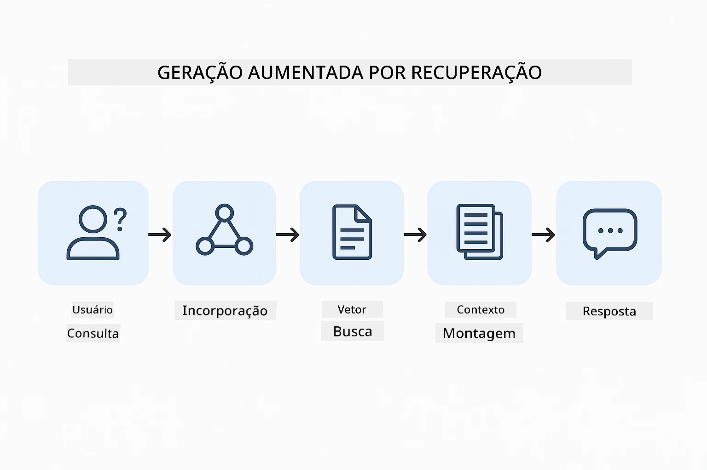
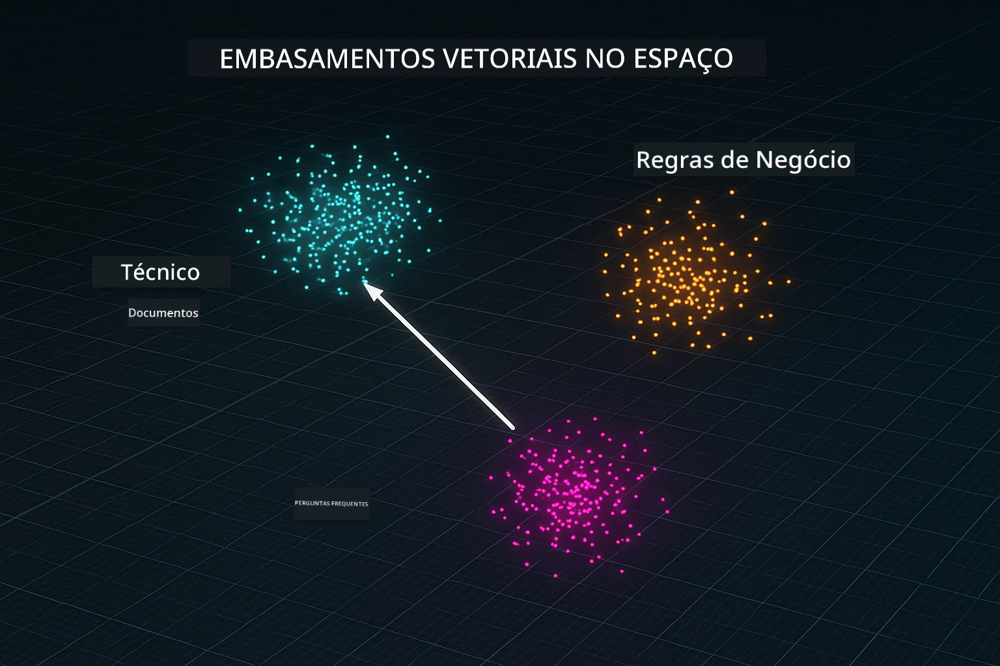
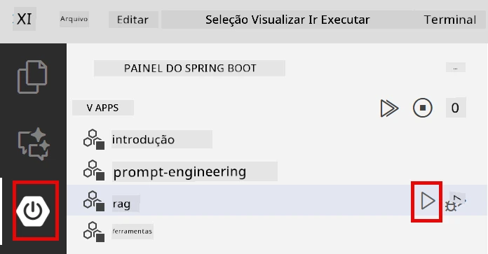
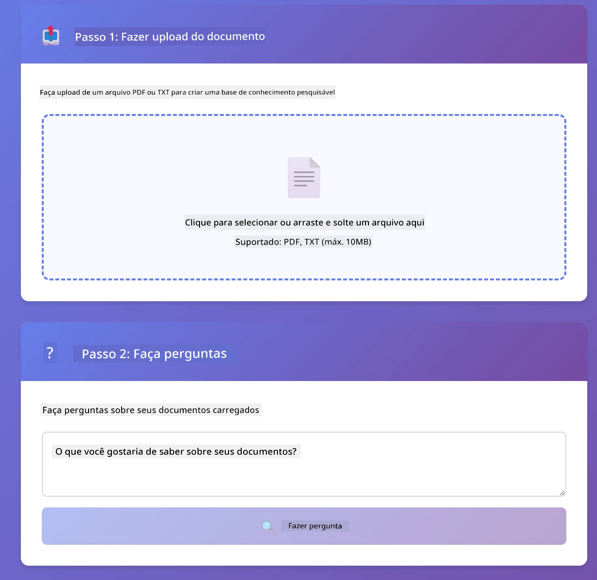
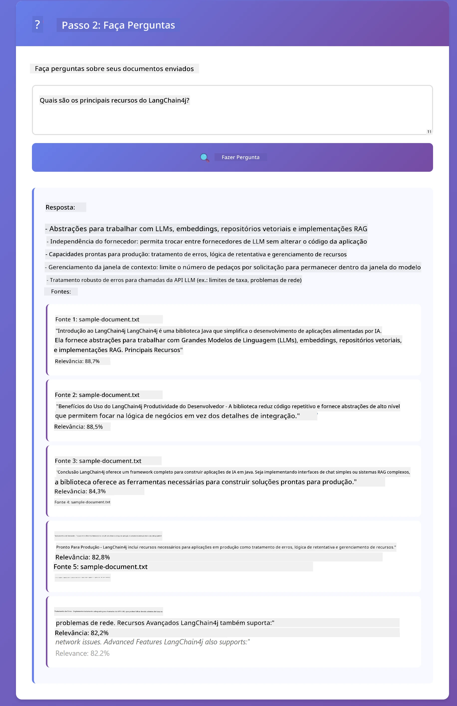

# Módulo 03: RAG (Geração Aumentada por Recuperação)

## Índice

- [Vídeo Tutorial](#vídeo-tutorial)
- [O Que Você Vai Aprender](#o-que-você-vai-aprender)
- [Pré-requisitos](#pré-requisitos)
- [Entendendo o RAG](#entendendo-o-rag)
  - [Qual abordagem RAG este tutorial utiliza?](#qual-abordagem-rag-este-tutorial-utiliza)
- [Como Funciona](#como-funciona)
  - [Processamento de Documentos](#processamento-de-documentos)
  - [Criando Embeddings](#criando-embeddings)
  - [Busca Semântica](#busca-semântica)
  - [Geração de Respostas](#geração-de-resposta)
- [Executar a Aplicação](#executar-a-aplicação)
- [Usando a Aplicação](#usando-a-aplicação)
  - [Enviar um Documento](#fazer-upload-de-um-documento)
  - [Fazer Perguntas](#fazer-perguntas)
  - [Verificar Referências das Fontes](#verificar-referências-das-fontes)
  - [Experimentar com Perguntas](#experimente-com-perguntas)
- [Conceitos-Chave](#conceitos-chave)
  - [Estratégia de Fragmentação](#estratégia-de-divisão-em-pedaços)
  - [Pontuações de Similaridade](#pontuações-de-similaridade)
  - [Armazenamento em Memória](#armazenamento-em-memória)
  - [Gerenciamento da Janela de Contexto](#gerenciamento-da-janela-de-contexto)
- [Quando o RAG Importa](#quando-o-rag-importa)
- [Próximos Passos](#próximos-passos)

## Vídeo Tutorial

Assista a esta sessão ao vivo que explica como começar com este módulo:

<a href="https://www.youtube.com/watch?v=_olq75ZH_eY"></a>

## O Que Você Vai Aprender

Nos módulos anteriores, você aprendeu a ter conversas com IA e estruturar seus prompts de forma eficaz. Mas há uma limitação fundamental: os modelos de linguagem só sabem o que aprenderam durante o treinamento. Eles não podem responder perguntas sobre as políticas da sua empresa, sua documentação de projeto ou qualquer informação na qual eles não foram treinados.

RAG (Geração Aumentada por Recuperação) resolve esse problema. Em vez de tentar ensinar o modelo suas informações (o que é caro e impraticável), você dá a ele a capacidade de buscar em seus documentos. Quando alguém faz uma pergunta, o sistema encontra informações relevantes e as inclui no prompt. O modelo então responde com base nesse contexto recuperado.

Pense no RAG como dar ao modelo uma biblioteca de referência. Quando você faz uma pergunta, o sistema:

1. **Consulta do Usuário** - Você faz uma pergunta  
2. **Embedding** - Converte sua pergunta em um vetor  
3. **Busca Vetorial** - Encontra fragmentos de documentos semelhantes  
4. **Montagem do Contexto** - Adiciona os fragmentos relevantes ao prompt  
5. **Resposta** - O LLM gera uma resposta baseado no contexto

Isso fundamenta as respostas do modelo nos seus dados reais, em vez de depender somente do conhecimento do treinamento ou inventar respostas.

## Pré-requisitos

- Módulo [01 - Introdução](../01-introduction/README.md) concluído (recursos Azure OpenAI implantados, incluindo o modelo de embedding `text-embedding-3-small`)  
- Arquivo `.env` no diretório raiz com credenciais Azure (criado pelo `azd up` no Módulo 01)  

> **Nota:** Se você não completou o Módulo 01, siga as instruções de implantação lá primeiro. O comando `azd up` implanta tanto o modelo de chat GPT quanto o modelo de embedding usado por este módulo.

## Entendendo o RAG

O diagrama abaixo ilustra o conceito principal: em vez de depender apenas dos dados de treino do modelo, o RAG fornece uma biblioteca de referência dos seus documentos para consultar antes de gerar cada resposta.


*Este diagrama mostra a diferença entre um LLM padrão (que adivinha com base nos dados de treino) e um LLM com RAG (que consulta seus documentos primeiro).*

Veja como as partes se conectam de ponta a ponta. A pergunta do usuário passa por quatro etapas — embedding, busca vetorial, montagem do contexto e geração de resposta — cada uma baseado na anterior:



*Este diagrama mostra o pipeline RAG de ponta a ponta — a consulta do usuário passa por embedding, busca vetorial, montagem do contexto e geração de resposta.*

O restante deste módulo irá detalhar cada etapa, com código que você pode executar e modificar.

### Qual abordagem RAG este tutorial utiliza?

LangChain4j oferece três maneiras de implementar RAG, cada uma com um nível diferente de abstração. O diagrama abaixo compara-as lado a lado:


*Este diagrama compara as três abordagens RAG do LangChain4j — Easy, Native e Advanced — mostrando seus componentes principais e quando usar cada uma.*

| Abordagem | O Que Faz | Compromisso |
|---|---|---|
| **Easy RAG** | Conecta tudo automaticamente via `AiServices` e `ContentRetriever`. Você anota uma interface, conecta um retriever, e o LangChain4j faz embedding, busca e montagem do prompt por trás dos panos. | Código mínimo, mas você não vê o que acontece em cada etapa. |
| **Native RAG** | Você chama o modelo de embedding, busca na loja, constrói o prompt e gera a resposta — um passo explícito de cada vez. | Mais código, mas cada etapa é visível e modificável. |
| **Advanced RAG** | Usa o framework `RetrievalAugmentor` com transformadores de consulta pluggable, roteadores, re-ranqueadores e injetores de conteúdo para pipelines de produção. | Máxima flexibilidade, porém muito mais complexidade. |

**Este tutorial usa a abordagem Native.** Cada etapa do pipeline RAG — embedar a consulta, buscar na loja vetorial, montar o contexto e gerar a resposta — está explicitamente escrita em [`RagService.java`](../../../03-rag/src/main/java/com/example/langchain4j/rag/service/RagService.java). Isso é intencional: como recurso de aprendizado, é mais importante que você veja e entenda cada etapa do que ter o código minimizado. Quando estiver confortável com o funcionamento das partes, você pode evoluir para Easy RAG para protótipos rápidos ou Advanced RAG para sistemas de produção.

> **💡 Curioso sobre Easy RAG?** O LangChain4j também oferece uma abordagem *Easy RAG* onde `AiServices` e um `ContentRetriever` cuidam automaticamente do embedding, busca e montagem do prompt. Este módulo segue um caminho mais explícito — desmistificando esse pipeline para você ver e controlar cada etapa.

O diagrama abaixo mostra o pipeline Easy RAG. Note como `AiServices` e `EmbeddingStoreContentRetriever` ocultam toda a complexidade — você carrega um documento, liga um retriever e obtém respostas. A abordagem Native deste módulo abre cada um desses passos ocultos:


*Este diagrama mostra o pipeline Easy RAG. Compare com a abordagem Native usada neste módulo: Easy RAG oculta embedding, recuperação e montagem do prompt atrás de `AiServices` e `ContentRetriever` — você carrega um documento, conecta um retriever e obtém respostas. A abordagem Native neste módulo abre esse pipeline para que você chame cada etapa (embedar, buscar, montar contexto, gerar) você mesmo, fornecendo total visibilidade e controle.*

## Como Funciona

O pipeline RAG deste módulo é dividido em quatro etapas que executam em sequência toda vez que um usuário faz uma pergunta. Primeiro, um documento enviado é **analisado e fragmentado** em pedaços gerenciáveis. Esses pedaços são então convertidos em **embeddings vetoriais** e armazenados para que possam ser comparados matematicamente. Quando uma consulta chega, o sistema realiza uma **busca semântica** para encontrar os fragmentos mais relevantes e, por fim, os passa como contexto para o LLM gerar a **resposta**. As seções abaixo detalham cada estágio com código real e diagramas. Vamos olhar a primeira etapa.

### Processamento de Documentos

[DocumentService.java](../../../03-rag/src/main/java/com/example/langchain4j/rag/service/DocumentService.java)

Quando você envia um documento, o sistema o analisa (PDF ou texto simples), anexa metadados como o nome do arquivo, e então o quebra em fragmentos — pedaços menores que cabem confortavelmente na janela de contexto do modelo. Esses fragmentos se sobrepõem levemente para que você não perca o contexto nas bordas.

```java
// Analise o arquivo enviado e envolva-o em um Documento LangChain4j
Document document = Document.from(content, metadata);

// Divida em blocos de 300 tokens com sobreposição de 30 tokens
DocumentSplitter splitter = DocumentSplitters
    .recursive(300, 30);

List<TextSegment> segments = splitter.split(document);
```
  
O diagrama abaixo mostra como isso funciona visualmente. Repare como cada fragmento compartilha alguns tokens com seus vizinhos — a sobreposição de 30 tokens garante que nenhum contexto importante fique fora:


*Este diagrama mostra um documento sendo dividido em fragmentos de 300 tokens com 30 tokens de sobreposição, preservando o contexto nas bordas dos fragmentos.*

> **🤖 Experimente com o [GitHub Copilot](https://github.com/features/copilot) Chat:** Abra [`DocumentService.java`](../../../03-rag/src/main/java/com/example/langchain4j/rag/service/DocumentService.java) e pergunte:  
> - "Como o LangChain4j divide documentos em fragmentos e por que a sobreposição é importante?"  
> - "Qual é o tamanho ideal dos fragmentos para diferentes tipos de documento e por quê?"  
> - "Como lidar com documentos em múltiplos idiomas ou com formatação especial?"

### Criando Embeddings

[LangChainRagConfig.java](../../../03-rag/src/main/java/com/example/langchain4j/rag/config/LangChainRagConfig.java)

Cada fragmento é convertido em uma representação numérica chamada embedding — essencialmente um conversor de significado para números. O modelo de embedding não é "inteligente" como um modelo de chat; ele não pode seguir instruções, raciocinar ou responder perguntas. O que ele faz é mapear texto em um espaço matemático onde significados semelhantes ficam próximos — "carro" próximo de "automóvel", "política de reembolso" próximo de "devolver meu dinheiro". Pense em um modelo de chat como uma pessoa com quem você conversa; um modelo de embedding é um sistema de arquivamento ultra eficaz.

O diagrama abaixo visualiza esse conceito — texto entra, vetores numéricos saem, e significados parecidos produzem vetores próximos:


*Este diagrama mostra como um modelo de embedding converte texto em vetores numéricos, colocando significados semelhantes — como "carro" e "automóvel" — próximos uns dos outros no espaço vetorial.*

```java
@Bean
public EmbeddingModel embeddingModel() {
    return OpenAiOfficialEmbeddingModel.builder()
        .baseUrl(azureOpenAiEndpoint)
        .apiKey(azureOpenAiKey)
        .modelName(azureEmbeddingDeploymentName)
        .build();
}

EmbeddingStore<TextSegment> embeddingStore = 
    new InMemoryEmbeddingStore<>();
```
  
O diagrama de classes abaixo mostra os dois fluxos separados em um pipeline RAG e as classes LangChain4j que os implementam. O **fluxo de ingestão** (executado uma vez ao enviar) divide o documento, gera embeddings dos fragmentos e os armazena via `.addAll()`. O **fluxo de consulta** (executado cada vez que um usuário pergunta) gera embedding da questão, busca na loja via `.search()`, e passa o contexto encontrado para o modelo de chat. Ambos os fluxos se conectam pela interface compartilhada `EmbeddingStore<TextSegment>`:


*Este diagrama mostra os dois fluxos do pipeline RAG — ingestão e consulta — e como se conectam através de um EmbeddingStore compartilhado.*

Uma vez armazenados os embeddings, conteúdos semelhantes naturalmente se agrupam no espaço vetorial. A visualização abaixo mostra como documentos sobre tópicos relacionados acabam próximos, o que torna a busca semântica possível:



*Esta visualização mostra como documentos relacionados se agrupam no espaço vetorial 3D, com tópicos como Documentação Técnica, Regras de Negócio e FAQs formando grupos distintos.*

Quando um usuário realiza uma busca, o sistema segue quatro passos: embedar os documentos uma vez, embedar a consulta em cada busca, comparar o vetor da consulta contra todos os vetores armazenados usando similaridade cosseno, e retornar os K fragmentos com as maiores pontuações. O diagrama abaixo ilustra cada etapa e as classes LangChain4j envolvidas:


*Este diagrama mostra o processo de busca via embeddings em quatro etapas: embedar documentos, embedar consulta, comparar vetores com similaridade cosseno e retornar os melhores resultados.*

### Busca Semântica

[RagService.java](../../../03-rag/src/main/java/com/example/langchain4j/rag/service/RagService.java)

Quando você faz uma pergunta, sua questão também é convertida em embedding. O sistema compara o embedding da pergunta com todos os embeddings dos fragmentos do documento. Ele encontra os fragmentos com significados mais similares — não somente palavras-chave correspondentes, mas similaridade semântica real.

```java
Embedding queryEmbedding = embeddingModel.embed(question).content();

EmbeddingSearchRequest searchRequest = EmbeddingSearchRequest.builder()
    .queryEmbedding(queryEmbedding)
    .maxResults(5)
    .minScore(0.5)
    .build();

EmbeddingSearchResult<TextSegment> searchResult = embeddingStore.search(searchRequest);
List<EmbeddingMatch<TextSegment>> matches = searchResult.matches();

for (EmbeddingMatch<TextSegment> match : matches) {
    String relevantText = match.embedded().text();
    double score = match.score();
}
```
  
O diagrama abaixo contrasta busca semântica com busca tradicional por palavra-chave. Uma busca por palavra-chave por "veículo" perde um fragmento sobre "carros e caminhões," mas a busca semântica entende que têm o mesmo significado e o retorna como resultado relevante:


*Este diagrama compara busca baseada em palavras-chave com busca semântica, mostrando como a busca semântica recupera conteúdos conceitualmente relacionados mesmo quando as palavras exatas são diferentes.*

Nos bastidores, a similaridade é medida usando similaridade cosseno — basicamente perguntando "esses dois vetores apontam na mesma direção?" Dois fragmentos podem usar palavras completamente diferentes, mas se significam o mesmo, seus vetores apontam na mesma direção e têm pontuação próxima de 1.0:


*Este diagrama ilustra a similaridade do cosseno como o ângulo entre vetores de embedding — vetores mais alinhados têm pontuação mais próxima de 1,0, indicando maior similaridade semântica.*

> **🤖 Experimente com o [GitHub Copilot](https://github.com/features/copilot) Chat:** Abra [`RagService.java`](../../../03-rag/src/main/java/com/example/langchain4j/rag/service/RagService.java) e pergunte:
> - "Como funciona a busca por similaridade com embeddings e o que determina a pontuação?"
> - "Qual limiar de similaridade devo usar e como isso afeta os resultados?"
> - "Como lidar com casos onde nenhum documento relevante é encontrado?"

### Geração de Resposta

[RagService.java](../../../03-rag/src/main/java/com/example/langchain4j/rag/service/RagService.java)

Os pedaços mais relevantes são reunidos em um prompt estruturado que inclui instruções explícitas, o contexto recuperado e a pergunta do usuário. O modelo lê aqueles pedaços específicos e responde com base nessa informação — ele só pode usar o que está à sua frente, o que previne alucinações.

```java
String context = matches.stream()
    .map(match -> match.embedded().text())
    .collect(Collectors.joining("\n\n"));

String prompt = String.format("""
    Answer the question based on the following context.
    If the answer cannot be found in the context, say so.

    Context:
    %s

    Question: %s

    Answer:""", context, request.question());

String answer = chatModel.chat(prompt);
```

O diagrama abaixo mostra esse processo em ação — os pedaços com maior pontuação da etapa de busca são inseridos no template do prompt, e o `OpenAiOfficialChatModel` gera uma resposta fundamentada:


*Este diagrama mostra como os pedaços com maior pontuação são reunidos em um prompt estruturado, permitindo que o modelo gere uma resposta fundamentada a partir dos seus dados.*

## Executar a Aplicação

**Verifique a implantação:**

Certifique-se de que o arquivo `.env` existe no diretório raiz com credenciais Azure (criado durante o Módulo 01). Execute isso a partir do diretório do módulo (`03-rag/`):

**Bash:**
```bash
cat ../.env  # Deve mostrar AZURE_OPENAI_ENDPOINT, API_KEY, DEPLOYMENT
```

**PowerShell:**
```powershell
Get-Content ..\.env  # Deve mostrar AZURE_OPENAI_ENDPOINT, API_KEY, DEPLOYMENT
```

**Inicie a aplicação:**

> **Nota:** Se você já iniciou todas as aplicações usando `./start-all.sh` a partir do diretório raiz (como descrito no Módulo 01), este módulo já está rodando na porta 8081. Você pode pular os comandos de inicialização abaixo e ir direto para http://localhost:8081.

**Opção 1: Usando o Spring Boot Dashboard (Recomendado para usuários do VS Code)**

O dev container inclui a extensão Spring Boot Dashboard, que fornece uma interface visual para gerenciar todas as aplicações Spring Boot. Você pode encontrá-la na Barra de Atividades à esquerda do VS Code (procure pelo ícone do Spring Boot).

No Spring Boot Dashboard, você pode:
- Ver todas as aplicações Spring Boot disponíveis no workspace
- Iniciar/parar aplicações com um clique
- Visualizar logs da aplicação em tempo real
- Monitorar o status da aplicação

Basta clicar no botão de play ao lado de "rag" para iniciar este módulo, ou iniciar todos os módulos de uma vez.



*Esta captura de tela mostra o Spring Boot Dashboard no VS Code, onde você pode iniciar, parar e monitorar aplicações visualmente.*

**Opção 2: Usando scripts shell**

Inicie todas as aplicações web (módulos 01-04):

**Bash:**
```bash
cd ..  # A partir do diretório raiz
./start-all.sh
```

**PowerShell:**
```powershell
cd ..  # A partir do diretório raiz
.\start-all.ps1
```

Ou inicie apenas este módulo:

**Bash:**
```bash
cd 03-rag
./start.sh
```

**PowerShell:**
```powershell
cd 03-rag
.\start.ps1
```

Ambos os scripts carregam automaticamente as variáveis de ambiente do arquivo `.env` raiz e irão construir os JARs se eles não existirem.

> **Nota:** Se preferir construir todos os módulos manualmente antes de iniciar:
>
> **Bash:**
> ```bash
> cd ..  # Go to root directory
> mvn clean package -DskipTests
> ```
>
> **PowerShell:**
> ```powershell
> cd ..  # Go to root directory
> mvn clean package -DskipTests
> ```

Abra http://localhost:8081 no seu navegador.

**Para parar:**

**Bash:**
```bash
./stop.sh  # Apenas este módulo
# Ou
cd .. && ./stop-all.sh  # Todos os módulos
```

**PowerShell:**
```powershell
.\stop.ps1  # Apenas este módulo
# Ou
cd ..; .\stop-all.ps1  # Todos os módulos
```

## Usando a Aplicação

A aplicação oferece uma interface web para upload de documentos e perguntas.

<a href="images/rag-homepage.png"></a>

*Esta captura de tela mostra a interface da aplicação RAG onde você carrega documentos e faz perguntas.*

### Fazer Upload de um Documento

Comece fazendo upload de um documento — arquivos TXT funcionam melhor para teste. Um `sample-document.txt` é fornecido neste diretório que contém informações sobre recursos do LangChain4j, implementação RAG e melhores práticas — perfeito para testar o sistema.

O sistema processa seu documento, divide em pedaços e cria embeddings para cada pedaço. Isso acontece automaticamente ao enviar o arquivo.

### Fazer Perguntas

Agora faça perguntas específicas sobre o conteúdo do documento. Tente algo factual que esteja claramente declarado no documento. O sistema busca pedaços relevantes, inclui-os no prompt e gera uma resposta.

### Verificar Referências das Fontes

Repare que cada resposta inclui referências das fontes com pontuações de similaridade. Essas pontuações (de 0 a 1) mostram quão relevante cada pedaço foi para sua pergunta. Pontuações mais altas significam melhores correspondências. Isso permite que você verifique a resposta em relação ao material fonte.

<a href="images/rag-query-results.png"></a>

*Esta captura de tela mostra os resultados da consulta com a resposta gerada, referências das fontes e pontuações de relevância para cada pedaço recuperado.*

### Experimente com Perguntas

Teste diferentes tipos de perguntas:
- Fatos específicos: "Qual é o tema principal?"
- Comparações: "Qual é a diferença entre X e Y?"
- Resumos: "Resuma os pontos-chave sobre Z"

Observe como as pontuações de relevância mudam com base em quão bem sua pergunta corresponde ao conteúdo do documento.

## Conceitos-Chave

### Estratégia de Divisão em Pedaços

Documentos são divididos em pedaços de 300 tokens com 30 tokens de sobreposição. Este equilíbrio garante que cada pedaço tenha contexto suficiente para ser significativo, enquanto permanece pequeno o bastante para incluir múltiplos pedaços no prompt.

### Pontuações de Similaridade

Cada pedaço recuperado vem com uma pontuação de similaridade entre 0 e 1 que indica o quão próximo ele corresponde à pergunta do usuário. O diagrama abaixo visualiza os intervalos de pontuação e como o sistema os usa para filtrar resultados:


*Este diagrama mostra intervalos de pontuação de 0 a 1, com um limiar mínimo de 0,5 que filtra pedaços irrelevantes.*

As pontuações variam de 0 a 1:
- 0,7-1,0: Altamente relevante, correspondência exata
- 0,5-0,7: Relevante, bom contexto
- Abaixo de 0,5: Filtrado, muito dissimilar

O sistema recupera apenas pedaços acima do limiar mínimo para garantir qualidade.

Embeddings funcionam bem quando o significado forma clusters claros, mas possuem pontos cegos. O diagrama abaixo mostra modos comuns de falha — pedaços muito grandes produzem vetores confusos, pedaços pequenos demais carecem de contexto, termos ambíguos apontam para múltiplos clusters, e buscas de correspondência exata (IDs, números de peça) não funcionam com embeddings:


*Este diagrama mostra modos comuns de falha em embeddings: pedaços muito grandes, pedaços muito pequenos, termos ambíguos que apontam para múltiplos clusters, e buscas de correspondência exata como IDs.*

### Armazenamento em Memória

Este módulo usa armazenamento em memória para simplicidade. Quando você reinicia a aplicação, os documentos enviados são perdidos. Sistemas de produção usam bancos de dados vetoriais persistentes como Qdrant ou Azure AI Search.

### Gerenciamento da Janela de Contexto

Cada modelo tem uma janela máxima de contexto. Você não pode incluir todos os pedaços de um documento grande. O sistema recupera os N pedaços mais relevantes (padrão 5) para ficar dentro dos limites enquanto fornece contexto suficiente para respostas precisas.

## Quando o RAG Importa

RAG nem sempre é a abordagem correta. O guia de decisão abaixo ajuda a determinar quando o RAG agrega valor versus quando abordagens mais simples — como incluir conteúdo diretamente no prompt ou confiar no conhecimento embutido do modelo — são suficientes:


*Este diagrama mostra um guia de decisão para quando o RAG agrega valor versus quando abordagens mais simples são suficientes.*

## Próximos Passos

**Próximo Módulo:** [04-tools - Agentes de IA com Ferramentas](../04-tools/README.md)

---

**Navegação:** [← Anterior: Módulo 02 - Engenharia de Prompt](../02-prompt-engineering/README.md) | [Voltar ao Início](../README.md) | [Próximo: Módulo 04 - Ferramentas →](../04-tools/README.md)

---

<!-- CO-OP TRANSLATOR DISCLAIMER START -->
**Aviso Legal**:
Este documento foi traduzido usando o serviço de tradução por IA [Co-op Translator](https://github.com/Azure/co-op-translator). Embora nos esforcemos pela precisão, por favor, esteja ciente de que traduções automatizadas podem conter erros ou imprecisões. O documento original em seu idioma nativo deve ser considerado a fonte autorizada. Para informações críticas, recomenda-se tradução profissional humana. Não nos responsabilizamos por quaisquer mal-entendidos ou interpretações incorretas decorrentes do uso desta tradução.
<!-- CO-OP TRANSLATOR DISCLAIMER END -->