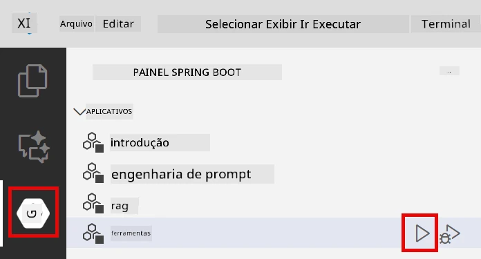
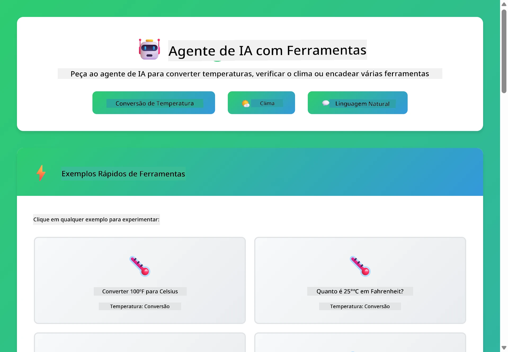
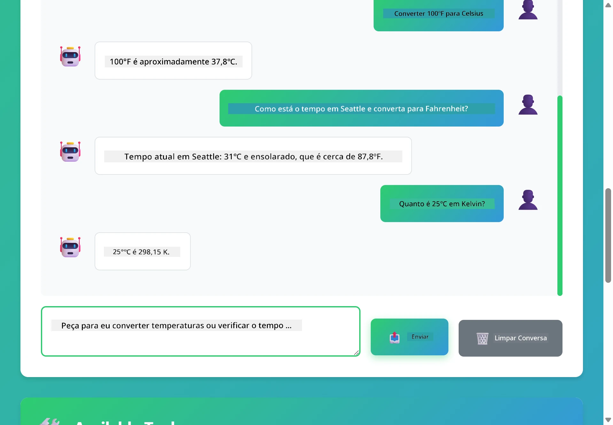

# Módulo 04: Agentes de IA com Ferramentas

## Índice

- [Vídeo Passo a Passo](#vídeo-passo-a-passo)
- [O Que Você Vai Aprender](#o-que-você-vai-aprender)
- [Pré-requisitos](#pré-requisitos)
- [Compreendendo Agentes de IA com Ferramentas](#compreendendo-agentes-de-ia-com-ferramentas)
- [Como Funciona a Chamada de Ferramentas](#como-funciona-a-chamada-de-ferramentas)
  - [Definições de Ferramentas](#definições-de-ferramentas)
  - [Tomada de Decisão](#tomada-de-decisão)
  - [Execução](#execução)
  - [Geração de Resposta](#geração-de-resposta)
  - [Arquitetura: Auto-Injeção do Spring Boot](#arquitetura-auto-injeção-do-spring-boot)
- [Encadeamento de Ferramentas](#encadeamento-de-ferramentas)
- [Executar a Aplicação](#executar-a-aplicação)
- [Usando a Aplicação](#usando-a-aplicação)
  - [Teste o Uso Simples de Ferramentas](#experimente-o-uso-simples-de-ferramentas)
  - [Teste o Encadeamento de Ferramentas](#teste-a-encadeação-de-ferramentas)
  - [Veja o Fluxo da Conversa](#veja-o-fluxo-da-conversa)
  - [Experimente Diferentes Solicitações](#experimente-diferentes-solicitações)
- [Conceitos Chave](#conceitos-chave)
  - [Padrão ReAct (Raciocínio e Ação)](#padrão-react-raciocínio-e-ação)
  - [Descrições das Ferramentas Importam](#descrições-de-ferramentas-importam)
  - [Gerenciamento de Sessão](#gerenciamento-de-sessão)
  - [Tratamento de Erros](#tratamento-de-erros)
- [Ferramentas Disponíveis](#ferramentas-disponíveis)
- [Quando Usar Agentes Baseados em Ferramentas](#quando-usar-agentes-baseados-em-ferramentas)
- [Ferramentas vs RAG](#ferramentas-vs-rag)
- [Próximos Passos](#próximos-passos)

## Vídeo Passo a Passo

Assista a esta sessão ao vivo que explica como começar com este módulo:

<a href="https://www.youtube.com/watch?v=O_J30kZc0rw"></a>

## O Que Você Vai Aprender

Até agora, você aprendeu como ter conversas com IA, estruturar prompts de forma eficaz e basear respostas em seus documentos. Mas ainda há uma limitação fundamental: modelos de linguagem só conseguem gerar texto. Eles não conseguem verificar a previsão do tempo, realizar cálculos, consultar bancos de dados ou interagir com sistemas externos.

Ferramentas mudam isso. Ao dar ao modelo acesso a funções que ele pode chamar, você o transforma de um gerador de texto em um agente que pode agir. O modelo decide quando precisa de uma ferramenta, qual usar e quais parâmetros passar. Seu código executa a função e retorna o resultado. O modelo incorpora esse resultado em sua resposta.

## Pré-requisitos

- Ter concluído o [Módulo 01 - Introdução](../01-introduction/README.md) (recursos Azure OpenAI implantados)
- Ter concluído os módulos anteriores recomendados (este módulo faz referências aos [conceitos de RAG do Módulo 03](../03-rag/README.md) na comparação Ferramentas vs RAG)
- Arquivo `.env` na raiz com credenciais Azure (criado por `azd up` no Módulo 01)

> **Nota:** Se você não completou o Módulo 01, siga primeiro as instruções de implantação daquele módulo.

## Compreendendo Agentes de IA com Ferramentas

> **📝 Nota:** O termo "agentes" neste módulo refere-se a assistentes de IA aprimorados com a capacidade de chamar ferramentas. Isso é diferente dos padrões de **Agentic AI** (agentes autônomos com planejamento, memória e raciocínio multi-etapas) que abordaremos no [Módulo 05: MCP](../05-mcp/README.md).

Sem ferramentas, um modelo de linguagem só pode gerar texto a partir de seus dados de treinamento. Pergunte sobre o tempo atual e ele terá que adivinhar. Dê ferramentas a ele, e ele pode chamar uma API de clima, fazer cálculos, ou consultar um banco de dados — e então entrelaçar esses resultados reais em sua resposta.


*Sem ferramentas, o modelo só pode adivinhar — com ferramentas, ele pode chamar APIs, fazer cálculos e retornar dados em tempo real.*

Um agente de IA com ferramentas segue o padrão **Raciocínio e Ação (ReAct)**. O modelo não apenas responde — ele pensa no que precisa, age chamando uma ferramenta, observa o resultado e então decide se age novamente ou entrega a resposta final:

1. **Raciocina** — O agente analisa a pergunta do usuário e determina quais informações precisa
2. **Age** — O agente seleciona a ferramenta correta, gera os parâmetros e a chama
3. **Observa** — O agente recebe a saída da ferramenta e avalia o resultado
4. **Repete ou Responde** — Se precisar de mais dados, o agente volta ao início; senão, compõe a resposta em linguagem natural


*O ciclo ReAct — o agente raciocina sobre o que fazer, age chamando uma ferramenta, observa o resultado e repete até entregar a resposta final.*

Isso acontece automaticamente. Você define as ferramentas e suas descrições. O modelo cuida da decisão de quando e como usá-las.

## Como Funciona a Chamada de Ferramentas

### Definições de Ferramentas

[WeatherTool.java](../../../04-tools/src/main/java/com/example/langchain4j/agents/tools/WeatherTool.java) | [TemperatureTool.java](../../../04-tools/src/main/java/com/example/langchain4j/agents/tools/TemperatureTool.java)

Você define funções com descrições claras e especificações de parâmetros. O modelo vê essas descrições no prompt do sistema e entende o que cada ferramenta faz.

```java
@Component
public class WeatherTool {
    
    @Tool("Get the current weather for a location")
    public String getCurrentWeather(@P("Location name") String location) {
        // Sua lógica de consulta de clima
        return "Weather in " + location + ": 22°C, cloudy";
    }
}

@AiService
public interface Assistant {
    String chat(@MemoryId String sessionId, @UserMessage String message);
}

// O assistente é automaticamente conectado pelo Spring Boot com:
// - Bean ChatModel
// - Todos os métodos @Tool das classes @Component
// - ChatMemoryProvider para gerenciamento de sessão
```

O diagrama abaixo explica cada anotação e mostra como cada parte ajuda a IA a entender quando chamar a ferramenta e quais argumentos passar:


*Anatomia de uma definição de ferramenta — @Tool indica à IA quando usar, @P descreve cada parâmetro, e @AiService conecta tudo na inicialização.*

> **🤖 Experimente com [GitHub Copilot](https://github.com/features/copilot) Chat:** Abra [`WeatherTool.java`](../../../04-tools/src/main/java/com/example/langchain4j/agents/tools/WeatherTool.java) e pergunte:
> - "Como eu integraria uma API real de clima como OpenWeatherMap em vez de dados mock?"
> - "O que faz uma boa descrição de ferramenta que ajuda a IA a usá-la corretamente?"
> - "Como eu trato erros de API e limites de taxa nas implementações das ferramentas?"

### Tomada de Decisão

Quando um usuário pergunta "Como está o tempo em Seattle?", o modelo não escolhe uma ferramenta aleatoriamente. Ele compara a intenção do usuário com cada descrição de ferramenta que tem acesso, avalia a relevância de cada uma e seleciona a melhor. Depois gera uma chamada de função estruturada com os parâmetros corretos — neste caso, definindo `location` como `"Seattle"`.

Se nenhuma ferramenta corresponder ao pedido do usuário, o modelo tenta responder usando seu próprio conhecimento. Se várias ferramentas corresponderem, ele escolhe a mais específica.


*O modelo avalia cada ferramenta disponível em relação à intenção do usuário e seleciona a melhor — por isso é importante escrever descrições de ferramentas claras e específicas.*

### Execução

[AgentService.java](../../../04-tools/src/main/java/com/example/langchain4j/agents/service/AgentService.java)

O Spring Boot injeta automaticamente a interface declarativa `@AiService` com todas as ferramentas registradas, e LangChain4j executa as chamadas às ferramentas automaticamente. Por trás disso, uma chamada completa passa por seis etapas — desde a pergunta em linguagem natural do usuário até a resposta na mesma linguagem:


*O fluxo completo — o usuário faz uma pergunta, o modelo seleciona uma ferramenta, LangChain4j a executa, e o modelo incorpora o resultado na resposta.*

Nos bastidores, `AiServices` executa o mesmo laço de chamada para qualquer ferramenta — aqui ilustrado com um simples `Calculator`. O diagrama de sequência abaixo mostra exatamente o que acontece nos bastidores:


*O ciclo de chamada — `AiServices` envia sua mensagem e esquemas de ferramentas para o LLM, o LLM responde com uma chamada de função como `add(42, 58)`, LangChain4j executa o método `Calculator` localmente e fornece o resultado para a resposta final.*

> **🤖 Experimente com [GitHub Copilot](https://github.com/features/copilot) Chat:** Abra [`AgentService.java`](../../../04-tools/src/main/java/com/example/langchain4j/agents/service/AgentService.java) e pergunte:
> - "Como funciona o padrão ReAct e por que é eficaz para agentes de IA?"
> - "Como o agente decide qual ferramenta usar e em que ordem?"
> - "O que acontece se a execução da ferramenta falhar — como tratar erros de forma robusta?"

### Geração de Resposta

O modelo recebe os dados do clima e formata em uma resposta em linguagem natural para o usuário.

### Arquitetura: Auto-Injeção do Spring Boot

Este módulo usa a integração do LangChain4j com Spring Boot via interfaces declarativas `@AiService`. Na inicialização, o Spring Boot descobre cada `@Component` que contém métodos `@Tool`, seu bean `ChatModel` e o `ChatMemoryProvider` — e conecta tudo em uma única interface `Assistant` sem código repetitivo.


*A interface @AiService conecta o ChatModel, componentes de ferramentas e o provedor de memória — o Spring Boot cuida de toda injeção automaticamente.*

Aqui está o ciclo completo de uma requisição como diagrama de sequência — desde a requisição HTTP pelo controller, passando pelo serviço e proxy injetado automaticamente, até a execução da ferramenta e retorno:


*Ciclo completo da requisição Spring Boot — a requisição HTTP passa pelo controller e serviço até o proxy do Assistant auto-injetado, que orquestra o LLM e chamadas de ferramentas automaticamente.*

Principais benefícios dessa abordagem:

- **Auto-injeção do Spring Boot** — ChatModel e ferramentas são injetados automaticamente
- **Padrão @MemoryId** — Gerenciamento automático de memória por sessão
- **Instância única** — Assistant criado uma vez e reutilizado para melhor performance
- **Execução com segurança de tipos** — Métodos Java chamados diretamente com conversão de tipos
- **Orquestração multi-turno** — Lida com encadeamento de ferramentas automaticamente
- **Zero código repetitivo** — Sem chamadas manuais `AiServices.builder()` ou mapas de memória

Abordagens alternativas (construção manual com `AiServices.builder()`) requerem mais código e perdem os benefícios da integração com Spring Boot.

## Encadeamento de Ferramentas

**Encadeamento de Ferramentas** — O verdadeiro poder dos agentes baseados em ferramentas aparece quando uma única pergunta exige múltiplas ferramentas. Pergunte "Como está o tempo em Seattle em Fahrenheit?" e o agente encadeia automaticamente duas ferramentas: primeiro chama `getCurrentWeather` para obter a temperatura em Celsius, depois passa esse valor para `celsiusToFahrenheit` para conversão — tudo em um único turno de conversa.


*Encadeamento de ferramentas em ação — o agente chama getCurrentWeather primeiro, depois passa o resultado em Celsius para celsiusToFahrenheit, entregando uma resposta combinada.*

**Falhas Graciosas** — Peça o clima de uma cidade que não está nos dados mock. A ferramenta retorna uma mensagem de erro, e a IA explica que não pode ajudar ao invés de travar. As ferramentas falham de forma segura. O diagrama abaixo contrasta as duas abordagens — com tratamento adequado de erros, o agente captura a exceção e responde com ajuda, enquanto sem isso a aplicação inteira trava:


*Quando uma ferramenta falha, o agente captura o erro e responde com uma explicação útil ao invés de travar.*

Isso acontece em um único turno da conversa. O agente orquestra múltiplas chamadas de ferramentas autonomamente.

## Executar a Aplicação

**Verifique a implantação:**

Garanta que o arquivo `.env` exista na raiz com as credenciais Azure (criado durante o Módulo 01). Execute a partir do diretório do módulo (`04-tools/`):

**Bash:**
```bash
cat ../.env  # Deve mostrar AZURE_OPENAI_ENDPOINT, API_KEY, DEPLOYMENT
```

**PowerShell:**
```powershell
Get-Content ..\.env  # Deve mostrar AZURE_OPENAI_ENDPOINT, API_KEY, DEPLOYMENT
```

**Inicie a aplicação:**

> **Nota:** Se você já iniciou todas as aplicações usando `./start-all.sh` na raiz (como descrito no Módulo 01), este módulo já está rodando na porta 8084. Você pode pular os comandos de inicialização abaixo e acessar diretamente http://localhost:8084.

**Opção 1: Usando o Spring Boot Dashboard (Recomendado para usuários VS Code)**

O container de desenvolvimento inclui a extensão Spring Boot Dashboard, que oferece uma interface visual para gerenciar todas as aplicações Spring Boot. Você pode encontrá-la na Barra de Atividades à esquerda do VS Code (procure o ícone do Spring Boot).

Pelo Spring Boot Dashboard, você pode:
- Ver todas as aplicações Spring Boot disponíveis no workspace
- Iniciar/parar aplicações com um clique
- Visualizar os logs da aplicação em tempo real
- Monitorar o status das aplicações

Basta clicar no botão de play ao lado de "tools" para iniciar este módulo, ou iniciar todos os módulos de uma vez.

Veja como o Spring Boot Dashboard aparece no VS Code:


*O Painel Spring Boot no VS Code — iniciar, parar e monitorar todos os módulos em um só lugar*

**Opção 2: Usando scripts shell**

Inicie todas as aplicações web (módulos 01-04):

**Bash:**
```bash
cd ..  # Do diretório raiz
./start-all.sh
```

**PowerShell:**
```powershell
cd ..  # Do diretório raiz
.\start-all.ps1
```

Ou inicie apenas este módulo:

**Bash:**
```bash
cd 04-tools
./start.sh
```

**PowerShell:**
```powershell
cd 04-tools
.\start.ps1
```

Ambos os scripts carregam automaticamente as variáveis de ambiente do arquivo `.env` raiz e irão compilar os JARs caso eles não existam.

> **Nota:** Se preferir compilar todos os módulos manualmente antes de iniciar:
>
> **Bash:**
> ```bash
> cd ..  # Go to root directory
> mvn clean package -DskipTests
> ```
>
> **PowerShell:**
> ```powershell
> cd ..  # Go to root directory
> mvn clean package -DskipTests
> ```

Abra http://localhost:8084 no seu navegador.

**Para parar:**

**Bash:**
```bash
./stop.sh  # Apenas este módulo
# Ou
cd .. && ./stop-all.sh  # Todos os módulos
```

**PowerShell:**
```powershell
.\stop.ps1  # Apenas este módulo
# Ou
cd ..; .\stop-all.ps1  # Todos os módulos
```

## Usando a Aplicação

A aplicação oferece uma interface web onde você pode interagir com um agente de IA que tem acesso a ferramentas de clima e conversão de temperatura. Veja como é a interface — inclui exemplos para início rápido e um painel de chat para enviar solicitações:

<a href="images/tools-homepage.png"></a>

*Interface das Ferramentas do Agente de IA - exemplos rápidos e interface de chat para interagir com as ferramentas*

### Experimente o Uso Simples de Ferramentas

Comece com um pedido simples: "Converter 100 graus Fahrenheit para Celsius". O agente reconhece que precisa da ferramenta de conversão de temperatura, a chama com os parâmetros corretos e retorna o resultado. Note como isso soa natural — você não especificou qual ferramenta usar nem como chamá-la.

### Teste a Encadeação de Ferramentas

Agora tente algo mais complexo: "Qual é o tempo em Seattle e converta para Fahrenheit?" Veja o agente trabalhar isso em etapas. Primeiro ele obtém o clima (que retorna em Celsius), reconhece que precisa converter para Fahrenheit, chama a ferramenta de conversão, e combina os dois resultados em uma resposta única.

### Veja o Fluxo da Conversa

A interface de chat mantém o histórico da conversa, permitindo interações com múltiplas trocas. Você pode ver todas as consultas e respostas anteriores, facilitando acompanhar a conversa e entender como o agente constrói o contexto ao longo de várias interações.

<a href="images/tools-conversation-demo.png"></a>

*Conversa multi-turno mostrando conversões simples, consultas de clima e encadeamento de ferramentas*

### Experimente diferentes solicitações

Teste várias combinações:
- Consultas de clima: "Qual o clima em Tóquio?"
- Conversões de temperatura: "Quanto é 25°C em Kelvin?"
- Consultas combinadas: "Verifique o clima em Paris e me diga se está acima de 20°C"

Note como o agente interpreta a linguagem natural e mapeia para chamadas adequadas às ferramentas.

## Conceitos-Chave

### Padrão ReAct (Raciocínio e Ação)

O agente alterna entre raciocinar (decidir o que fazer) e agir (usar ferramentas). Esse padrão possibilita solução autônoma de problemas, em vez de apenas responder às instruções.

### Descrições de Ferramentas Importam

A qualidade das descrições das suas ferramentas afeta diretamente a forma como o agente as utiliza. Descrições claras e específicas ajudam o modelo a entender quando e como chamar cada ferramenta.

### Gerenciamento de Sessão

A anotação `@MemoryId` permite gerenciamento automático de memória baseado em sessão. Cada ID de sessão recebe sua própria instância `ChatMemory` gerenciada pelo bean `ChatMemoryProvider`, assim múltiplos usuários podem interagir com o agente simultaneamente sem misturar as conversas. O diagrama abaixo mostra como múltiplos usuários são roteados para memórias isoladas baseadas em seus IDs de sessão:


*Cada ID de sessão mapeia para um histórico de conversa isolado — usuários nunca veem as mensagens uns dos outros.*

### Tratamento de Erros

Ferramentas podem falhar — APIs com timeout, parâmetros inválidos, serviços externos indisponíveis. Agentes para produção precisam de tratamento de erros para que o modelo possa explicar problemas ou tentar alternativas em vez de travar a aplicação inteira. Quando uma ferramenta lança uma exceção, LangChain4j a captura e envia a mensagem de erro de volta ao modelo, que pode então explicar o problema em linguagem natural.

## Ferramentas Disponíveis

O diagrama abaixo mostra o amplo ecossistema de ferramentas que você pode construir. Este módulo demonstra ferramentas de clima e temperatura, mas o mesmo padrão `@Tool` funciona para qualquer método Java — desde consultas a banco de dados até processamento de pagamentos.


*Qualquer método Java anotado com @Tool fica disponível para a IA — o padrão se estende a bancos de dados, APIs, email, operações de arquivos e muito mais.*

## Quando Usar Agentes Baseados em Ferramentas

Nem toda solicitação precisa de ferramentas. A decisão depende se a IA precisa interagir com sistemas externos ou pode responder com seu próprio conhecimento. O guia a seguir resume quando as ferramentas agregam valor e quando não são necessárias:


*Um guia rápido para decisão — ferramentas são para dados em tempo real, cálculos e ações; conhecimentos gerais e tarefas criativas não precisam delas.*

## Ferramentas vs RAG

Os módulos 03 e 04 estendem o que a IA pode fazer, mas de formas fundamentalmente diferentes. RAG dá ao modelo acesso a **conhecimento** recuperando documentos. Ferramentas dão ao modelo a capacidade de tomar **ações** chamando funções. O diagrama abaixo compara as duas abordagens lado a lado — desde como cada fluxo opera até as compensações entre eles:


*RAG recupera informações de documentos estáticos — Ferramentas executam ações e buscam dados dinâmicos em tempo real. Muitos sistemas de produção combinam ambos.*

Na prática, muitos sistemas de produção combinam ambas as abordagens: RAG para fundamentar respostas na sua documentação e Ferramentas para buscar dados ao vivo ou executar operações.

## Próximos Passos

**Próximo Módulo:** [05-mcp - Protocolo de Contexto de Modelo (MCP)](../05-mcp/README.md)

---

**Navegação:** [← Anterior: Módulo 03 - RAG](../03-rag/README.md) | [Voltar ao Início](../README.md) | [Próximo: Módulo 05 - MCP →](../05-mcp/README.md)

---

<!-- CO-OP TRANSLATOR DISCLAIMER START -->
**Aviso Legal**:
Este documento foi traduzido usando o serviço de tradução por IA [Co-op Translator](https://github.com/Azure/co-op-translator). Embora nos esforcemos pela precisão, por favor, esteja ciente de que traduções automatizadas podem conter erros ou imprecisões. O documento original em seu idioma nativo deve ser considerado a fonte autorizada. Para informações críticas, recomenda-se tradução profissional humana. Não nos responsabilizamos por quaisquer mal-entendidos ou interpretações incorretas decorrentes do uso desta tradução.
<!-- CO-OP TRANSLATOR DISCLAIMER END -->