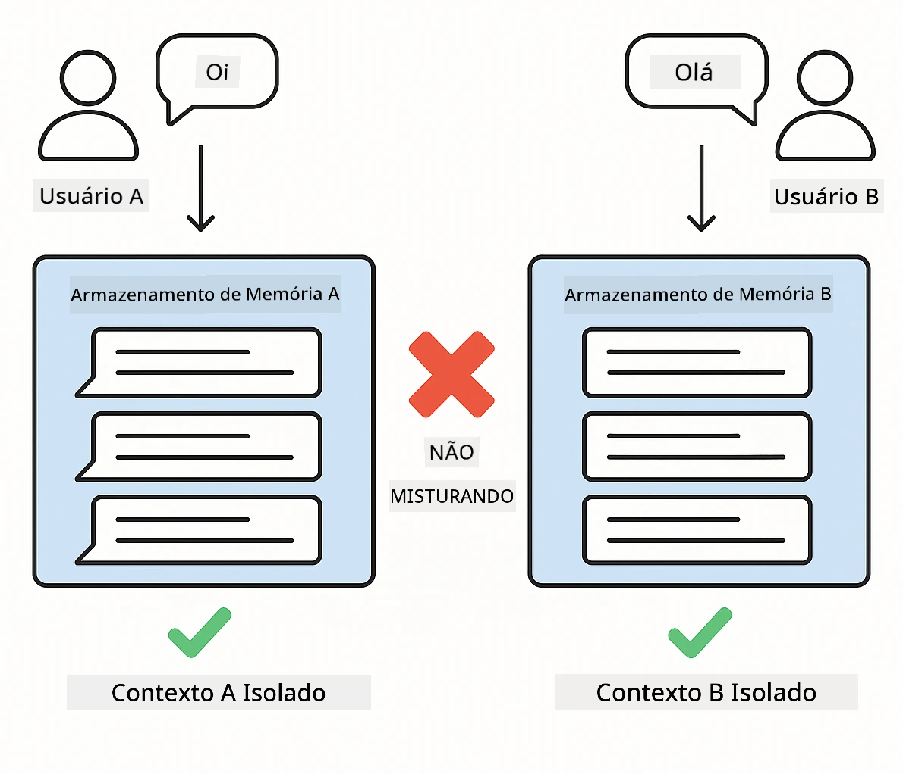

# Testando Aplicações LangChain4j

## Sumário

- [Início Rápido](../../../docs)
- [O que os Testes Cobrem](../../../docs)
- [Executando os Testes](../../../docs)
- [Executando Testes no VS Code](../../../docs)
- [Padrões de Teste](../../../docs)
- [Filosofia de Testes](../../../docs)
- [Próximos Passos](../../../docs)

Este guia apresenta os testes que demonstram como testar aplicações de IA sem exigir chaves de API ou serviços externos.

## Início Rápido

Execute todos os testes com um único comando:

**Bash:**
```bash
mvn test
```

**PowerShell:**
```powershell
mvn --% test
```


*Execução bem-sucedida dos testes mostrando todos os testes passando sem falhas*

## O que os Testes Cobrem

Este curso foca em **testes unitários** que são executados localmente. Cada teste demonstra um conceito específico do LangChain4j isoladamente.


*Pirâmide de testes mostrando o equilíbrio entre testes unitários (rápidos, isolados), testes de integração (componentes reais) e testes de ponta a ponta. Este treinamento cobre testes unitários.*

| Módulo | Testes | Foco | Arquivos Principais |
|--------|-------|-------|-----------|
| **00 - Início Rápido** | 6 | Modelos de prompt e substituição de variáveis | `SimpleQuickStartTest.java` |
| **01 - Introdução** | 8 | Memória de conversa e chat com estado | `SimpleConversationTest.java` |
| **02 - Engenharia de Prompt** | 12 | Padrões GPT-5, níveis de prontidão, saída estruturada | `SimpleGpt5PromptTest.java` |
| **03 - RAG** | 10 | Ingestão de documentos, embeddings, busca por similaridade | `DocumentServiceTest.java` |
| **04 - Ferramentas** | 12 | Chamada de funções e encadeamento de ferramentas | `SimpleToolsTest.java` |
| **05 - MCP** | 8 | Model Context Protocol com transporte stdio | `SimpleMcpTest.java` |

## Executando os Testes

**Execute todos os testes a partir da raiz:**

**Bash:**
```bash
mvn test
```

**PowerShell:**
```powershell
mvn --% test
```

**Execute os testes de um módulo específico:**

**Bash:**
```bash
cd 01-introduction && mvn test
# Ou a partir da raiz
mvn test -pl 01-introduction
```

**PowerShell:**
```powershell
cd 01-introduction; mvn --% test
# Ou a partir da raiz
mvn --% test -pl 01-introduction
```

**Execute uma única classe de teste:**

**Bash:**
```bash
mvn test -Dtest=SimpleConversationTest
```

**PowerShell:**
```powershell
mvn --% test -Dtest=SimpleConversationTest
```

**Execute um método de teste específico:**

**Bash:**
```bash
mvn test -Dtest=SimpleConversationTest#deveManterHistoricoDeConversas
```

**PowerShell:**
```powershell
mvn --% test -Dtest=SimpleConversationTest#deve manter o histórico da conversa
```

## Executando Testes no VS Code

Se você estiver usando o Visual Studio Code, o Test Explorer fornece uma interface gráfica para executar e depurar testes.


*O Test Explorer do VS Code mostrando a árvore de testes com todas as classes de teste Java e métodos de teste individuais*

**Para executar testes no VS Code:**

1. Abra o Test Explorer clicando no ícone de béquer na Barra de Atividades
2. Expanda a árvore de testes para ver todos os módulos e classes de teste
3. Clique no botão de play ao lado de qualquer teste para executá-lo individualmente
4. Clique "Run All Tests" para executar o conjunto inteiro
5. Clique com o botão direito em qualquer teste e selecione "Debug Test" para definir breakpoints e executar passo a passo o código

O Test Explorer mostra marcas de seleção verdes para testes que passam e fornece mensagens de falha detalhadas quando os testes falham.

## Padrões de Teste

### Padrão 1: Testando Modelos de Prompt

O padrão mais simples testa modelos de prompt sem chamar qualquer modelo de IA. Você verifica que a substituição de variáveis funciona corretamente e que os prompts são formatados conforme o esperado.


*Testando modelos de prompt mostrando o fluxo de substituição de variáveis: template com espaços reservados → valores aplicados → saída formatada verificada*

```java
@Test
@DisplayName("Should format prompt template with variables")
void testPromptTemplateFormatting() {
    PromptTemplate template = PromptTemplate.from(
        "Best time to visit {{destination}} for {{activity}}?"
    );
    
    Prompt prompt = template.apply(Map.of(
        "destination", "Paris",
        "activity", "sightseeing"
    ));
    
    assertThat(prompt.text()).isEqualTo("Best time to visit Paris for sightseeing?");
}
```

Este teste está em `00-quick-start/src/test/java/com/example/langchain4j/quickstart/SimpleQuickStartTest.java`.

**Execute-o:**

**Bash:**
```bash
cd 00-quick-start && mvn test -Dtest=SimpleQuickStartTest#teste de formatação do modelo de prompt
```

**PowerShell:**
```powershell
cd 00-quick-start; mvn --% test -Dtest=SimpleQuickStartTest#testar formatação do modelo de prompt
```

### Padrão 2: Mockando Modelos de Linguagem

Ao testar a lógica de conversação, use Mockito para criar modelos falsos que retornam respostas pré-determinadas. Isso torna os testes rápidos, gratuitos e determinísticos.


*Comparação mostrando por que mocks são preferidos para testes: são rápidos, gratuitos, determinísticos e não requerem chaves de API*

```java
@ExtendWith(MockitoExtension.class)
class SimpleConversationTest {
    
    private ConversationService conversationService;
    
    @Mock
    private OpenAiOfficialChatModel mockChatModel;
    
    @BeforeEach
    void setUp() {
        ChatResponse mockResponse = ChatResponse.builder()
            .aiMessage(AiMessage.from("This is a test response"))
            .build();
        when(mockChatModel.chat(anyList())).thenReturn(mockResponse);
        
        conversationService = new ConversationService(mockChatModel);
    }
    
    @Test
    void shouldMaintainConversationHistory() {
        String conversationId = conversationService.startConversation();
        
        ChatResponse mockResponse1 = ChatResponse.builder()
            .aiMessage(AiMessage.from("Response 1"))
            .build();
        ChatResponse mockResponse2 = ChatResponse.builder()
            .aiMessage(AiMessage.from("Response 2"))
            .build();
        ChatResponse mockResponse3 = ChatResponse.builder()
            .aiMessage(AiMessage.from("Response 3"))
            .build();
        
        when(mockChatModel.chat(anyList()))
            .thenReturn(mockResponse1)
            .thenReturn(mockResponse2)
            .thenReturn(mockResponse3);

        conversationService.chat(conversationId, "First message");
        conversationService.chat(conversationId, "Second message");
        conversationService.chat(conversationId, "Third message");

        List<ChatMessage> history = conversationService.getHistory(conversationId);
        assertThat(history).hasSize(6); // 3 mensagens do usuário + 3 mensagens da IA
    }
}
```

Esse padrão aparece em `01-introduction/src/test/java/com/example/langchain4j/service/SimpleConversationTest.java`. O mock garante comportamento consistente para que você possa verificar se o gerenciamento de memória funciona corretamente.

### Padrão 3: Testando Isolamento de Conversa

A memória da conversa deve manter múltiplos usuários separados. Este teste verifica que as conversas não misturam contextos.



*Testando isolamento de conversa mostrando armazenamentos de memória separados para diferentes usuários para evitar mistura de contexto*

```java
@Test
void shouldIsolateConversationsByid() {
    String conv1 = conversationService.startConversation();
    String conv2 = conversationService.startConversation();
    
    ChatResponse mockResponse = ChatResponse.builder()
        .aiMessage(AiMessage.from("Response"))
        .build();
    when(mockChatModel.chat(anyList())).thenReturn(mockResponse);

    conversationService.chat(conv1, "Message for conversation 1");
    conversationService.chat(conv2, "Message for conversation 2");

    List<ChatMessage> history1 = conversationService.getHistory(conv1);
    List<ChatMessage> history2 = conversationService.getHistory(conv2);
    
    assertThat(history1).hasSize(2);
    assertThat(history2).hasSize(2);
}
```

Cada conversa mantém seu próprio histórico independente. Em sistemas de produção, esse isolamento é crítico para aplicações multiusuário.

### Padrão 4: Testando Ferramentas Independentemente

Ferramentas são funções que a IA pode chamar. Teste-as diretamente para garantir que funcionem corretamente independentemente das decisões da IA.


*Testando ferramentas independentemente mostrando execução de ferramenta mock sem chamadas à IA para verificar a lógica de negócio*

```java
@Test
void shouldConvertCelsiusToFahrenheit() {
    TemperatureTool tempTool = new TemperatureTool();
    String result = tempTool.celsiusToFahrenheit(25.0);
    assertThat(result).containsPattern("77[.,]0°F");
}

@Test
void shouldDemonstrateToolChaining() {
    WeatherTool weatherTool = new WeatherTool();
    TemperatureTool tempTool = new TemperatureTool();

    String weatherResult = weatherTool.getCurrentWeather("Seattle");
    assertThat(weatherResult).containsPattern("\\d+°C");

    String conversionResult = tempTool.celsiusToFahrenheit(22.0);
    assertThat(conversionResult).containsPattern("71[.,]6°F");
}
```

Esses testes de `04-tools/src/test/java/com/example/langchain4j/agents/tools/SimpleToolsTest.java` validam a lógica das ferramentas sem envolvimento da IA. O exemplo de encadeamento mostra como a saída de uma ferramenta alimenta a entrada de outra.

### Padrão 5: Teste RAG em Memória

Sistemas RAG tradicionalmente requerem bancos vetoriais e serviços de embeddings. O padrão em memória permite testar todo o pipeline sem dependências externas.


*Fluxo de trabalho de teste RAG em memória mostrando parsing de documentos, armazenamento de embeddings e busca por similaridade sem requerer um banco de dados*

```java
@Test
void testProcessTextDocument() {
    String content = "This is a test document.\nIt has multiple lines.";
    InputStream inputStream = new ByteArrayInputStream(content.getBytes(StandardCharsets.UTF_8));
    
    DocumentService.ProcessedDocument result = 
        documentService.processDocument(inputStream, "test.txt");

    assertNotNull(result);
    assertTrue(result.segments().size() > 0);
    assertEquals("test.txt", result.segments().get(0).metadata().getString("filename"));
}
```

Este teste de `03-rag/src/test/java/com/example/langchain4j/rag/service/DocumentServiceTest.java` cria um documento na memória e verifica chunking e o tratamento de metadados.

### Padrão 6: Teste de Integração MCP

O módulo MCP testa a integração do Model Context Protocol usando transporte stdio. Esses testes verificam que sua aplicação pode instanciar e se comunicar com servidores MCP como subprocessos.

Os testes em `05-mcp/src/test/java/com/example/langchain4j/mcp/SimpleMcpTest.java` validam o comportamento do cliente MCP.

**Execute-os:**

**Bash:**
```bash
cd 05-mcp && mvn test
```

**PowerShell:**
```powershell
cd 05-mcp; mvn --% test
```

## Filosofia de Testes

Teste seu código, não a IA. Seus testes devem validar o código que você escreve verificando como os prompts são construídos, como a memória é gerenciada e como as ferramentas são executadas. As respostas da IA variam e não devem fazer parte das asserções dos testes. Pergunte-se se seu modelo de prompt substitui variáveis corretamente, não se a IA fornece a resposta certa.

Use mocks para modelos de linguagem. Eles são dependências externas que são lentas, caras e não determinísticas. Mockar torna os testes rápidos em milissegundos em vez de segundos, gratuitos sem custos de API e determinísticos com o mesmo resultado toda vez.

Mantenha os testes independentes. Cada teste deve configurar seus próprios dados, não depender de outros testes e limpar após si. Os testes devem passar independentemente da ordem de execução.

Teste casos de borda além do caminho feliz. Experimente entradas vazias, entradas muito grandes, caracteres especiais, parâmetros inválidos e condições de limite. Esses frequentemente revelam bugs que o uso normal não expõe.

Use nomes descritivos. Compare `shouldMaintainConversationHistoryAcrossMultipleMessages()` com `test1()`. O primeiro diz exatamente o que está sendo testado, tornando a depuração de falhas muito mais fácil.

## Próximos Passos

Agora que você entende os padrões de teste, aprofunde-se em cada módulo:

- **[00 - Início Rápido](../00-quick-start/README.md)** - Comece com os fundamentos de modelos de prompt
- **[01 - Introdução](../01-introduction/README.md)** - Aprenda a gerenciar memória de conversas
- **[02 - Engenharia de Prompt](../02-prompt-engineering/README.md)** - Domine os padrões de prompting do GPT-5
- **[03 - RAG](../03-rag/README.md)** - Construa sistemas de geração aumentada por recuperação
- **[04 - Ferramentas](../04-tools/README.md)** - Implemente chamadas de função e encadeamento de ferramentas
- **[05 - MCP](../05-mcp/README.md)** - Integre o Model Context Protocol

O README de cada módulo fornece explicações detalhadas dos conceitos testados aqui.

---

**Navegação:** [← Voltar ao Principal](../README.md)

---

<!-- CO-OP TRANSLATOR DISCLAIMER START -->
Isenção de responsabilidade:
Este documento foi traduzido utilizando o serviço de tradução por IA Co-op Translator (https://github.com/Azure/co-op-translator). Embora nos esforcemos para ser precisos, esteja ciente de que traduções automáticas podem conter erros ou imprecisões. O documento original em seu idioma nativo deve ser considerado a fonte autoritativa. Para informações críticas, recomenda-se tradução humana profissional. Não nos responsabilizamos por quaisquer mal-entendidos ou interpretações equivocadas decorrentes do uso desta tradução.
<!-- CO-OP TRANSLATOR DISCLAIMER END -->