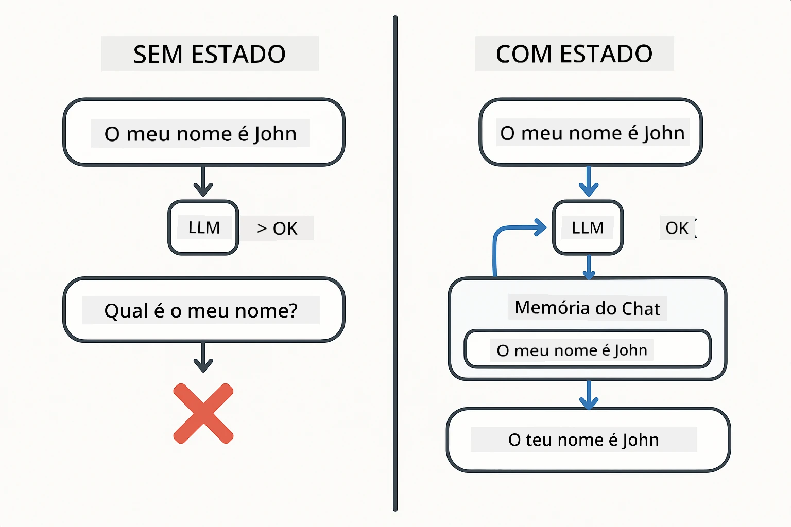
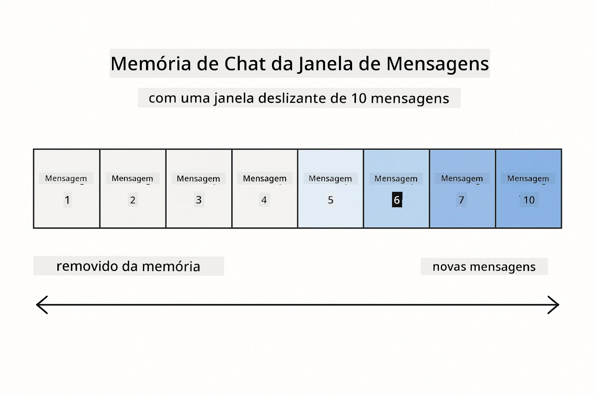
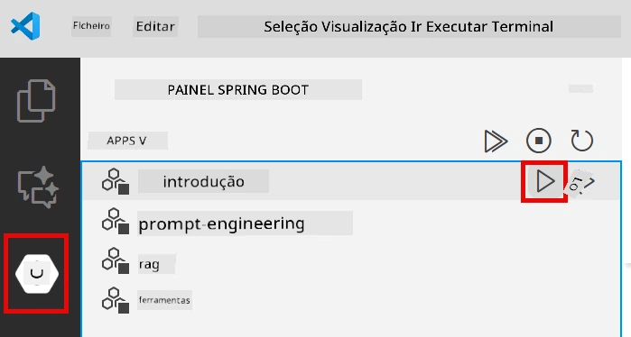
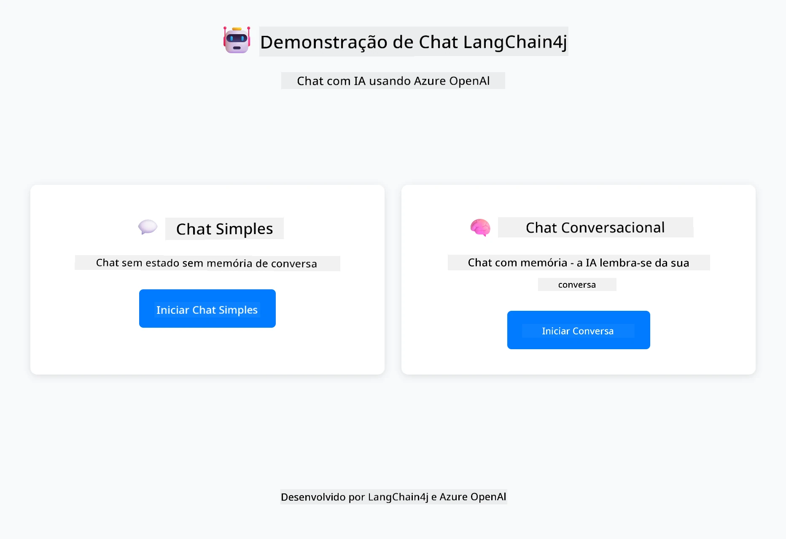
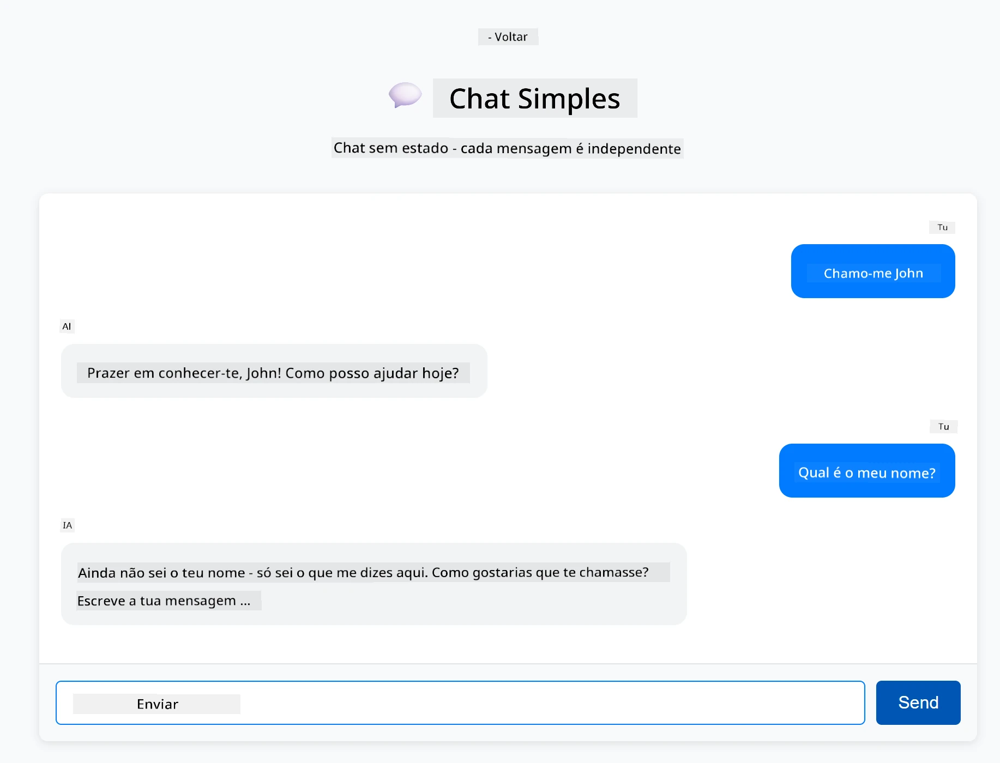
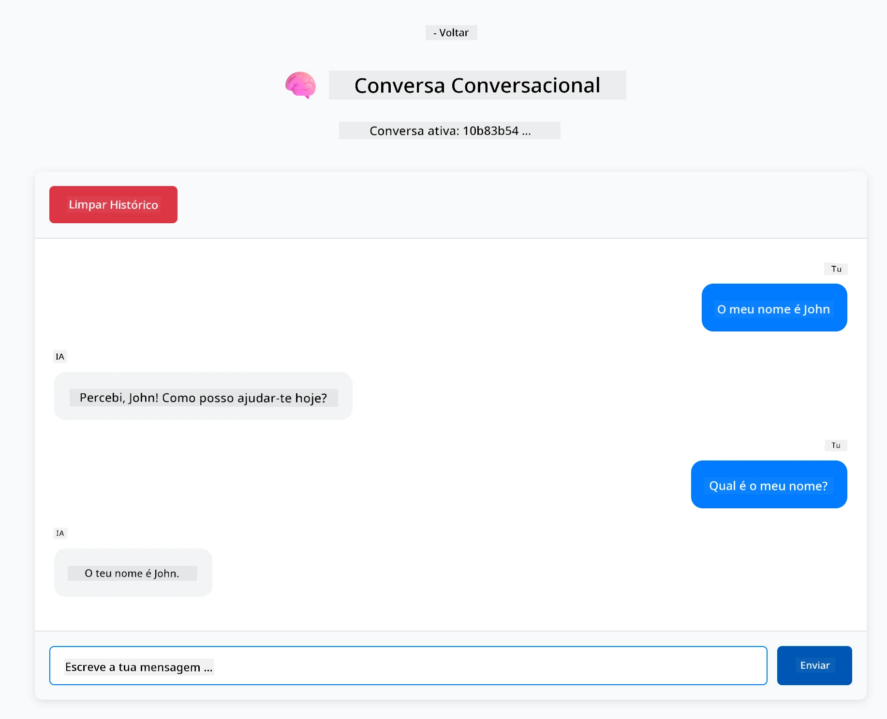

# Módulo 01: Começar com LangChain4j

## Índice

- [Vídeo Explicativo](#vídeo-explicativo)
- [O que Vai Aprender](#o-que-vai-aprender)
- [Pré-requisitos](#pré-requisitos)
- [Compreender o Problema Principal](#compreender-o-problema-principal)
- [Compreender Tokens](#compreender-tokens)
- [Como Funciona a Memória](#como-funciona-a-memória)
- [Como Isto Usa LangChain4j](#como-isto-usa-langchain4j)
- [Desplegar Infraestrutura Azure OpenAI](#desplegar-infraestrutura-azure-openai)
- [Executar a Aplicação Localmente](#executar-a-aplicação-localmente)
- [Usar a Aplicação](#usar-a-aplicação)
  - [Chat Sem Estado (Painel Esquerdo)](#chat-sem-estado-painel-esquerdo)
  - [Chat Com Estado (Painel Direito)](#chat-com-estado-painel-direito)
- [Próximos Passos](#próximos-passos)

## Vídeo Explicativo

Assista a esta sessão ao vivo que explica como começar com este módulo:

<a href="https://www.youtube.com/live/nl_troDm8rQ?si=6b85S8xGjWnT2fX9"></a>

## O que Vai Aprender

Este é o seu ponto de partida com LangChain4j e Azure OpenAI. Começamos pelos fundamentos e iniciamos a construção de aplicações em modo produção. Este módulo foca na IA conversacional que lembra o contexto e mantém o estado — os conceitos base sobre os quais todos os módulos posteriores se constroem.

Usaremos o GPT-5.2 da Azure OpenAI ao longo deste guia porque as suas capacidades avançadas de raciocínio tornam mais evidente o comportamento dos diferentes padrões. Quando adicionar memória, verá claramente a diferença. Isto facilita o entendimento do que cada componente traz para a sua aplicação.

Construirá uma aplicação que demonstra ambos os padrões:

**Chat Sem Estado** - Cada pedido é independente. O modelo não tem memória das mensagens anteriores. Este é o ponto de partida mais simples.

**Conversa com Estado** - Cada pedido inclui o histórico da conversa. O modelo mantém o contexto através de múltiplas interações. Isto é o que as aplicações em produção exigem.

## Pré-requisitos

- Subscrição Azure com acesso ao Azure OpenAI
- Java 21, Maven 3.9+ 
- Azure CLI (https://learn.microsoft.com/en-us/cli/azure/install-azure-cli)
- Azure Developer CLI (azd) (https://learn.microsoft.com/en-us/azure/developer/azure-developer-cli/install-azd)

> **Nota:** Java, Maven, Azure CLI e Azure Developer CLI (azd) estão pré-instalados no devcontainer fornecido.

> **Nota:** Este módulo usa GPT-5.2 no Azure OpenAI. O deploy é configurado automaticamente via `azd up` - não modifique o nome do modelo no código.

## Compreender o Problema Principal

Os modelos de linguagem são sem estado. Cada chamada API é independente. Se enviar "O meu nome é João" e depois perguntar "Qual é o meu nome?", o modelo não tem noção de que se apresentou anteriormente. Trata cada pedido como se fosse a primeira conversa que teve.

Isto é aceitável para perguntas e respostas simples, mas inútil para aplicações reais. Bots de atendimento ao cliente precisam de lembrar o que lhes disse. Assistentes pessoais precisam de contexto. Qualquer conversa com múltiplas interações exige memória.

O diagrama abaixo contrasta as duas abordagens — à esquerda, uma chamada sem estado que esquece o seu nome; à direita, uma chamada com estado suportada pelo ChatMemory que o recorda.



*A diferença entre conversas sem estado (chamadas independentes) e com estado (com consciência de contexto)*

## Compreender Tokens

Antes de começar a explorar conversas, é importante perceber os tokens - as unidades básicas de texto que os modelos de linguagem processam:


*Exemplo de como o texto é dividido em tokens - "Adoro IA!" torna-se em 4 unidades separadas para processamento*

Os tokens são como os modelos de IA medem e processam texto. Palavras, pontuação e até espaços podem ser tokens. O seu modelo tem um limite de tokens que pode processar de uma vez (400.000 para GPT-5.2, com até 272.000 tokens de entrada e 128.000 tokens de saída). Compreender tokens ajuda a gerir o comprimento da conversa e os custos.

## Como Funciona a Memória

A memória de chat resolve o problema de falta de estado ao manter o histórico da conversa. Antes de enviar o seu pedido ao modelo, o framework junta as mensagens anteriores relevantes. Quando pergunta "Qual é o meu nome?", o sistema de facto envia todo o histórico da conversa, permitindo ao modelo ver que disse "O meu nome é João".

LangChain4j providencia implementações de memória que tratam disto automaticamente. Você escolhe quantas mensagens quer reter e o framework gere a janela de contexto. O diagrama abaixo mostra como MessageWindowChatMemory mantém uma janela deslizante das mensagens recentes.



*MessageWindowChatMemory mantém uma janela deslizante das mensagens recentes, eliminando automaticamente as mais antigas*

## Como Isto Usa LangChain4j

Este módulo integra Spring Boot e adiciona memória de conversa. Eis como as peças se encaixam:

**Dependências** - Adicione duas bibliotecas LangChain4j:

```xml
<dependency>
    <groupId>dev.langchain4j</groupId>
    <artifactId>langchain4j</artifactId> <!-- Inherited from BOM in root pom.xml -->
</dependency>
<dependency>
    <groupId>dev.langchain4j</groupId>
    <artifactId>langchain4j-open-ai-official</artifactId> <!-- Inherited from BOM in root pom.xml -->
</dependency>
```

**Modelo de Chat** - Configure Azure OpenAI como um bean Spring ([LangChainConfig.java](../../../01-introduction/src/main/java/com/example/langchain4j/config/LangChainConfig.java)):

```java
@Bean
public OpenAiOfficialChatModel openAiOfficialChatModel() {
    return OpenAiOfficialChatModel.builder()
            .baseUrl(azureEndpoint)
            .apiKey(azureApiKey)
            .modelName(deploymentName)
            .timeout(Duration.ofMinutes(5))
            .maxRetries(3)
            .build();
}
```

O builder lê credenciais das variáveis de ambiente definidas pelo `azd up`. Definir `baseUrl` para o seu endpoint Azure faz o cliente OpenAI funcionar com o Azure OpenAI.

**Memória de Conversa** - Rastreie o histórico de chat com MessageWindowChatMemory ([ConversationService.java](../../../01-introduction/src/main/java/com/example/langchain4j/service/ConversationService.java)):

```java
ChatMemory memory = MessageWindowChatMemory.withMaxMessages(10);

memory.add(UserMessage.from("My name is John"));
memory.add(AiMessage.from("Nice to meet you, John!"));

memory.add(UserMessage.from("What's my name?"));
AiMessage aiMessage = chatModel.chat(memory.messages()).aiMessage();
memory.add(aiMessage);
```

Crie a memória com `withMaxMessages(10)` para manter as últimas 10 mensagens. Adicione mensagens do utilizador e da IA com wrappers tipados: `UserMessage.from(text)` e `AiMessage.from(text)`. Recupere o histórico com `memory.messages()` e envie-o ao modelo. O serviço guarda instâncias de memória separadas por ID de conversa, permitindo múltiplos utilizadores a conversar simultaneamente.

> **🤖 Experimente com [GitHub Copilot](https://github.com/features/copilot) Chat:** Abra [`ConversationService.java`](../../../01-introduction/src/main/java/com/example/langchain4j/service/ConversationService.java) e pergunte:
> - "Como decide o MessageWindowChatMemory quais mensagens eliminar quando a janela está cheia?"
> - "Posso implementar armazenamento de memória personalizado usando uma base de dados em vez da memória volátil?"
> - "Como poderia acrescentar sumarização para comprimir o histórico antigo da conversa?"

O endpoint de chat sem estado ignora completamente a memória - apenas `chatModel.chat(prompt)` como no início rápido. O endpoint com estado adiciona mensagens à memória, recupera o histórico e inclui esse contexto em cada pedido. Mesma configuração de modelo, padrões diferentes.

## Desplegar Infraestrutura Azure OpenAI

**Bash:**
```bash
cd 01-introduction
azd up  # Selecione subscrição e localização (eastus2 recomendado)
```

**PowerShell:**
```powershell
cd 01-introduction
azd up  # Selecione a subscrição e a localização (recomendado eastus2)
```

> **Nota:** Se encontrar um erro de timeout (`RequestConflict: Cannot modify resource ... provisioning state is not terminal`), execute `azd up` novamente. Os recursos Azure podem ainda estar a ser provisionados em segundo plano, e tentar de novo permite que o deploy conclua assim que os recursos atingem um estado terminal.

Isto irá:
1. Desplegar recurso Azure OpenAI com modelos GPT-5.2 e text-embedding-3-small
2. Gerar automaticamente o ficheiro `.env` na raiz do projeto com credenciais
3. Configurar todas as variáveis de ambiente necessárias

**Tem problemas com o deploy?** Consulte o [README da Infraestrutura](infra/README.md) para resolução detalhada de problemas, incluindo conflitos de nomes de subdomínio, passos manuais no Portal Azure e orientações sobre configuração do modelo.

**Verifique se o deploy foi bem-sucedido:**

**Bash:**
```bash
cat ../.env  # Deve mostrar AZURE_OPENAI_ENDPOINT, API_KEY, etc.
```

**PowerShell:**
```powershell
Get-Content ..\.env  # Deve mostrar AZURE_OPENAI_ENDPOINT, API_KEY, etc.
```

> **Nota:** O comando `azd up` gera automaticamente o ficheiro `.env`. Se precisar de atualizá-lo mais tarde, pode editar manualmente o ficheiro `.env` ou regenerá-lo executando:
>
> **Bash:**
> ```bash
> cd ..
> bash .azd-env.sh
> ```
>
> **PowerShell:**
> ```powershell
> cd ..
> .\.azd-env.ps1
> ```

## Executar a Aplicação Localmente

**Verificar deploy:**

Assegure que o ficheiro `.env` existe na raiz com as credenciais Azure. Execute isto a partir da diretoria do módulo (`01-introduction/`):

**Bash:**
```bash
cat ../.env  # Deve mostrar AZURE_OPENAI_ENDPOINT, API_KEY, DEPLOYMENT
```

**PowerShell:**
```powershell
Get-Content ..\.env  # Deve mostrar AZURE_OPENAI_ENDPOINT, API_KEY, DEPLOYMENT
```

**Iniciar as aplicações:**

**Opção 1: Usar o Spring Boot Dashboard (Recomendado para utilizadores VS Code)**

O dev container inclui a extensão Spring Boot Dashboard, que fornece uma interface visual para gerir todas as aplicações Spring Boot. Pode encontrá-la na Barra de Atividades à esquerda no VS Code (procure o ícone do Spring Boot).

No Spring Boot Dashboard, pode:
- Ver todas as aplicações Spring Boot disponíveis no workspace
- Iniciar/parar aplicações com um clique
- Ver logs da aplicação em tempo real
- Monitorizar o estado da aplicação

Basta clicar no botão de play ao lado de "introduction" para iniciar este módulo, ou iniciar todos os módulos de uma vez.



*O Spring Boot Dashboard no VS Code — iniciar, parar e monitorizar todos os módulos num só lugar*

**Opção 2: Usar scripts shell**

Inicie todas as aplicações web (módulos 01-04):

**Bash:**
```bash
cd ..  # A partir do diretório raiz
./start-all.sh
```

**PowerShell:**
```powershell
cd ..  # A partir do diretório raiz
.\start-all.ps1
```

Ou inicie apenas este módulo:

**Bash:**
```bash
cd 01-introduction
./start.sh
```

**PowerShell:**
```powershell
cd 01-introduction
.\start.ps1
```

Ambos os scripts carregam automaticamente as variáveis de ambiente a partir do ficheiro `.env` na raiz e vão construir os JARs se não existirem.

> **Nota:** Se preferir construir manualmente todos os módulos antes de iniciar:
>
> **Bash:**
> ```bash
> cd ..  # Go to root directory
> mvn clean package -DskipTests
> ```
>
> **PowerShell:**
> ```powershell
> cd ..  # Go to root directory
> mvn clean package -DskipTests
> ```

Abra http://localhost:8080 no seu navegador.

**Para parar:**

**Bash:**
```bash
./stop.sh  # Apenas este módulo
# Ou
cd .. && ./stop-all.sh  # Todos os módulos
```

**PowerShell:**
```powershell
.\stop.ps1  # Este módulo apenas
# Ou
cd ..; .\stop-all.ps1  # Todos os módulos
```

## Usar a Aplicação

A aplicação fornece uma interface web com duas implementações de chat lado-a-lado.



*Painel que mostra as opções Chat Simples (sem estado) e Chat Conversacional (com estado)*

### Chat Sem Estado (Painel Esquerdo)

Comece por este. Peça "O meu nome é João" e depois pergunte imediatamente "Qual é o meu nome?" O modelo não vai lembrar porque cada mensagem é independente. Isto demonstra o problema principal da integração básica de modelos de linguagem - sem contexto de conversa.



*IA não lembra o seu nome da mensagem anterior*

### Chat Com Estado (Painel Direito)

Agora experimente a mesma sequência aqui. Peça "O meu nome é João" e depois "Qual é o meu nome?" Desta vez ele lembra-se. A diferença é o MessageWindowChatMemory - que mantém o histórico da conversa e inclui esse contexto em cada pedido. É assim que a IA conversacional em produção funciona.



*IA lembra-se do seu nome mencionado anteriormente na conversa*

Ambos os painéis usam o mesmo modelo GPT-5.2. A única diferença é a memória. Isto torna claro o que a memória traz para a sua aplicação e porque é essencial para casos reais.

## Próximos Passos

**Próximo Módulo:** [02-prompt-engineering - Engenharia de Prompts com GPT-5.2](../02-prompt-engineering/README.md)

---

**Navegação:** [← Voltar ao Principal](../README.md) | [Seguinte: Módulo 02 - Engenharia de Prompts →](../02-prompt-engineering/README.md)

---

<!-- CO-OP TRANSLATOR DISCLAIMER START -->
**Aviso Legal**:
Este documento foi traduzido utilizando o serviço de tradução automática [Co-op Translator](https://github.com/Azure/co-op-translator). Embora nos esforcemos pela precisão, esteja ciente de que traduções automáticas podem conter erros ou imprecisões. O documento original na sua língua nativa deve ser considerado a fonte autorizada. Para informações críticas, recomenda-se tradução profissional humana. Não nos responsabilizamos por quaisquer mal-entendidos ou interpretações incorretas resultantes da utilização desta tradução.
<!-- CO-OP TRANSLATOR DISCLAIMER END -->