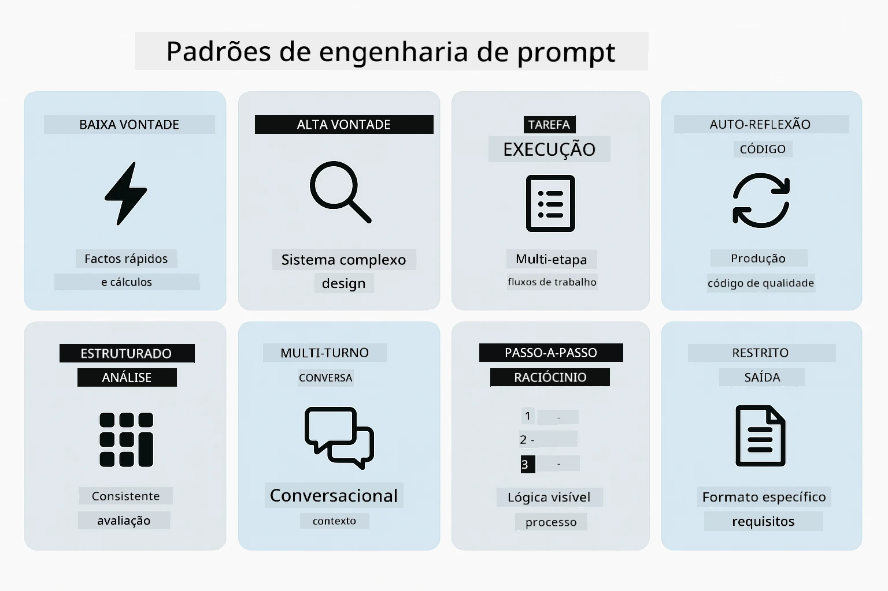
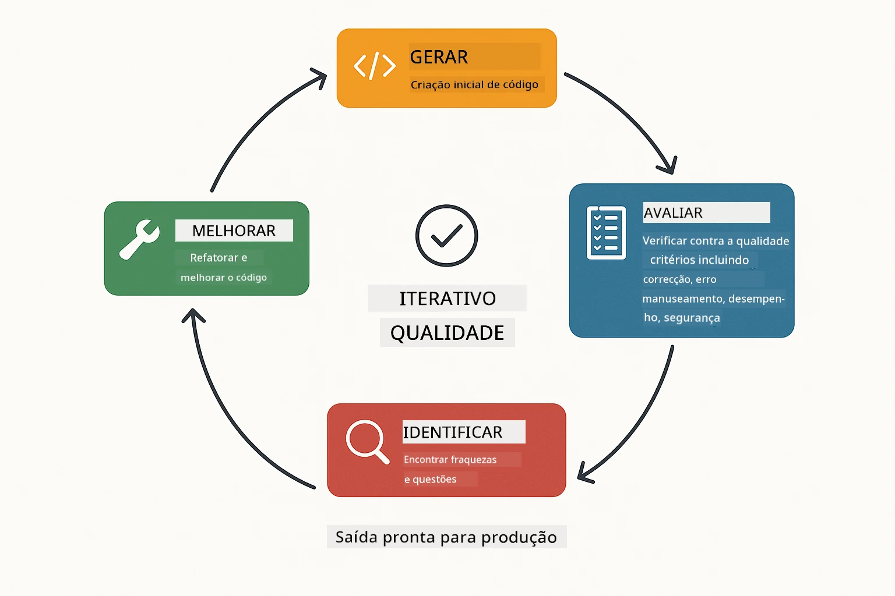
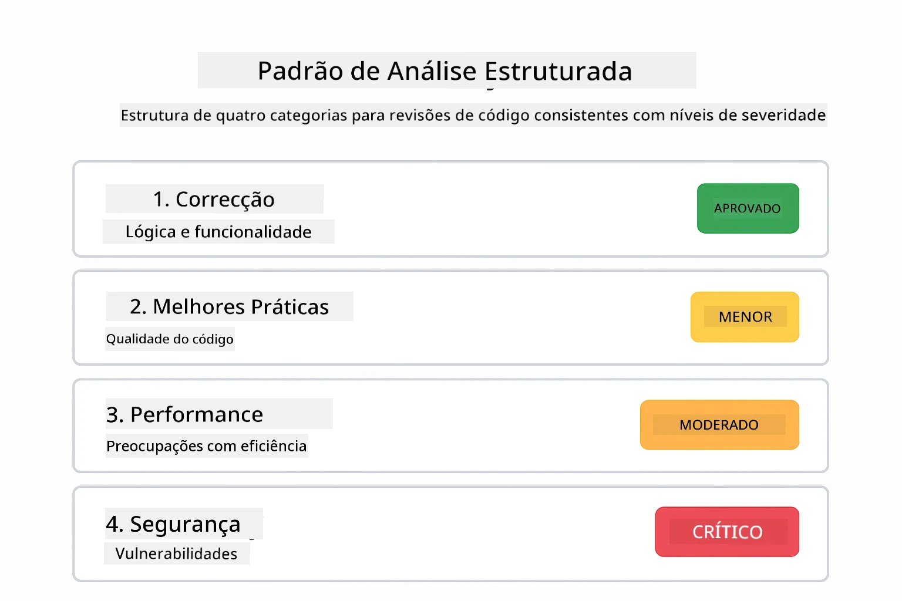
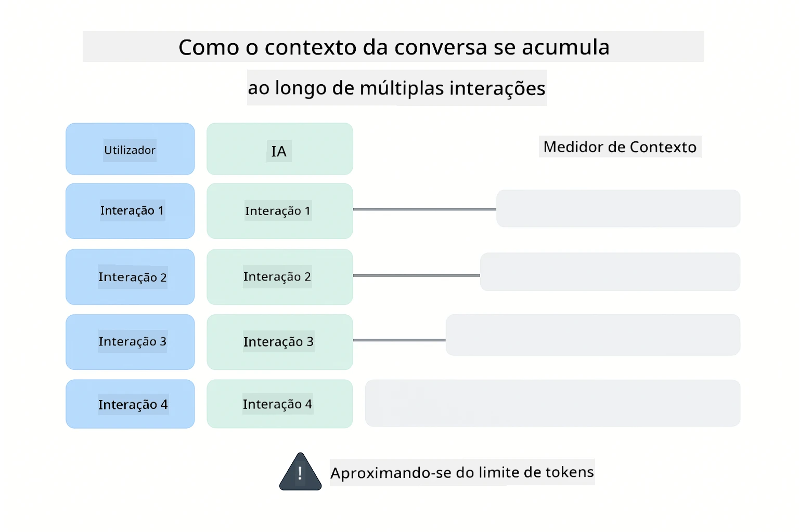
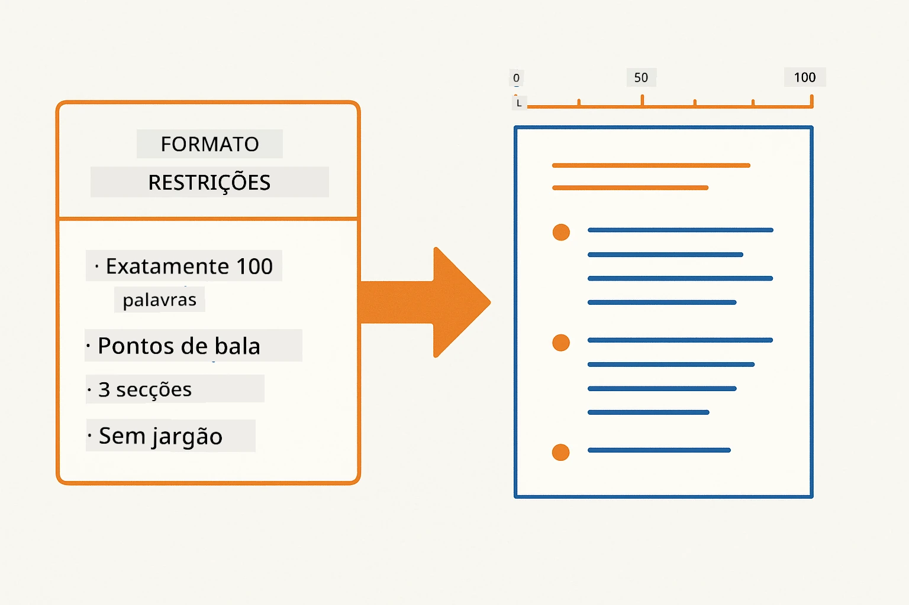
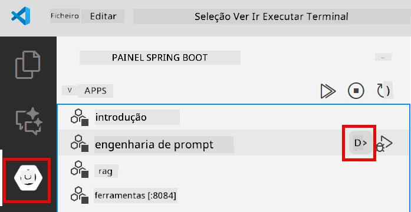
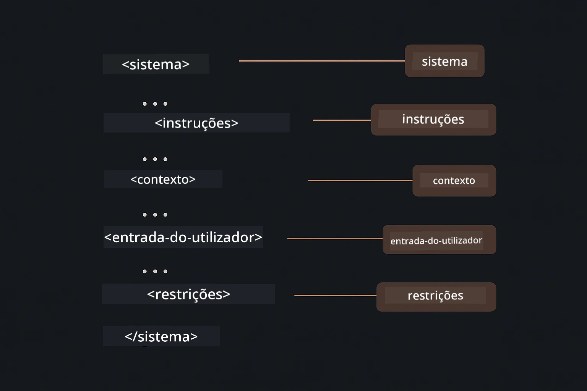

# Módulo 02: Engenharia de Prompt com GPT-5.2

## Índice

- [Demonstração em Vídeo](#demonstração-em-vídeo)
- [O que Vai Aprender](#o-que-vai-aprender)
- [Pré-requisitos](#pré-requisitos)
- [Compreender Engenharia de Prompt](#compreender-engenharia-de-prompt)
- [Fundamentos da Engenharia de Prompt](#fundamentos-da-engenharia-de-prompt)
  - [Prompt Zero-Shot](#prompt-zero-shot)
  - [Prompt Few-Shot](#prompt-few-shot)
  - [Cadeia de Pensamento](#cadeia-de-pensamento)
  - [Prompt com Base no Papel](#prompt-com-base-no-papel)
  - [Modelos de Prompt](#modelos-de-prompt)
- [Padrões Avançados](#padrões-avançados)
- [Executar a Aplicação](#executar-a-aplicação)
- [Capturas de Ecrã da Aplicação](#capturas-de-ecrã-da-aplicação)
- [Explorar os Padrões](#explorar-os-padrões)
  - [Baixo vs Alto Entusiasmo](#baixo-vs-alto-entusiasmo)
  - [Execução de Tarefas (Preâmbulos de Ferramentas)](#execução-de-tarefas-preâmbulos-de-ferramentas)
  - [Código Auto-Refletente](#código-auto-refletivo)
  - [Análise Estruturada](#análise-estruturada)
  - [Chat Multi-Turno](#chat-multi-turno)
  - [Raciocínio Passo a Passo](#raciocínio-passo-a-passo)
  - [Saída Constrangida](#saída-confinada)
- [O que Está a Aprender Realmente](#o-que-está-realmente-a-aprender)
- [Próximos Passos](#passos-seguintes)

## Demonstração em Vídeo

Assista a esta sessão ao vivo que explica como começar com este módulo:

<a href="https://www.youtube.com/live/PJ6aBaE6bog?si=LDshyBrTRodP-wke"></a>

## O que Vai Aprender

O diagrama seguinte fornece uma visão geral dos tópicos principais e das competências que vai desenvolver neste módulo — desde técnicas de refinamento de prompt até ao fluxo de trabalho passo a passo que irá seguir.


No módulo anterior, viu como a memória permite a IA conversacional com Azure OpenAI. Agora focamo-nos em como faz perguntas — os próprios prompts — usando o GPT-5.2 do Azure OpenAI. A forma como estrutura os seus prompts afeta drasticamente a qualidade das respostas que obtém. Começamos com uma revisão das técnicas fundamentais de prompting, depois avançamos para oito padrões avançados que tiram pleno proveito das capacidades do GPT-5.2.

Vamos usar o GPT-5.2 porque ele introduz controlo de raciocínio — pode dizer ao modelo quanto deve pensar antes de responder. Isto torna as diferentes estratégias de prompting mais evidentes e ajuda a compreender quando usar cada abordagem.

## Pré-requisitos

- Módulo 01 concluído (recursos Azure OpenAI implementados)
- Ficheiro `.env` no diretório raiz com as credenciais Azure (criado pelo `azd up` no Módulo 01)

> **Nota:** Se ainda não completou o Módulo 01, siga primeiro as instruções de implementação lá.

## Compreender Engenharia de Prompt

Na sua essência, engenharia de prompt é a diferença entre instruções vagas e instruções precisas, como ilustra a comparação abaixo.


Engenharia de prompt é sobre projetar texto de entrada que consegue consistentemente os resultados que precisa. Não se trata apenas de fazer perguntas — é sobre estruturar pedidos para que o modelo entenda exatamente o que quer e como o deve entregar.

Pense nisso como dar instruções a um colega. "Corrige o bug" é vago. "Corrige a exceção null pointer em UserService.java linha 45 adicionando uma verificação de nulo" é específico. Os modelos de linguagem funcionam da mesma forma — especificidade e estrutura são importantes.

O diagrama abaixo mostra como o LangChain4j se encaixa nesta imagem — ligando os seus padrões de prompt ao modelo através dos blocos construtores SystemMessage e UserMessage.


O LangChain4j fornece a infraestrutura — ligações ao modelo, memória e tipos de mensagem — enquanto os padrões de prompt são apenas texto cuidadosamente estruturado que envia através dessa infraestrutura. Os blocos chave são `SystemMessage` (que define o comportamento e papel da IA) e `UserMessage` (que contém o seu pedido real).

## Fundamentos da Engenharia de Prompt

As cinco técnicas principais mostradas abaixo formam a base da engenharia de prompt eficaz. Cada uma aborda um aspeto diferente de como comunica com modelos de linguagem.


Antes de mergulhar nos padrões avançados deste módulo, vamos rever cinco técnicas de prompting fundamentais. São os blocos de construção que todos os engenheiros de prompt devem conhecer.

### Prompt Zero-Shot

A abordagem mais simples: dar ao modelo uma instrução direta sem exemplos. O modelo depende inteiramente do seu treino para entender e executar a tarefa. Funciona bem para pedidos simples onde o comportamento esperado é óbvio.


*Instrução direta sem exemplos — o modelo infere a tarefa apenas pela instrução*

```java
String prompt = "Classify this sentiment: 'I absolutely loved the movie!'";
String response = model.chat(prompt);
// Resposta: "Positivo"
```

**Quando usar:** Classificações simples, perguntas diretas, traduções ou qualquer tarefa que o modelo consiga executar sem orientação adicional.

### Prompt Few-Shot

Forneça exemplos que demonstrem o padrão que deseja que o modelo siga. O modelo aprende o formato esperado de entrada-saída a partir dos seus exemplos e aplica-o a novas entradas. Isto melhora drasticamente a consistência para tarefas onde o formato ou comportamento desejado não é óbvio.


*Aprender pelos exemplos — o modelo identifica o padrão e aplica-o a novas entradas*

```java
String prompt = """
    Classify the sentiment as positive, negative, or neutral.
    
    Examples:
    Text: "This product exceeded my expectations!" → Positive
    Text: "It's okay, nothing special." → Neutral
    Text: "Waste of money, very disappointed." → Negative
    
    Now classify this:
    Text: "Best purchase I've made all year!"
    """;
String response = model.chat(prompt);
```

**Quando usar:** Classificações personalizadas, formatação consistente, tarefas específicas de domínio ou quando os resultados zero-shot são inconsistentes.

### Cadeia de Pensamento

Peça ao modelo para mostrar o seu raciocínio passo a passo. Em vez de saltar diretamente para uma resposta, o modelo divide o problema e trabalha cada parte explicitamente. Isto melhora a precisão em matemática, lógica e tarefas que exigem raciocínio em múltiplos passos.


*Raciocínio passo a passo — dividir problemas complexos em passos lógicos explícitos*

```java
String prompt = """
    Problem: A store has 15 apples. They sell 8 apples and then 
    receive a shipment of 12 more apples. How many apples do they have now?
    
    Let's solve this step-by-step:
    """;
String response = model.chat(prompt);
// O modelo mostra: 15 - 8 = 7, depois 7 + 12 = 19 maçãs
```

**Quando usar:** Problemas matemáticos, enigmas lógicos, debugging ou qualquer tarefa onde mostrar o processo de raciocínio melhora a precisão e confiança.

### Prompt com Base no Papel

Defina uma persona ou papel para a IA antes de fazer a sua pergunta. Isto fornece contexto que molda o tom, profundidade e foco da resposta. Um "arquiteto de software" dá conselhos diferentes de um "programador júnior" ou de um "auditor de segurança".


*Definir contexto e persona — a mesma pergunta recebe uma resposta diferente dependendo do papel atribuído*

```java
String prompt = """
    You are an experienced software architect reviewing code.
    Provide a brief code review for this function:
    
    def calculate_total(items):
        total = 0
        for item in items:
            total = total + item['price']
        return total
    """;
String response = model.chat(prompt);
```

**Quando usar:** Revisões de código, tutoria, análises específicas de domínio ou quando precisar de respostas adaptadas a um nível de especialização ou perspetiva particular.

### Modelos de Prompt

Crie prompts reutilizáveis com espaços variáveis. Em vez de escrever um prompt novo sempre, defina um modelo uma vez e preencha valores diferentes. A classe `PromptTemplate` do LangChain4j facilita isto com a sintaxe `{{variable}}`.


*Prompts reutilizáveis com espaços variáveis — um modelo, muitos usos*

```java
PromptTemplate template = PromptTemplate.from(
    "What's the best time to visit {{destination}} for {{activity}}?"
);

Prompt prompt = template.apply(Map.of(
    "destination", "Paris",
    "activity", "sightseeing"
));

String response = model.chat(prompt.text());
```

**Quando usar:** Consultas repetidas com entradas diferentes, processamento por lotes, construção de fluxos de trabalho AI reutilizáveis ou qualquer cenário onde a estrutura do prompt se mantém igual mas os dados mudam.

---

Estes cinco fundamentos dão-lhe uma caixa de ferramentas sólida para a maioria das tarefas de prompting. O resto deste módulo baseia-se neles com **oito padrões avançados** que aproveitam o controlo de raciocínio, autoavaliação e capacidades de saída estruturada do GPT-5.2.

## Padrões Avançados

Com os fundamentos cobertos, passemos aos oito padrões avançados que tornam este módulo único. Nem todos os problemas precisam da mesma abordagem. Algumas perguntas precisam de respostas rápidas, outras de pensamento profundo. Algumas precisam de raciocínio visível, outras apenas dos resultados. Cada padrão abaixo é otimizado para um cenário diferente — e o controlo de raciocínio do GPT-5.2 torna as diferenças ainda mais pronunciadas.



*Visão geral dos oito padrões de engenharia de prompt e seus casos de uso*

O GPT-5.2 adiciona outra dimensão a estes padrões: *controlo de raciocínio*. O deslizador abaixo mostra como pode ajustar o esforço de pensamento do modelo — desde respostas rápidas e diretas a análises profundas e detalhadas.


*O controlo de raciocínio do GPT-5.2 permite especificar quanto o modelo deve pensar — desde respostas rápidas até exploração profunda*

**Baixo Entusiasmo (Rápido & Focado)** - Para perguntas simples onde quer respostas rápidas e diretas. O modelo faz raciocínio mínimo - no máximo 2 passos. Use isto para cálculos, pesquisas ou perguntas diretas.

```java
String prompt = """
    <context_gathering>
    - Search depth: very low
    - Bias strongly towards providing a correct answer as quickly as possible
    - Usually, this means an absolute maximum of 2 reasoning steps
    - If you think you need more time, state what you know and what's uncertain
    </context_gathering>
    
    Problem: What is 15% of 200?
    
    Provide your answer:
    """;

String response = chatModel.chat(prompt);
```

> 💡 **Explore com GitHub Copilot:** Abra [`Gpt5PromptService.java`](../../../02-prompt-engineering/src/main/java/com/example/langchain4j/prompts/service/Gpt5PromptService.java) e pergunte:
> - "Qual é a diferença entre os padrões de prompting de baixo entusiasmo e alto entusiasmo?"
> - "Como as etiquetas XML nos prompts ajudam a estruturar a resposta da IA?"
> - "Quando devo usar padrões de auto-reflexão vs instrução direta?"

**Alto Entusiasmo (Profundo & Minucioso)** - Para problemas complexos onde quer uma análise abrangente. O modelo explora minuciosamente e mostra raciocínio detalhado. Use isto para design de sistemas, decisões arquitetónicas ou pesquisas complexas.

```java
String prompt = """
    Analyze this problem thoroughly and provide a comprehensive solution.
    Consider multiple approaches, trade-offs, and important details.
    Show your analysis and reasoning in your response.
    
    Problem: Design a caching strategy for a high-traffic REST API.
    """;

String response = chatModel.chat(prompt);
```

**Execução de Tarefas (Progresso Passo a Passo)** - Para fluxos de trabalho em múltiplos passos. O modelo fornece um plano inicial, narra cada passo conforme trabalha e depois apresenta um resumo. Use isto para migrações, implementações ou qualquer processo com vários passos.

```java
String prompt = """
    <task_execution>
    1. First, briefly restate the user's goal in a friendly way
    
    2. Create a step-by-step plan:
       - List all steps needed
       - Identify potential challenges
       - Outline success criteria
    
    3. Execute each step:
       - Narrate what you're doing
       - Show progress clearly
       - Handle any issues that arise
    
    4. Summarize:
       - What was completed
       - Any important notes
       - Next steps if applicable
    </task_execution>
    
    <tool_preambles>
    - Always begin by rephrasing the user's goal clearly
    - Outline your plan before executing
    - Narrate each step as you go
    - Finish with a distinct summary
    </tool_preambles>
    
    Task: Create a REST endpoint for user registration
    
    Begin execution:
    """;

String response = chatModel.chat(prompt);
```

O prompting cadeia de pensamento pede explicitamente ao modelo para mostrar o seu processo de raciocínio, melhorando a precisão em tarefas complexas. A decomposição passo a passo ajuda tanto humanos como IA a entenderem a lógica.

> **🤖 Experimente com o [GitHub Copilot](https://github.com/features/copilot) Chat:** Pergunte sobre este padrão:
> - "Como adaptaria o padrão de execução de tarefas para operações de longa duração?"
> - "Quais são as melhores práticas para estruturar preâmbulos de ferramentas em aplicações de produção?"
> - "Como captar e mostrar atualizações de progresso intermédias numa interface?"

O diagrama abaixo ilustra este fluxo Planear → Executar → Resumir.


*Fluxo Planear → Executar → Resumir para tarefas em múltiplos passos*

**Código Auto-Refletente** - Para gerar código de qualidade para produção. O modelo gera código seguindo padrões de produção com tratamento de erros adequado. Use isto para criar novas funcionalidades ou serviços.

```java
String prompt = """
    Generate Java code with production-quality standards: Create an email validation service
    Keep it simple and include basic error handling.
    """;

String response = chatModel.chat(prompt);
```

O diagrama abaixo mostra este ciclo iterativo de melhoria — gerar, avaliar, identificar fraquezas e refinar até o código cumprir os padrões de produção.



*Ciclo iterativo de melhoria - gerar, avaliar, identificar problemas, melhorar, repetir*

**Análise Estruturada** - Para avaliações consistentes. O modelo revê código usando uma framework fixa (correção, práticas, desempenho, segurança, manutenção). Use isto para revisões de código ou avaliações de qualidade.

```java
String prompt = """
    <analysis_framework>
    You are an expert code reviewer. Analyze the code for:
    
    1. Correctness
       - Does it work as intended?
       - Are there logical errors?
    
    2. Best Practices
       - Follows language conventions?
       - Appropriate design patterns?
    
    3. Performance
       - Any inefficiencies?
       - Scalability concerns?
    
    4. Security
       - Potential vulnerabilities?
       - Input validation?
    
    5. Maintainability
       - Code clarity?
       - Documentation?
    
    <output_format>
    Provide your analysis in this structure:
    - Summary: One-sentence overall assessment
    - Strengths: 2-3 positive points
    - Issues: List any problems found with severity (High/Medium/Low)
    - Recommendations: Specific improvements
    </output_format>
    </analysis_framework>
    
    Code to analyze:
    ```
    public List getUsers() {
        return database.query("SELECT * FROM users");
    }
    ```
    Provide your structured analysis:
    """;

String response = chatModel.chat(prompt);
```

> **🤖 Experimente com o [GitHub Copilot](https://github.com/features/copilot) Chat:** Pergunte sobre análise estruturada:
> - "Como personalizar a framework de análise para diferentes tipos de revisão de código?"
> - "Qual a melhor forma de analisar e atuar sobre a saída estruturada programaticamente?"
> - "Como garantir níveis de severidade consistentes em diferentes sessões de revisão?"

O diagrama seguinte mostra como esta framework estruturada organiza uma revisão de código em categorias consistentes com níveis de severidade.



*Framework para revisões consistentes de código com níveis de severidade*

**Chat Multi-Turno** - Para conversas que precisam de contexto. O modelo lembra mensagens anteriores e constrói sobre elas. Use isto para sessões interativas de ajuda ou Q&A complexas.

```java
ChatMemory memory = MessageWindowChatMemory.withMaxMessages(10);

memory.add(UserMessage.from("What is Spring Boot?"));
AiMessage aiMessage1 = chatModel.chat(memory.messages()).aiMessage();
memory.add(aiMessage1);

memory.add(UserMessage.from("Show me an example"));
AiMessage aiMessage2 = chatModel.chat(memory.messages()).aiMessage();
memory.add(aiMessage2);
```

O diagrama abaixo visualiza como o contexto da conversa se acumula a cada turno e como isto se relaciona com o limite de tokens do modelo.



*Como o contexto da conversa se acumula ao longo de múltiplos turnos até atingir o limite de tokens*

**Raciocínio Passo a Passo** - Para problemas que exigem lógica visível. O modelo mostra raciocínio explícito para cada passo. Use isto para problemas matemáticos, enigmas lógicos ou quando precisar entender o processo de pensamento.

```java
String prompt = """
    <instruction>Show your reasoning step-by-step</instruction>
    
    If a train travels 120 km in 2 hours, then stops for 30 minutes,
    then travels another 90 km in 1.5 hours, what is the average speed
    for the entire journey including the stop?
    """;

String response = chatModel.chat(prompt);
```

O diagrama abaixo ilustra como o modelo divide problemas em passos lógicos explícitos e numerados.


*Desconstruir problemas em passos lógicos explícitos*

**Saída Confinada** - Para respostas com requisitos específicos de formato. O modelo segue rigorosamente as regras de formato e comprimento. Use isto para resumos ou quando precisa de uma estrutura de saída precisa.

```java
String prompt = """
    <constraints>
    - Exactly 100 words
    - Bullet point format
    - Technical terms only
    </constraints>
    
    Summarize the key concepts of machine learning.
    """;

String response = chatModel.chat(prompt);
```

O diagrama seguinte mostra como as restrições orientam o modelo a produzir uma saída que cumpre estritamente os seus requisitos de formato e comprimento.



*Impor requisitos específicos de formato, comprimento e estrutura*

## Executar a Aplicação

**Verificar a implantação:**

Assegure-se de que o ficheiro `.env` existe no diretório raiz com as credenciais Azure (criado durante o Módulo 01). Execute isto a partir do diretório do módulo (`02-prompt-engineering/`):

**Bash:**
```bash
cat ../.env  # Deve mostrar AZURE_OPENAI_ENDPOINT, API_KEY, DEPLOYMENT
```

**PowerShell:**
```powershell
Get-Content ..\.env  # Deve mostrar AZURE_OPENAI_ENDPOINT, API_KEY, DEPLOYMENT
```

**Iniciar a aplicação:**

> **Nota:** Se já tiver iniciado todas as aplicações usando `./start-all.sh` a partir do diretório raiz (conforme descrito no Módulo 01), este módulo já está a correr na porta 8083. Pode ignorar os comandos de arranque abaixo e ir diretamente para http://localhost:8083.

**Opção 1: Usar o Spring Boot Dashboard (Recomendado para utilizadores VS Code)**

O contentor de desenvolvimento inclui a extensão Spring Boot Dashboard, que fornece uma interface visual para gerir todas as aplicações Spring Boot. Pode encontrá-la na Barra de Atividade no lado esquerdo do VS Code (procure o ícone Spring Boot).

A partir do Spring Boot Dashboard, pode:
- Ver todas as aplicações Spring Boot disponíveis no espaço de trabalho
- Iniciar/parar aplicações com um clique
- Ver os registos da aplicação em tempo real
- Monitorizar o estado da aplicação

Basta clicar no botão de play junto a "prompt-engineering" para iniciar este módulo, ou iniciar todos os módulos de uma vez.



*O Spring Boot Dashboard no VS Code — iniciar, parar e monitorizar todos os módulos num só local*

**Opção 2: Usar scripts shell**

Iniciar todas as aplicações web (módulos 01-04):

**Bash:**
```bash
cd ..  # A partir do diretório raiz
./start-all.sh
```

**PowerShell:**
```powershell
cd ..  # A partir do diretório raiz
.\start-all.ps1
```

Ou iniciar apenas este módulo:

**Bash:**
```bash
cd 02-prompt-engineering
./start.sh
```

**PowerShell:**
```powershell
cd 02-prompt-engineering
.\start.ps1
```

Ambos os scripts carregam automaticamente as variáveis de ambiente do ficheiro `.env` da raiz e irão construir os JARs caso não existam.

> **Nota:** Se preferir construir todos os módulos manualmente antes de iniciar:
>
> **Bash:**
> ```bash
> cd ..  # Go to root directory
> mvn clean package -DskipTests
> ```
>
> **PowerShell:**
> ```powershell
> cd ..  # Go to root directory
> mvn clean package -DskipTests
> ```

Abra http://localhost:8083 no seu navegador.

**Para parar:**

**Bash:**
```bash
./stop.sh  # Apenas este módulo
# Ou
cd .. && ./stop-all.sh  # Todos os módulos
```

**PowerShell:**
```powershell
.\stop.ps1  # Apenas este módulo
# Ou
cd ..; .\stop-all.ps1  # Todos os módulos
```

## Capturas de Ecrã da Aplicação

Aqui está a interface principal do módulo de engenharia de prompts, onde pode experimentar todos os oito padrões lado a lado.


*O painel principal mostrando os 8 padrões de engenharia de prompts com as suas características e casos de uso*

## Explorar os Padrões

A interface web permite-lhe experimentar diferentes estratégias de prompting. Cada padrão resolve problemas diferentes - experimente-os para ver quando cada abordagem sobressai.

> **Nota: Streaming vs Não Streaming** — Cada página de padrão oferece dois botões: **🔴 Stream Response (Live)** e uma opção **Não streaming**. O streaming usa Server-Sent Events (SSE) para mostrar os tokens em tempo real conforme o modelo os gera, para ver o progresso imediatamente. A opção não streaming espera pela resposta completa antes de a mostrar. Para prompts que desencadeiam raciocínio profundo (ex: Alto Entusiasmo, Código Auto-Refletivo), a chamada não streaming pode demorar muito tempo — por vezes minutos — sem feedback visível. **Use streaming quando experimentar prompts complexos** para ver o modelo a trabalhar e evitar a impressão que o pedido expirou.
>
> **Nota: Requisito do Navegador** — A funcionalidade de streaming usa a API Fetch Streams (`response.body.getReader()`) que requer um navegador completo (Chrome, Edge, Firefox, Safari). Não funciona no Simple Browser integrado do VS Code, pois a sua webview não suporta a ReadableStream API. Se usar o Simple Browser, os botões não streaming funcionam normalmente — apenas os botões de streaming são afetados. Abra `http://localhost:8083` num navegador externo para uma experiência completa.

### Baixo vs Alto Entusiasmo

Faça uma pergunta simples como "Qual é 15% de 200?" usando Baixo Entusiasmo. Receberá uma resposta direta e instantânea. Agora faça algo complexo como "Desenhe uma estratégia de caching para uma API de alto tráfego" usando Alto Entusiasmo. Clique em **🔴 Stream Response (Live)** e veja o raciocínio detalhado do modelo aparecer token a token. Mesmo modelo, mesma estrutura de pergunta - mas o prompt indica quanto pensar.

### Execução de Tarefas (Preâmbulos de Ferramentas)

Workflows multi-passos beneficiam de planeamento prévio e narração do progresso. O modelo descreve o que vai fazer, narra cada passo e depois sumariza os resultados.

### Código Auto-Refletivo

Experimente "Criar um serviço de validação de email". Em vez de apenas gerar código e parar, o modelo gera, avalia contra critérios de qualidade, identifica fraquezas e melhora. Vai ver iterar até o código estar apto para produção.

### Análise Estruturada

Revisões de código precisam de esquemas de avaliação consistentes. O modelo analisa código usando categorias fixas (correção, práticas, desempenho, segurança) com níveis de severidade.

### Chat Multi-Turno

Pergunte "O que é o Spring Boot?" e logo depois "Mostra-me um exemplo". O modelo lembra a primeira pergunta e dá um exemplo específico de Spring Boot. Sem memória, a segunda pergunta seria demasiado vaga.

### Raciocínio Passo a Passo

Escolha um problema de matemática e experimente com Raciocínio Passo a Passo e Baixo Entusiasmo. Baixo entusiasmo só dá a resposta - rápido mas opaco. Passo a passo mostra todos os cálculos e decisões.

### Saída Confinada

Quando precisar de formatos específicos ou contagem exata de palavras, este padrão garante estrita conformidade. Experimente gerar um resumo com exatamente 100 palavras em formato de tópico.

## O Que Está Realmente a Aprender

**O Esforço de Raciocínio Muda Tudo**

O GPT-5.2 permite controlar o esforço computacional através dos seus prompts. Baixo esforço significa respostas rápidas com exploração mínima. Alto esforço significa que o modelo pensa profundamente. Está a aprender a ajustar o esforço à complexidade da tarefa - não perca tempo em perguntas simples, mas não apresse decisões complexas.

**Estrutura Guia o Comportamento**

Reparou nas tags XML nos prompts? Não são decorativas. Os modelos seguem instruções estruturadas com mais fiabilidade que texto livre. Quando precisa de processos multi-passos ou lógica complexa, a estrutura ajuda o modelo a saber onde está e o que vem a seguir. O diagrama abaixo desconstrói um prompt bem-estruturado, mostrando como tags como `<system>`, `<instructions>`, `<context>`, `<user-input>`, e `<constraints>` organizam as suas instruções em secções claras.



*Anatomia de um prompt bem-estruturado com secções claras e organização estilo XML*

**Qualidade Através da Autoavaliação**

Os padrões auto-refletivos funcionam ao tornar explícitos os critérios de qualidade. Em vez de esperar que o modelo "faça bem", diz-lhe exatamente o que "bem" significa: lógica correta, tratamento de erros, desempenho, segurança. O modelo pode então avaliar a sua própria saída e melhorar. Isto transforma a geração de código numa tarefa controlada.

**O Contexto É Finito**

Conversas multi-turno funcionam incluindo o histórico de mensagens em cada pedido. Mas há um limite - cada modelo tem um máximo de tokens. À medida que as conversas crescem, precisa de estratégias para manter o contexto relevante sem ultrapassar esse limite. Este módulo mostra como funciona a memória; mais tarde aprenderá quando resumir, quando esquecer e quando recuperar.

## Passos Seguintes

**Próximo Módulo:** [03-rag - RAG (Geracão Aumentada por Recuperação)](../03-rag/README.md)

---

**Navegação:** [← Anterior: Módulo 01 - Introdução](../01-introduction/README.md) | [Voltar ao Início](../README.md) | [Seguinte: Módulo 03 - RAG →](../03-rag/README.md)

---

<!-- CO-OP TRANSLATOR DISCLAIMER START -->
**Aviso Legal**:
Este documento foi traduzido utilizando o serviço de tradução automática [Co-op Translator](https://github.com/Azure/co-op-translator). Embora nos esforcemos pela precisão, esteja ciente de que traduções automáticas podem conter erros ou imprecisões. O documento original na sua língua nativa deve ser considerado a fonte autorizada. Para informações críticas, recomenda-se tradução profissional humana. Não nos responsabilizamos por quaisquer mal-entendidos ou interpretações incorretas resultantes da utilização desta tradução.
<!-- CO-OP TRANSLATOR DISCLAIMER END -->