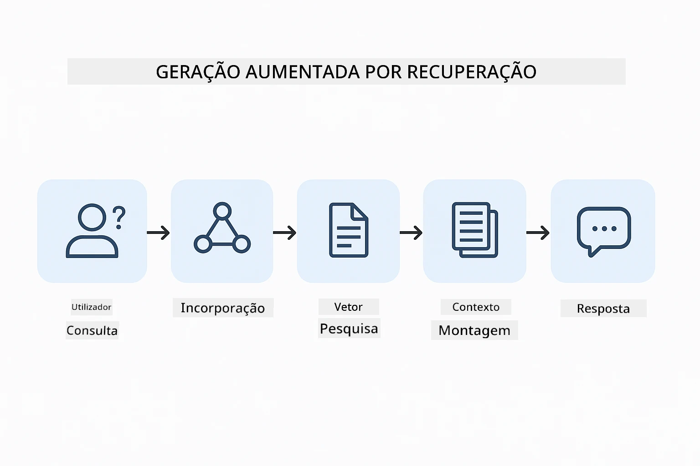
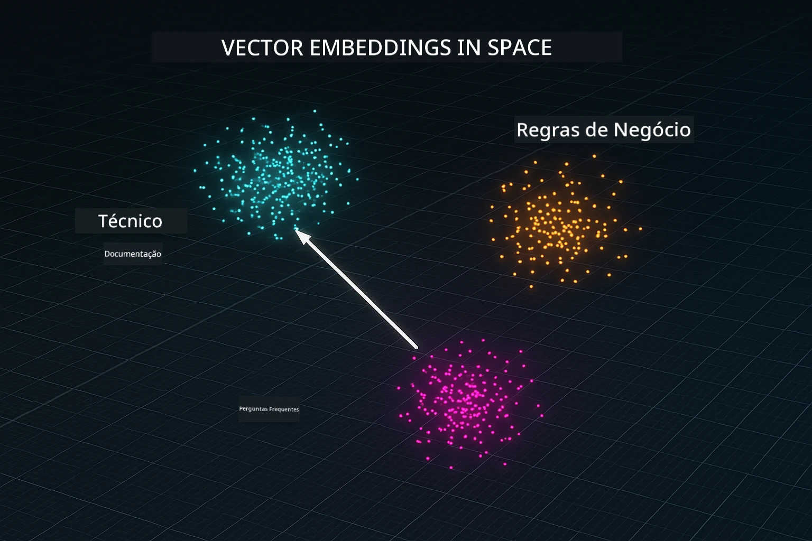
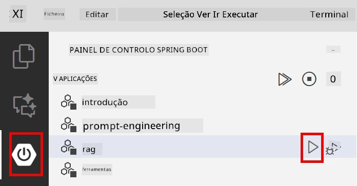
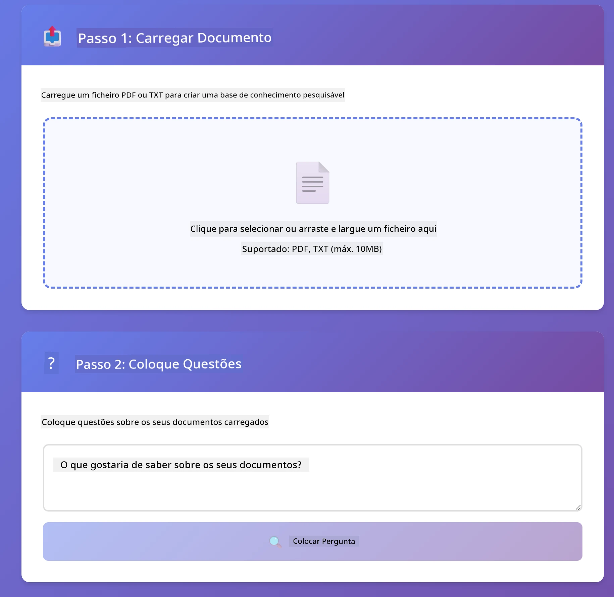
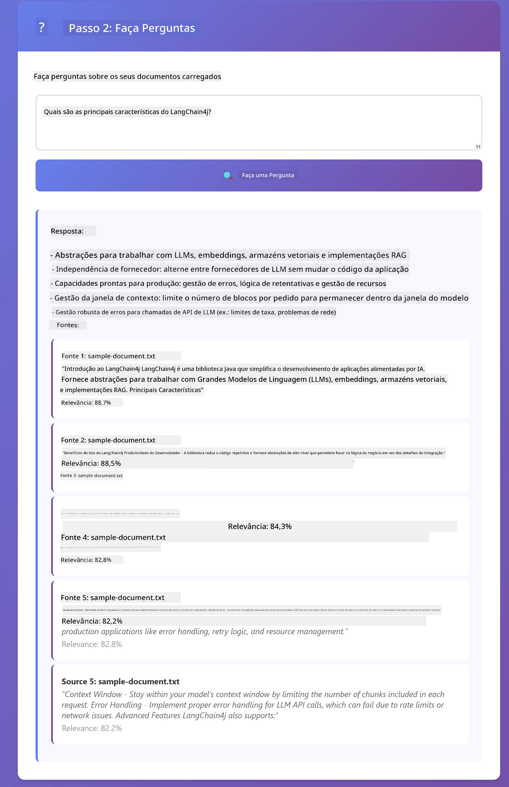

# Módulo 03: RAG (Geração com Recuperação Aprimorada)

## Índice

- [Video Explicativo](#video-explicativo)
- [O Que Vai Aprender](#o-que-vai-aprender)
- [Pré-requisitos](#pré-requisitos)
- [Compreendendo o RAG](#compreendendo-o-rag)
  - [Qual Abordagem RAG Este Tutorial Usa?](#qual-abordagem-rag-este-tutorial-usa)
- [Como Funciona](#como-funciona)
  - [Processamento de Documentos](#processamento-de-documentos)
  - [Criação de Embeddings](#criação-de-embeddings)
  - [Pesquisa Semântica](#pesquisa-semântica)
  - [Geração de Resposta](#geração-de-respostas)
- [Executar a Aplicação](#executar-a-aplicação)
- [Usar a Aplicação](#usar-a-aplicação)
  - [Enviar um Documento](#carregar-um-documento)
  - [Fazer Perguntas](#colocar-perguntas)
  - [Verificar Referências de Fonte](#verificar-referências-das-fontes)
  - [Experimentar com Perguntas](#experimente-com-perguntas)
- [Conceitos-Chave](#conceitos-chave)
  - [Estratégia de Chunking](#estratégia-de-fragmentação)
  - [Pontuações de Similaridade](#pontuações-de-similaridade)
  - [Armazenamento na Memória](#armazenamento-em-memória)
  - [Gestão da Janela de Contexto](#gestão-da-janela-de-contexto)
- [Quando o RAG Importa](#quando-o-rag-é-importante)
- [Próximos Passos](#próximos-passos)

## Video Explicativo

Assista a esta sessão ao vivo que explica como começar com este módulo:

<a href="https://www.youtube.com/watch?v=_olq75ZH_eY"></a>

## O Que Vai Aprender

Nos módulos anteriores, aprendeu a ter conversas com IA e a estruturar os seus prompts de forma eficaz. Mas há uma limitação fundamental: os modelos de linguagem apenas sabem o que aprenderam durante o treino. Eles não conseguem responder a perguntas sobre as políticas da sua empresa, a documentação do seu projeto ou qualquer informação que não tenham sido treinados para conhecer.

O RAG (Geração com Recuperação Aprimorada) resolve este problema. Em vez de tentar ensinar o modelo com a sua informação (o que é caro e pouco prático), dá-lhe a capacidade de pesquisar nos seus documentos. Quando alguém faz uma pergunta, o sistema encontra informação relevante e inclui-a no prompt. O modelo responde com base nesse contexto recuperado.

Pense no RAG como dar ao modelo uma biblioteca de referência. Quando faz uma pergunta, o sistema:

1. **Consulta do Utilizador** - Você faz uma pergunta  
2. **Embedding** - Converte a sua pergunta num vetor  
3. **Pesquisa Vetorial** - Encontra pedaços de documentos semelhantes  
4. **Montagem do Contexto** - Adiciona pedaços relevantes ao prompt  
5. **Resposta** - O LLM gera uma resposta com base no contexto  

Isto fundamenta as respostas do modelo nos seus dados reais, em vez de depender do conhecimento de treino ou inventar respostas.

## Pré-requisitos

- Conclusão do [Módulo 01 - Introdução](../01-introduction/README.md) (recursos Azure OpenAI implantados, incluindo o modelo de embedding `text-embedding-3-small`)  
- Ficheiro `.env` no diretório raiz com credenciais Azure (criado pelo comando `azd up` no Módulo 01)  

> **Nota:** Se não completou o Módulo 01, siga as instruções de implantação aí primeiro. O comando `azd up` implanta tanto o modelo de chat GPT como o modelo de embedding usado por este módulo.

## Compreendendo o RAG

O diagrama abaixo ilustra o conceito principal: em vez de confiar apenas nos dados de treino do modelo, o RAG dá-lhe uma biblioteca de referência dos seus documentos para consultar antes de gerar cada resposta.


*Este diagrama mostra a diferença entre um LLM padrão (que tenta adivinhar com base no treino) e um LLM com RAG (que consulta primeiro os seus documentos).*

Aqui está como as peças se ligam end-to-end. A pergunta do utilizador flui por quatro etapas — embedding, pesquisa vetorial, montagem do contexto e geração da resposta — cada uma construindo sobre a anterior:



*Este diagrama mostra o pipeline RAG de ponta a ponta — a pergunta do utilizador flui por embedding, pesquisa vetorial, montagem do contexto e geração da resposta.*

O resto deste módulo percorre cada etapa em detalhe, com código que pode executar e modificar.

### Qual Abordagem RAG Este Tutorial Usa?

O LangChain4j oferece três formas de implementar RAG, cada uma com um nível diferente de abstração. O diagrama abaixo compara-as lado a lado:


*Este diagrama compara as três abordagens RAG do LangChain4j — Easy, Native e Advanced — mostrando os seus componentes chave e quando usar cada uma.*

| Abordagem | O Que Faz | Compromisso |
|---|---|---|
| **Easy RAG** | Liga tudo automaticamente através do `AiServices` e `ContentRetriever`. Anota uma interface, liga um recuperador, e o LangChain4j trata do embedding, pesquisa e montagem do prompt nos bastidores. | Código mínimo, mas não vê o que acontece em cada etapa. |
| **Native RAG** | Chama o modelo de embedding, pesquisa na loja, constrói o prompt e gera a resposta — um passo explícito de cada vez. | Mais código, mas cada etapa é visível e modificável. |
| **Advanced RAG** | Usa o framework `RetrievalAugmentor` com transformadores de consulta plugáveis, routers, re-rankers e injetores de conteúdo para pipelines de nível produção. | Máxima flexibilidade, mas com complexidade muito maior. |

**Este tutorial usa a abordagem Native.** Cada passo do pipeline RAG — embedding da consulta, pesquisa na loja vetorial, montagem do contexto e geração da resposta — está explicitamente escrito em [`RagService.java`](../../../03-rag/src/main/java/com/example/langchain4j/rag/service/RagService.java). Isto é intencional: como recurso de aprendizagem, é mais importante que veja e compreenda cada etapa do que que o código esteja minimizado. Quando se sentir confortável com a montagem das peças, pode passar para Easy RAG para protótipos rápidos ou Advanced RAG para sistemas de produção.

> **💡 Curioso sobre Easy RAG?** O LangChain4j também oferece uma abordagem *Easy RAG* onde `AiServices` e um `ContentRetriever` tratam automaticamente do embedding, pesquisa e montagem do prompt. Este módulo escolhe o caminho mais explícito — abrir o pipeline para que possa ver e controlar cada etapa.

O diagrama abaixo mostra o pipeline Easy RAG. Repare como `AiServices` e `EmbeddingStoreContentRetriever` ocultam toda a complexidade — você carrega um documento, liga um recuperador e obtém respostas. A abordagem Native neste módulo abre cada um desses passos ocultos:


*Este diagrama mostra o pipeline Easy RAG. Compare com a abordagem Native usada neste módulo: o Easy RAG oculta o embedding, a recuperação e a montagem do prompt atrás de `AiServices` e `ContentRetriever` — carrega um documento, liga um recuperador e obtém respostas. A abordagem Native deste módulo abre esse pipeline para que chame cada etapa (embed, pesquisa, monta contexto, gera) sozinho, dando-lhe total visibilidade e controlo.*

## Como Funciona

O pipeline RAG neste módulo divide-se em quatro etapas que correm em sequência sempre que um utilizador faz uma pergunta. Primeiro, um documento enviado é **analisado e dividido em pedaços** geríveis. Esses pedaços são depois convertidos em **embeddings vetoriais** e armazenados para poderem ser comparados matematicamente. Quando chega uma consulta, o sistema executa uma **pesquisa semântica** para encontrar os pedaços mais relevantes e, finalmente, passa esses pedaços como contexto ao LLM para a **geração da resposta**. As secções abaixo percorrem cada etapa com o código e diagramas reais. Vamos ver o primeiro passo.

### Processamento de Documentos

[DocumentService.java](../../../03-rag/src/main/java/com/example/langchain4j/rag/service/DocumentService.java)

Quando envia um documento, o sistema faz o parsing (PDF ou texto simples), anexa metadados como o nome do ficheiro e depois divide-o em pedaços — peças menores que cabem confortavelmente na janela de contexto do modelo. Esses pedaços se sobrepõem ligeiramente para não perder contexto nas fronteiras.

```java
// Analisar o ficheiro carregado e encapsulá-lo num Documento LangChain4j
Document document = Document.from(content, metadata);

// Dividir em pedaços de 300 tokens com uma sobreposição de 30 tokens
DocumentSplitter splitter = DocumentSplitters
    .recursive(300, 30);

List<TextSegment> segments = splitter.split(document);
```
  
O diagrama abaixo mostra como isto funciona visualmente. Repare como cada pedaço partilha alguns tokens com os vizinhos — a sobreposição de 30 tokens assegura que nenhum contexto importante fique entre as fendas:


*Este diagrama mostra um documento a ser separado em pedaços de 300 tokens com sobreposição de 30 tokens, preservando o contexto nas fronteiras dos pedaços.*

> **🤖 Experimente com o [GitHub Copilot](https://github.com/features/copilot) Chat:** Abra [`DocumentService.java`](../../../03-rag/src/main/java/com/example/langchain4j/rag/service/DocumentService.java) e pergunte:
> - "Como o LangChain4j divide documentos em pedaços e por que a sobreposição é importante?"
> - "Qual é o tamanho ótimo dos pedaços para diferentes tipos de documentos e porquê?"
> - "Como lidar com documentos em múltiplas línguas ou com formatação especial?"

### Criação de Embeddings

[LangChainRagConfig.java](../../../03-rag/src/main/java/com/example/langchain4j/rag/config/LangChainRagConfig.java)

Cada pedaço é convertido numa representação numérica chamada embedding — essencialmente um conversor de significado para números. O modelo de embedding não é "inteligente" como um modelo de chat; não consegue seguir instruções, raciocinar ou responder perguntas. O que ele pode fazer é mapear texto num espaço matemático onde significados semelhantes ficam próximos — "carro" perto de "automóvel", "política de reembolso" perto de "devolver o meu dinheiro". Pense num modelo de chat como uma pessoa com quem pode falar; um modelo de embedding é um sistema de arquivamento ultra eficiente.

O diagrama abaixo visualiza este conceito — entra texto, saem vetores numéricos, e significados semelhantes produzem vetores próximos:


*Este diagrama mostra como um modelo de embedding converte texto em vetores numéricos, colocando significados semelhantes — como "carro" e "automóvel" — próximos um do outro no espaço vetorial.*

```java
@Bean
public EmbeddingModel embeddingModel() {
    return OpenAiOfficialEmbeddingModel.builder()
        .baseUrl(azureOpenAiEndpoint)
        .apiKey(azureOpenAiKey)
        .modelName(azureEmbeddingDeploymentName)
        .build();
}

EmbeddingStore<TextSegment> embeddingStore = 
    new InMemoryEmbeddingStore<>();
```
  
O diagrama de classes abaixo mostra os dois fluxos separados num pipeline RAG e as classes LangChain4j que os implementam. O **fluxo de ingestão** (executado uma vez no momento do upload) divide o documento, faz embedding dos pedaços e armazena-os via `.addAll()`. O **fluxo de consulta** (executado cada vez que um utilizador pergunta) faz embedding da pergunta, pesquisa na loja via `.search()`, e passa o contexto encontrado ao modelo de chat. Ambos os fluxos partilham a interface `EmbeddingStore<TextSegment>`:


*Este diagrama mostra os dois fluxos num pipeline RAG — ingestão e consulta — e como se ligam através de um EmbeddingStore partilhado.*

Uma vez armazenados os embeddings, conteúdos semelhantes naturalmente agrupam-se no espaço vetorial. A visualização abaixo mostra como documentos sobre tópicos relacionados acabam como pontos próximos, que é o que torna possível a pesquisa semântica:



*Esta visualização mostra como documentos relacionados agrupam-se em espaço vetorial 3D, com tópicos como Documentação Técnica, Regras de Negócio e FAQ formando grupos distintos.*

Quando um utilizador pesquisa, o sistema segue quatro passos: embedding dos documentos uma vez, embedding da consulta a cada pesquisa, comparação do vetor da consulta contra todos os vetores armazenados usando similaridade do cosseno, e devolve os top-K pedaços com maior pontuação. O diagrama abaixo percorre cada etapa e as classes LangChain4j envolvidas:


*Este diagrama mostra o processo de pesquisa por embedding em quatro passos: embed dos documentos, embed da consulta, comparação dos vetores pela similaridade do cosseno, e retorno dos top-K resultados.*

### Pesquisa Semântica

[RagService.java](../../../03-rag/src/main/java/com/example/langchain4j/rag/service/RagService.java)

Quando faz uma pergunta, a sua questão também é transformada num embedding. O sistema compara o embedding da sua pergunta contra os embeddings de todos os pedaços dos documentos. Ele encontra os pedaços com os significados mais semelhantes — não apenas correspondência de palavras-chave, mas similaridade semântica real.

```java
Embedding queryEmbedding = embeddingModel.embed(question).content();

EmbeddingSearchRequest searchRequest = EmbeddingSearchRequest.builder()
    .queryEmbedding(queryEmbedding)
    .maxResults(5)
    .minScore(0.5)
    .build();

EmbeddingSearchResult<TextSegment> searchResult = embeddingStore.search(searchRequest);
List<EmbeddingMatch<TextSegment>> matches = searchResult.matches();

for (EmbeddingMatch<TextSegment> match : matches) {
    String relevantText = match.embedded().text();
    double score = match.score();
}
```
  
O diagrama abaixo contrasta a pesquisa semântica com a pesquisa tradicional por palavra-chave. Uma pesquisa por palavra-chave para "veículo" não encontra um pedaço sobre "carros e camiões", mas a pesquisa semântica entende que significam a mesma coisa e retorna isso como resultado de alta pontuação:


*Este diagrama compara pesquisa baseada em palavras-chave com pesquisa semântica, mostrando como a pesquisa semântica recupera conteúdo conceitualmente relacionado mesmo quando as palavras-chave exatas diferem.*

Nos bastidores, a similaridade é medida usando similaridade do cosseno — basicamente perguntando "estes dois vetores apontam para a mesma direção?" Dois pedaços podem usar palavras completamente diferentes, mas se significam a mesma coisa os seus vetores apontam na mesma direção e a pontuação é próxima de 1.0:


*Este diagrama ilustra a similaridade do cosseno como o ângulo entre vetores de incorporação — vetores mais alinhados pontuam mais perto de 1.0, indicando maior similaridade semântica.*

> **🤖 Experimente com o [GitHub Copilot](https://github.com/features/copilot) Chat:** Abra [`RagService.java`](../../../03-rag/src/main/java/com/example/langchain4j/rag/service/RagService.java) e pergunte:
> - "Como funciona a pesquisa de similaridade com embeddings e o que determina a pontuação?"
> - "Que limiar de similaridade devo usar e como ele afeta os resultados?"
> - "Como lidar com casos em que nenhum documento relevante é encontrado?"

### Geração de Respostas

[RagService.java](../../../03-rag/src/main/java/com/example/langchain4j/rag/service/RagService.java)

Os fragmentos mais relevantes são reunidos num prompt estruturado que inclui instruções explícitas, o contexto recuperado e a pergunta do utilizador. O modelo lê esses fragmentos específicos e responde com base nessa informação — pode usar apenas o que está à sua frente, o que evita alucinações.

```java
String context = matches.stream()
    .map(match -> match.embedded().text())
    .collect(Collectors.joining("\n\n"));

String prompt = String.format("""
    Answer the question based on the following context.
    If the answer cannot be found in the context, say so.

    Context:
    %s

    Question: %s

    Answer:""", context, request.question());

String answer = chatModel.chat(prompt);
```

O diagrama abaixo mostra esta montagem em ação — os fragmentos com as melhores pontuações da etapa de pesquisa são inseridos no modelo de prompt, e o `OpenAiOfficialChatModel` gera uma resposta fundamentada:


*Este diagrama mostra como os fragmentos com melhor pontuação são montados num prompt estruturado, permitindo ao modelo gerar uma resposta fundamentada a partir dos seus dados.*

## Executar a Aplicação

**Verifique a implantação:**

Certifique-se de que o ficheiro `.env` existe no diretório raiz com as credenciais Azure (criadas durante o Módulo 01). Execute isto a partir do diretório do módulo (`03-rag/`):

**Bash:**
```bash
cat ../.env  # Deve mostrar AZURE_OPENAI_ENDPOINT, API_KEY, DEPLOYMENT
```

**PowerShell:**
```powershell
Get-Content ..\.env  # Deve mostrar AZURE_OPENAI_ENDPOINT, API_KEY, DEPLOYMENT
```

**Inicie a aplicação:**

> **Nota:** Se já iniciou todas as aplicações usando `./start-all.sh` a partir do diretório raiz (conforme descrito no Módulo 01), este módulo já está a correr na porta 8081. Pode saltar os comandos de início abaixo e aceder diretamente a http://localhost:8081.

**Opção 1: Usar o Spring Boot Dashboard (Recomendado para utilizadores do VS Code)**

O container de desenvolvimento inclui a extensão Spring Boot Dashboard, que fornece uma interface visual para gerir todas as aplicações Spring Boot. Pode encontrá-la na Barra de Actividades à esquerda do VS Code (procure o ícone do Spring Boot).

A partir do Spring Boot Dashboard pode:
- Ver todas as aplicações Spring Boot disponíveis no workspace
- Iniciar/parar aplicações com um clique
- Visualizar logs da aplicação em tempo real
- Monitorizar o estado da aplicação

Basta clicar no botão de play ao lado de "rag" para iniciar este módulo, ou iniciar todos os módulos de uma vez.



*Esta captura de ecrã mostra o Spring Boot Dashboard no VS Code, onde pode iniciar, parar e monitorizar aplicações visualmente.*

**Opção 2: Usar scripts shell**

Inicie todas as aplicações web (módulos 01-04):

**Bash:**
```bash
cd ..  # A partir do diretório raiz
./start-all.sh
```

**PowerShell:**
```powershell
cd ..  # A partir do diretório raiz
.\start-all.ps1
```

Ou inicie só este módulo:

**Bash:**
```bash
cd 03-rag
./start.sh
```

**PowerShell:**
```powershell
cd 03-rag
.\start.ps1
```

Ambos os scripts carregam automaticamente as variáveis de ambiente do ficheiro `.env` raiz e irão compilar os JARs se não existirem.

> **Nota:** Se preferir compilar todos os módulos manualmente antes de iniciar:
>
> **Bash:**
> ```bash
> cd ..  # Go to root directory
> mvn clean package -DskipTests
> ```
>
> **PowerShell:**
> ```powershell
> cd ..  # Go to root directory
> mvn clean package -DskipTests
> ```

Abra http://localhost:8081 no seu navegador.

**Para parar:**

**Bash:**
```bash
./stop.sh  # Apenas este módulo
# Ou
cd .. && ./stop-all.sh  # Todos os módulos
```

**PowerShell:**
```powershell
.\stop.ps1  # Apenas este módulo
# Ou
cd ..; .\stop-all.ps1  # Todos os módulos
```

## Usar a Aplicação

A aplicação fornece uma interface web para upload de documentos e colocação de perguntas.

<a href="images/rag-homepage.png"></a>

*Esta captura de ecrã mostra a interface da aplicação RAG onde carrega documentos e coloca perguntas.*

### Carregar um Documento

Comece por carregar um documento — ficheiros TXT funcionam melhor para testes. Um `sample-document.txt` é fornecido neste diretório e contém informação sobre as funcionalidades LangChain4j, implementação RAG e melhores práticas — perfeito para testar o sistema.

O sistema processa o seu documento, divide-o em fragmentos e cria embeddings para cada fragmento. Isto acontece automaticamente quando faz o upload.

### Colocar Perguntas

Agora coloque perguntas específicas sobre o conteúdo do documento. Experimente algo factual que esteja claramente declarado no documento. O sistema procura fragmentos relevantes, inclui-os no prompt e gera uma resposta.

### Verificar Referências das Fontes

Note que cada resposta inclui referências das fontes com pontuações de similaridade. Estas pontuações (de 0 a 1) mostram quão relevante foi cada fragmento para a sua pergunta. Pontuações mais altas significam melhores correspondências. Isto permite-lhe verificar a resposta em relação ao material de origem.

<a href="images/rag-query-results.png"></a>

*Esta captura de ecrã mostra resultados de consultas com a resposta gerada, referências das fontes e pontuações de relevância para cada fragmento recuperado.*

### Experimente com Perguntas

Experimente diferentes tipos de perguntas:
- Factos específicos: "Qual é o tema principal?"
- Comparações: "Qual a diferença entre X e Y?"
- Resumos: "Resuma os pontos chave sobre Z"

Observe como as pontuações de relevância mudam com base na correspondência da sua pergunta com o conteúdo do documento.

## Conceitos-Chave

### Estratégia de Fragmentação

Os documentos são divididos em fragmentos de 300 tokens com 30 tokens de sobreposição. Este equilíbrio assegura que cada fragmento tem contexto suficiente para ser significativo e permanece pequeno o suficiente para incluir múltiplos fragmentos num prompt.

### Pontuações de Similaridade

Cada fragmento recuperado vem com uma pontuação de similaridade entre 0 e 1 que indica o quão próximo está da pergunta do utilizador. O diagrama abaixo visualiza os intervalos de pontuação e como o sistema os usa para filtrar resultados:


*Este diagrama mostra intervalos de pontuações entre 0 e 1, com um limiar mínimo de 0.5 que filtra fragmentos irrelevantes.*

As pontuações variam de 0 a 1:
- 0.7-1.0: Altamente relevante, correspondência exata
- 0.5-0.7: Relevante, bom contexto
- Abaixo de 0.5: Filtrado, demasiado dissimilar

O sistema só recupera fragmentos acima do limiar mínimo para garantir qualidade.

Embeddings funcionam bem quando o significado agrupa-se claramente, mas têm pontos cegos. O diagrama abaixo mostra os modos comuns de falha — fragmentos demasiado grandes produzem vetores imprecisos, fragmentos demasiado pequenos carecem de contexto, termos ambíguos apontam para múltiplos agrupamentos, e pesquisas de correspondência exata (IDs, números de peça) não funcionam de todo com embeddings:


*Este diagrama mostra modos comuns de falha em embeddings: fragmentos demasiado grandes, fragmentos demasiado pequenos, termos ambíguos que apontam para múltiplos agrupamentos, e pesquisas de correspondência exata como IDs.*

### Armazenamento em Memória

Este módulo usa armazenamento em memória pela simplicidade. Quando reinicia a aplicação, os documentos carregados são perdidos. Sistemas em produção usam bases de dados vetoriais persistentes como Qdrant ou Azure AI Search.

### Gestão da Janela de Contexto

Cada modelo tem uma janela de contexto máxima. Não pode incluir todos os fragmentos de um documento grande. O sistema recupera os N fragmentos mais relevantes (padrão 5) para manter-se dentro dos limites enquanto fornece contexto suficiente para respostas precisas.

## Quando o RAG é Importante

RAG não é sempre o método adequado. O guia decisório abaixo ajuda a determinar quando o RAG acrescenta valor versus quando abordagens mais simples — como incluir o conteúdo diretamente no prompt ou confiar no conhecimento incorporado do modelo — são suficientes:


*Este diagrama mostra um guia decisório para quando o RAG acrescenta valor versus quando abordagens mais simples são suficientes.*

## Próximos Passos

**Próximo Módulo:** [04-tools - Agentes AI com Ferramentas](../04-tools/README.md)

---

**Navegação:** [← Anterior: Módulo 02 - Engenharia de Prompt](../02-prompt-engineering/README.md) | [Voltar ao Início](../README.md) | [Próximo: Módulo 04 - Ferramentas →](../04-tools/README.md)

---

<!-- CO-OP TRANSLATOR DISCLAIMER START -->
**Aviso Legal**:
Este documento foi traduzido utilizando o serviço de tradução automática [Co-op Translator](https://github.com/Azure/co-op-translator). Embora nos esforcemos pela precisão, esteja ciente de que traduções automáticas podem conter erros ou imprecisões. O documento original na sua língua nativa deve ser considerado a fonte autorizada. Para informações críticas, recomenda-se tradução profissional humana. Não nos responsabilizamos por quaisquer mal-entendidos ou interpretações incorretas resultantes da utilização desta tradução.
<!-- CO-OP TRANSLATOR DISCLAIMER END -->