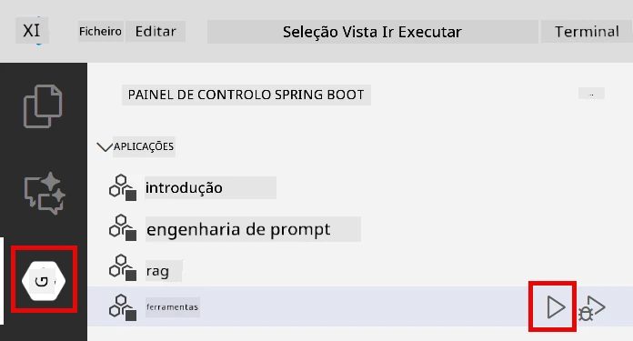
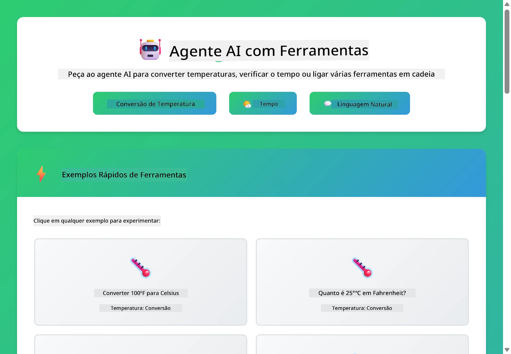
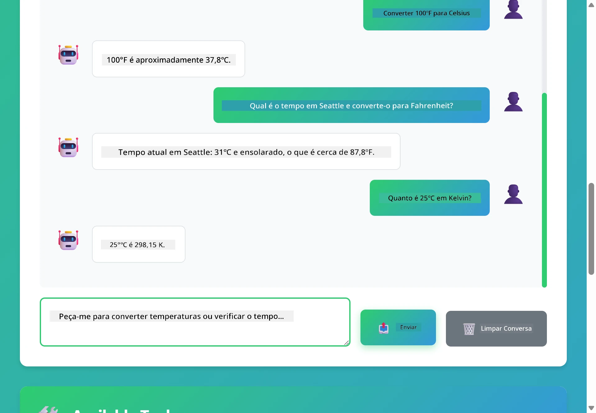

# Módulo 04: Agentes de IA com Ferramentas

## Índice

- [Video Walkthrough](#video-walkthrough)
- [O que vais aprender](#o-que-vais-aprender)
- [Pré-requisitos](#pré-requisitos)
- [Compreender Agentes de IA com Ferramentas](#compreender-agentes-de-ia-com-ferramentas)
- [Como funciona a chamada de ferramentas](#como-funciona-a-chamada-de-ferramentas)
  - [Definições de Ferramentas](#definições-de-ferramentas)
  - [Tomada de Decisão](#tomada-de-decisão)
  - [Execução](#execução)
  - [Geração de Resposta](#geração-de-resposta)
  - [Arquitetura: Spring Boot Auto-Wiring](#arquitetura-spring-boot-auto-wiring)
- [Encadeamento de Ferramentas](#encadeamento-de-ferramentas)
- [Executar a Aplicação](#executar-a-aplicação)
- [Utilizar a Aplicação](#usar-a-aplicação)
  - [Experimentar Uso Simples de Ferramentas](#experimente-um-uso-simples-da-ferramenta)
  - [Testar Encadeamento de Ferramentas](#testar-cadeia-de-ferramentas)
  - [Ver Fluxo de Conversa](#ver-o-fluxo-da-conversa)
  - [Experimentar com Diferentes Pedidos](#experimente-pedidos-diferentes)
- [Conceitos-Chave](#conceitos-chave)
  - [Padrão ReAct (Raciocínio e Ação)](#padrão-react-raciocínio-e-ação)
  - [Descrições de Ferramentas Importam](#as-descrições-das-ferramentas-são-importantes)
  - [Gestão de Sessão](#gestão-de-sessão)
  - [Gestão de Erros](#tratamento-de-erros)
- [Ferramentas Disponíveis](#ferramentas-disponíveis)
- [Quando Usar Agentes Baseados em Ferramentas](#quando-usar-agentes-baseados-em-ferramentas)
- [Ferramentas vs RAG](#ferramentas-vs-rag)
- [Próximos Passos](#próximos-passos)

## Video Walkthrough

Assiste a esta sessão ao vivo que explica como começar com este módulo:

<a href="https://www.youtube.com/watch?v=O_J30kZc0rw"></a>

## O que vais aprender

Até agora, aprendeste como ter conversas com IA, estruturar prompts de forma eficaz e fundamentar respostas com os teus documentos. Mas ainda existe uma limitação fundamental: os modelos de linguagem só conseguem gerar texto. Não podem verificar o tempo, fazer cálculos, consultar bases de dados ou interagir com sistemas externos.

As ferramentas mudam isso. Ao dar acesso ao modelo a funções que pode invocar, transformas-no de um gerador de texto num agente que pode tomar ações. O modelo decide quando precisa de uma ferramenta, qual utilizar e que parâmetros passar. O teu código executa a função e devolve o resultado. O modelo incorpora esse resultado na sua resposta.

## Pré-requisitos

- Completar [Módulo 01 - Introdução](../01-introduction/README.md) (recursos Azure OpenAI implantados)
- Recomenda-se completar os módulos anteriores (este módulo referencia [conceitos de RAG do Módulo 03](../03-rag/README.md) na comparação Ferramentas vs RAG)
- Ficheiro `.env` na diretoria raiz com credenciais Azure (criado pelo `azd up` no Módulo 01)

> **Nota:** Se não concluíste o Módulo 01, segue primeiro as instruções de implantação aí descritas.

## Compreender Agentes de IA com Ferramentas

> **📝 Nota:** O termo "agentes" neste módulo refere-se a assistentes de IA com capacidade para invocar ferramentas. Isto é diferente dos padrões **Agentic AI** (agentes autónomos com planeamento, memória e raciocínio multi-etapa) que abordaremos no [Módulo 05: MCP](../05-mcp/README.md).

Sem ferramentas, um modelo de linguagem só consegue gerar texto com base nos seus dados de treino. Pergunta-lhe o tempo atual e terá de adivinhar. Dá-lhe ferramentas e pode invocar uma API meteorológica, fazer cálculos ou consultar uma base de dados — e depois integrar esses resultados reais na resposta.


*Sem ferramentas, o modelo só pode adivinhar — com ferramentas pode chamar APIs, fazer cálculos e retornar dados em tempo real.*

Um agente de IA com ferramentas segue um padrão **Raciocínio e Ação (ReAct)**. O modelo não responde apenas — pensa no que precisa, age chamando uma ferramenta, observa o resultado e depois decide se volta a agir ou entrega a resposta final:

1. **Raciocina** — O agente analisa a questão do utilizador e determina que informação precisa
2. **Age** — O agente seleciona a ferramenta correta, gera os parâmetros adequados e chama-a
3. **Observa** — O agente recebe a saída da ferramenta e avalia o resultado
4. **Repetir ou Responder** — Se for necessário mais dados, o agente repete o processo; caso contrário, compõe uma resposta em linguagem natural


*O ciclo ReAct — o agente raciocina sobre o que fazer, age chamando uma ferramenta, observa o resultado e repete até poder entregar a resposta final.*

Isto acontece automaticamente. Definis as ferramentas e as suas descrições. O modelo trata da decisão sobre quando e como as usar.

## Como funciona a chamada de ferramentas

### Definições de Ferramentas

[WeatherTool.java](../../../04-tools/src/main/java/com/example/langchain4j/agents/tools/WeatherTool.java) | [TemperatureTool.java](../../../04-tools/src/main/java/com/example/langchain4j/agents/tools/TemperatureTool.java)

Definis funções com descrições claras e especificações de parâmetros. O modelo vê estas descrições no prompt do sistema e percebe o que cada ferramenta faz.

```java
@Component
public class WeatherTool {
    
    @Tool("Get the current weather for a location")
    public String getCurrentWeather(@P("Location name") String location) {
        // A sua lógica de pesquisa do tempo
        return "Weather in " + location + ": 22°C, cloudy";
    }
}

@AiService
public interface Assistant {
    String chat(@MemoryId String sessionId, @UserMessage String message);
}

// O assistente é automaticamente configurado pelo Spring Boot com:
// - Bean ChatModel
// - Todos os métodos @Tool das classes @Component
// - ChatMemoryProvider para gestão de sessões
```

O diagrama abaixo detalha cada anotação e mostra como cada parte ajuda a IA a perceber quando invocar a ferramenta e que argumentos passar:


*Anatomia de uma definição de ferramenta — @Tool indica à IA quando a usar, @P descreve cada parâmetro, e @AiService liga tudo juntamente no arranque.*

> **🤖 Experimenta com [GitHub Copilot](https://github.com/features/copilot) Chat:** Abre [`WeatherTool.java`](../../../04-tools/src/main/java/com/example/langchain4j/agents/tools/WeatherTool.java) e pergunta:
> - "Como integraria uma API meteorológica real como OpenWeatherMap em vez de dados mock?"
> - "O que faz uma boa descrição de ferramenta que ajuda a IA a usá-la corretamente?"
> - "Como faço para lidar com erros de API e limites de chamadas nas implementações das ferramentas?"

### Tomada de Decisão

Quando o utilizador pergunta "Qual é o tempo em Seattle?", o modelo não escolhe uma ferramenta aleatoriamente. Compara a intenção do utilizador com cada descrição de ferramenta disponível, pontua a relevância e seleciona a melhor. Depois gera uma chamada estruturada à função com os parâmetros corretos — neste caso, definir `location` para `"Seattle"`.

Se nenhuma ferramenta corresponder ao pedido, o modelo recorre a responder com o seu próprio conhecimento. Se várias ferramentas corresponderem, escolhe a mais específica.


*O modelo avalia cada ferramenta disponível face à intenção do utilizador e seleciona a melhor — por isso é importante escrever descrições claras e específicas de ferramentas.*

### Execução

[AgentService.java](../../../04-tools/src/main/java/com/example/langchain4j/agents/service/AgentService.java)

O Spring Boot liga automaticamente a interface declarativa `@AiService` com todas as ferramentas registadas, e o LangChain4j executa as chamadas às ferramentas automaticamente. Por trás das cenas, uma chamada completa passa por seis fases — desde a pergunta em linguagem natural do utilizador até uma resposta final em linguagem natural:


*O fluxo completo — o utilizador faz uma pergunta, o modelo seleciona uma ferramenta, o LangChain4j executa-a, e o modelo tece o resultado numa resposta natural.*

Nos bastidores, `AiServices` executa o mesmo ciclo de chamada para qualquer ferramenta — aqui ilustrado com um simples `Calculator`. O diagrama de sequência abaixo mostra exatamente o que acontece por trás:


*O ciclo de chamada de ferramentas — `AiServices` envia a tua mensagem e esquemas das ferramentas para o LLM, o LLM responde com uma chamada de função como `add(42, 58)`, o LangChain4j executa o método `Calculator` localmente, e envia o resultado de volta para a resposta final.*

> **🤖 Experimenta com [GitHub Copilot](https://github.com/features/copilot) Chat:** Abre [`AgentService.java`](../../../04-tools/src/main/java/com/example/langchain4j/agents/service/AgentService.java) e pergunta:
> - "Como funciona o padrão ReAct e por que é eficaz para agentes de IA?"
> - "Como o agente decide que ferramenta usar e em que ordem?"
> - "O que acontece se a execução de uma ferramenta falhar - como devo tratar erros de forma robusta?"

### Geração de Resposta

O modelo recebe os dados do tempo e formata-os numa resposta em linguagem natural para o utilizador.

### Arquitetura: Spring Boot Auto-Wiring

Este módulo usa a integração do LangChain4j com Spring Boot e interfaces declarativas `@AiService`. No arranque, o Spring Boot descobre todos os `@Component` que contêm métodos `@Tool`, o bean `ChatModel` e o `ChatMemoryProvider` — e liga-os todos numa única interface `Assistant` sem código repetitivo.


*A interface @AiService liga o ChatModel, os componentes de ferramenta e o fornecedor de memória — o Spring Boot faz toda a ligação automaticamente.*

Aqui está o ciclo completo do pedido como diagrama de sequência — desde o pedido HTTP, pelo controlador, serviço, proxy auto-ligado, até à execução da ferramenta e retorno:


*O ciclo completo de pedido Spring Boot — o pedido HTTP passa pelo controlador e serviço até ao proxy Assistant auto-ligado, que orquestra o LLM e as chamadas às ferramentas automaticamente.*

Vantagens-chave desta abordagem:

- **Auto-wiring do Spring Boot** — ChatModel e ferramentas injetados automaticamente
- **Padrão @MemoryId** — Gestão automática de memória baseada em sessão
- **Instância única** — Assistant criado uma vez e reutilizado para melhor performance
- **Execução com tipo seguro** — Métodos Java chamados diretamente com conversão de tipos
- **Orquestração multi-turno** — Lida automaticamente com encadeamento de ferramentas
- **Zero código repetitivo** — Sem chamadas manuais a `AiServices.builder()` ou HashMaps de memória

Abordagens alternativas (manual `AiServices.builder()`) exigem mais código e perdem os benefícios da integração Spring Boot.

## Encadeamento de Ferramentas

**Encadeamento de Ferramentas** — O verdadeiro poder dos agentes baseados em ferramentas revela-se quando uma única pergunta exige múltiplas ferramentas. Pergunta "Qual é o tempo em Seattle em Fahrenheit?" e o agente automaticamente encadeia duas ferramentas: primeiro chama `getCurrentWeather` para obter a temperatura em Celsius, depois passa esse valor para `celsiusToFahrenheit` para conversão — tudo numa única interação de conversa.


*Encadeamento de ferramentas em ação — o agente chama primeiro getCurrentWeather, depois envia o resultado em Celsius para celsiusToFahrenheit, e entrega uma resposta combinada.*

**Falhas Elegantes** — Pede o tempo numa cidade que não está nos dados mock. A ferramenta devolve uma mensagem de erro, e a IA explica que não pode ajudar em vez de falhar. As ferramentas falham com segurança. O diagrama abaixo contrasta as duas abordagens — com tratamento de erro apropriado, o agente apanha a exceção e responde de forma útil, enquanto que sem ele toda a aplicação crasha:


*Quando uma ferramenta falha, o agente apanha o erro e responde com uma explicação útil em vez de crashar.*

Isto acontece numa única interação de conversa. O agente orquestra múltiplas chamadas de ferramentas autonomamente.

## Executar a Aplicação

**Verificar implantação:**

Confirma que o ficheiro `.env` existe na diretoria raiz com as credenciais Azure (criado durante o Módulo 01). Executa isto na diretoria do módulo (`04-tools/`):

**Bash:**
```bash
cat ../.env  # Deve mostrar AZURE_OPENAI_ENDPOINT, API_KEY, DEPLOYMENT
```

**PowerShell:**
```powershell
Get-Content ..\.env  # Deve mostrar AZURE_OPENAI_ENDPOINT, API_KEY, DEPLOYMENT
```

**Iniciar a aplicação:**

> **Nota:** Se já iniciaste todas as aplicações usando `./start-all.sh` na diretoria raiz (como descrito no Módulo 01), este módulo já estará a correr na porta 8084. Podes saltar os comandos de arranque abaixo e ir diretamente para http://localhost:8084.

**Opção 1: Usar o Spring Boot Dashboard (Recomendado para utilizadores VS Code)**

O contêiner de desenvolvimento inclui a extensão Spring Boot Dashboard, que fornece uma interface visual para gerir todas as aplicações Spring Boot. Podes encontrá-la na Barra de Atividades no lado esquerdo do VS Code (procura pelo ícone do Spring Boot).

No Spring Boot Dashboard, podes:
- Ver todas as aplicações Spring Boot disponíveis no espaço de trabalho
- Iniciar/parar aplicações com um clique
- Ver logs da aplicação em tempo real
- Monitorizar o estado da aplicação

Clica simplesmente no botão de play junto a "tools" para iniciar este módulo, ou inicia todos os módulos de uma vez.

Aqui está como o Spring Boot Dashboard aparece no VS Code:


*O Painel Spring Boot no VS Code — iniciar, parar e monitorizar todos os módulos a partir de um único local*

**Opção 2: Usar scripts shell**

Iniciar todas as aplicações web (módulos 01-04):

**Bash:**
```bash
cd ..  # A partir do diretório raiz
./start-all.sh
```

**PowerShell:**
```powershell
cd ..  # A partir do diretório raiz
.\start-all.ps1
```

Ou iniciar apenas este módulo:

**Bash:**
```bash
cd 04-tools
./start.sh
```

**PowerShell:**
```powershell
cd 04-tools
.\start.ps1
```

Ambos os scripts carregam automaticamente as variáveis de ambiente a partir do ficheiro `.env` da raiz e irão construir os JARs caso não existam.

> **Nota:** Se preferir construir manualmente todos os módulos antes de iniciar:
>
> **Bash:**
> ```bash
> cd ..  # Go to root directory
> mvn clean package -DskipTests
> ```
>
> **PowerShell:**
> ```powershell
> cd ..  # Go to root directory
> mvn clean package -DskipTests
> ```

Abra http://localhost:8084 no seu navegador.

**Para parar:**

**Bash:**
```bash
./stop.sh  # Apenas este módulo
# Ou
cd .. && ./stop-all.sh  # Todos os módulos
```

**PowerShell:**
```powershell
.\stop.ps1  # Apenas este módulo
# Ou
cd ..; .\stop-all.ps1  # Todos os módulos
```

## Usar a Aplicação

A aplicação fornece uma interface web onde pode interagir com um agente AI que tem acesso a ferramentas de previsão do tempo e conversão de temperatura. Aqui está o aspeto da interface — inclui exemplos de início rápido e um painel de chat para enviar pedidos:

<a href="images/tools-homepage.png"></a>

*Interface das Ferramentas do Agente AI - exemplos rápidos e interface de chat para interação com as ferramentas*

### Experimente um Uso Simples da Ferramenta

Comece com um pedido simples: "Converter 100 graus Fahrenheit para Celsius". O agente reconhece que precisa da ferramenta de conversão de temperatura, chama-a com os parâmetros corretos e devolve o resultado. Repare em como isto parece natural — não teve de especificar qual a ferramenta a usar nem como a chamar.

### Testar Cadeia de Ferramentas

Agora experimente algo mais complexo: "Qual é o tempo em Seattle e converte para Fahrenheit?" Veja o agente a trabalhar isto em passos. Primeiro obtém a previsão do tempo (que retorna Celsius), reconhece que precisa converter para Fahrenheit, chama a ferramenta de conversão e combina ambos os resultados numa única resposta.

### Ver o Fluxo da Conversa

A interface de chat mantém o histórico da conversa, permitindo interações multi-turno. Pode ver todas as perguntas e respostas anteriores, facilitando o acompanhamento da conversa e a compreensão de como o agente constrói o contexto ao longo de múltiplas trocas.

<a href="images/tools-conversation-demo.png"></a>

*Conversa multi-turno mostrando conversões simples, consultas de previsão do tempo e cadeia de ferramentas*

### Experimente Pedidos Diferentes

Tente várias combinações:
- Consultas de previsão do tempo: "Qual é o tempo em Tóquio?"
- Conversões de temperatura: "Quanto é 25°C em Kelvin?"
- Consultas combinadas: "Verifica o tempo em Paris e diz-me se está acima de 20°C"

Repare em como o agente interpreta a linguagem natural e a traduz em chamadas apropriadas às ferramentas.

## Conceitos-Chave

### Padrão ReAct (Raciocínio e Ação)

O agente alterna entre raciocínio (decidir o que fazer) e ação (usar ferramentas). Este padrão permite a resolução autónoma de problemas em vez de simplesmente responder a instruções.

### As Descrições das Ferramentas São Importantes

A qualidade das descrições das suas ferramentas afeta diretamente o quão bem o agente as usa. Descrições claras e específicas ajudam o modelo a perceber quando e como chamar cada ferramenta.

### Gestão de Sessão

A anotação `@MemoryId` permite a gestão automática de memória baseada em sessões. Cada ID de sessão tem a sua própria instância `ChatMemory` gerida pelo bean `ChatMemoryProvider`, permitindo que múltiplos utilizadores interajam com o agente simultaneamente sem misturar as conversas. O diagrama abaixo mostra como múltiplos utilizadores são encaminhados para memórias isoladas baseadas nos seus IDs de sessão:


*Cada ID de sessão mapeia para um histórico de conversação isolado — os utilizadores nunca veem as mensagens uns dos outros.*

### Tratamento de Erros

As ferramentas podem falhar — APIs podem expirar, parâmetros podem ser inválidos, serviços externos podem falhar. Agentes de produção precisam de tratamento de erros para que o modelo possa explicar problemas ou tentar alternativas em vez de fazer a aplicação inteira falhar. Quando uma ferramenta lança uma exceção, o LangChain4j apanha-a e envia a mensagem de erro para o modelo, que pode então explicar o problema em linguagem natural.

## Ferramentas Disponíveis

O diagrama abaixo mostra o amplo ecossistema de ferramentas que pode construir. Este módulo demonstra ferramentas de previsão do tempo e temperatura, mas o mesmo padrão `@Tool` funciona para qualquer método Java — desde consultas a bases de dados a processamento de pagamentos.


*Qualquer método Java anotado com @Tool torna-se disponível para a AI — o padrão estende-se a bases de dados, APIs, email, operações de ficheiros e muito mais.*

## Quando Usar Agentes Baseados em Ferramentas

Nem todos os pedidos precisam de ferramentas. A decisão depende se a AI precisa interagir com sistemas externos ou pode responder com base no seu próprio conhecimento. O guia abaixo resume quando as ferramentas acrescentam valor e quando não são necessárias:


*Um guia rápido de decisão — ferramentas são para dados em tempo real, cálculos e ações; conhecimento geral e tarefas criativas não precisam delas.*

## Ferramentas vs RAG

Os módulos 03 e 04 ampliam o que a AI pode fazer, mas de formas fundamentalmente diferentes. RAG dá ao modelo acesso ao **conhecimento** ao recuperar documentos. Ferramentas dão ao modelo a habilidade de tomar **ações** ao chamar funções. O diagrama abaixo compara estas duas abordagens lado a lado — desde como cada fluxo de trabalho opera até aos compromissos entre eles:


*RAG recupera informação de documentos estáticos — Ferramentas executam ações e buscam dados dinâmicos em tempo real. Muitos sistemas de produção combinam ambos.*

Na prática, muitos sistemas de produção combinam ambas as abordagens: RAG para fundamentar respostas na sua documentação, e Ferramentas para obter dados ao vivo ou realizar operações.

## Próximos Passos

**Próximo Módulo:** [05-mcp - Model Context Protocol (MCP)](../05-mcp/README.md)

---

**Navegação:** [← Anterior: Módulo 03 - RAG](../03-rag/README.md) | [Voltar ao Início](../README.md) | [Seguinte: Módulo 05 - MCP →](../05-mcp/README.md)

---

<!-- CO-OP TRANSLATOR DISCLAIMER START -->
**Aviso Legal**:
Este documento foi traduzido utilizando o serviço de tradução automática [Co-op Translator](https://github.com/Azure/co-op-translator). Embora nos esforcemos pela precisão, esteja ciente de que traduções automáticas podem conter erros ou imprecisões. O documento original na sua língua nativa deve ser considerado a fonte autorizada. Para informações críticas, recomenda-se tradução profissional humana. Não nos responsabilizamos por quaisquer mal-entendidos ou interpretações incorretas resultantes da utilização desta tradução.
<!-- CO-OP TRANSLATOR DISCLAIMER END -->