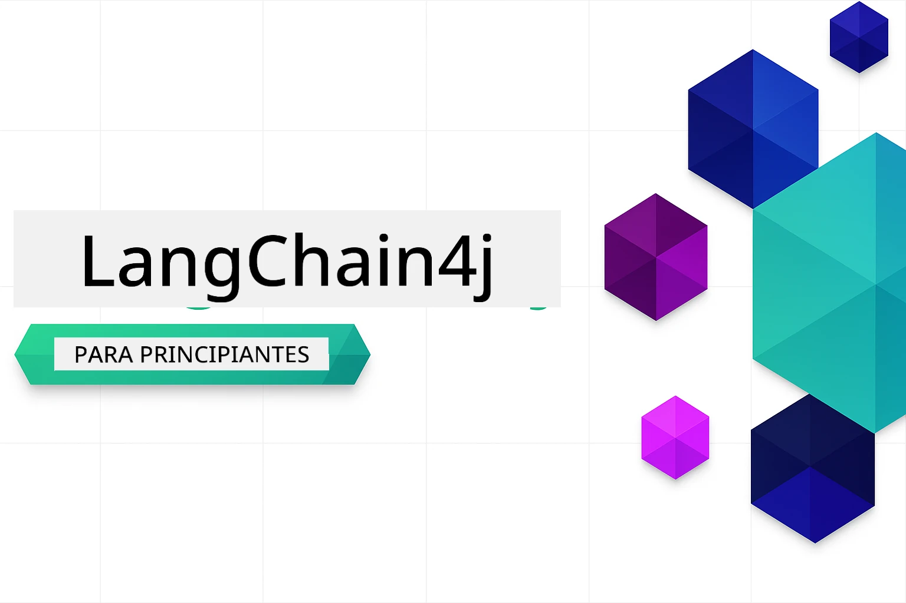

# LangChain4j para Iniciantes

Um curso para construir aplicações de IA com LangChain4j e Azure OpenAI GPT-5.2, desde o chat básico até agentes de IA.

### 🌐 Suporte Multilíngue

#### Suportado via GitHub Action (Automatizado e Sempre Atualizado)

<!-- CO-OP TRANSLATOR LANGUAGES TABLE START -->
[Árabe](../ar/README.md) | [Bengali](../bn/README.md) | [Búlgaro](../bg/README.md) | [Birmanês (Myanmar)](../my/README.md) | [Chinês (Simplificado)](../zh-CN/README.md) | [Chinês (Tradicional, Hong Kong)](../zh-HK/README.md) | [Chinês (Tradicional, Macau)](../zh-MO/README.md) | [Chinês (Tradicional, Taiwan)](../zh-TW/README.md) | [Croata](../hr/README.md) | [Checo](../cs/README.md) | [Dinamarquês](../da/README.md) | [Holandês](../nl/README.md) | [Estónio](../et/README.md) | [Finlandês](../fi/README.md) | [Francês](../fr/README.md) | [Alemão](../de/README.md) | [Grego](../el/README.md) | [Hebraico](../he/README.md) | [Hindi](../hi/README.md) | [Húngaro](../hu/README.md) | [Indonésio](../id/README.md) | [Italiano](../it/README.md) | [Japonês](../ja/README.md) | [Kannada](../kn/README.md) | [Khmer](../km/README.md) | [Coreano](../ko/README.md) | [Lituano](../lt/README.md) | [Malaio](../ms/README.md) | [Malaiala](../ml/README.md) | [Marathi](../mr/README.md) | [Nepali](../ne/README.md) | [Pidgin Nigeriano](../pcm/README.md) | [Norueguês](../no/README.md) | [Persa (Farsi)](../fa/README.md) | [Polaco](../pl/README.md) | [Português (Brasil)](../pt-BR/README.md) | [Português (Portugal)](./README.md) | [Punjabi (Gurmukhi)](../pa/README.md) | [Romeno](../ro/README.md) | [Russo](../ru/README.md) | [Sérvio (Cirílico)](../sr/README.md) | [Eslovaco](../sk/README.md) | [Esloveno](../sl/README.md) | [Espanhol](../es/README.md) | [Suaíli](../sw/README.md) | [Sueco](../sv/README.md) | [Tagalo (Filipino)](../tl/README.md) | [Tamil](../ta/README.md) | [Telugu](../te/README.md) | [Tailandês](../th/README.md) | [Turco](../tr/README.md) | [Ucraniano](../uk/README.md) | [Urdu](../ur/README.md) | [Vietnamita](../vi/README.md)

> **Prefere Clonar Localmente?**
>
> Este repositório inclui traduções em mais de 50 idiomas, o que aumenta significativamente o tamanho do download. Para clonar sem as traduções, utilize o checkout esparso:
>
> **Bash / macOS / Linux:**
> ```bash
> git clone --filter=blob:none --sparse https://github.com/microsoft/LangChain4j-for-Beginners.git
> cd LangChain4j-for-Beginners
> git sparse-checkout set --no-cone '/*' '!translations' '!translated_images'
> ```
>
> **CMD (Windows):**
> ```cmd
> git clone --filter=blob:none --sparse https://github.com/microsoft/LangChain4j-for-Beginners.git
> cd LangChain4j-for-Beginners
> git sparse-checkout set --no-cone "/*" "!translations" "!translated_images"
> ```
>
> Isto fornece tudo o que precisa para completar o curso com um download muito mais rápido.
<!-- CO-OP TRANSLATOR LANGUAGES TABLE END -->

## Índice

1. [Introdução](01-introduction/README.md) - Aprenda os fundamentos do LangChain4j
2. [Engenharia de Prompt](02-prompt-engineering/README.md) - Domine o design eficaz de prompts
3. [RAG (Geração Aumentada por Recuperação)](03-rag/README.md) - Construa sistemas inteligentes baseados em conhecimento
4. [Ferramentas](04-tools/README.md) - Integre ferramentas externas e assistentes simples
5. [MCP (Protocolo de Contexto de Modelo)](05-mcp/README.md) - Trabalhe com o Protocolo de Contexto do Modelo (MCP) e módulos Agentic

### Vídeos Demonstrativos

Cada módulo tem uma sessão ao vivo acompanhante onde percorremos os conceitos e código passo a passo.

| Módulo | Vídeo |
|--------|-------|
| 01 - Introdução | [Começando com LangChain4j](https://www.youtube.com/live/nl_troDm8rQ) |
| 02 - Engenharia de Prompt | [Engenharia de Prompt com LangChain4j](https://www.youtube.com/live/PJ6aBaE6bog) |
| 03 - RAG | [RAG com LangChain4j](https://www.youtube.com/watch?v=_olq75ZH_eY) |
| 04 - Ferramentas & 05 - MCP | [Agentes de IA com Ferramentas e MCP](https://www.youtube.com/watch?v=O_J30kZc0rw) |

---

## Caminho de Aprendizagem

**Novo no LangChain4j?** Consulte o [Glossário](docs/GLOSSARY.md) para definições dos termos e conceitos principais.

> **Início Rápido**

1. Faça fork deste repositório para sua conta GitHub
2. Clique em **Code** → aba **Codespaces** → **...** → **Novo com opções...**
3. Use as opções padrão – isto selecionará o contentor de desenvolvimento criado para este curso
4. Clique em **Create codespace**
5. Aguarde 5-10 minutos para o ambiente ficar pronto
6. Vá diretamente para [Introdução](./01-introduction/README.md) para começar!

Após concluir os módulos, explore o [Guia de Testes](docs/TESTING.md) para ver conceitos de teste do LangChain4j em ação.

> **Nota:** Este treino usa Azure OpenAI. Comece com uma [conta GRATUITA Azure](https://aka.ms/azure-free-account) se ainda não tiver uma.


## Aprender com GitHub Copilot

Para começar a programar rapidamente, abra este projeto num GitHub Codespace ou na sua IDE local com o devcontainer fornecido. O devcontainer usado neste curso vem pré-configurado com GitHub Copilot para programação assistida por IA.

Cada exemplo de código inclui perguntas sugeridas que pode fazer ao GitHub Copilot para aprofundar a sua compreensão. Procure os prompts 💡/🤖 em:

- **Cabeçalhos de ficheiros Java** - Perguntas específicas para cada exemplo
- **README dos módulos** - Prompts para exploração após exemplos de código

**Como usar:** Abra qualquer ficheiro de código e faça ao Copilot as perguntas sugeridas. Ele tem o contexto completo do código e pode explicar, expandir e sugerir alternativas.

Quer saber mais? Veja [Copilot para Programação Assistida por IA](https://aka.ms/GitHubCopilotAI).


## Recursos Adicionais

<!-- CO-OP TRANSLATOR OTHER COURSES START -->
### LangChain
[](https://aka.ms/langchain4j-for-beginners)
[](https://aka.ms/langchainjs-for-beginners?WT.mc_id=m365-94501-dwahlin)
[](https://github.com/microsoft/langchain-for-beginners?WT.mc_id=m365-94501-dwahlin)
---

### Azure / Edge / MCP / Agentes
[](https://github.com/microsoft/AZD-for-beginners?WT.mc_id=academic-105485-koreyst)
[](https://github.com/microsoft/edgeai-for-beginners?WT.mc_id=academic-105485-koreyst)
[](https://github.com/microsoft/mcp-for-beginners?WT.mc_id=academic-105485-koreyst)
[](https://github.com/microsoft/ai-agents-for-beginners?WT.mc_id=academic-105485-koreyst)

---
 
### Série de IA Generativa
[](https://github.com/microsoft/generative-ai-for-beginners?WT.mc_id=academic-105485-koreyst)
[-9333EA?style=for-the-badge&labelColor=E5E7EB&color=9333EA)](https://github.com/microsoft/Generative-AI-for-beginners-dotnet?WT.mc_id=academic-105485-koreyst)
[-C084FC?style=for-the-badge&labelColor=E5E7EB&color=C084FC)](https://github.com/microsoft/generative-ai-for-beginners-java?WT.mc_id=academic-105485-koreyst)
[-E879F9?style=for-the-badge&labelColor=E5E7EB&color=E879F9)](https://github.com/microsoft/generative-ai-with-javascript?WT.mc_id=academic-105485-koreyst)

---
 
### Aprendizagem Core
[](https://aka.ms/ml-beginners?WT.mc_id=academic-105485-koreyst)
[](https://aka.ms/datascience-beginners?WT.mc_id=academic-105485-koreyst)
[](https://aka.ms/ai-beginners?WT.mc_id=academic-105485-koreyst)
[](https://github.com/microsoft/Security-101?WT.mc_id=academic-96948-sayoung)

[](https://aka.ms/webdev-beginners?WT.mc_id=academic-105485-koreyst)
[](https://aka.ms/iot-beginners?WT.mc_id=academic-105485-koreyst)
[](https://github.com/microsoft/xr-development-for-beginners?WT.mc_id=academic-105485-koreyst)

---
 
### Série Copilot
[](https://aka.ms/GitHubCopilotAI?WT.mc_id=academic-105485-koreyst)
[](https://github.com/microsoft/mastering-github-copilot-for-dotnet-csharp-developers?WT.mc_id=academic-105485-koreyst)
[](https://github.com/microsoft/CopilotAdventures?WT.mc_id=academic-105485-koreyst)
<!-- CO-OP TRANSLATOR OTHER COURSES END -->

## Obter Ajuda

Se ficar bloqueado ou tiver alguma pergunta sobre como criar aplicações de IA, junte-se a:

[](https://aka.ms/foundry/discord)

Se tiver feedback sobre o produto ou erros enquanto constrói, visite:

[](https://aka.ms/foundry/forum)

## Licença

Licença MIT - Veja o ficheiro [LICENSE](../../LICENSE) para mais detalhes.

---

<!-- CO-OP TRANSLATOR DISCLAIMER START -->
**Aviso Legal**:
Este documento foi traduzido utilizando o serviço de tradução automática [Co-op Translator](https://github.com/Azure/co-op-translator). Embora nos esforcemos pela precisão, esteja ciente de que traduções automáticas podem conter erros ou imprecisões. O documento original na sua língua nativa deve ser considerado a fonte autorizada. Para informações críticas, recomenda-se tradução profissional humana. Não nos responsabilizamos por quaisquer mal-entendidos ou interpretações incorretas resultantes da utilização desta tradução.
<!-- CO-OP TRANSLATOR DISCLAIMER END -->