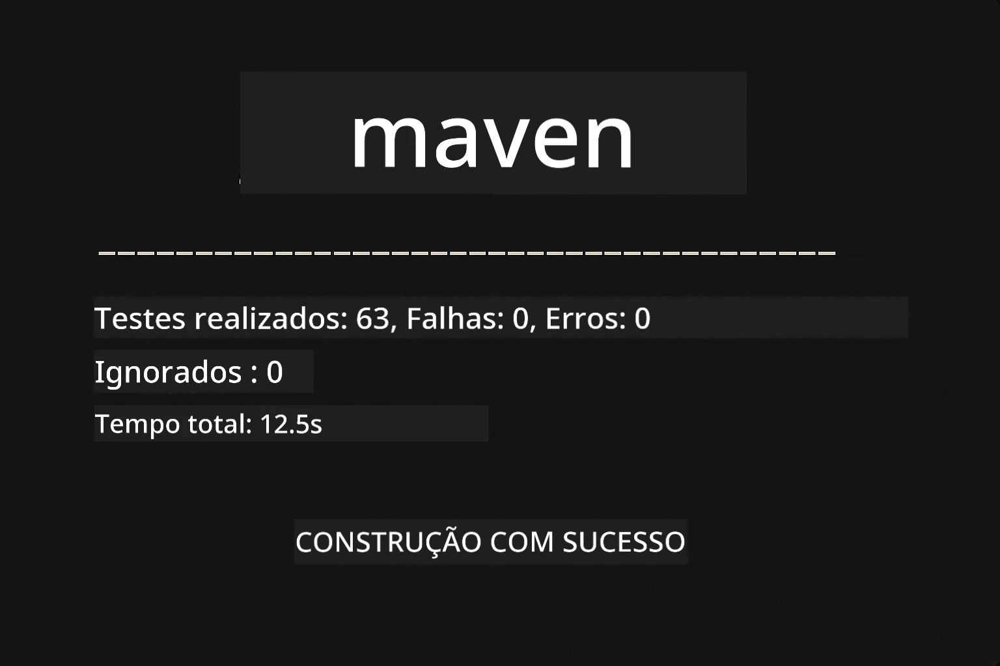
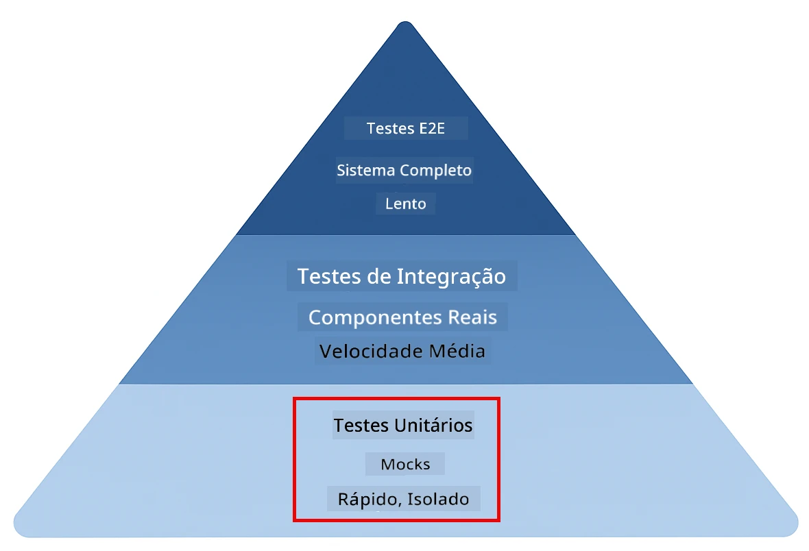
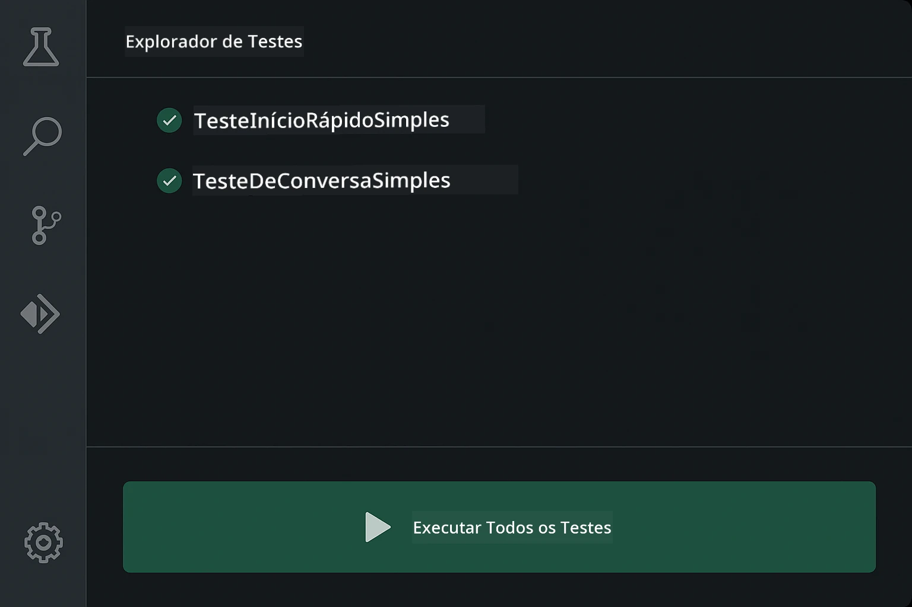
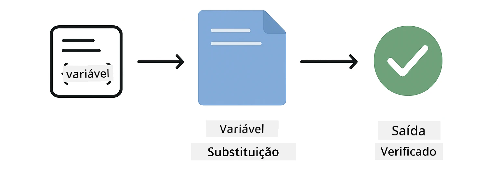
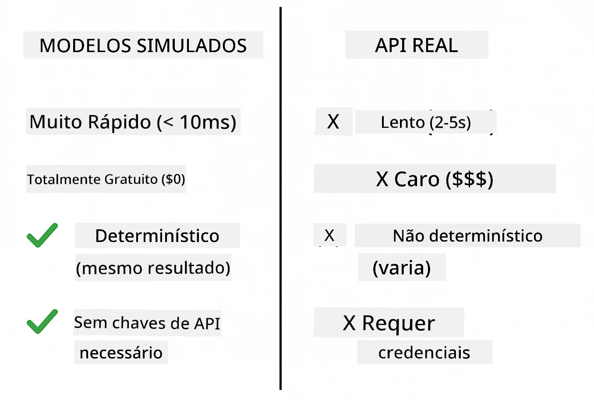
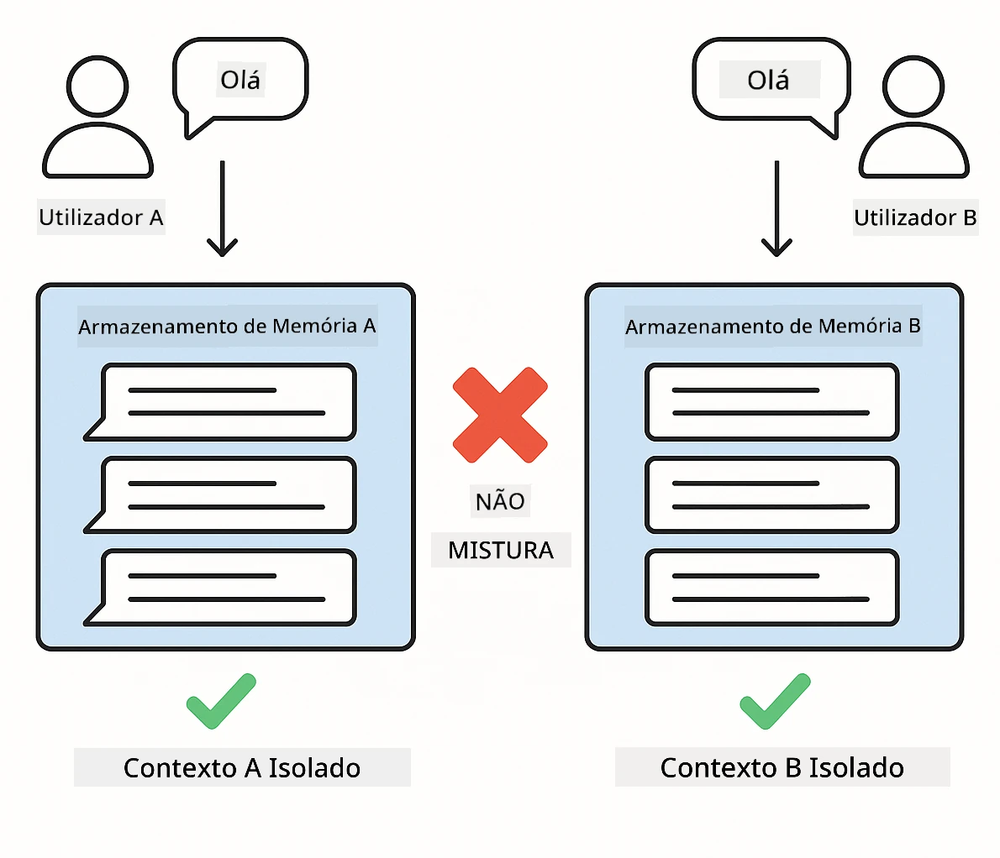
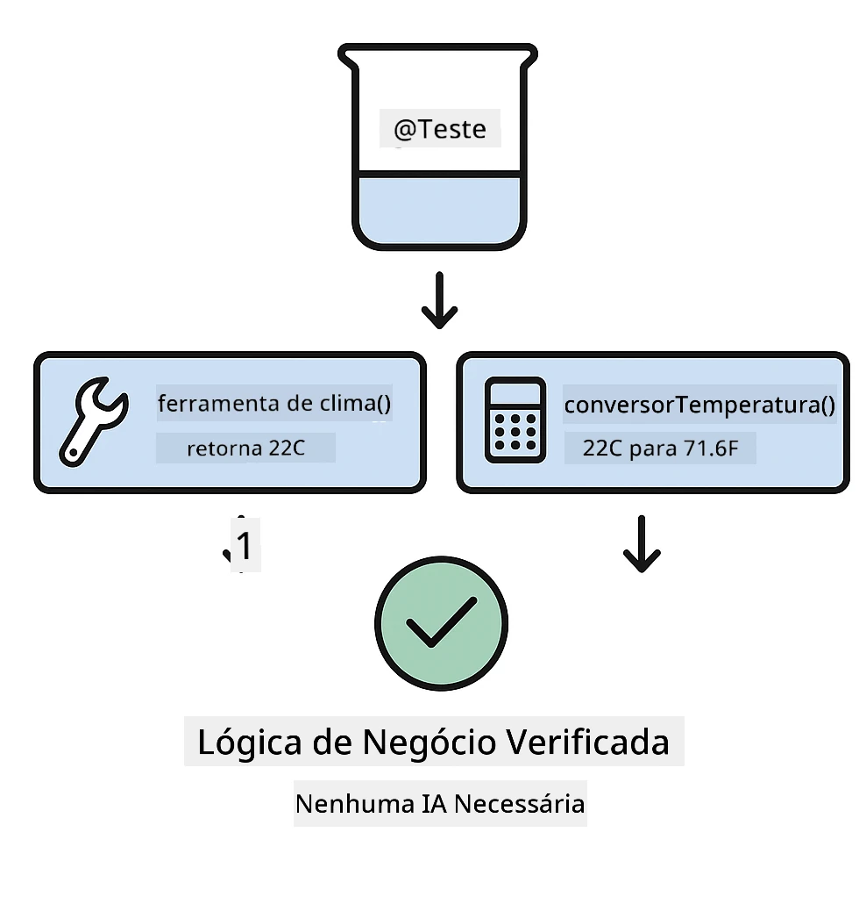

# Testar aplicações LangChain4j

## Índice

- [Início Rápido](#inicio-rápido)
- [O Que os Testes Abrangem](#o-que-os-testes-abrangem)
- [Executar os Testes](#executar-os-testes)
- [Executar Testes no VS Code](#executar-testes-no-vs-code)
- [Padrões de Teste](#padrões-de-teste)
- [Filosofia de Teste](#filosofia-de-teste)
- [Próximos Passos](#próximos-passos)

Este guia orienta-o através dos testes que demonstram como testar aplicações de IA sem necessitar de chaves de API ou serviços externos.

## Início Rápido

Execute todos os testes com um único comando:

**Bash:**
```bash
mvn test
```

**PowerShell:**
```powershell
mvn --% test
```

Quando todos os testes passarem, deverá ver saída semelhante à captura de ecrã abaixo — testes executados sem falhas.



*Execução bem-sucedida do teste mostrando todos os testes a passar sem falhas*

## O Que os Testes Abrangem

Este curso foca-se em **testes unitários** que são executados localmente. Cada teste demonstra um conceito específico do LangChain4j isoladamente. A pirâmide de testes abaixo mostra onde os testes unitários se encaixam — formam a base rápida e fiável sobre a qual o restante da sua estratégia de testes se constrói.



*Pirâmide de testes mostrando o equilíbrio entre testes unitários (rápidos, isolados), testes de integração (componentes reais) e testes end-to-end. Este curso aborda testes unitários.*

| Módulo | Testes | Foco | Ficheiros Principais |
|--------|-------|-------|-----------|
| **01 - Introdução** | 8 | Memória de conversa e chat com estado | `SimpleConversationTest.java` |
| **02 - Engenharia de Prompt** | 12 | Padrões GPT-5.2, níveis de prontidão, saída estruturada | `SimpleGpt5PromptTest.java` |
| **03 - RAG** | 10 | Ingestão de documentos, embeddings, pesquisa por similaridade | `DocumentServiceTest.java` |
| **04 - Ferramentas** | 12 | Chamada de funções e encadeamento de ferramentas | `SimpleToolsTest.java` |
| **05 - MCP** | 8 | Protocolo de Contexto de Modelo com transporte Stdio | `SimpleMcpTest.java` |

## Executar os Testes

**Executar todos os testes a partir da raiz:**

**Bash:**
```bash
mvn test
```

**PowerShell:**
```powershell
mvn --% test
```

**Executar testes para um módulo específico:**

**Bash:**
```bash
cd 01-introduction && mvn test
# Ou a partir da raiz
mvn test -pl 01-introduction
```

**PowerShell:**
```powershell
cd 01-introduction; mvn --% test
# Ou a partir da raiz
mvn --% test -pl 01-introduction
```

**Executar uma única classe de teste:**

**Bash:**
```bash
mvn test -Dtest=SimpleConversationTest
```

**PowerShell:**
```powershell
mvn --% test -Dtest=SimpleConversationTest
```

**Executar um método de teste específico:**

**Bash:**
```bash
mvn test -Dtest=SimpleConversationTest#deveManterHistoricoDeConversacao
```

**PowerShell:**
```powershell
mvn --% test -Dtest=SimpleConversationTest#deveManterHistoricoDaConversa
```

## Executar Testes no VS Code

Se estiver a usar o Visual Studio Code, o Test Explorer oferece uma interface gráfica para executar e depurar testes.



*Test Explorer do VS Code mostrando a árvore de testes com todas as classes de teste Java e métodos de teste individuais*

**Para executar testes no VS Code:**

1. Abra o Test Explorer clicando no ícone de béquer na Barra de Atividades
2. Expanda a árvore de testes para ver todos os módulos e classes de testes
3. Clique no botão de reprodução ao lado de qualquer teste para o executar individualmente
4. Clique em "Run All Tests" para executar todo o conjunto
5. Clique com o botão direito em qualquer teste e selecione "Debug Test" para definir pontos de interrupção e avançar no código

O Test Explorer mostra sinais verdes de verificação para testes que passam e fornece mensagens detalhadas de falha quando os testes falham.

## Padrões de Teste

### Padrão 1: Testar Templates de Prompt

O padrão mais simples testa templates de prompt sem chamar qualquer modelo de IA. Verifica-se que a substituição de variáveis funciona corretamente e que os prompts são formatados como esperado.



*Testar templates de prompt mostrando o fluxo da substituição de variáveis: template com marcadores → valores aplicados → saída formatada verificada*

```java
@Test
@DisplayName("Should format prompt template with variables")
void testPromptTemplateFormatting() {
    PromptTemplate template = PromptTemplate.from(
        "Best time to visit {{destination}} for {{activity}}?"
    );
    
    Prompt prompt = template.apply(Map.of(
        "destination", "Paris",
        "activity", "sightseeing"
    ));
    
    assertThat(prompt.text()).isEqualTo("Best time to visit Paris for sightseeing?");
}
```

Este padrão verifica que a substituição de variáveis funciona corretamente e que os prompts são formatados como esperado — não é necessária chave de API nem chamada a modelo.

### Padrão 2: Simular Modelos de Linguagem

Ao testar a lógica de conversação, use Mockito para criar modelos falsos que retornam respostas pré-determinadas. Isto torna os testes rápidos, gratuitos e determinísticos.



*Comparação mostrando por que os mocks são preferidos para testes: são rápidos, gratuitos, determinísticos e não requerem chaves de API*

```java
@ExtendWith(MockitoExtension.class)
class SimpleConversationTest {
    
    private ConversationService conversationService;
    
    @Mock
    private OpenAiOfficialChatModel mockChatModel;
    
    @BeforeEach
    void setUp() {
        ChatResponse mockResponse = ChatResponse.builder()
            .aiMessage(AiMessage.from("This is a test response"))
            .build();
        when(mockChatModel.chat(anyList())).thenReturn(mockResponse);
        
        conversationService = new ConversationService(mockChatModel);
    }
    
    @Test
    void shouldMaintainConversationHistory() {
        String conversationId = conversationService.startConversation();
        
        ChatResponse mockResponse1 = ChatResponse.builder()
            .aiMessage(AiMessage.from("Response 1"))
            .build();
        ChatResponse mockResponse2 = ChatResponse.builder()
            .aiMessage(AiMessage.from("Response 2"))
            .build();
        ChatResponse mockResponse3 = ChatResponse.builder()
            .aiMessage(AiMessage.from("Response 3"))
            .build();
        
        when(mockChatModel.chat(anyList()))
            .thenReturn(mockResponse1)
            .thenReturn(mockResponse2)
            .thenReturn(mockResponse3);

        conversationService.chat(conversationId, "First message");
        conversationService.chat(conversationId, "Second message");
        conversationService.chat(conversationId, "Third message");

        List<ChatMessage> history = conversationService.getHistory(conversationId);
        assertThat(history).hasSize(6); // 3 mensagens do utilizador + 3 mensagens de IA
    }
}
```

Este padrão aparece em `01-introduction/src/test/java/com/example/langchain4j/service/SimpleConversationTest.java`. O mock garante comportamento consistente para que possa verificar que a gestão da memória funciona corretamente.

### Padrão 3: Testar Isolamento de Conversação

A memória da conversação deve manter usuários múltiplos separados. Este teste verifica que as conversas não misturam contextos.



*Testar isolamento da conversação mostrando memórias separadas para diferentes utilizadores para evitar mistura de contextos*

```java
@Test
void shouldIsolateConversationsByid() {
    String conv1 = conversationService.startConversation();
    String conv2 = conversationService.startConversation();
    
    ChatResponse mockResponse = ChatResponse.builder()
        .aiMessage(AiMessage.from("Response"))
        .build();
    when(mockChatModel.chat(anyList())).thenReturn(mockResponse);

    conversationService.chat(conv1, "Message for conversation 1");
    conversationService.chat(conv2, "Message for conversation 2");

    List<ChatMessage> history1 = conversationService.getHistory(conv1);
    List<ChatMessage> history2 = conversationService.getHistory(conv2);
    
    assertThat(history1).hasSize(2);
    assertThat(history2).hasSize(2);
}
```

Cada conversação mantém o seu próprio histórico independente. Em sistemas de produção, este isolamento é crítico para aplicações multi-utilizador.

### Padrão 4: Testar Ferramentas Independentemente

As ferramentas são funções que a IA pode chamar. Teste-as diretamente para garantir que funcionam corretamente independentemente das decisões da IA.



*Testar ferramentas independentemente mostrando execução simulada sem chamadas à IA para verificar a lógica do negócio*

```java
@Test
void shouldConvertCelsiusToFahrenheit() {
    TemperatureTool tempTool = new TemperatureTool();
    String result = tempTool.celsiusToFahrenheit(25.0);
    assertThat(result).containsPattern("77[.,]0°F");
}

@Test
void shouldDemonstrateToolChaining() {
    WeatherTool weatherTool = new WeatherTool();
    TemperatureTool tempTool = new TemperatureTool();

    String weatherResult = weatherTool.getCurrentWeather("Seattle");
    assertThat(weatherResult).containsPattern("\\d+°C");

    String conversionResult = tempTool.celsiusToFahrenheit(22.0);
    assertThat(conversionResult).containsPattern("71[.,]6°F");
}
```

Estes testes de `04-tools/src/test/java/com/example/langchain4j/agents/tools/SimpleToolsTest.java` validam a lógica das ferramentas sem envolvimento da IA. O exemplo de encadeamento mostra como a saída de uma ferramenta serve de entrada para outra.

### Padrão 5: Testar RAG em Memória

Sistemas RAG normalmente requerem bases de dados vetoriais e serviços de embedding. O padrão em memória permite testar toda a pipeline sem dependências externas.


*Fluxo de trabalho de teste RAG em memória mostrando análise de documentos, armazenamento de embeddings e pesquisa por similaridade sem necessidade de base de dados*

```java
@Test
void testProcessTextDocument() {
    String content = "This is a test document.\nIt has multiple lines.";
    InputStream inputStream = new ByteArrayInputStream(content.getBytes(StandardCharsets.UTF_8));
    
    DocumentService.ProcessedDocument result = 
        documentService.processDocument(inputStream, "test.txt");

    assertNotNull(result);
    assertTrue(result.segments().size() > 0);
    assertEquals("test.txt", result.segments().get(0).metadata().getString("filename"));
}
```

Este teste de `03-rag/src/test/java/com/example/langchain4j/rag/service/DocumentServiceTest.java` cria um documento em memória e verifica segmentação e manipulação de metadados.

### Padrão 6: Testar Integração MCP

O módulo MCP testa a integração do Protocolo de Contexto de Modelo usando transporte stdio. Estes testes verificam que a sua aplicação pode gerar e comunicar com servidores MCP como subprocessos.

Os testes em `05-mcp/src/test/java/com/example/langchain4j/mcp/SimpleMcpTest.java` validam o comportamento do cliente MCP.

**Execute-os:**

**Bash:**
```bash
cd 05-mcp && mvn test
```

**PowerShell:**
```powershell
cd 05-mcp; mvn --% test
```

## Filosofia de Teste

Teste o seu código, não a IA. Os seus testes devem validar o código que escreve verificando como os prompts são construídos, como a memória é gerida e como as ferramentas executam. As respostas da IA variam e não devem fazer parte das assertivas dos testes. Pergunte-se se o seu template de prompt substitui corretamente as variáveis, não se a IA dá a resposta certa.

Use mocks para modelos de linguagem. São dependências externas lentas, dispendiosas e não determinísticas. Simular torna os testes rápidos em milissegundos em vez de segundos, gratuitos sem custos de API, e determinísticos com o mesmo resultado sempre.

Mantenha os testes independentes. Cada teste deve configurar os seus próprios dados, não depender de outros testes e limpar após si próprio. Os testes devem passar independentemente da ordem de execução.

Teste casos extremos além do caminho feliz. Experimente entradas vazias, entradas muito grandes, caracteres especiais, parâmetros inválidos e condições limite. Estes frequentemente revelam bugs que o uso normal não expõe.

Use nomes descritivos. Compare `shouldMaintainConversationHistoryAcrossMultipleMessages()` com `test1()`. O primeiro diz exatamente o que está a ser testado, tornando mais fácil depurar falhas.

## Próximos Passos

Agora que entende os padrões de teste, aprofunde-se em cada módulo:

- **[01 - Introdução](../01-introduction/README.md)** - Aprenda gestão de memória de conversação
- **[02 - Engenharia de Prompt](../02/prompt-engineering/README.md)** - Domine padrões de prompting GPT-5.2
- **[03 - RAG](../03-rag/README.md)** - Construa sistemas de geração aumentada por recuperação
- **[04 - Ferramentas](../04-tools/README.md)** - Implemente chamadas de funções e cadeias de ferramentas
- **[05 - MCP](../05-mcp/README.md)** - Integre o Protocolo de Contexto de Modelo

O README de cada módulo fornece explicações detalhadas dos conceitos aqui testados.

---

**Navegação:** [← Voltar ao Principal](../README.md)

---

<!-- CO-OP TRANSLATOR DISCLAIMER START -->
**Aviso Legal**:
Este documento foi traduzido utilizando o serviço de tradução automática [Co-op Translator](https://github.com/Azure/co-op-translator). Embora nos esforcemos pela precisão, esteja ciente de que traduções automáticas podem conter erros ou imprecisões. O documento original na sua língua nativa deve ser considerado a fonte autorizada. Para informações críticas, recomenda-se tradução profissional humana. Não nos responsabilizamos por quaisquer mal-entendidos ou interpretações incorretas resultantes da utilização desta tradução.
<!-- CO-OP TRANSLATOR DISCLAIMER END -->