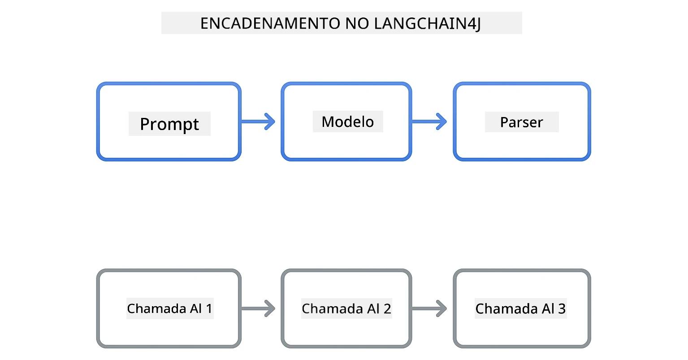

<!--
CO_OP_TRANSLATOR_METADATA:
{
  "original_hash": "22b5d7c8d7585325e38b37fd29eafe25",
  "translation_date": "2026-01-05T22:57:28+00:00",
  "source_file": "00-quick-start/README.md",
  "language_code": "pt"
}
-->
# Module 00: Início Rápido

## Índice

- [Introdução](../../../00-quick-start)
- [O que é LangChain4j?](../../../00-quick-start)
- [Dependências do LangChain4j](../../../00-quick-start)
- [Pré-requisitos](../../../00-quick-start)
- [Configuração](../../../00-quick-start)
  - [1. Obtenha o seu Token do GitHub](../../../00-quick-start)
  - [2. Defina o seu Token](../../../00-quick-start)
- [Executar os Exemplos](../../../00-quick-start)
  - [1. Chat Básico](../../../00-quick-start)
  - [2. Padrões de Prompt](../../../00-quick-start)
  - [3. Chamada de Função](../../../00-quick-start)
  - [4. Perguntas e Respostas de Documento (RAG)](../../../00-quick-start)
  - [5. IA Responsável](../../../00-quick-start)
- [O que Cada Exemplo Mostra](../../../00-quick-start)
- [Próximos Passos](../../../00-quick-start)
- [Resolução de Problemas](../../../00-quick-start)

## Introdução

Este início rápido destina-se a pô-lo a funcionar com LangChain4j o mais rapidamente possível. Cobre o básico absoluto de construir aplicações de IA com LangChain4j e Modelos do GitHub. Nos próximos módulos, usará o Azure OpenAI com LangChain4j para construir aplicações mais avançadas.

## O que é LangChain4j?

LangChain4j é uma biblioteca Java que simplifica a construção de aplicações alimentadas por IA. Em vez de lidar com clientes HTTP e análise JSON, trabalha com APIs Java limpas.

A "cadeia" em LangChain refere-se a encadear múltiplos componentes - pode encadear um prompt a um modelo, a um parser, ou encadear múltiplas chamadas de IA onde uma saída alimenta a próxima entrada. Este início rápido foca nos fundamentos antes de explorar cadeias mais complexas.



*Encadeamento de componentes em LangChain4j - os blocos de construção conectam-se para criar fluxos de trabalho poderosos de IA*

Vamos usar três componentes principais:

**ChatLanguageModel** - Interface para interações com modelos de IA. Chame `model.chat("prompt")` e obtenha uma string de resposta. Utilizamos `OpenAiOfficialChatModel` que funciona com endpoints compatíveis com OpenAI, como Modelos do GitHub.

**AiServices** - Cria interfaces de serviço de IA tipadas. Defina métodos, anote-os com `@Tool` e o LangChain4j gere a orquestração. A IA chama automaticamente os seus métodos Java quando necessário.

**MessageWindowChatMemory** - Mantém o histórico da conversa. Sem isto, cada pedido é independente. Com isto, a IA lembra mensagens anteriores e mantém contexto ao longo de múltiplas interações.


*Arquitetura LangChain4j - componentes principais a trabalhar juntos para alimentar as suas aplicações de IA*

## Dependências do LangChain4j

Este início rápido usa duas dependências Maven no [`pom.xml`](../../../00-quick-start/pom.xml):

```xml
<!-- Core LangChain4j library -->
<dependency>
    <groupId>dev.langchain4j</groupId>
    <artifactId>langchain4j</artifactId> <!-- Inherited from BOM in root pom.xml -->
</dependency>

<!-- OpenAI integration (works with GitHub Models) -->
<dependency>
    <groupId>dev.langchain4j</groupId>
    <artifactId>langchain4j-open-ai-official</artifactId> <!-- Inherited from BOM in root pom.xml -->
</dependency>
```

O módulo `langchain4j-open-ai-official` fornece a classe `OpenAiOfficialChatModel` que conecta com APIs compatíveis com OpenAI. Os Modelos do GitHub usam o mesmo formato de API, por isso não é necessário um adaptador especial - basta apontar a URL base para `https://models.github.ai/inference`.

## Pré-requisitos

**A usar o Dev Container?** Java e Maven já estão instalados. Só precisa de um Token de Acesso Pessoal do GitHub.

**Desenvolvimento Local:**
- Java 21+, Maven 3.9+
- Token de Acesso Pessoal do GitHub (instruções abaixo)

> **Nota:** Este módulo usa `gpt-4.1-nano` dos Modelos GitHub. Não modifique o nome do modelo no código - está configurado para funcionar com os modelos disponíveis do GitHub.

## Configuração

### 1. Obtenha o seu Token do GitHub

1. Vá a [Definições do GitHub → Tokens de Acesso Pessoal](https://github.com/settings/personal-access-tokens)
2. Clique em "Gerar novo token"
3. Defina um nome descritivo (ex.: "Demonstração LangChain4j")
4. Defina o prazo de validade (7 dias recomendado)
5. Em "Permissões da Conta", encontre "Models" e defina para "Só leitura"
6. Clique em "Gerar token"
7. Copie e guarde o seu token - não o verá novamente

### 2. Defina o seu Token

**Opção 1: Usar VS Code (Recomendado)**

Se usar VS Code, adicione o seu token no ficheiro `.env` na raiz do projeto:

Se o ficheiro `.env` não existir, copie `.env.example` para `.env` ou crie um novo ficheiro `.env` na raiz do projeto.

**Exemplo de ficheiro `.env`:**
```bash
# Em /workspaces/LangChain4j-for-Beginners/.env
GITHUB_TOKEN=your_token_here
```

Depois, pode simplesmente clicar com o botão direito em qualquer ficheiro de demo (ex.: `BasicChatDemo.java`) no Explorador e selecionar **"Run Java"** ou usar as configurações de lançamento no painel Executar e Depurar.

**Opção 2: Usar Terminal**

Defina o token como variável de ambiente:

**Bash:**
```bash
export GITHUB_TOKEN=your_token_here
```

**PowerShell:**
```powershell
$env:GITHUB_TOKEN=your_token_here
```

## Executar os Exemplos

**Usando VS Code:** Clique com o botão direito em qualquer ficheiro de demo no Explorador e selecione **"Run Java"**, ou use as configurações de lançamento no painel Executar e Depurar (certifique-se de ter adicionado o seu token ao ficheiro `.env` primeiro).

**Usando Maven:** Alternativamente, pode executar a partir da linha de comandos:

### 1. Chat Básico

**Bash:**
```bash
mvn compile exec:java -Dexec.mainClass=com.example.langchain4j.quickstart.BasicChatDemo
```

**PowerShell:**
```powershell
mvn --% compile exec:java -Dexec.mainClass=com.example.langchain4j.quickstart.BasicChatDemo
```

### 2. Padrões de Prompt

**Bash:**
```bash
mvn compile exec:java -Dexec.mainClass=com.example.langchain4j.quickstart.PromptEngineeringDemo
```

**PowerShell:**
```powershell
mvn --% compile exec:java -Dexec.mainClass=com.example.langchain4j.quickstart.PromptEngineeringDemo
```

Mostra prompting zero-shot, few-shot, em cadeia de pensamento e baseado em papéis.

### 3. Chamada de Função

**Bash:**
```bash
mvn compile exec:java -Dexec.mainClass=com.example.langchain4j.quickstart.ToolIntegrationDemo
```

**PowerShell:**
```powershell
mvn --% compile exec:java -Dexec.mainClass=com.example.langchain4j.quickstart.ToolIntegrationDemo
```

A IA chama automaticamente os seus métodos Java quando necessário.

### 4. Perguntas e Respostas de Documento (RAG)

**Bash:**
```bash
mvn compile exec:java -Dexec.mainClass=com.example.langchain4j.quickstart.SimpleReaderDemo
```

**PowerShell:**
```powershell
mvn --% compile exec:java -Dexec.mainClass=com.example.langchain4j.quickstart.SimpleReaderDemo
```

Faça perguntas sobre o conteúdo de `document.txt`.

### 5. IA Responsável

**Bash:**
```bash
mvn compile exec:java -Dexec.mainClass=com.example.langchain4j.quickstart.ResponsibleAIDemo
```

**PowerShell:**
```powershell
mvn --% compile exec:java -Dexec.mainClass=com.example.langchain4j.quickstart.ResponsibleAIDemo
```

Veja como os filtros de segurança IA bloqueiam conteúdo prejudicial.

## O que Cada Exemplo Mostra

**Chat Básico** - [BasicChatDemo.java](../../../00-quick-start/src/main/java/com/example/langchain4j/quickstart/BasicChatDemo.java)

Comece aqui para ver o LangChain4j na sua forma mais simples. Vai criar um `OpenAiOfficialChatModel`, enviar um prompt com `.chat()`, e receber uma resposta. Isto demonstra a base: como inicializar modelos com endpoints personalizados e chaves API. Uma vez que perceba este padrão, tudo o resto constrói-se a partir daqui.

```java
ChatLanguageModel model = OpenAiOfficialChatModel.builder()
    .baseUrl("https://models.github.ai/inference")
    .apiKey(System.getenv("GITHUB_TOKEN"))
    .modelName("gpt-4.1-nano")
    .build();

String response = model.chat("What is LangChain4j?");
System.out.println(response);
```

> **🤖 Experimente com [GitHub Copilot](https://github.com/features/copilot) Chat:** Abra [`BasicChatDemo.java`](../../../00-quick-start/src/main/java/com/example/langchain4j/quickstart/BasicChatDemo.java) e pergunte:
> - "Como mudaria dos Modelos GitHub para Azure OpenAI neste código?"
> - "Que outros parâmetros posso configurar em OpenAiOfficialChatModel.builder()?"
> - "Como adiciono respostas em streaming em vez de esperar pela resposta completa?"

**Engenharia de Prompt** - [PromptEngineeringDemo.java](../../../00-quick-start/src/main/java/com/example/langchain4j/quickstart/PromptEngineeringDemo.java)

Agora que sabe falar com um modelo, vamos explorar o que diz a ele. Esta demo usa a mesma configuração de modelo mas mostra quatro padrões diferentes de prompting. Experimente zero-shot para instruções diretas, few-shot que aprende com exemplos, cadeia de pensamento que revela passos de raciocínio, e prompts baseados em papéis que definem contexto. Vai ver como o mesmo modelo dá resultados dramaticamente diferentes consoante formula a sua solicitação.

```java
PromptTemplate template = PromptTemplate.from(
    "What's the best time to visit {{destination}} for {{activity}}?"
);

Prompt prompt = template.apply(Map.of(
    "destination", "Paris",
    "activity", "sightseeing"
));

String response = model.chat(prompt.text());
```

> **🤖 Experimente com [GitHub Copilot](https://github.com/features/copilot) Chat:** Abra [`PromptEngineeringDemo.java`](../../../00-quick-start/src/main/java/com/example/langchain4j/quickstart/PromptEngineeringDemo.java) e pergunte:
> - "Qual é a diferença entre prompting zero-shot e few-shot, e quando devo usar cada um?"
> - "Como o parâmetro temperatura afeta as respostas do modelo?"
> - "Quais são algumas técnicas para prevenir ataques de injeção de prompt em produção?"
> - "Como posso criar objetos PromptTemplate reutilizáveis para padrões comuns?"

**Integração de Ferramentas** - [ToolIntegrationDemo.java](../../../00-quick-start/src/main/java/com/example/langchain4j/quickstart/ToolIntegrationDemo.java)

É aqui que o LangChain4j se torna poderoso. Vai usar `AiServices` para criar um assistente de IA que pode chamar os seus métodos Java. Basta anotar métodos com `@Tool("descrição")` e o LangChain4j trata do resto - a IA decide automaticamente quando usar cada ferramenta com base no que o utilizador pede. Isto demonstra chamadas de função, uma técnica chave para construir IA que pode tomar ações, não apenas responder perguntas.

```java
@Tool("Performs addition of two numeric values")
public double add(double a, double b) {
    return a + b;
}

MathAssistant assistant = AiServices.create(MathAssistant.class, model);
String response = assistant.chat("What is 25 plus 17?");
```

> **🤖 Experimente com [GitHub Copilot](https://github.com/features/copilot) Chat:** Abra [`ToolIntegrationDemo.java`](../../../00-quick-start/src/main/java/com/example/langchain4j/quickstart/ToolIntegrationDemo.java) e pergunte:
> - "Como funciona a anotação @Tool e o que o LangChain4j faz com ela nos bastidores?"
> - "Pode a IA chamar várias ferramentas em sequência para resolver problemas complexos?"
> - "O que acontece se uma ferramenta lançar uma exceção - como devo tratar erros?"
> - "Como integraria uma API real em vez deste exemplo da calculadora?"

**Perguntas e Respostas de Documento (RAG)** - [SimpleReaderDemo.java](../../../00-quick-start/src/main/java/com/example/langchain4j/quickstart/SimpleReaderDemo.java)

Aqui verá a base do RAG (geração aumentada por recuperação). Em vez de depender dos dados de treino do modelo, carrega conteúdo de [`document.txt`](../../../00-quick-start/document.txt) e inclui no prompt. A IA responde com base no seu documento, não no conhecimento geral dela. Este é o primeiro passo para construir sistemas que podem trabalhar com os seus próprios dados.

```java
Document document = FileSystemDocumentLoader.loadDocument("document.txt");
String content = document.text();

String prompt = "Based on this document: " + content + 
                "\nQuestion: What is the main topic?";
String response = model.chat(prompt);
```

> **Nota:** Esta abordagem simples carrega o documento completo no prompt. Para ficheiros grandes (>10KB), ultrapassará os limites de contexto. O Módulo 03 cobre fragmentação e pesquisa vetorial para sistemas RAG em produção.

> **🤖 Experimente com [GitHub Copilot](https://github.com/features/copilot) Chat:** Abra [`SimpleReaderDemo.java`](../../../00-quick-start/src/main/java/com/example/langchain4j/quickstart/SimpleReaderDemo.java) e pergunte:
> - "Como o RAG previne alucinações da IA comparado com usar os dados de treino do modelo?"
> - "Qual é a diferença entre esta abordagem simples e usar embeddings vetoriais para recuperação?"
> - "Como escalar isto para lidar com múltiplos documentos ou bases de conhecimento maiores?"
> - "Quais são as melhores práticas para estruturar o prompt de modo a garantir que a IA usa apenas o contexto fornecido?"

**IA Responsável** - [ResponsibleAIDemo.java](../../../00-quick-start/src/main/java/com/example/langchain4j/quickstart/ResponsibleAIDemo.java)

Construa segurança em IA com defesa em profundidade. Esta demo mostra duas camadas de proteção a trabalhar em conjunto:

**Parte 1: Guard Rails de Entrada LangChain4j** - Bloqueia prompts perigosos antes de chegarem à LLM. Crie guard rails personalizados que verificam palavras-chave ou padrões proibidos. Estes correm no seu código, por isso são rápidos e gratuitos.

```java
class DangerousContentGuardrail implements InputGuardrail {
    @Override
    public InputGuardrailResult validate(UserMessage userMessage) {
        String text = userMessage.singleText().toLowerCase();
        if (text.contains("explosives")) {
            return fatal("Blocked: contains prohibited keyword");
        }
        return success();
    }
}
```

**Parte 2: Filtros de Segurança do Provedor** - Os Modelos GitHub têm filtros embutidos que apanham o que os seus guard rails possam falhar. Vai ver bloqueios rígidos (erros HTTP 400) para violações graves e recusas suaves onde a IA recusa educadamente.

> **🤖 Experimente com [GitHub Copilot](https://github.com/features/copilot) Chat:** Abra [`ResponsibleAIDemo.java`](../../../00-quick-start/src/main/java/com/example/langchain4j/quickstart/ResponsibleAIDemo.java) e pergunte:
> - "O que é InputGuardrail e como crio o meu próprio?"
> - "Qual é a diferença entre bloqueio rígido e recusa suave?"
> - "Por que usar guard rails e filtros do provedor juntos?"

## Próximos Passos

**Próximo Módulo:** [01-introdução - Começar com LangChain4j e gpt-5 no Azure](../01-introduction/README.md)

---

**Navegação:** [← Voltar ao Principal](../README.md) | [Próximo: Módulo 01 - Introdução →](../01-introduction/README.md)

---

## Resolução de Problemas

### Primeira Build Maven

**Problema**: `mvn clean compile` ou `mvn package` inicial demora muito (10-15 minutos)

**Causa**: O Maven precisa de descarregar todas as dependências do projeto (Spring Boot, bibliotecas LangChain4j, SDKs Azure, etc.) na primeira compilação.

**Solução**: É um comportamento normal. Compilações subsequentes serão muito mais rápidas porque as dependências ficam em cache localmente. O tempo de descarga depende da velocidade da sua rede.

### Sintaxe do Comando Maven no PowerShell

**Problema**: Comandos Maven falham com erro `Unknown lifecycle phase ".mainClass=..."`

**Causa**: PowerShell interpreta `=` como operador de atribuição de variável, quebrando a sintaxe da propriedade Maven
**Solução**: Use o operador de paragem de parsing `--%` antes do comando Maven:

**PowerShell:**
```powershell
mvn --% compile exec:java -Dexec.mainClass=com.example.langchain4j.quickstart.BasicChatDemo
```

**Bash:**
```bash
mvn compile exec:java -Dexec.mainClass=com.example.langchain4j.quickstart.BasicChatDemo
```

O operador `--%` diz ao PowerShell para passar todos os argumentos restantes literalmente para o Maven sem interpretação.

### Exibição de Emojis no Windows PowerShell

**Problema**: As respostas da IA mostram caracteres estranhos (ex.: `????` ou `â??`) em vez de emojis no PowerShell

**Causa**: A codificação padrão do PowerShell não suporta emojis UTF-8

**Solução**: Execute este comando antes de executar aplicações Java:
```cmd
chcp 65001
```

Isto força a codificação UTF-8 no terminal. Alternativamente, use o Windows Terminal que tem melhor suporte a Unicode.

### Depuração de Chamadas API

**Problema**: Erros de autenticação, limites de taxa ou respostas inesperadas do modelo de IA

**Solução**: Os exemplos incluem `.logRequests(true)` e `.logResponses(true)` para mostrar as chamadas API na consola. Isto ajuda a resolver erros de autenticação, limites de taxa ou respostas inesperadas. Remova estas flags na produção para reduzir o ruído dos logs.

---

<!-- CO-OP TRANSLATOR DISCLAIMER START -->
**Aviso Legal**:
Este documento foi traduzido utilizando o serviço de tradução por IA [Co-op Translator](https://github.com/Azure/co-op-translator). Embora nos esforcemos pela precisão, por favor, tenha em conta que traduções automáticas podem conter erros ou imprecisões. O documento original na sua língua nativa deve ser considerado a fonte autorizada. Para informações críticas, recomenda-se a tradução profissional humana. Não nos responsabilizamos por quaisquer mal-entendidos ou interpretações erradas decorrentes da utilização desta tradução.
<!-- CO-OP TRANSLATOR DISCLAIMER END -->