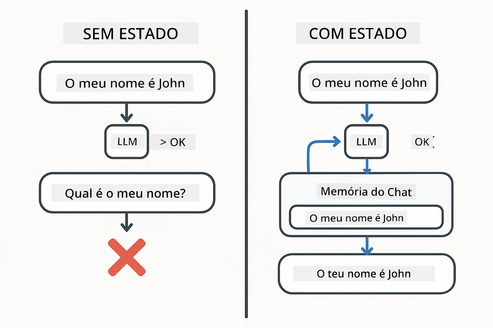
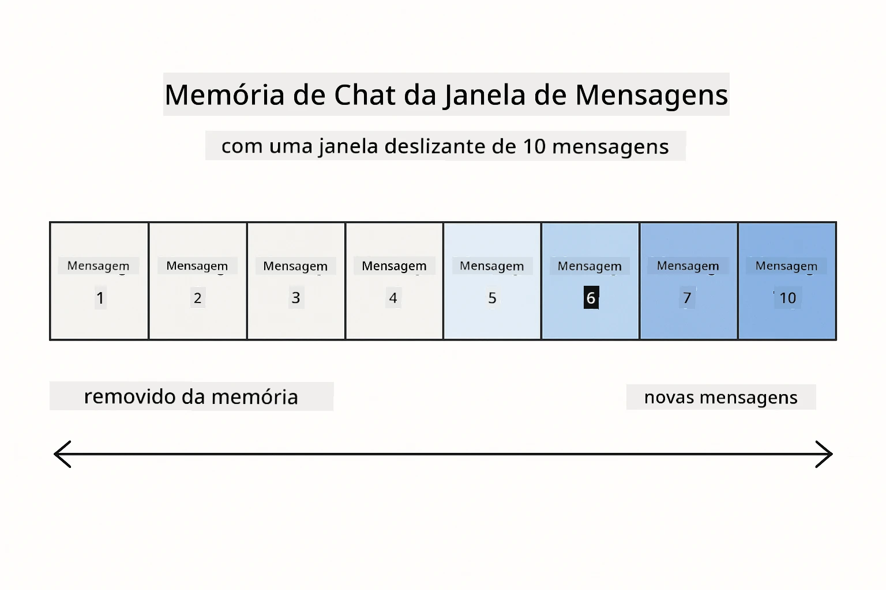
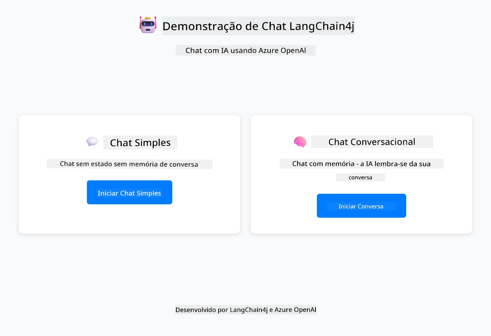
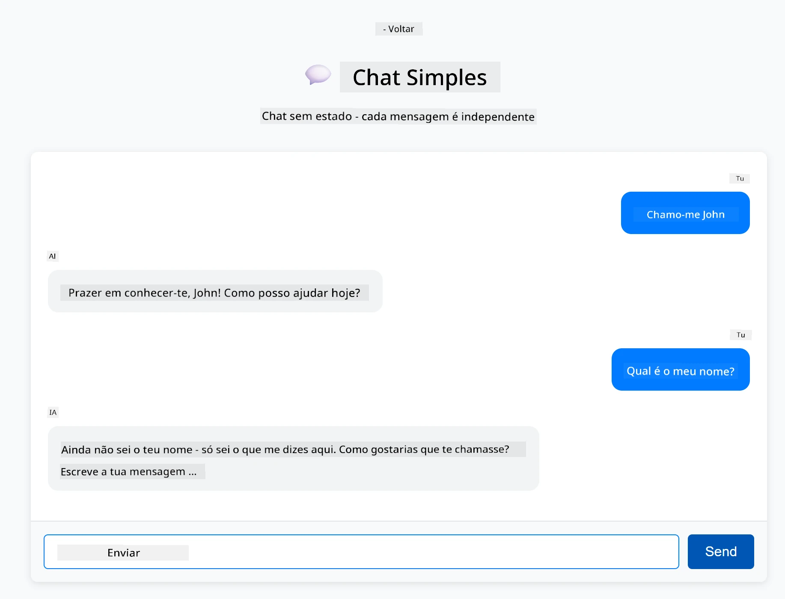

<!--
CO_OP_TRANSLATOR_METADATA:
{
  "original_hash": "c3e07ca58d0b8a3f47d3bf5728541e0a",
  "translation_date": "2025-12-13T13:29:04+00:00",
  "source_file": "01-introduction/README.md",
  "language_code": "pt"
}
-->
# Módulo 01: Começar com LangChain4j

## Índice

- [O que vai aprender](../../../01-introduction)
- [Pré-requisitos](../../../01-introduction)
- [Compreender o Problema Central](../../../01-introduction)
- [Compreender Tokens](../../../01-introduction)
- [Como a Memória Funciona](../../../01-introduction)
- [Como Isto Usa LangChain4j](../../../01-introduction)
- [Desplegar Infraestrutura Azure OpenAI](../../../01-introduction)
- [Executar a Aplicação Localmente](../../../01-introduction)
- [Usar a Aplicação](../../../01-introduction)
  - [Chat Sem Estado (Painel Esquerdo)](../../../01-introduction)
  - [Chat Com Estado (Painel Direito)](../../../01-introduction)
- [Próximos Passos](../../../01-introduction)

## O que vai aprender

Se completou o início rápido, viu como enviar prompts e obter respostas. Essa é a base, mas aplicações reais precisam de mais. Este módulo ensina como construir IA conversacional que lembra o contexto e mantém o estado - a diferença entre uma demo pontual e uma aplicação pronta para produção.

Vamos usar o GPT-5 da Azure OpenAI ao longo deste guia porque as suas capacidades avançadas de raciocínio tornam o comportamento dos diferentes padrões mais evidente. Quando adiciona memória, verá claramente a diferença. Isto facilita a compreensão do que cada componente traz para a sua aplicação.

Vai construir uma aplicação que demonstra ambos os padrões:

**Chat Sem Estado** - Cada pedido é independente. O modelo não tem memória das mensagens anteriores. Este é o padrão que usou no início rápido.

**Conversa Com Estado** - Cada pedido inclui o histórico da conversa. O modelo mantém o contexto ao longo de múltiplas interações. Isto é o que as aplicações de produção exigem.

## Pré-requisitos

- Subscrição Azure com acesso ao Azure OpenAI
- Java 21, Maven 3.9+
- Azure CLI (https://learn.microsoft.com/en-us/cli/azure/install-azure-cli)
- Azure Developer CLI (azd) (https://learn.microsoft.com/en-us/azure/developer/azure-developer-cli/install-azd)

> **Nota:** Java, Maven, Azure CLI e Azure Developer CLI (azd) estão pré-instalados no devcontainer fornecido.

> **Nota:** Este módulo usa GPT-5 no Azure OpenAI. O deployment é configurado automaticamente via `azd up` - não modifique o nome do modelo no código.

## Compreender o Problema Central

Modelos de linguagem são sem estado. Cada chamada à API é independente. Se enviar "O meu nome é João" e depois perguntar "Qual é o meu nome?", o modelo não tem ideia que acabou de se apresentar. Trata cada pedido como se fosse a primeira conversa que alguma vez teve.

Isto é aceitável para perguntas e respostas simples, mas inútil para aplicações reais. Bots de serviço ao cliente precisam lembrar o que lhes disse. Assistentes pessoais precisam de contexto. Qualquer conversa com múltiplas interações requer memória.



*A diferença entre conversas sem estado (chamadas independentes) e com estado (sensíveis ao contexto)*

## Compreender Tokens

Antes de mergulhar nas conversas, é importante entender tokens - as unidades básicas de texto que os modelos de linguagem processam:


*Exemplo de como o texto é dividido em tokens - "I love AI!" torna-se 4 unidades de processamento separadas*

Tokens são como os modelos de IA medem e processam texto. Palavras, pontuação e até espaços podem ser tokens. O seu modelo tem um limite de quantos tokens pode processar de uma vez (400.000 para GPT-5, com até 272.000 tokens de entrada e 128.000 tokens de saída). Compreender tokens ajuda a gerir o comprimento da conversa e os custos.

## Como a Memória Funciona

A memória de chat resolve o problema de ser sem estado ao manter o histórico da conversa. Antes de enviar o seu pedido ao modelo, o framework antepõe mensagens anteriores relevantes. Quando pergunta "Qual é o meu nome?", o sistema envia na verdade todo o histórico da conversa, permitindo que o modelo veja que disse anteriormente "O meu nome é João."

LangChain4j fornece implementações de memória que tratam disto automaticamente. Escolhe quantas mensagens reter e o framework gere a janela de contexto.



*MessageWindowChatMemory mantém uma janela deslizante das mensagens recentes, descartando automaticamente as antigas*

## Como Isto Usa LangChain4j

Este módulo estende o início rápido integrando Spring Boot e adicionando memória de conversa. Eis como as peças se encaixam:

**Dependências** - Adicione duas bibliotecas LangChain4j:

```xml
<dependency>
    <groupId>dev.langchain4j</groupId>
    <artifactId>langchain4j</artifactId> <!-- Inherited from BOM in root pom.xml -->
</dependency>
<dependency>
    <groupId>dev.langchain4j</groupId>
    <artifactId>langchain4j-open-ai-official</artifactId> <!-- Inherited from BOM in root pom.xml -->
</dependency>
```

**Modelo de Chat** - Configure Azure OpenAI como um bean Spring ([LangChainConfig.java](../../../01-introduction/src/main/java/com/example/langchain4j/config/LangChainConfig.java)):

```java
@Bean
public OpenAiOfficialChatModel openAiOfficialChatModel() {
    return OpenAiOfficialChatModel.builder()
            .baseUrl(azureEndpoint)
            .apiKey(azureApiKey)
            .modelName(deploymentName)
            .timeout(Duration.ofMinutes(5))
            .maxRetries(3)
            .build();
}
```

O builder lê as credenciais das variáveis de ambiente definidas pelo `azd up`. Definir `baseUrl` para o seu endpoint Azure faz o cliente OpenAI funcionar com Azure OpenAI.

**Memória de Conversa** - Acompanhe o histórico do chat com MessageWindowChatMemory ([ConversationService.java](../../../01-introduction/src/main/java/com/example/langchain4j/service/ConversationService.java)):

```java
ChatMemory memory = MessageWindowChatMemory.withMaxMessages(10);

memory.add(UserMessage.from("My name is John"));
memory.add(AiMessage.from("Nice to meet you, John!"));

memory.add(UserMessage.from("What's my name?"));
AiMessage aiMessage = chatModel.chat(memory.messages()).aiMessage();
memory.add(aiMessage);
```

Crie a memória com `withMaxMessages(10)` para manter as últimas 10 mensagens. Adicione mensagens do utilizador e da IA com wrappers tipados: `UserMessage.from(text)` e `AiMessage.from(text)`. Recupere o histórico com `memory.messages()` e envie-o ao modelo. O serviço armazena instâncias de memória separadas por ID de conversa, permitindo que múltiplos utilizadores conversem simultaneamente.

> **🤖 Experimente com o [GitHub Copilot](https://github.com/features/copilot) Chat:** Abra [`ConversationService.java`](../../../01-introduction/src/main/java/com/example/langchain4j/service/ConversationService.java) e pergunte:
> - "Como é que o MessageWindowChatMemory decide quais mensagens descartar quando a janela está cheia?"
> - "Posso implementar armazenamento de memória personalizado usando uma base de dados em vez de memória em RAM?"
> - "Como adicionaria sumarização para comprimir o histórico antigo da conversa?"

O endpoint de chat sem estado ignora a memória completamente - apenas `chatModel.chat(prompt)` como no início rápido. O endpoint com estado adiciona mensagens à memória, recupera o histórico e inclui esse contexto em cada pedido. Mesma configuração de modelo, padrões diferentes.

## Desplegar Infraestrutura Azure OpenAI

**Bash:**
```bash
cd 01-introduction
azd up  # Selecionar subscrição e localização (eastus2 recomendado)
```

**PowerShell:**
```powershell
cd 01-introduction
azd up  # Selecione a subscrição e a localização (eastus2 recomendado)
```

> **Nota:** Se encontrar um erro de timeout (`RequestConflict: Cannot modify resource ... provisioning state is not terminal`), simplesmente execute `azd up` novamente. Os recursos Azure podem ainda estar a ser provisionados em segundo plano, e tentar novamente permite que o deployment seja concluído assim que os recursos atingirem um estado terminal.

Isto irá:
1. Desplegar recurso Azure OpenAI com modelos GPT-5 e text-embedding-3-small
2. Gerar automaticamente o ficheiro `.env` na raiz do projeto com as credenciais
3. Configurar todas as variáveis de ambiente necessárias

**Está a ter problemas com o deployment?** Veja o [README da Infraestrutura](infra/README.md) para resolução detalhada de problemas incluindo conflitos de nomes de subdomínios, passos manuais para deployment no Portal Azure e orientação sobre configuração de modelos.

**Verifique se o deployment foi bem-sucedido:**

**Bash:**
```bash
cat ../.env  # Deve mostrar AZURE_OPENAI_ENDPOINT, API_KEY, etc.
```

**PowerShell:**
```powershell
Get-Content ..\.env  # Deve mostrar AZURE_OPENAI_ENDPOINT, API_KEY, etc.
```

> **Nota:** O comando `azd up` gera automaticamente o ficheiro `.env`. Se precisar de o atualizar mais tarde, pode editar o ficheiro `.env` manualmente ou regenerá-lo executando:
>
> **Bash:**
> ```bash
> cd ..
> bash .azd-env.sh
> ```
>
> **PowerShell:**
> ```powershell
> cd ..
> .\.azd-env.ps1
> ```

## Executar a Aplicação Localmente

**Verifique o deployment:**

Assegure que o ficheiro `.env` existe na diretoria raiz com as credenciais Azure:

**Bash:**
```bash
cat ../.env  # Deve mostrar AZURE_OPENAI_ENDPOINT, API_KEY, DEPLOYMENT
```

**PowerShell:**
```powershell
Get-Content ..\.env  # Deve mostrar AZURE_OPENAI_ENDPOINT, API_KEY, DEPLOYMENT
```

**Inicie as aplicações:**

**Opção 1: Usar o Spring Boot Dashboard (Recomendado para utilizadores VS Code)**

O dev container inclui a extensão Spring Boot Dashboard, que fornece uma interface visual para gerir todas as aplicações Spring Boot. Pode encontrá-la na Barra de Atividades no lado esquerdo do VS Code (procure o ícone do Spring Boot).

No Spring Boot Dashboard, pode:
- Ver todas as aplicações Spring Boot disponíveis no workspace
- Iniciar/parar aplicações com um clique
- Ver logs da aplicação em tempo real
- Monitorizar o estado da aplicação

Basta clicar no botão de play ao lado de "introduction" para iniciar este módulo, ou iniciar todos os módulos de uma vez.


**Opção 2: Usar scripts shell**

Inicie todas as aplicações web (módulos 01-04):

**Bash:**
```bash
cd ..  # A partir do diretório raiz
./start-all.sh
```

**PowerShell:**
```powershell
cd ..  # A partir do diretório raiz
.\start-all.ps1
```

Ou inicie apenas este módulo:

**Bash:**
```bash
cd 01-introduction
./start.sh
```

**PowerShell:**
```powershell
cd 01-introduction
.\start.ps1
```

Ambos os scripts carregam automaticamente as variáveis de ambiente do ficheiro `.env` da raiz e irão construir os JARs se não existirem.

> **Nota:** Se preferir construir todos os módulos manualmente antes de iniciar:
>
> **Bash:**
> ```bash
> cd ..  # Go to root directory
> mvn clean package -DskipTests
> ```
>
> **PowerShell:**
> ```powershell
> cd ..  # Go to root directory
> mvn clean package -DskipTests
> ```

Abra http://localhost:8080 no seu navegador.

**Para parar:**

**Bash:**
```bash
./stop.sh  # Apenas este módulo
# Ou
cd .. && ./stop-all.sh  # Todos os módulos
```

**PowerShell:**
```powershell
.\stop.ps1  # Apenas este módulo
# Ou
cd ..; .\stop-all.ps1  # Todos os módulos
```

## Usar a Aplicação

A aplicação fornece uma interface web com duas implementações de chat lado a lado.



*Dashboard mostrando as opções de Chat Simples (sem estado) e Chat Conversacional (com estado)*

### Chat Sem Estado (Painel Esquerdo)

Experimente primeiro aqui. Pergunte "O meu nome é João" e depois imediatamente "Qual é o meu nome?" O modelo não vai lembrar porque cada mensagem é independente. Isto demonstra o problema central da integração básica de modelos de linguagem - sem contexto de conversa.



*A IA não lembra o seu nome da mensagem anterior*

### Chat Com Estado (Painel Direito)

Agora experimente a mesma sequência aqui. Pergunte "O meu nome é João" e depois "Qual é o meu nome?" Desta vez lembra-se. A diferença é o MessageWindowChatMemory - mantém o histórico da conversa e inclui-o em cada pedido. É assim que a IA conversacional de produção funciona.


*A IA lembra o seu nome de antes na conversa*

Ambos os painéis usam o mesmo modelo GPT-5. A única diferença é a memória. Isto torna claro o que a memória traz para a sua aplicação e porque é essencial para casos de uso reais.

## Próximos Passos

**Próximo Módulo:** [02-prompt-engineering - Engenharia de Prompt com GPT-5](../02-prompt-engineering/README.md)

---

**Navegação:** [← Anterior: Módulo 00 - Início Rápido](../00-quick-start/README.md) | [Voltar ao Principal](../README.md) | [Seguinte: Módulo 02 - Engenharia de Prompt →](../02-prompt-engineering/README.md)

---

<!-- CO-OP TRANSLATOR DISCLAIMER START -->
**Aviso Legal**:
Este documento foi traduzido utilizando o serviço de tradução automática [Co-op Translator](https://github.com/Azure/co-op-translator). Embora nos esforcemos para garantir a precisão, por favor tenha em conta que traduções automáticas podem conter erros ou imprecisões. O documento original na sua língua nativa deve ser considerado a fonte autorizada. Para informações críticas, recomenda-se a tradução profissional humana. Não nos responsabilizamos por quaisquer mal-entendidos ou interpretações erradas decorrentes do uso desta tradução.
<!-- CO-OP TRANSLATOR DISCLAIMER END -->