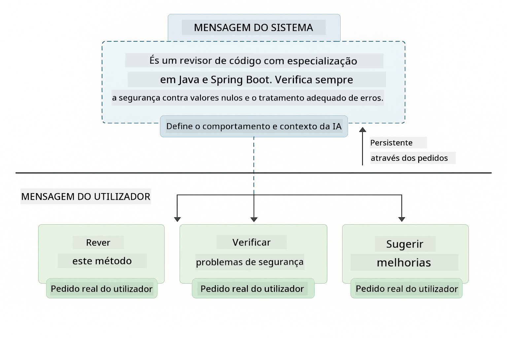
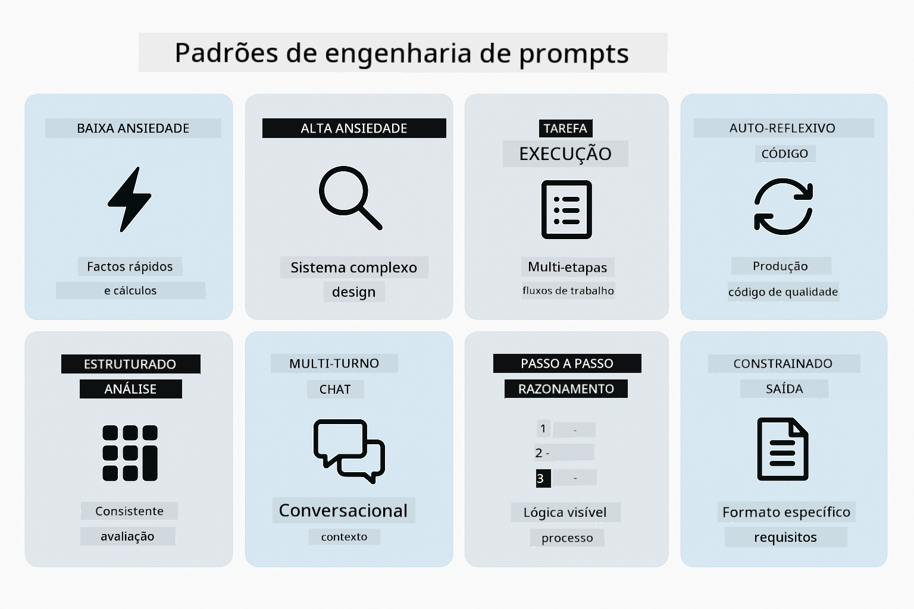
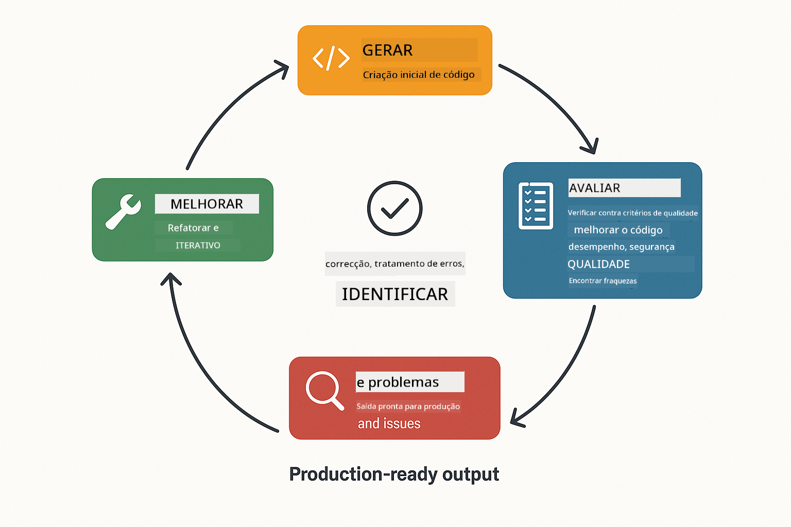
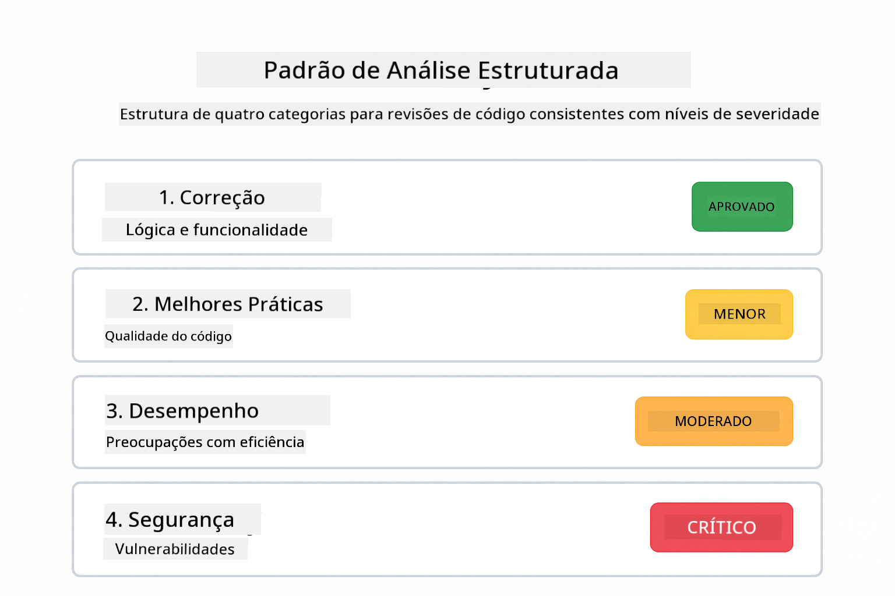
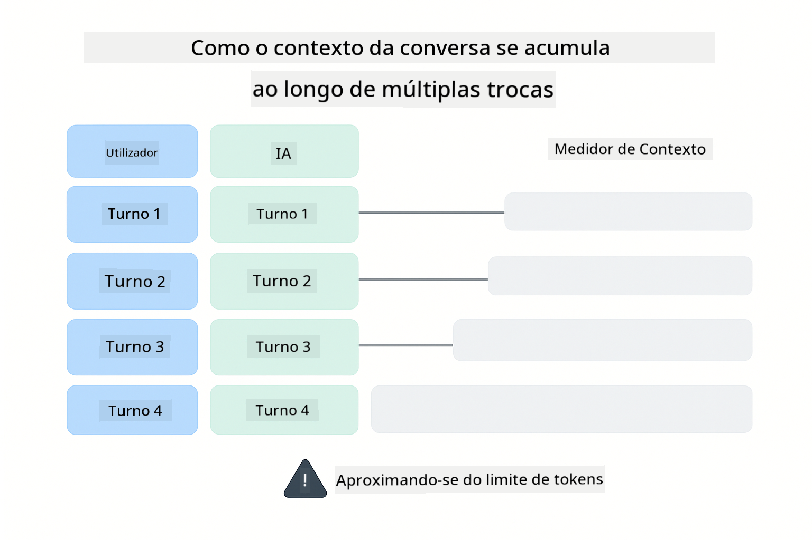
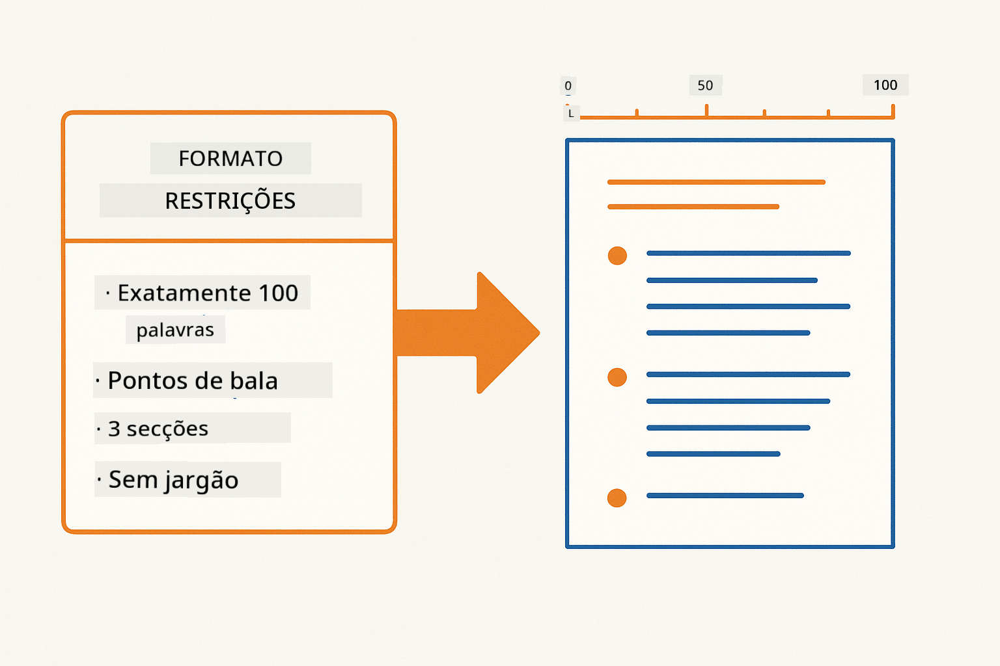
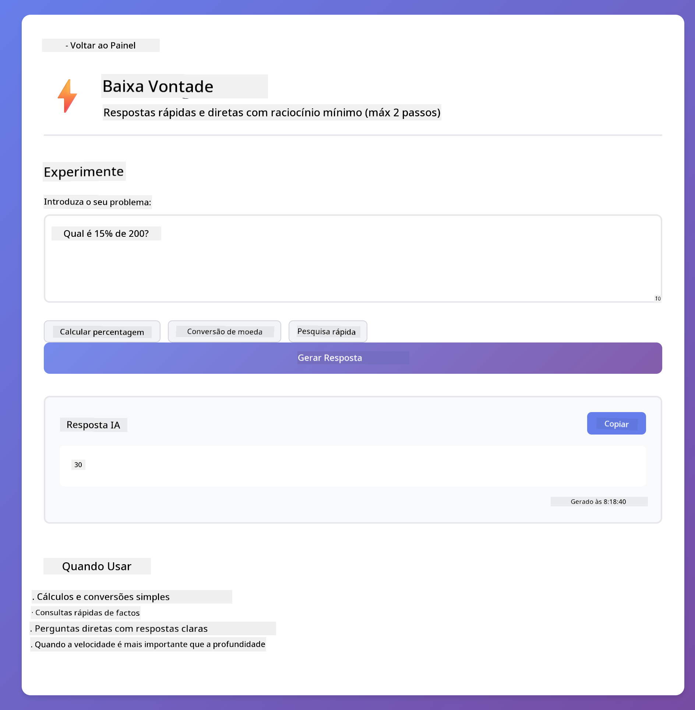
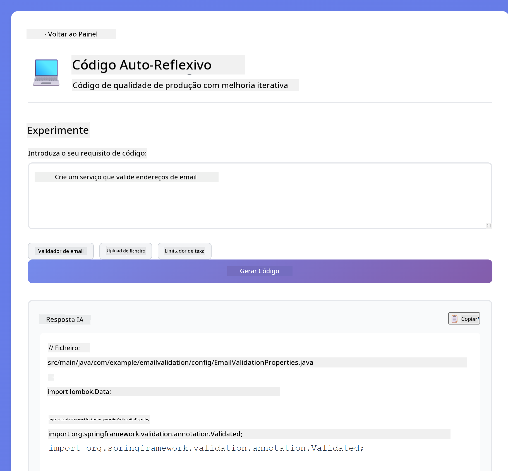
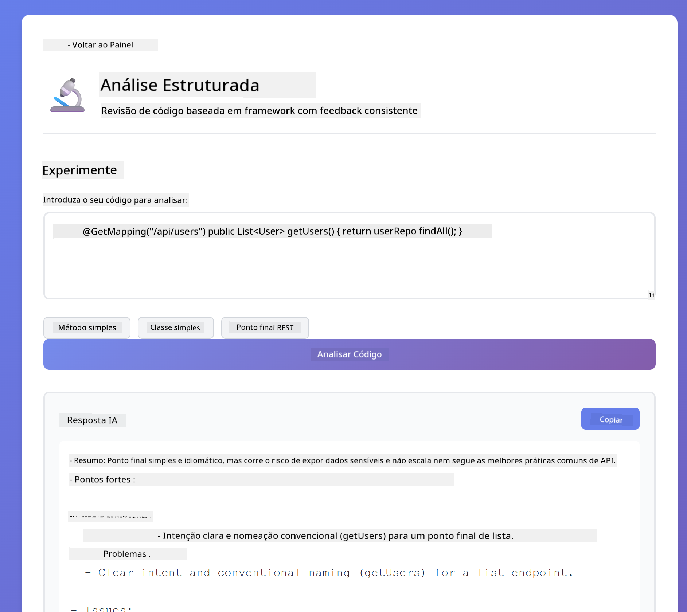

<!--
CO_OP_TRANSLATOR_METADATA:
{
  "original_hash": "8d787826cad7e92bf5cdbd116b1e6116",
  "translation_date": "2025-12-13T16:03:42+00:00",
  "source_file": "02-prompt-engineering/README.md",
  "language_code": "pt"
}
-->
# Módulo 02: Engenharia de Prompts com GPT-5

## Índice

- [O que vai aprender](../../../02-prompt-engineering)
- [Pré-requisitos](../../../02-prompt-engineering)
- [Compreender a Engenharia de Prompts](../../../02-prompt-engineering)
- [Como isto usa LangChain4j](../../../02-prompt-engineering)
- [Os Padrões Principais](../../../02-prompt-engineering)
- [Usar Recursos Azure Existentes](../../../02-prompt-engineering)
- [Capturas de Ecrã da Aplicação](../../../02-prompt-engineering)
- [Explorar os Padrões](../../../02-prompt-engineering)
  - [Baixa vs Alta Vontade](../../../02-prompt-engineering)
  - [Execução de Tarefas (Preâmbulos de Ferramentas)](../../../02-prompt-engineering)
  - [Código Auto-Reflexivo](../../../02-prompt-engineering)
  - [Análise Estruturada](../../../02-prompt-engineering)
  - [Chat Multi-Turno](../../../02-prompt-engineering)
  - [Raciocínio Passo a Passo](../../../02-prompt-engineering)
  - [Saída Constrangida](../../../02-prompt-engineering)
- [O que está realmente a aprender](../../../02-prompt-engineering)
- [Próximos Passos](../../../02-prompt-engineering)

## O que vai aprender

No módulo anterior, viu como a memória permite IA conversacional e usou os Modelos GitHub para interações básicas. Agora vamos focar em como faz perguntas — os próprios prompts — usando o GPT-5 do Azure OpenAI. A forma como estrutura os seus prompts afeta dramaticamente a qualidade das respostas que obtém.

Vamos usar o GPT-5 porque ele introduz controlo de raciocínio — pode dizer ao modelo quanto deve pensar antes de responder. Isto torna diferentes estratégias de prompting mais evidentes e ajuda a perceber quando usar cada abordagem. Também beneficiamos dos limites de taxa mais baixos do Azure para o GPT-5 comparado com os Modelos GitHub.

## Pré-requisitos

- Módulo 01 concluído (recursos Azure OpenAI implementados)
- Ficheiro `.env` na diretoria raiz com credenciais Azure (criado pelo `azd up` no Módulo 01)

> **Nota:** Se ainda não concluiu o Módulo 01, siga primeiro as instruções de implementação aí.

## Compreender a Engenharia de Prompts

Engenharia de prompts é sobre desenhar texto de entrada que consistentemente lhe dá os resultados que precisa. Não é só fazer perguntas — é estruturar pedidos para que o modelo entenda exatamente o que quer e como entregar.

Pense nisso como dar instruções a um colega. "Corrige o bug" é vago. "Corrige a exceção de ponteiro nulo em UserService.java linha 45 adicionando uma verificação de nulo" é específico. Os modelos de linguagem funcionam da mesma forma — especificidade e estrutura são importantes.

## Como isto usa LangChain4j

Este módulo demonstra padrões avançados de prompting usando a mesma base LangChain4j dos módulos anteriores, com foco na estrutura do prompt e controlo de raciocínio.


*Como o LangChain4j liga os seus prompts ao Azure OpenAI GPT-5*

**Dependências** – O Módulo 02 usa as seguintes dependências langchain4j definidas em `pom.xml`:
```xml
<dependency>
    <groupId>dev.langchain4j</groupId>
    <artifactId>langchain4j</artifactId> <!-- Inherited from BOM in root pom.xml -->
</dependency>
<dependency>
    <groupId>dev.langchain4j</groupId>
    <artifactId>langchain4j-open-ai-official</artifactId> <!-- Inherited from BOM in root pom.xml -->
</dependency>
```

**Configuração OpenAiOfficialChatModel** – [LangChainConfig.java](../../../02-prompt-engineering/src/main/java/com/example/langchain4j/prompts/config/LangChainConfig.java)

O modelo de chat é configurado manualmente como um bean Spring usando o cliente oficial OpenAI, que suporta endpoints Azure OpenAI. A principal diferença do Módulo 01 é como estruturamos os prompts enviados para `chatModel.chat()`, não a configuração do modelo em si.

**Mensagens de Sistema e Utilizador** – [Gpt5PromptService.java](../../../02-prompt-engineering/src/main/java/com/example/langchain4j/prompts/service/Gpt5PromptService.java)

O LangChain4j separa os tipos de mensagem para clareza. `SystemMessage` define o comportamento e contexto da IA (como "Você é um revisor de código"), enquanto `UserMessage` contém o pedido real. Esta separação permite manter comportamento consistente da IA em diferentes consultas de utilizador.

```java
SystemMessage systemMsg = SystemMessage.from(
    "You are a helpful Java programming expert."
);

UserMessage userMsg = UserMessage.from(
    "Explain what a List is in Java"
);

String response = chatModel.chat(systemMsg, userMsg);
```



*SystemMessage fornece contexto persistente enquanto UserMessages contêm pedidos individuais*

**MessageWindowChatMemory para Multi-Turno** – Para o padrão de conversa multi-turno, reutilizamos `MessageWindowChatMemory` do Módulo 01. Cada sessão tem a sua própria instância de memória armazenada num `Map<String, ChatMemory>`, permitindo múltiplas conversas concorrentes sem mistura de contexto.

**Templates de Prompt** – O foco real aqui é engenharia de prompts, não novas APIs LangChain4j. Cada padrão (baixa vontade, alta vontade, execução de tarefas, etc.) usa o mesmo método `chatModel.chat(prompt)` mas com strings de prompt cuidadosamente estruturadas. As tags XML, instruções e formatação fazem parte do texto do prompt, não são funcionalidades LangChain4j.

**Controlo de Raciocínio** – O esforço de raciocínio do GPT-5 é controlado através de instruções no prompt como "máximo 2 passos de raciocínio" ou "explorar minuciosamente". Estas são técnicas de engenharia de prompts, não configurações LangChain4j. A biblioteca simplesmente entrega os seus prompts ao modelo.

A principal conclusão: LangChain4j fornece a infraestrutura (ligação ao modelo via [LangChainConfig.java](../../../02-prompt-engineering/src/main/java/com/example/langchain4j/prompts/config/LangChainConfig.java), memória, gestão de mensagens via [Gpt5PromptService.java](../../../02-prompt-engineering/src/main/java/com/example/langchain4j/prompts/service/Gpt5PromptService.java)), enquanto este módulo ensina como criar prompts eficazes dentro dessa infraestrutura.

## Os Padrões Principais

Nem todos os problemas precisam da mesma abordagem. Algumas perguntas precisam de respostas rápidas, outras de pensamento profundo. Algumas precisam de raciocínio visível, outras só dos resultados. Este módulo cobre oito padrões de prompting — cada um otimizado para diferentes cenários. Vai experimentar todos para aprender quando cada abordagem funciona melhor.



*Visão geral dos oito padrões de engenharia de prompts e seus casos de uso*


*Baixa vontade (rápido, direto) vs Alta vontade (minucioso, exploratório) abordagens de raciocínio*

**Baixa Vontade (Rápido & Focado)** – Para perguntas simples onde quer respostas rápidas e diretas. O modelo faz raciocínio mínimo — máximo 2 passos. Use para cálculos, consultas ou perguntas diretas.

```java
String prompt = """
    <reasoning_effort>low</reasoning_effort>
    <instruction>maximum 2 reasoning steps</instruction>
    
    What is 15% of 200?
    """;

String response = chatModel.chat(prompt);
```

> 💡 **Explore com GitHub Copilot:** Abra [`Gpt5PromptService.java`](../../../02-prompt-engineering/src/main/java/com/example/langchain4j/prompts/service/Gpt5PromptService.java) e pergunte:
> - "Qual é a diferença entre os padrões de prompting de baixa vontade e alta vontade?"
> - "Como é que as tags XML nos prompts ajudam a estruturar a resposta da IA?"
> - "Quando devo usar padrões de auto-reflexão vs instrução direta?"

**Alta Vontade (Profundo & Minucioso)** – Para problemas complexos onde quer análise abrangente. O modelo explora minuciosamente e mostra raciocínio detalhado. Use para design de sistemas, decisões de arquitetura ou pesquisa complexa.

```java
String prompt = """
    <reasoning_effort>high</reasoning_effort>
    <instruction>explore thoroughly, show detailed reasoning</instruction>
    
    Design a caching strategy for a high-traffic REST API.
    """;

String response = chatModel.chat(prompt);
```

**Execução de Tarefas (Progresso Passo a Passo)** – Para fluxos de trabalho multi-etapas. O modelo fornece um plano inicial, narra cada passo enquanto trabalha, depois dá um resumo. Use para migrações, implementações ou qualquer processo multi-etapas.

```java
String prompt = """
    <task>Create a REST endpoint for user registration</task>
    <preamble>Provide an upfront plan</preamble>
    <narration>Narrate each step as you work</narration>
    <summary>Summarize what was accomplished</summary>
    """;

String response = chatModel.chat(prompt);
```

O prompting Chain-of-Thought pede explicitamente ao modelo para mostrar o seu processo de raciocínio, melhorando a precisão para tarefas complexas. A decomposição passo a passo ajuda tanto humanos como IA a entender a lógica.

> **🤖 Experimente com o Chat do [GitHub Copilot](https://github.com/features/copilot):** Pergunte sobre este padrão:
> - "Como adaptaria o padrão de execução de tarefas para operações de longa duração?"
> - "Quais são as melhores práticas para estruturar preâmbulos de ferramentas em aplicações de produção?"
> - "Como posso capturar e mostrar atualizações de progresso intermédias numa interface?"


*Fluxo Planear → Executar → Resumir para tarefas multi-etapas*

**Código Auto-Reflexivo** – Para gerar código de qualidade de produção. O modelo gera código, verifica-o contra critérios de qualidade e melhora-o iterativamente. Use quando construir novas funcionalidades ou serviços.

```java
String prompt = """
    <task>Create an email validation service</task>
    <quality_criteria>
    - Correct logic and error handling
    - Best practices (clean code, proper naming)
    - Performance optimization
    - Security considerations
    </quality_criteria>
    <instruction>Generate code, evaluate against criteria, improve iteratively</instruction>
    """;

String response = chatModel.chat(prompt);
```



*Ciclo de melhoria iterativa – gerar, avaliar, identificar problemas, melhorar, repetir*

**Análise Estruturada** – Para avaliação consistente. O modelo revê código usando uma estrutura fixa (correção, práticas, desempenho, segurança). Use para revisões de código ou avaliações de qualidade.

```java
String prompt = """
    <code>
    public List getUsers() {
        return database.query("SELECT * FROM users");
    }
    </code>
    
    <framework>
    Evaluate using these categories:
    1. Correctness - Logic and functionality
    2. Best Practices - Code quality
    3. Performance - Efficiency concerns
    4. Security - Vulnerabilities
    </framework>
    """;

String response = chatModel.chat(prompt);
```

> **🤖 Experimente com o Chat do [GitHub Copilot](https://github.com/features/copilot):** Pergunte sobre análise estruturada:
> - "Como posso personalizar a estrutura de análise para diferentes tipos de revisões de código?"
> - "Qual é a melhor forma de analisar e atuar sobre saída estruturada programaticamente?"
> - "Como garantir níveis de severidade consistentes em diferentes sessões de revisão?"



*Estrutura de quatro categorias para revisões de código consistentes com níveis de severidade*

**Chat Multi-Turno** – Para conversas que precisam de contexto. O modelo lembra mensagens anteriores e constrói sobre elas. Use para sessões de ajuda interativas ou Q&A complexos.

```java
ChatMemory memory = MessageWindowChatMemory.withMaxMessages(10);

memory.add(UserMessage.from("What is Spring Boot?"));
AiMessage aiMessage1 = chatModel.chat(memory.messages()).aiMessage();
memory.add(aiMessage1);

memory.add(UserMessage.from("Show me an example"));
AiMessage aiMessage2 = chatModel.chat(memory.messages()).aiMessage();
memory.add(aiMessage2);
```



*Como o contexto da conversa se acumula ao longo de múltiplos turnos até atingir o limite de tokens*

**Raciocínio Passo a Passo** – Para problemas que requerem lógica visível. O modelo mostra raciocínio explícito para cada passo. Use para problemas matemáticos, puzzles lógicos ou quando precisa entender o processo de pensamento.

```java
String prompt = """
    <instruction>Show your reasoning step-by-step</instruction>
    
    If a train travels 120 km in 2 hours, then stops for 30 minutes,
    then travels another 90 km in 1.5 hours, what is the average speed
    for the entire journey including the stop?
    """;

String response = chatModel.chat(prompt);
```


*Decompor problemas em passos lógicos explícitos*

**Saída Constrangida** – Para respostas com requisitos específicos de formato. O modelo segue estritamente regras de formato e comprimento. Use para resumos ou quando precisa de estrutura de saída precisa.

```java
String prompt = """
    <constraints>
    - Exactly 100 words
    - Bullet point format
    - Technical terms only
    </constraints>
    
    Summarize the key concepts of machine learning.
    """;

String response = chatModel.chat(prompt);
```



*Impor requisitos específicos de formato, comprimento e estrutura*

## Usar Recursos Azure Existentes

**Verificar implementação:**

Assegure que o ficheiro `.env` existe na diretoria raiz com credenciais Azure (criado durante o Módulo 01):
```bash
cat ../.env  # Deve mostrar AZURE_OPENAI_ENDPOINT, API_KEY, DEPLOYMENT
```

**Iniciar a aplicação:**

> **Nota:** Se já iniciou todas as aplicações usando `./start-all.sh` do Módulo 01, este módulo já está a correr na porta 8083. Pode saltar os comandos de arranque abaixo e ir diretamente para http://localhost:8083.

**Opção 1: Usar o Spring Boot Dashboard (Recomendado para utilizadores VS Code)**

O contentor de desenvolvimento inclui a extensão Spring Boot Dashboard, que fornece uma interface visual para gerir todas as aplicações Spring Boot. Pode encontrá-la na Barra de Atividades à esquerda do VS Code (procure o ícone Spring Boot).

No Spring Boot Dashboard, pode:
- Ver todas as aplicações Spring Boot disponíveis no workspace
- Iniciar/parar aplicações com um clique
- Ver logs da aplicação em tempo real
- Monitorizar o estado da aplicação

Basta clicar no botão de play ao lado de "prompt-engineering" para iniciar este módulo, ou iniciar todos os módulos de uma vez.


**Opção 2: Usar scripts shell**

Inicie todas as aplicações web (módulos 01-04):

**Bash:**
```bash
cd ..  # A partir do diretório raiz
./start-all.sh
```

**PowerShell:**
```powershell
cd ..  # A partir do diretório raiz
.\start-all.ps1
```

Ou inicie apenas este módulo:

**Bash:**
```bash
cd 02-prompt-engineering
./start.sh
```

**PowerShell:**
```powershell
cd 02-prompt-engineering
.\start.ps1
```

Ambos os scripts carregam automaticamente as variáveis de ambiente do ficheiro `.env` da raiz e constroem os JARs se não existirem.

> **Nota:** Se preferir construir todos os módulos manualmente antes de iniciar:
>
> **Bash:**
> ```bash
> cd ..  # Go to root directory
> mvn clean package -DskipTests
> ```
>
> **PowerShell:**
> ```powershell
> cd ..  # Go to root directory
> mvn clean package -DskipTests
> ```

Abra http://localhost:8083 no seu navegador.

**Para parar:**

**Bash:**
```bash
./stop.sh  # Apenas este módulo
# Ou
cd .. && ./stop-all.sh  # Todos os módulos
```

**PowerShell:**
```powershell
.\stop.ps1  # Apenas este módulo
# Ou
cd ..; .\stop-all.ps1  # Todos os módulos
```

## Capturas de Ecrã da Aplicação


*O dashboard principal mostrando os 8 padrões de engenharia de prompts com as suas características e casos de uso*

## Explorar os Padrões

A interface web permite experimentar diferentes estratégias de prompting. Cada padrão resolve problemas diferentes — experimente para ver quando cada abordagem se destaca.

### Baixa vs Alta Vontade

Faça uma pergunta simples como "Qual é 15% de 200?" usando Baixa Vontade. Vai obter uma resposta instantânea e direta. Agora pergunte algo complexo como "Desenha uma estratégia de cache para uma API de alto tráfego" usando Alta Vontade. Veja como o modelo desacelera e fornece raciocínio detalhado. Mesmo modelo, mesma estrutura de pergunta — mas o prompt diz-lhe quanto deve pensar.


*Cálculo rápido com raciocínio mínimo*


*Estratégia abrangente de cache (2,8MB)*

### Execução de Tarefas (Preâmbulos de Ferramentas)

Fluxos de trabalho em múltiplas etapas beneficiam-se de planeamento prévio e narração do progresso. O modelo descreve o que vai fazer, narra cada passo e depois resume os resultados.


*Criação de um endpoint REST com narração passo a passo (3,9MB)*

### Código Auto-Reflexivo

Experimente "Criar um serviço de validação de email". Em vez de apenas gerar código e parar, o modelo gera, avalia segundo critérios de qualidade, identifica fraquezas e melhora. Verá que itera até o código cumprir os padrões de produção.



*Serviço completo de validação de email (5,2MB)*

### Análise Estruturada

Revisões de código precisam de quadros de avaliação consistentes. O modelo analisa o código usando categorias fixas (correção, práticas, desempenho, segurança) com níveis de severidade.



*Revisão de código baseada em framework*

### Chat Multi-Turno

Pergunte "O que é Spring Boot?" e depois imediatamente "Mostra-me um exemplo". O modelo lembra-se da sua primeira pergunta e dá-lhe um exemplo específico de Spring Boot. Sem memória, essa segunda pergunta seria demasiado vaga.


*Preservação do contexto entre perguntas*

### Raciocínio Passo a Passo

Escolha um problema de matemática e experimente tanto com Raciocínio Passo a Passo como com Baixa Disposição. Baixa disposição dá-lhe apenas a resposta - rápido mas opaco. Passo a passo mostra-lhe cada cálculo e decisão.


*Problema matemático com passos explícitos*

### Saída Constrangida

Quando precisa de formatos específicos ou contagem de palavras, este padrão impõe estrita conformidade. Experimente gerar um resumo com exatamente 100 palavras em formato de pontos.


*Resumo de machine learning com controlo de formato*

## O Que Está Realmente a Aprender

**O Esforço de Raciocínio Muda Tudo**

O GPT-5 permite controlar o esforço computacional através dos seus prompts. Baixo esforço significa respostas rápidas com exploração mínima. Alto esforço significa que o modelo demora a pensar profundamente. Está a aprender a ajustar o esforço à complexidade da tarefa - não perca tempo com perguntas simples, mas também não apresse decisões complexas.

**A Estrutura Guia o Comportamento**

Reparou nas tags XML nos prompts? Não são decorativas. Os modelos seguem instruções estruturadas de forma mais fiável do que texto livre. Quando precisa de processos em múltiplas etapas ou lógica complexa, a estrutura ajuda o modelo a saber onde está e o que vem a seguir.


*Anatomia de um prompt bem estruturado com secções claras e organização ao estilo XML*

**Qualidade Através da Autoavaliação**

Os padrões auto-reflexivos funcionam ao tornar explícitos os critérios de qualidade. Em vez de esperar que o modelo "faça bem", diz-lhe exatamente o que "bem" significa: lógica correta, tratamento de erros, desempenho, segurança. O modelo pode então avaliar a sua própria saída e melhorar. Isto transforma a geração de código de uma lotaria num processo.

**O Contexto É Finito**

Conversas multi-turno funcionam incluindo o histórico de mensagens em cada pedido. Mas há um limite - cada modelo tem um máximo de tokens. À medida que as conversas crescem, precisará de estratégias para manter o contexto relevante sem atingir esse limite. Este módulo mostra como a memória funciona; mais tarde aprenderá quando resumir, quando esquecer e quando recuperar.

## Próximos Passos

**Próximo Módulo:** [03-rag - RAG (Geração Aumentada por Recuperação)](../03-rag/README.md)

---

**Navegação:** [← Anterior: Módulo 01 - Introdução](../01-introduction/README.md) | [Voltar ao Início](../README.md) | [Seguinte: Módulo 03 - RAG →](../03-rag/README.md)

---

<!-- CO-OP TRANSLATOR DISCLAIMER START -->
**Aviso Legal**:
Este documento foi traduzido utilizando o serviço de tradução por IA [Co-op Translator](https://github.com/Azure/co-op-translator). Embora nos esforcemos para garantir a precisão, por favor tenha em conta que traduções automáticas podem conter erros ou imprecisões. O documento original na sua língua nativa deve ser considerado a fonte autorizada. Para informações críticas, recomenda-se a tradução profissional humana. Não nos responsabilizamos por quaisquer mal-entendidos ou interpretações erradas decorrentes do uso desta tradução.
<!-- CO-OP TRANSLATOR DISCLAIMER END -->