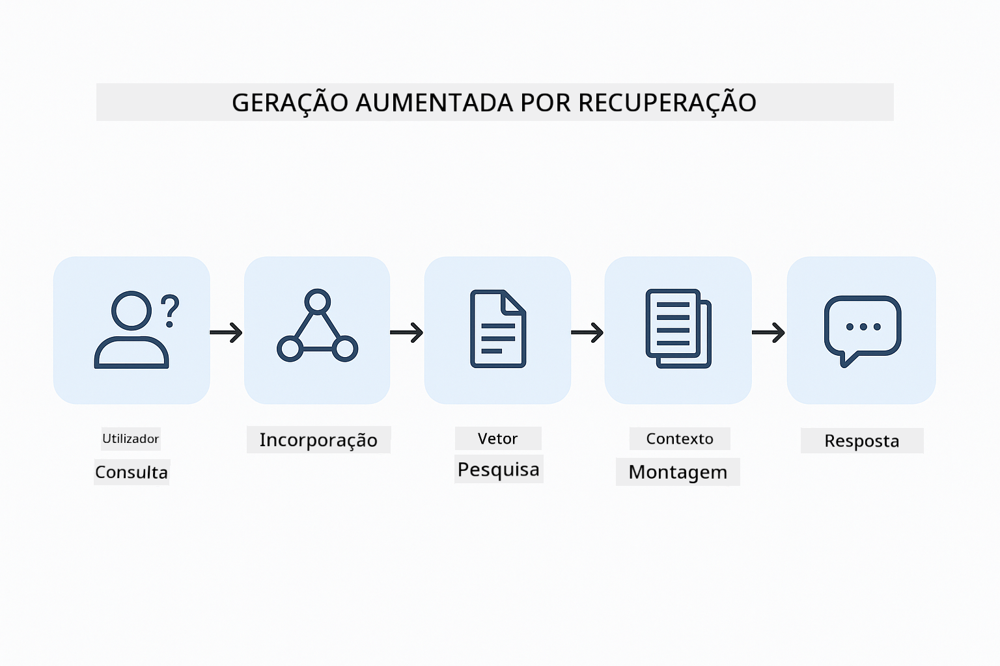
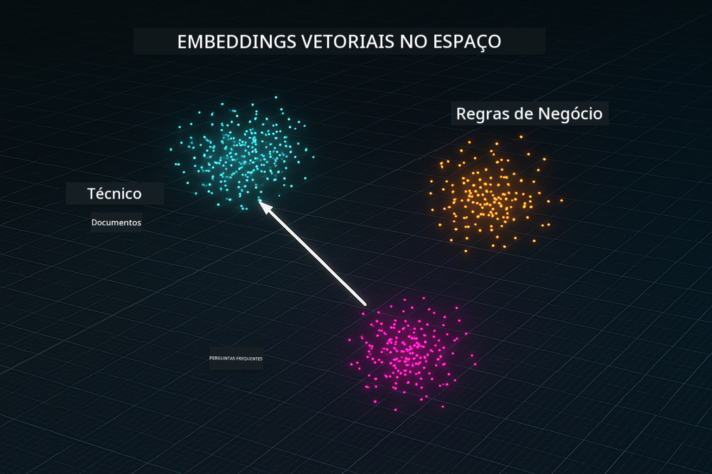
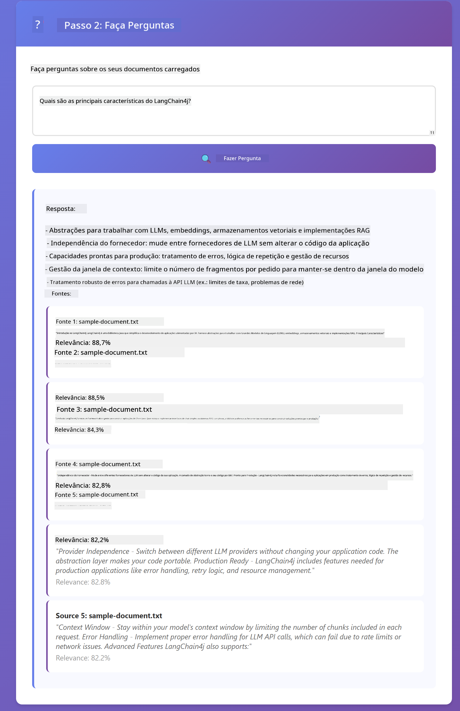

<!--
CO_OP_TRANSLATOR_METADATA:
{
  "original_hash": "f538a51cfd13147d40d84e936a0f485c",
  "translation_date": "2025-12-13T16:58:58+00:00",
  "source_file": "03-rag/README.md",
  "language_code": "pt"
}
-->
# Módulo 03: RAG (Geração Aumentada por Recuperação)

## Índice

- [O que vai aprender](../../../03-rag)
- [Pré-requisitos](../../../03-rag)
- [Compreender o RAG](../../../03-rag)
- [Como funciona](../../../03-rag)
  - [Processamento de Documentos](../../../03-rag)
  - [Criação de Embeddings](../../../03-rag)
  - [Pesquisa Semântica](../../../03-rag)
  - [Geração de Respostas](../../../03-rag)
- [Executar a Aplicação](../../../03-rag)
- [Usar a Aplicação](../../../03-rag)
  - [Carregar um Documento](../../../03-rag)
  - [Fazer Perguntas](../../../03-rag)
  - [Verificar Referências das Fontes](../../../03-rag)
  - [Experimentar com Perguntas](../../../03-rag)
- [Conceitos-Chave](../../../03-rag)
  - [Estratégia de Divisão em Partes](../../../03-rag)
  - [Pontuações de Similaridade](../../../03-rag)
  - [Armazenamento em Memória](../../../03-rag)
  - [Gestão da Janela de Contexto](../../../03-rag)
- [Quando o RAG é Importante](../../../03-rag)
- [Próximos Passos](../../../03-rag)

## O que vai aprender

Nos módulos anteriores, aprendeu a ter conversas com IA e a estruturar os seus prompts de forma eficaz. Mas há uma limitação fundamental: os modelos de linguagem só sabem o que aprenderam durante o treino. Não conseguem responder a perguntas sobre as políticas da sua empresa, a documentação do seu projeto ou qualquer informação que não tenha sido incluída no treino.

O RAG (Geração Aumentada por Recuperação) resolve este problema. Em vez de tentar ensinar ao modelo a sua informação (o que é caro e impraticável), dá-lhe a capacidade de pesquisar nos seus documentos. Quando alguém faz uma pergunta, o sistema encontra informação relevante e inclui-a no prompt. O modelo responde então com base nesse contexto recuperado.

Pense no RAG como dar ao modelo uma biblioteca de referência. Quando faz uma pergunta, o sistema:

1. **Consulta do Utilizador** - Você faz uma pergunta  
2. **Embedding** - Converte a sua pergunta num vetor  
3. **Pesquisa Vetorial** - Encontra partes de documentos semelhantes  
4. **Montagem do Contexto** - Adiciona partes relevantes ao prompt  
5. **Resposta** - O LLM gera uma resposta com base no contexto  

Isto fundamenta as respostas do modelo nos seus dados reais em vez de depender do conhecimento do treino ou inventar respostas.



*Fluxo de trabalho RAG - da consulta do utilizador à pesquisa semântica e geração de resposta contextual*

## Pré-requisitos

- Módulo 01 concluído (recursos Azure OpenAI implementados)  
- Ficheiro `.env` na diretoria raiz com credenciais Azure (criado pelo `azd up` no Módulo 01)  

> **Nota:** Se ainda não concluiu o Módulo 01, siga primeiro as instruções de implementação aí indicadas.

## Como funciona

**Processamento de Documentos** - [DocumentService.java](../../../03-rag/src/main/java/com/example/langchain4j/rag/service/DocumentService.java)

Quando carrega um documento, o sistema divide-o em partes — pedaços mais pequenos que cabem confortavelmente na janela de contexto do modelo. Estas partes sobrepõem-se ligeiramente para não perder contexto nas fronteiras.

```java
Document document = FileSystemDocumentLoader.loadDocument("sample-document.txt");

DocumentSplitter splitter = DocumentSplitters
    .recursive(300, 30, new OpenAiTokenizer());

List<TextSegment> segments = splitter.split(document);
```
  
> **🤖 Experimente com o [GitHub Copilot](https://github.com/features/copilot) Chat:** Abra [`DocumentService.java`](../../../03-rag/src/main/java/com/example/langchain4j/rag/service/DocumentService.java) e pergunte:  
> - "Como é que o LangChain4j divide documentos em partes e por que é importante a sobreposição?"  
> - "Qual é o tamanho ótimo das partes para diferentes tipos de documentos e por quê?"  
> - "Como lidar com documentos em várias línguas ou com formatação especial?"

**Criação de Embeddings** - [LangChainRagConfig.java](../../../03-rag/src/main/java/com/example/langchain4j/rag/config/LangChainRagConfig.java)

Cada parte é convertida numa representação numérica chamada embedding — essencialmente uma impressão digital matemática que captura o significado do texto. Textos semelhantes produzem embeddings semelhantes.

```java
@Bean
public EmbeddingModel embeddingModel() {
    return OpenAiOfficialEmbeddingModel.builder()
        .baseUrl(azureOpenAiEndpoint)
        .apiKey(azureOpenAiKey)
        .modelName(azureEmbeddingDeploymentName)
        .build();
}

EmbeddingStore<TextSegment> embeddingStore = 
    new InMemoryEmbeddingStore<>();
```
  


*Documentos representados como vetores no espaço de embeddings — conteúdos semelhantes agrupam-se*

**Pesquisa Semântica** - [RagService.java](../../../03-rag/src/main/java/com/example/langchain4j/rag/service/RagService.java)

Quando faz uma pergunta, a sua pergunta também se transforma num embedding. O sistema compara o embedding da sua pergunta com os embeddings de todas as partes dos documentos. Encontra as partes com significados mais semelhantes — não apenas palavras-chave correspondentes, mas similaridade semântica real.

```java
Embedding queryEmbedding = embeddingModel.embed(question).content();

List<EmbeddingMatch<TextSegment>> matches = 
    embeddingStore.findRelevant(queryEmbedding, 5, 0.7);

for (EmbeddingMatch<TextSegment> match : matches) {
    String relevantText = match.embedded().text();
    double score = match.score();
}
```
  
> **🤖 Experimente com o [GitHub Copilot](https://github.com/features/copilot) Chat:** Abra [`RagService.java`](../../../03-rag/src/main/java/com/example/langchain4j/rag/service/RagService.java) e pergunte:  
> - "Como funciona a pesquisa por similaridade com embeddings e o que determina a pontuação?"  
> - "Qual o limiar de similaridade que devo usar e como isso afeta os resultados?"  
> - "Como lidar com casos em que não são encontrados documentos relevantes?"

**Geração de Respostas** - [RagService.java](../../../03-rag/src/main/java/com/example/langchain4j/rag/service/RagService.java)

As partes mais relevantes são incluídas no prompt para o modelo. O modelo lê essas partes específicas e responde à sua pergunta com base nessa informação. Isto previne alucinações — o modelo só pode responder com o que tem à sua frente.

## Executar a Aplicação

**Verificar a implementação:**

Certifique-se de que o ficheiro `.env` existe na diretoria raiz com as credenciais Azure (criado durante o Módulo 01):  
```bash
cat ../.env  # Deve mostrar AZURE_OPENAI_ENDPOINT, API_KEY, DEPLOYMENT
```
  
**Iniciar a aplicação:**

> **Nota:** Se já iniciou todas as aplicações usando `./start-all.sh` do Módulo 01, este módulo já está a correr na porta 8081. Pode saltar os comandos de arranque abaixo e ir diretamente para http://localhost:8081.

**Opção 1: Usar o Spring Boot Dashboard (Recomendado para utilizadores VS Code)**

O contentor de desenvolvimento inclui a extensão Spring Boot Dashboard, que fornece uma interface visual para gerir todas as aplicações Spring Boot. Pode encontrá-la na Barra de Atividades à esquerda do VS Code (procure o ícone do Spring Boot).

No Spring Boot Dashboard, pode:  
- Ver todas as aplicações Spring Boot disponíveis no workspace  
- Iniciar/parar aplicações com um clique  
- Ver logs da aplicação em tempo real  
- Monitorizar o estado da aplicação  

Basta clicar no botão de play ao lado de "rag" para iniciar este módulo, ou iniciar todos os módulos de uma vez.


**Opção 2: Usar scripts shell**

Inicie todas as aplicações web (módulos 01-04):

**Bash:**  
```bash
cd ..  # A partir do diretório raiz
./start-all.sh
```
  
**PowerShell:**  
```powershell
cd ..  # A partir do diretório raiz
.\start-all.ps1
```
  
Ou inicie apenas este módulo:

**Bash:**  
```bash
cd 03-rag
./start.sh
```
  
**PowerShell:**  
```powershell
cd 03-rag
.\start.ps1
```
  
Ambos os scripts carregam automaticamente as variáveis de ambiente do ficheiro `.env` da raiz e constroem os JARs se não existirem.

> **Nota:** Se preferir construir todos os módulos manualmente antes de iniciar:  
>  
> **Bash:**  
> ```bash
> cd ..  # Go to root directory
> mvn clean package -DskipTests
> ```
  
> **PowerShell:**  
> ```powershell
> cd ..  # Go to root directory
> mvn clean package -DskipTests
> ```
  
Abra http://localhost:8081 no seu navegador.

**Para parar:**

**Bash:**  
```bash
./stop.sh  # Apenas este módulo
# Ou
cd .. && ./stop-all.sh  # Todos os módulos
```
  
**PowerShell:**  
```powershell
.\stop.ps1  # Apenas este módulo
# Ou
cd ..; .\stop-all.ps1  # Todos os módulos
```
  
## Usar a Aplicação

A aplicação fornece uma interface web para carregar documentos e fazer perguntas.

<a href="images/rag-homepage.png"></a>

*Interface da aplicação RAG — carregue documentos e faça perguntas*

**Carregar um Documento**

Comece por carregar um documento — ficheiros TXT funcionam melhor para testes. Está disponível um `sample-document.txt` neste diretório que contém informação sobre funcionalidades do LangChain4j, implementação RAG e boas práticas — perfeito para testar o sistema.

O sistema processa o seu documento, divide-o em partes e cria embeddings para cada parte. Isto acontece automaticamente quando carrega.

**Fazer Perguntas**

Agora faça perguntas específicas sobre o conteúdo do documento. Experimente algo factual que esteja claramente indicado no documento. O sistema procura partes relevantes, inclui-as no prompt e gera uma resposta.

**Verificar Referências das Fontes**

Repare que cada resposta inclui referências às fontes com pontuações de similaridade. Estas pontuações (de 0 a 1) mostram quão relevante foi cada parte para a sua pergunta. Pontuações mais altas significam melhores correspondências. Isto permite-lhe verificar a resposta com o material fonte.

<a href="images/rag-query-results.png"></a>

*Resultados da consulta mostrando resposta com referências às fontes e pontuações de relevância*

**Experimentar com Perguntas**

Experimente diferentes tipos de perguntas:  
- Factos específicos: "Qual é o tema principal?"  
- Comparações: "Qual é a diferença entre X e Y?"  
- Resumos: "Resuma os pontos-chave sobre Z"  

Observe como as pontuações de relevância mudam consoante o quão bem a sua pergunta corresponde ao conteúdo do documento.

## Conceitos-Chave

**Estratégia de Divisão em Partes**

Os documentos são divididos em partes de 300 tokens com 30 tokens de sobreposição. Este equilíbrio garante que cada parte tem contexto suficiente para ser significativa, mantendo-se pequena o suficiente para incluir várias partes num prompt.

**Pontuações de Similaridade**

As pontuações variam de 0 a 1:  
- 0.7-1.0: Altamente relevante, correspondência exata  
- 0.5-0.7: Relevante, bom contexto  
- Abaixo de 0.5: Filtrado, demasiado dissimilar  

O sistema só recupera partes acima do limiar mínimo para garantir qualidade.

**Armazenamento em Memória**

Este módulo usa armazenamento em memória para simplicidade. Quando reinicia a aplicação, os documentos carregados são perdidos. Sistemas de produção usam bases de dados vetoriais persistentes como Qdrant ou Azure AI Search.

**Gestão da Janela de Contexto**

Cada modelo tem uma janela de contexto máxima. Não pode incluir todas as partes de um documento grande. O sistema recupera as N partes mais relevantes (padrão 5) para manter-se dentro dos limites, fornecendo contexto suficiente para respostas precisas.

## Quando o RAG é Importante

**Use RAG quando:**  
- Responder a perguntas sobre documentos proprietários  
- Informação muda frequentemente (políticas, preços, especificações)  
- A precisão requer atribuição da fonte  
- O conteúdo é demasiado grande para caber num único prompt  
- Precisa de respostas verificáveis e fundamentadas  

**Não use RAG quando:**  
- As perguntas requerem conhecimento geral que o modelo já tem  
- É necessário dado em tempo real (RAG funciona com documentos carregados)  
- O conteúdo é pequeno o suficiente para incluir diretamente nos prompts  

## Próximos Passos

**Próximo Módulo:** [04-tools - Agentes de IA com Ferramentas](../04-tools/README.md)

---

**Navegação:** [← Anterior: Módulo 02 - Engenharia de Prompts](../02-prompt-engineering/README.md) | [Voltar ao Início](../README.md) | [Seguinte: Módulo 04 - Ferramentas →](../04-tools/README.md)

---

<!-- CO-OP TRANSLATOR DISCLAIMER START -->
**Aviso Legal**:
Este documento foi traduzido utilizando o serviço de tradução por IA [Co-op Translator](https://github.com/Azure/co-op-translator). Embora nos esforcemos para garantir a precisão, por favor tenha em conta que traduções automáticas podem conter erros ou imprecisões. O documento original na sua língua nativa deve ser considerado a fonte autorizada. Para informações críticas, recomenda-se a tradução profissional humana. Não nos responsabilizamos por quaisquer mal-entendidos ou interpretações erradas decorrentes do uso desta tradução.
<!-- CO-OP TRANSLATOR DISCLAIMER END -->