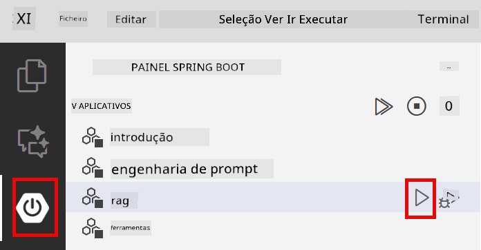

<!--
CO_OP_TRANSLATOR_METADATA:
{
  "original_hash": "81d087662fb3dd7b7124bce1a9c9ec86",
  "translation_date": "2026-01-05T22:58:03+00:00",
  "source_file": "03-rag/README.md",
  "language_code": "pt"
}
-->
# Módulo 03: RAG (Geração Aumentada por Recuperação)

## Índice

- [O que vai aprender](../../../03-rag)
- [Pré-requisitos](../../../03-rag)
- [Compreender o RAG](../../../03-rag)
- [Como funciona](../../../03-rag)
  - [Processamento de documentos](../../../03-rag)
  - [Criação de embeddings](../../../03-rag)
  - [Pesquisa semântica](../../../03-rag)
  - [Geração de respostas](../../../03-rag)
- [Executar a aplicação](../../../03-rag)
- [Utilizar a aplicação](../../../03-rag)
  - [Carregar um documento](../../../03-rag)
  - [Fazer perguntas](../../../03-rag)
  - [Verificar referências de fonte](../../../03-rag)
  - [Experimentar com as perguntas](../../../03-rag)
- [Conceitos chave](../../../03-rag)
  - [Estratégia de fragmentação](../../../03-rag)
  - [Pontuações de similaridade](../../../03-rag)
  - [Armazenamento em memória](../../../03-rag)
  - [Gestão da janela de contexto](../../../03-rag)
- [Quando o RAG importa](../../../03-rag)
- [Próximos passos](../../../03-rag)

## O que vai aprender

Nos módulos anteriores, aprendeu como ter conversas com IA e estruturar os seus prompts de forma eficaz. Mas existe uma limitação fundamental: os modelos de linguagem apenas sabem aquilo que aprenderam durante o treino. Eles não conseguem responder a perguntas sobre as políticas da sua empresa, a documentação do seu projeto ou qualquer informação que não tenha sido usada no seu treino.

O RAG (Geração Aumentada por Recuperação) resolve este problema. Em vez de tentar ensinar o modelo com a sua informação (o que é dispendioso e impraticável), dá-lhe a capacidade de pesquisar através dos seus documentos. Quando alguém faz uma pergunta, o sistema encontra informação relevante e inclui-a no prompt. O modelo então responde com base nesse contexto recuperado.

Pense no RAG como dar ao modelo uma biblioteca de referência. Quando fizer uma pergunta, o sistema:

1. **Pergunta do utilizador** - Você faz uma pergunta  
2. **Embedding** - Converte a sua pergunta numa representação vetorial  
3. **Pesquisa vetorial** - Encontra fragmentos de documento semelhantes  
4. **Montagem do contexto** - Adiciona os fragmentos relevantes ao prompt  
5. **Resposta** - O LLM gera uma resposta baseada no contexto  

Isto fundamenta as respostas do modelo nos seus dados reais, em vez de depender apenas do conhecimento do treino ou de inventar respostas.


*Fluxo de trabalho do RAG - da pergunta do utilizador à pesquisa semântica até à geração de resposta contextual*

## Pré-requisitos

- Módulo 01 concluído (recursos Azure OpenAI implantados)  
- Ficheiro `.env` na raiz com credenciais Azure (criado pelo `azd up` no Módulo 01)  

> **Nota:** Se não completou o Módulo 01, siga primeiro as instruções de implantação desse módulo.

## Como funciona

### Processamento de documentos

[DocumentService.java](../../../03-rag/src/main/java/com/example/langchain4j/rag/service/DocumentService.java)

Quando carrega um documento, o sistema divide-o em fragmentos — pedaços mais pequenos que cabem confortavelmente na janela de contexto do modelo. Estes fragmentos sobrepõem-se ligeiramente para não perder contexto nas fronteiras.

```java
Document document = FileSystemDocumentLoader.loadDocument("sample-document.txt");

DocumentSplitter splitter = DocumentSplitters
    .recursive(300, 30, new OpenAiTokenizer());

List<TextSegment> segments = splitter.split(document);
```
  
> **🤖 Experimente com o [GitHub Copilot](https://github.com/features/copilot) Chat:** Abra [`DocumentService.java`](../../../03-rag/src/main/java/com/example/langchain4j/rag/service/DocumentService.java) e pergunte:  
> - "Como é que o LangChain4j divide os documentos em fragmentos e por que é importante a sobreposição?"  
> - "Qual é o tamanho ideal dos fragmentos para diferentes tipos de documentos e porquê?"  
> - "Como tratar documentos em várias línguas ou com formatação especial?"

### Criação de embeddings

[LangChainRagConfig.java](../../../03-rag/src/main/java/com/example/langchain4j/rag/config/LangChainRagConfig.java)

Cada fragmento é convertido numa representação numérica chamada embedding — essencialmente uma impressão digital matemática que captura o significado do texto. Textos similares produzem embeddings similares.

```java
@Bean
public EmbeddingModel embeddingModel() {
    return OpenAiOfficialEmbeddingModel.builder()
        .baseUrl(azureOpenAiEndpoint)
        .apiKey(azureOpenAiKey)
        .modelName(azureEmbeddingDeploymentName)
        .build();
}

EmbeddingStore<TextSegment> embeddingStore = 
    new InMemoryEmbeddingStore<>();
```
  


*Documentos representados como vetores no espaço de embeddings — conteúdos semelhantes agrupam-se*

### Pesquisa semântica

[RagService.java](../../../03-rag/src/main/java/com/example/langchain4j/rag/service/RagService.java)

Quando faz uma pergunta, a sua pergunta também é convertida num embedding. O sistema compara o embedding da sua pergunta com todos os embeddings dos fragmentos dos documentos. Encontra os fragmentos com significados mais similares — não só por palavras-chave coincidentes, mas por verdadeira similaridade semântica.

```java
Embedding queryEmbedding = embeddingModel.embed(question).content();

List<EmbeddingMatch<TextSegment>> matches = 
    embeddingStore.findRelevant(queryEmbedding, 5, 0.7);

for (EmbeddingMatch<TextSegment> match : matches) {
    String relevantText = match.embedded().text();
    double score = match.score();
}
```
  
> **🤖 Experimente com o [GitHub Copilot](https://github.com/features/copilot) Chat:** Abra [`RagService.java`](../../../03-rag/src/main/java/com/example/langchain4j/rag/service/RagService.java) e pergunte:  
> - "Como funciona a pesquisa por similaridade com embeddings e o que determina a pontuação?"  
> - "Qual o limiar de similaridade que devo usar e como isso afeta os resultados?"  
> - "Como tratar casos em que não são encontrados documentos relevantes?"

### Geração de resposta

[RagService.java](../../../03-rag/src/main/java/com/example/langchain4j/rag/service/RagService.java)

Os fragmentos mais relevantes são incluídos no prompt para o modelo. O modelo lê esses fragmentos específicos e responde com base nessa informação. Isto previne alucinações — o modelo só pode responder ao que está à sua frente.

## Executar a aplicação

**Verificar implantação:**  

Certifique-se de que o ficheiro `.env` existe na raiz com as credenciais Azure (criado durante o Módulo 01):  
```bash
cat ../.env  # Deve mostrar AZURE_OPENAI_ENDPOINT, API_KEY, DEPLOYMENT
```
  
**Iniciar a aplicação:**  

> **Nota:** Se já iniciou todas as aplicações com `./start-all.sh` no Módulo 01, este módulo já está a correr na porta 8081. Pode ignorar os comandos abaixo e ir diretamente para http://localhost:8081.

**Opção 1: Usar Spring Boot Dashboard (Recomendado para utilizadores VS Code)**

O contentor de desenvolvimento inclui a extensão Spring Boot Dashboard, que fornece uma interface visual para gerir todas as aplicações Spring Boot. Pode encontrá-la na Barra de Atividades à esquerda do VS Code (procure o ícone Spring Boot).

No Spring Boot Dashboard, pode:  
- Ver todas as aplicações Spring Boot disponíveis no workspace  
- Iniciar/parar aplicações com um clique  
- Ver logs da aplicação em tempo real  
- Monitorizar o estado da aplicação

Basta clicar no botão de play junto de "rag" para iniciar este módulo, ou iniciar todos os módulos de uma vez.



**Opção 2: Usar scripts shell**

Iniciar todas as aplicações web (módulos 01-04):  

**Bash:**  
```bash
cd ..  # A partir do diretório raiz
./start-all.sh
```
  
**PowerShell:**  
```powershell
cd ..  # A partir do diretório raiz
.\start-all.ps1
```
  
Ou iniciar só este módulo:  

**Bash:**  
```bash
cd 03-rag
./start.sh
```
  
**PowerShell:**  
```powershell
cd 03-rag
.\start.ps1
```
  
Ambos os scripts carregam automaticamente as variáveis de ambiente do ficheiro `.env` na raiz e vão compilar os JARs se estes não existirem.

> **Nota:** Se preferir compilar todos os módulos manualmente antes de iniciar:  
>  
> **Bash:**  
> ```bash
> cd ..  # Go to root directory
> mvn clean package -DskipTests
> ```

> **PowerShell:**  
> ```powershell
> cd ..  # Go to root directory
> mvn clean package -DskipTests
> ```
  
Abra http://localhost:8081 no seu browser.

**Para parar:**  

**Bash:**  
```bash
./stop.sh  # Apenas este módulo
# Ou
cd .. && ./stop-all.sh  # Todos os módulos
```
  
**PowerShell:**  
```powershell
.\stop.ps1  # Apenas este módulo
# Ou
cd ..; .\stop-all.ps1  # Todos os módulos
```
  
## Utilizar a aplicação

A aplicação oferece uma interface web para upload de documentos e fazer perguntas.

<a href="images/rag-homepage.png"></a>

*Interface da aplicação RAG — carregue documentos e faça perguntas*

### Carregar um documento

Comece por carregar um documento — ficheiros TXT funcionam melhor para testes. Um ficheiro `sample-document.txt` está disponível neste diretório, contendo informações sobre as funcionalidades do LangChain4j, implementação RAG e melhores práticas — perfeito para testar o sistema.

O sistema processa o documento, divide-o em fragmentos e cria embeddings para cada fragmento. Isto acontece automaticamente ao carregar.

### Fazer perguntas

Agora faça perguntas específicas sobre o conteúdo do documento. Tente algo factual que esteja claramente declarado no documento. O sistema procura fragmentos relevantes, inclui-os no prompt e gera uma resposta.

### Verificar referências de fonte

Note que cada resposta inclui referências de fonte com pontuações de similaridade. Estas pontuações (de 0 a 1) mostram quão relevante foi cada fragmento para a sua pergunta. Pontuações mais altas significam melhor correspondência. Isto permite-lhe verificar a resposta com o material de origem.

<a href="images/rag-query-results.png"></a>

*Resultados da consulta mostrando resposta com referências de fonte e pontuações de relevância*

### Experimentar com as perguntas

Experimente diferentes tipos de perguntas:  
- Factos específicos: "Qual é o tema principal?"  
- Comparações: "Qual é a diferença entre X e Y?"  
- Resumos: "Resuma os pontos chave sobre Z"

Veja como as pontuações de relevância mudam conforme a correspondência da pergunta com o conteúdo do documento.

## Conceitos chave

### Estratégia de fragmentação

Os documentos são divididos em fragmentos de 300 tokens com 30 tokens de sobreposição. Este equilíbrio assegura que cada fragmento tenha contexto suficiente para ser significativo mas continue pequeno o bastante para incluir múltiplos fragmentos num prompt.

### Pontuações de similaridade

As pontuações variam entre 0 e 1:  
- 0.7-1.0: Altamente relevante, correspondência exata  
- 0.5-0.7: Relevante, bom contexto  
- Abaixo de 0.5: Filtrado, demasiado dissimilar  

O sistema recupera apenas fragmentos acima do limiar mínimo para garantir qualidade.

### Armazenamento em memória

Este módulo usa armazenamento em memória pela simplicidade. Ao reiniciar a aplicação, os documentos carregados são perdidos. Sistemas de produção usam bases de dados vetoriais persistentes como Qdrant ou Azure AI Search.

### Gestão da janela de contexto

Cada modelo tem uma janela máxima de contexto. Não pode incluir todos os fragmentos de um documento extenso. O sistema recupera os N fragmentos mais relevantes (por defeito 5) para manter-se dentro dos limites, oferecendo contexto suficiente para respostas precisas.

## Quando o RAG importa

**Use o RAG quando:**  
- Precisa responder a perguntas sobre documentos proprietários  
- A informação muda frequentemente (políticas, preços, especificações)  
- A precisão requer atribuição da fonte  
- O conteúdo é demasiado grande para caber num único prompt  
- Precisa de respostas verificáveis e fundamentadas

**Não use o RAG quando:**  
- As perguntas requerem conhecimento geral que o modelo já tem  
- Precisa de dados em tempo real (RAG funciona com documentos carregados)  
- O conteúdo é pequeno o suficiente para incluir diretamente nos prompts

## Próximos passos

**Próximo módulo:** [04-tools - Agentes IA com Ferramentas](../04-tools/README.md)

---

**Navegação:** [← Anterior: Módulo 02 - Engenharia de Prompt](../02-prompt-engineering/README.md) | [Voltar ao início](../README.md) | [Seguinte: Módulo 04 - Ferramentas →](../04-tools/README.md)

---

<!-- CO-OP TRANSLATOR DISCLAIMER START -->
**Aviso Legal**:
Este documento foi traduzido utilizando o serviço de tradução por IA [Co-op Translator](https://github.com/Azure/co-op-translator). Embora nos esforcemos por garantir a exactidão, por favor esteja ciente de que as traduções automáticas podem conter erros ou imprecisões. O documento original na sua língua nativa deve ser considerado a fonte autorizada. Para informações críticas, recomenda-se tradução profissional humana. Não nos responsabilizamos por quaisquer mal-entendidos ou interpretações incorretas resultantes da utilização desta tradução.
<!-- CO-OP TRANSLATOR DISCLAIMER END -->