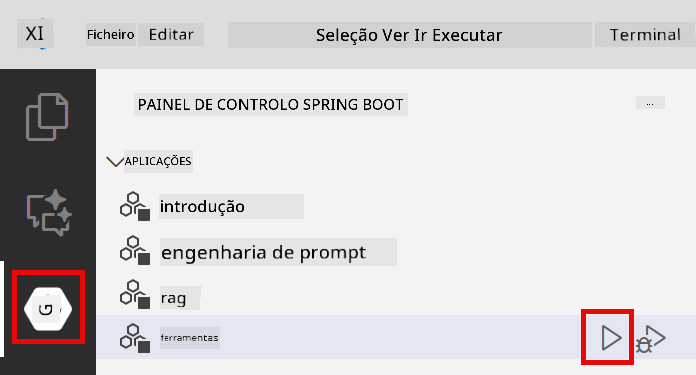

<!--
CO_OP_TRANSLATOR_METADATA:
{
  "original_hash": "aa23f106e7f53270924c9dd39c629004",
  "translation_date": "2025-12-13T18:47:25+00:00",
  "source_file": "04-tools/README.md",
  "language_code": "pt"
}
-->
# Módulo 04: Agentes de IA com Ferramentas

## Índice

- [O que vai aprender](../../../04-tools)
- [Pré-requisitos](../../../04-tools)
- [Compreender Agentes de IA com Ferramentas](../../../04-tools)
- [Como funciona a chamada de ferramentas](../../../04-tools)
  - [Definições de Ferramentas](../../../04-tools)
  - [Tomada de Decisão](../../../04-tools)
  - [Execução](../../../04-tools)
  - [Geração de Resposta](../../../04-tools)
- [Encadeamento de Ferramentas](../../../04-tools)
- [Executar a Aplicação](../../../04-tools)
- [Usar a Aplicação](../../../04-tools)
  - [Experimente o Uso Simples de Ferramentas](../../../04-tools)
  - [Teste o Encadeamento de Ferramentas](../../../04-tools)
  - [Veja o Fluxo da Conversa](../../../04-tools)
  - [Observe o Raciocínio](../../../04-tools)
  - [Experimente com Diferentes Pedidos](../../../04-tools)
- [Conceitos-Chave](../../../04-tools)
  - [Padrão ReAct (Raciocínio e Ação)](../../../04-tools)
  - [Descrições de Ferramentas Importam](../../../04-tools)
  - [Gestão de Sessão](../../../04-tools)
  - [Tratamento de Erros](../../../04-tools)
- [Ferramentas Disponíveis](../../../04-tools)
- [Quando Usar Agentes Baseados em Ferramentas](../../../04-tools)
- [Próximos Passos](../../../04-tools)

## O que vai aprender

Até agora, aprendeu como ter conversas com IA, estruturar prompts de forma eficaz e fundamentar respostas nos seus documentos. Mas ainda existe uma limitação fundamental: os modelos de linguagem só conseguem gerar texto. Não podem verificar o tempo, fazer cálculos, consultar bases de dados ou interagir com sistemas externos.

As ferramentas mudam isto. Ao dar ao modelo acesso a funções que pode chamar, transforma-o de um gerador de texto num agente que pode tomar ações. O modelo decide quando precisa de uma ferramenta, qual ferramenta usar e que parâmetros passar. O seu código executa a função e devolve o resultado. O modelo incorpora esse resultado na sua resposta.

## Pré-requisitos

- Módulo 01 concluído (recursos Azure OpenAI implementados)
- Ficheiro `.env` na diretoria raiz com credenciais Azure (criado pelo `azd up` no Módulo 01)

> **Nota:** Se não concluiu o Módulo 01, siga primeiro as instruções de implementação aí.

## Compreender Agentes de IA com Ferramentas

Um agente de IA com ferramentas segue um padrão de raciocínio e ação (ReAct):

1. O utilizador faz uma pergunta
2. O agente raciocina sobre o que precisa de saber
3. O agente decide se precisa de uma ferramenta para responder
4. Se sim, o agente chama a ferramenta apropriada com os parâmetros corretos
5. A ferramenta executa e devolve dados
6. O agente incorpora o resultado e fornece a resposta final


*O padrão ReAct - como agentes de IA alternam entre raciocinar e agir para resolver problemas*

Isto acontece automaticamente. Define as ferramentas e as suas descrições. O modelo trata da tomada de decisão sobre quando e como usá-las.

## Como funciona a chamada de ferramentas

**Definições de Ferramentas** - [WeatherTool.java](../../../04-tools/src/main/java/com/example/langchain4j/agents/tools/WeatherTool.java) | [TemperatureTool.java](../../../04-tools/src/main/java/com/example/langchain4j/agents/tools/TemperatureTool.java)

Define funções com descrições claras e especificações de parâmetros. O modelo vê estas descrições no seu prompt de sistema e compreende o que cada ferramenta faz.

```java
@Component
public class WeatherTool {
    
    @Tool("Get the current weather for a location")
    public String getCurrentWeather(@P("Location name") String location) {
        // A sua lógica de pesquisa meteorológica
        return "Weather in " + location + ": 22°C, cloudy";
    }
}

@AiService
public interface Assistant {
    String chat(@MemoryId String sessionId, @UserMessage String message);
}

// O assistente é automaticamente configurado pelo Spring Boot com:
// - Bean ChatModel
// - Todos os métodos @Tool das classes @Component
// - ChatMemoryProvider para gestão de sessões
```

> **🤖 Experimente com o [GitHub Copilot](https://github.com/features/copilot) Chat:** Abra [`WeatherTool.java`](../../../04-tools/src/main/java/com/example/langchain4j/agents/tools/WeatherTool.java) e pergunte:
> - "Como integraria uma API real de meteorologia como a OpenWeatherMap em vez de dados simulados?"
> - "O que torna uma boa descrição de ferramenta que ajuda a IA a usá-la corretamente?"
> - "Como trato erros de API e limites de taxa nas implementações de ferramentas?"

**Tomada de Decisão**

Quando um utilizador pergunta "Qual é o tempo em Seattle?", o modelo reconhece que precisa da ferramenta de meteorologia. Gera uma chamada de função com o parâmetro localização definido para "Seattle".

**Execução** - [AgentService.java](../../../04-tools/src/main/java/com/example/langchain4j/agents/service/AgentService.java)

O Spring Boot injeta automaticamente a interface declarativa `@AiService` com todas as ferramentas registadas, e o LangChain4j executa as chamadas às ferramentas automaticamente.

> **🤖 Experimente com o [GitHub Copilot](https://github.com/features/copilot) Chat:** Abra [`AgentService.java`](../../../04-tools/src/main/java/com/example/langchain4j/agents/service/AgentService.java) e pergunte:
> - "Como funciona o padrão ReAct e por que é eficaz para agentes de IA?"
> - "Como o agente decide qual ferramenta usar e em que ordem?"
> - "O que acontece se a execução de uma ferramenta falhar - como devo tratar erros de forma robusta?"

**Geração de Resposta**

O modelo recebe os dados meteorológicos e formata-os numa resposta em linguagem natural para o utilizador.

### Por que usar serviços de IA declarativos?

Este módulo usa a integração do LangChain4j com Spring Boot e interfaces declarativas `@AiService`:

- **Injeção automática do Spring Boot** - ChatModel e ferramentas injetados automaticamente
- **Padrão @MemoryId** - Gestão automática de memória baseada em sessão
- **Instância única** - Assistente criado uma vez e reutilizado para melhor desempenho
- **Execução com segurança de tipos** - Métodos Java chamados diretamente com conversão de tipos
- **Orquestração multi-turno** - Trata encadeamento de ferramentas automaticamente
- **Zero boilerplate** - Sem chamadas manuais a AiServices.builder() ou HashMap de memória

Abordagens alternativas (manuais com `AiServices.builder()`) requerem mais código e perdem os benefícios da integração com Spring Boot.

## Encadeamento de Ferramentas

**Encadeamento de Ferramentas** - A IA pode chamar várias ferramentas em sequência. Pergunte "Qual é o tempo em Seattle e devo levar um guarda-chuva?" e veja como encadeia `getCurrentWeather` com raciocínio sobre equipamento para chuva.

<a href="images/tool-chaining.png"></a>

*Chamadas sequenciais de ferramentas - a saída de uma ferramenta alimenta a decisão seguinte*

**Falhas Elegantes** - Peça o tempo numa cidade que não está nos dados simulados. A ferramenta devolve uma mensagem de erro, e a IA explica que não pode ajudar. As ferramentas falham de forma segura.

Isto acontece numa única interação da conversa. O agente orquestra múltiplas chamadas de ferramentas autonomamente.

## Executar a Aplicação

**Verificar implementação:**

Certifique-se de que o ficheiro `.env` existe na diretoria raiz com as credenciais Azure (criado durante o Módulo 01):
```bash
cat ../.env  # Deve mostrar AZURE_OPENAI_ENDPOINT, API_KEY, DEPLOYMENT
```

**Iniciar a aplicação:**

> **Nota:** Se já iniciou todas as aplicações usando `./start-all.sh` do Módulo 01, este módulo já está a correr na porta 8084. Pode saltar os comandos de arranque abaixo e ir diretamente para http://localhost:8084.

**Opção 1: Usar o Spring Boot Dashboard (Recomendado para utilizadores VS Code)**

O contentor de desenvolvimento inclui a extensão Spring Boot Dashboard, que fornece uma interface visual para gerir todas as aplicações Spring Boot. Pode encontrá-la na Barra de Atividades à esquerda do VS Code (procure o ícone do Spring Boot).

No Spring Boot Dashboard, pode:
- Ver todas as aplicações Spring Boot disponíveis no espaço de trabalho
- Iniciar/parar aplicações com um clique
- Ver logs da aplicação em tempo real
- Monitorizar o estado da aplicação

Basta clicar no botão de play ao lado de "tools" para iniciar este módulo, ou iniciar todos os módulos de uma vez.



**Opção 2: Usar scripts shell**

Inicie todas as aplicações web (módulos 01-04):

**Bash:**
```bash
cd ..  # A partir do diretório raiz
./start-all.sh
```

**PowerShell:**
```powershell
cd ..  # A partir do diretório raiz
.\start-all.ps1
```

Ou inicie apenas este módulo:

**Bash:**
```bash
cd 04-tools
./start.sh
```

**PowerShell:**
```powershell
cd 04-tools
.\start.ps1
```

Ambos os scripts carregam automaticamente as variáveis de ambiente do ficheiro `.env` da raiz e constroem os JARs se não existirem.

> **Nota:** Se preferir construir todos os módulos manualmente antes de iniciar:
>
> **Bash:**
> ```bash
> cd ..  # Go to root directory
> mvn clean package -DskipTests
> ```
>
> **PowerShell:**
> ```powershell
> cd ..  # Go to root directory
> mvn clean package -DskipTests
> ```

Abra http://localhost:8084 no seu navegador.

**Para parar:**

**Bash:**
```bash
./stop.sh  # Apenas este módulo
# Ou
cd .. && ./stop-all.sh  # Todos os módulos
```

**PowerShell:**
```powershell
.\stop.ps1  # Apenas este módulo
# Ou
cd ..; .\stop-all.ps1  # Todos os módulos
```

## Usar a Aplicação

A aplicação fornece uma interface web onde pode interagir com um agente de IA que tem acesso a ferramentas de meteorologia e conversão de temperatura.

<a href="images/tools-homepage.png"></a>

*Interface das Ferramentas do Agente de IA - exemplos rápidos e interface de chat para interagir com ferramentas*

**Experimente o Uso Simples de Ferramentas**

Comece com um pedido simples: "Converter 100 graus Fahrenheit para Celsius". O agente reconhece que precisa da ferramenta de conversão de temperatura, chama-a com os parâmetros corretos e devolve o resultado. Note como isto parece natural - não especificou qual ferramenta usar nem como chamá-la.

**Teste o Encadeamento de Ferramentas**

Agora experimente algo mais complexo: "Qual é o tempo em Seattle e converte para Fahrenheit?" Veja o agente trabalhar isto em passos. Primeiro obtém o tempo (que devolve em Celsius), reconhece que precisa converter para Fahrenheit, chama a ferramenta de conversão e combina ambos os resultados numa resposta.

**Veja o Fluxo da Conversa**

A interface de chat mantém o histórico da conversa, permitindo interações multi-turno. Pode ver todas as perguntas e respostas anteriores, facilitando acompanhar a conversa e entender como o agente constrói contexto ao longo de múltiplas trocas.

<a href="images/tools-conversation-demo.png"></a>

*Conversa multi-turno mostrando conversões simples, consultas meteorológicas e encadeamento de ferramentas*

**Experimente com Diferentes Pedidos**

Experimente várias combinações:
- Consultas meteorológicas: "Qual é o tempo em Tóquio?"
- Conversões de temperatura: "Quanto é 25°C em Kelvin?"
- Consultas combinadas: "Verifica o tempo em Paris e diz-me se está acima de 20°C"

Note como o agente interpreta a linguagem natural e a mapeia para chamadas de ferramentas apropriadas.

## Conceitos-Chave

**Padrão ReAct (Raciocínio e Ação)**

O agente alterna entre raciocinar (decidir o que fazer) e agir (usar ferramentas). Este padrão permite resolução autónoma de problemas em vez de apenas responder a instruções.

**Descrições de Ferramentas Importam**

A qualidade das descrições das suas ferramentas afeta diretamente o quão bem o agente as usa. Descrições claras e específicas ajudam o modelo a compreender quando e como chamar cada ferramenta.

**Gestão de Sessão**

A anotação `@MemoryId` permite gestão automática de memória baseada em sessão. Cada ID de sessão obtém a sua própria instância `ChatMemory` gerida pelo bean `ChatMemoryProvider`, eliminando a necessidade de rastreamento manual da memória.

**Tratamento de Erros**

As ferramentas podem falhar - APIs podem expirar, parâmetros podem ser inválidos, serviços externos podem falhar. Agentes de produção precisam de tratamento de erros para que o modelo possa explicar problemas ou tentar alternativas.

## Ferramentas Disponíveis

**Ferramentas de Meteorologia** (dados simulados para demonstração):
- Obter o tempo atual para uma localização
- Obter previsão para vários dias

**Ferramentas de Conversão de Temperatura**:
- Celsius para Fahrenheit
- Fahrenheit para Celsius
- Celsius para Kelvin
- Kelvin para Celsius
- Fahrenheit para Kelvin
- Kelvin para Fahrenheit

Estes são exemplos simples, mas o padrão estende-se a qualquer função: consultas a bases de dados, chamadas a APIs, cálculos, operações em ficheiros ou comandos de sistema.

## Quando Usar Agentes Baseados em Ferramentas

**Use ferramentas quando:**
- A resposta requer dados em tempo real (tempo, preços de ações, inventário)
- Precisa fazer cálculos além da matemática simples
- Aceder a bases de dados ou APIs
- Tomar ações (enviar emails, criar tickets, atualizar registos)
- Combinar múltiplas fontes de dados

**Não use ferramentas quando:**
- As perguntas podem ser respondidas com conhecimento geral
- A resposta é puramente conversacional
- A latência da ferramenta tornaria a experiência demasiado lenta

## Próximos Passos

**Próximo Módulo:** [05-mcp - Protocolo de Contexto de Modelo (MCP)](../05-mcp/README.md)

---

**Navegação:** [← Anterior: Módulo 03 - RAG](../03-rag/README.md) | [Voltar ao Início](../README.md) | [Seguinte: Módulo 05 - MCP →](../05-mcp/README.md)

---

<!-- CO-OP TRANSLATOR DISCLAIMER START -->
**Aviso Legal**:
Este documento foi traduzido utilizando o serviço de tradução automática [Co-op Translator](https://github.com/Azure/co-op-translator). Embora nos esforcemos para garantir a precisão, por favor tenha em conta que traduções automáticas podem conter erros ou imprecisões. O documento original na sua língua nativa deve ser considerado a fonte autorizada. Para informações críticas, recomenda-se a tradução profissional humana. Não nos responsabilizamos por quaisquer mal-entendidos ou interpretações erradas decorrentes do uso desta tradução.
<!-- CO-OP TRANSLATOR DISCLAIMER END -->