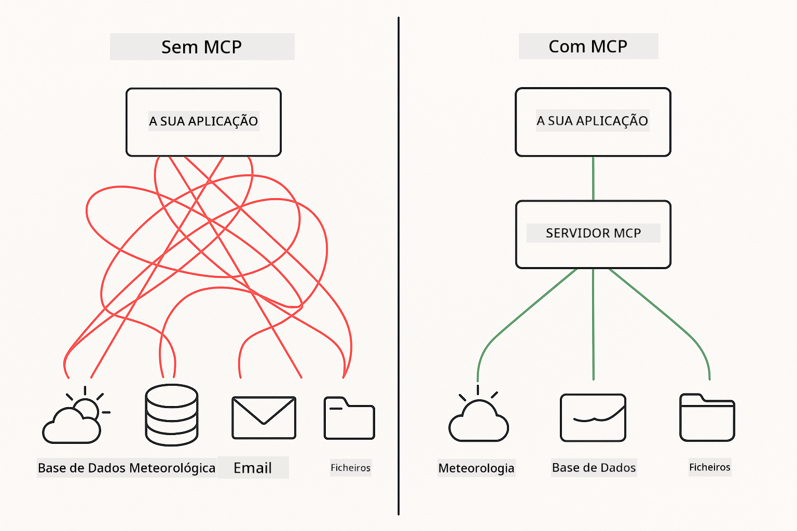
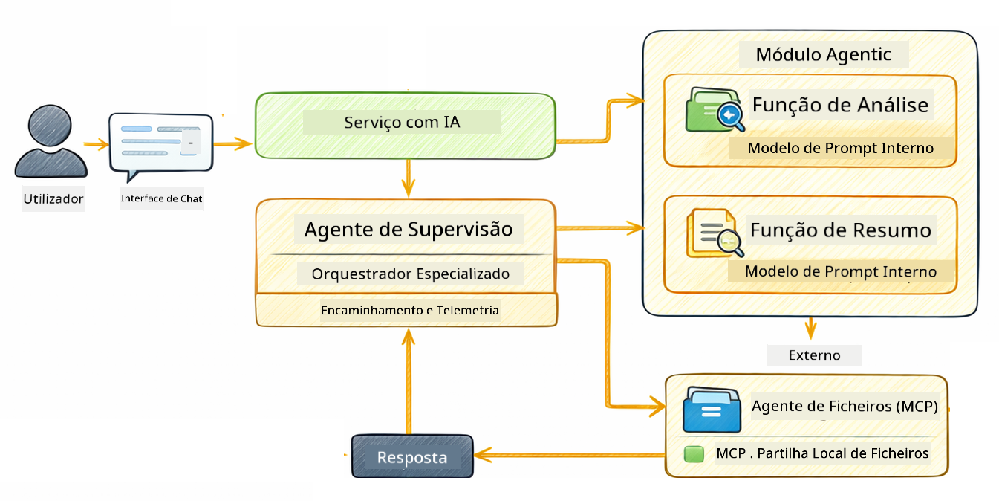

<!--
CO_OP_TRANSLATOR_METADATA:
{
  "original_hash": "6c816d130a1fa47570c11907e72d84ae",
  "translation_date": "2026-01-05T22:58:40+00:00",
  "source_file": "05-mcp/README.md",
  "language_code": "pt"
}
-->
# Módulo 05: Protocolo de Contexto do Modelo (MCP)

## Índice

- [O que vais aprender](../../../05-mcp)
- [O que é MCP?](../../../05-mcp)
- [Como funciona o MCP](../../../05-mcp)
- [O Módulo Agente](../../../05-mcp)
- [Executar os exemplos](../../../05-mcp)
  - [Pré-requisitos](../../../05-mcp)
- [Início Rápido](../../../05-mcp)
  - [Operações de Ficheiros (Stdio)](../../../05-mcp)
  - [Agente Supervisor](../../../05-mcp)
    - [Compreender a saída](../../../05-mcp)
    - [Estratégias de resposta](../../../05-mcp)
    - [Explicação das funcionalidades do Módulo Agente](../../../05-mcp)
- [Conceitos-chave](../../../05-mcp)
- [Parabéns!](../../../05-mcp)
  - [O que vem a seguir?](../../../05-mcp)

## O que vais aprender

Já construíste IA conversacional, dominaste prompts, fundamentaste respostas em documentos e criaste agentes com ferramentas. Mas todas essas ferramentas foram construídas à medida para a tua aplicação específica. E se pudesses dar à tua IA acesso a um ecossistema padronizado de ferramentas que qualquer pessoa pode criar e partilhar? Neste módulo, vais aprender exatamente isso com o Protocolo de Contexto do Modelo (MCP) e o módulo agente do LangChain4j. Primeiro mostramos um simples leitor de ficheiros MCP e depois mostramos como ele se integra facilmente em fluxos de trabalho agente avançados usando o padrão Agente Supervisor.

## O que é MCP?

O Protocolo de Contexto do Modelo (MCP) fornece exatamente isso – uma forma padrão para aplicações de IA descobrirem e usarem ferramentas externas. Em vez de escrever integrações personalizadas para cada fonte de dados ou serviço, conectas-te a servidores MCP que expõem as suas capacidades num formato consistente. O teu agente de IA pode então descobrir e usar essas ferramentas automaticamente.



*Antes do MCP: Integrações ponto-a-ponto complexas. Depois do MCP: Um protocolo, possibilidades infinitas.*

O MCP resolve um problema fundamental no desenvolvimento de IA: cada integração é personalizada. Queres aceder ao GitHub? Código personalizado. Queres ler ficheiros? Código personalizado. Queres consultar uma base de dados? Código personalizado. E nenhuma dessas integrações funciona com outras aplicações de IA.

O MCP padroniza isto. Um servidor MCP expõe ferramentas com descrições claras e esquemas. Qualquer cliente MCP pode conectar-se, descobrir ferramentas disponíveis e usá-las. Constrói uma vez, usa em todo o lado.


*Arquitetura do Protocolo de Contexto do Modelo – descoberta e execução padronizadas de ferramentas*

## Como funciona o MCP

**Arquitetura Servidor-Cliente**

O MCP usa um modelo cliente-servidor. Os servidores fornecem ferramentas – ler ficheiros, consultar bases de dados, chamar APIs. Os clientes (a tua aplicação de IA) conectam-se aos servidores e usam as suas ferramentas.

Para usar MCP com LangChain4j, adiciona esta dependência Maven:

```xml
<dependency>
    <groupId>dev.langchain4j</groupId>
    <artifactId>langchain4j-mcp</artifactId>
    <version>${langchain4j.version}</version>
</dependency>
```

**Descoberta de Ferramentas**

Quando o teu cliente se conecta a um servidor MCP, pergunta "Que ferramentas tens?" O servidor responde com uma lista das ferramentas disponíveis, cada uma com descrições e esquemas de parâmetros. O teu agente de IA pode então decidir que ferramentas usar com base nos pedidos do utilizador.

**Mecanismos de Transporte**

O MCP suporta diferentes mecanismos de transporte. Este módulo demonstra o transporte Stdio para processos locais:


*Mecanismos de transporte MCP: HTTP para servidores remotos, Stdio para processos locais*

**Stdio** – [StdioTransportDemo.java](../../../05-mcp/src/main/java/com/example/langchain4j/mcp/StdioTransportDemo.java)

Para processos locais. A tua aplicação cria um servidor como subprocesso e comunica através da entrada/saída padrão. Útil para acesso ao sistema de ficheiros ou ferramentas de linha de comando.

```java
McpTransport stdioTransport = new StdioMcpTransport.Builder()
    .command(List.of(
        npmCmd, "exec",
        "@modelcontextprotocol/server-filesystem@2025.12.18",
        resourcesDir
    ))
    .logEvents(false)
    .build();
```

> **🤖 Experimenta com o Chat [GitHub Copilot](https://github.com/features/copilot):** Abre [`StdioTransportDemo.java`](../../../05-mcp/src/main/java/com/example/langchain4j/mcp/StdioTransportDemo.java) e pergunta:
> - "Como funciona o transporte Stdio e quando devo usá-lo em vez de HTTP?"
> - "Como é que o LangChain4j gere o ciclo de vida dos processos do servidor MCP criados?"
> - "Quais as implicações de segurança ao dar à IA acesso ao sistema de ficheiros?"

## O Módulo Agente

Enquanto o MCP fornece ferramentas padronizadas, o módulo **agentic** do LangChain4j proporciona uma forma declarativa de construir agentes que orquestram essas ferramentas. A anotação `@Agent` e o `AgenticServices` permitem definir o comportamento do agente através de interfaces, em vez de código imperativo.

Neste módulo, vais explorar o padrão **Agente Supervisor** – uma abordagem agente avançada em que um agente "supervisor" decide dinamicamente quais sub-agentes invocar com base nos pedidos do utilizador. Vamos combinar ambos os conceitos fornecendo a um dos nossos sub-agentes capacidades de acesso a ficheiros potenciais via MCP.

Para usar o módulo agente, adiciona esta dependência Maven:

```xml
<dependency>
    <groupId>dev.langchain4j</groupId>
    <artifactId>langchain4j-agentic</artifactId>
    <version>${langchain4j.mcp.version}</version>
</dependency>
```

> **⚠️ Experimental:** O módulo `langchain4j-agentic` é **experimental** e sujeito a alterações. A forma estável de construir assistentes de IA continua a ser `langchain4j-core` com ferramentas personalizadas (Módulo 04).

## Executar os exemplos

### Pré-requisitos

- Java 21+, Maven 3.9+
- Node.js 16+ e npm (para servidores MCP)
- Variáveis de ambiente configuradas no ficheiro `.env` (a partir do diretório raiz):
  - `AZURE_OPENAI_ENDPOINT`, `AZURE_OPENAI_API_KEY`, `AZURE_OPENAI_DEPLOYMENT` (como nos Módulos 01-04)

> **Nota:** Se ainda não configuraste as tuas variáveis de ambiente, vê [Módulo 00 - Início Rápido](../00-quick-start/README.md) para instruções, ou copia `.env.example` para `.env` no diretório raiz e preenche com os teus valores.

## Início Rápido

**Usando o VS Code:** Basta clicar com o botão direito em qualquer ficheiro demo no Explorador e selecionar **"Run Java"**, ou usar as configurações de lançamento no painel Run and Debug (assegura que já adicionaste o teu token ao ficheiro `.env`).

**Usando Maven:** Alternativamente, podes executar a partir da linha de comandos com os exemplos abaixo.

### Operações de Ficheiros (Stdio)

Demonstra ferramentas baseadas em subprocessos locais.

**✅ Não são necessários pré-requisitos** – o servidor MCP é iniciado automaticamente.

**Usando os Scripts de Arranque (Recomendado):**

Os scripts de arranque carregam automaticamente as variáveis de ambiente do ficheiro `.env` da raiz:

**Bash:**
```bash
cd 05-mcp
chmod +x start-stdio.sh
./start-stdio.sh
```

**PowerShell:**
```powershell
cd 05-mcp
.\start-stdio.ps1
```

**Usando o VS Code:** Clica com o botão direito em `StdioTransportDemo.java` e seleciona **"Run Java"** (garante que o teu ficheiro `.env` está configurado).

A aplicação inicia automaticamente um servidor MCP do sistema de ficheiros e lê um ficheiro local. Repara como a gestão do subprocesso é feita por ti.

**Saída esperada:**
```
Assistant response: The file provides an overview of LangChain4j, an open-source Java library
for integrating Large Language Models (LLMs) into Java applications...
```

### Agente Supervisor

O **padrão Agente Supervisor** é uma forma **flexível** de IA agente. Um Supervisor usa um LLM para decidir autonomamente quais agentes invocar com base no pedido do utilizador. No próximo exemplo, combinamos acesso a ficheiros potenciado por MCP com um agente LLM para criar um fluxo supervisado de leitura → geração de relatório.

No demo, o `FileAgent` lê um ficheiro usando ferramentas MCP do sistema de ficheiros, e o `ReportAgent` gera um relatório estruturado com um resumo executivo (1 frase), 3 pontos-chave e recomendações. O Supervisor orquestra este fluxo automaticamente:



```
┌─────────────┐      ┌──────────────┐
│  FileAgent  │ ───▶ │ ReportAgent  │
│ (MCP tools) │      │  (pure LLM)  │
└─────────────┘      └──────────────┘
   outputKey:           outputKey:
  'fileContent'         'report'
```

Cada agente armazena a sua saída no **Agentic Scope** (memória partilhada), permitindo que agentes subsequentes acedam a resultados anteriores. Isto demonstra como as ferramentas MCP se integram perfeitamente nos fluxos agente – o Supervisor não precisa saber *como* os ficheiros são lidos, apenas que o `FileAgent` o pode fazer.

#### Executar o Demo

Os scripts de arranque carregam automaticamente as variáveis de ambiente do ficheiro `.env` da raiz:

**Bash:**
```bash
cd 05-mcp
chmod +x start-supervisor.sh
./start-supervisor.sh
```

**PowerShell:**
```powershell
cd 05-mcp
.\start-supervisor.ps1
```

**Usando o VS Code:** Clica com o botão direito em `SupervisorAgentDemo.java` e seleciona **"Run Java"** (garante que o teu ficheiro `.env` está configurado).

#### Como funciona o Supervisor

```java
// Passo 1: O FileAgent lê ficheiros usando as ferramentas MCP
FileAgent fileAgent = AgenticServices.agentBuilder(FileAgent.class)
        .chatModel(model)
        .toolProvider(mcpToolProvider)  // Tem ferramentas MCP para operações de ficheiros
        .build();

// Passo 2: O ReportAgent gera relatórios estruturados
ReportAgent reportAgent = AgenticServices.agentBuilder(ReportAgent.class)
        .chatModel(model)
        .build();

// O Supervisor orquestra o fluxo de trabalho ficheiro → relatório
SupervisorAgent supervisor = AgenticServices.supervisorBuilder()
        .chatModel(model)
        .subAgents(fileAgent, reportAgent)
        .responseStrategy(SupervisorResponseStrategy.LAST)  // Retorna o relatório final
        .build();

// O Supervisor decide quais agentes invocar com base no pedido
String response = supervisor.invoke("Read the file at /path/file.txt and generate a report");
```

#### Estratégias de resposta

Quando configuras um `SupervisorAgent`, especificas como ele deve formular a sua resposta final ao utilizador depois dos sub-agentes terem completado as suas tarefas. As estratégias disponíveis são:

| Estratégia | Descrição |
|------------|-----------|
| **LAST**   | O supervisor devolve a saída do último sub-agente ou ferramenta chamado. Isto é útil quando o agente final do fluxo de trabalho é especificamente projetado para produzir a resposta completa e final (ex.: um "Agente de Resumo" numa pipeline de investigação). |
| **SUMMARY**| O supervisor usa o seu próprio Modelo de Linguagem (LLM) interno para sintetizar um resumo de toda a interação e todas as saídas dos sub-agentes, devolvendo esse resumo como resposta final. Isto oferece uma resposta agregada e limpa ao utilizador. |
| **SCORED** | O sistema usa um LLM interno para avaliar tanto a resposta LAST como o SUMÁRIO da interação face ao pedido original do utilizador, devolvendo a saída que obtenha a classificação mais alta. |

Vê [SupervisorAgentDemo.java](../../../05-mcp/src/main/java/com/example/langchain4j/mcp/SupervisorAgentDemo.java) para a implementação completa.

> **🤖 Experimenta com o Chat [GitHub Copilot](https://github.com/features/copilot):** Abre [`SupervisorAgentDemo.java`](../../../05-mcp/src/main/java/com/example/langchain4j/mcp/SupervisorAgentDemo.java) e pergunta:
> - "Como é que o Supervisor decide quais agentes invocar?"
> - "Qual é a diferença entre os padrões Supervisor e Sequential?"
> - "Como posso personalizar o comportamento de planeamento do Supervisor?"

#### Compreender a saída

Quando executas o demo, vais ver uma explicação estruturada de como o Supervisor orquestra múltiplos agentes. Aqui está o significado de cada secção:

```
======================================================================
  FILE → REPORT WORKFLOW DEMO
======================================================================

This demo shows a clear 2-step workflow: read a file, then generate a report.
The Supervisor orchestrates the agents automatically based on the request.
```

**O cabeçalho** introduz o conceito do fluxo de trabalho: um pipeline focado desde a leitura do ficheiro até à geração do relatório.

```
--- WORKFLOW ---------------------------------------------------------
  ┌─────────────┐      ┌──────────────┐
  │  FileAgent  │ ───▶ │ ReportAgent  │
  │ (MCP tools) │      │  (pure LLM)  │
  └─────────────┘      └──────────────┘
   outputKey:           outputKey:
   'fileContent'        'report'

--- AVAILABLE AGENTS -------------------------------------------------
  [FILE]   FileAgent   - Reads files via MCP → stores in 'fileContent'
  [REPORT] ReportAgent - Generates structured report → stores in 'report'
```

**Diagrama do Fluxo de Trabalho** mostra o fluxo de dados entre agentes. Cada agente tem um papel específico:
- **FileAgent** lê ficheiros usando ferramentas MCP e armazena o conteúdo bruto em `fileContent`
- **ReportAgent** consome esse conteúdo e produz um relatório estruturado em `report`

```
--- USER REQUEST -----------------------------------------------------
  "Read the file at .../file.txt and generate a report on its contents"
```

**Pedido do Utilizador** mostra a tarefa. O Supervisor analisa este pedido e decide invocar FileAgent → ReportAgent.

```
--- SUPERVISOR ORCHESTRATION -----------------------------------------
  The Supervisor decides which agents to invoke and passes data between them...

  +-- STEP 1: Supervisor chose -> FileAgent (reading file via MCP)
  |
  |   Input: .../file.txt
  |
  |   Result: LangChain4j is an open-source, provider-agnostic Java framework for building LLM...
  +-- [OK] FileAgent (reading file via MCP) completed

  +-- STEP 2: Supervisor chose -> ReportAgent (generating structured report)
  |
  |   Input: LangChain4j is an open-source, provider-agnostic Java framew...
  |
  |   Result: Executive Summary...
  +-- [OK] ReportAgent (generating structured report) completed
```

**Orquestração do Supervisor** mostra o fluxo em 2 passos em ação:
1. **FileAgent** lê o ficheiro via MCP e armazena o conteúdo
2. **ReportAgent** recebe o conteúdo e gera um relatório estruturado

O Supervisor tomou estas decisões **autonomamente** com base no pedido do utilizador.

```
--- FINAL RESPONSE ---------------------------------------------------
Executive Summary
...

Key Points
...

Recommendations
...

--- AGENTIC SCOPE (Data Flow) ----------------------------------------
  Each agent stores its output for downstream agents to consume:
  * fileContent: LangChain4j is an open-source, provider-agnostic Java framework...
  * report: Executive Summary...
```

#### Explicação das funcionalidades do Módulo Agente

O exemplo demonstra várias funcionalidades avançadas do módulo agentic. Vamos olhar mais atentamente para o Agentic Scope e os Agent Listeners.

**Agentic Scope** mostra a memória partilhada onde os agentes armazenaram os seus resultados usando `@Agent(outputKey="...")`. Isto permite:
- Que agentes posteriores acedam às saídas dos agentes anteriores
- Que o Supervisor sintetize uma resposta final
- Que possas inspecionar o que cada agente produziu

```java
ResultWithAgenticScope<String> result = supervisor.invokeWithAgenticScope(request);
AgenticScope scope = result.agenticScope();
String fileContent = scope.readState("fileContent");  // Dados brutos do ficheiro do FileAgent
String report = scope.readState("report");            // Relatório estruturado do ReportAgent
```

**Agent Listeners** permitem monitorização e depuração da execução dos agentes. A saída passo-a-passo que vês no demo vem de um AgentListener que se liga a cada invocação de agente:
- **beforeAgentInvocation** – Chamado quando o Supervisor seleciona um agente, permitindo ver qual agente foi escolhido e porquê
- **afterAgentInvocation** – Chamado quando um agente termina, mostrando o seu resultado
- **inheritedBySubagents** – Quando verdadeiro, o listener monitora todos os agentes na hierarquia

```java
AgentListener monitor = new AgentListener() {
    private int step = 0;
    
    @Override
    public void beforeAgentInvocation(AgentRequest request) {
        step++;
        System.out.println("  +-- STEP " + step + ": " + request.agentName());
    }
    
    @Override
    public void afterAgentInvocation(AgentResponse response) {
        System.out.println("  +-- [OK] " + response.agentName() + " completed");
    }
    
    @Override
    public boolean inheritedBySubagents() {
        return true; // Propagar para todos os sub-agentes
    }
};
```

Para além do padrão Supervisor, o módulo `langchain4j-agentic` fornece vários padrões e funcionalidades poderosas para fluxos de trabalho:

| Padrão           | Descrição                          | Caso de Uso                           |
|------------------|----------------------------------|-------------------------------------|
| **Sequential**   | Executar agentes por ordem, saída flui para o próximo | Pipelines: investigação → análise → relatório |
| **Parallel**     | Executar agentes simultaneamente  | Tarefas independentes: meteorologia + notícias + ações |
| **Loop**         | Iterar até condição ser cumprida  | Avaliação de qualidade: refinar até pontuação ≥ 0.8 |
| **Conditional**  | Roteamento baseado em condições   | Classificar → encaminhar para agente especialista |
| **Human-in-the-Loop** | Adicionar pontos de verificação humanos | Fluxos de aprovação, revisão de conteúdo |

## Conceitos-chave

Agora que exploraste o MCP e o módulo agentic em ação, vamos resumir quando usar cada abordagem.

**MCP** é ideal quando queres aproveitar ecossistemas de ferramentas existentes, construir ferramentas que múltiplas aplicações possam partilhar, integrar serviços terceiros com protocolos padrão, ou trocar implementações de ferramentas sem mudar código.

**O Módulo Agente** funciona melhor quando queres definições declarativas de agentes com anotações `@Agent`, precisas de orquestração de fluxos de trabalho (sequencial, loop, paralelo), preferes design de agentes baseado em interfaces em vez de código imperativo, ou estás a combinar múltiplos agentes que partilham saídas via `outputKey`.

**O padrão Agente Supervisor** destaca-se quando o fluxo de trabalho não é previsível de antemão e queres que o LLM decida, quando tens múltiplos agentes especializados que precisam de orquestração dinâmica, ao construir sistemas conversacionais que roteiam para diferentes capacidades, ou quando queres o comportamento de agente mais flexível e adaptativo.
## Parabéns!

Concluiu o curso LangChain4j para Iniciantes. Aprendeu:

- Como construir IA conversacional com memória (Módulo 01)
- Padrões de engenharia de prompts para diferentes tarefas (Módulo 02)
- Fundamentar respostas nos seus documentos com RAG (Módulo 03)
- Criar agentes de IA básicos (assistentes) com ferramentas personalizadas (Módulo 04)
- Integrar ferramentas padronizadas com os módulos MCP e Agentic do LangChain4j (Módulo 05)

### O que vem a seguir?

Após concluir os módulos, explore o [Guia de Testes](../docs/TESTING.md) para ver conceitos de testes LangChain4j em ação.

**Recursos Oficiais:**
- [Documentação LangChain4j](https://docs.langchain4j.dev/) - Guias abrangentes e referência de API
- [LangChain4j GitHub](https://github.com/langchain4j/langchain4j) - Código-fonte e exemplos
- [Tutoriais LangChain4j](https://docs.langchain4j.dev/tutorials/) - Tutoriais passo a passo para vários casos de uso

Obrigado por concluir este curso!

---

**Navegação:** [← Anterior: Módulo 04 - Ferramentas](../04-tools/README.md) | [Voltar ao Início](../README.md)

---

<!-- CO-OP TRANSLATOR DISCLAIMER START -->
**Aviso Legal**:  
Este documento foi traduzido utilizando o serviço de tradução automática [Co-op Translator](https://github.com/Azure/co-op-translator). Embora nos esforcemos pela precisão, por favor tenha em conta que as traduções automáticas podem conter erros ou imprecisões. O documento original, no seu idioma nativo, deve ser considerado a fonte autorizada. Para informações críticas, recomenda-se a tradução profissional por um humano. Não nos responsabilizamos por quaisquer mal-entendidos ou interpretações incorretas decorrentes da utilização desta tradução.
<!-- CO-OP TRANSLATOR DISCLAIMER END -->