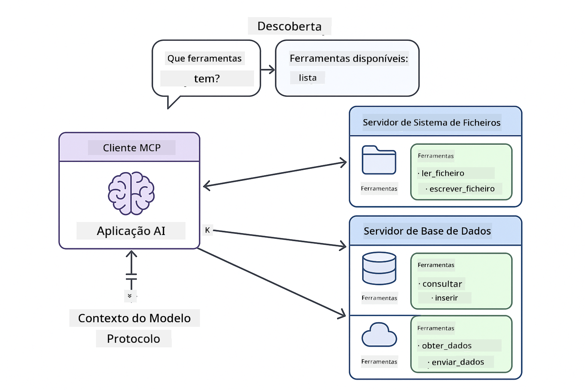

<!--
CO_OP_TRANSLATOR_METADATA:
{
  "original_hash": "c25ec1f10ef156c53e190cdf8b0711ab",
  "translation_date": "2025-12-13T17:49:11+00:00",
  "source_file": "05-mcp/README.md",
  "language_code": "pt"
}
-->
# Módulo 05: Protocolo de Contexto de Modelo (MCP)

## Índice

- [O que vai aprender](../../../05-mcp)
- [Compreender o MCP](../../../05-mcp)
- [Como funciona o MCP](../../../05-mcp)
  - [Arquitetura Servidor-Cliente](../../../05-mcp)
  - [Descoberta de Ferramentas](../../../05-mcp)
  - [Mecanismos de Transporte](../../../05-mcp)
- [Pré-requisitos](../../../05-mcp)
- [O que este módulo cobre](../../../05-mcp)
- [Início Rápido](../../../05-mcp)
  - [Exemplo 1: Calculadora Remota (HTTP Streamable)](../../../05-mcp)
  - [Exemplo 2: Operações de Ficheiros (Stdio)](../../../05-mcp)
  - [Exemplo 3: Análise Git (Docker)](../../../05-mcp)
- [Conceitos-Chave](../../../05-mcp)
  - [Seleção de Transporte](../../../05-mcp)
  - [Descoberta de Ferramentas](../../../05-mcp)
  - [Gestão de Sessões](../../../05-mcp)
  - [Considerações Multiplataforma](../../../05-mcp)
- [Quando usar o MCP](../../../05-mcp)
- [Ecossistema MCP](../../../05-mcp)
- [Parabéns!](../../../05-mcp)
  - [O que vem a seguir?](../../../05-mcp)
- [Resolução de Problemas](../../../05-mcp)

## O que vai aprender

Construiu IA conversacional, dominou prompts, fundamentou respostas em documentos e criou agentes com ferramentas. Mas todas essas ferramentas foram construídas à medida para a sua aplicação específica. E se pudesse dar à sua IA acesso a um ecossistema padronizado de ferramentas que qualquer pessoa pode criar e partilhar?

O Protocolo de Contexto de Modelo (MCP) oferece exatamente isso - uma forma padrão para aplicações de IA descobrirem e usarem ferramentas externas. Em vez de escrever integrações personalizadas para cada fonte de dados ou serviço, liga-se a servidores MCP que expõem as suas capacidades num formato consistente. O seu agente de IA pode então descobrir e usar essas ferramentas automaticamente.


*Antes do MCP: Integrações complexas ponto a ponto. Depois do MCP: Um protocolo, possibilidades infinitas.*

## Compreender o MCP

O MCP resolve um problema fundamental no desenvolvimento de IA: cada integração é personalizada. Quer aceder ao GitHub? Código personalizado. Quer ler ficheiros? Código personalizado. Quer consultar uma base de dados? Código personalizado. E nenhuma dessas integrações funciona com outras aplicações de IA.

O MCP padroniza isto. Um servidor MCP expõe ferramentas com descrições claras e esquemas. Qualquer cliente MCP pode ligar-se, descobrir as ferramentas disponíveis e usá-las. Construa uma vez, use em todo o lado.



*Arquitetura do Protocolo de Contexto de Modelo - descoberta e execução padronizadas de ferramentas*

## Como funciona o MCP

**Arquitetura Servidor-Cliente**

O MCP usa um modelo cliente-servidor. Os servidores fornecem ferramentas - leitura de ficheiros, consultas a bases de dados, chamadas a APIs. Os clientes (a sua aplicação de IA) ligam-se aos servidores e usam as suas ferramentas.

**Descoberta de Ferramentas**

Quando o seu cliente se liga a um servidor MCP, pergunta "Que ferramentas tens?" O servidor responde com uma lista de ferramentas disponíveis, cada uma com descrições e esquemas de parâmetros. O seu agente de IA pode então decidir quais as ferramentas a usar com base nos pedidos do utilizador.

**Mecanismos de Transporte**

O MCP define dois mecanismos de transporte: HTTP para servidores remotos, Stdio para processos locais (incluindo contentores Docker):


*Mecanismos de transporte MCP: HTTP para servidores remotos, Stdio para processos locais (incluindo contentores Docker)*

**Streamable HTTP** - [StreamableHttpDemo.java](../../../05-mcp/src/main/java/com/example/langchain4j/mcp/StreamableHttpDemo.java)

Para servidores remotos. A sua aplicação faz pedidos HTTP a um servidor que corre em algum lugar na rede. Usa Server-Sent Events para comunicação em tempo real.

```java
McpTransport httpTransport = new StreamableHttpMcpTransport.Builder()
    .url("http://localhost:3001/mcp")
    .timeout(Duration.ofSeconds(60))
    .logRequests(true)
    .logResponses(true)
    .build();
```

> **🤖 Experimente com o [GitHub Copilot](https://github.com/features/copilot) Chat:** Abra [`StreamableHttpDemo.java`](../../../05-mcp/src/main/java/com/example/langchain4j/mcp/StreamableHttpDemo.java) e pergunte:
> - "Como é que o MCP difere da integração direta de ferramentas como no Módulo 04?"
> - "Quais são os benefícios de usar o MCP para partilha de ferramentas entre aplicações?"
> - "Como lido com falhas de ligação ou timeouts para servidores MCP?"

**Stdio** - [StdioTransportDemo.java](../../../05-mcp/src/main/java/com/example/langchain4j/mcp/StdioTransportDemo.java)

Para processos locais. A sua aplicação cria um servidor como subprocesso e comunica através da entrada/saída padrão. Útil para acesso ao sistema de ficheiros ou ferramentas de linha de comando.

```java
McpTransport stdioTransport = new StdioMcpTransport.Builder()
    .command(List.of(
        npmCmd, "exec",
        "@modelcontextprotocol/server-filesystem@0.6.2",
        resourcesDir
    ))
    .logEvents(false)
    .build();
```

> **🤖 Experimente com o [GitHub Copilot](https://github.com/features/copilot) Chat:** Abra [`StdioTransportDemo.java`](../../../05-mcp/src/main/java/com/example/langchain4j/mcp/StdioTransportDemo.java) e pergunte:
> - "Como funciona o transporte Stdio e quando devo usá-lo em vez do HTTP?"
> - "Como é que o LangChain4j gere o ciclo de vida dos processos de servidores MCP criados?"
> - "Quais são as implicações de segurança de dar acesso da IA ao sistema de ficheiros?"

**Docker (usa Stdio)** - [GitRepositoryAnalyzer.java](../../../05-mcp/src/main/java/com/example/langchain4j/mcp/GitRepositoryAnalyzer.java)

Para serviços conteinerizados. Usa transporte stdio para comunicar com um contentor Docker via `docker run`. Bom para dependências complexas ou ambientes isolados.

```java
McpTransport dockerTransport = new StdioMcpTransport.Builder()
    .command(List.of(
        "docker", "run",
        "-e", "GITHUB_PERSONAL_ACCESS_TOKEN=" + System.getenv("GITHUB_TOKEN"),
        "-v", volumeMapping,
        "-i", "mcp/git"
    ))
    .logEvents(true)
    .build();
```

> **🤖 Experimente com o [GitHub Copilot](https://github.com/features/copilot) Chat:** Abra [`GitRepositoryAnalyzer.java`](../../../05-mcp/src/main/java/com/example/langchain4j/mcp/GitRepositoryAnalyzer.java) e pergunte:
> - "Como é que o transporte Docker isola os servidores MCP e quais são os benefícios?"
> - "Como configuro montagens de volumes para partilhar dados entre o host e os contentores MCP?"
> - "Quais são as melhores práticas para gerir ciclos de vida de servidores MCP baseados em Docker em produção?"

## Executar os Exemplos

### Pré-requisitos

- Java 21+, Maven 3.9+
- Node.js 16+ e npm (para servidores MCP)
- **Docker Desktop** - Deve estar **A CORRER** para o Exemplo 3 (não basta estar instalado)
- Token de Acesso Pessoal GitHub configurado no ficheiro `.env` (do Módulo 00)

> **Nota:** Se ainda não configurou o seu token GitHub, veja [Módulo 00 - Início Rápido](../00-quick-start/README.md) para instruções.

> **⚠️ Utilizadores Docker:** Antes de executar o Exemplo 3, verifique se o Docker Desktop está a correr com `docker ps`. Se vir erros de ligação, inicie o Docker Desktop e aguarde ~30 segundos para a inicialização.

## Início Rápido

**Usando VS Code:** Clique com o botão direito em qualquer ficheiro de demonstração no Explorador e selecione **"Run Java"**, ou use as configurações de lançamento no painel Executar e Depurar (certifique-se de que adicionou o seu token ao ficheiro `.env` primeiro).

**Usando Maven:** Alternativamente, pode executar a partir da linha de comandos com os exemplos abaixo.

**⚠️ Importante:** Alguns exemplos têm pré-requisitos (como iniciar um servidor MCP ou construir imagens Docker). Verifique os requisitos de cada exemplo antes de executar.

### Exemplo 1: Calculadora Remota (HTTP Streamable)

Demonstra integração de ferramentas baseada em rede.

**⚠️ Pré-requisito:** Precisa de iniciar o servidor MCP primeiro (veja o Terminal 1 abaixo).

**Terminal 1 - Iniciar o servidor MCP:**

**Bash:**
```bash
git clone https://github.com/modelcontextprotocol/servers.git
cd servers/src/everything
npm install
node dist/streamableHttp.js
```

**PowerShell:**
```powershell
git clone https://github.com/modelcontextprotocol/servers.git
cd servers/src/everything
npm install
node dist/streamableHttp.js
```

**Terminal 2 - Executar o exemplo:**

**Usando VS Code:** Clique com o botão direito em `StreamableHttpDemo.java` e selecione **"Run Java"**.

**Usando Maven:**

**Bash:**
```bash
export GITHUB_TOKEN=your_token_here
cd 05-mcp
mvn compile exec:java -Dexec.mainClass=com.example.langchain4j.mcp.StreamableHttpDemo
```

**PowerShell:**
```powershell
$env:GITHUB_TOKEN=your_token_here
cd 05-mcp
mvn --% compile exec:java -Dexec.mainClass=com.example.langchain4j.mcp.StreamableHttpDemo
```

Observe o agente a descobrir as ferramentas disponíveis, depois use a calculadora para realizar uma adição.

### Exemplo 2: Operações de Ficheiros (Stdio)

Demonstra ferramentas baseadas em subprocessos locais.

**✅ Sem pré-requisitos** - o servidor MCP é criado automaticamente.

**Usando VS Code:** Clique com o botão direito em `StdioTransportDemo.java` e selecione **"Run Java"**.

**Usando Maven:**

**Bash:**
```bash
export GITHUB_TOKEN=your_token_here
cd 05-mcp
mvn compile exec:java -Dexec.mainClass=com.example.langchain4j.mcp.StdioTransportDemo
```

**PowerShell:**
```powershell
$env:GITHUB_TOKEN=your_token_here
cd 05-mcp
mvn --% compile exec:java -Dexec.mainClass=com.example.langchain4j.mcp.StdioTransportDemo
```

A aplicação cria automaticamente um servidor MCP do sistema de ficheiros e lê um ficheiro local. Note como a gestão do subprocesso é tratada para si.

**Saída esperada:**
```
Assistant response: The content of the file is "Kaboom!".
```

### Exemplo 3: Análise Git (Docker)

Demonstra servidores de ferramentas conteinerizados.

**⚠️ Pré-requisitos:** 
1. **Docker Desktop deve estar A CORRER** (não basta estar instalado)
2. **Utilizadores Windows:** modo WSL 2 recomendado (Configurações Docker Desktop → Geral → "Usar o motor baseado em WSL 2"). O modo Hyper-V requer configuração manual de partilha de ficheiros.
3. Precisa de construir a imagem Docker primeiro (veja o Terminal 1 abaixo)

**Verifique se o Docker está a correr:**

**Bash:**
```bash
docker ps  # Deve mostrar a lista de contentores, não um erro
```

**PowerShell:**
```powershell
docker ps  # Deve mostrar a lista de contentores, não um erro
```

Se vir um erro como "Cannot connect to Docker daemon" ou "The system cannot find the file specified", inicie o Docker Desktop e aguarde a inicialização (~30 segundos).

**Resolução de problemas:**
- Se a IA reportar um repositório vazio ou sem ficheiros, a montagem do volume (`-v`) não está a funcionar.
- **Utilizadores Windows Hyper-V:** Adicione o diretório do projeto em Configurações Docker Desktop → Recursos → Partilha de ficheiros, depois reinicie o Docker Desktop.
- **Solução recomendada:** Mude para o modo WSL 2 para partilha automática de ficheiros (Configurações → Geral → ative "Usar o motor baseado em WSL 2").

**Terminal 1 - Construir a imagem Docker:**

**Bash:**
```bash
cd servers/src/git
docker build -t mcp/git .
```

**PowerShell:**
```powershell
cd servers/src/git
docker build -t mcp/git .
```

**Terminal 2 - Executar o analisador:**

**Usando VS Code:** Clique com o botão direito em `GitRepositoryAnalyzer.java` e selecione **"Run Java"**.

**Usando Maven:**

**Bash:**
```bash
export GITHUB_TOKEN=your_token_here
cd 05-mcp
mvn compile exec:java -Dexec.mainClass=com.example.langchain4j.mcp.GitRepositoryAnalyzer
```

**PowerShell:**
```powershell
$env:GITHUB_TOKEN=your_token_here
cd 05-mcp
mvn --% compile exec:java -Dexec.mainClass=com.example.langchain4j.mcp.GitRepositoryAnalyzer
```

A aplicação lança um contentor Docker, monta o seu repositório e analisa a estrutura e conteúdos do repositório através do agente de IA.

## Conceitos-Chave

**Seleção de Transporte**

Escolha com base em onde vivem as suas ferramentas:
- Serviços remotos → HTTP Streamable
- Sistema de ficheiros local → Stdio
- Dependências complexas → Docker

**Descoberta de Ferramentas**

Os clientes MCP descobrem automaticamente as ferramentas disponíveis ao ligar. O seu agente de IA vê as descrições das ferramentas e decide quais usar com base no pedido do utilizador.

**Gestão de Sessões**

O transporte HTTP Streamable mantém sessões, permitindo interações com estado com servidores remotos. Os transportes Stdio e Docker são tipicamente sem estado.

**Considerações Multiplataforma**

Os exemplos tratam automaticamente as diferenças de plataforma (diferenças de comandos Windows vs Unix, conversões de caminhos para Docker). Isto é importante para implementações em produção em diferentes ambientes.

## Quando usar o MCP

**Use MCP quando:**
- Quer aproveitar ecossistemas de ferramentas existentes
- Construir ferramentas que várias aplicações vão usar
- Integrar serviços de terceiros com protocolos padrão
- Precisa trocar implementações de ferramentas sem alterar código

**Use ferramentas personalizadas (Módulo 04) quando:**
- Construir funcionalidades específicas da aplicação
- O desempenho é crítico (MCP adiciona overhead)
- As suas ferramentas são simples e não serão reutilizadas
- Precisa de controlo total sobre a execução


## Ecossistema MCP

O Protocolo de Contexto de Modelo é um padrão aberto com um ecossistema em crescimento:

- Servidores MCP oficiais para tarefas comuns (sistema de ficheiros, Git, bases de dados)
- Servidores contribuídos pela comunidade para vários serviços
- Descrições e esquemas padronizados de ferramentas
- Compatibilidade entre frameworks (funciona com qualquer cliente MCP)

Esta padronização significa que ferramentas construídas para uma aplicação de IA funcionam com outras, criando um ecossistema partilhado de capacidades.

## Parabéns!

Concluiu o curso LangChain4j para Iniciantes. Aprendeu:

- Como construir IA conversacional com memória (Módulo 01)
- Padrões de engenharia de prompts para diferentes tarefas (Módulo 02)
- Fundamentar respostas nos seus documentos com RAG (Módulo 03)
- Criar agentes de IA com ferramentas personalizadas (Módulo 04)
- Integrar ferramentas padronizadas através do MCP (Módulo 05)

Agora tem a base para construir aplicações de IA em produção. Os conceitos que aprendeu aplicam-se independentemente de frameworks ou modelos específicos - são padrões fundamentais na engenharia de IA.

### O que vem a seguir?

Depois de concluir os módulos, explore o [Guia de Testes](../docs/TESTING.md) para ver conceitos de testes LangChain4j em ação.

**Recursos Oficiais:**
- [Documentação LangChain4j](https://docs.langchain4j.dev/) - Guias abrangentes e referência API
- [LangChain4j GitHub](https://github.com/langchain4j/langchain4j) - Código fonte e exemplos
- [Tutoriais LangChain4j](https://docs.langchain4j.dev/tutorials/) - Tutoriais passo a passo para vários casos de uso

Obrigado por concluir este curso!

---

**Navegação:** [← Anterior: Módulo 04 - Ferramentas](../04-tools/README.md) | [Voltar ao Início](../README.md)

---

## Resolução de Problemas

### Sintaxe do Comando Maven no PowerShell
**Problema**: Comandos Maven falham com o erro `Unknown lifecycle phase ".mainClass=..."`

**Causa**: O PowerShell interpreta `=` como operador de atribuição de variável, quebrando a sintaxe da propriedade Maven

**Solução**: Use o operador de paragem de parsing `--%` antes do comando Maven:

**PowerShell:**
```powershell
mvn --% compile exec:java -Dexec.mainClass=com.example.langchain4j.mcp.StreamableHttpDemo
```

**Bash:**
```bash
mvn compile exec:java -Dexec.mainClass=com.example.langchain4j.mcp.StreamableHttpDemo
```

O operador `--%` indica ao PowerShell para passar todos os argumentos restantes literalmente para o Maven sem interpretação.

### Problemas de Conexão com Docker

**Problema**: Comandos Docker falham com "Cannot connect to Docker daemon" ou "The system cannot find the file specified"

**Causa**: Docker Desktop não está a correr ou não está totalmente inicializado

**Solução**: 
1. Inicie o Docker Desktop
2. Aguarde cerca de 30 segundos para a inicialização completa
3. Verifique com `docker ps` (deve mostrar a lista de containers, não um erro)
4. Depois execute o seu exemplo

### Montagem de Volume Docker no Windows

**Problema**: O analisador do repositório Git reporta repositório vazio ou sem ficheiros

**Causa**: Montagem de volume (`-v`) não funciona devido à configuração de partilha de ficheiros

**Solução**:
- **Recomendado:** Mude para o modo WSL 2 (Definições do Docker Desktop → Geral → "Use the WSL 2 based engine")
- **Alternativa (Hyper-V):** Adicione o diretório do projeto em Definições do Docker Desktop → Recursos → Partilha de ficheiros, depois reinicie o Docker Desktop

---

<!-- CO-OP TRANSLATOR DISCLAIMER START -->
**Aviso Legal**:
Este documento foi traduzido utilizando o serviço de tradução por IA [Co-op Translator](https://github.com/Azure/co-op-translator). Embora nos esforcemos para garantir a precisão, por favor tenha em conta que traduções automáticas podem conter erros ou imprecisões. O documento original na sua língua nativa deve ser considerado a fonte autorizada. Para informações críticas, recomenda-se a tradução profissional humana. Não nos responsabilizamos por quaisquer mal-entendidos ou interpretações erradas decorrentes do uso desta tradução.
<!-- CO-OP TRANSLATOR DISCLAIMER END -->