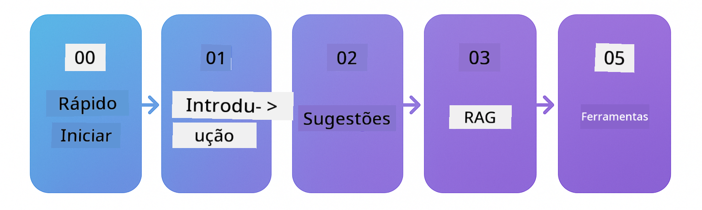

<!--
CO_OP_TRANSLATOR_METADATA:
{
  "original_hash": "e137234b4d3a7fcbbfc93bf17ae8a621",
  "translation_date": "2025-12-19T10:13:46+00:00",
  "source_file": "README.md",
  "language_code": "pt"
}
-->


### 🌐 Suporte Multilíngue

#### Suportado via GitHub Action (Automatizado e Sempre Atualizado)

<!-- CO-OP TRANSLATOR LANGUAGES TABLE START -->
[Árabe](../ar/README.md) | [Bengali](../bn/README.md) | [Búlgaro](../bg/README.md) | [Birmanês (Myanmar)](../my/README.md) | [Chinês (Simplificado)](../zh/README.md) | [Chinês (Tradicional, Hong Kong)](../hk/README.md) | [Chinês (Tradicional, Macau)](../mo/README.md) | [Chinês (Tradicional, Taiwan)](../tw/README.md) | [Croata](../hr/README.md) | [Checo](../cs/README.md) | [Dinamarquês](../da/README.md) | [Holandês](../nl/README.md) | [Estónio](../et/README.md) | [Finlandês](../fi/README.md) | [Francês](../fr/README.md) | [Alemão](../de/README.md) | [Grego](../el/README.md) | [Hebraico](../he/README.md) | [Hindi](../hi/README.md) | [Húngaro](../hu/README.md) | [Indonésio](../id/README.md) | [Italiano](../it/README.md) | [Japonês](../ja/README.md) | [Kannada](../kn/README.md) | [Coreano](../ko/README.md) | [Lituano](../lt/README.md) | [Malaio](../ms/README.md) | [Malaiala](../ml/README.md) | [Marata](../mr/README.md) | [Nepali](../ne/README.md) | [Pidgin Nigeriano](../pcm/README.md) | [Norueguês](../no/README.md) | [Persa (Farsi)](../fa/README.md) | [Polaco](../pl/README.md) | [Português (Brasil)](../br/README.md) | [Português (Portugal)](./README.md) | [Punjabi (Gurmukhi)](../pa/README.md) | [Romeno](../ro/README.md) | [Russo](../ru/README.md) | [Sérvio (Cirílico)](../sr/README.md) | [Eslovaco](../sk/README.md) | [Esloveno](../sl/README.md) | [Espanhol](../es/README.md) | [Suaíli](../sw/README.md) | [Sueco](../sv/README.md) | [Tagalo (Filipino)](../tl/README.md) | [Tamil](../ta/README.md) | [Telugu](../te/README.md) | [Tailandês](../th/README.md) | [Turco](../tr/README.md) | [Ucraniano](../uk/README.md) | [Urdu](../ur/README.md) | [Vietnamita](../vi/README.md)
<!-- CO-OP TRANSLATOR LANGUAGES TABLE END -->

# LangChain4j para Iniciantes

Um curso para construir aplicações de IA com LangChain4j e Azure OpenAI GPT-5, desde chat básico a agentes de IA.

**Novo no LangChain4j?** Consulte o [Glossário](docs/GLOSSARY.md) para definições de termos e conceitos chave.

## Índice

1. [Início Rápido](00-quick-start/README.md) - Comece com LangChain4j
2. [Introdução](01-introduction/README.md) - Aprenda os fundamentos do LangChain4j
3. [Engenharia de Prompt](02-prompt-engineering/README.md) - Domine o design eficaz de prompts
4. [RAG (Geração Aumentada por Recuperação)](03-rag/README.md) - Construa sistemas inteligentes baseados em conhecimento
5. [Ferramentas](04-tools/README.md) - Integre ferramentas externas e APIs com agentes de IA
6. [MCP (Protocolo de Contexto de Modelo)](05-mcp/README.md) - Trabalhe com o Protocolo de Contexto de Modelo
---

## Caminho de Aprendizagem

> **Início Rápido**

1. Faça um fork deste repositório para a sua conta GitHub
2. Clique em **Code** → separador **Codespaces** → **...** → **Novo com opções...**
3. Use as predefinições – isto selecionará o contentor de Desenvolvimento criado para este curso
4. Clique em **Criar codespace**
5. Aguarde 5-10 minutos para o ambiente estar pronto
6. Vá diretamente para [Início Rápido](./00-quick-start/README.md) para começar!

> **Prefere Clonar Localmente?**
>
> Este repositório inclui mais de 50 traduções de idiomas, o que aumenta significativamente o tamanho do download. Para clonar sem traduções, use checkout esparso:
> ```bash
> git clone --filter=blob:none --sparse https://github.com/microsoft/LangChain4j-for-Beginners.git
> cd LangChain4j-for-Beginners
> git sparse-checkout set --no-cone '/*' '!translations' '!translated_images'
> ```
> Isto dá-lhe tudo o que precisa para completar o curso com um download muito mais rápido.

Comece pelo módulo [Início Rápido](00-quick-start/README.md) e progrida por cada módulo para desenvolver as suas competências passo a passo. Vai experimentar exemplos básicos para entender os fundamentos antes de avançar para o módulo [Introdução](01-introduction/README.md) para um mergulho mais profundo com GPT-5.



Após completar os módulos, explore o [Guia de Testes](docs/TESTING.md) para ver os conceitos de testes do LangChain4j em ação.

> **Nota:** Esta formação usa tanto os Modelos GitHub como o Azure OpenAI. Os módulos [Início Rápido](00-quick-start/README.md) e [MCP](05-mcp/README.md) usam Modelos GitHub (não é necessária subscrição Azure), enquanto os módulos 1-4 usam Azure OpenAI GPT-5.


## Aprender com GitHub Copilot

Para começar a programar rapidamente, abra este projeto num GitHub Codespace ou no seu IDE local com o devcontainer fornecido. O devcontainer usado neste curso vem pré-configurado com GitHub Copilot para programação em par com IA.

Cada exemplo de código inclui perguntas sugeridas que pode fazer ao GitHub Copilot para aprofundar a sua compreensão. Procure os prompts 💡/🤖 em:

- **Cabeçalhos de ficheiros Java** - Perguntas específicas para cada exemplo
- **READMEs dos módulos** - Prompts de exploração após exemplos de código

**Como usar:** Abra qualquer ficheiro de código e faça ao Copilot as perguntas sugeridas. Ele tem contexto completo da base de código e pode explicar, expandir e sugerir alternativas.

Quer aprender mais? Consulte [Copilot para Programação em Par com IA](https://aka.ms/GitHubCopilotAI).


## Recursos Adicionais

<!-- CO-OP TRANSLATOR OTHER COURSES START -->
### LangChain
[](https://aka.ms/langchain4j-for-beginners)
[](https://aka.ms/langchainjs-for-beginners?WT.mc_id=m365-94501-dwahlin)

---

### Azure / Edge / MCP / Agentes
[](https://github.com/microsoft/AZD-for-beginners?WT.mc_id=academic-105485-koreyst)
[](https://github.com/microsoft/edgeai-for-beginners?WT.mc_id=academic-105485-koreyst)
[](https://github.com/microsoft/mcp-for-beginners?WT.mc_id=academic-105485-koreyst)
[](https://github.com/microsoft/ai-agents-for-beginners?WT.mc_id=academic-105485-koreyst)

---
 
### Série de IA Generativa
[](https://github.com/microsoft/generative-ai-for-beginners?WT.mc_id=academic-105485-koreyst)
[-9333EA?style=for-the-badge&labelColor=E5E7EB&color=9333EA)](https://github.com/microsoft/Generative-AI-for-beginners-dotnet?WT.mc_id=academic-105485-koreyst)
[-C084FC?style=for-the-badge&labelColor=E5E7EB&color=C084FC)](https://github.com/microsoft/generative-ai-for-beginners-java?WT.mc_id=academic-105485-koreyst)
[-E879F9?style=for-the-badge&labelColor=E5E7EB&color=E879F9)](https://github.com/microsoft/generative-ai-with-javascript?WT.mc_id=academic-105485-koreyst)

---
 
### Aprendizagem Fundamental
[](https://aka.ms/ml-beginners?WT.mc_id=academic-105485-koreyst)
[](https://aka.ms/datascience-beginners?WT.mc_id=academic-105485-koreyst)
[](https://aka.ms/ai-beginners?WT.mc_id=academic-105485-koreyst)
[](https://github.com/microsoft/Security-101?WT.mc_id=academic-96948-sayoung)
[](https://aka.ms/webdev-beginners?WT.mc_id=academic-105485-koreyst)
[](https://aka.ms/iot-beginners?WT.mc_id=academic-105485-koreyst)
[](https://github.com/microsoft/xr-development-for-beginners?WT.mc_id=academic-105485-koreyst)

---
 
### Série Copilot
[](https://aka.ms/GitHubCopilotAI?WT.mc_id=academic-105485-koreyst)
[](https://github.com/microsoft/mastering-github-copilot-for-dotnet-csharp-developers?WT.mc_id=academic-105485-koreyst)
[](https://github.com/microsoft/CopilotAdventures?WT.mc_id=academic-105485-koreyst)
<!-- CO-OP TRANSLATOR OTHER COURSES END -->

## Obter Ajuda

Se ficar bloqueado ou tiver alguma dúvida sobre como criar aplicações de IA, junte-se a:

[](https://aka.ms/foundry/discord)

Se tiver feedback sobre o produto ou erros durante a criação, visite:

[](https://aka.ms/foundry/forum)

## Licença

Licença MIT - Veja o ficheiro [LICENSE](../../LICENSE) para detalhes.

---

<!-- CO-OP TRANSLATOR DISCLAIMER START -->
**Aviso Legal**:
Este documento foi traduzido utilizando o serviço de tradução automática [Co-op Translator](https://github.com/Azure/co-op-translator). Embora nos esforcemos para garantir a precisão, por favor tenha em conta que traduções automáticas podem conter erros ou imprecisões. O documento original na sua língua nativa deve ser considerado a fonte autorizada. Para informações críticas, recomenda-se a tradução profissional humana. Não nos responsabilizamos por quaisquer mal-entendidos ou interpretações erradas decorrentes do uso desta tradução.
<!-- CO-OP TRANSLATOR DISCLAIMER END -->